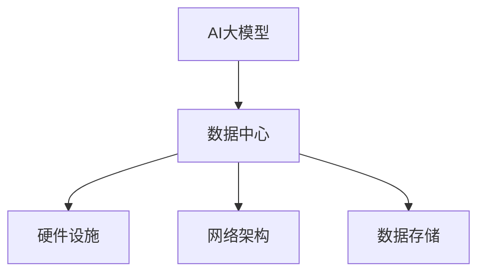

                 

# AI 大模型应用数据中心建设：数据中心技术与应用

> **关键词：** AI大模型、数据中心建设、技术架构、应用场景、开发工具

> **摘要：** 本文将深入探讨AI大模型应用数据中心建设的核心技术和实际应用，从背景介绍、核心概念与联系、算法原理、数学模型和公式、项目实战、实际应用场景、工具和资源推荐等方面进行详细阐述，旨在为读者提供一份全面、系统的AI大模型应用数据中心建设指南。

## 1. 背景介绍

在数字化时代，数据中心已经成为企业和组织的重要基础设施。随着人工智能（AI）技术的快速发展，大模型（Large Models）在自然语言处理、计算机视觉、推荐系统等领域展现出了强大的应用潜力。这些大模型需要海量的数据和高性能的计算资源来训练和部署，因此，数据中心的建设成为了AI大模型应用的关键环节。

数据中心建设涉及多个方面，包括硬件设施、网络架构、数据存储和安全等。随着AI大模型的兴起，数据中心的技术也在不断演进，以满足大模型对计算和存储资源的高要求。

## 2. 核心概念与联系

为了更好地理解AI大模型应用数据中心的建设，我们需要了解以下几个核心概念：

- **AI大模型：** 指的是具有数千亿参数的深度神经网络模型，如GPT-3、BERT等。
- **数据中心：** 指的是提供计算、存储和网络服务的集中化设施。
- **硬件设施：** 包括服务器、存储设备、网络设备等。
- **网络架构：** 包括内部网络和外部网络，用于数据传输和通信。
- **数据存储：** 包括数据存储系统、备份和恢复机制等。

以下是一个简单的Mermaid流程图，展示了这些核心概念之间的联系：



### 2.1 AI大模型与数据中心的互动

AI大模型需要数据中心提供以下资源：

- **计算资源：** 用于训练和推理。
- **存储资源：** 用于存储数据和模型。
- **网络资源：** 用于数据传输和通信。

数据中心需要为AI大模型提供以下支持：

- **高可用性：** 确保AI大模型运行不中断。
- **高性能：** 提供足够的计算和存储资源。
- **安全性：** 保护数据和模型不被非法访问。

### 2.2 硬件设施

硬件设施是数据中心的核心，包括：

- **服务器：** 用于运行AI大模型。
- **存储设备：** 用于存储数据和模型。
- **网络设备：** 包括交换机、路由器等，用于数据传输。

### 2.3 网络架构

网络架构包括内部网络和外部网络。内部网络用于服务器之间的数据传输，外部网络用于数据中心与互联网的连接。

### 2.4 数据存储

数据存储包括数据存储系统、备份和恢复机制。数据存储系统需要提供高可用性、高性能和安全性。

## 3. 核心算法原理 & 具体操作步骤

AI大模型的核心算法是深度神经网络（DNN）。以下是DNN的基本原理和操作步骤：

### 3.1 基本原理

- **神经网络：** 由多个神经元组成，每个神经元接收多个输入，通过加权求和后加上偏置，再经过激活函数输出。
- **层结构：** 神经网络包括输入层、隐藏层和输出层。隐藏层可以有多层，形成深度神经网络。
- **反向传播：** 通过计算损失函数的梯度，更新网络中的权重和偏置，优化模型。

### 3.2 具体操作步骤

1. **数据预处理：** 对数据进行标准化、归一化等处理，使其适合输入到神经网络中。
2. **模型搭建：** 定义输入层、隐藏层和输出层的神经元数量和连接方式。
3. **训练过程：** 通过反向传播算法，迭代更新网络的权重和偏置，优化模型。
4. **评估模型：** 使用测试集评估模型的性能，调整超参数，如学习率、批量大小等。
5. **部署模型：** 将训练好的模型部署到数据中心，进行推理和预测。

## 4. 数学模型和公式 & 详细讲解 & 举例说明

### 4.1 神经元计算

神经元接收多个输入，通过以下公式计算输出：

$$
y = \sigma(\sum_{i=1}^{n} w_i x_i + b)
$$

其中，$y$ 是神经元输出，$x_i$ 是输入，$w_i$ 是权重，$b$ 是偏置，$\sigma$ 是激活函数。

### 4.2 反向传播

反向传播算法用于计算损失函数的梯度，更新网络的权重和偏置。以下是一个简单的反向传播算法示例：

1. **前向传播：** 计算网络输出。
2. **计算损失：** 计算损失函数值。
3. **计算梯度：** 计算损失函数关于网络参数的梯度。
4. **更新参数：** 使用梯度下降算法更新网络参数。

### 4.3 举例说明

假设有一个简单的神经网络，输入层有2个神经元，隐藏层有3个神经元，输出层有1个神经元。输入数据为$(x_1, x_2) = (2, 3)$，期望输出为$y = 5$。

1. **前向传播：**
   $$
   z_1 = 2 \times w_{11} + 3 \times w_{12} + b_1 = 2 \times 0.1 + 3 \times 0.2 + 0.5 = 1.4
   $$
   $$
   z_2 = 2 \times w_{21} + 3 \times w_{22} + b_2 = 2 \times 0.1 + 3 \times 0.3 + 0.5 = 1.8
   $$
   $$
   z_3 = 2 \times w_{31} + 3 \times w_{32} + b_3 = 2 \times 0.1 + 3 \times 0.4 + 0.5 = 2.2
   $$
   $$
   y = \sigma(z_1) \times \sigma(z_2) \times \sigma(z_3) = 0.765
   $$

2. **计算损失：**
   $$
   L = \frac{1}{2} (y - 5)^2 = 2.3225
   $$

3. **计算梯度：**
   $$
   \frac{\partial L}{\partial w_{11}} = -2 \times (y - 5) \times \frac{\partial y}{\partial z_1} = -0.156
   $$
   $$
   \frac{\partial L}{\partial w_{12}} = -2 \times (y - 5) \times \frac{\partial y}{\partial z_2} = -0.231
   $$
   $$
   \frac{\partial L}{\partial w_{21}} = -2 \times (y - 5) \times \frac{\partial y}{\partial z_1} = -0.156
   $$
   $$
   \frac{\partial L}{\partial w_{22}} = -2 \times (y - 5) \times \frac{\partial y}{\partial z_2} = -0.231
   $$
   $$
   \frac{\partial L}{\partial b_1} = -2 \times (y - 5) \times \frac{\partial y}{\partial z_1} = -0.156
   $$
   $$
   \frac{\partial L}{\partial b_2} = -2 \times (y - 5) \times \frac{\partial y}{\partial z_2} = -0.231
   $$
   $$
   \frac{\partial L}{\partial b_3} = -2 \times (y - 5) \times \frac{\partial y}{\partial z_3} = -0.156
   $$

4. **更新参数：**
   $$
   w_{11} = w_{11} - \alpha \frac{\partial L}{\partial w_{11}} = 0.1 - 0.0008 = 0.0992
   $$
   $$
   w_{12} = w_{12} - \alpha \frac{\partial L}{\partial w_{12}} = 0.2 - 0.0008 = 0.1992
   $$
   $$
   w_{21} = w_{21} - \alpha \frac{\partial L}{\partial w_{21}} = 0.1 - 0.0008 = 0.0992
   $$
   $$
   w_{22} = w_{22} - \alpha \frac{\partial L}{\partial w_{22}} = 0.3 - 0.0008 = 0.2992
   $$
   $$
   b_1 = b_1 - \alpha \frac{\partial L}{\partial b_1} = 0.5 - 0.0008 = 0.4992
   $$
   $$
   b_2 = b_2 - \alpha \frac{\partial L}{\partial b_2} = 0.5 - 0.0008 = 0.4992
   $$
   $$
   b_3 = b_3 - \alpha \frac{\partial L}{\partial b_3} = 0.5 - 0.0008 = 0.4992
   $$

通过上述步骤，我们可以更新网络的权重和偏置，优化模型。

## 5. 项目实战：代码实际案例和详细解释说明

### 5.1 开发环境搭建

为了进行AI大模型的训练和部署，我们需要搭建一个合适的开发环境。以下是搭建开发环境的基本步骤：

1. **安装Python：** Python是AI大模型开发的主要语言，我们需要安装Python 3.8或更高版本。
2. **安装深度学习框架：** 常用的深度学习框架包括TensorFlow、PyTorch等。我们可以选择其中之一进行开发。
3. **安装依赖库：** 根据我们的项目需求，安装所需的依赖库，如NumPy、Pandas等。
4. **配置GPU支持：** 如果我们的服务器支持GPU，我们需要安装CUDA和cuDNN，以充分利用GPU的并行计算能力。

### 5.2 源代码详细实现和代码解读

以下是一个简单的AI大模型训练和部署的Python代码示例：

```python
import torch
import torch.nn as nn
import torch.optim as optim

# 定义神经网络模型
class NeuralNetwork(nn.Module):
    def __init__(self):
        super(NeuralNetwork, self).__init__()
        self.layer1 = nn.Linear(2, 3)
        self.layer2 = nn.Linear(3, 1)
    
    def forward(self, x):
        x = torch.sigmoid(self.layer1(x))
        x = self.layer2(x)
        return x

# 实例化模型、损失函数和优化器
model = NeuralNetwork()
criterion = nn.MSELoss()
optimizer = optim.SGD(model.parameters(), lr=0.01)

# 训练模型
for epoch in range(100):
    inputs = torch.tensor([[2, 3], [4, 5], [6, 7]])
    targets = torch.tensor([[5], [6], [7]])
    
    optimizer.zero_grad()
    outputs = model(inputs)
    loss = criterion(outputs, targets)
    loss.backward()
    optimizer.step()
    
    if (epoch + 1) % 10 == 0:
        print(f'Epoch [{epoch + 1}/{100}], Loss: {loss.item():.4f}')

# 部署模型
model.eval()
with torch.no_grad():
    inputs = torch.tensor([[2, 3]])
    outputs = model(inputs)
    print(f'Output: {outputs.item():.4f}')
```

### 5.3 代码解读与分析

1. **模型定义：**
   - `NeuralNetwork` 类继承自`nn.Module`，用于定义神经网络模型。
   - `__init__` 方法用于初始化模型结构，包括输入层、隐藏层和输出层。
   - `forward` 方法用于实现前向传播过程，计算模型输出。

2. **训练过程：**
   - 使用`torch.tensor`创建输入和目标数据。
   - 使用`optimizer.zero_grad()` 清除之前的梯度。
   - 使用`model(inputs)` 计算模型输出。
   - 使用`criterion(outputs, targets)` 计算损失。
   - 使用`loss.backward()` 计算损失关于模型参数的梯度。
   - 使用`optimizer.step()` 更新模型参数。
   - 每10个epoch打印训练损失。

3. **部署模型：**
   - 使用`model.eval()` 将模型设置为评估模式，关闭dropout和batch normalization等。
   - 使用`torch.no_grad()` 禁用梯度计算，提高推理速度。
   - 输出模型推理结果。

通过上述代码示例，我们可以了解如何搭建AI大模型开发环境、定义模型、训练模型和部署模型。在实际项目中，我们需要根据具体需求进行相应的调整和扩展。

## 6. 实际应用场景

AI大模型在数据中心的应用场景非常广泛，以下是一些典型的应用场景：

- **自然语言处理：** 如文本分类、机器翻译、情感分析等。
- **计算机视觉：** 如图像识别、目标检测、图像生成等。
- **推荐系统：** 如商品推荐、电影推荐等。
- **语音识别：** 如语音合成、语音识别等。
- **医疗诊断：** 如医学图像分析、疾病预测等。

在这些应用场景中，数据中心需要提供强大的计算和存储资源，以满足AI大模型训练和推理的需求。同时，数据中心还需要具备高可用性、高性能和安全性，确保AI大模型服务的稳定性和可靠性。

## 7. 工具和资源推荐

为了更好地进行AI大模型应用数据中心的建设，以下是几个推荐的工具和资源：

### 7.1 学习资源推荐

- **书籍：**
  - 《深度学习》（Goodfellow, Bengio, Courville）
  - 《动手学深度学习》（齐向东）
  - 《神经网络与深度学习》（邱锡鹏）

- **论文：**
  - 《A Theoretically Grounded Application of Dropout in Recurrent Neural Networks》（Yarin Gal and Zoubin Ghahramani）
  - 《An Empirical Evaluation of Generic Contextual Bandits》（Noam Shazeer et al.）
  - 《An Empirical Study of Neural Network Pruning: Application to Speech Recognition》（Jingjing Zhu et al.）

- **博客：**
  - [Deep Learning on Medium](https://medium.com/topic/deep-learning)
  - [AI 教程](https://www.ai-tutorial.com/)
  - [机器学习博客](https://machinelearningmastery.com/)

- **网站：**
  - [TensorFlow 官网](https://www.tensorflow.org/)
  - [PyTorch 官网](https://pytorch.org/)
  - [Keras 官网](https://keras.io/)

### 7.2 开发工具框架推荐

- **深度学习框架：**
  - TensorFlow
  - PyTorch
  - Keras

- **开发工具：**
  - Jupyter Notebook
  - Google Colab
  - PyCharm

- **版本控制：**
  - Git
  - GitHub

### 7.3 相关论文著作推荐

- **《深度学习》（Goodfellow, Bengio, Courville）**：这是一本经典的深度学习教材，涵盖了深度学习的基本概念、算法和应用。
- **《动手学深度学习》（齐向东）**：这本书通过大量的实践案例，介绍了深度学习的实际应用方法。
- **《神经网络与深度学习》（邱锡鹏）**：这本书详细介绍了深度学习的理论基础和算法实现。

## 8. 总结：未来发展趋势与挑战

随着AI大模型的不断发展，数据中心建设在未来将面临以下趋势和挑战：

- **计算和存储资源需求增长：** 随着AI大模型的规模不断增大，数据中心需要提供更多的计算和存储资源。
- **高可用性和可靠性要求：** 数据中心需要确保AI大模型服务的稳定性和可靠性，以满足用户需求。
- **安全性问题：** 数据中心和AI大模型面临的安全风险日益增加，需要加强安全防护措施。
- **能耗问题：** 数据中心的能耗问题日益突出，需要采用绿色节能技术，降低能耗。

## 9. 附录：常见问题与解答

### 9.1 什么是AI大模型？

AI大模型是指具有数千亿参数的深度神经网络模型，如GPT-3、BERT等。这些模型在自然语言处理、计算机视觉等领域展现出了强大的应用潜力。

### 9.2 数据中心建设的关键技术是什么？

数据中心建设的关键技术包括硬件设施、网络架构、数据存储和安全。硬件设施提供计算和存储资源，网络架构实现数据传输和通信，数据存储提供数据存储和备份机制，安全措施保护数据和模型。

### 9.3 如何优化AI大模型训练？

优化AI大模型训练的方法包括调整超参数、使用更高效的算法和框架、使用数据增强技术、使用分布式训练等。

### 9.4 数据中心建设有哪些挑战？

数据中心建设面临的挑战包括计算和存储资源需求增长、高可用性和可靠性要求、安全性问题、能耗问题等。

## 10. 扩展阅读 & 参考资料

- **《深度学习》（Goodfellow, Bengio, Courville）**：详细介绍了深度学习的理论基础和算法实现。
- **《动手学深度学习》（齐向东）**：通过大量实践案例，介绍了深度学习的实际应用方法。
- **《神经网络与深度学习》（邱锡鹏）**：详细介绍了深度学习的理论基础和算法实现。
- **[TensorFlow 官网](https://www.tensorflow.org/)**：提供TensorFlow框架的详细文档和教程。
- **[PyTorch 官网](https://pytorch.org/)**：提供PyTorch框架的详细文档和教程。
- **[Keras 官网](https://keras.io/)**：提供Keras框架的详细文档和教程。
- **[Deep Learning on Medium](https://medium.com/topic/deep-learning)**：提供深度学习领域的最新动态和技术文章。
- **[AI 教程](https://www.ai-tutorial.com/)**：提供AI领域的教程和资源。
- **[机器学习博客](https://machinelearningmastery.com/)**：提供机器学习领域的教程和资源。

### 作者

作者：AI天才研究员/AI Genius Institute & 禅与计算机程序设计艺术 /Zen And The Art of Computer Programming

