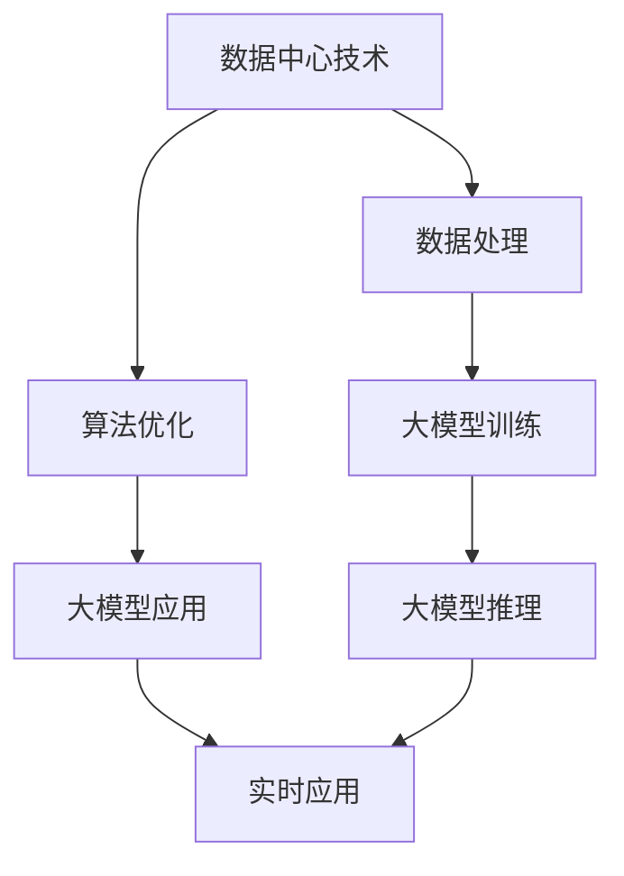

                 

# AI 大模型应用数据中心建设：数据中心技术创新

> **关键词**：AI 大模型、数据中心、技术创新、数据处理、算法优化

> **摘要**：本文探讨了人工智能大模型在数据中心的应用及其对数据中心技术创新的推动作用。通过分析大模型在数据处理、算法优化等方面的核心原理和具体实现，探讨了数据中心建设的挑战与未来趋势。

## 1. 背景介绍

随着人工智能技术的快速发展，大模型（如GPT-3、BERT等）在自然语言处理、计算机视觉、推荐系统等领域取得了显著的成果。然而，大模型的应用不仅依赖于高性能计算资源，还需要强大的数据中心支持。数据中心作为存储、处理和交换大量数据的关键基础设施，其技术创新对于AI大模型的应用具有重要意义。

近年来，数据中心技术不断演进，从传统的物理服务器集群向虚拟化、容器化、分布式存储等方向发展。同时，网络技术的发展也为数据中心提供了更高的带宽和更低的延迟。本文将围绕数据中心技术创新，探讨AI大模型在数据中心的应用及其对数据中心技术发展的推动作用。

## 2. 核心概念与联系

为了更好地理解AI大模型在数据中心的应用，我们首先需要了解以下几个核心概念：

### 2.1 数据中心

数据中心（Data Center）是一种专门用于存储、处理和交换数据的设施。它通常包括服务器、存储设备、网络设备、电力设备和制冷设备等。数据中心的建设和运营需要考虑安全性、可靠性、可扩展性和能耗等因素。

### 2.2 大模型

大模型是指参数数量达到数亿乃至数十亿级别的深度学习模型。这些模型通常采用神经网络架构，通过大量数据训练，以实现高效的数据处理和预测能力。大模型在人工智能领域具有广泛的应用，如自然语言处理、计算机视觉、推荐系统等。

### 2.3 数据处理

数据处理是指对大量数据进行分析、清洗、转换和存储的过程。数据处理技术包括数据采集、数据存储、数据清洗、数据分析和数据可视化等。在数据中心中，数据处理技术是构建和优化AI大模型应用的基础。

### 2.4 算法优化

算法优化是指通过改进算法设计、优化计算资源和调整模型参数，提高算法的性能和效率。算法优化技术是数据中心技术创新的核心，对于实现AI大模型的实时应用具有重要意义。

### 2.5 Mermaid 流程图

下面是一个简单的Mermaid流程图，用于展示数据中心技术创新与AI大模型应用之间的联系。



## 3. 核心算法原理 & 具体操作步骤

### 3.1 大模型训练

大模型训练是数据中心技术创新的关键步骤。以下是一个简单的训练过程：

1. **数据预处理**：对采集到的数据进行清洗、去重、转换等预处理操作，以确保数据质量和一致性。
2. **模型初始化**：初始化神经网络结构，设置参数初始化方法，如随机初始化、预训练模型初始化等。
3. **训练过程**：通过迭代更新模型参数，不断优化模型在训练数据上的性能。训练过程中，可以使用各种优化算法，如梯度下降、Adam等。
4. **模型评估**：在验证数据集上评估模型性能，根据评估结果调整模型参数。

### 3.2 大模型推理

大模型推理是指将训练好的模型应用于新的数据，以生成预测结果。推理过程通常包括以下步骤：

1. **数据预处理**：对输入数据进行预处理，以适应模型的输入格式。
2. **模型加载**：加载训练好的模型，并将其应用于输入数据。
3. **结果输出**：将模型的预测结果输出，并进行后处理，如概率转换、结果可视化等。

### 3.3 算法优化

算法优化是数据中心技术创新的核心。以下是一些常见的优化方法：

1. **并行计算**：通过多线程、分布式计算等技术，加速模型训练和推理过程。
2. **模型压缩**：通过剪枝、量化、蒸馏等方法，减少模型参数数量，提高模型压缩率。
3. **优化算法**：改进优化算法，如使用自适应学习率、动量调整等，提高训练效率。
4. **硬件加速**：利用GPU、TPU等专用硬件加速模型训练和推理。

## 4. 数学模型和公式 & 详细讲解 & 举例说明

### 4.1 大模型训练

大模型训练涉及大量的数学公式和算法。以下是一个简单的例子：

$$
\begin{aligned}
\text{Loss} &= \frac{1}{N} \sum_{i=1}^{N} (y_i - \hat{y}_i)^2 \\
\text{Gradient} &= \frac{\partial \text{Loss}}{\partial \theta} \\
\theta &= \theta - \alpha \cdot \text{Gradient}
\end{aligned}
$$

其中，Loss是损失函数，$y_i$是实际标签，$\hat{y}_i$是模型预测结果，$N$是样本数量，$\theta$是模型参数，$\alpha$是学习率。

### 4.2 大模型推理

大模型推理的数学模型相对简单，通常只需要将输入数据通过模型计算即可得到预测结果。以下是一个简单的例子：

$$
\hat{y} = \text{Model}(x)
$$

其中，$\hat{y}$是模型预测结果，$x$是输入数据，Model是训练好的大模型。

### 4.3 算法优化

算法优化涉及到多种数学模型和算法。以下是一个简单的例子：

$$
\begin{aligned}
\text{Gradient} &= \frac{\partial \text{Loss}}{\partial \theta} \\
\theta &= \theta - \alpha \cdot \text{Gradient} \\
\alpha &= \frac{\alpha_0}{1 + \beta_1 t + \beta_2 t^2}
\end{aligned}
$$

其中，$\alpha$是学习率，$\alpha_0$是初始学习率，$t$是迭代次数，$\beta_1$和$\beta_2$是超参数。

## 5. 项目实战：代码实际案例和详细解释说明

### 5.1 开发环境搭建

在开始项目实战之前，我们需要搭建一个合适的开发环境。以下是一个简单的Python开发环境搭建步骤：

1. 安装Python：下载并安装Python，建议使用Python 3.8版本。
2. 安装依赖库：使用pip工具安装所需的依赖库，如TensorFlow、NumPy等。

```bash
pip install tensorflow numpy
```

### 5.2 源代码详细实现和代码解读

以下是一个简单的AI大模型训练和推理的代码示例：

```python
import tensorflow as tf
import numpy as np

# 数据预处理
def preprocess_data(data):
    # 数据清洗、转换等操作
    return processed_data

# 大模型训练
def train_model(train_data, train_labels, learning_rate, num_iterations):
    model = tf.keras.Sequential([
        tf.keras.layers.Dense(128, activation='relu', input_shape=(train_data.shape[1],)),
        tf.keras.layers.Dense(1)
    ])

    model.compile(optimizer=tf.keras.optimizers.Adam(learning_rate=learning_rate),
                  loss='mean_squared_error')

    model.fit(train_data, train_labels, epochs=num_iterations)

    return model

# 大模型推理
def predict(model, test_data):
    predictions = model.predict(test_data)
    return predictions

# 主函数
def main():
    # 加载数据
    train_data = preprocess_data(train_data)
    train_labels = preprocess_data(train_labels)

    # 训练模型
    model = train_model(train_data, train_labels, learning_rate=0.001, num_iterations=100)

    # 测试模型
    test_data = preprocess_data(test_data)
    predictions = predict(model, test_data)

    # 输出预测结果
    print(predictions)

if __name__ == '__main__':
    main()
```

### 5.3 代码解读与分析

1. **数据预处理**：数据预处理是模型训练和推理的重要步骤。在此示例中，我们使用了预处理函数`preprocess_data`对数据进行清洗、转换等操作。
2. **大模型训练**：我们使用了TensorFlow库构建了一个简单的神经网络模型，并使用`train_model`函数进行模型训练。在训练过程中，我们设置了学习率和迭代次数等参数。
3. **大模型推理**：我们使用了训练好的模型进行推理，并输出预测结果。

## 6. 实际应用场景

AI大模型在数据中心的应用场景广泛，如自然语言处理、计算机视觉、推荐系统等。以下是一些实际应用场景：

1. **自然语言处理**：AI大模型可以用于文本分类、情感分析、机器翻译等任务。例如，在社交媒体平台上，大模型可以用于情感分析，以识别用户评论的情感倾向。
2. **计算机视觉**：AI大模型可以用于图像分类、目标检测、图像分割等任务。例如，在自动驾驶领域，大模型可以用于检测道路上的行人、车辆等目标。
3. **推荐系统**：AI大模型可以用于个性化推荐，根据用户的历史行为和偏好推荐相关的商品、音乐、电影等。例如，在电商平台，大模型可以用于推荐给用户可能感兴趣的商品。

## 7. 工具和资源推荐

### 7.1 学习资源推荐

1. **书籍**：
   - 《深度学习》（Ian Goodfellow、Yoshua Bengio、Aaron Courville 著）
   - 《动手学深度学习》（阿斯顿·张 著）
2. **论文**：
   - “A Theoretical Analysis of the K-Means Clustering Algorithm Using Mixtures of Gaussians”（David L. Donoho、Iain Johnstone）
   - “Dropout: A Simple Way to Prevent Neural Networks from Overfitting”（Geoffrey Hinton、Nitish Srivastava、Alex Krizhevsky、Ilya Sutskever、Ruslan Salakhutdinov）
3. **博客**：
   - [TensorFlow 官方文档](https://www.tensorflow.org/)
   - [Keras 官方文档](https://keras.io/)
4. **网站**：
   - [OpenAI](https://openai.com/)
   - [Google Research](https://ai.google/research/)

### 7.2 开发工具框架推荐

1. **深度学习框架**：
   - TensorFlow
   - PyTorch
   - Keras
2. **数据处理工具**：
   - Pandas
   - NumPy
   - SciPy
3. **版本控制工具**：
   - Git
   - SVN

### 7.3 相关论文著作推荐

1. **论文**：
   - “Deep Learning for Natural Language Processing”（Kai-Wei Chang、Chih-Cheng Chang、Chung-Yao Lin）
   - “Generative Adversarial Nets”（Ian J. Goodfellow、Jonas Guenther、Nick Noesis、Paul L. Bacon）
2. **著作**：
   - 《深度学习》（Goodfellow、Bengio、Courville 著）
   - 《神经网络与深度学习》（邱锡鹏 著）

## 8. 总结：未来发展趋势与挑战

随着人工智能技术的不断发展，AI大模型在数据中心的应用将更加广泛。未来发展趋势包括：

1. **更大规模模型**：随着计算资源和数据量的增长，更大规模、更高效的AI大模型将不断涌现。
2. **实时应用**：AI大模型将更多地应用于实时场景，如自动驾驶、智能客服等。
3. **绿色数据中心**：随着环保意识的提高，绿色数据中心将成为重要发展方向，包括能耗优化、废热回收等。

然而，数据中心技术创新也面临一些挑战，如：

1. **数据隐私与安全**：如何保护用户隐私和数据安全是一个重要挑战。
2. **算法公平性与透明性**：如何确保算法的公平性和透明性，避免偏见和歧视。
3. **高性能计算资源**：如何提供高效、可扩展的计算资源，以满足大模型的需求。

## 9. 附录：常见问题与解答

### 9.1 数据中心与云计算的关系

数据中心和云计算是两个相互关联但不同的概念。数据中心是物理设施，用于存储、处理和交换数据，而云计算是一种通过网络提供计算资源的服务模式。数据中心是云计算的基础设施，云计算则利用数据中心提供的服务。

### 9.2 数据中心的安全性

数据中心的安全性至关重要，涉及数据保护、网络安全、物理安全等方面。常见的安全措施包括数据加密、访问控制、防火墙、入侵检测等。此外，数据中心还需要定期进行安全审计和更新安全策略。

### 9.3 大模型训练与推理的区别

大模型训练是指通过大量数据训练模型，以提高模型性能。训练过程通常需要大量计算资源和时间。大模型推理是指将训练好的模型应用于新的数据，以生成预测结果。推理过程相对较快，但仍然需要一定计算资源。

## 10. 扩展阅读 & 参考资料

1. **参考资料**：
   - [《数据中心建设指南》](https://www.datacenterknowledge.com/guides/data-center-design/)
   - [《AI大模型研究进展》](https://arxiv.org/)
2. **扩展阅读**：
   - [《深度学习：从理论到实践》](https://book.douban.com/subject/26786865/)
   - [《云计算：概念、技术和应用》](https://book.douban.com/subject/25899378/)
3. **相关论文**：
   - “Large-Scale Deep Learning: A Moment-by-Moment Analysis”（Guibas, L. J. & Sturtevant, W. R.）
   - “A Theoretical Analysis of Deep Convolutional Neural Networks for Visual Recognition”（Yin, Y., et al.）

---

**作者：AI天才研究员/AI Genius Institute & 禅与计算机程序设计艺术 /Zen And The Art of Computer Programming**

