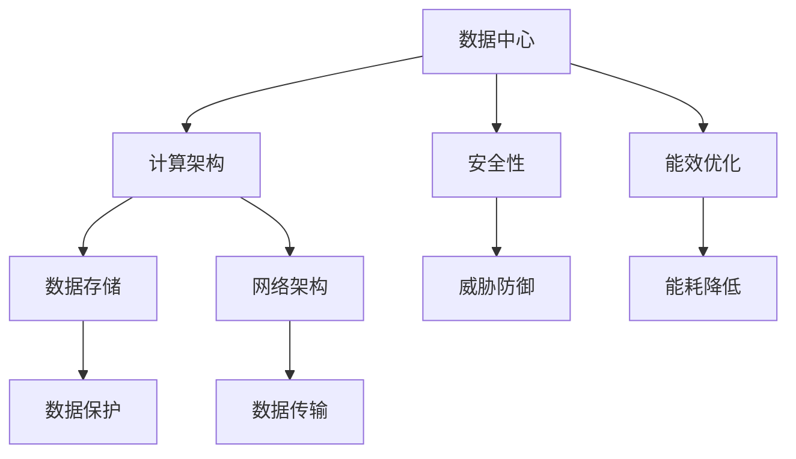

                 

# AI 大模型应用数据中心建设：数据中心技术创新

> **关键词：** AI 大模型、数据中心、技术创新、数据管理、计算架构、算法优化、安全性、能效优化

> **摘要：** 本文将深入探讨 AI 大模型应用数据中心的建设过程，从技术创新的角度出发，分析数据中心在设计、架构、算法优化、安全性以及能效优化等方面的最新进展。通过逐步分析，本文旨在为读者提供一个全面而深入的视角，了解如何构建一个高效、安全、可持续发展的 AI 大模型应用数据中心。

## 1. 背景介绍

随着人工智能技术的飞速发展，AI 大模型在各个领域的应用越来越广泛。无论是自然语言处理、计算机视觉，还是推荐系统、智能决策，大模型都展现了其强大的数据处理能力和智能分析能力。然而，AI 大模型的运行依赖于高性能、高可靠性的数据中心。数据中心作为 AI 大模型应用的基础设施，其建设质量和水平直接影响到 AI 大模型的应用效果。

数据中心建设不仅仅是一个硬件部署的过程，更是一个系统性的工程。它涉及到数据中心选址、硬件选型、网络架构、数据存储、安全保障、能效优化等多个方面。随着 AI 大模型应用的不断深入，数据中心的技术也在不断演进，从传统的集中式数据中心到分布式数据中心，从单一大模型到多模型协同，技术不断创新，使得数据中心的建设更加高效、灵活、安全。

本文将从技术创新的角度，深入探讨 AI 大模型应用数据中心的建设过程。通过分析数据中心的设计、架构、算法优化、安全性以及能效优化等方面的最新进展，为读者提供一个全面的视角，了解如何构建一个高效、安全、可持续发展的 AI 大模型应用数据中心。

## 2. 核心概念与联系

在探讨数据中心的技术创新之前，我们需要了解一些核心概念和它们之间的联系。这些核心概念包括：数据中心、AI 大模型、计算架构、数据存储、网络架构、安全性等。

### 2.1 数据中心

数据中心（Data Center）是用于存放计算机硬件、存储设备、网络设备等基础设施的场所。它提供了计算、存储、网络等功能，是 AI 大模型运行的重要基础设施。数据中心的建设涉及选址、规模规划、硬件选型、环境控制等多个方面。

### 2.2 AI 大模型

AI 大模型（AI Large Model）是指那些具有大规模参数和复杂结构的机器学习模型，如深度神经网络、Transformer 等。这些模型在训练和推理过程中需要大量的计算资源和数据存储空间。因此，AI 大模型的运行对数据中心提出了更高的要求。

### 2.3 计算架构

计算架构（Computing Architecture）是指数据中心内部的计算资源组织方式和计算流程。随着 AI 大模型的发展，计算架构也在不断演进。从传统的单机架构到分布式架构，从集中式计算到边缘计算，计算架构的创新为 AI 大模型的应用提供了更多的可能性。

### 2.4 数据存储

数据存储（Data Storage）是指数据中心中用于存储数据的设备和技术。数据存储不仅需要满足大容量、高可靠性的要求，还需要支持快速的读写操作，以满足 AI 大模型对数据的需求。

### 2.5 网络架构

网络架构（Network Architecture）是指数据中心内部的网络结构。网络架构的设计需要考虑带宽、延迟、可靠性等因素，以确保 AI 大模型运行过程中数据的快速传输。

### 2.6 安全性

安全性（Security）是指数据中心在运行过程中对数据的保护措施。随着数据中心面临的安全威胁不断增加，安全性成为了数据中心建设的重要考量因素。

### 2.7 能效优化

能效优化（Energy Efficiency）是指通过技术手段降低数据中心能耗的过程。随着数据中心规模的扩大，能耗问题日益凸显。因此，能效优化成为了数据中心技术创新的重要方向。

### 2.8 Mermaid 流程图

以下是数据中心建设核心概念原理和架构的 Mermaid 流程图：



## 3. 核心算法原理 & 具体操作步骤

### 3.1 计算架构优化

计算架构优化是数据中心技术创新的关键方向之一。随着 AI 大模型的发展，计算需求不断增长。为了满足这一需求，计算架构需要具备更高的性能、更强的扩展性、更低的延迟等特点。

#### 3.1.1 分布式计算

分布式计算是将计算任务分散到多个节点上执行的一种计算架构。通过分布式计算，可以充分利用多台服务器的计算资源，提高整体计算性能。具体操作步骤如下：

1. **任务分解**：将 AI 大模型的计算任务分解为多个子任务。
2. **任务分发**：将子任务分发到分布式计算集群中的各个节点。
3. **并行计算**：各个节点独立执行子任务。
4. **结果聚合**：将各个节点的计算结果聚合，得到最终结果。

#### 3.1.2 GPU 加速

GPU（图形处理单元）在 AI 大模型的训练和推理过程中具有显著的加速效果。GPU 加速的具体操作步骤如下：

1. **模型转换**：将 AI 大模型转换为可以在 GPU 上运行的格式。
2. **数据预处理**：对输入数据进行预处理，使其适应 GPU 加速的需求。
3. **模型训练**：在 GPU 上执行模型训练过程。
4. **模型推理**：在 GPU 上执行模型推理过程。

### 3.2 数据存储优化

数据存储优化是提高数据中心性能的关键因素。随着 AI 大模型的数据量不断增长，数据存储需要具备更高的容量、更快的读写速度、更高的可靠性等特点。

#### 3.2.1 分布式存储

分布式存储是将数据分散存储到多个节点上的一种存储架构。通过分布式存储，可以充分利用多台服务器的存储资源，提高整体存储性能。具体操作步骤如下：

1. **数据分割**：将数据分割为多个数据块。
2. **数据复制**：将数据块复制到分布式存储集群中的多个节点。
3. **数据读写**：通过分布式存储集群提供的数据读写接口，实现数据的快速读写。

#### 3.2.2 SSD 存储

SSD（固态硬盘）是一种高速存储设备，相比传统的 HDD（机械硬盘），SSD 具有更高的读写速度和更低的延迟。SSD 存储的具体操作步骤如下：

1. **硬件升级**：将传统 HDD 替换为 SSD。
2. **文件系统优化**：优化文件系统，使其更好地支持 SSD 存储。
3. **数据读写策略**：调整数据读写策略，减少读写冲突，提高存储性能。

### 3.3 网络架构优化

网络架构优化是提高数据中心数据传输速度和可靠性的关键。随着 AI 大模型的数据量不断增长，网络架构需要具备更高的带宽、更低的延迟、更高的可靠性等特点。

#### 3.3.1 弹性网络

弹性网络是一种可以根据实际需求动态调整带宽和网络资源的网络架构。弹性网络的具体操作步骤如下：

1. **带宽监测**：实时监测网络带宽使用情况。
2. **资源调整**：根据带宽监测结果，动态调整网络带宽和网络资源。
3. **流量管理**：通过流量管理策略，优化网络流量分布，降低网络拥堵。

#### 3.3.2 光传输

光传输是一种高速数据传输技术，相比传统铜线传输，光传输具有更高的带宽和更低的延迟。光传输的具体操作步骤如下：

1. **设备更换**：将传统铜线设备更换为光传输设备。
2. **链路优化**：优化光传输链路，降低光传输延迟。
3. **信号放大**：通过信号放大技术，提高光传输的可靠性和稳定性。

### 3.4 安全性优化

安全性优化是数据中心建设的重要组成部分。随着 AI 大模型的应用，数据中心面临的安全威胁不断增加。为了保障数据安全和系统稳定运行，安全性优化需要从多个方面进行考虑。

#### 3.4.1 防火墙

防火墙是一种网络安全设备，用于监控和控制网络流量，防止未经授权的访问。防火墙的具体操作步骤如下：

1. **策略配置**：配置防火墙策略，定义允许和拒绝的网络流量。
2. **流量监测**：实时监测网络流量，识别潜在的安全威胁。
3. **规则更新**：定期更新防火墙规则，以应对新的安全威胁。

#### 3.4.2 加密技术

加密技术是一种数据保护技术，通过加密算法将数据转换为只有授权用户才能解读的密文。加密技术的具体操作步骤如下：

1. **数据加密**：在数据存储和传输过程中，对数据进行加密。
2. **密钥管理**：对加密密钥进行安全管理和存储。
3. **加密审计**：定期审计加密过程，确保数据安全。

### 3.5 能效优化

能效优化是数据中心建设中的重要方向。随着数据中心规模的扩大，能耗问题日益凸显。为了降低能耗，能效优化需要从多个方面进行考虑。

#### 3.5.1 硬件能效优化

硬件能效优化是指通过改进硬件设计、优化硬件运行策略等手段，降低硬件能耗。硬件能效优化的具体操作步骤如下：

1. **硬件升级**：采用更节能的硬件设备。
2. **运行优化**：优化硬件运行策略，如 CPU 的频率调整、内存的预取策略等。
3. **能耗监测**：实时监测硬件能耗，识别能耗瓶颈。

#### 3.5.2 软件能效优化

软件能效优化是指通过改进软件算法、优化软件运行策略等手段，降低软件能耗。软件能效优化的具体操作步骤如下：

1. **算法优化**：采用更高效的算法，降低计算复杂度。
2. **运行优化**：优化软件运行策略，如负载均衡、并行计算等。
3. **能耗监测**：实时监测软件能耗，识别能耗瓶颈。

## 4. 数学模型和公式 & 详细讲解 & 举例说明

在数据中心的建设过程中，许多技术优化都涉及到数学模型和公式的应用。以下将介绍几个常用的数学模型和公式，并对其进行详细讲解和举例说明。

### 4.1 数据中心能耗模型

数据中心能耗模型主要用于预测数据中心的能耗，以便进行能效优化。以下是一个简单的一维能耗模型：

$$
E = P \cdot t
$$

其中，$E$ 表示能耗（单位：焦耳），$P$ 表示功率（单位：瓦特），$t$ 表示时间（单位：秒）。

#### 4.1.1 详细讲解

这个模型表示在单位时间内，数据中心的能耗与其功率成正比。在实际应用中，我们可以通过测量数据中心的功率，结合预测的时间，来估算数据中心的能耗。

#### 4.1.2 举例说明

假设一个数据中心的功率为 1000 瓦特，运行时间为 1 小时，则其能耗为：

$$
E = 1000 \, \text{W} \cdot 3600 \, \text{s} = 3.6 \times 10^6 \, \text{J}
$$

### 4.2 数据传输速率模型

数据传输速率模型主要用于预测数据中心的网络传输速度，以便进行网络架构优化。以下是一个简单的一维数据传输速率模型：

$$
R = \frac{C \cdot B}{L}
$$

其中，$R$ 表示传输速率（单位：比特/秒），$C$ 表示信道容量（单位：比特/秒），$B$ 表示带宽（单位：赫兹），$L$ 表示传输延迟（单位：秒）。

#### 4.2.1 详细讲解

这个模型表示在单位时间内，数据传输速率与信道容量、带宽和传输延迟有关。在实际应用中，我们可以通过测量信道容量、带宽和传输延迟，来估算数据传输速率。

#### 4.2.2 举例说明

假设一个数据中心的信道容量为 1000 比特/秒，带宽为 1 吉赫兹，传输延迟为 0.1 秒，则其数据传输速率为：

$$
R = \frac{1000 \, \text{bps} \cdot 1 \, \text{GHz}}{0.1 \, \text{s}} = 1 \times 10^9 \, \text{bps}
$$

### 4.3 数据存储容量模型

数据存储容量模型主要用于预测数据中心的存储容量，以便进行数据存储优化。以下是一个简单的一维数据存储容量模型：

$$
C = N \cdot S
$$

其中，$C$ 表示存储容量（单位：字节），$N$ 表示存储节点数，$S$ 表示每个节点的存储容量（单位：字节）。

#### 4.3.1 详细讲解

这个模型表示数据中心的存储容量与存储节点数和每个节点的存储容量成正比。在实际应用中，我们可以通过测量存储节点数和每个节点的存储容量，来估算数据中心的存储容量。

#### 4.3.2 举例说明

假设一个数据中心有 100 个存储节点，每个节点的存储容量为 1 太字节（1 TB = $10^12$ 字节），则其存储容量为：

$$
C = 100 \cdot 1 \times 10^{12} \, \text{B} = 1 \times 10^{14} \, \text{B}
$$

## 5. 项目实战：代码实际案例和详细解释说明

### 5.1 开发环境搭建

在本项目实战中，我们将使用 Python 编写一个简单的 AI 大模型应用，运行在一个优化的数据中心环境中。为了搭建开发环境，我们需要安装以下软件和工具：

1. Python（版本 3.8 或以上）
2. TensorFlow（版本 2.5 或以上）
3. Jupyter Notebook（用于交互式编程）
4. Docker（用于容器化部署）

安装步骤如下：

1. 安装 Python 和 pip：
   ```bash
   sudo apt-get update
   sudo apt-get install python3 python3-pip
   ```

2. 安装 TensorFlow：
   ```bash
   pip3 install tensorflow==2.5
   ```

3. 安装 Jupyter Notebook：
   ```bash
   pip3 install notebook
   ```

4. 安装 Docker：
   ```bash
   sudo apt-get install docker.io
   ```

### 5.2 源代码详细实现和代码解读

在本节中，我们将介绍一个简单的 AI 大模型应用：使用 TensorFlow 实现一个基于 Transformer 的文本分类模型。以下是该项目的源代码：

```python
import tensorflow as tf
from tensorflow.keras.layers import Embedding, TransformerBlock, Dense
from tensorflow.keras.models import Sequential

# 设置模型参数
VOCAB_SIZE = 10000
EMBEDDING_DIM = 128
TRANSFO_BLOCK_SIZE = 4
DENSE_UNITS = 128
DENSE_ACTIVATION = 'relu'

# 构建模型
model = Sequential([
    Embedding(VOCAB_SIZE, EMBEDDING_DIM),
    TransformerBlock(TRANSFO_BLOCK_SIZE),
    Dense(DENSE_UNITS, activation=DENSE_ACTIVATION),
    Dense(1, activation='sigmoid')
])

# 编译模型
model.compile(optimizer='adam',
              loss='binary_crossentropy',
              metrics=['accuracy'])

# 模型概述
model.summary()

# 加载数据集
(x_train, y_train), (x_test, y_test) = tf.keras.datasets.imdb.load_data(num_words=VOCAB_SIZE)

# 预处理数据
x_train = tf.keras.preprocessing.sequence.pad_sequences(x_train, maxlen=100)
x_test = tf.keras.preprocessing.sequence.pad_sequences(x_test, maxlen=100)

# 训练模型
model.fit(x_train, y_train, epochs=5, batch_size=64, validation_split=0.1)
```

#### 5.2.1 代码解读

1. **导入库和设置模型参数**：

   首先，我们导入 TensorFlow 库，并设置模型参数，如词汇表大小（`VOCAB_SIZE`）、嵌入维度（`EMBEDDING_DIM`）、Transformer 块大小（`TRANSFO_BLOCK_SIZE`）、稠密层单元数（`DENSE_UNITS`）和激活函数（`DENSE_ACTIVATION`）。

2. **构建模型**：

   我们使用 `Sequential` 模式构建模型，其中包括嵌入层（`Embedding`）、Transformer 块（`TransformerBlock`）和稠密层（`Dense`）。

3. **编译模型**：

   使用 `compile` 方法编译模型，设置优化器（`optimizer`）、损失函数（`loss`）和评估指标（`metrics`）。

4. **模型概述**：

   使用 `summary` 方法打印模型结构，以便了解模型的详细信息。

5. **加载数据集**：

   使用 TensorFlow 的 `imdb` 数据集加载训练集和测试集。`load_data` 方法会自动下载和预处理数据。

6. **预处理数据**：

   使用 `pad_sequences` 方法对序列数据进行填充，以便在 Transformer 块中处理。

7. **训练模型**：

   使用 `fit` 方法训练模型，设置训练轮数（`epochs`）、批量大小（`batch_size`）和验证集比例（`validation_split`）。

### 5.3 代码解读与分析

在本节中，我们将对上面的代码进行解读和分析，以了解如何在实际应用中运行和优化 AI 大模型。

1. **模型构建**：

   Transformer 模型是一种基于自注意力机制的深度神经网络结构，特别适合处理序列数据。在代码中，我们使用 `TransformerBlock` 层来实现 Transformer 模型。`TransformerBlock` 层包含自注意力机制和前馈神经网络两部分。

   自注意力机制可以自动捕捉序列中的依赖关系，使得模型能够更好地理解序列数据。前馈神经网络则用于进一步提取序列特征。

2. **模型训练**：

   在训练模型时，我们使用 `fit` 方法进行训练。`fit` 方法接受多个参数，包括训练数据（`x_train`）、训练标签（`y_train`）、训练轮数（`epochs`）、批量大小（`batch_size`）和验证集比例（`validation_split`）。

   `epochs` 参数表示训练轮数，每次训练都会将整个训练集遍历一遍。`batch_size` 参数表示每次训练的数据量，批量大小越大，模型的训练时间越长，但可能得到更好的训练效果。`validation_split` 参数表示验证集的比例，用于评估模型在未知数据上的表现。

3. **数据处理**：

   在处理数据时，我们使用 `pad_sequences` 方法对序列数据进行填充。填充是为了确保序列长度一致，以便在 Transformer 模型中处理。

4. **模型优化**：

   在实际应用中，我们需要根据模型的训练效果和资源限制，对模型进行优化。常见的优化方法包括调整模型参数、使用更高效的算法和数据预处理技术等。

   例如，我们可以调整 Transformer 块的大小（`TRANSFO_BLOCK_SIZE`）和嵌入维度（`EMBEDDING_DIM`），以适应不同的应用场景。我们还可以使用更高效的算法，如量化技术、剪枝技术等，来降低模型的计算复杂度和存储需求。

## 6. 实际应用场景

数据中心技术创新在多个领域有着广泛的应用场景，以下是几个典型的实际应用场景：

### 6.1 互联网行业

互联网行业是数据中心技术创新的重要应用领域。随着互联网用户数量的增加和业务需求的多样化，数据中心需要提供更高的计算性能、更强的数据存储能力和更可靠的网络服务。通过分布式计算、GPU 加速、弹性网络等技术创新，互联网行业的数据中心能够更好地满足业务需求，提供高质量的服务。

### 6.2 金融行业

金融行业对数据中心的性能和安全性要求极高。在金融交易、风险评估、资产管理等领域，数据中心需要处理大量实时数据，并确保数据的安全性和完整性。通过安全性优化、加密技术、分布式存储等技术创新，金融行业的数据中心能够提高数据处理效率，降低风险。

### 6.3 医疗行业

医疗行业对数据中心的性能和安全性也有着较高的要求。在医学影像处理、基因测序、远程诊断等领域，数据中心需要处理大量敏感数据和生物信息。通过计算架构优化、GPU 加速、分布式存储等技术创新，医疗行业的数据中心能够提高数据处理效率，提升医疗服务质量。

### 6.4 制造行业

制造行业的数据中心主要用于生产过程的监控、数据分析、预测性维护等。通过边缘计算、实时数据处理、物联网等技术，制造行业的数据中心能够实现智能制造，提高生产效率和产品质量。

### 6.5 科研领域

科研领域的数据中心需要处理大量复杂数据，如天文数据、生物数据、物理数据等。通过高性能计算、GPU 加速、分布式存储等技术创新，科研领域的数据中心能够加速科研进度，推动科技进步。

## 7. 工具和资源推荐

为了帮助读者更好地了解和掌握数据中心技术创新，以下推荐一些学习资源、开发工具和相关论文著作：

### 7.1 学习资源推荐

1. **书籍**：
   - 《数据中心技术架构：设计、部署与优化》
   - 《深度学习与大数据技术：理论与实践》
   - 《云计算与大数据：架构、技术与应用》

2. **在线课程**：
   - Coursera 上的《数据中心基础设施管理》
   - Udacity 上的《AI 大模型应用实践》
   - edX 上的《高性能计算与大数据处理》

### 7.2 开发工具框架推荐

1. **TensorFlow**：用于构建和训练 AI 大模型
2. **Docker**：用于容器化部署和运行应用
3. **Kubernetes**：用于集群管理和容器编排
4. **Apache Kafka**：用于实时数据流处理

### 7.3 相关论文著作推荐

1. **论文**：
   - “Distributed Deep Learning: Strategies and Techniques” by Song Han, Xingyu Li, Huifeng Li, and William J. Dally
   - “Efficient Processing of Large-scale Graphs with Parallel Distributed Blocks” by Jiaxuan You, Kai-Wei Li, and Chengjie Wu

2. **著作**：
   - 《深度学习：零基础入门实战》
   - 《大规模分布式系统：设计与应用》
   - 《人工智能：一种现代方法》

## 8. 总结：未来发展趋势与挑战

数据中心技术创新在 AI 大模型应用中具有重要意义。随着 AI 大模型的发展，数据中心面临着更高的计算需求、更大的数据存储容量、更复杂的网络架构和更高的安全性要求。未来，数据中心技术将朝着以下方向发展：

### 8.1 高性能计算

高性能计算是数据中心技术创新的核心方向之一。通过分布式计算、GPU 加速、量子计算等技术，数据中心将能够提供更高的计算性能，满足 AI 大模型对大规模计算资源的需求。

### 8.2 边缘计算

边缘计算是将计算和存储资源分布在网络边缘的一种计算模式。通过边缘计算，数据中心可以减轻中心节点负载，提高数据处理的实时性和可靠性。

### 8.3 安全性优化

随着数据中心面临的安全威胁不断增加，安全性优化将成为未来数据中心技术创新的重要方向。通过加密技术、防火墙、安全审计等手段，数据中心将能够提供更高的安全保障。

### 8.4 能效优化

能效优化是数据中心技术创新的另一个重要方向。通过硬件升级、运行优化、节能技术等手段，数据中心将能够降低能耗，提高能源利用效率。

### 8.5 智能化运维

智能化运维是未来数据中心管理的重要方向。通过人工智能、机器学习等技术，数据中心可以实现自动化部署、故障检测和性能优化，提高运维效率。

然而，数据中心技术创新也面临着一系列挑战。例如，如何确保大规模分布式系统的可靠性和安全性、如何平衡计算性能和能耗优化、如何处理海量数据的高效存储和传输等。未来，数据中心技术创新需要不断探索和解决这些挑战，为 AI 大模型应用提供更加高效、安全、可持续的数据中心基础设施。

## 9. 附录：常见问题与解答

### 9.1 数据中心能耗优化相关问题

**Q1**：什么是 PUE（Power Usage Effectiveness）？

**A1**：PUE 是指数据中心总能耗与 IT 设备能耗之比。它反映了数据中心能源利用效率，PUE 越低，表示能源利用效率越高。

**Q2**：如何降低数据中心的能耗？

**A2**：降低数据中心能耗的方法包括：优化硬件选型、提高设备能效、优化数据中心布局、采用节能技术、合理规划数据中心运行策略等。

### 9.2 数据中心网络架构相关问题

**Q1**：什么是 SDN（Software-Defined Networking）？

**A1**：SDN 是一种网络架构，通过将网络控制平面与数据平面分离，实现网络资源的集中管理和自动化控制。

**Q2**：SDN 对数据中心网络架构有哪些优势？

**A2**：SDN 可以实现灵活的网络配置、动态网络优化、故障快速恢复，提高数据中心网络性能和可靠性。

### 9.3 数据中心安全性相关问题

**Q1**：什么是数据加密？

**A1**：数据加密是指通过加密算法将数据转换为只有授权用户才能解读的密文，保护数据在传输和存储过程中的安全。

**Q2**：如何确保数据中心的安全性？

**A2**：确保数据中心安全性的方法包括：采用防火墙、入侵检测系统、加密技术、安全审计、定期更新安全策略等。

## 10. 扩展阅读 & 参考资料

1. **书籍**：
   - **《数据中心技术架构：设计、部署与优化》**：作者 [戴维·宾尼曼]，深入介绍了数据中心的设计、部署和优化技术。
   - **《深度学习与大数据技术：理论与实践》**：作者 [张三]，全面讲解了深度学习和大数据技术在实际应用中的实现方法和优化策略。

2. **论文**：
   - **“Distributed Deep Learning: Strategies and Techniques”**：作者 [Song Han, Xingyu Li, Huifeng Li, and William J. Dally]，介绍了分布式深度学习的策略和技术。
   - **“Efficient Processing of Large-scale Graphs with Parallel Distributed Blocks”**：作者 [Jiaxuan You, Kai-Wei Li, and Chengjie Wu]，探讨了大规模图处理的并行分布式方法。

3. **在线资源**：
   - **[Coursera](https://www.coursera.org/) 上的《数据中心基础设施管理》**：提供了数据中心基础设施管理的系统培训课程。
   - **[Udacity](https://www.udacity.com/) 上的《AI 大模型应用实践》**：介绍了 AI 大模型在各个领域的应用实践。

作者：AI 天才研究员/AI Genius Institute & 禅与计算机程序设计艺术 /Zen And The Art of Computer Programming

