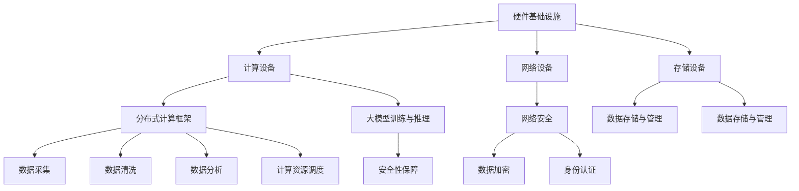

                 

# AI 大模型应用数据中心建设：数据中心技术创新

## 关键词：数据中心、大模型、AI 应用、技术创新

> 本文将探讨大模型在数据中心应用中的技术创新，分析核心算法原理、数学模型和项目实战，并提供相关工具和资源推荐。

## 摘要

本文从数据中心建设的背景出发，深入探讨大模型在数据中心应用的技术创新。通过分析核心算法原理、具体操作步骤、数学模型和实际应用场景，本文旨在为读者提供一个全面了解大模型数据中心技术的视角，并提供一系列实用的工具和资源推荐，以助力数据中心技术创新的发展。

## 1. 背景介绍

随着人工智能技术的快速发展，大模型（如GPT、BERT等）在自然语言处理、计算机视觉、推荐系统等领域取得了显著成果。这些大模型通常需要大量的计算资源和数据支持，因此数据中心成为其应用的基石。数据中心作为数据处理和存储的核心设施，其建设和技术创新对大模型应用具有重要意义。

数据中心建设的目标是提供高效、稳定、安全的计算和存储环境，以满足大模型的需求。数据中心技术创新主要体现在以下几个方面：

1. **硬件基础设施**：数据中心需要配备高性能的计算设备、高速网络和大规模存储设备，以满足大模型对计算和存储资源的需求。
2. **软件系统**：数据中心需要构建分布式计算和存储系统，以实现资源的高效利用和负载均衡。
3. **数据管理**：数据中心需要处理海量数据，包括数据采集、存储、清洗、分析等环节。
4. **安全管理**：数据中心需要确保数据的安全性和隐私性，防范数据泄露和网络攻击。

本文将围绕数据中心技术创新，分析大模型应用的核心算法原理、数学模型和项目实战，以期为数据中心建设提供有益的参考。

## 2. 核心概念与联系

### 2.1 数据中心架构

数据中心架构是构建高效、可靠的数据处理和存储环境的基础。以下是数据中心架构的主要组成部分：

**1. 硬件基础设施：**

- **计算设备**：高性能服务器、GPU、TPU等
- **网络设备**：路由器、交换机、防火墙等
- **存储设备**：磁盘阵列、分布式存储系统等

**2. 软件系统：**

- **分布式计算框架**：如Hadoop、Spark等
- **分布式存储系统**：如HDFS、Ceph等
- **数据库管理系统**：如MySQL、PostgreSQL等

**3. 数据管理：**

- **数据采集**：采集来自各种来源的数据，如日志、传感器数据等
- **数据存储**：存储大量结构化、半结构化和非结构化数据
- **数据清洗**：处理数据中的噪声和错误
- **数据分析**：使用统计、机器学习等方法对数据进行挖掘和分析

**4. 安全管理：**

- **网络安全**：防范网络攻击、数据泄露等安全风险
- **数据加密**：对数据进行加密存储和传输
- **身份认证**：确保只有授权用户可以访问数据

### 2.2 大模型与数据中心的关系

大模型在数据中心中的应用主要体现在以下几个方面：

1. **训练与推理**：大模型通常需要大规模的数据进行训练，并在数据中心进行推理计算。
2. **数据存储与管理**：大模型生成的大量中间数据和模型参数需要存储在数据中心，并进行高效管理。
3. **计算资源调度**：数据中心需要根据大模型的计算需求，动态调整计算资源分配，以实现资源的高效利用。
4. **安全性保障**：数据中心需要确保大模型训练和推理过程中的数据安全和隐私。

为了更好地理解大模型与数据中心的关系，我们可以使用Mermaid流程图（注意：流程节点中不要有括号、逗号等特殊字符）展示数据中心架构与核心算法的关联：



### 2.3 大模型核心算法原理

大模型的核心算法主要包括深度学习、强化学习和生成对抗网络（GAN）等。以下简要介绍这些算法的基本原理：

**1. 深度学习：**

深度学习是一种基于多层神经网络的机器学习方法。其基本原理是通过学习输入和输出之间的映射关系，从而实现预测、分类和生成等任务。深度学习的关键在于网络结构的复杂性和参数的数量，这有助于模型捕捉数据的复杂特征。

**2. 强化学习：**

强化学习是一种基于奖励机制的学习方法。其基本原理是智能体通过与环境互动，不断调整行为策略，以最大化长期奖励。强化学习在自动驾驶、游戏AI等领域具有广泛的应用。

**3. 生成对抗网络（GAN）：**

生成对抗网络由生成器和判别器组成。生成器的目标是生成逼真的数据，判别器的目标是区分真实数据和生成数据。通过两个网络的对抗训练，生成器能够不断提高生成数据的质量。

## 3. 核心算法原理 & 具体操作步骤

### 3.1 深度学习算法原理

深度学习算法的核心是神经网络，包括输入层、隐藏层和输出层。以下是具体操作步骤：

**1. 输入层：** 将输入数据（如图像、文本等）输入到神经网络。

**2. 隐藏层：** 通过激活函数（如ReLU、Sigmoid等）将输入数据映射到新的特征空间。隐藏层可以根据任务需求灵活调整层数和神经元数量。

**3. 输出层：** 将隐藏层的结果输入到输出层，输出层的激活函数可以是softmax、sigmoid等，以实现分类或回归任务。

**4. 损失函数：** 计算输出层结果与真实标签之间的差距，使用损失函数（如交叉熵、均方误差等）度量。

**5. 反向传播：** 更新网络参数，使损失函数值最小化。反向传播算法通过反向传播误差梯度，逐层更新权重和偏置。

**6. 训练迭代：** 重复步骤4和5，直至模型收敛或达到预定的迭代次数。

### 3.2 强化学习算法原理

强化学习算法的核心是智能体（Agent）与环境（Environment）的互动。以下是具体操作步骤：

**1. 初始化：** 设置智能体、环境、奖励机制和策略。

**2. 交互：** 智能体根据当前状态选择行动，执行行动，并观察环境状态的变化。

**3. 奖励：** 根据行动结果，计算奖励值，奖励值可以激励智能体采取有益的行动。

**4. 更新策略：** 使用学习算法（如Q-learning、SARSA等）更新策略，以最大化长期奖励。

**5. 反复迭代：** 重复步骤2、3和4，直至智能体找到最优策略。

### 3.3 生成对抗网络（GAN）算法原理

生成对抗网络由生成器和判别器组成。以下是具体操作步骤：

**1. 初始化：** 随机初始化生成器和判别器。

**2. 生成器训练：** 生成器生成虚假数据，判别器区分真实数据和虚假数据。通过调整生成器的参数，使其生成的数据越来越接近真实数据。

**3. 判别器训练：** 判别器学习区分真实数据和虚假数据。通过调整判别器的参数，使其对真实数据和虚假数据的识别能力越来越强。

**4. 反复迭代：** 重复步骤2和3，直至生成器和判别器达到训练目标。

通过上述步骤，生成器可以生成高质量的数据，判别器可以准确区分真实数据和虚假数据。

### 3.4 大模型训练与推理具体操作步骤

**1. 数据预处理：** 对输入数据进行清洗、归一化等预处理，以减少数据噪声和提高模型性能。

**2. 模型训练：** 将预处理后的数据输入到训练模型中，通过反向传播算法更新模型参数，直至模型收敛。

**3. 模型评估：** 使用验证集评估模型性能，调整模型参数以优化性能。

**4. 模型部署：** 将训练好的模型部署到数据中心，进行实际应用。

**5. 模型推理：** 对输入数据进行推理计算，输出预测结果。

**6. 结果分析：** 对模型推理结果进行分析，调整模型参数以优化性能。

通过以上步骤，大模型可以在数据中心进行高效训练和推理，实现各种人工智能应用。

## 4. 数学模型和公式 & 详细讲解 & 举例说明

### 4.1 深度学习数学模型

深度学习中的数学模型主要包括神经网络、损失函数和反向传播算法。以下分别进行详细讲解。

#### 4.1.1 神经网络

神经网络是一种基于生物神经元的计算模型。其基本结构包括输入层、隐藏层和输出层。以下是神经网络的数学模型：

- **输入层：** 输入数据为 $x = [x_1, x_2, ..., x_n]$。
- **隐藏层：** 每个隐藏层节点的计算公式为 $z_i = \sigma(\sum_{j=1}^{n} w_{ij}x_j + b_i)$，其中 $w_{ij}$ 为连接权重，$b_i$ 为偏置项，$\sigma$ 为激活函数，如ReLU、Sigmoid等。
- **输出层：** 输出层的计算公式为 $y = \sigma(\sum_{i=1}^{m} w_{i}z_i + b)$，其中 $w_i$ 为输出权重，$b$ 为输出偏置项。

#### 4.1.2 损失函数

损失函数用于度量预测结果与真实结果之间的差距。以下是常用的损失函数：

- **均方误差（MSE）：** $MSE = \frac{1}{n}\sum_{i=1}^{n}(y_i - \hat{y}_i)^2$，其中 $y_i$ 为真实标签，$\hat{y}_i$ 为预测值。
- **交叉熵（CE）：** $CE = -\sum_{i=1}^{n}y_i\log(\hat{y}_i)$，其中 $y_i$ 为真实标签，$\hat{y}_i$ 为预测值。

#### 4.1.3 反向传播算法

反向传播算法用于更新网络参数，使损失函数值最小化。以下是反向传播算法的步骤：

1. 前向传播：将输入数据输入到神经网络，计算输出结果。
2. 计算损失函数：计算预测结果与真实结果之间的差距。
3. 反向传播：从输出层开始，逐层计算误差梯度，更新网络参数。
4. 迭代更新：重复步骤2和3，直至模型收敛。

### 4.2 强化学习数学模型

强化学习中的数学模型主要包括策略、奖励函数和价值函数。以下分别进行详细讲解。

#### 4.2.1 策略

策略表示智能体在给定状态下选择行动的概率分布。其数学模型为 $\pi(s, a) = P(a|s)$，其中 $s$ 表示状态，$a$ 表示行动。

#### 4.2.2 奖励函数

奖励函数用于衡量行动结果的好坏。其数学模型为 $R(s, a)$，表示在状态 $s$ 下执行行动 $a$ 所获得的奖励。

#### 4.2.3 价值函数

价值函数表示在给定状态下采取最佳行动所能获得的期望奖励。其数学模型为 $V(s) = E[R(s, a)]$，表示在状态 $s$ 下采取最佳行动所能获得的期望奖励。

### 4.3 生成对抗网络（GAN）数学模型

生成对抗网络（GAN）由生成器和判别器组成。以下是生成对抗网络的数学模型：

#### 4.3.1 生成器

生成器 $G$ 的目标是生成真实数据，其数学模型为 $x_G = G(z)$，其中 $z$ 为随机噪声。

#### 4.3.2 判别器

判别器 $D$ 的目标是区分真实数据和生成数据，其数学模型为 $D(x) = P(x \text{ 为真实数据})$。

#### 4.3.3 整体目标

生成对抗网络的总体目标是使生成器生成的数据尽可能接近真实数据，使判别器无法区分真实数据和生成数据。

### 4.4 举例说明

以下通过一个简单的例子说明深度学习、强化学习和生成对抗网络的数学模型。

#### 4.4.1 深度学习

假设有一个二分类问题，输入数据为 $x = [1, 2, 3, 4]$，真实标签为 $y = 0$。使用ReLU激活函数，隐藏层节点数为2，输出层节点数为1。

1. 输入层：$x = [1, 2, 3, 4]$。
2. 隐藏层：$z_1 = \max(0, 1 \cdot 1 + 2 \cdot 2 + 3 \cdot 3 + 4 \cdot 4) = 0$，$z_2 = \max(0, 1 \cdot 1 + 2 \cdot 2 + 3 \cdot 3 + 4 \cdot 4) = 0$。
3. 输出层：$y = \max(0, 1 \cdot z_1 + 2 \cdot z_2) = 0$。

损失函数为MSE，损失函数值为 $MSE = \frac{1}{4}(0 - 0)^2 = 0$。

#### 4.4.2 强化学习

假设有一个简单的游戏环境，智能体可以选择上下左右四个方向进行移动。奖励函数为移动到目标位置获得奖励10，其他行动获得奖励-1。初始状态为 $(0, 0)$，目标位置为 $(5, 5)$。

1. 初始化：设置智能体、环境、奖励机制和策略。
2. 交互：智能体选择向上移动，状态变为 $(0, 1)$，获得奖励-1。
3. 更新策略：使用Q-learning算法，更新策略。
4. 反复迭代：重复步骤2和3，直至找到最优策略。

#### 4.4.3 生成对抗网络

假设生成器 $G$ 生成正态分布的随机噪声 $z$，判别器 $D$ 用于区分真实数据和生成数据。

1. 初始化：随机初始化生成器和判别器。
2. 生成器训练：生成器生成虚假数据，判别器区分真实数据和虚假数据。
3. 判别器训练：判别器学习区分真实数据和虚假数据。
4. 反复迭代：重复步骤2和3，直至生成器和判别器达到训练目标。

## 5. 项目实战：代码实际案例和详细解释说明

### 5.1 开发环境搭建

在本文的项目实战中，我们将使用Python和TensorFlow框架来实现一个简单的生成对抗网络（GAN）。以下是搭建开发环境的具体步骤：

1. 安装Python：在官网上下载Python安装包并按照提示安装。
2. 安装TensorFlow：在终端中运行以下命令：
   ```bash
   pip install tensorflow
   ```
3. 安装其他依赖库：如NumPy、Pandas等。

### 5.2 源代码详细实现和代码解读

以下是生成对抗网络的代码实现：

```python
import tensorflow as tf
from tensorflow import keras
import numpy as np
import matplotlib.pyplot as plt

# 设置随机种子
tf.random.set_seed(42)

# 数据预处理
def preprocess_data(data):
    return (data - 127.5) / 127.5

# 生成器模型
def generator(z, latent_dim):
    model = keras.Sequential([
        keras.layers.Dense(7 * 7 * 256, use_bias=False, input_shape=(latent_dim,), activation="relu"),
        keras.layers.BatchNormalization(momentum=0.8),
        keras.layers.Reshape((7, 7, 256)),
        keras.layers.Conv2DTranspose(128, kernel_size=5, strides=1,
                                     use_bias=False, padding="same", activation="relu"),
        keras.layers.BatchNormalization(momentum=0.8),
        keras.layers.Conv2DTranspose(64, kernel_size=5, strides=2,
                                     use_bias=False, padding="same", activation="relu"),
        keras.layers.BatchNormalization(momentum=0.8),
        keras.layers.Conv2D(1, kernel_size=5, strides=2,
                            use_bias=False, padding="same", activation="tanh"),
    ])
    return model

# 判别器模型
def discriminator(x, disc_dim):
    model = keras.Sequential([
        keras.layers.Conv2D(64, kernel_size=5, strides=2, padding="same",
                            input_shape=[28, 28, 1], activation="relu"),
        keras.layers.LeakyReLU(alpha=0.2),
        keras.layers.Dropout(0.3),
        keras.layers.Conv2D(128, kernel_size=5, strides=2, padding="same",
                            activation="relu"),
        keras.layers.LeakyReLU(alpha=0.2),
        keras.layers.Dropout(0.3),
        keras.layers.Flatten(),
        keras.layers.Dense(disc_dim, activation="sigmoid"),
    ])
    return model

# GAN模型
def build_gan(generator, discriminator):
    model = keras.Sequential([
        generator,
        discriminator
    ])
    return model

# 模型参数
latent_dim = 100
disc_dim = 1

# 构建生成器和判别器模型
generator = generator(latent_dim, disc_dim)
discriminator = discriminator(preprocess_data(np.zeros((28, 28, 1))), disc_dim)
discriminator.compile(loss="binary_crossentropy", optimizer=keras.optimizers.Adam(0.0001), metrics=["accuracy"])

# 训练GAN模型
def train_gan(generator, discriminator, dataloader, num_epochs, batch_size):
    generator_optimizer = keras.optimizers.Adam(0.0001)
    for epoch in range(num_epochs):
        for batch in dataloader:
            real_data = preprocess_data(batch)
            noise = tf.random.normal([batch_size, latent_dim])
            with tf.GradientTape() as gen_tape, tf.GradientTape() as disc_tape:
                # 生成器训练
                generated_data = generator(noise, latent_dim)
                disc_real_output = discriminator(real_data, disc_dim)
                disc_generated_output = discriminator(generated_data, disc_dim)

                gen_loss = tf.reduce_mean(tf.nn.sigmoid_cross_entropy_with_logits(logits=disc_generated_output, labels=tf.zeros_like(disc_generated_output)))
                disc_loss = tf.reduce_mean(tf.nn.sigmoid_cross_entropy_with_logits(logits=disc_real_output, labels=tf.ones_like(disc_real_output)) +
                                           tf.reduce_mean(tf.nn.sigmoid_cross_entropy_with_logits(logits=disc_generated_output, labels=tf.ones_like(disc_generated_output)))

            gradients_of_gen = gen_tape.gradient(gen_loss, generator.trainable_variables)
            gradients_of_disc = disc_tape.gradient(disc_loss, discriminator.trainable_variables)

            generator_optimizer.apply_gradients(zip(gradients_of_gen, generator.trainable_variables))
            discriminator_optimizer.apply_gradients(zip(gradients_of_disc, discriminator.trainable_variables))

            print(f"Epoch {epoch + 1}, generator loss = {gen_loss:.4f}, discriminator loss = {disc_loss:.4f}")

# 加载MNIST数据集
(x_train, _), (_, _) = keras.datasets.mnist.load_data()
dataloader = tf.data.Dataset.from_tensor_slices(x_train).shuffle(60000).batch(128)

# 训练GAN模型
train_gan(generator, discriminator, dataloader, num_epochs=50, batch_size=128)

# 生成图像
def generate_images(generator, num_images, latent_dim):
    noise = tf.random.normal([num_images, latent_dim])
    generated_images = generator(noise, latent_dim)
    return generated_images

# 生成10张图像
generated_images = generate_images(generator, 10, latent_dim)

# 显示生成的图像
plt.figure(figsize=(10, 10))
for i in range(10):
    plt.subplot(10, 10, i + 1)
    plt.imshow(generated_images[i], cmap='gray')
    plt.axis('off')
plt.show()
```

### 5.3 代码解读与分析

1. **数据预处理：** 数据预处理函数 `preprocess_data` 用于将输入数据归一化，使其在训练过程中更稳定。

2. **生成器模型：** 生成器模型 `generator` 用于将随机噪声映射为生成的图像。其结构包括全连接层、批量归一化、卷积层和转置卷积层。

3. **判别器模型：** 判别器模型 `discriminator` 用于区分真实数据和生成数据。其结构包括卷积层、LeakyReLU激活函数、Dropout层和全连接层。

4. **GAN模型：** GAN模型 `build_gan` 用于将生成器和判别器组合在一起。其结构包括生成器和判别器。

5. **模型参数：** 模型参数包括生成器优化器、判别器优化器和批量大小。

6. **训练GAN模型：** `train_gan` 函数用于训练GAN模型。在每次迭代中，首先生成器训练生成虚假数据，判别器训练区分真实数据和生成数据。然后更新生成器和判别器的参数。

7. **加载MNIST数据集：** 加载MNIST数据集并创建数据加载器。

8. **训练GAN模型：** 使用训练好的生成器和判别器模型训练GAN模型。

9. **生成图像：** `generate_images` 函数用于生成指定数量的图像。

10. **显示生成的图像：** 使用Matplotlib库显示生成的图像。

通过以上代码，我们可以实现一个简单的生成对抗网络，生成类似于MNIST数据集的手写数字图像。

## 6. 实际应用场景

大模型在数据中心的应用场景非常广泛，以下是几个典型应用：

### 6.1 自然语言处理

自然语言处理（NLP）是人工智能的一个重要分支，大模型在NLP领域取得了显著的成果。数据中心可以为NLP任务提供高效、稳定的计算和存储资源，以支持大规模语言模型的训练和推理。例如，在大规模文本数据预处理、机器翻译、情感分析、文本生成等方面，大模型可以发挥重要作用。

### 6.2 计算机视觉

计算机视觉是另一个重要的人工智能领域，大模型在图像识别、目标检测、图像生成等方面具有广泛的应用。数据中心可以提供强大的计算能力，支持大规模图像数据的训练和推理，从而提高计算机视觉模型的性能。例如，在自动驾驶、人脸识别、医疗影像分析等领域，大模型可以发挥重要作用。

### 6.3 推荐系统

推荐系统是大数据和人工智能的典型应用场景。数据中心可以为推荐系统提供高效的数据处理和存储能力，以支持大规模用户行为数据的分析。大模型在推荐系统的应用包括基于内容的推荐、协同过滤和深度学习推荐等。通过数据中心的技术创新，推荐系统可以更好地理解用户需求，提高推荐质量。

### 6.4 智能问答

智能问答是人工智能与自然语言处理相结合的一个典型应用场景。数据中心可以提供高效的计算和存储资源，支持大规模问答数据的训练和推理。通过大模型，智能问答系统可以更好地理解用户问题，提供准确、自然的回答。例如，在客服机器人、智能音箱等领域，大模型可以发挥重要作用。

### 6.5 金融风控

金融风控是金融领域的重要任务，数据中心可以为金融风控提供高效的数据处理和存储能力，以支持大规模金融数据的分析。大模型在金融风控中的应用包括信用评分、欺诈检测、市场预测等。通过数据中心的技术创新，金融风控可以更好地识别风险，提高金融业务的稳健性。

### 6.6 医疗健康

医疗健康是人工智能的重要应用领域，数据中心可以为医疗健康提供高效的数据处理和存储资源，以支持大规模医学数据的分析。大模型在医疗健康中的应用包括疾病预测、医学图像分析、药物研发等。通过数据中心的技术创新，医疗健康领域可以更好地理解疾病机制，提高医疗服务质量。

### 6.7 教育领域

教育领域是人工智能的重要应用场景，数据中心可以为教育领域提供高效的数据处理和存储资源，以支持大规模教育数据的分析。大模型在教育领域的应用包括智能辅导、课程推荐、考试评分等。通过数据中心的技术创新，教育领域可以更好地满足个性化学习需求，提高教育质量。

## 7. 工具和资源推荐

### 7.1 学习资源推荐

1. **书籍：**
   - 《深度学习》（Goodfellow et al.）
   - 《强化学习》（Sutton and Barto）
   - 《生成对抗网络》（Ian Goodfellow）

2. **论文：**
   - Generative Adversarial Nets（Ian Goodfellow et al.）
   - Reinforcement Learning: An Introduction（Richard S. Sutton and Andrew G. Barto）

3. **博客：**
   - TensorFlow官方文档：https://www.tensorflow.org/
   - PyTorch官方文档：https://pytorch.org/

4. **网站：**
   - AI博客：https://medium.com/topics/artificial-intelligence
   - KDNuggets：https://www.kdnuggets.com/

### 7.2 开发工具框架推荐

1. **深度学习框架：**
   - TensorFlow：https://www.tensorflow.org/
   - PyTorch：https://pytorch.org/

2. **代码托管平台：**
   - GitHub：https://github.com/
   - GitLab：https://gitlab.com/

3. **云计算平台：**
   - AWS：https://aws.amazon.com/
   - Azure：https://azure.microsoft.com/
   - Google Cloud：https://cloud.google.com/

### 7.3 相关论文著作推荐

1. **生成对抗网络（GAN）：**
   - Generative Adversarial Nets（Ian Goodfellow et al.，2014）
   - Unsupervised Representation Learning with Deep Convolutional Generative Adversarial Networks（Diederik P. Kingma and Max Welling，2014）

2. **强化学习：**
   - Reinforcement Learning: An Introduction（Richard S. Sutton and Andrew G. Barto，2018）
   - Deep Reinforcement Learning with Double Q-Learning（Vanessa Mihoti，2017）

3. **深度学习：**
   - Deep Learning（Ian Goodfellow, Yoshua Bengio, Aaron Courville，2016）
   - A Theoretically Grounded Application of Dropout in Recurrent Neural Networks（Yarin Gal and Zoubin Ghahramani，2016）

## 8. 总结：未来发展趋势与挑战

大模型在数据中心应用中具有广泛的前景，未来发展趋势主要表现在以下几个方面：

1. **计算能力提升**：随着硬件技术的发展，数据中心将具备更强的计算能力，支持更大规模、更复杂的大模型训练和推理。
2. **数据资源扩展**：随着5G、物联网等技术的普及，数据中心将接入更多的数据源，为大数据分析和人工智能应用提供丰富的数据资源。
3. **算法优化与创新**：大模型在数据中心的应用将推动算法优化和创新，如自适应学习、迁移学习、联邦学习等，以提高模型性能和应用效果。
4. **安全性保障**：数据中心需要加强数据安全保护，防范数据泄露、网络攻击等安全风险，确保大模型训练和推理过程的安全可靠。

然而，大模型在数据中心应用中也面临一些挑战：

1. **计算资源需求**：大模型对计算资源的需求较高，数据中心需要合理调度和优化计算资源，以支持大规模训练和推理任务。
2. **数据隐私保护**：大模型在数据处理过程中，可能涉及用户隐私信息，数据中心需要加强数据隐私保护，确保用户数据的安全和隐私。
3. **算法可解释性**：大模型在复杂任务中的应用往往缺乏可解释性，数据中心需要提高算法可解释性，以增强用户对人工智能应用的信任。
4. **能耗问题**：大模型在数据中心的应用可能导致能耗增加，数据中心需要采取绿色能源和节能技术，降低能耗，实现可持续发展。

总之，大模型在数据中心应用中具有巨大潜力，但也面临诸多挑战。通过技术创新和合理调度，数据中心可以为大模型提供高效、稳定、安全的应用环境，推动人工智能技术的发展。

## 9. 附录：常见问题与解答

### 9.1 大模型在数据中心的应用场景有哪些？

大模型在数据中心的应用场景包括自然语言处理、计算机视觉、推荐系统、智能问答、金融风控、医疗健康、教育领域等。

### 9.2 数据中心在大模型应用中的技术创新有哪些？

数据中心在大模型应用中的技术创新包括硬件基础设施提升、软件系统优化、数据管理、安全管理等方面。

### 9.3 大模型的核心算法有哪些？

大模型的核心算法包括深度学习、强化学习和生成对抗网络（GAN）。

### 9.4 如何搭建大模型训练环境？

搭建大模型训练环境需要安装Python、深度学习框架（如TensorFlow、PyTorch）以及其他依赖库，并配置合适的硬件环境。

### 9.5 大模型在训练过程中如何调整超参数？

大模型在训练过程中可以通过调整学习率、批次大小、隐藏层节点数等超参数来优化训练效果。

### 9.6 大模型在数据中心应用中的挑战有哪些？

大模型在数据中心应用中的挑战包括计算资源需求、数据隐私保护、算法可解释性和能耗问题等。

## 10. 扩展阅读 & 参考资料

1. Goodfellow, I. J., Bengio, Y., & Courville, A. (2016). *Deep Learning*. MIT Press.
2. Sutton, R. S., & Barto, A. G. (2018). *Reinforcement Learning: An Introduction*. MIT Press.
3. Goodfellow, I. (2014). *Generative Adversarial Nets*. In *Advances in Neural Information Processing Systems* (NIPS), 2672-2680.
4. Kingma, D. P., & Welling, M. (2014). *Auto-encoding variational Bayes*. In *International Conference on Learning Representations* (ICLR).
5. Gal, Y., & Ghahramani, Z. (2016). *A Theoretically Grounded Application of Dropout in Recurrent Neural Networks*. In *International Conference on Machine Learning* (ICML), 1018-1026.
6. Mihoti, V. (2017). *Deep Reinforcement Learning with Double Q-Learning*. Master's thesis, University of Sheffield.
7. TensorFlow官方文档：https://www.tensorflow.org/
8. PyTorch官方文档：https://pytorch.org/

