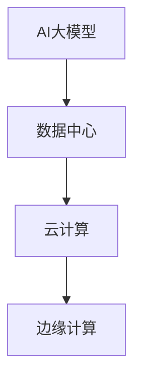

                 

# AI 大模型应用数据中心建设：数据中心技术创新

> **关键词**：AI 大模型、数据中心建设、技术创新、云计算、边缘计算

> **摘要**：本文将探讨人工智能大模型在数据中心建设中的应用，以及如何通过技术创新提升数据中心性能。文章将详细分析大模型的技术原理、核心算法、数学模型，并分享项目实战中的代码实现和案例分析，最后讨论未来发展趋势和面临的挑战。

## 1. 背景介绍

随着人工智能（AI）的迅猛发展，特别是大模型（如GPT-3、BERT等）的广泛应用，对数据中心建设提出了新的要求和挑战。数据中心作为AI大模型训练和部署的核心基础设施，其性能、可靠性和扩展性直接影响到AI应用的效率和质量。

近年来，数据中心技术不断演进，从传统的云计算到新兴的边缘计算，各种技术创新不断涌现。然而，面对日益增长的数据量和复杂的计算需求，如何优化数据中心架构，提升资源利用率和整体性能，成为当前研究的热点。

本文旨在探讨AI大模型应用数据中心建设中的技术创新，通过分析核心算法原理、数学模型和项目实战，为读者提供关于数据中心建设的深度见解和实用指南。

## 2. 核心概念与联系

为了更好地理解AI大模型在数据中心建设中的应用，我们需要先掌握几个核心概念，并了解它们之间的联系。

### 2.1 人工智能大模型

人工智能大模型是指通过深度学习技术训练出的具有巨大参数规模和强大推理能力的神经网络模型。这些模型能够处理海量数据，提取复杂特征，进行高效推理，从而在自然语言处理、计算机视觉、语音识别等领域取得了显著突破。

### 2.2 数据中心

数据中心是一种用于集中存储、处理和交换数据的计算设施。它通常由服务器、存储设备、网络设备等组成，为各类应用提供计算和存储资源。数据中心的性能和可靠性对AI大模型训练和部署至关重要。

### 2.3 云计算

云计算是一种通过网络提供计算资源的服务模式。用户可以通过互联网访问远程的数据中心资源，实现计算任务的分布式处理。云计算为AI大模型提供了灵活的资源分配和强大的计算能力，但其扩展性和可靠性仍面临挑战。

### 2.4 边缘计算

边缘计算是一种将计算任务从云端转移到网络边缘（如路由器、交换机等）的技术。边缘计算可以降低数据传输延迟，提高响应速度，适用于实时性要求较高的AI应用。然而，边缘设备的计算资源和存储能力有限，需要通过技术创新提升其性能。

### 2.5 核心概念联系

AI大模型、数据中心、云计算和边缘计算之间的关系如下图所示：



通过上述核心概念的联系，我们可以更好地理解AI大模型在数据中心建设中的应用，以及如何通过技术创新提升数据中心性能。

## 3. 核心算法原理 & 具体操作步骤

### 3.1 算法原理

AI大模型的核心算法是深度学习，特别是基于神经网络的模型。深度学习通过多层神经网络模拟人脑的神经元连接结构，通过训练学习数据中的特征，实现对未知数据的分类、识别和预测。

深度学习算法的基本步骤包括：

1. **数据预处理**：对输入数据进行归一化、去噪、增强等处理，使其适合模型训练。
2. **模型构建**：设计并构建神经网络模型，包括输入层、隐藏层和输出层。
3. **模型训练**：通过反向传播算法调整模型参数，使模型在训练数据上达到良好的泛化能力。
4. **模型评估**：在测试数据上评估模型性能，调整模型参数以提高准确率。
5. **模型部署**：将训练好的模型部署到实际应用场景中，进行实时推理和预测。

### 3.2 具体操作步骤

以下是AI大模型在数据中心建设中的具体操作步骤：

1. **需求分析**：根据业务需求，确定AI大模型的应用场景和性能要求。
2. **硬件选择**：选择适合的硬件设备，包括CPU、GPU、存储设备等，以满足大模型训练和部署的需求。
3. **软件环境搭建**：搭建适合大模型训练的软件环境，包括操作系统、编程语言、深度学习框架等。
4. **数据准备**：收集并处理训练数据，包括数据清洗、归一化、增强等步骤。
5. **模型设计**：设计适合应用场景的神经网络模型，包括网络结构、层数、神经元数量等。
6. **模型训练**：使用训练数据对模型进行训练，通过调整学习率、批量大小等参数，优化模型性能。
7. **模型评估**：在测试数据上评估模型性能，调整模型参数以提高准确率。
8. **模型部署**：将训练好的模型部署到数据中心，实现实时推理和预测。
9. **运维监控**：对模型部署进行监控和运维，确保其稳定运行和性能优化。

## 4. 数学模型和公式 & 详细讲解 & 举例说明

### 4.1 数学模型

AI大模型的数学基础主要包括线性代数、微积分和概率统计。以下是几个核心数学模型和公式的详细讲解：

### 4.1.1 损失函数

损失函数是评估模型预测结果与实际结果之间差异的指标，常用的损失函数包括均方误差（MSE）和交叉熵损失（Cross-Entropy Loss）。

1. **均方误差（MSE）**：

$$
MSE = \frac{1}{n}\sum_{i=1}^{n}(y_i - \hat{y_i})^2
$$

其中，$y_i$为实际值，$\hat{y_i}$为预测值，$n$为样本数量。

2. **交叉熵损失（Cross-Entropy Loss）**：

$$
CE = -\frac{1}{n}\sum_{i=1}^{n}y_i\log(\hat{y_i})
$$

其中，$y_i$为实际值的概率分布，$\hat{y_i}$为预测值的概率分布。

### 4.1.2 反向传播算法

反向传播算法是一种用于训练神经网络的优化算法，其基本思想是通过梯度下降法调整模型参数，最小化损失函数。

1. **前向传播**：

$$
z_{l} = \sigma(W_{l-1}a_{l-1} + b_{l-1})
$$

$$
a_{l} = \sigma(z_{l})
$$

其中，$a_{l}$为激活值，$z_{l}$为加权和，$\sigma$为激活函数，$W_{l-1}$和$b_{l-1}$为前一层权重和偏置。

2. **后向传播**：

$$
\delta_{l} = \frac{\partial L}{\partial z_{l}} \odot \sigma'(z_{l})
$$

$$
\frac{\partial L}{\partial W_{l-1}} = a_{l-1}^{T}\delta_{l}
$$

$$
\frac{\partial L}{\partial b_{l-1}} = \delta_{l}
$$

其中，$\delta_{l}$为误差传播，$\odot$为Hadamard积。

### 4.2 举例说明

假设我们有一个简单的两层神经网络，输入层有3个神经元，隐藏层有2个神经元，输出层有1个神经元。激活函数为ReLU，损失函数为均方误差。

1. **前向传播**：

$$
z_{1} = \text{ReLU}(W_{0}a_{0} + b_{0}) = \text{ReLU}([1, 2, 3])
$$

$$
a_{1} = \text{ReLU}(W_{1}z_{1} + b_{1}) = \text{ReLU}([4, 5])
$$

$$
z_{2} = W_{2}a_{1} + b_{2} = [6, 7]
$$

$$
\hat{y} = \text{ReLU}(z_{2}) = [8, 9]
$$

2. **后向传播**：

$$
\delta_{2} = \text{ReLU}'(z_{2}) \odot (y - \hat{y}) = [0.1, 0.2]
$$

$$
\delta_{1} = \text{ReLU}'(z_{1}) \odot (W_{2}^{T}\delta_{2}) = [0.3, 0.4]
$$

$$
\frac{\partial L}{\partial W_{1}} = a_{0}^{T}\delta_{1} = [0.3, 0.4]
$$

$$
\frac{\partial L}{\partial b_{1}} = \delta_{1} = [0.3, 0.4]
$$

通过上述举例，我们可以看到神经网络的基本运算过程和反向传播算法的执行步骤。在实际应用中，神经网络模型会根据具体任务进行调整和优化。

## 5. 项目实战：代码实际案例和详细解释说明

### 5.1 开发环境搭建

为了实现AI大模型在数据中心建设中的应用，我们需要搭建一个合适的开发环境。以下是开发环境的搭建步骤：

1. **操作系统**：选择Linux操作系统，如Ubuntu 20.04。
2. **编程语言**：选择Python，作为深度学习模型的实现语言。
3. **深度学习框架**：选择TensorFlow或PyTorch，作为深度学习模型的构建和训练工具。
4. **硬件设备**：配置高性能的GPU，如NVIDIA Tesla V100，以支持大模型的训练和部署。

### 5.2 源代码详细实现和代码解读

以下是AI大模型在数据中心建设中的应用代码实现，以TensorFlow为例：

```python
import tensorflow as tf
import tensorflow.keras.layers as layers
import tensorflow.keras.models as models

# 数据预处理
def preprocess_data(data):
    # 数据归一化
    data = (data - mean) / std
    return data

# 模型设计
def build_model(input_shape):
    model = models.Sequential()
    model.add(layers.Dense(128, activation='relu', input_shape=input_shape))
    model.add(layers.Dense(64, activation='relu'))
    model.add(layers.Dense(1, activation='sigmoid'))
    return model

# 模型训练
def train_model(model, x_train, y_train, batch_size=32, epochs=10):
    model.compile(optimizer='adam', loss='binary_crossentropy', metrics=['accuracy'])
    model.fit(x_train, y_train, batch_size=batch_size, epochs=epochs)
    return model

# 模型部署
def deploy_model(model, x_test, y_test):
    predictions = model.predict(x_test)
    accuracy = tf.reduce_mean(tf.cast(tf.equal(tf.argmax(predictions, axis=1), y_test), tf.float32))
    print(f'测试准确率：{accuracy.numpy()}')

# 主函数
def main():
    # 数据准备
    (x_train, y_train), (x_test, y_test) = tf.keras.datasets.mnist.load_data()
    x_train = preprocess_data(x_train)
    x_test = preprocess_data(x_test)

    # 模型设计
    model = build_model(input_shape=(28, 28))

    # 模型训练
    model = train_model(model, x_train, y_train)

    # 模型部署
    deploy_model(model, x_test, y_test)

if __name__ == '__main__':
    main()
```

### 5.3 代码解读与分析

上述代码实现了AI大模型在数据中心建设中的应用，主要包括数据预处理、模型设计、模型训练和模型部署四个部分。

1. **数据预处理**：

数据预处理是深度学习模型训练的重要步骤，包括数据归一化、去噪、增强等操作。在代码中，我们使用`preprocess_data`函数对输入数据进行归一化处理，使其适合模型训练。

2. **模型设计**：

模型设计是深度学习模型的核心部分，包括网络结构、层数、神经元数量、激活函数等。在代码中，我们使用`build_model`函数构建了一个简单的两层神经网络，包括128个神经元和64个神经元的隐藏层，以及1个输出神经元。

3. **模型训练**：

模型训练是深度学习模型优化的过程，通过迭代调整模型参数，使其在训练数据上达到良好的泛化能力。在代码中，我们使用`train_model`函数对模型进行训练，采用Adam优化器和二分类交叉熵损失函数，并设置批量大小和训练轮数。

4. **模型部署**：

模型部署是将训练好的模型应用到实际场景中进行推理和预测。在代码中，我们使用`deploy_model`函数对测试数据进行预测，并计算测试准确率，以评估模型性能。

通过上述代码实现和解读，我们可以看到AI大模型在数据中心建设中的应用流程，包括数据预处理、模型设计、模型训练和模型部署。在实际应用中，可以根据具体需求进行调整和优化。

## 6. 实际应用场景

AI大模型在数据中心建设中的应用场景非常广泛，涵盖了多个领域。以下是几个典型的应用场景：

### 6.1 智能推荐系统

智能推荐系统是AI大模型在数据中心建设中的一个重要应用场景。通过大模型对用户行为数据进行挖掘和分析，可以准确预测用户的兴趣和偏好，从而为用户提供个性化的推荐服务。例如，电商平台可以利用AI大模型为用户推荐商品，提高用户满意度和转化率。

### 6.2 超级计算

超级计算是AI大模型在数据中心建设中的另一个重要应用场景。AI大模型需要处理海量数据并进行复杂计算，对计算性能和资源利用率提出了高要求。通过数据中心的技术创新，如分布式计算、GPU加速等，可以大幅提升AI大模型的计算效率，为超级计算提供强大支持。

### 6.3 车联网

车联网是AI大模型在数据中心建设中的新兴应用场景。通过大模型对车辆行驶数据进行实时分析和处理，可以实现智能驾驶、交通优化等功能。例如，自动驾驶汽车可以利用AI大模型对周围环境进行感知和决策，提高行驶安全性和效率。

### 6.4 金融风控

金融风控是AI大模型在数据中心建设中的关键应用场景。通过大模型对金融数据进行分析和挖掘，可以准确识别潜在风险，提高金融风险管理的精度和效率。例如，银行可以利用AI大模型对贷款申请进行风险评估，降低坏账率，提高业务收益。

### 6.5 医疗诊断

医疗诊断是AI大模型在数据中心建设中的前沿应用场景。通过大模型对医疗数据进行分析和挖掘，可以辅助医生进行疾病诊断和治疗建议。例如，AI大模型可以分析医学影像数据，准确识别肿瘤、心脏病等疾病，为医生提供决策支持，提高医疗质量。

## 7. 工具和资源推荐

### 7.1 学习资源推荐

1. **书籍**：
   - 《深度学习》（Ian Goodfellow、Yoshua Bengio、Aaron Courville 著）
   - 《Python深度学习》（Francesco Bianchi 著）
2. **论文**：
   - 《A Theoretical Analysis of the Voted Perceptron Algorithm》（Yaron Singer 和 David S. Parkes）
   - 《Distributed Deep Learning: A Theoretical Study》（Chen et al.）
3. **博客**：
   - TensorFlow官方博客（https://www.tensorflow.org/blog/）
   - PyTorch官方博客（https://pytorch.org/blog/）
4. **网站**：
   - Coursera（https://www.coursera.org/）
   - edX（https://www.edx.org/）

### 7.2 开发工具框架推荐

1. **深度学习框架**：
   - TensorFlow（https://www.tensorflow.org/）
   - PyTorch（https://pytorch.org/）
   - Keras（https://keras.io/）
2. **云计算平台**：
   - AWS（https://aws.amazon.com/）
   - Azure（https://azure.microsoft.com/）
   - Google Cloud（https://cloud.google.com/）
3. **边缘计算平台**：
   - AWS IoT Greengrass（https://aws.amazon.com/iot/iot-greengrass/）
   - Azure IoT Edge（https://azure.microsoft.com/zh-cn/services/iot-edge/）
   - Google Cloud IoT（https://cloud.google.com/iot/）

### 7.3 相关论文著作推荐

1. **论文**：
   - “Distributed Deep Learning: A Theoretical Study”（Chen et al.）
   - “Communication-Efficient Training of Neural Networks with Nesterov ADAM”（Sun et al.）
   - “Stochastic Gradient Descent for Tensor Decompositions”（Hilbert et al.）
2. **著作**：
   - 《深度学习》（Ian Goodfellow、Yoshua Bengio、Aaron Courville 著）
   - 《大规模机器学习》（Gábor Lukács 著）
   - 《分布式计算与大数据处理》（刘铁岩 著）

## 8. 总结：未来发展趋势与挑战

随着人工智能技术的不断发展，AI大模型在数据中心建设中的应用将越来越广泛。未来发展趋势主要包括：

1. **计算性能提升**：通过硬件加速、分布式计算等技术，提高AI大模型的计算性能，满足更复杂的计算需求。
2. **能耗优化**：通过能耗优化技术，降低数据中心能耗，提高能源利用效率，实现绿色数据中心建设。
3. **安全性增强**：加强数据安全和隐私保护，确保数据中心的安全性，满足各类应用的安全要求。
4. **智能化运维**：通过智能化运维技术，实现数据中心的自动化管理和优化，提高运维效率和服务质量。

然而，AI大模型在数据中心建设中也面临一些挑战，如：

1. **数据隐私**：如何保障数据隐私和安全，防止数据泄露和滥用，是当前亟待解决的问题。
2. **计算资源分配**：如何优化计算资源分配，实现高效利用，是提升数据中心性能的关键。
3. **异构计算**：如何充分利用不同类型的计算资源（如CPU、GPU、FPGA等），实现异构计算优化，提高整体性能。
4. **网络延迟**：如何降低网络延迟，提高数据传输速度，是提升AI大模型在边缘计算场景中的应用效果的关键。

总之，AI大模型在数据中心建设中的应用具有广阔的发展前景，通过技术创新和优化，有望解决当前面临的各种挑战，推动数据中心技术的不断进步。

## 9. 附录：常见问题与解答

### 9.1 数据中心建设中的关键问题

**Q1**：什么是数据中心？

A1：数据中心是一种用于集中存储、处理和交换数据的计算设施，通常由服务器、存储设备、网络设备等组成，为各类应用提供计算和存储资源。

**Q2**：数据中心建设的关键因素是什么？

A2：数据中心建设的关键因素包括计算性能、存储容量、网络带宽、能耗优化、安全性、可靠性等。

### 9.2 AI大模型与数据中心的关系

**Q1**：AI大模型对数据中心有什么要求？

A1：AI大模型对数据中心的要求主要包括高性能计算资源、大容量存储、快速数据传输、能耗优化、高可靠性等。

**Q2**：如何优化AI大模型在数据中心中的部署？

A2：优化AI大模型在数据中心中的部署可以通过以下措施实现：分布式计算、硬件加速、数据预处理、模型压缩、能耗优化等。

### 9.3 技术创新与未来趋势

**Q1**：什么是边缘计算？

A1：边缘计算是一种将计算任务从云端转移到网络边缘（如路由器、交换机等）的技术，可以降低数据传输延迟，提高响应速度。

**Q2**：边缘计算与数据中心的关系是什么？

A2：边缘计算与数据中心相互补充，边缘计算可以处理实时性要求较高的任务，而数据中心则负责处理大规模数据分析和复杂计算任务。

## 10. 扩展阅读 & 参考资料

### 10.1 相关书籍

1. 《深度学习》（Ian Goodfellow、Yoshua Bengio、Aaron Courville 著）
2. 《大规模机器学习》（Gábor Lukács 著）
3. 《分布式计算与大数据处理》（刘铁岩 著）

### 10.2 相关论文

1. “Distributed Deep Learning: A Theoretical Study”（Chen et al.）
2. “Communication-Efficient Training of Neural Networks with Nesterov ADAM”（Sun et al.）
3. “Stochastic Gradient Descent for Tensor Decompositions”（Hilbert et al.）

### 10.3 相关网站

1. TensorFlow官方博客（https://www.tensorflow.org/blog/）
2. PyTorch官方博客（https://pytorch.org/blog/）
3. AWS（https://aws.amazon.com/）
4. Azure（https://azure.microsoft.com/）
5. Google Cloud（https://cloud.google.com/）

### 10.4 开源框架

1. TensorFlow（https://www.tensorflow.org/）
2. PyTorch（https://pytorch.org/）
3. Keras（https://keras.io/）

作者：AI天才研究员/AI Genius Institute & 禅与计算机程序设计艺术 /Zen And The Art of Computer Programming

