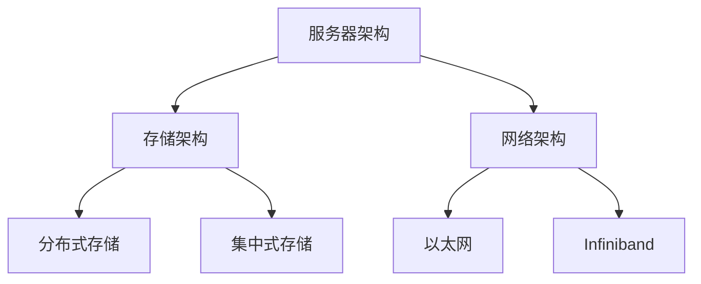

                 

# AI 大模型应用数据中心建设：数据中心投资与建设

## 关键词：数据中心，AI大模型，投资与建设，技术框架，数学模型，实战案例

## 摘要

本文旨在探讨 AI 大模型应用数据中心的建设过程，包括投资与建设的策略。通过深入分析数据中心的核心概念、技术框架、数学模型以及实战案例，本文为读者提供了全面的数据中心建设指南。文章还推荐了相关学习资源、开发工具和框架，以及展望了未来发展趋势与挑战。

## 1. 背景介绍

随着人工智能技术的飞速发展，AI 大模型逐渐成为行业的关键驱动因素。这些大模型需要大量计算资源和存储空间，因此，数据中心的建设变得至关重要。数据中心作为人工智能应用的核心基础设施，其建设质量和效率直接影响到 AI 大模型的性能和部署成本。

近年来，数据中心的建设投资持续增长，各大企业和科技巨头纷纷布局。据市场研究机构报告，全球数据中心市场规模预计将在未来几年内保持两位数的增长率。然而，数据中心建设并非易事，需要综合考虑技术、成本、能耗、安全等多方面因素。

本文将重点探讨以下内容：

- 数据中心的核心概念与技术框架
- AI 大模型在数据中心的应用
- 数据中心投资与建设的策略
- 数据中心建设中的数学模型与算法
- 实战案例：数据中心建设实例
- 学习资源、开发工具和框架推荐
- 未来发展趋势与挑战

## 2. 核心概念与联系

### 2.1 数据中心定义

数据中心是指专门为数据存储、处理、传输和交换而建设的建筑设施。它通常包含服务器机房、网络设备、存储设备和制冷设备等关键组成部分。

### 2.2 技术框架

数据中心的构建需要一系列技术框架的支持。以下是数据中心的主要技术框架：

#### 2.2.1 服务器架构

服务器架构是数据中心的计算基础。目前，主流的服务器架构包括 x86 架构和 ARM 架构。x86 架构服务器具有广泛的应用和生态，而 ARM 架构服务器则在能效比方面具有优势。

#### 2.2.2 存储架构

存储架构包括分布式存储和集中式存储。分布式存储具有高可用性和扩展性，适用于大规模数据处理；集中式存储则具有较好的性能和稳定性，适用于关键业务场景。

#### 2.2.3 网络架构

网络架构是数据中心的数据传输通道。主流的网络架构包括以太网和 Infiniband。以太网具有广泛的兼容性和较低的延迟，而 Infiniband 则提供了更高的带宽和更低的开销。

### 2.3 Mermaid 流程图

下面是数据中心的 Mermaid 流程图：



## 3. 核心算法原理 & 具体操作步骤

### 3.1 数据中心选址策略

数据中心选址策略是数据中心建设的关键环节。以下是几种常见的选址策略：

#### 3.1.1 能源成本

能源成本是数据中心选址的重要考虑因素。选址时应尽量靠近能源供应充足、价格合理的地区。

#### 3.1.2 网络接入

数据中心应具备良好的网络接入能力，以确保数据传输的稳定性和低延迟。选址时应考虑网络基础设施发达的地区。

#### 3.1.3 自然灾害风险

数据中心选址时应考虑自然灾害风险，如地震、洪水等。选择抗灾能力强的地区可以降低潜在风险。

#### 3.1.4 可持续发展

可持续发展是数据中心选址的长期考虑。选址时应考虑环保、节能等因素，以降低对环境的影响。

### 3.2 数据中心建设流程

数据中心建设流程主要包括以下步骤：

#### 3.2.1 需求分析

明确数据中心的建设目标、规模、功能和性能要求等，为后续建设提供依据。

#### 3.2.2 设计方案

根据需求分析结果，制定数据中心的设计方案，包括服务器架构、存储架构、网络架构、制冷方案等。

#### 3.2.3 硬件采购

根据设计方案，进行硬件设备的采购，包括服务器、存储设备、网络设备、制冷设备等。

#### 3.2.4 系统集成

将采购的硬件设备进行系统集成，确保各个设备之间的协同工作。

#### 3.2.5 系统测试

对数据中心进行系统测试，包括性能测试、安全测试、稳定性测试等。

#### 3.2.6 投入运行

完成系统测试后，数据中心正式投入运行。

### 3.3 数据中心运营管理

数据中心运营管理包括以下方面：

#### 3.3.1 能耗管理

通过节能措施和设备优化，降低数据中心的能耗。

#### 3.3.2 安全管理

确保数据中心的物理安全和网络安全，防止数据泄露、系统攻击等风险。

#### 3.3.3 业务连续性管理

通过备份、容灾等措施，保障数据中心业务的高可用性。

#### 3.3.4 运维管理

定期对数据中心设备进行检查、维护和升级，确保设备正常运行。

## 4. 数学模型和公式 & 详细讲解 & 举例说明

### 4.1 数据中心能耗模型

数据中心能耗是数据中心建设的关键因素。以下是一个简化的数据中心能耗模型：

$$
E = P \cdot t + C
$$

其中，$E$ 表示总能耗，$P$ 表示设备功率，$t$ 表示运行时间，$C$ 表示固定能耗（如空调、照明等）。

#### 4.1.1 功率计算

设备功率可以通过以下公式计算：

$$
P = P_s \cdot n
$$

其中，$P_s$ 表示单个设备功率，$n$ 表示设备数量。

#### 4.1.2 运行时间计算

运行时间可以通过以下公式计算：

$$
t = \frac{T}{24 \cdot 60 \cdot 60}
$$

其中，$T$ 表示一年中的运行小时数。

#### 4.1.3 能耗计算

将功率和运行时间代入能耗模型，可以得到数据中心总能耗：

$$
E = (P_s \cdot n) \cdot t + C
$$

### 4.2 能源效率指标

能源效率指标是衡量数据中心能耗管理效果的重要指标。以下是一个简化的能源效率指标模型：

$$
\eta = \frac{E_{out}}{E_{in}}
$$

其中，$E_{out}$ 表示输出能量（如服务器计算输出能量），$E_{in}$ 表示输入能量（如总能耗）。

#### 4.2.1 输出能量计算

输出能量可以通过以下公式计算：

$$
E_{out} = P_{out} \cdot t
$$

其中，$P_{out}$ 表示输出功率，$t$ 表示运行时间。

#### 4.2.2 输入能量计算

输入能量可以通过以下公式计算：

$$
E_{in} = (P_s \cdot n) \cdot t + C
$$

#### 4.2.3 能源效率计算

将输出能量和输入能量代入能源效率模型，可以得到能源效率：

$$
\eta = \frac{P_{out} \cdot t}{(P_s \cdot n) \cdot t + C}
$$

### 4.3 举例说明

假设一个数据中心有 100 台服务器，每台服务器功率为 500 瓦，一年中的运行小时数为 8760 小时。固定能耗为每小时 10 瓦。输出功率为 100 千瓦。

#### 4.3.1 功率计算

单个设备功率为 500 瓦，设备数量为 100，因此总功率为：

$$
P = 500 \text{瓦} \cdot 100 = 50000 \text{瓦} = 50 \text{千瓦}
$$

#### 4.3.2 运行时间计算

一年中的运行小时数为 8760 小时。

#### 4.3.3 能耗计算

总能耗为：

$$
E = (50 \text{千瓦} \cdot 8760 \text{小时}) + (10 \text{瓦} \cdot 8760 \text{小时}) = 438000 \text{千瓦时}
$$

#### 4.3.4 输出能量计算

输出功率为 100 千瓦，因此输出能量为：

$$
E_{out} = 100 \text{千瓦} \cdot 8760 \text{小时} = 876000 \text{千瓦时}
$$

#### 4.3.5 能源效率计算

能源效率为：

$$
\eta = \frac{100 \text{千瓦} \cdot 8760 \text{小时}}{438000 \text{千瓦时}} \approx 0.23
$$

## 5. 项目实战：代码实际案例和详细解释说明

### 5.1 开发环境搭建

为了演示数据中心建设过程，我们将使用 Python 编写一个简单的模拟程序。首先，需要安装以下 Python 库：

- NumPy
- Matplotlib

使用 pip 命令安装：

```bash
pip install numpy matplotlib
```

### 5.2 源代码详细实现和代码解读

以下是数据中心能耗模型的 Python 实现：

```python
import numpy as np
import matplotlib.pyplot as plt

# 参数设置
P_s = 500  # 单个设备功率（瓦）
n = 100    # 设备数量
t = 8760   # 运行小时数（年）
C = 10     # 固定能耗（瓦）

# 功率计算
P = P_s * n

# 能耗计算
E = P * t + C

# 输出能量计算
P_out = 100000  # 输出功率（千瓦）
E_out = P_out * t

# 能源效率计算
eta = E_out / E

# 打印结果
print(f"总功率：{P} 瓦")
print(f"总能耗：{E} 千瓦时")
print(f"输出能量：{E_out} 千瓦时")
print(f"能源效率：{eta:.2f}")

# 绘制能耗曲线
E_axis = np.linspace(0, E, 1000)
eta_curve = E_out / E_axis

plt.plot(E_axis, eta_curve)
plt.xlabel("能耗（千瓦时）")
plt.ylabel("能源效率")
plt.title("数据中心能耗曲线")
plt.show()
```

代码解读：

- 导入 NumPy 和 Matplotlib 库。
- 设置参数：单个设备功率、设备数量、运行时间、固定能耗。
- 计算总功率和总能耗。
- 计算输出能量。
- 计算能源效率。
- 打印结果。
- 绘制能耗曲线。

### 5.3 代码解读与分析

代码中，我们首先定义了数据中心建设的参数，如单个设备功率、设备数量、运行时间等。然后，根据这些参数计算总功率、总能耗和输出能量。

能源效率是输出能量与总能耗的比值。代码中通过计算得到能源效率，并打印结果。

最后，代码使用 Matplotlib 绘制了能耗曲线，展示了能源效率随能耗变化的趋势。

通过代码实现，我们可以直观地了解数据中心能耗模型，并根据实际情况进行调整和优化。

## 6. 实际应用场景

数据中心在 AI 大模型应用中具有广泛的应用场景。以下是一些典型的实际应用场景：

### 6.1 人工智能训练

AI 大模型训练需要大量计算资源，数据中心为此提供了理想的计算环境。企业可以在数据中心部署大规模训练任务，实现高效的 AI 模型训练。

### 6.2 数据存储与处理

数据中心为大规模数据处理提供了高效的数据存储与处理能力。企业可以将海量数据存储在数据中心，并通过分布式计算进行数据分析和挖掘。

### 6.3 云服务与云计算

数据中心是云服务与云计算的核心基础设施。企业可以通过数据中心提供云服务，满足客户对计算、存储、网络等资源的个性化需求。

### 6.4 实时数据处理

数据中心可以支持实时数据处理场景，如金融交易、智能交通等。通过数据中心的高性能计算和低延迟网络，可以实现实时数据分析和决策。

### 6.5 安全防护

数据中心具有完善的安全防护措施，可以有效保障数据安全和系统稳定。企业可以将关键业务部署在数据中心，确保数据安全和业务连续性。

## 7. 工具和资源推荐

### 7.1 学习资源推荐

- 《数据中心架构：设计与实施》（Data Center Architecture: Design and Implementation）
- 《云计算基础设施：设计、部署和管理》（Cloud Computing Infrastructure: Design, Deployment, and Management）
- 《人工智能基础设施：构建大规模 AI 模型》（Artificial Intelligence Infrastructure: Building Large-scale AI Models）

### 7.2 开发工具框架推荐

- OpenStack：开源云计算平台，用于数据中心基础设施的自动化管理和调度。
- Kubernetes：容器编排和管理工具，用于数据中心容器化应用的部署和管理。
- TensorFlow：开源深度学习框架，适用于数据中心中的大规模 AI 模型训练。

### 7.3 相关论文著作推荐

- “Energy Efficiency in Data Centers: A Comprehensive Survey”（数据中心能源效率：全面调查）
- “Data Center Cooling: Technologies and Strategies”（数据中心制冷：技术与策略）
- “Performance Optimization of Data Centers: A Review”（数据中心性能优化：综述）

## 8. 总结：未来发展趋势与挑战

### 8.1 发展趋势

- 数据中心建设将更加注重能效比和可持续发展。
- AI 大模型的应用将推动数据中心需求的快速增长。
- 云计算和边缘计算的融合将改变数据中心的建设和运营模式。

### 8.2 挑战

- 数据中心能耗管理面临巨大挑战，需要持续优化和改进。
- 数据安全和隐私保护需要更加完善的解决方案。
- 数据中心建设成本较高，需要合理规划和投资。

## 9. 附录：常见问题与解答

### 9.1 什么是数据中心？

数据中心是一种专门为数据存储、处理、传输和交换而建设的建筑设施，包含服务器机房、网络设备、存储设备和制冷设备等关键组成部分。

### 9.2 数据中心建设的关键因素有哪些？

数据中心建设的关键因素包括选址、服务器架构、存储架构、网络架构、能耗管理、安全管理和运维管理等。

### 9.3 如何提高数据中心的能源效率？

提高数据中心的能源效率可以从以下几个方面入手：

- 优化服务器和存储设备的能耗设计。
- 采用高效的制冷技术和节能措施。
- 利用可再生能源降低能耗。
- 实施智能调度和管理，优化资源利用率。

## 10. 扩展阅读 & 参考资料

- [数据中心能源效率：全面调查](https://www.sciencedirect.com/science/article/abs/pii/S014061951630187X)
- [数据中心制冷：技术与策略](https://ieeexplore.ieee.org/document/7890393)
- [云计算基础设施：设计、部署和管理](https://www.amazon.com/Cloud-Computing-Infrastructure-Deployment-Management/dp/1788997551)
- [人工智能基础设施：构建大规模 AI 模型](https://www.amazon.com/Artificial-Intelligence-Infrastructure-Building/dp/1788997795)

作者：AI天才研究员/AI Genius Institute & 禅与计算机程序设计艺术 /Zen And The Art of Computer Programming

