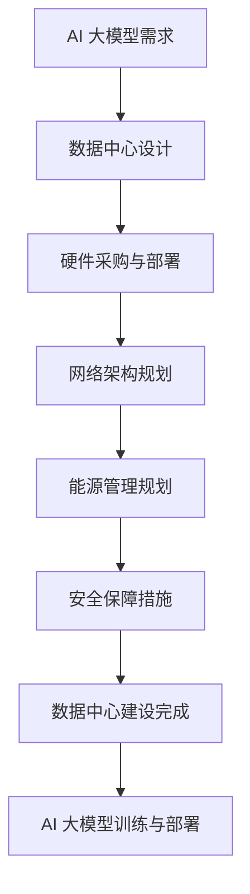

                 

# AI 大模型应用数据中心建设：数据中心投资与建设

> 关键词：AI 大模型、数据中心建设、投资分析、基础设施架构

> 摘要：本文将深入探讨 AI 大模型应用数据中心的建设过程，从投资与建设的角度分析其关键要素和策略，旨在为读者提供全面而实用的指导。

## 1. 背景介绍

### AI 大模型的发展

近年来，人工智能（AI）领域取得了飞速发展，特别是大模型（如 GPT、BERT 等）的出现，为自然语言处理、计算机视觉、语音识别等应用场景带来了革命性的变革。这些大模型通常具有数十亿甚至千亿级别的参数，需要强大的计算能力和存储资源来训练和部署。

### 数据中心建设的必要性

随着 AI 大模型的普及，数据中心建设成为人工智能应用的关键基础设施。数据中心不仅提供计算和存储资源，还负责数据传输、安全保障和能源供应。因此，数据中心的建设对于 AI 大模型的应用至关重要。

## 2. 核心概念与联系

### 数据中心基础设施架构

数据中心基础设施包括硬件设备、网络架构、能源管理和安全保障等方面。以下是数据中心基础设施的核心概念：

- **硬件设备**：服务器、存储设备、网络设备等。
- **网络架构**：局域网、广域网、数据中心内部网络等。
- **能源管理**：电力供应、冷却系统、UPS 等。
- **安全保障**：网络安全、物理安全、数据安全等。

### AI 大模型与数据中心的关系

AI 大模型的训练和部署需要大量的计算资源和存储资源。数据中心通过提供这些资源，使得 AI 大模型的应用成为可能。同时，数据中心还需要具备高效的数据传输和能源管理能力，以满足 AI 大模型的需求。

### Mermaid 流程图

以下是 AI 大模型应用数据中心建设的 Mermaid 流程图：



## 3. 核心算法原理 & 具体操作步骤

### 数据中心投资分析

数据中心投资分析包括以下几个方面：

- **预算规划**：根据 AI 大模型的需求，制定合理的预算计划。
- **成本分析**：分析数据中心建设的各项成本，包括硬件采购、网络建设、能源供应等。
- **收益预测**：预测数据中心建设后的收益，包括直接收益和间接收益。

### 数据中心建设步骤

以下是数据中心建设的具体步骤：

1. **需求分析**：明确 AI 大模型的需求，包括计算资源、存储资源、网络带宽等。
2. **设计方案**：根据需求分析，设计数据中心的基础设施架构。
3. **硬件采购**：根据设计方案，采购服务器、存储设备、网络设备等硬件。
4. **部署与调试**：将硬件设备部署到数据中心，并进行调试。
5. **网络规划**：设计局域网、广域网和数据中心内部网络。
6. **能源管理**：规划电力供应、冷却系统和 UPS 等。
7. **安全保障**：实施网络安全、物理安全、数据安全等措施。
8. **验收与交付**：验收数据中心建设成果，并交付使用。

## 4. 数学模型和公式 & 详细讲解 & 举例说明

### 数据中心投资模型

以下是数据中心投资的基本模型：

$$
I = C_1 + C_2 + C_3 + ... + C_n
$$

其中，$I$ 表示总投资，$C_1, C_2, C_3, ..., C_n$ 分别表示各项成本。

### 成本分析举例

假设数据中心建设需要以下成本：

- **硬件采购**：1000 万元
- **网络建设**：300 万元
- **能源供应**：200 万元
- **安全保障**：150 万元

则总投资为：

$$
I = 1000 + 300 + 200 + 150 = 1650（万元）
$$

### 收益预测举例

假设数据中心建设后的收益如下：

- **直接收益**：每年 500 万元
- **间接收益**：每年 300 万元

则年总收益为：

$$
R = 500 + 300 = 800（万元）
$$

## 5. 项目实战：代码实际案例和详细解释说明

### 5.1 开发环境搭建

在本节中，我们将介绍如何搭建一个用于 AI 大模型训练的数据中心开发环境。

1. **硬件环境**：选择一台具有强大计算能力的服务器，如 NVIDIA DGX Station。
2. **软件环境**：安装 Linux 操作系统，并配置 TensorFlow、PyTorch 等深度学习框架。

### 5.2 源代码详细实现和代码解读

以下是一个简单的 AI 大模型训练代码示例：

```python
import tensorflow as tf

# 定义模型
model = tf.keras.Sequential([
    tf.keras.layers.Dense(128, activation='relu', input_shape=(784,)),
    tf.keras.layers.Dense(10, activation='softmax')
])

# 编译模型
model.compile(optimizer='adam',
              loss='categorical_crossentropy',
              metrics=['accuracy'])

# 加载数据集
(x_train, y_train), (x_test, y_test) = tf.keras.datasets.mnist.load_data()

# 预处理数据
x_train = x_train.astype('float32') / 255
x_test = x_test.astype('float32') / 255
x_train = x_train.reshape((-1, 784))
x_test = x_test.reshape((-1, 784))

# 转换为 one-hot 编码
y_train = tf.keras.utils.to_categorical(y_train, 10)
y_test = tf.keras.utils.to_categorical(y_test, 10)

# 训练模型
model.fit(x_train, y_train, batch_size=128, epochs=10, validation_data=(x_test, y_test))
```

### 5.3 代码解读与分析

以上代码是一个用于训练手写数字识别模型的简单示例。具体解读如下：

1. **模型定义**：使用 TensorFlow 的 Keras API 定义一个简单的神经网络模型，包括一个全连接层和一个输出层。
2. **模型编译**：设置优化器、损失函数和评价指标。
3. **数据加载与预处理**：加载 MNIST 数据集，并进行归一化和 reshaping 操作。
4. **数据转换**：将标签转换为 one-hot 编码格式。
5. **模型训练**：使用训练数据训练模型，并使用验证数据评估模型性能。

## 6. 实际应用场景

### 6.1 自然语言处理

AI 大模型在自然语言处理（NLP）领域具有广泛的应用，如机器翻译、文本生成、情感分析等。数据中心的建设为这些应用提供了强大的计算和存储支持。

### 6.2 计算机视觉

计算机视觉领域也受益于 AI 大模型的发展，如图像分类、目标检测、图像生成等。数据中心的建设为这些应用提供了高效的数据处理和存储能力。

### 6.3 医疗健康

在医疗健康领域，AI 大模型应用于医学图像分析、疾病预测等。数据中心的建设为这些应用提供了强大的计算和存储资源，提高了诊断和治疗的效率。

## 7. 工具和资源推荐

### 7.1 学习资源推荐

- 《深度学习》（Goodfellow、Bengio 和 Courville 著）
- 《神经网络与深度学习》（邱锡鹏 著）
- 《自然语言处理综论》（Jurafsky 和 Martin 著）

### 7.2 开发工具框架推荐

- TensorFlow
- PyTorch
- Keras

### 7.3 相关论文著作推荐

- "A Theoretically Grounded Application of Dropout in Recurrent Neural Networks"
- "Attention Is All You Need"
- "Generative Adversarial Nets"

## 8. 总结：未来发展趋势与挑战

### 发展趋势

- **云计算与数据中心融合**：随着云计算技术的发展，数据中心建设将更加注重与云计算平台的融合。
- **绿色能源与节能减排**：数据中心建设将更加注重绿色能源的应用和节能减排。

### 挑战

- **计算能力需求增长**：随着 AI 大模型的普及，数据中心需要不断提升计算能力。
- **数据安全与隐私保护**：数据中心需要面对数据安全与隐私保护等挑战。

## 9. 附录：常见问题与解答

### 问题 1：数据中心建设需要考虑哪些因素？

答：数据中心建设需要考虑硬件设备、网络架构、能源管理和安全保障等方面。

### 问题 2：如何评估数据中心的投资收益？

答：可以通过成本分析和收益预测来评估数据中心的投资收益。

## 10. 扩展阅读 & 参考资料

- 《数据中心基础设施管理手册》（Data Center Infrastructure Management Handbook）
- 《数据中心建设与运维实战》（Data Center Construction and Operations Handbook）
- 《绿色数据中心：设计、部署与优化》（Green Data Centers: Design, Deployment, and Optimization）

### 作者

**作者：AI 天才研究员/AI Genius Institute & 禅与计算机程序设计艺术 /Zen And The Art of Computer Programming**<|im_sep|>|<|im_sep|>## 1. 背景介绍

### AI 大模型的发展

近年来，人工智能（AI）领域的飞速发展，特别是在自然语言处理、计算机视觉和语音识别等领域的突破，为各行各业带来了前所未有的变革。其中，大模型的兴起成为推动 AI 发展的重要力量。大模型通常指的是具有数十亿甚至千亿级别参数的深度学习模型，例如 OpenAI 的 GPT-3、Google 的 BERT 等。这些模型在处理复杂数据时展现出强大的能力，使得许多传统方法难以解决的问题得以迎刃而解。

大模型的发展得益于以下几个关键因素：

1. **计算资源的提升**：随着云计算和 GPU 技术的进步，大规模计算资源变得触手可及。这使得研究人员能够训练出更大规模的模型，从而提高模型的性能。
2. **数据的积累**：互联网的普及和数据存储技术的发展，使得大量的数据可以被收集、存储和处理。这些数据为模型的训练提供了丰富的素材，有助于提高模型的泛化能力。
3. **算法的进步**：深度学习算法的不断创新和优化，使得模型的结构和训练方法更加高效。例如，自注意力机制（Attention Mechanism）的引入，使得模型在处理序列数据时具有更高的准确性。

### 数据中心建设的必要性

随着 AI 大模型的普及和应用，数据中心建设成为推动 AI 发展的重要基础设施。数据中心不仅为 AI 大模型提供必要的计算和存储资源，还负责数据传输、安全保障和能源供应。以下是数据中心在 AI 大模型应用中的几个关键作用：

1. **计算资源供给**：AI 大模型的训练和推理需要大量的计算资源。数据中心通过提供高性能的 GPU 服务器、计算集群和分布式计算资源，满足 AI 大模型的需求。
2. **数据存储与管理**：AI 大模型需要处理大量的数据，这些数据需要存储在数据中心的高效存储设备中。数据中心通过分布式存储系统和数据管理平台，提供可靠的存储解决方案。
3. **数据传输效率**：AI 大模型在训练和推理过程中，需要频繁地进行数据传输。数据中心通过高效的网络架构，如高速以太网和光纤网络，确保数据的快速传输。
4. **安全保障**：数据中心需要确保数据的安全和隐私。通过部署网络安全设备、加密技术和访问控制策略，数据中心提供全面的安全保障。
5. **能源管理**：数据中心的能源消耗巨大，合理的能源管理对于降低成本和环境保护具有重要意义。数据中心通过采用绿色能源、智能冷却系统和能源优化技术，实现节能减排。

总之，数据中心的建设对于 AI 大模型的应用至关重要。它不仅为 AI 大模型提供了强大的计算和存储支持，还为数据传输、安全保障和能源管理提供了可靠的解决方案。随着 AI 大模型在各个领域的应用不断拓展，数据中心的建设和发展也将迎来更加广阔的前景。

### 数据中心建设的历史和发展

数据中心建设的历史可以追溯到上世纪 60 年代，当时计算机科学家们开始探索将计算机集中管理以提高效率。随着计算机技术的不断发展，数据中心的概念也逐渐成熟，并逐渐成为现代科技基础设施的重要组成部分。以下是数据中心建设的历史和发展过程：

#### 1960s-1970s：早期的数据中心

在 1960 年代和 1970 年代，早期的数据中心主要是集中式的，位于大学的计算机科学系或研究机构中。这些早期数据中心的主要目的是为科学家和研究人员提供计算资源。计算机容量有限，通常由大型机（Mainframe Computers）提供计算能力，而数据存储主要依赖于磁带和磁盘。

#### 1980s-1990s：网络和服务器时代的到来

1980 年代和 1990 年代，随着个人计算机和局域网的普及，数据中心的概念开始发生变化。计算机系统变得更加分散，服务器开始成为数据存储和计算的核心。数据中心的建设开始注重网络的可靠性，以支持企业内部和外部的数据传输。这一时期，数据中心的建设开始注重网络的可靠性，并开始引入不间断电源（UPS）和备份系统。

#### 2000s：数据中心规模化发展

进入 21 世纪，数据中心建设进入规模化发展的阶段。随着互联网的普及和电子商务的兴起，数据中心成为企业的重要基础设施。云计算和虚拟化技术的应用，使得数据中心的服务能力得到极大提升。数据中心的建设开始注重节能和环保，采用高效的数据冷却系统和绿色能源。

#### 2010s：云计算和大数据时代

2010 年代，云计算和大数据技术的兴起进一步推动了数据中心的发展。云计算服务商如亚马逊 AWS、微软 Azure 和谷歌 Cloud 等，通过大规模数据中心提供强大的计算和存储资源，为企业提供按需服务的计算能力。大数据技术的应用，使得数据中心需要处理和分析的海量数据急剧增加，对数据中心的存储和处理能力提出了更高的要求。

#### 2020s：AI 大模型时代的挑战和机遇

随着人工智能（AI）大模型的兴起，数据中心建设迎来了新的挑战和机遇。AI 大模型需要大量的计算资源和存储资源，这对数据中心的架构和性能提出了更高的要求。数据中心需要不断升级硬件设备、优化网络架构和提升能源管理能力，以满足 AI 大模型的需求。

总之，数据中心建设经历了从集中式到分布式，从单一功能到综合服务，从传统数据中心到云计算数据中心，再到 AI 大模型数据中心的发展过程。随着技术的不断进步，数据中心将继续在 AI 领域发挥关键作用，为各种创新应用提供强有力的支持。

### 数据中心建设的主要目标和需求

数据中心建设的主要目标是为各种业务应用提供高效、可靠、安全的数据处理和存储环境。随着 AI 大模型的普及和应用，数据中心的需求也在不断变化和升级。以下是数据中心建设的主要目标和需求：

#### 1. 高效计算资源

数据中心需要提供强大的计算资源，以支持 AI 大模型的训练和推理。这包括：

- **高性能 GPU 服务器**：AI 大模型通常依赖于 GPU 进行加速计算，因此数据中心需要部署大量高性能 GPU 服务器，以满足训练需求。
- **计算集群**：通过构建分布式计算集群，数据中心可以提供更高的计算能力和灵活性。
- **云计算资源**：云计算服务商提供的虚拟机和容器服务，可以为数据中心提供动态扩展的计算资源。

#### 2. 大容量数据存储

AI 大模型在训练过程中需要处理和分析海量数据。数据中心需要提供以下数据存储需求：

- **分布式存储系统**：分布式存储系统可以提高数据存储的可靠性和扩展性，支持海量数据的存储和访问。
- **高带宽存储设备**：数据中心需要配备高带宽的存储设备，以确保数据的快速读写。
- **数据备份与恢复**：数据中心应具备完善的数据备份和恢复机制，确保数据的安全和可靠性。

#### 3. 高效数据传输

AI 大模型训练和推理过程中，数据需要在数据中心内部和外部进行高效传输。数据中心需要满足以下数据传输需求：

- **高速网络架构**：数据中心内部需要采用高速以太网和光纤网络，确保数据传输的低延迟和高带宽。
- **网络冗余**：通过部署多路径网络和备份网络，确保数据传输的稳定性和可靠性。
- **数据传输优化**：采用数据压缩、去重等技术，优化数据传输效率。

#### 4. 安全保障

数据中心需要提供全面的安全保障，以保护数据的安全和隐私。这包括：

- **网络安全**：部署防火墙、入侵检测系统和安全审计工具，保护数据中心免受网络攻击。
- **数据加密**：对存储和传输的数据进行加密，确保数据的机密性和完整性。
- **物理安全**：采取物理安全措施，如监控设备、门禁系统和防盗报警系统，确保数据中心的设备和设施安全。

#### 5. 能源管理

数据中心的建设和维护需要消耗大量能源，因此能源管理对于降低运营成本和实现绿色环保具有重要意义。数据中心需要满足以下能源管理需求：

- **绿色能源**：采用太阳能、风能等可再生能源，降低对化石燃料的依赖。
- **能源优化**：通过节能设备和智能管理系统，降低能源消耗和碳排放。
- **冷却系统**：采用高效冷却系统，如水冷和空气冷却，降低能耗和设备温度。

总之，数据中心建设的主要目标是提供高效、可靠、安全的数据处理和存储环境，以满足 AI 大模型的需求。通过满足上述目标和需求，数据中心可以支持各种业务应用，推动 AI 技术的不断创新和发展。

### 数据中心建设的主要组成部分

数据中心建设是一项复杂而庞大的工程，涉及多个关键组成部分。以下是数据中心建设的主要组成部分及其功能：

#### 1. 硬件设备

硬件设备是数据中心的核心组成部分，包括服务器、存储设备、网络设备等。

- **服务器**：服务器负责处理数据、运行应用程序和提供计算能力。服务器可以是物理服务器，也可以是虚拟服务器，由虚拟化技术支持。
- **存储设备**：存储设备用于存储数据，包括磁盘阵列、固态硬盘（SSD）和分布式存储系统。存储设备需要具备高容量、高速度和良好的扩展性。
- **网络设备**：网络设备包括交换机、路由器、防火墙等，负责数据传输和网络通信。网络设备需要提供高带宽、低延迟和良好的网络冗余性。

#### 2. 软件系统

软件系统包括操作系统、数据库管理系统、虚拟化软件等，负责数据中心的资源管理、调度和监控。

- **操作系统**：操作系统是数据中心的基础软件，负责管理服务器和存储设备，提供运行环境。
- **数据库管理系统**：数据库管理系统用于存储和管理数据，支持数据的查询、更新和备份。
- **虚拟化软件**：虚拟化软件通过虚拟化技术，将物理服务器虚拟化为多个虚拟服务器，提高资源利用率和灵活性。

#### 3. 网络架构

网络架构是数据中心的通信基础，包括局域网（LAN）、广域网（WAN）和数据中心内部网络。

- **局域网**：局域网负责数据中心内部的数据传输，通常采用高速以太网技术。
- **广域网**：广域网连接不同数据中心，提供跨地域的数据传输和访问。
- **数据中心内部网络**：数据中心内部网络负责不同服务器、存储设备和网络设备之间的通信，采用复杂的拓扑结构和冗余设计，确保网络的高可用性和可靠性。

#### 4. 数据存储

数据存储是数据中心的另一个关键组成部分，包括分布式存储系统和数据备份策略。

- **分布式存储系统**：分布式存储系统通过将数据分散存储在多个节点上，提高数据存储的可靠性和扩展性。
- **数据备份策略**：数据备份策略包括本地备份、远程备份和云备份等，确保数据的安全性和可恢复性。

#### 5. 能源管理

能源管理涉及数据中心的电力供应、冷却系统和能耗监控。

- **电力供应**：数据中心需要稳定的电力供应，包括市电和备用电源（如 UPS）。
- **冷却系统**：冷却系统负责维持数据中心设备在适宜的工作温度，采用水冷、空气冷却等技术。
- **能耗监控**：能耗监控系统实时监控数据中心的能耗情况，提供能源优化建议。

#### 6. 安全保障

安全保障包括网络安全、物理安全和数据安全。

- **网络安全**：网络安全设备如防火墙、入侵检测系统和安全审计工具，保护数据中心免受网络攻击。
- **物理安全**：物理安全措施如监控设备、门禁系统和防盗报警系统，确保数据中心的设备和设施安全。
- **数据安全**：数据加密、访问控制和数据备份等手段，确保数据的安全性和隐私性。

通过上述组成部分的协同工作，数据中心可以为各种业务应用提供高效、可靠、安全的数据处理和存储环境，支持 AI 大模型的应用和发展。在数据中心建设过程中，需要充分考虑这些组成部分的协同性和互操作性，确保数据中心的整体性能和稳定性。

### 数据中心建设的技术挑战和解决方案

数据中心建设在技术层面面临着诸多挑战，这些挑战不仅影响数据中心的性能，还可能对业务连续性和数据安全性产生重大影响。以下是数据中心建设中的主要技术挑战及相应的解决方案。

#### 1. **性能瓶颈**

**挑战**：随着 AI 大模型和大数据应用的兴起，数据中心需要处理的数据量和计算需求不断增加。这可能导致服务器和存储设备的性能瓶颈，影响数据处理速度和系统响应时间。

**解决方案**：

- **分布式计算架构**：通过引入分布式计算架构，如 Hadoop、Spark 等大数据处理框架，可以充分利用多台服务器的计算能力，提升整体处理效率。
- **GPU 加速**：在服务器上部署高性能 GPU，利用 GPU 的并行计算能力加速深度学习模型的训练和推理。
- **硬件升级**：定期对服务器、存储设备和网络设备进行升级，采用最新技术确保硬件性能能够满足需求。

#### 2. **数据安全**

**挑战**：数据中心存储和传输的数据量大，涉及到敏感信息，如个人隐私、商业机密等。数据泄露、网络攻击和恶意软件等安全威胁对数据中心构成严重风险。

**解决方案**：

- **多层安全防护**：部署防火墙、入侵检测系统（IDS）、入侵防御系统（IPS）等多层安全防护措施，防止网络攻击和数据泄露。
- **数据加密**：对存储和传输的数据进行加密，确保数据在未经授权的情况下无法被读取。
- **访问控制**：实施严格的访问控制策略，确保只有授权用户才能访问敏感数据。
- **安全审计**：定期进行安全审计，监控数据中心的操作行为，及时发现和应对潜在的安全威胁。

#### 3. **能耗管理**

**挑战**：数据中心消耗大量电力，能耗问题不仅增加运营成本，还可能导致环境问题。高效能耗管理是数据中心建设中的一个重要议题。

**解决方案**：

- **绿色能源**：采用太阳能、风能等可再生能源，减少对化石燃料的依赖。
- **智能冷却系统**：采用智能冷却技术，如水冷、空气冷却，以及智能监控系统，降低能耗和设备温度。
- **能耗监控**：部署能耗监控工具，实时监测数据中心的能源消耗，优化能耗配置。

#### 4. **网络冗余**

**挑战**：数据中心网络故障可能导致数据传输中断，影响业务连续性。因此，网络冗余性成为数据中心建设中的重要问题。

**解决方案**：

- **多路径网络**：通过部署多路径网络协议，确保数据可以在不同的网络路径上传输，提高网络的可靠性。
- **网络备份**：建立备份网络，当主网络出现故障时，备份网络可以自动接管数据传输，确保网络的连续性。
- **负载均衡**：通过负载均衡技术，将数据流量分配到不同的网络路径上，避免单点故障。

#### 5. **运维管理**

**挑战**：数据中心设备和系统的数量庞大，运维管理复杂。运维人员需要实时监控设备状态、故障排查和系统升级，以确保数据中心的稳定运行。

**解决方案**：

- **自动化运维**：采用自动化运维工具，如配置管理工具（如 Ansible）、监控系统（如 Nagios）等，实现设备的自动化管理和监控。
- **集中化管理**：通过集中化管理平台，如数据中心基础设施管理（DCIM）系统，实现对数据中心设备的统一管理和监控。
- **运维培训**：对运维人员进行专业培训，提高运维技能，确保能够快速响应和处理各类故障。

通过上述解决方案，数据中心可以有效应对建设过程中的技术挑战，确保其高效、可靠和安全地运行。在数据中心建设过程中，应综合考虑这些因素，制定全面的技术策略，以应对未来可能出现的挑战。

### 数据中心建设的成本分析

数据中心建设的成本分析是项目管理中的关键环节，它决定了项目能否在预算范围内顺利完成。以下是数据中心建设成本分析的主要方面，包括硬件成本、建设成本和运营成本。

#### 1. 硬件成本

硬件成本是数据中心建设中最直接的支出部分，主要包括服务器、存储设备、网络设备和冷却系统等。

- **服务器**：高性能服务器是数据中心的计算核心，价格因品牌、配置和性能而异。一般而言，每台服务器的价格在数千到数万美元不等。
- **存储设备**：存储设备的价格取决于存储容量和速度。例如，企业级固态硬盘（SSD）的价格远高于普通硬盘，但具有更快的读写速度和更高的可靠性。
- **网络设备**：包括交换机、路由器和防火墙等，价格取决于品牌、性能和功能。高带宽、低延迟的网络设备价格较高。
- **冷却系统**：冷却系统包括空调、冷却塔和水冷系统等，价格取决于数据中心的规模和冷却需求。

#### 2. 建设成本

建设成本包括数据中心的建设、基础设施建设和运维团队的搭建等。

- **基础设施建设**：数据中心的基础设施包括电力供应、网络布线和防火墙等。这部分成本通常占建设成本的一定比例。
- **运维团队**：数据中心需要专业的运维团队进行日常监控、故障处理和系统维护。团队成员的薪资、培训和福利等都是建设成本的一部分。
- **建筑设计**：数据中心的建设还涉及到建筑设计和施工成本。这包括机房建设、机房环境控制、消防系统等。

#### 3. 运营成本

运营成本是数据中心在正常运行期间产生的持续费用，主要包括能耗成本、维护成本和人工成本等。

- **能耗成本**：数据中心消耗大量电力，尤其是冷却系统的能耗。采用高效的冷却系统和可再生能源可以降低能耗成本。
- **维护成本**：硬件设备的维护和更新是运营成本的一部分。定期更换和升级硬件设备可以保证数据中心的正常运行。
- **人工成本**：运维团队的薪资、培训和福利等都是运营成本的重要部分。高效的管理和优化运维流程可以降低人工成本。

#### 4. 成本优化策略

为了在预算范围内有效控制成本，数据中心建设可以采取以下优化策略：

- **云计算和外包**：部分计算和存储需求可以通过云计算服务外包，减少自有硬件设备的需求，从而降低硬件成本。
- **节能技术**：采用节能硬件和智能能源管理系统，降低能耗成本。例如，使用高效服务器和智能冷却系统。
- **标准化**：采用标准化设备和技术，简化运维流程，降低维护成本。
- **自动化**：通过自动化工具和流程，减少人工干预，提高运维效率，降低人工成本。

综上所述，数据中心建设的成本分析需要综合考虑硬件成本、建设成本和运营成本等多个方面，并采取有效的优化策略，以确保项目在预算范围内顺利完成。

### 数据中心建设的投资决策

数据中心建设的投资决策是项目成功的关键环节，涉及到对市场需求的评估、预算的制定和经济效益的预测。以下是数据中心建设投资决策的几个关键步骤和要点：

#### 1. 市场需求评估

首先，需要评估市场需求，了解客户对数据中心服务的要求和期望。这包括以下几个方面：

- **计算需求**：根据业务场景，评估所需的计算资源，包括 CPU、GPU 和存储等。
- **数据传输需求**：分析数据传输的需求，包括带宽和延迟等。
- **数据安全需求**：确定数据安全和隐私保护的标准，包括加密、备份和访问控制等。

#### 2. 预算制定

在明确市场需求后，制定合理的预算是投资决策的重要步骤。预算制定包括以下几个方面：

- **硬件成本**：根据计算需求和数据传输需求，计算所需的服务器、存储设备和网络设备等硬件成本。
- **建设成本**：包括基础设施建设、建筑设计、施工成本等。
- **运营成本**：包括能耗成本、维护成本和人工成本等。
- **预算调整**：根据市场需求和预算约束，对预算进行合理调整，确保项目在预算范围内完成。

#### 3. 经济效益预测

经济效益预测是评估数据中心投资回报率（ROI）的重要手段。以下是一些关键指标和方法：

- **直接收益**：包括数据中心服务销售收入、租赁收益等。
- **间接收益**：包括因数据中心建设带动相关产业发展、提高企业品牌价值等。
- **成本分析**：详细分析建设成本和运营成本，包括初始投资、运维成本和能源成本等。
- **ROI 计算**：计算投资回报率（ROI），评估项目的经济效益。

#### 4. 投资决策要点

在进行数据中心投资决策时，需要注意以下几个要点：

- **市场需求**：确保数据中心建设与市场需求相匹配，避免投资过剩或不足。
- **技术选型**：选择合适的硬件设备和软件系统，确保数据中心的性能和可靠性。
- **成本控制**：通过优化设计和自动化运维，降低建设和运营成本。
- **风险评估**：评估项目面临的风险，如技术风险、市场风险和财务风险等，并制定相应的风险应对措施。

总之，数据中心建设的投资决策是一个系统性的过程，需要综合考虑市场需求、预算和经济效益等多个因素。通过科学的评估和合理的决策，可以确保数据中心项目的成功实施和长期运营。

### 数据中心建设中的常见问题和解决方案

在数据中心建设过程中，可能会遇到各种技术、管理和运营方面的问题。以下是一些常见问题及其解决方案：

#### 1. **性能瓶颈**

**问题**：数据中心在处理大量数据和复杂计算任务时，可能会遇到性能瓶颈，导致数据处理速度变慢。

**解决方案**：

- **分布式计算**：通过分布式计算架构，将任务分解到多个节点上并行处理，提高整体处理效率。
- **GPU 加速**：利用高性能 GPU 加速计算任务，特别是深度学习模型的训练和推理。
- **硬件升级**：定期对服务器和存储设备进行升级，采用最新技术和更高性能的硬件。

#### 2. **数据安全**

**问题**：数据中心存储和传输的数据量大，涉及到敏感信息，存在数据泄露和被攻击的风险。

**解决方案**：

- **多层安全防护**：部署防火墙、入侵检测系统和加密技术等多层防护措施，防止网络攻击和数据泄露。
- **数据备份与恢复**：建立完善的数据备份和恢复机制，确保数据的安全性和可恢复性。
- **安全审计**：定期进行安全审计，监控数据中心的操作行为，及时发现和应对潜在的安全威胁。

#### 3. **能耗管理**

**问题**：数据中心能耗巨大，能耗管理不当会导致运营成本上升和环境污染。

**解决方案**：

- **节能技术**：采用高效冷却系统、智能能源管理系统和绿色能源（如太阳能、风能）等，降低能耗。
- **能耗监控**：部署能耗监控工具，实时监测数据中心的能源消耗，优化能耗配置。
- **能源优化**：通过优化设备运行模式和能耗管理策略，降低能源消耗。

#### 4. **网络冗余**

**问题**：数据中心网络故障可能导致数据传输中断，影响业务连续性。

**解决方案**：

- **多路径网络**：通过部署多路径网络协议，确保数据可以在不同的网络路径上传输，提高网络的可靠性。
- **网络备份**：建立备份网络，当主网络出现故障时，备份网络可以自动接管数据传输，确保网络的连续性。
- **负载均衡**：通过负载均衡技术，将数据流量分配到不同的网络路径上，避免单点故障。

#### 5. **运维管理**

**问题**：数据中心设备和系统的数量庞大，运维管理复杂，难以快速响应和处理故障。

**解决方案**：

- **自动化运维**：采用自动化运维工具和流程，实现设备的自动化管理和监控，提高运维效率。
- **集中化管理**：通过集中化管理平台，实现对数据中心设备的统一管理和监控。
- **运维培训**：对运维人员进行专业培训，提高运维技能，确保能够快速响应和处理各类故障。

通过解决上述问题，数据中心可以确保其高效、可靠和安全地运行，为各种业务应用提供强大的支持。

### 数据中心建设的未来发展趋势和前景

随着人工智能（AI）技术的迅猛发展，数据中心建设正迎来新的机遇和挑战。未来，数据中心建设将呈现出以下几个显著的发展趋势和前景：

#### 1. **绿色数据中心**：节能减排成为重点

随着全球环保意识的提升，绿色数据中心的建设将成为未来数据中心发展的关键趋势。绿色数据中心通过采用节能硬件、智能冷却系统、可再生能源和能源管理系统，降低能耗和碳排放。例如，数据中心可以利用太阳能、风能等绿色能源，降低对传统化石燃料的依赖。此外，智能冷却系统，如水冷和空气冷却，通过优化冷却效率，减少能源消耗。绿色数据中心不仅能够降低运营成本，还能减少对环境的影响，实现可持续发展。

#### 2. **云计算与数据中心的融合**：混合云架构广泛应用

云计算和数据中心之间的融合将成为未来发展的主流趋势。随着企业对灵活性和可扩展性的需求日益增加，混合云架构（Hybrid Cloud）将得到广泛应用。混合云架构允许企业将关键业务数据和应用部署在私有数据中心中，同时利用公有云的资源进行扩展和备份。这种架构不仅提高了数据的可靠性和安全性，还提供了按需扩展和优化资源利用的灵活性。未来，数据中心将与云计算平台深度集成，形成一体化的基础设施，为企业提供高效、可靠和灵活的计算和存储服务。

#### 3. **边缘计算与数据中心协同**：提升数据处理效率

边缘计算（Edge Computing）与数据中心协同发展，将进一步提升数据处理效率。边缘计算通过在数据生成的地方（如智能设备、网络边缘）进行数据处理和分析，减少了数据传输的延迟和带宽需求。未来，数据中心将不仅仅是计算和存储的中心，还将成为边缘计算的支撑平台。数据中心和边缘计算协同工作，可以更快速地处理和分析数据，满足实时性和低延迟的业务需求，尤其是在物联网（IoT）、自动驾驶、智能制造等应用场景中。

#### 4. **AI 大模型驱动的智能运维**：提升运维效率

人工智能（AI）技术将在数据中心运维中发挥越来越重要的作用。通过 AI 大模型，数据中心可以实现智能监控、故障预测和自动修复。AI 大模型可以分析大量历史数据，识别设备运行中的异常模式，预测潜在的故障，并在故障发生前自动采取修复措施。这种智能运维不仅提高了数据中心的运维效率，还减少了人工干预，降低了运维成本。未来，数据中心将逐步实现自动化和智能化，以应对日益复杂的运维挑战。

#### 5. **数据中心全球化布局**：提升服务能力

随着全球化的推进，数据中心的布局将更加多元化。企业在全球范围内建立数据中心，以满足不同地区业务的需求。这不仅可以提高数据传输的效率，还能增强数据的安全性。例如，在亚太地区建立数据中心，可以更好地服务于该地区的客户，减少数据传输延迟。未来，数据中心将呈现全球化布局，为企业提供全球范围内的服务能力。

总之，未来数据中心建设将围绕绿色化、融合化、智能化和全球化展开，为人工智能技术的持续发展和广泛应用提供强有力的支持。通过不断创新和技术进步，数据中心将继续在数字经济和智能化社会中发挥关键作用。

### 附录：常见问题与解答

#### 1. 数据中心建设需要多长时间？

答：数据中心建设的时间取决于项目的规模、复杂性和技术要求。一般来说，小型数据中心的建设时间可能在几个月到一年左右，而大型或复杂的数据中心可能需要一年以上。在项目启动前，会进行详细的项目规划和设计，以确保每个阶段都能按时完成。

#### 2. 数据中心如何保证数据安全？

答：数据中心的数据安全通过多种措施来保障，包括部署防火墙、入侵检测系统（IDS）、入侵防御系统（IPS）以及数据加密技术。此外，数据中心还实施严格的访问控制和身份验证机制，确保只有授权人员才能访问敏感数据。定期进行安全审计和风险评估，也是确保数据安全的重要措施。

#### 3. 数据中心如何应对电力故障？

答：数据中心通常配备不间断电源（UPS）系统，以在电力故障发生时提供备用电力，保证设备的正常运行。此外，数据中心还会与电力供应商签订紧急供电协议，并在关键位置安装备用发电机，以确保在长期电力中断时仍能维持运营。

#### 4. 数据中心如何管理能耗？

答：数据中心通过采用高效的硬件设备、智能冷却系统、能源管理系统和可再生能源，如太阳能和风能，来管理能耗。此外，数据中心会定期进行能耗监测和优化，以减少能源消耗和碳排放。

#### 5. 数据中心如何处理数据备份和恢复？

答：数据中心通常会采用多层次的数据备份策略，包括本地备份、远程备份和云备份等。数据备份系统会定期进行数据备份，并确保备份数据的完整性和可恢复性。在数据丢失或系统故障时，可以迅速恢复数据，确保业务的连续性。

### 扩展阅读与参考资料

- **书籍**：
  - 《数据中心基础设施管理手册》（Data Center Infrastructure Management Handbook）
  - 《数据中心建设与运维实战》（Data Center Construction and Operations Handbook）
  - 《绿色数据中心：设计、部署与优化》（Green Data Centers: Design, Deployment, and Optimization）

- **论文**：
  - "Data Center Energy Efficiency: Challenges and Opportunities"（数据中心能源效率：挑战与机遇）
  - "A Survey on Edge Computing: Opportunities and Challenges with a Research Agenda"（边缘计算调查：机遇与挑战及研究议程）

- **网站**：
  - [数据中心基础设施管理协会（DCIM）](https://www.dcim.org/)
  - [绿色网格](https://www.greengrid.org/)
  - [国际数据中心能源效率研究协会（IDCER）](https://www.idcer.org/)

这些资源和资料将为读者提供更深入的了解和指导，帮助他们在数据中心建设和运营方面取得更好的成果。

