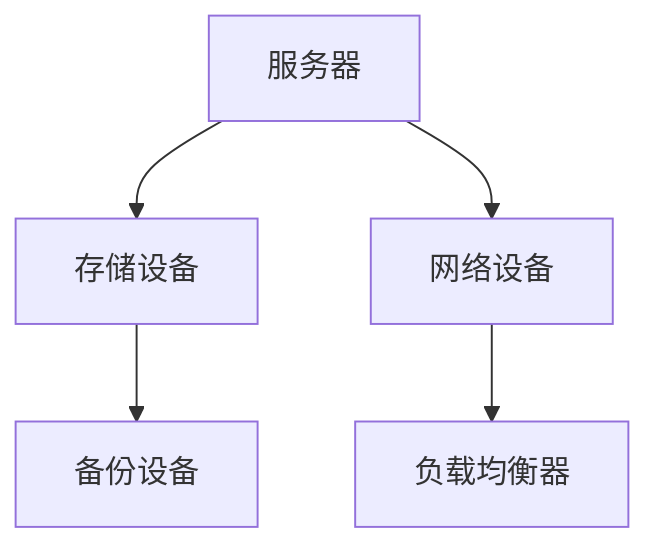
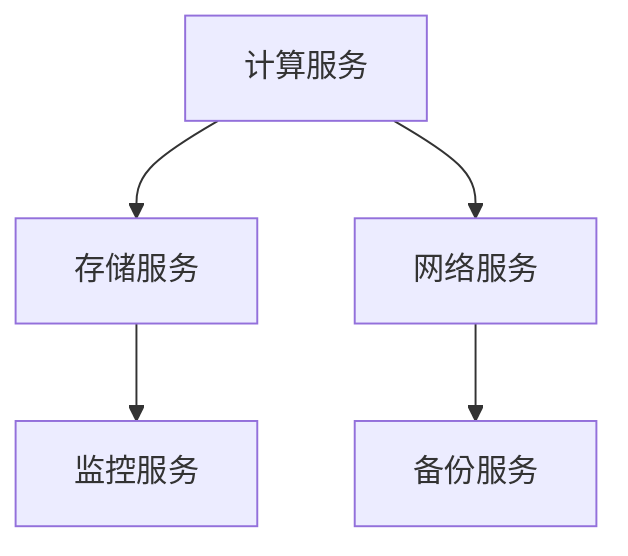
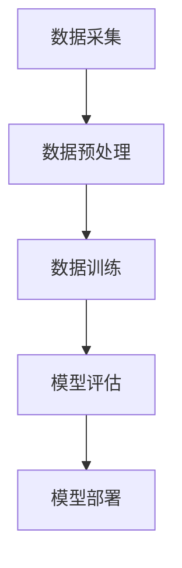

                 

# AI 大模型应用数据中心建设：数据中心标准与规范

## 关键词：大模型、数据中心、标准、规范、AI 应用

### 摘要

随着人工智能技术的飞速发展，大模型的应用已经成为推动各行业进步的关键因素。数据中心作为承载大模型训练和部署的核心基础设施，其建设标准和规范显得尤为重要。本文旨在系统地介绍大模型应用数据中心的标准与规范，包括背景介绍、核心概念、算法原理、数学模型、实际应用场景、工具推荐以及未来发展趋势与挑战。通过本文的阅读，读者将全面了解大模型数据中心建设的关键要素，为实际项目提供有价值的参考。

## 1. 背景介绍

### 1.1 人工智能与大数据的发展

人工智能（AI）作为计算机科学的一个重要分支，经过数十年的发展，已经逐渐渗透到我们日常生活的各个方面。特别是近年来，随着大数据、云计算等技术的不断进步，人工智能迎来了前所未有的发展机遇。大数据为AI提供了丰富的训练数据，使得机器学习算法能够不断优化，从而实现更高的准确率和更强的学习能力。

### 1.2 大模型的概念

大模型，通常指的是那些拥有数十亿甚至数万亿参数的深度神经网络模型。这些模型在图像识别、自然语言处理、语音识别等领域展现了卓越的性能，大大推动了人工智能技术的发展。例如，谷歌的Transformer模型，拥有超过10亿个参数，是当前最先进的自然语言处理模型之一。

### 1.3 数据中心的作用

数据中心是存储、处理和分发数据的关键基础设施。在大模型的应用中，数据中心扮演着至关重要的角色。大模型训练需要大量的计算资源和数据存储空间，而数据中心提供了这些基础设施。同时，数据中心的高可靠性、安全性和高效性也是大模型应用所必需的。

## 2. 核心概念与联系

### 2.1 数据中心的定义与功能

数据中心是指为满足大量数据处理、存储、备份和分发需求而设计的数据处理设施。其核心功能包括：

- **数据存储**：数据中心提供大规模的数据存储解决方案，可以存储海量数据，满足大模型训练的需要。
- **数据处理**：数据中心通过高速计算资源对数据进行处理，支持大模型的训练和推理。
- **数据备份**：数据中心采用多重备份机制，确保数据的安全性和可靠性。
- **数据分发**：数据中心可以快速分发数据到全球各地，支持远程访问和部署。

### 2.2 大模型与数据中心的联系

大模型的训练和部署高度依赖于数据中心的计算和存储资源。具体来说，大模型与数据中心的联系体现在以下几个方面：

- **计算资源**：大模型的训练需要大量的计算资源，数据中心提供了这些资源，支持大模型的训练过程。
- **数据存储**：大模型训练需要大量的训练数据，数据中心提供了数据存储空间，确保数据的安全性和可访问性。
- **网络带宽**：大模型的应用需要快速的数据传输，数据中心提供了高速网络带宽，支持数据的高速传输。
- **可靠性**：数据中心的高可靠性保障了大模型训练和部署的连续性和稳定性。

### 2.3 数据中心标准与规范的重要性

数据中心标准与规范对于大模型的应用至关重要。这些标准和规范包括：

- **基础设施标准**：如建筑结构、电力供应、冷却系统等。
- **网络安全标准**：如数据加密、防火墙、入侵检测等。
- **数据处理标准**：如数据清洗、数据存储、数据管理等。
- **服务等级标准**：如数据中心的可用性、响应时间、故障恢复时间等。

这些标准和规范确保了数据中心的稳定运行，为大模型的应用提供了坚实的基础。

## 3. 核心算法原理 & 具体操作步骤

### 3.1 数据中心的硬件架构

数据中心的核心是硬件架构，包括服务器、存储设备、网络设备等。以下是一个典型数据中心硬件架构的Mermaid流程图：



- **服务器**：服务器是数据中心的计算核心，承担着大模型的训练和推理任务。
- **存储设备**：存储设备用于存储大量的数据和模型，包括硬盘、固态硬盘、分布式存储系统等。
- **网络设备**：网络设备包括交换机、路由器等，负责数据的高速传输和分发。
- **备份设备**：备份设备用于数据的备份和恢复，确保数据的安全性和可靠性。

### 3.2 数据中心的服务架构

数据中心的服务架构包括计算服务、存储服务、网络服务等多种服务。以下是一个典型数据中心服务架构的Mermaid流程图：



- **计算服务**：计算服务提供计算资源，支持大模型的训练和推理。
- **存储服务**：存储服务提供数据存储和管理功能，支持大模型的数据存储需求。
- **网络服务**：网络服务提供数据传输和分发功能，支持大模型的数据访问和部署。
- **监控服务**：监控服务用于监控数据中心的运行状态，确保数据中心的稳定运行。
- **备份服务**：备份服务用于数据的备份和恢复，确保数据的安全性和可靠性。

### 3.3 大模型的数据处理流程

大模型的数据处理流程通常包括数据采集、数据预处理、数据训练、模型评估等步骤。以下是一个典型大模型数据处理流程的Mermaid流程图：



- **数据采集**：从各种来源采集数据，包括互联网、数据库、传感器等。
- **数据预处理**：对采集到的数据进行清洗、转换、归一化等处理，使其适合模型训练。
- **数据训练**：使用预处理后的数据进行模型训练，调整模型参数，优化模型性能。
- **模型评估**：使用验证数据对模型进行评估，确保模型达到预期的性能。
- **模型部署**：将训练好的模型部署到数据中心，进行实际应用。

## 4. 数学模型和公式 & 详细讲解 & 举例说明

### 4.1 模型参数的计算

在深度学习中，模型参数的计算是一个核心问题。以下是一个简单的线性模型参数计算公式：

$$
\text{参数} = w \cdot x + b
$$

其中，\( w \) 是权重，\( x \) 是输入特征，\( b \) 是偏置。例如，对于一张图像，输入特征可以是一个128x128的矩阵，权重是一个128x10的矩阵，偏置是一个10维的向量。通过这个公式，我们可以计算出每个类别的得分，从而进行分类。

### 4.2 损失函数的计算

损失函数是深度学习中的另一个核心概念。以下是一个常见的均方误差损失函数：

$$
\text{损失} = \frac{1}{2} \sum_{i=1}^{n} (y_i - \hat{y}_i)^2
$$

其中，\( y_i \) 是真实标签，\( \hat{y}_i \) 是模型预测的标签。损失函数用于衡量模型预测与真实标签之间的差距，从而指导模型训练。

### 4.3 优化算法的选择

优化算法是深度学习中用于调整模型参数的方法。以下是一个常见的随机梯度下降（SGD）算法：

$$
w_{\text{new}} = w_{\text{old}} - \alpha \cdot \nabla_w \text{损失函数}
$$

其中，\( w_{\text{old}} \) 是当前模型参数，\( w_{\text{new}} \) 是更新后的模型参数，\( \alpha \) 是学习率，\( \nabla_w \text{损失函数} \) 是损失函数关于模型参数的梯度。通过不断迭代更新模型参数，优化算法可以帮助模型收敛到最优解。

### 4.4 模型性能评估

在模型训练完成后，需要对模型进行性能评估。以下是一个常见的准确率评估指标：

$$
\text{准确率} = \frac{\text{预测正确的样本数}}{\text{总样本数}}
$$

准确率用于衡量模型预测的正确性，值越高，模型性能越好。

## 5. 项目实战：代码实际案例和详细解释说明

### 5.1 开发环境搭建

要构建一个大模型应用数据中心，首先需要搭建一个合适的开发环境。以下是一个简单的开发环境搭建步骤：

1. 安装Python环境，选择Python 3.8及以上版本。
2. 安装TensorFlow，使用pip命令安装：`pip install tensorflow`。
3. 安装PyTorch，使用pip命令安装：`pip install torch torchvision`。
4. 安装必要的依赖库，如NumPy、Pandas等。

### 5.2 源代码详细实现和代码解读

以下是一个简单的大模型训练和部署的代码实现：

```python
import tensorflow as tf
from tensorflow.keras.models import Sequential
from tensorflow.keras.layers import Dense, Activation

# 数据准备
x_train = ...  # 输入特征
y_train = ...  # 真实标签

# 构建模型
model = Sequential([
    Dense(128, input_shape=(x_train.shape[1],)),
    Activation('relu'),
    Dense(10, activation='softmax')
])

# 编译模型
model.compile(optimizer='adam',
              loss='categorical_crossentropy',
              metrics=['accuracy'])

# 训练模型
model.fit(x_train, y_train, epochs=10, batch_size=32)

# 部署模型
model.save('model.h5')
```

这段代码首先导入了TensorFlow库，并定义了一个简单的全连接神经网络模型。模型包括一个输入层、一个隐藏层和一个输出层。隐藏层使用了ReLU激活函数，输出层使用了softmax激活函数，用于分类。

在数据准备部分，我们需要准备输入特征和真实标签。这些数据可以来自于各种来源，如图像、文本、音频等。

在模型构建部分，我们使用了Sequential模型，这是一种线性堆叠模型的容器。我们定义了一个包含128个神经元的隐藏层，并使用了ReLU激活函数。输出层有10个神经元，对应于10个类别，使用了softmax激活函数。

在编译模型部分，我们选择了Adam优化器，并使用了categorical_crossentropy损失函数，这是多分类问题中常用的损失函数。

在训练模型部分，我们使用fit方法对模型进行训练，指定了训练轮数和批量大小。

在部署模型部分，我们使用save方法将训练好的模型保存为HDF5文件，这可以方便地加载和部署到数据中心。

### 5.3 代码解读与分析

这段代码的实现可以分为以下几个步骤：

1. 导入必要的库和模块。
2. 准备训练数据。
3. 构建模型。
4. 编译模型。
5. 训练模型。
6. 保存模型。

在代码的第一部分，我们导入了TensorFlow库，并使用了Sequential模型和Dense层来构建神经网络。

在数据的准备部分，我们假设已经准备好了输入特征和真实标签，这些数据可以来自于数据集或实时数据流。

在模型的构建部分，我们定义了一个简单的全连接神经网络，包括一个输入层、一个隐藏层和一个输出层。输入层有128个神经元，隐藏层使用了ReLU激活函数，输出层有10个神经元，使用了softmax激活函数。

在编译模型部分，我们选择了Adam优化器和categorical_crossentropy损失函数，并设置了训练轮数和批量大小。

在训练模型部分，我们使用fit方法对模型进行训练，模型在10个轮次内不断迭代，优化模型参数。

在保存模型部分，我们使用save方法将训练好的模型保存为HDF5文件，这可以方便地加载和部署到数据中心。

## 6. 实际应用场景

### 6.1 自然语言处理

自然语言处理（NLP）是人工智能的一个重要应用领域，大模型在NLP中发挥着关键作用。例如，在机器翻译、情感分析、文本生成等领域，大模型能够处理复杂的语言现象，实现高精度的文本分析。

### 6.2 计算机视觉

计算机视觉是另一个受益于大模型的应用领域。大模型能够处理大量的图像数据，实现图像分类、目标检测、图像分割等任务。例如，在安防监控、医疗诊断、自动驾驶等领域，大模型的应用显著提升了系统的准确性和智能化水平。

### 6.3 语音识别

语音识别是人工智能技术的核心应用之一。大模型在语音识别领域展现了卓越的性能，实现了高准确率的语音识别。例如，在智能客服、语音助手等领域，大模型的应用大大提升了用户体验。

### 6.4 金融风控

在金融领域，大模型的应用能够实现精准的风险控制和欺诈检测。通过分析大量的交易数据和行为特征，大模型可以识别潜在的风险，为金融机构提供决策支持。

### 6.5 健康医疗

在健康医疗领域，大模型能够分析大量的医疗数据，实现疾病诊断、药物研发等任务。例如，在癌症诊断、基因测序等领域，大模型的应用显著提升了医疗服务的质量和效率。

## 7. 工具和资源推荐

### 7.1 学习资源推荐

- **书籍**：《深度学习》（Goodfellow, Bengio, Courville著）：《深度学习》是一本经典教材，系统地介绍了深度学习的原理和应用。
- **论文**：NIPS、ICML、CVPR等顶级会议的论文：这些论文汇集了当前深度学习领域的前沿研究成果。
- **博客**：owardsdatascience.com、medium.com等博客：这些博客提供了大量的实际案例和技术文章。

### 7.2 开发工具框架推荐

- **深度学习框架**：TensorFlow、PyTorch、Keras：这些框架提供了丰富的API和工具，支持深度学习模型的设计和训练。
- **数据预处理工具**：Pandas、NumPy：这些工具提供了高效的数据处理功能，支持大规模数据处理。
- **云计算平台**：AWS、Azure、Google Cloud：这些平台提供了强大的计算和存储资源，支持大模型的应用和部署。

### 7.3 相关论文著作推荐

- **论文**：
  - "A Theoretical Analysis of the Output of Deep Neural Networks"（深度神经网络输出的理论分析）
  - "Effective Approaches to Attention-based Neural Machine Translation"（基于注意力机制的神经机器翻译的有效方法）
- **著作**：《深度学习》（Goodfellow, Bengio, Courville著）：《深度学习》是一本全面介绍深度学习原理和应用的重要著作。

## 8. 总结：未来发展趋势与挑战

随着人工智能技术的不断进步，大模型的应用前景十分广阔。然而，大模型的应用也面临着一系列挑战，如计算资源需求、数据隐私保护、模型解释性等。未来，数据中心的建设将更加注重智能化、安全性和高效性，以支持大模型的应用。同时，算法优化、模型压缩和硬件加速等技术也将得到广泛应用，以降低大模型的计算成本和能耗。总之，大模型应用数据中心的建设将是一个长期、复杂且充满挑战的过程，需要各方的共同努力和持续投入。

## 9. 附录：常见问题与解答

### 9.1 什么是大模型？

大模型指的是那些拥有数十亿甚至数万亿参数的深度神经网络模型。这些模型在图像识别、自然语言处理、语音识别等领域展现了卓越的性能。

### 9.2 数据中心的标准与规范有哪些？

数据中心的标准与规范包括基础设施标准（如建筑结构、电力供应、冷却系统）、网络安全标准（如数据加密、防火墙、入侵检测）、数据处理标准（如数据清洗、数据存储、数据管理）、服务等级标准（如数据中心的可用性、响应时间、故障恢复时间）。

### 9.3 如何搭建一个开发环境？

搭建一个开发环境通常需要安装Python环境、深度学习框架（如TensorFlow、PyTorch）、数据预处理工具（如Pandas、NumPy）等。具体步骤包括安装Python、安装深度学习框架、安装依赖库等。

### 9.4 大模型训练需要多少计算资源？

大模型训练需要大量的计算资源，具体取决于模型的大小、训练数据的规模和训练轮数。一般来说，大模型的训练需要高性能的GPU或TPU。

## 10. 扩展阅读 & 参考资料

- **书籍**：
  - 《深度学习》（Goodfellow, Bengio, Courville著）
  - 《动手学深度学习》（斋藤康毅著）
- **论文**：
  - "A Theoretical Analysis of the Output of Deep Neural Networks"
  - "Effective Approaches to Attention-based Neural Machine Translation"
- **网站**：
  - [TensorFlow官网](https://www.tensorflow.org/)
  - [PyTorch官网](https://pytorch.org/)
- **博客**：
  - towardsdatascience.com
  - medium.com

### 作者

- 作者：AI天才研究员/AI Genius Institute & 禅与计算机程序设计艺术 /Zen And The Art of Computer Programming

