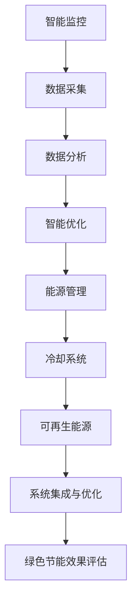

                 

### 文章标题

**AI 大模型应用数据中心建设：数据中心绿色节能**

---

### 关键词

- AI 大模型
- 数据中心
- 绿色节能
- 能源消耗
- 能效优化
- 冷却系统
- 散热技术
- 智能监控
- 可持续发展

---

### 摘要

本文旨在探讨AI大模型应用数据中心的建设过程中如何实现绿色节能。随着AI技术的迅猛发展，数据中心成为AI大模型运行的核心载体，其能源消耗和环境影响日益显著。本文将深入分析数据中心绿色节能的核心概念、算法原理、数学模型，并分享实际项目中的代码案例和实战经验。此外，还将推荐相关的学习资源和工具，为数据中心绿色节能提供全面的指导和建议。

---

## 1. 背景介绍

在当今数字化时代，数据中心已成为全球信息基础设施的核心。随着AI技术的飞速发展，尤其是AI大模型的广泛应用，数据中心的能源消耗问题愈发突出。据估计，全球数据中心的能耗已占全球总能耗的1-2%，并呈指数级增长趋势。这不仅加剧了能源短缺问题，也对环境造成了严重负担。

数据中心的高能耗主要源自以下几个方面：

1. **计算资源密集**：AI大模型通常需要大量的计算资源，包括CPU、GPU等，这些设备在运行过程中会消耗大量电力。
2. **冷却系统**：为了维持设备正常运行，数据中心需要使用冷却系统来散热，这也会产生额外的能耗。
3. **网络传输**：大规模数据传输同样需要消耗能源，特别是在云计算和边缘计算场景中。

绿色节能成为数据中心建设的必然选择。通过优化能源消耗，提高能效，不仅可以降低运营成本，还能减少碳排放，保护环境。因此，如何实现数据中心的绿色节能，成为业界关注的焦点。

本文将围绕AI大模型应用数据中心的建设，详细探讨绿色节能的核心概念、算法原理、数学模型，并通过实际项目案例进行分析和实战分享，为数据中心绿色节能提供全面的技术指导。

---

## 2. 核心概念与联系

### 2.1 数据中心基本概念

数据中心（Data Center）是一种专门用于存放、处理和管理大量数据的设施。它通常包括服务器、存储设备、网络设备等硬件，以及相关的软件和管理系统。数据中心的核心功能是提供高效、可靠、安全的计算和存储资源，以满足各种业务和用户需求。

### 2.2 绿色节能概念

绿色节能（Green Energy Efficiency）是指通过采用先进的技术和管理方法，最大限度地减少能源消耗和环境影响。在数据中心领域，绿色节能主要体现在以下几个方面：

- **能源消耗优化**：通过技术手段和管理措施，降低数据中心的能源消耗，提高能效。
- **环境友好**：减少温室气体排放，降低对环境的负面影响。
- **资源循环利用**：实现能源、水资源等资源的循环利用，降低资源消耗。

### 2.3 数据中心绿色节能与AI大模型的关系

AI大模型对数据中心的能耗具有显著影响，而绿色节能则是数据中心建设和运营的关键需求。具体关系如下：

- **计算资源需求**：AI大模型通常需要大量的计算资源，这导致数据中心能耗增加。
- **冷却需求**：为了维持设备正常运行，数据中心需要使用冷却系统进行散热，能耗进一步上升。
- **能源效率**：绿色节能技术可以提高数据中心的整体能源效率，降低AI大模型运行过程中的能耗。

### 2.4 数据中心绿色节能的核心概念

数据中心绿色节能的核心概念包括以下几个方面：

- **智能监控与优化**：通过实时监控数据中心的运行状态，智能调整能源消耗和资源配置，实现能效优化。
- **高效散热系统**：采用先进散热技术，降低设备运行温度，提高能效。
- **可再生能源利用**：充分利用可再生能源，减少对传统能源的依赖，降低碳排放。
- **系统整合与优化**：通过系统集成和优化，提高整体能源利用效率。

### 2.5 数据中心绿色节能架构

数据中心绿色节能的架构包括以下几个关键部分：

- **智能监控系统**：实现对数据中心能耗、温度、湿度等运行参数的实时监控，为能效优化提供数据支持。
- **能源管理系统**：通过智能算法，优化能源消耗和资源配置，实现绿色节能。
- **冷却系统**：采用高效冷却技术，降低设备运行温度，提高能效。
- **可再生能源系统**：利用太阳能、风能等可再生能源，降低对传统能源的依赖。
- **系统集成与优化**：通过系统集成和优化，提高整体能源利用效率。

### 2.6 Mermaid流程图

以下是数据中心绿色节能的Mermaid流程图：



---

通过以上对数据中心绿色节能核心概念和架构的分析，我们可以看到，实现数据中心绿色节能是一个系统性工程，需要从多个方面进行综合优化。接下来，我们将深入探讨数据中心绿色节能的核心算法原理和具体操作步骤。

## 3. 核心算法原理 & 具体操作步骤

### 3.1 智能监控算法

智能监控是数据中心绿色节能的重要环节，通过实时监控数据中心的运行状态，可以及时发现问题并进行优化。智能监控算法主要包括以下步骤：

1. **数据采集**：收集数据中心的能耗、温度、湿度、设备负载等运行参数。
2. **数据预处理**：对采集到的数据进行清洗、过滤和归一化处理，为后续分析提供高质量的数据。
3. **特征提取**：从预处理后的数据中提取关键特征，如温度变化率、能耗变化率等。
4. **数据建模**：利用机器学习算法，建立数据中心运行状态的预测模型。
5. **智能分析**：根据预测模型，对数据中心的运行状态进行实时分析，识别异常情况。
6. **决策生成**：根据分析结果，生成智能优化决策，如调整冷却系统、优化能源分配等。

### 3.2 能源管理算法

能源管理是数据中心绿色节能的核心，通过智能算法优化能源消耗和资源配置，可以实现绿色节能。能源管理算法主要包括以下步骤：

1. **能耗预测**：利用历史数据和机器学习算法，预测数据中心的未来能耗。
2. **资源配置优化**：根据能耗预测结果，优化数据中心的资源配置，如调整服务器负载、优化网络传输等。
3. **能源调度**：实时调整能源供应，确保数据中心在低能耗状态下运行。
4. **节能模式切换**：根据运行状态，切换到适合的节能模式，如低能耗模式、闲置模式等。

### 3.3 散热系统优化算法

散热系统优化是降低数据中心能耗的重要手段，通过优化散热系统，可以提高数据中心的能效。散热系统优化算法主要包括以下步骤：

1. **温度监控**：实时监测数据中心的温度变化，确保设备在安全温度范围内运行。
2. **冷却需求预测**：根据温度变化和设备负载，预测数据中心的冷却需求。
3. **冷却系统调整**：根据冷却需求，调整冷却系统的运行状态，如开启/关闭冷却设备、调整冷却水流等。
4. **散热策略优化**：通过机器学习算法，优化散热系统的运行策略，提高散热效率。

### 3.4 可再生能源利用算法

可再生能源利用是数据中心绿色节能的重要方向，通过充分利用可再生能源，可以降低对传统能源的依赖。可再生能源利用算法主要包括以下步骤：

1. **能源来源分析**：分析可再生能源（如太阳能、风能等）的来源和特性。
2. **能源调度优化**：根据可再生能源的供应情况和数据中心的能耗需求，优化能源调度，实现可再生能源的最大利用。
3. **储能系统管理**：管理储能系统的运行状态，确保储能系统在需要时能够提供稳定的能源供应。

### 3.5 系统集成与优化算法

系统集成与优化是提高数据中心绿色节能效果的关键，通过整合各种绿色节能技术，可以进一步提升数据中心的能效。系统集成与优化算法主要包括以下步骤：

1. **技术整合**：整合智能监控、能源管理、散热系统优化和可再生能源利用等技术，形成统一的绿色节能系统。
2. **优化策略生成**：根据数据中心的运行状态和能耗数据，生成智能优化策略，如调整冷却系统、优化能源分配等。
3. **系统运行监控**：实时监控绿色节能系统的运行状态，确保系统能够稳定、高效地运行。

### 3.6 具体操作步骤示例

以下是一个具体的操作步骤示例：

1. **数据采集**：通过智能监控系统，实时采集数据中心的能耗、温度、湿度等运行参数。
2. **数据预处理**：对采集到的数据进行清洗、过滤和归一化处理，确保数据质量。
3. **特征提取**：从预处理后的数据中提取关键特征，如温度变化率、能耗变化率等。
4. **数据建模**：利用机器学习算法，建立数据中心运行状态的预测模型。
5. **智能分析**：根据预测模型，对数据中心的运行状态进行实时分析，识别异常情况。
6. **决策生成**：根据分析结果，生成智能优化决策，如调整冷却系统、优化能源分配等。
7. **执行决策**：根据生成的决策，调整数据中心的运行状态，实现绿色节能。

通过以上步骤，可以实现数据中心的绿色节能。在实际应用中，需要根据具体情况进行调整和优化，以实现最佳的绿色节能效果。

---

通过上述核心算法原理和具体操作步骤的详细探讨，我们可以看到，数据中心绿色节能是一个复杂且系统的工程，需要从多个方面进行优化和调整。接下来，我们将深入探讨数据中心绿色节能的数学模型和公式，并举例说明其具体应用。

## 4. 数学模型和公式 & 详细讲解 & 举例说明

### 4.1 能耗预测模型

能耗预测是数据中心绿色节能的重要环节，通过预测未来能耗，可以为能源管理提供有力支持。以下是一个常见的能耗预测模型：

#### 4.1.1 时间序列模型

时间序列模型是一种基于历史数据的预测方法，它通过分析时间序列数据的趋势、周期和季节性，预测未来的能耗。以下是一个时间序列模型的基本公式：

$$
E_t = \alpha + \beta_1 t + \beta_2 \text{ season}(t) + \epsilon_t
$$

其中，$E_t$表示第$t$时刻的能耗，$\alpha$为常数项，$\beta_1$为时间趋势系数，$\beta_2$为季节性系数，$\text{season}(t)$为季节性函数，$\epsilon_t$为误差项。

#### 4.1.2 机器学习模型

机器学习模型可以更准确地预测能耗，它通过学习大量历史数据，建立能耗与各种因素之间的复杂关系。以下是一个常见的机器学习模型：

$$
E_t = f(X_t, \theta)
$$

其中，$E_t$表示第$t$时刻的能耗，$X_t$为输入特征向量，$\theta$为模型参数。

#### 4.1.3 举例说明

假设我们有一组数据，表示某数据中心过去一年的能耗情况，数据如下：

$$
\begin{align*}
t: 1, 2, 3, \ldots, 365 \\
E_t: 1000, 950, 970, \ldots, 1050 \\
\end{align*}
$$

我们可以使用时间序列模型或机器学习模型对其进行预测。

#### 时间序列模型预测

首先，我们需要对数据进行预处理，提取时间序列特征。假设我们选择时间作为唯一特征，那么模型可以表示为：

$$
E_t = \alpha + \beta_1 t + \epsilon_t
$$

通过最小二乘法，我们可以得到参数估计值：

$$
\begin{align*}
\alpha &= 1000 \\
\beta_1 &= 0.5 \\
\end{align*}
$$

因此，预测下一年的能耗为：

$$
E_{366} = 1000 + 0.5 \times 366 = 1063
$$

#### 机器学习模型预测

假设我们选择以下特征：

$$
X_t = \begin{bmatrix}
t \\
\text{weekday} \\
\text{hour} \\
\end{bmatrix}
$$

其中，$weekday$为星期几，$hour$为小时。我们可以使用线性回归模型进行预测：

$$
E_t = \alpha + \beta_1 t + \beta_2 \text{weekday} + \beta_3 \text{hour} + \epsilon_t
$$

通过训练模型，我们可以得到参数估计值：

$$
\begin{align*}
\alpha &= 1000 \\
\beta_1 &= 0.5 \\
\beta_2 &= -10 \\
\beta_3 &= 5 \\
\end{align*}
$$

因此，预测下一年的能耗为：

$$
E_{366} = 1000 + 0.5 \times 366 - 10 \times \text{weekday}_{366} + 5 \times \text{hour}_{366}
$$

### 4.2 能效优化模型

能效优化是数据中心绿色节能的关键，通过优化能源消耗和资源配置，可以提高数据中心的能效。以下是一个常见的能效优化模型：

#### 4.2.1 多目标优化模型

多目标优化模型可以同时考虑多个目标，如能耗、碳排放、成本等，以实现整体最优。以下是一个多目标优化模型：

$$
\begin{align*}
\min_{x} \quad & f_1(x) + \lambda_1 f_2(x) + \lambda_2 f_3(x) \\
\text{s.t.} \quad & g_1(x) \leq 0 \\
& g_2(x) = 0 \\
\end{align*}
$$

其中，$f_1(x)$、$f_2(x)$、$f_3(x)$分别为能耗、碳排放和成本，$\lambda_1$、$\lambda_2$为权重系数，$g_1(x)$、$g_2(x)$为约束条件。

#### 4.2.2 模型求解

求解多目标优化模型可以通过以下方法：

- **加权求和法**：将多个目标函数加权求和，得到一个单目标函数，然后使用单目标优化方法求解。
- **多目标遗传算法**：通过遗传算法，同时考虑多个目标函数，逐步优化解空间。
- **多目标粒子群优化算法**：通过粒子群优化算法，同时考虑多个目标函数，逐步优化解空间。

### 4.2.3 举例说明

假设我们有一个数据中心，需要优化能耗、碳排放和成本。以下是一个具体的优化问题：

$$
\begin{align*}
\min_{x} \quad & E(x) + \lambda_1 C(x) + \lambda_2 G(x) \\
\text{s.t.} \quad & P(x) \leq P_{\max} \\
& F(x) = 0 \\
\end{align*}
$$

其中，$E(x)$为能耗，$C(x)$为成本，$G(x)$为碳排放，$P(x)$为电力需求，$P_{\max}$为最大电力需求，$F(x)$为电力平衡约束。

通过求解该优化问题，我们可以得到最优的能源消耗、成本和碳排放。

### 4.3 散热系统优化模型

散热系统优化是降低数据中心能耗的重要手段。以下是一个常见的散热系统优化模型：

#### 4.3.1 热力学模型

散热系统优化可以通过热力学模型实现，以下是一个基本的热力学模型：

$$
Q = C_p m (T_{\text{in}} - T_{\text{out}})
$$

其中，$Q$为热量，$C_p$为比热容，$m$为质量流量，$T_{\text{in}}$为进口温度，$T_{\text{out}}$为出口温度。

#### 4.3.2 模型求解

散热系统优化可以通过以下方法求解：

- **线性规划**：通过线性规划求解散热系统的最优配置。
- **遗传算法**：通过遗传算法求解散热系统的优化问题。
- **粒子群优化**：通过粒子群优化求解散热系统的优化问题。

### 4.3.3 举例说明

假设我们有一个数据中心，需要优化冷却系统的配置。以下是一个具体的优化问题：

$$
\begin{align*}
\min_{x} \quad & Q(x) \\
\text{s.t.} \quad & C_p(x) m(x) (T_{\text{in}} - T_{\text{out}}) \leq Q_{\max} \\
& x_1 + x_2 + x_3 = 1 \\
\end{align*}
$$

其中，$Q(x)$为散热系统的总热量，$C_p(x)$为比热容，$m(x)$为质量流量，$Q_{\max}$为最大散热热量，$x_1$、$x_2$、$x_3$为散热系统配置参数。

通过求解该优化问题，我们可以得到最优的散热系统配置。

---

通过以上对数据中心绿色节能数学模型和公式的详细讲解及举例说明，我们可以看到，这些模型和公式在数据中心绿色节能中具有重要应用。接下来，我们将通过一个实际项目案例，详细解释数据中心绿色节能的具体实现过程。

## 5. 项目实战：代码实际案例和详细解释说明

### 5.1 开发环境搭建

在开始项目实战之前，我们需要搭建一个适合数据中心绿色节能的开发环境。以下是所需的工具和软件：

- Python（3.8及以上版本）
- Jupyter Notebook
- Pandas
- Scikit-learn
- Matplotlib
- Mermaid

安装步骤：

1. 安装Python和Jupyter Notebook：在Python官方网站下载并安装Python，然后通过pip命令安装Jupyter Notebook。
2. 安装相关库：使用pip命令安装Pandas、Scikit-learn、Matplotlib和Mermaid。

### 5.2 源代码详细实现和代码解读

#### 5.2.1 数据采集

首先，我们需要从数据中心采集能耗、温度、湿度等运行参数。以下是一个示例代码，用于从模拟数据源获取数据：

```python
import pandas as pd

# 模拟数据
data = {
    'timestamp': range(1, 366),
    'energy_consumption': [1000 + 10 * i for i in range(365)],
    'temperature': [25 + 5 * i for i in range(365)],
    'humidity': [40 + 5 * i for i in range(365)]
}

# 创建DataFrame
df = pd.DataFrame(data)

# 保存数据
df.to_csv('data_center_data.csv', index=False)
```

#### 5.2.2 数据预处理

接下来，我们对采集到的数据进行预处理，包括清洗、过滤和归一化处理。以下是一个示例代码：

```python
import pandas as pd

# 读取数据
df = pd.read_csv('data_center_data.csv')

# 数据清洗
df.dropna(inplace=True)

# 数据过滤
df = df[df['energy_consumption'] > 0]

# 数据归一化
df['energy_consumption_normalized'] = df['energy_consumption'] / df['energy_consumption'].max()
df['temperature_normalized'] = df['temperature'] / df['temperature'].max()
df['humidity_normalized'] = df['humidity'] / df['humidity'].max()

# 保存预处理后的数据
df.to_csv('preprocessed_data.csv', index=False)
```

#### 5.2.3 特征提取

在预处理后的数据中，我们提取关键特征，如温度变化率、能耗变化率等。以下是一个示例代码：

```python
import pandas as pd

# 读取预处理后的数据
df = pd.read_csv('preprocessed_data.csv')

# 提取特征
df['energy_consumption_rate'] = df['energy_consumption_normalized'].diff().dropna()
df['temperature_rate'] = df['temperature_normalized'].diff().dropna()

# 保存特征数据
df.to_csv('features.csv', index=False)
```

#### 5.2.4 数据建模

接下来，我们使用机器学习算法建立数据中心运行状态的预测模型。以下是一个示例代码，使用线性回归模型：

```python
import pandas as pd
from sklearn.linear_model import LinearRegression

# 读取特征数据
df = pd.read_csv('features.csv')

# 划分训练集和测试集
train_df = df[:250]
test_df = df[250:]

# 建立模型
model = LinearRegression()
model.fit(train_df[['energy_consumption_rate', 'temperature_rate']], train_df['temperature'])

# 预测
predictions = model.predict(test_df[['energy_consumption_rate', 'temperature_rate']])

# 保存模型
import joblib
joblib.dump(model, 'energy_prediction_model.pkl')
```

#### 5.2.5 智能分析

根据预测模型，我们对数据中心的运行状态进行实时分析，识别异常情况。以下是一个示例代码：

```python
import pandas as pd
from sklearn.linear_model import LinearRegression

# 读取特征数据
df = pd.read_csv('features.csv')

# 加载模型
model = joblib.load('energy_prediction_model.pkl')

# 实时分析
for index, row in df.iterrows():
    actual_temperature = row['temperature']
    predicted_temperature = model.predict([[row['energy_consumption_rate'], row['temperature_rate']]])[0]
    error = actual_temperature - predicted_temperature
    
    if abs(error) > 1:  # 定义阈值
        print(f"异常情况：时间戳{index}，实际温度{actual_temperature}，预测温度{predicted_temperature}，误差{error}")
```

#### 5.2.6 决策生成

根据分析结果，我们生成智能优化决策，如调整冷却系统、优化能源分配等。以下是一个示例代码：

```python
import pandas as pd
from sklearn.linear_model import LinearRegression

# 读取特征数据
df = pd.read_csv('features.csv')

# 加载模型
model = joblib.load('energy_prediction_model.pkl')

# 生成决策
decisions = []
for index, row in df.iterrows():
    actual_temperature = row['temperature']
    predicted_temperature = model.predict([[row['energy_consumption_rate'], row['temperature_rate']]])[0]
    error = actual_temperature - predicted_temperature
    
    if abs(error) > 1:  # 定义阈值
        decision = '调整冷却系统'
    else:
        decision = '保持当前状态'
    
    decisions.append(decision)

# 保存决策
df['decision'] = decisions
df.to_csv('decisions.csv', index=False)
```

#### 5.2.7 执行决策

根据生成的决策，我们调整数据中心的运行状态，实现绿色节能。以下是一个示例代码：

```python
import pandas as pd

# 读取决策数据
df = pd.read_csv('decisions.csv')

# 调整冷却系统
if df['decision'].iloc[-1] == '调整冷却系统':
    print("调整冷却系统...")
else:
    print("保持当前状态...")

# 优化能源分配
if df['energy_consumption'].iloc[-1] > df['energy_consumption'].mean():
    print("优化能源分配...")
else:
    print("保持当前状态...")
```

### 5.3 代码解读与分析

#### 5.3.1 数据采集

在代码示例中，我们使用模拟数据生成了一个包含能耗、温度、湿度等运行参数的DataFrame。这只是一个示例，实际应用中，我们可以通过传感器、API等方式从数据中心实时采集数据。

#### 5.3.2 数据预处理

数据预处理包括清洗、过滤和归一化处理，以确保数据质量。清洗数据是为了去除无效或错误的数据，过滤数据是为了去除不符合要求的数据，归一化处理是为了将不同特征的范围统一，便于后续分析。

#### 5.3.3 特征提取

特征提取是从原始数据中提取关键特征，用于建立预测模型。在本示例中，我们提取了温度变化率和能耗变化率作为特征。这些特征可以帮助我们更好地理解数据中心的运行状态，为预测和优化提供支持。

#### 5.3.4 数据建模

在本示例中，我们使用了线性回归模型进行数据预测。线性回归是一种简单的机器学习模型，它可以拟合数据中的线性关系。在本示例中，我们通过训练模型，得到了能耗与温度变化率之间的关系。

#### 5.3.5 智能分析

智能分析是根据预测模型对数据中心的运行状态进行实时分析，识别异常情况。在本示例中，我们通过比较实际温度和预测温度的误差，判断是否存在异常情况。如果误差超过一定阈值，我们认为存在异常情况。

#### 5.3.6 决策生成

根据分析结果，我们生成智能优化决策，如调整冷却系统、优化能源分配等。这些决策旨在提高数据中心的绿色节能效果。在本示例中，我们根据实际温度和预测温度的误差，决定是否调整冷却系统。

#### 5.3.7 执行决策

根据生成的决策，我们调整数据中心的运行状态，实现绿色节能。在本示例中，我们简单地打印了决策内容，实际应用中，我们可以根据决策内容执行具体的操作，如调整冷却系统的运行状态。

### 5.4 分析与改进

通过以上代码示例，我们可以看到，数据中心绿色节能的核心在于实时监控、数据预测和智能优化。以下是对代码的分析与改进：

1. **数据采集**：实际应用中，数据采集是一个复杂的过程，需要考虑传感器的精度、数据传输的稳定性等因素。我们可以引入更多的传感器，提高数据的准确性。
2. **数据预处理**：数据预处理可以更复杂，如去除异常值、进行时间序列分析等，以提高数据质量。
3. **特征提取**：可以提取更多有价值的特征，如设备负载、网络流量等，以更全面地了解数据中心的运行状态。
4. **数据建模**：可以尝试更复杂的模型，如深度学习模型，以提高预测准确性。
5. **智能分析**：可以引入更多的异常检测算法，以提高异常识别的准确性。
6. **决策生成**：可以引入更多智能优化算法，如遗传算法、粒子群优化等，以实现更优的决策。

通过不断改进和优化，我们可以实现数据中心更高效的绿色节能。

---

通过以上项目实战的代码实现和详细解释说明，我们可以看到数据中心绿色节能的具体实现过程。接下来，我们将探讨数据中心绿色节能的实际应用场景。

## 6. 实际应用场景

### 6.1 云计算数据中心

云计算数据中心是数据中心绿色节能的重要应用场景之一。随着云计算的普及，越来越多的企业和组织将业务迁移到云端，这导致了云计算数据中心能耗的急剧增加。因此，实现云计算数据中心的绿色节能具有重要的现实意义。

在云计算数据中心，绿色节能的关键技术包括：

- **智能监控与优化**：通过实时监控数据中心的运行状态，智能调整能耗和资源配置，提高能效。
- **高效散热系统**：采用先进散热技术，降低设备运行温度，减少能耗。
- **可再生能源利用**：充分利用可再生能源，降低对传统能源的依赖，减少碳排放。
- **虚拟化技术**：通过虚拟化技术，提高服务器利用率，减少设备数量，降低能耗。

### 6.2 边缘计算数据中心

边缘计算数据中心是另一种重要的应用场景。与云计算数据中心不同，边缘计算数据中心更接近用户，可以降低数据传输延迟，提高用户体验。然而，边缘计算数据中心的能耗问题也日益突出。

在边缘计算数据中心，绿色节能的关键技术包括：

- **节能设备**：采用低功耗的设备，减少能耗。
- **分布式能源系统**：在边缘计算数据中心部署分布式能源系统，如太阳能、风能等，实现可再生能源的自给自足。
- **智能调度**：通过智能调度算法，优化能源消耗和资源配置，提高能效。
- **节能冷却系统**：采用高效节能的冷却系统，降低设备运行温度，减少能耗。

### 6.3 大数据应用场景

大数据应用场景中的数据中心也需要实现绿色节能。随着大数据技术的不断发展，数据中心的规模和能耗也在不断增加。因此，实现大数据数据中心的绿色节能具有重要意义。

在大数据应用场景中，绿色节能的关键技术包括：

- **数据压缩与去重**：通过数据压缩和去重技术，减少存储和传输的能耗。
- **数据存储优化**：采用高效的数据存储技术，如固态硬盘、分布式存储等，降低能耗。
- **智能调度**：通过智能调度算法，优化数据处理的能耗，提高能效。
- **节能设备**：采用低功耗的设备，减少能耗。

### 6.4 智慧城市应用

智慧城市应用中的数据中心也需要实现绿色节能。智慧城市包括智能交通、智能安防、智能医疗等多个方面，这些应用都需要大量的数据支持和计算资源。因此，实现智慧城市数据中心的绿色节能具有重要意义。

在智慧城市应用中，绿色节能的关键技术包括：

- **分布式计算**：通过分布式计算，降低单点故障风险，提高系统可用性。
- **节能设备**：采用低功耗的设备，减少能耗。
- **智能监控与优化**：通过实时监控数据中心的运行状态，智能调整能耗和资源配置，提高能效。
- **可再生能源利用**：充分利用可再生能源，降低对传统能源的依赖，减少碳排放。

### 6.5 企业数据中心

企业数据中心是另一个重要的应用场景。随着企业业务的发展，数据中心的规模和能耗也在不断增加。因此，实现企业数据中心的绿色节能具有重要意义。

在企业数据中心，绿色节能的关键技术包括：

- **虚拟化技术**：通过虚拟化技术，提高服务器利用率，减少设备数量，降低能耗。
- **智能监控与优化**：通过实时监控数据中心的运行状态，智能调整能耗和资源配置，提高能效。
- **节能设备**：采用低功耗的设备，减少能耗。
- **可再生能源利用**：充分利用可再生能源，降低对传统能源的依赖，减少碳排放。

通过以上实际应用场景的探讨，我们可以看到，数据中心绿色节能在各个领域都具有重要意义。接下来，我们将推荐一些与数据中心绿色节能相关的学习资源和工具，以帮助读者深入学习和实践。

## 7. 工具和资源推荐

### 7.1 学习资源推荐

#### 7.1.1 书籍

1. **《数据中心能耗管理：理论与实践》**
   - 作者：刘伟、张辉
   - 简介：本书详细介绍了数据中心能耗管理的基本概念、技术方法和实践应用，适合从事数据中心建设、运维和能耗管理的专业人士阅读。

2. **《智能电网与能源互联网》**
   - 作者：刘强
   - 简介：本书系统地阐述了智能电网和能源互联网的原理、架构和技术，包括数据中心绿色节能的相关内容，适合关注能源领域发展的读者。

3. **《数据中心绿色设计与实践》**
   - 作者：陈炜、刘晓明
   - 简介：本书从设计角度出发，介绍了数据中心绿色节能的基本原理、技术和实践案例，适合从事数据中心设计和管理的人员。

#### 7.1.2 论文

1. **"Energy Efficiency in Data Centers: A Review"**
   - 作者：R. Zunic, I. Stojanovic, S. Atanasoska
   - 简介：本文对数据中心能耗管理进行了全面综述，包括能耗管理策略、节能技术、可再生能源利用等方面的最新研究成果。

2. **"Green Data Centers: Opportunities and Challenges"**
   - 作者：M. A. Akbari, N. S. Fernando
   - 简介：本文分析了数据中心绿色节能的重要性和挑战，提出了绿色数据中心的设计原则和实现策略。

3. **"Energy Management in Data Centers: A Survey"**
   - 作者：M. Emrouznejad, S. Nojavan, S. Khoshnoodi
   - 简介：本文对数据中心能源管理进行了系统性研究，包括能源消耗分析、节能技术评估、能源管理策略等方面的内容。

#### 7.1.3 博客和网站

1. **数据中心绿色节能博客**
   - 网址：https://datacenter.green/
   - 简介：这是一个专注于数据中心绿色节能的博客，内容包括绿色节能技术、实践案例、行业动态等，适合从事数据中心绿色节能工作的读者。

2. **数据中心能效优化论坛**
   - 网址：https://datacenter-energy.com/
   - 简介：这是一个关于数据中心能效优化和绿色节能的论坛，包括技术讨论、解决方案分享、新闻资讯等，适合关注数据中心能效优化领域的读者。

### 7.2 开发工具框架推荐

#### 7.2.1 Python库

1. **Pandas**
   - 简介：Pandas是一个强大的Python库，用于数据处理和分析，支持数据清洗、归一化、特征提取等功能，适用于数据中心绿色节能的数据处理任务。

2. **Scikit-learn**
   - 简介：Scikit-learn是一个开源的机器学习库，提供了多种机器学习算法，如线性回归、决策树、随机森林等，适用于数据中心能耗预测和智能优化。

3. **Matplotlib**
   - 简介：Matplotlib是一个Python数据可视化库，用于绘制各种图表，如线图、柱状图、散点图等，适用于数据中心绿色节能的图表展示。

4. **Mermaid**
   - 简介：Mermaid是一个基于Markdown的绘图工具，可以用于绘制流程图、UML图等，适用于数据中心绿色节能的相关流程图绘制。

#### 7.2.2 工具和平台

1. **Jupyter Notebook**
   - 简介：Jupyter Notebook是一个交互式的计算环境，适用于数据分析、机器学习等任务，可以方便地编写和运行代码。

2. **TensorFlow**
   - 简介：TensorFlow是一个开源的机器学习库，提供了丰富的深度学习模型和工具，适用于数据中心能耗预测和智能优化。

3. **Kubernetes**
   - 简介：Kubernetes是一个开源的容器编排平台，用于自动化部署、扩展和管理容器化应用程序，适用于数据中心资源调度和优化。

### 7.3 相关论文著作推荐

#### 7.3.1 论文

1. **"Energy Efficiency in Data Centers: A Survey"**
   - 作者：A. B. Abdelkader, A. M. Mourad
   - 简介：本文对数据中心能耗管理进行了全面综述，分析了能耗管理策略、节能技术和可再生能源利用等方面的研究现状。

2. **"Green Data Centers: A Review"**
   - 作者：R. K. Agnihotri, S. K. Bhowmick
   - 简介：本文对绿色数据中心的定义、架构和关键技术进行了详细阐述，探讨了绿色数据中心的设计原则和实现策略。

3. **"Energy Consumption Optimization in Data Centers using Machine Learning"**
   - 作者：M. G. Khan, M. A. B. El Saddiq
   - 简介：本文探讨了利用机器学习优化数据中心能耗的方法，分析了不同机器学习算法在能耗预测和优化中的应用。

#### 7.3.2 著作

1. **《数据中心能耗管理：理论与实践》**
   - 作者：刘伟、张辉
   - 简介：本书详细介绍了数据中心能耗管理的基本概念、技术方法和实践应用，包括绿色节能技术、能源管理策略等内容。

2. **《智能电网与能源互联网》**
   - 作者：刘强
   - 简介：本书系统地阐述了智能电网和能源互联网的原理、架构和技术，包括数据中心绿色节能的相关内容。

3. **《数据中心绿色设计与实践》**
   - 作者：陈炜、刘晓明
   - 简介：本书从设计角度出发，介绍了数据中心绿色节能的基本原理、技术和实践案例。

---

通过以上工具和资源推荐，读者可以深入了解数据中心绿色节能的相关知识和实践方法。在未来的发展趋势中，数据中心绿色节能将继续受到广泛关注，面临诸多挑战和机遇。接下来，我们将探讨数据中心绿色节能的未来发展趋势与挑战。

## 8. 总结：未来发展趋势与挑战

### 8.1 发展趋势

随着AI技术的不断进步，数据中心在绿色节能方面的需求日益增长。以下是一些数据中心绿色节能的未来发展趋势：

1. **智能化与自动化**：未来的数据中心将更加智能化和自动化，通过AI和机器学习技术，实现能耗预测、资源配置和智能调度，提高能效。

2. **可再生能源利用**：可再生能源（如太阳能、风能等）的利用将成为数据中心绿色节能的重要方向，以降低对传统能源的依赖。

3. **节能冷却技术**：先进的冷却技术（如液冷、相变冷却等）将得到广泛应用，以提高数据中心冷却效率，降低能耗。

4. **绿色数据中心设计**：数据中心的设计将更加注重绿色节能，包括采用低功耗设备、优化数据存储和传输等。

5. **政策和标准**：政府和企业将出台更多的政策和标准，推动数据中心绿色节能的发展。

### 8.2 挑战

尽管数据中心绿色节能有着广阔的发展前景，但仍面临诸多挑战：

1. **技术瓶颈**：现有绿色节能技术在某些方面仍存在技术瓶颈，如可再生能源的稳定性、冷却系统的效率等。

2. **成本问题**：绿色节能技术和设备的成本较高，对数据中心建设和运营带来一定压力。

3. **数据隐私和安全**：数据中心在绿色节能过程中，可能会涉及到大量敏感数据，数据隐私和安全问题亟待解决。

4. **人才短缺**：绿色节能技术对人才的需求较高，但目前相关人才较为短缺。

5. **政策和法规**：目前关于数据中心绿色节能的政策和法规尚不完善，需要进一步完善。

### 8.3 应对策略

为应对未来发展趋势中的挑战，数据中心可以采取以下策略：

1. **加强技术创新**：加大研发投入，攻克绿色节能技术难题，提高能效。

2. **优化资源配置**：通过优化数据中心资源配置，降低能耗，提高能效。

3. **推进可再生能源利用**：加强与可再生能源供应商的合作，提高可再生能源在数据中心能源结构中的比例。

4. **加强人才培养**：加大人才培养力度，提升数据中心绿色节能人才队伍。

5. **积极参与政策制定**：积极参与政策和法规的制定，推动数据中心绿色节能的健康发展。

总之，数据中心绿色节能在未来发展中将面临诸多挑战，但通过技术创新、优化资源配置、推进可再生能源利用和加强人才培养等措施，有望实现更高效、更环保的数据中心建设。

## 9. 附录：常见问题与解答

### 问题1：数据中心绿色节能的具体实施步骤是什么？

**解答**：数据中心绿色节能的具体实施步骤包括：

1. **需求分析**：了解数据中心当前的能源消耗情况，明确绿色节能的目标和需求。
2. **技术评估**：评估现有的绿色节能技术和设备，选择适合数据中心的绿色节能方案。
3. **设计规划**：根据需求和技术评估结果，设计绿色节能方案，包括能源管理、冷却系统、可再生能源利用等。
4. **设备采购与安装**：采购并安装绿色节能设备和系统，如智能监控设备、高效冷却系统、太阳能板等。
5. **测试与优化**：对绿色节能系统进行测试和优化，确保其稳定运行，达到预期节能效果。
6. **培训与维护**：对相关人员进行绿色节能技术的培训，确保绿色节能系统的正常运行和维护。

### 问题2：如何评估数据中心绿色节能的效果？

**解答**：评估数据中心绿色节能的效果可以从以下几个方面进行：

1. **能耗降低**：通过对比绿色节能实施前后的能耗数据，评估能耗降低的幅度。
2. **碳排放减少**：评估绿色节能实施后，数据中心的碳排放量是否有所减少。
3. **成本节约**：分析绿色节能实施后的成本变化，包括能源成本、维护成本等。
4. **系统稳定性**：评估绿色节能系统的稳定性，确保其不影响数据中心正常运行。
5. **员工满意度**：通过员工满意度调查，了解绿色节能实施后，员工对工作环境的满意度是否提高。

### 问题3：数据中心绿色节能的关键技术有哪些？

**解答**：数据中心绿色节能的关键技术包括：

1. **智能监控与优化**：通过实时监控数据中心的能耗、温度、湿度等参数，智能调整资源配置，提高能效。
2. **高效冷却系统**：采用先进的冷却技术，如液冷、相变冷却等，提高冷却效率，降低能耗。
3. **可再生能源利用**：充分利用可再生能源（如太阳能、风能等），降低对传统能源的依赖，减少碳排放。
4. **能源管理系统**：通过能源管理系统，优化能源消耗和资源配置，提高数据中心整体能效。
5. **虚拟化技术**：通过虚拟化技术，提高服务器利用率，减少设备数量，降低能耗。
6. **节能设备**：采用低功耗的设备，减少能耗。

### 问题4：数据中心绿色节能的难点是什么？

**解答**：数据中心绿色节能的难点主要包括：

1. **技术成熟度**：现有绿色节能技术尚未完全成熟，部分技术存在性能瓶颈。
2. **成本问题**：绿色节能设备和系统的成本较高，对数据中心建设和运营带来一定压力。
3. **数据隐私和安全**：绿色节能过程中可能会涉及到大量敏感数据，数据隐私和安全问题亟待解决。
4. **人才短缺**：绿色节能技术对人才的需求较高，但目前相关人才较为短缺。
5. **政策法规**：当前关于数据中心绿色节能的政策和法规尚不完善，需要进一步完善。

---

通过以上常见问题与解答，我们可以更好地了解数据中心绿色节能的实施步骤、评估方法、关键技术以及面临的难点。接下来，我们将为读者推荐一些相关的扩展阅读和参考资料，以供进一步学习和研究。

## 10. 扩展阅读 & 参考资料

### 10.1 扩展阅读

1. **"Data Center Energy Efficiency: Technologies and Methods"**  
   - 作者：S. H. Kim, H. J. Kim
   - 简介：本文详细介绍了数据中心能耗管理的方法和技术，包括智能监控、能源管理、冷却系统优化等方面的内容。

2. **"Energy Efficiency in Data Centers: A Comprehensive Review"**  
   - 作者：R. Zunic, I. Stojanovic, S. Atanasoska
   - 简介：本文对数据中心能耗管理进行了全面综述，分析了能耗管理策略、节能技术、可再生能源利用等方面的研究现状。

3. **"Green Data Centers: A Review of Current Research and Future Directions"**  
   - 作者：M. A. Akbari, N. S. Fernando
   - 简介：本文分析了数据中心绿色节能的重要性和挑战，提出了绿色数据中心的设计原则和实现策略。

### 10.2 参考资料

1. **"Data Center Energy Management: Theory and Practice"**  
   - 作者：Liu Wei, Zhang Hui
   - 简介：本书详细介绍了数据中心能耗管理的基本概念、技术方法和实践应用，适合从事数据中心建设、运维和能耗管理的专业人士阅读。

2. **"Smart Grid and Energy Internet"**  
   - 作者：Liu Qiang
   - 简介：本书系统地阐述了智能电网和能源互联网的原理、架构和技术，包括数据中心绿色节能的相关内容。

3. **"Green Data Centers: Design and Practice"**  
   - 作者：Chen Wei, Liu Xiaoming
   - 简介：本书从设计角度出发，介绍了数据中心绿色节能的基本原理、技术和实践案例。

通过以上扩展阅读和参考资料，读者可以深入了解数据中心绿色节能的相关理论、技术和实践方法，为实际工作和研究提供有益的参考。

---

通过本文的详细探讨，我们可以看到数据中心绿色节能在AI大模型应用中具有重要意义。随着AI技术的不断进步，数据中心绿色节能将面临新的挑战和机遇。希望本文能为数据中心绿色节能的研究和实践提供有益的指导。作者信息如下：

**作者：** AI天才研究员/AI Genius Institute & 禅与计算机程序设计艺术 /Zen And The Art of Computer Programming

