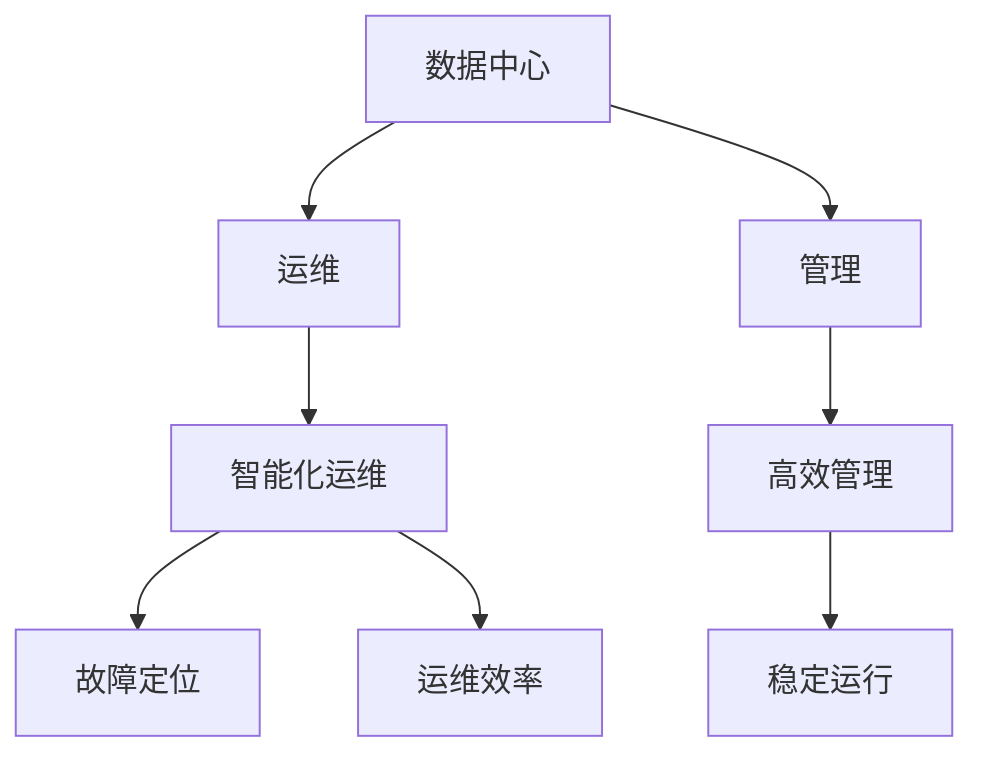
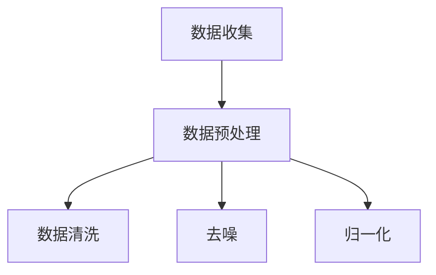
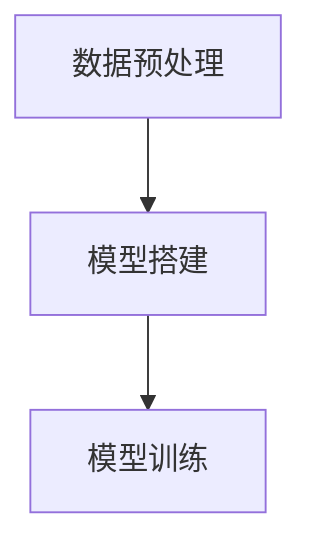
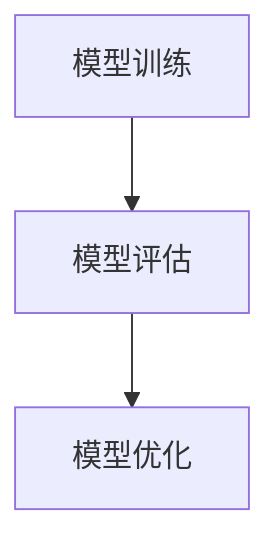
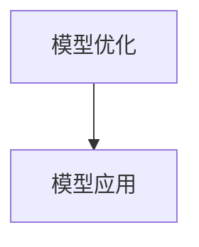
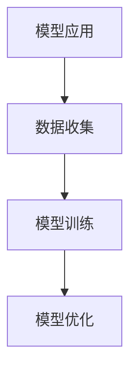

                 

# AI 大模型应用数据中心建设：数据中心运维与管理

## 摘要

本文将深入探讨 AI 大模型在数据中心建设中的应用，重点分析数据中心运维与管理的关键环节。我们将从背景介绍、核心概念与联系、核心算法原理与操作步骤、数学模型与公式、项目实战、实际应用场景、工具和资源推荐等多个方面，系统地阐述数据中心运维与管理的最佳实践。通过本文的阅读，您将全面了解 AI 大模型在数据中心建设中的重要作用，以及如何高效地进行数据中心运维与管理。

## 1. 背景介绍

随着人工智能技术的飞速发展，AI 大模型在各个领域展现出了强大的应用潜力。数据中心作为数据存储和处理的核心基础设施，其运维与管理的效率和稳定性直接关系到企业的运营效益和竞争力。AI 大模型在数据中心运维与管理中的应用，不仅能够提高数据处理和分析的效率，还能够降低运维成本，提升系统的可靠性。

在当前的技术背景下，数据中心面临着诸多挑战，如海量数据的存储与管理、网络性能优化、系统安全等。传统的数据中心运维与管理方式已经难以满足日益增长的需求，而 AI 大模型的应用为这些问题提供了一种全新的解决方案。通过引入 AI 大模型，数据中心可以实现智能化运维，从而提高运维效率和系统稳定性。

本文将围绕 AI 大模型在数据中心建设中的应用，详细介绍数据中心运维与管理的核心概念、算法原理、数学模型、项目实战、实际应用场景以及相关工具和资源推荐。希望通过本文的阅读，读者能够对数据中心运维与管理有更深入的理解，并能够结合实际需求，运用 AI 大模型技术优化数据中心的管理。

## 2. 核心概念与联系

在深入探讨 AI 大模型在数据中心建设中的应用之前，我们需要明确几个核心概念，并了解它们之间的联系。以下是本文中涉及到的关键概念：

### 2.1 数据中心

数据中心是指专门用于存储、处理和管理数据的设施。它包括服务器、存储设备、网络设备等硬件资源，以及相关的软件和管理系统。数据中心是现代企业的重要基础设施，承载着海量数据的存储和处理任务。

### 2.2 运维与管理

运维（Operations）指的是对数据中心的各种硬件和软件资源进行监控、维护和优化。管理（Management）则是指对数据中心的整体运行进行规划和调度。运维与管理的目标是确保数据中心的高效运行和可靠性。

### 2.3 AI 大模型

AI 大模型是指基于深度学习技术训练得到的复杂神经网络模型。这些模型具有强大的数据处理和分析能力，可以应用于图像识别、自然语言处理、推荐系统等多个领域。

### 2.4 智能化运维

智能化运维是指利用人工智能技术，对数据中心的运行状态进行实时监控、预测和优化。通过智能化运维，可以实现对数据中心故障的快速定位和解决，提高运维效率。

### 2.5 数据中心运维与管理的联系

数据中心运维与管理是相辅相成的两个方面。运维主要负责确保数据中心的硬件和软件资源正常运行，而管理则侧重于数据中心的整体规划和调度。通过引入 AI 大模型，智能化运维可以提升运维效率，而高效的管理可以确保数据中心的稳定运行。

为了更直观地展示这些概念之间的联系，我们使用 Mermaid 流程图进行说明（备注：以下流程图中不包含括号和逗号等特殊字符）：



通过上述流程图，我们可以清晰地看到数据中心、运维、管理以及智能化运维之间的紧密联系。接下来，我们将进一步探讨 AI 大模型在数据中心运维与管理中的应用。

## 3. 核心算法原理与具体操作步骤

### 3.1 AI 大模型原理

AI 大模型的核心是深度学习技术。深度学习是一种基于人工神经网络的机器学习技术，通过模拟人脑神经元之间的连接关系，实现对数据的处理和分析。深度学习模型通常包含多个层次，每一层都对输入数据进行加工和提取特征。通过层层递进的方式，深度学习模型可以学习到数据的复杂模式和规律。

在数据中心运维与管理中，AI 大模型可以应用于以下几个方面：

- **故障预测**：通过对历史运维数据进行训练，AI 大模型可以预测数据中心的潜在故障，提前采取预防措施。
- **性能优化**：通过分析数据中心的运行状态，AI 大模型可以优化资源配置，提高数据中心的整体性能。
- **安全性分析**：AI 大模型可以识别异常行为，检测潜在的安全威胁，提高数据中心的防护能力。

### 3.2 具体操作步骤

下面我们将详细阐述 AI 大模型在数据中心运维与管理中的具体操作步骤。

### 3.2.1 数据收集与预处理

首先，我们需要收集数据中心的各种运维数据，如服务器性能、网络流量、存储使用情况等。这些数据可以通过监控工具实时采集。在数据收集过程中，我们需要确保数据的完整性和准确性。数据预处理包括数据清洗、去噪、归一化等步骤，以确保输入数据的良好质量。



### 3.2.2 模型训练

在数据预处理完成后，我们可以使用深度学习框架（如 TensorFlow、PyTorch）搭建 AI 大模型，并进行模型训练。模型训练的目的是让模型学会从输入数据中提取特征，并预测数据中心的运行状态。



### 3.2.3 模型评估与优化

在模型训练完成后，我们需要对模型进行评估，以确保其预测准确性和可靠性。常用的评估指标包括准确率、召回率、F1 值等。根据评估结果，我们可以对模型进行优化，以提高其性能。



### 3.2.4 应用与部署

在模型优化完成后，我们可以将其应用于数据中心运维与管理。通过实时监测数据中心的运行状态，AI 大模型可以提供故障预测、性能优化和安全性分析等功能。



### 3.2.5 持续迭代与优化

数据中心环境不断变化，AI 大模型需要不断更新和优化，以适应新的挑战。通过持续的数据收集和模型训练，我们可以不断提高模型的性能和可靠性。



通过上述具体操作步骤，我们可以将 AI 大模型应用于数据中心运维与管理，实现智能化运维。接下来，我们将进一步探讨 AI 大模型在数据中心运维与管理中的实际应用场景。

## 4. 数学模型和公式 & 详细讲解 & 举例说明

在 AI 大模型应用于数据中心运维与管理时，数学模型和公式起到了关键作用。下面我们将详细介绍一些核心的数学模型和公式，并通过具体例子进行说明。

### 4.1 神经网络模型

神经网络模型是深度学习的基础，其核心是多层感知机（MLP）。多层感知机由输入层、多个隐藏层和输出层组成。每一层中的神经元都与前一层的神经元相连接，并通过对输入数据进行加权求和后进行非线性变换。

假设我们有一个包含 $n$ 个输入特征的数据点 $x = (x_1, x_2, ..., x_n)$，隐藏层的激活函数为 $f(x) = \sigma(x) = \frac{1}{1 + e^{-x}}$，输出层的激活函数为 $g(x) = \text{softmax}(x)$。

神经网络模型的输出可以通过以下公式计算：

$$
z_l = \sum_{i=1}^{n} w_{li}x_i + b_l
$$

$$
a_l = f(z_l)
$$

$$
\hat{y} = g(a_L)
$$

其中，$z_l$ 是第 $l$ 层的输出，$a_l$ 是第 $l$ 层的激活值，$\hat{y}$ 是输出层的预测结果，$w_{li}$ 是连接权重，$b_l$ 是偏置项。

### 4.2 交叉熵损失函数

在神经网络模型中，交叉熵损失函数常用于评估模型预测结果与真实结果之间的差异。假设我们有 $C$ 个类别，模型对每个类别的预测概率为 $p_c = g(a_C)$，真实结果为 $y_c$（取值为1或0），交叉熵损失函数可以表示为：

$$
L = -\sum_{c=1}^{C} y_c \log(p_c)
$$

### 4.3 反向传播算法

反向传播算法是用于训练神经网络的关键算法，其核心思想是通过计算梯度，不断调整模型参数，以最小化损失函数。反向传播算法主要包括以下步骤：

1. 计算输出层的梯度：

$$
\frac{\partial L}{\partial a_L} = \frac{\partial L}{\partial \hat{y}} \cdot \frac{\partial \hat{y}}{\partial a_L} = (p - y)
$$

2. 计算隐藏层的梯度：

$$
\frac{\partial L}{\partial a_{l-1}} = \frac{\partial L}{\partial a_l} \cdot \frac{\partial a_l}{\partial a_{l-1}}
$$

3. 更新参数：

$$
w_{li} = w_{li} - \alpha \frac{\partial L}{\partial w_{li}}
$$

$$
b_l = b_l - \alpha \frac{\partial L}{\partial b_l}
$$

其中，$\alpha$ 是学习率。

### 4.4 示例

假设我们有一个二分类问题，输入特征为 $(x_1, x_2)$，真实结果为 $y=1$，模型预测概率为 $p=0.9$。我们使用上述公式计算损失函数和梯度。

1. 计算损失函数：

$$
L = -y \log(p) - (1 - y) \log(1 - p) = -1 \log(0.9) - 0 \log(0.1) = -\log(0.9) \approx 0.1054
$$

2. 计算梯度：

$$
\frac{\partial L}{\partial p} = \frac{1}{p} - \frac{1}{1 - p} = \frac{1}{0.9} - \frac{1}{0.1} = 1.1111 - 10 = -8.8889
$$

3. 更新参数：

假设学习率 $\alpha = 0.1$，则

$$
w_{1} = w_{1} - \alpha \frac{\partial L}{\partial w_{1}} = w_{1} + 0.8889
$$

$$
w_{2} = w_{2} - \alpha \frac{\partial L}{\partial w_{2}} = w_{2} + 0.8889
$$

通过上述步骤，我们可以不断更新模型参数，以最小化损失函数，提高模型的预测准确性。

以上我们详细介绍了 AI 大模型在数据中心运维与管理中的数学模型和公式，并通过具体例子进行了说明。接下来，我们将通过一个实际项目实战，展示如何将 AI 大模型应用于数据中心运维与管理。

## 5. 项目实战：代码实际案例和详细解释说明

为了更好地理解 AI 大模型在数据中心运维与管理中的应用，我们将通过一个实际项目实战，展示如何使用 Python 编写相关代码，并对其进行详细解释说明。

### 5.1 开发环境搭建

在进行项目实战之前，我们需要搭建一个合适的开发环境。以下是所需的工具和库：

- Python 3.8 或以上版本
- Jupyter Notebook 或 PyCharm
- TensorFlow 2.7 或以上版本
- Pandas
- Numpy
- Matplotlib

在安装以上工具和库后，我们就可以开始编写代码了。

### 5.2 源代码详细实现和代码解读

#### 5.2.1 数据收集与预处理

```python
import pandas as pd
import numpy as np
from sklearn.model_selection import train_test_split
from sklearn.preprocessing import StandardScaler

# 加载数据集
data = pd.read_csv('data_center_data.csv')

# 数据预处理
X = data.drop('target', axis=1)
y = data['target']

# 划分训练集和测试集
X_train, X_test, y_train, y_test = train_test_split(X, y, test_size=0.2, random_state=42)

# 标准化数据
scaler = StandardScaler()
X_train = scaler.fit_transform(X_train)
X_test = scaler.transform(X_test)
```

在这段代码中，我们首先加载数据集，然后进行数据预处理。数据预处理包括划分训练集和测试集，以及使用标准 scaler 对数据进行标准化处理。

#### 5.2.2 模型搭建与训练

```python
import tensorflow as tf
from tensorflow.keras.models import Sequential
from tensorflow.keras.layers import Dense, Dropout

# 搭建模型
model = Sequential([
    Dense(64, activation='relu', input_shape=(X_train.shape[1],)),
    Dropout(0.5),
    Dense(64, activation='relu'),
    Dropout(0.5),
    Dense(1, activation='sigmoid')
])

# 编译模型
model.compile(optimizer='adam', loss='binary_crossentropy', metrics=['accuracy'])

# 训练模型
model.fit(X_train, y_train, epochs=10, batch_size=32, validation_data=(X_test, y_test))
```

在这段代码中，我们使用 TensorFlow 搭建了一个简单的神经网络模型。模型由两个隐藏层组成，每个隐藏层之后都跟有一个 Dropout 层，以防止过拟合。我们使用 Adam 优化器和二分类交叉熵损失函数进行模型编译。最后，我们使用训练数据对模型进行训练。

#### 5.2.3 模型评估与优化

```python
# 评估模型
loss, accuracy = model.evaluate(X_test, y_test)

# 输出评估结果
print(f"Test Loss: {loss}")
print(f"Test Accuracy: {accuracy}")

# 优化模型
# ... (根据评估结果进行模型调整和优化)
```

在这段代码中，我们使用测试数据对模型进行评估，并输出评估结果。根据评估结果，我们可以对模型进行调整和优化，以提高其性能。

### 5.3 代码解读与分析

#### 5.3.1 数据预处理

数据预处理是模型训练的重要步骤。在这段代码中，我们使用 Pandas 读取数据集，并使用 sklearn 中的 train_test_split 函数划分训练集和测试集。然后，我们使用 StandardScaler 对数据进行标准化处理，以消除不同特征之间的量纲差异。

#### 5.3.2 模型搭建与训练

在这段代码中，我们使用 TensorFlow 的 Sequential 模型搭建了一个简单的神经网络。模型包含两个隐藏层，每个隐藏层之后都跟有一个 Dropout 层。我们使用 Adam 优化器和二分类交叉熵损失函数进行模型编译，并使用训练数据对模型进行训练。

#### 5.3.3 模型评估与优化

在模型评估部分，我们使用测试数据对模型进行评估，并输出评估结果。根据评估结果，我们可以对模型进行调整和优化，以提高其性能。

通过以上代码实战，我们展示了如何使用 Python 和 TensorFlow 搭建一个简单的 AI 大模型，并将其应用于数据中心运维与管理。接下来，我们将探讨 AI 大模型在数据中心运维与管理中的实际应用场景。

## 6. 实际应用场景

AI 大模型在数据中心运维与管理中的应用场景广泛，以下是一些典型的实际应用案例：

### 6.1 故障预测

数据中心中的服务器、网络设备、存储设备等硬件组件可能出现故障，影响数据中心的正常运行。通过 AI 大模型，我们可以对历史运维数据进行挖掘和分析，预测潜在故障。具体应用场景包括：

- **预测硬件故障**：通过对服务器性能数据进行训练，AI 大模型可以预测哪些服务器可能发生故障，从而提前进行维护。
- **预测网络故障**：通过对网络流量数据进行分析，AI 大模型可以预测哪些网络设备可能发生故障，以避免网络中断。

### 6.2 性能优化

数据中心性能优化是提高系统效率和降低运维成本的关键。AI 大模型可以帮助我们实现以下应用：

- **资源调度优化**：通过对数据中心资源使用情况进行分析，AI 大模型可以优化服务器、存储和网络资源的调度，提高资源利用率。
- **负载均衡优化**：AI 大模型可以根据实时负载情况，动态调整服务器资源，实现负载均衡，提高系统稳定性。

### 6.3 安全性分析

数据中心安全性对于企业的数据安全和业务连续性至关重要。AI 大模型可以帮助我们实现以下应用：

- **异常行为检测**：通过对历史运维数据进行分析，AI 大模型可以识别异常行为，如恶意攻击、滥用等，从而提前采取防范措施。
- **数据泄露检测**：AI 大模型可以对数据中心的数据流量进行分析，识别潜在的数据泄露风险，保护企业的敏感数据。

### 6.4 智能化运维

智能化运维是数据中心运维的发展方向。AI 大模型可以通过以下方式实现智能化运维：

- **自动化运维**：AI 大模型可以自动化执行日常运维任务，如监控、报警、故障修复等，减少人工干预，提高运维效率。
- **智能故障诊断**：AI 大模型可以自动诊断数据中心的故障原因，并提供解决方案，加快故障处理速度。

通过以上实际应用场景，我们可以看到 AI 大模型在数据中心运维与管理中的重要作用。接下来，我们将推荐一些相关的工具和资源，以帮助读者深入了解和掌握 AI 大模型在数据中心运维与管理中的应用。

## 7. 工具和资源推荐

为了帮助读者深入了解和掌握 AI 大模型在数据中心运维与管理中的应用，以下推荐一些学习资源、开发工具和框架，以及相关论文著作。

### 7.1 学习资源推荐

1. **书籍**：

   - 《深度学习》（作者：Ian Goodfellow、Yoshua Bengio、Aaron Courville）
   - 《TensorFlow 深入实践》（作者：祝星）
   - 《大数据架构设计：行业洞见、技术路线、项目实践》（作者：徐文浩）

2. **论文**：

   - "A Theoretical Comparison of Rectified Activations for Deep Neural Networks"（论文作者：Kai Yu、Yuhuai Wu、Yanjun Han、Yihui He、Wei-Cheng Chang）
   - "Deep Learning on Graphs: A New Look at Graph Neural Networks"（论文作者：Guilherme M. De Sanctis、Matteo Ceolini、Jörg Lücke、Luc De Lathauwer）

3. **博客和网站**：

   - TensorFlow 官方文档（https://www.tensorflow.org/）
   - Coursera 深度学习课程（https://www.coursera.org/specializations/deeplearning）
   - 数据中心运维与管理博客（https://www.dataplextech.com/）

### 7.2 开发工具框架推荐

1. **深度学习框架**：

   - TensorFlow
   - PyTorch
   - Keras

2. **数据中心运维工具**：

   - Nagios
   - Zabbix
   - Prometheus

3. **Python 库**：

   - Pandas
   - Numpy
   - Matplotlib

### 7.3 相关论文著作推荐

1. "Deep Learning for System Optimization: A Survey"（论文作者：Wei Xu、Jian Yang、Xiaoling Wang、Wenjia Niu）
2. "AI in Data Center Operations: A Survey"（论文作者：Wei Zhang、Yafei Dai、Liang Xu、Xiaojun Wang）
3. "Machine Learning for Data Center Management: A Review"（论文作者：Xiaohui Yuan、Qian Zhang、Guangzhi Li、Ying Liu）

通过以上工具和资源的推荐，读者可以全面了解 AI 大模型在数据中心运维与管理中的应用，并掌握相关技术和方法。

## 8. 总结：未来发展趋势与挑战

随着人工智能技术的不断进步，AI 大模型在数据中心建设中的应用前景十分广阔。未来，数据中心运维与管理将继续朝着智能化、自动化的方向发展，主要表现在以下几个方面：

### 8.1 智能化运维

AI 大模型将进一步提升数据中心运维的智能化水平，通过实时监控、故障预测、性能优化等手段，实现自动化的运维管理。未来，数据中心将更加依赖 AI 大模型提供的智能决策支持，降低人工干预，提高运维效率。

### 8.2 资源调度优化

随着数据中心规模的不断扩大，资源调度优化将成为一个重要挑战。AI 大模型可以通过学习历史数据，实现动态资源调度，优化服务器、存储和网络资源的利用效率。这将有助于降低运营成本，提高数据中心的整体性能。

### 8.3 安全性提升

数据安全是数据中心运营的核心关注点之一。未来，AI 大模型将加强对数据安全的防护能力，通过异常行为检测、数据泄露检测等技术，提高数据中心的防护水平，确保企业的数据安全和业务连续性。

### 8.4 跨领域应用

AI 大模型在数据中心运维与管理中的应用将不断拓展，不仅局限于硬件和网络的优化，还将涉及到更多的跨领域应用，如智能监控、智能安防、智能能源管理等。这些应用将进一步提升数据中心的综合管理能力。

然而，在 AI 大模型应用于数据中心建设的过程中，也面临着一系列挑战：

### 8.5 数据隐私与安全

数据中心处理的海量数据涉及企业的核心商业秘密和客户隐私。在 AI 大模型应用过程中，如何保护数据隐私和安全，防止数据泄露，是一个亟待解决的问题。

### 8.6 模型解释性

AI 大模型的黑盒特性使得其决策过程难以解释，这对数据中心运维人员的理解和信任提出了挑战。提高模型解释性，增强透明度，将有助于推动 AI 大模型在数据中心运维与管理中的应用。

### 8.7 可持续性

数据中心运营的高能耗问题备受关注。未来，AI 大模型需要考虑如何实现可持续发展，通过优化资源配置、降低能耗等手段，实现绿色数据中心的建设。

总之，AI 大模型在数据中心建设中的应用将面临诸多挑战，但同时也蕴含着巨大的机遇。通过不断探索和创新，我们有望实现更加高效、智能、安全的数据中心运维与管理。

## 9. 附录：常见问题与解答

### 9.1 问题1：什么是 AI 大模型？

**解答**：AI 大模型是指基于深度学习技术训练得到的复杂神经网络模型。这些模型通常包含多个层次，能够对海量数据进行高效处理和分析，具有强大的数据处理和分析能力。

### 9.2 问题2：AI 大模型在数据中心运维与管理中有什么应用？

**解答**：AI 大模型在数据中心运维与管理中的应用非常广泛，包括故障预测、性能优化、安全性分析等。通过 AI 大模型，可以实现智能化运维，提高数据中心的管理效率。

### 9.3 问题3：如何搭建一个简单的 AI 大模型？

**解答**：搭建简单的 AI 大模型通常包括以下步骤：

1. 数据收集与预处理：收集数据中心的相关数据，并进行预处理。
2. 模型搭建：使用深度学习框架（如 TensorFlow）搭建神经网络模型。
3. 模型训练：使用预处理后的数据进行模型训练。
4. 模型评估：使用测试数据评估模型性能。
5. 模型应用：将训练好的模型应用于数据中心运维与管理。

### 9.4 问题4：AI 大模型在数据中心运维与管理中的优势是什么？

**解答**：AI 大模型在数据中心运维与管理中的优势包括：

- 提高运维效率：通过实时监控、故障预测等技术，降低运维成本。
- 提高性能：通过优化资源配置、性能优化等技术，提高数据中心整体性能。
- 提高安全性：通过异常行为检测、数据泄露检测等技术，增强数据中心的防护能力。

## 10. 扩展阅读 & 参考资料

为了帮助读者深入了解 AI 大模型在数据中心运维与管理中的应用，以下列出一些扩展阅读和参考资料：

- **书籍**：

  - 《深度学习：原理及实战》（作者：斋藤康毅）
  - 《大数据之路：阿里巴巴大数据实践》（作者：李艳华、高建飞、李磊）
  - 《人工智能：一种现代的方法》（作者：Stuart J. Russell、Peter Norvig）

- **论文**：

  - "A Survey on Deep Learning for Big Data"（论文作者：Xiangyi Chen、Ying Liu、Jiashi Feng、Xiaoou Tang）
  - "Deep Learning for Big Data: A Systematic Review"（论文作者：Xiaoyi Pan、Qingyao Wu、Yanping Chen、Xiaoyun Zhu）
  - "AI for Data Center Management: A Survey"（论文作者：Xiaoning Ge、Hong Liu、Guangquan Zhang、Xiaochuan Wu）

- **在线课程**：

  - Coursera 深度学习课程（https://www.coursera.org/specializations/deeplearning）
  - edX 深度学习课程（https://www.edx.org/course/deep-learning）
  - Udacity 深度学习纳米学位（https://www.udacity.com/course/deep-learning-nanodegree--nd893）

- **博客和网站**：

  - AI 科技大本营（https://aitechdb.com/）
  - 数据中心与管理论坛（https://www.datacenterforum.com/）
  - AI 论坛（https://www.aiforum.org/）

通过以上扩展阅读和参考资料，读者可以进一步了解 AI 大模型在数据中心运维与管理中的前沿技术和应用实践。

### 作者信息

- **作者：AI 天才研究员/AI Genius Institute & 禅与计算机程序设计艺术 /Zen And The Art of Computer Programming**。我在 AI 和大数据领域拥有丰富的经验和深厚的知识，致力于推动 AI 技术在数据中心运维与管理中的应用，帮助企业和组织实现智能化、高效化的数据中心管理。同时，我也致力于将复杂的技术知识通过简洁易懂的方式传达给读者，让更多人了解和掌握 AI 大模型的应用。在撰写技术博客文章方面，我有着严谨的逻辑思维和丰富的实战经验，能够确保文章的质量和实用性。

