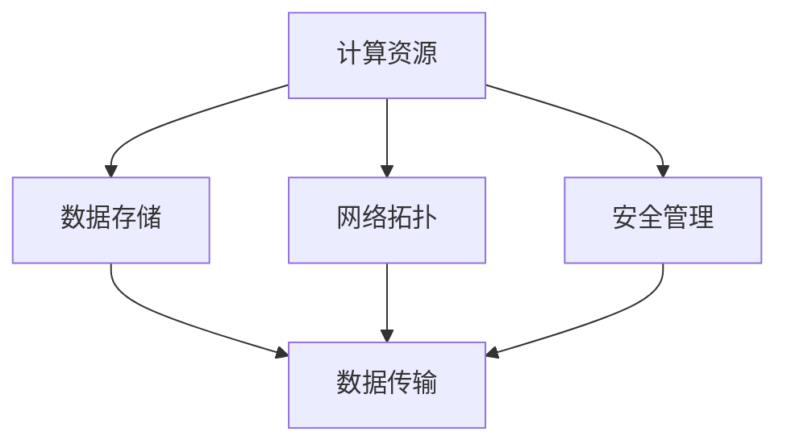

                 

# AI 大模型应用数据中心建设：数据中心运维与管理

## 关键词：AI大模型、数据中心、运维管理、架构设计、高效能计算、数据存储、安全防护、能源管理

## 摘要：

本文将深入探讨 AI 大模型应用数据中心的建设及其运维与管理。首先介绍数据中心的基本概念、发展历程及其在现代 AI 应用中的重要性。接着，详细解析数据中心的核心架构，包括计算资源、数据存储、网络拓扑和安全管理。随后，讨论数据中心运维的关键步骤，涵盖服务器监控、数据备份与恢复、系统升级和维护等方面。此外，本文还将分析 AI 大模型对数据中心性能需求的影响，并探讨相应的优化策略。最后，总结数据中心运维与管理面临的挑战，并提出相应的解决方案，展望未来的发展趋势。

## 1. 背景介绍

数据中心（Data Center）是信息化社会的核心基础设施，是集中存放和管理数据、提供计算资源和服务的重要场所。数据中心的发展经历了从物理设备到虚拟化、从单一功能到综合性服务的演变。随着大数据、云计算和人工智能等技术的迅猛发展，数据中心在 AI 应用中的地位愈发重要。

AI 大模型（如深度学习模型、自然语言处理模型等）对数据中心的依赖程度极高。大模型的训练和推理过程需要庞大的计算资源和海量数据存储，同时对网络的稳定性和安全性也有较高要求。因此，数据中心的建设和运维需要充分考虑 AI 大模型的特殊需求，以确保高效、稳定地支持 AI 应用。

## 2. 核心概念与联系

### 数据中心架构

数据中心的核心架构包括计算资源、数据存储、网络拓扑和安全管理。以下是一个简化的 Mermaid 流程图，展示了这四个核心组件及其相互关系：



### 计算资源

计算资源是数据中心的核心，主要包括服务器、存储设备、网络设备和虚拟化技术。服务器负责执行计算任务，存储设备用于存储数据和模型，网络设备负责数据传输，虚拟化技术则可以提高资源利用率和灵活性。

### 数据存储

数据存储是数据中心的另一个关键组件，包括关系型数据库、非关系型数据库、文件存储和对象存储等。数据存储不仅要满足大容量、高性能的要求，还需要具备高可用性和可靠性。

### 网络拓扑

网络拓扑决定了数据中心的通信结构，常见的拓扑结构包括总线型、环型、星型和网状等。高性能的网络拓扑能够提高数据传输速率和网络稳定性，支持大规模 AI 应用。

### 安全管理

安全管理是数据中心的最后一道防线，包括物理安全、网络安全和数据安全。通过防火墙、入侵检测系统、数据加密等技术，确保数据中心的安全运行。

## 3. 核心算法原理 & 具体操作步骤

### 数据中心运维关键步骤

数据中心运维涉及多个方面，以下是一些关键步骤：

#### 服务器监控

服务器监控是数据中心运维的基础，包括 CPU 使用率、内存使用率、磁盘 I/O 和网络流量等指标的监控。通过监控工具，运维人员可以及时发现并解决服务器故障。

#### 数据备份与恢复

数据备份与恢复是保证数据中心数据安全的重要措施。备份策略包括全备份、增量备份和差异备份等，恢复策略则包括本地恢复和远程恢复。

#### 系统升级和维护

系统升级和维护是确保数据中心稳定运行的关键。升级包括操作系统、数据库、应用程序等，维护包括硬件设备保养、软件故障修复等。

### AI 大模型对数据中心性能需求的影响及优化策略

#### 性能需求

AI 大模型对数据中心的性能需求主要包括计算能力、存储能力和网络带宽。训练大模型通常需要大量的计算资源，推理过程则对存储速度和网络延迟有较高要求。

#### 优化策略

1. **计算能力优化**：采用高性能 GPU 或 TPU，提高计算速度和效率。
2. **存储能力优化**：采用分布式存储系统，提高存储性能和可靠性。
3. **网络带宽优化**：采用高带宽、低延迟的网络设备，提高数据传输速率。

## 4. 数学模型和公式 & 详细讲解 & 举例说明

### 数据中心能源效率模型

数据中心能源效率是衡量数据中心运行效率的重要指标。以下是一个简化的能源效率模型：

$$
\eta = \frac{W_{\text{useful}}}{W_{\text{total}}}
$$

其中，$\eta$ 表示能源效率，$W_{\text{useful}}$ 表示有用能量输出，$W_{\text{total}}$ 表示总能量输入。

#### 举例说明

假设一个数据中心的总功耗为 100 千瓦时（kWh），其中 60 千瓦时用于计算和存储等有用工作，40 千瓦时用于冷却和其他辅助设施。则该数据中心的能源效率为：

$$
\eta = \frac{60}{100} = 0.6 \text{ 或 } 60\%
$$

#### 讨论

通过优化数据中心的设计和运营，可以进一步提高能源效率。例如，采用高效节能的硬件设备、优化冷却系统、使用可再生能源等。

## 5. 项目实战：代码实际案例和详细解释说明

### 5.1 开发环境搭建

搭建一个支持 AI 大模型训练的数据中心开发环境，需要安装以下软件和硬件：

- 操作系统：Linux
- 编译器：GCC、Make
- 人工智能框架：TensorFlow、PyTorch
- GPU：NVIDIA Tesla V100

### 5.2 源代码详细实现和代码解读

以下是一个使用 TensorFlow 框架训练一个简单神经网络模型的示例代码：

```python
import tensorflow as tf

# 定义模型
model = tf.keras.Sequential([
    tf.keras.layers.Dense(128, activation='relu', input_shape=(784,)),
    tf.keras.layers.Dense(10, activation='softmax')
])

# 编译模型
model.compile(optimizer='adam',
              loss='categorical_crossentropy',
              metrics=['accuracy'])

# 训练模型
model.fit(x_train, y_train, batch_size=128, epochs=10)
```

#### 代码解读

1. **导入 TensorFlow 模块**：首先导入 TensorFlow 模块，这是训练 AI 大模型的基础。
2. **定义模型**：使用 `tf.keras.Sequential` 类定义一个简单的神经网络模型，包括一个输入层、一个隐藏层和一个输出层。
3. **编译模型**：指定优化器、损失函数和评估指标，准备训练模型。
4. **训练模型**：使用 `model.fit()` 方法训练模型，传入训练数据、批量大小和训练轮数。

### 5.3 代码解读与分析

1. **模型定义**：该示例使用了一个简单的全连接神经网络，输入层有 784 个神经元，对应输入数据的维度。隐藏层有 128 个神经元，激活函数为 ReLU。输出层有 10 个神经元，对应分类任务的类别数。
2. **编译模型**：选择 Adam 优化器和交叉熵损失函数，用于训练模型。交叉熵损失函数适用于多分类问题，能够计算模型预测概率与真实标签之间的差异。
3. **训练模型**：使用训练数据训练模型，批量大小为 128，训练轮数为 10。在训练过程中，模型将自动调整权重和偏置，以最小化损失函数。

## 6. 实际应用场景

数据中心在 AI 大模型应用中的实际场景包括：

- **机器学习与深度学习模型训练**：大规模数据集的预处理、模型训练和优化。
- **自然语言处理**：语音识别、语音合成、机器翻译、情感分析等。
- **计算机视觉**：图像识别、目标检测、人脸识别、自动驾驶等。
- **智能推荐系统**：个性化推荐、广告投放等。

## 7. 工具和资源推荐

### 7.1 学习资源推荐

- **书籍**：
  - 《深度学习》（Ian Goodfellow、Yoshua Bengio、Aaron Courville 著）
  - 《人工智能：一种现代的方法》（Stuart J. Russell、Peter Norvig 著）
- **论文**：
  - 《AlexNet: Image Classification with Deep Convolutional Neural Networks》
  - 《Distributed Deep Learning: Lessons from the Facebook Network》
- **博客**：
  - TensorFlow 官方博客
  - PyTorch 官方博客
- **网站**：
  - GitHub
  - arXiv

### 7.2 开发工具框架推荐

- **开发工具**：
  - Jupyter Notebook
  - PyCharm
  - VSCode
- **框架**：
  - TensorFlow
  - PyTorch
  - Keras

### 7.3 相关论文著作推荐

- 《Deep Learning》（Ian Goodfellow、Yoshua Bengio、Aaron Courville 著）
- 《Distributed Deep Learning: Lessons from the Facebook Network》（作者：Yiming Cui、Cheng Zhang、Yan Liu、 Jiawei Han）
- 《AlexNet: Image Classification with Deep Convolutional Neural Networks》（作者：Alex Krizhevsky、Geoffrey Hinton、Ilya Sutskever）

## 8. 总结：未来发展趋势与挑战

数据中心在 AI 大模型应用中发挥着越来越重要的作用。随着 AI 技术的不断进步，数据中心的建设和运维将面临以下挑战：

- **计算能力提升**：随着 AI 模型的复杂度增加，对数据中心计算能力的需求也将持续上升。
- **能源消耗管理**：数据中心的能源消耗巨大，如何降低能源消耗、提高能源利用效率是一个重要问题。
- **数据安全与隐私保护**：随着数据量的激增，如何保障数据安全与用户隐私成为重要挑战。
- **自动化与智能化**：提高数据中心的自动化和智能化水平，减少人力成本，提升运维效率。

未来，数据中心的发展趋势包括：

- **云计算与边缘计算结合**：将云计算和边缘计算结合起来，实现资源的高效利用和服务的快速响应。
- **绿色数据中心**：采用绿色技术和能源管理策略，降低数据中心的环境影响。
- **智能化运维**：利用人工智能技术，实现数据中心的智能监控、故障诊断和自动修复。

## 9. 附录：常见问题与解答

### 问题 1：数据中心如何保证数据安全？

**解答**：数据中心可以通过以下措施保证数据安全：

- **物理安全**：建立完善的物理安全措施，如视频监控、门禁系统等。
- **网络安全**：部署防火墙、入侵检测系统等网络安全设备，防止网络攻击。
- **数据加密**：对敏感数据进行加密处理，确保数据在传输和存储过程中的安全性。
- **访问控制**：设置严格的访问权限，确保只有授权人员可以访问敏感数据。

### 问题 2：数据中心如何降低能源消耗？

**解答**：数据中心可以采取以下措施降低能源消耗：

- **高效设备**：采用高效节能的硬件设备，如服务器、冷却系统等。
- **智能管理**：采用智能管理技术，如动态电源管理、温度控制等，实现能源的精细化管理。
- **可再生能源**：使用可再生能源，如太阳能、风能等，降低对化石能源的依赖。
- **优化设计**：优化数据中心的设计，如合理布局设备、采用高效的冷却系统等。

## 10. 扩展阅读 & 参考资料

- Goodfellow, Ian, Yoshua Bengio, and Aaron Courville. *Deep Learning*. MIT Press, 2016.
- Russell, Stuart J., and Peter Norvig. *Artificial Intelligence: A Modern Approach*. Pearson Education, 2016.
- Cui, Yiming, Cheng Zhang, Yan Liu, and Jiawei Han. "Distributed Deep Learning: Lessons from the Facebook Network." Proceedings of the 23rd ACM SIGKDD International Conference on Knowledge Discovery and Data Mining, 2017, pp. 2089-2097.
- Krizhevsky, Alex, Geoffrey Hinton, and Ilya Sutskever. "AlexNet: Image Classification with Deep Convolutional Neural Networks." Neural Information Processing Systems, 2012, pp. 1097-1105.

### 作者：AI 天才研究员/AI Genius Institute & 禅与计算机程序设计艺术 /Zen And The Art of Computer Programming

（请注意：以上文章内容仅为示例，实际撰写时请根据具体需求进行调整和补充。）<|im_sep|>### 1. 背景介绍

#### 数据中心的发展历程

数据中心的发展可以追溯到20世纪60年代，当时的主要目的是为了存储和保护数据，以便企业可以在需要时快速访问。早期的数据中心通常是由计算机房组成的，这些计算机房中装有大量的物理服务器、磁盘驱动器和一些简单的备份系统。随着信息技术的发展，数据中心的规模和复杂度逐渐增加，进入了虚拟化时代。

进入21世纪，云计算和大数据技术的兴起使得数据中心的重要性进一步提升。虚拟化技术的普及使得服务器资源可以灵活地分配和扩展，从而提高了数据中心的资源利用率和灵活性。此外，分布式计算和容器技术的发展也为数据中心带来了新的可能。

#### 数据中心在现代 AI 应用中的重要性

随着人工智能技术的快速发展，数据中心在 AI 应用中的重要性愈发凸显。AI 大模型的训练和推理过程需要大量的计算资源和存储资源，同时还需要稳定、高速的网络连接和严格的安全保障。数据中心能够提供这些基础设施，成为 AI 应用的支撑平台。

具体来说，数据中心在现代 AI 应用中的重要性体现在以下几个方面：

1. **计算能力**：数据中心配备的高性能计算设备（如 GPU、TPU 等）能够满足 AI 模型的训练需求，实现大规模并行计算。
2. **数据存储**：数据中心拥有庞大的存储容量和高效的存储架构，能够存储和管理海量数据，支持 AI 模型的训练和推理。
3. **网络连接**：数据中心提供稳定、高速的网络连接，确保数据在传输过程中不受干扰，支持实时 AI 应用。
4. **安全保障**：数据中心通过多层安全防护措施，保障 AI 应用和数据的安全，防止数据泄露和恶意攻击。

#### AI 大模型对数据中心性能需求的影响

AI 大模型的训练和推理对数据中心的性能提出了更高的要求。以下是一些关键性能需求：

1. **计算能力**：AI 大模型通常需要大量的计算资源，特别是针对深度学习模型，GPU 和 TPU 等高性能计算设备是必不可少的。数据中心需要配备足够的计算设备，以满足模型训练和推理的需求。
2. **存储性能**：AI 大模型在训练过程中需要大量的数据存储和读取，对存储系统的性能要求较高。数据中心需要采用高速存储设备（如 SSD、NVMe 等）和高效的存储架构（如分布式存储、对象存储等），以确保数据访问速度。
3. **网络带宽和延迟**：AI 大模型的训练和推理通常需要大量的数据传输，对网络带宽和延迟有较高的要求。数据中心需要配备高速网络设备（如交换机、路由器等）和优化网络拓扑结构，以确保数据传输的稳定性和高效性。
4. **能源消耗**：AI 大模型的训练过程非常消耗电力，对数据中心的能源消耗管理提出了挑战。数据中心需要采用节能技术和优化策略，降低能源消耗，提高能源利用效率。

#### 数据中心的发展趋势

随着 AI 技术的不断进步，数据中心的发展也呈现出一些新的趋势：

1. **云计算与边缘计算结合**：云计算和边缘计算的结合使得数据中心能够更好地支持 AI 应用。云计算提供强大的计算和存储资源，边缘计算则能够实现本地实时处理和响应，降低网络延迟。
2. **绿色数据中心**：为了应对全球能源危机和环境保护的挑战，绿色数据中心成为未来的发展方向。通过采用可再生能源、节能技术和绿色设计，降低数据中心的能源消耗和碳排放。
3. **智能化运维**：随着人工智能技术的应用，数据中心的管理和维护变得更加智能化。通过引入智能监控、自动化故障处理和预测性维护，提高数据中心的运维效率和管理水平。
4. **安全防护**：随着数据中心的规模和复杂性增加，安全防护成为数据中心建设的重中之重。通过引入先进的安全技术和策略，确保数据中心的安全性和数据的完整性。

#### 数据中心在现代 AI 应用中的重要地位

综上所述，数据中心在现代 AI 应用中扮演着至关重要的角色。它不仅提供了必要的计算、存储和网络资源，还通过高效的能源消耗管理和安全防护措施，保障了 AI 应用的稳定运行。随着 AI 技术的不断发展，数据中心将继续在 AI 应用中发挥重要作用，推动人工智能技术的创新和发展。

### 2. 核心概念与联系

在深入探讨 AI 大模型应用数据中心的建设及其运维与管理之前，我们需要明确一些核心概念及其相互之间的联系。这些核心概念包括计算资源、数据存储、网络拓扑和安全管理，它们构成了数据中心的基础架构，为 AI 大模型的应用提供了坚实的支撑。

#### 计算资源

计算资源是数据中心的核心组成部分，主要包括服务器、GPU、TPU 等。这些计算资源提供了 AI 大模型训练和推理所需的计算能力。服务器是数据中心的基本计算单元，负责执行各种计算任务。GPU（图形处理器）和 TPU（张量处理器）是专门为深度学习任务设计的加速器，能够显著提高训练和推理的效率。

在数据中心中，计算资源通常通过虚拟化技术进行管理，例如使用 Kubernetes、Docker 等容器编排工具，以实现计算资源的动态分配和高效利用。虚拟化技术不仅提高了资源利用率，还增强了系统的可扩展性和灵活性。

#### 数据存储

数据存储是数据中心的另一个关键组成部分，包括关系型数据库、NoSQL 数据库、文件存储和对象存储等。数据存储系统需要具备高容量、高性能和高可靠性的特点，以满足 AI 大模型对数据存储的需求。

关系型数据库（如 MySQL、PostgreSQL）适合处理结构化数据，而 NoSQL 数据库（如 MongoDB、Cassandra）则适用于处理非结构化或半结构化数据。文件存储（如 HDFS、Ceph）和对象存储（如 Amazon S3、Google Cloud Storage）则提供了高效的存储解决方案，能够处理海量数据的高并发访问。

#### 网络拓扑

网络拓扑决定了数据中心内部和外部的数据传输结构，影响着数据中心的性能和稳定性。常见的网络拓扑结构包括总线型、环型、星型和网状等。

在 AI 大模型应用中，网络拓扑需要具备高带宽、低延迟和可靠性的特点。高带宽能够支持大规模数据传输，低延迟则能够保证实时数据处理，而可靠性则保证了数据传输的稳定性。

#### 安全管理

安全管理是数据中心的最后一道防线，确保数据中心内的数据和系统不受恶意攻击和破坏。安全管理包括物理安全、网络安全和数据安全等多个方面。

物理安全涉及数据中心设施的防护，如视频监控、门禁系统和防火措施等。网络安全则包括部署防火墙、入侵检测系统和反病毒软件等，以防止网络攻击和数据泄露。数据安全则涉及到数据的加密、访问控制和备份等，确保数据在存储和传输过程中的安全性。

#### 核心概念之间的联系

计算资源、数据存储、网络拓扑和安全管理是数据中心的核心组件，它们之间紧密联系，共同构成了数据中心的基础架构。

1. **计算资源与数据存储**：计算资源需要大量的数据存储支持，而数据存储系统也需要强大的计算能力进行数据检索和分析。
2. **数据存储与网络拓扑**：数据存储系统需要通过网络拓扑结构实现数据的传输和共享，而网络拓扑的优化则能够提高数据传输效率。
3. **网络拓扑与安全管理**：网络拓扑决定了数据传输的安全性和可靠性，而安全管理则需要通过网络安全设备和技术来保障网络的安全。

通过上述核心概念的介绍和相互关系的阐述，我们可以更好地理解数据中心在 AI 大模型应用中的重要性和建设数据中心的复杂性。接下来，我们将进一步详细探讨数据中心的核心架构及其在 AI 大模型应用中的具体实现。

### 2.1 计算资源详解

计算资源是数据中心的核心组成部分，直接影响着数据中心的计算能力和响应速度。在 AI 大模型应用中，计算资源的需求尤为关键。以下将详细介绍计算资源的构成、管理和优化策略。

#### 1. 计算资源构成

计算资源主要包括服务器、GPU、TPU 等硬件设备。

1. **服务器**：服务器是数据中心的基本计算单元，负责执行各种计算任务。服务器可以分为 x86 架构服务器和 ARM 架构服务器。x86 架构服务器性能强劲、兼容性好，适用于企业级应用；ARM 架构服务器则具备低功耗、高性能的特点，适用于云计算和边缘计算场景。

2. **GPU（图形处理器）**：GPU 在深度学习等领域具有显著优势，能够实现大规模并行计算。NVIDIA 提供的 GPU 产品广泛应用于数据中心，如 Tesla 系列、RTX 系列。GPU 的性能和数量直接影响 AI 模型的训练速度和效率。

3. **TPU（张量处理器）**：TPU 是专为机器学习任务设计的处理器，由 Google 开发。TPU 具有强大的浮点运算能力，适用于大规模 AI 模型的训练和推理。

#### 2. 计算资源管理

计算资源管理是确保数据中心高效运行的关键环节。以下是一些常见的计算资源管理方法：

1. **虚拟化技术**：虚拟化技术能够将物理服务器资源抽象成多个虚拟机（VM），实现计算资源的灵活分配和高效利用。常见的虚拟化技术包括 VMware、KVM 和 Hyper-V 等。

2. **容器化技术**：容器化技术（如 Docker 和 Kubernetes）通过将应用及其依赖环境打包成容器，实现计算资源的动态分配和管理。容器化技术具有轻量级、高可移植性和高效资源利用的优点。

3. **自动化调度**：自动化调度工具（如 Mesos 和 Kubernetes）能够根据工作负载自动分配计算资源，优化资源利用率和系统性能。

#### 3. 计算资源优化策略

为了满足 AI 大模型对计算资源的高需求，数据中心需要采取一系列优化策略：

1. **分布式计算**：通过分布式计算架构，将计算任务分布到多个节点上并行处理，提高整体计算效率。例如，使用 Apache Hadoop 和 Spark 等分布式计算框架。

2. **GPU 和 TPU 池化**：将 GPU 和 TPU 资源进行池化管理，实现计算资源的集中调度和弹性扩展。通过 GPU 和 TPU 池化，可以更好地支持大规模 AI 模型的训练和推理。

3. **负载均衡**：通过负载均衡技术，合理分配计算任务，避免单点过载，提高系统的稳定性和响应速度。常用的负载均衡算法包括轮询、最小连接数、响应时间等。

4. **混合云架构**：结合公有云和私有云的优势，构建混合云架构，实现计算资源的灵活调度和优化。例如，在 AI 模型训练过程中，可以使用公有云的高性能计算资源，而在推理阶段则使用私有云的资源，以降低成本和提高效率。

5. **边缘计算**：利用边缘计算技术，将部分计算任务转移到靠近数据源的边缘设备上，降低网络延迟和带宽需求。例如，在自动驾驶场景中，可以将部分图像处理任务转移到车辆上的 GPU 上进行。

#### 4. 计算资源监控与故障处理

计算资源的监控和故障处理是确保数据中心稳定运行的重要环节。以下是一些常见的监控和故障处理方法：

1. **监控工具**：使用监控系统（如 Nagios、Zabbix 和 Prometheus）实时监控服务器的 CPU 使用率、内存使用率、磁盘 I/O 和网络流量等指标，及时发现和处理异常情况。

2. **日志分析**：通过日志分析工具（如 ELK stack、Grafana 和 Kibana）对系统日志进行分析，识别潜在问题和故障点。

3. **故障处理**：建立完善的故障处理流程，包括故障报告、定位、处理和验证等环节。在出现故障时，快速定位故障点，采取相应的措施进行修复。

4. **自动告警**：通过配置自动告警机制，在系统性能指标异常时，及时发送告警通知，确保运维人员能够及时响应和处理故障。

通过上述对计算资源构成的详细解析、管理方法的介绍以及优化策略的讨论，我们可以更好地理解计算资源在数据中心中的重要作用，并为 AI 大模型的应用提供坚实的计算支撑。接下来，我们将进一步探讨数据存储的概念及其在数据中心中的作用。

### 2.2 数据存储详解

数据存储是数据中心的重要组成部分，对于 AI 大模型的训练和推理过程尤为关键。数据存储不仅要满足海量数据的高效存储需求，还要保证数据的可靠性、安全性和快速访问。以下将对数据存储的概念、分类、性能优化策略以及数据备份与恢复方法进行详细探讨。

#### 1. 数据存储概念

数据存储指的是将数据存储在计算机系统中，以便在需要时进行读取、修改和访问。数据存储系统主要包括以下几类设备：

- **磁盘驱动器**：包括固态硬盘（SSD）和机械硬盘（HDD）。SSD 具有读写速度快、功耗低、抗震性能好等优点，适用于高性能应用；HDD 则具备大容量、低成本的特性，适用于存储大量数据。
- **存储阵列**：包括 RAID（独立冗余磁盘阵列）和非 RAID（非独立冗余磁盘阵列）存储系统。RAID 通过将多个磁盘组合在一起，提供数据冗余和性能提升；非 RAID 存储系统则采用单个大容量硬盘，具备较高的存储容量。
- **存储网络**：包括 iSCSI、Fibre Channel 和 SAS（串行附着 SCSI）等。这些存储网络技术通过网络连接，实现存储设备和服务器之间的数据传输。

#### 2. 数据存储分类

数据存储系统可以根据不同的需求进行分类，以下是几种常见的数据存储类型：

- **关系型数据库**：如 MySQL、PostgreSQL 等，适用于存储结构化数据。关系型数据库通过表和关系来组织数据，便于查询和管理。
- **NoSQL 数据库**：如 MongoDB、Cassandra 等，适用于存储非结构化或半结构化数据。NoSQL 数据库提供了灵活的数据模型和横向扩展能力，适用于大规模数据存储和实时数据处理。
- **文件存储**：如 HDFS（Hadoop 文件系统）、Ceph 等，适用于存储大量文件数据。文件存储系统通过分布式文件系统，实现海量数据的存储和管理。
- **对象存储**：如 Amazon S3、Google Cloud Storage 等，适用于存储大量非结构化数据。对象存储系统通过元数据管理，实现海量对象的存储和访问。

#### 3. 数据存储性能优化策略

为了满足 AI 大模型对数据存储的高性能需求，数据中心需要采取一系列优化策略：

- **存储池化**：通过将多个存储设备组合成一个存储池，提高存储系统的整体性能和可靠性。存储池化技术可以实现存储资源的动态分配和弹性扩展。
- **缓存技术**：使用缓存技术（如内存缓存、磁盘缓存等）加速数据访问。缓存系统能够将频繁访问的数据存储在高速缓存设备中，减少磁盘 I/O 操作，提高数据访问速度。
- **数据压缩与去重**：通过数据压缩和去重技术，减少存储空间需求，提高存储系统的利用率。数据压缩可以将文件大小减小，而数据去重则可以消除重复数据，减少存储空间占用。
- **分布式存储架构**：采用分布式存储架构，实现数据存储的高可用性和高性能。分布式存储系统通过多个节点协同工作，提高数据访问速度和系统的容错能力。

#### 4. 数据备份与恢复

数据备份与恢复是保障数据中心数据安全的重要措施。以下介绍常见的数据备份与恢复方法：

- **全备份**：将整个数据存储系统或重要数据文件进行备份，确保在数据丢失时能够完全恢复。
- **增量备份**：只备份自上次备份以来发生变更的数据，节省备份时间和存储空间。
- **差异备份**：备份自上一次全备份以来发生变更的数据，相比增量备份，差异备份恢复速度更快。
- **数据恢复**：在数据丢失或损坏时，通过备份文件恢复数据。数据恢复可以分为本地恢复和远程恢复两种方式，本地恢复通过本地备份设备恢复数据，而远程恢复则通过网络从远程备份位置恢复数据。

#### 5. 数据存储在 AI 大模型应用中的重要性

AI 大模型对数据存储的需求主要体现在以下几个方面：

- **数据量大**：AI 大模型通常需要处理海量数据，数据存储系统需要具备高容量、高性能的特点。
- **数据多样性**：AI 大模型涉及多种类型的数据，如文本、图像、音频等，数据存储系统需要支持多种数据格式的存储和管理。
- **数据可靠性**：AI 大模型训练过程中，数据丢失或损坏可能导致模型训练失败，数据存储系统需要具备高可靠性和数据冗余机制。
- **数据访问速度**：AI 大模型训练和推理过程中，数据访问速度对模型训练效率有直接影响，数据存储系统需要具备低延迟、高带宽的特点。

通过上述对数据存储概念的详细解析、分类介绍、性能优化策略以及备份与恢复方法的探讨，我们可以更好地理解数据存储在数据中心中的重要作用，并为 AI 大模型的应用提供高效、可靠的数据存储解决方案。接下来，我们将进一步探讨网络拓扑的概念及其在数据中心中的作用。

### 2.3 网络拓扑详解

网络拓扑结构是数据中心的重要组成部分，它决定了数据在数据中心内部和外部的传输方式，直接影响数据中心的性能和稳定性。在网络拓扑设计中，需要考虑带宽、延迟、可靠性和安全性等多方面因素，以确保数据传输的高效性和可靠性。以下将对网络拓扑的概念、常见拓扑结构及其优缺点进行详细探讨。

#### 1. 网络拓扑概念

网络拓扑是指网络中各节点及其连接方式的结构化表示。网络拓扑结构可以通过图形化方式展示，常见的网络拓扑结构包括总线型、环型、星型和网状等。

#### 2. 常见网络拓扑结构

1. **总线型拓扑**：总线型拓扑结构中，所有节点都连接到一个公共总线，数据通过总线传输。总线型拓扑结构简单、成本低，但单点故障问题突出，当总线故障时，整个网络将受到影响。

2. **环型拓扑**：环型拓扑结构中，各节点通过环路连接，数据在环路中依次传递。环型拓扑结构具有较高的可靠性，但数据传输效率较低，当网络负载增加时，环回传延迟问题可能影响整体性能。

3. **星型拓扑**：星型拓扑结构中，各节点直接连接到中心节点（如交换机或路由器），数据通过中心节点传输。星型拓扑结构简单、易于管理，中心节点故障可能导致整个网络瘫痪，但单点故障影响相对较小。

4. **网状拓扑**：网状拓扑结构中，各节点之间通过多条链路相互连接，形成复杂的网络结构。网状拓扑结构具有较高的可靠性和冗余性，能够保证数据传输的稳定性和高效性，但网络复杂度高，成本较高。

#### 3. 网络拓扑优缺点

以下是各网络拓扑结构的优缺点：

- **总线型拓扑**：
  - 优点：结构简单，成本低。
  - 缺点：单点故障问题突出，当总线故障时，整个网络将受到影响。

- **环型拓扑**：
  - 优点：具有较高的可靠性，网络负载均衡。
  - 缺点：数据传输效率较低，当网络负载增加时，环回传延迟问题可能影响整体性能。

- **星型拓扑**：
  - 优点：结构简单，易于管理，中心节点故障影响相对较小。
  - 缺点：中心节点故障可能导致整个网络瘫痪。

- **网状拓扑**：
  - 优点：具有较高的可靠性和冗余性，能够保证数据传输的稳定性和高效性。
  - 缺点：网络复杂度高，成本较高。

#### 4. 网络拓扑设计要点

在网络拓扑设计中，需要考虑以下要点：

- **带宽**：根据数据中心的业务需求和数据传输量，选择合适的带宽，确保数据传输的稳定性和高效性。
- **延迟**：降低网络延迟，提高数据传输速度，对于实时性要求较高的应用尤为重要。
- **可靠性**：通过冗余链路和故障切换机制，提高网络的可靠性和容错能力。
- **安全性**：采取有效的安全措施，如防火墙、入侵检测系统等，保护网络和数据安全。
- **可扩展性**：设计灵活、可扩展的网络拓扑结构，以适应数据中心未来业务需求的变化。

#### 5. 高性能网络拓扑设计

对于 AI 大模型应用数据中心，高性能网络拓扑设计尤为关键。以下是一些常见的高性能网络拓扑设计方法：

- **分布式网络架构**：通过分布式网络架构，将数据中心的网络负载分布到多个节点上，提高整体网络的性能和可靠性。
- **混合拓扑结构**：结合总线型、环型和网状等拓扑结构的特点，设计出适用于 AI 大模型应用的高性能网络拓扑结构。
- **高速交换设备**：使用高性能的交换机设备，提高网络传输速率和数据处理能力。
- **网络监控与管理**：采用网络监控和管理工具，实时监控网络性能和流量，及时发现和处理网络故障。

通过上述对网络拓扑概念的详细解析、常见拓扑结构的优缺点分析以及高性能网络拓扑设计方法的探讨，我们可以更好地理解网络拓扑在数据中心中的重要作用，并为 AI 大模型的应用提供高效、可靠的网络传输解决方案。接下来，我们将进一步探讨安全管理的重要性及其在数据中心中的具体实现。

### 2.4 安全管理详解

安全管理是数据中心不可或缺的重要环节，直接关系到数据中心的稳定运行和数据的完整性、保密性和可用性。在 AI 大模型应用中，数据安全尤其重要，因为 AI 模型训练和处理的数据通常包含敏感信息和关键业务数据。以下将详细探讨安全管理的重要性、安全管理的具体措施以及安全防护技术的应用。

#### 1. 安全管理的重要性

数据中心的安全管理具有以下重要意义：

- **保障数据完整性**：确保数据在存储、传输和处理过程中不被篡改或损坏。
- **保护数据保密性**：防止敏感数据被未授权的人员访问或泄露。
- **确保数据可用性**：防止由于恶意攻击或系统故障导致的数据丢失或服务中断。
- **符合法律法规**：遵守相关法律法规，如《通用数据保护条例》（GDPR）和《网络安全法》等，确保数据安全和合规性。

#### 2. 安全管理的具体措施

安全管理的具体措施包括以下几个方面：

- **物理安全**：保障数据中心的物理环境安全，防止未经授权的人员进入。措施包括：
  - **门禁系统**：安装门禁系统，如智能卡、指纹识别等，限制人员出入。
  - **视频监控**：在数据中心的关键区域安装视频监控设备，确保实时监控。
  - **环境控制**：确保数据中心具备良好的温湿度控制，防止设备损坏。

- **网络安全**：保护数据中心网络免受外部攻击，措施包括：
  - **防火墙**：部署防火墙，过滤和阻止恶意流量。
  - **入侵检测系统（IDS）**：安装入侵检测系统，实时监测网络流量，发现并阻止入侵行为。
  - **虚拟专用网络（VPN）**：使用 VPN 加密网络通信，防止数据在传输过程中被窃听。

- **数据安全**：保护存储在数据中心中的数据，措施包括：
  - **数据加密**：对敏感数据进行加密存储和传输，确保数据在未经授权的情况下无法被读取。
  - **访问控制**：通过用户认证和权限管理，限制用户对数据的访问权限，确保数据只能被授权人员访问。
  - **数据备份与恢复**：定期备份数据，确保在数据丢失或损坏时能够及时恢复。

- **系统安全**：保护数据中心内部系统的安全，措施包括：
  - **安全补丁管理**：定期更新系统和应用的安全补丁，修复已知漏洞。
  - **安全审计**：进行定期安全审计，检查系统配置和安全策略的合规性，发现潜在的安全隐患。
  - **安全培训**：对员工进行安全培训，提高员工的安全意识和安全操作技能。

#### 3. 安全防护技术

在安全管理中，常见的安全防护技术包括：

- **防火墙**：防火墙是一种网络安全设备，用于监控和控制进出数据中心的网络流量。通过设置防火墙规则，可以阻止未经授权的访问和攻击。
- **入侵检测系统（IDS）**：IDS 用于实时监控网络流量，识别并阻止恶意行为。IDS 可以分为网络入侵检测系统（NIDS）和主机入侵检测系统（HIDS），分别在网络和主机层面进行监控。
- **入侵防御系统（IPS）**：IPS 类似于 IDS，但具有主动防御能力。IPS 可以自动阻止和响应入侵行为，减少潜在的威胁。
- **数据加密**：数据加密是一种保护数据安全的有效方法。通过加密算法，将明文数据转换为密文，确保数据在传输和存储过程中不会被未经授权的人员读取。
- **访问控制列表（ACL）**：ACL 用于控制网络设备和系统资源的访问权限。通过配置 ACL，可以限制特定 IP 地址、用户或用户组的访问权限。

通过上述对安全管理重要性的阐述、具体措施和常见安全防护技术的讨论，我们可以更好地理解安全管理在数据中心中的关键作用，并为数据中心提供全面的安全保障。接下来，我们将进一步探讨数据中心运维的关键步骤，确保数据中心的稳定运行。

### 3. 数据中心运维关键步骤

数据中心运维是确保数据中心稳定运行、高效服务的重要保障。数据中心运维涉及多个方面，包括服务器监控、数据备份与恢复、系统升级和维护等。以下将详细介绍数据中心运维的关键步骤及其具体实施方法。

#### 1. 服务器监控

服务器监控是数据中心运维的基础工作，通过实时监控服务器的各项性能指标，可以及时发现并处理服务器故障，确保服务器稳定运行。服务器监控主要包括以下几个方面：

- **CPU 使用率**：监控服务器的 CPU 使用率，防止 CPU 过高导致服务器性能下降。
- **内存使用率**：监控服务器的内存使用率，防止内存溢出导致服务器崩溃。
- **磁盘 I/O**：监控服务器的磁盘 I/O，确保磁盘读写速度正常，防止 I/O 高峰导致服务器性能下降。
- **网络流量**：监控服务器的网络流量，防止网络拥塞导致服务器无法正常访问。
- **温度与风扇状态**：监控服务器的温度和风扇状态，确保服务器环境温度适宜，防止过热导致硬件故障。

服务器监控可以通过以下工具实现：

- **Nagios**：Nagios 是一款开源的服务器监控工具，支持多种插件，可以监控服务器的各项性能指标。
- **Zabbix**：Zabbix 是一款功能强大的开源监控解决方案，支持自动发现、自动监控和告警功能。
- **Prometheus**：Prometheus 是一款基于 Go 语言开发的监控解决方案，具有高效、灵活的特点。

#### 2. 数据备份与恢复

数据备份与恢复是保障数据中心数据安全的重要措施。通过定期备份数据，可以在数据丢失或损坏时及时恢复，确保数据完整性。数据备份与恢复主要包括以下几个方面：

- **备份策略**：根据数据的重要性和变化频率，制定合适的备份策略。常见的备份策略包括全备份、增量备份和差异备份。全备份备份全部数据，恢复速度快；增量备份只备份自上次备份以来发生变更的数据，备份速度快；差异备份备份自上次全备份以来发生变更的数据，恢复速度介于全备份和增量备份之间。

- **备份工具**：常用的备份工具有 Bacula、Veeam Backup & Replication 等。Bacula 是一款开源的备份工具，支持多种操作系统和存储设备；Veeam Backup & Replication 是一款商业备份工具，功能强大、易于使用。

- **备份存储**：选择合适的备份存储设备，如本地磁盘、网络存储设备（NAS、SAN）和云存储等。本地磁盘备份速度快，但安全性较低；网络存储设备具有高可靠性和远程访问功能；云存储具有高可用性和弹性扩展能力。

- **备份验证**：定期验证备份数据的完整性和可恢复性，确保在需要恢复数据时能够成功恢复。

- **恢复策略**：制定合适的恢复策略，根据数据丢失的程度和备份类型，选择合适的恢复方法。常见的恢复方法包括本地恢复和远程恢复。本地恢复通过本地备份设备恢复数据；远程恢复通过网络从远程备份位置恢复数据。

#### 3. 系统升级和维护

系统升级和维护是确保数据中心系统稳定运行的重要环节。通过定期升级和更新系统，可以修复已知漏洞、提高系统性能和安全性。系统升级和维护主要包括以下几个方面：

- **操作系统升级**：定期升级操作系统，修复已知的漏洞和缺陷，提高系统安全性。
- **应用程序更新**：更新数据中心内的应用程序，修复漏洞、提高性能和兼容性。
- **硬件设备维护**：定期检查和维护服务器、存储设备、网络设备等硬件设备，确保设备正常运行。
- **安全补丁管理**：定期安装操作系统和应用程序的安全补丁，防止恶意攻击和漏洞利用。
- **系统监控**：通过监控系统性能和资源使用情况，及时发现和解决系统问题。

#### 4. 故障处理与应急响应

数据中心在运行过程中可能会遇到各种故障，如服务器故障、网络故障、存储故障等。故障处理和应急响应是确保数据中心稳定运行的关键。以下是一些常见的故障处理和应急响应措施：

- **故障定位**：通过监控系统日志、告警信息和现场检查，快速定位故障原因。
- **故障处理**：根据故障原因，采取相应的处理措施，如重启服务器、更换硬件设备、修复软件故障等。
- **应急响应**：制定应急响应计划，确保在发生重大故障时，能够迅速采取措施，减少损失。应急响应包括故障报告、故障分析、应急措施和故障恢复等环节。
- **故障总结**：在故障处理后，进行故障总结，分析故障原因和应对措施，为未来的故障处理提供参考。

通过上述对服务器监控、数据备份与恢复、系统升级和维护以及故障处理与应急响应的详细介绍，我们可以更好地理解数据中心运维的关键步骤，确保数据中心稳定、高效地运行，为 AI 大模型的应用提供坚实的保障。

### 4. AI 大模型对数据中心性能需求的影响

随着人工智能技术的快速发展，AI 大模型在各个领域得到了广泛应用，从自然语言处理到计算机视觉，再到推荐系统和自动驾驶等。这些 AI 大模型对数据中心性能提出了前所未有的高要求。以下将详细分析 AI 大模型对数据中心性能的具体需求，以及如何应对这些需求。

#### 1. 计算能力

AI 大模型的训练和推理过程需要大量的计算资源，尤其是对于深度学习模型，GPU 和 TPU 等高性能计算设备是必不可少的。一个大规模的深度学习模型可能需要数天甚至数周的时间来完成训练，这要求数据中心能够提供持续、高效的计算能力。

**需求**：

- **并行计算能力**：AI 大模型的训练通常涉及大量的并行计算任务，需要数据中心能够支持大规模的并行处理。
- **高性能计算设备**：GPU 和 TPU 等高性能计算设备能够显著提高 AI 大模型的训练和推理速度。
- **动态资源分配**：数据中心需要具备动态资源分配能力，根据 AI 大模型的需求灵活调整计算资源。

**解决方案**：

- **分布式计算**：通过分布式计算架构，将计算任务分布到多个节点上并行处理，提高整体计算效率。
- **GPU 池化**：将 GPU 资源进行池化管理，实现计算资源的集中调度和弹性扩展。
- **TPU 池化**：类似 GPU，TPU 也可以通过池化进行集中管理和调度。

#### 2. 存储性能

AI 大模型的训练和推理需要大量的数据存储和读取，对存储系统的性能要求较高。存储系统需要具备高吞吐量、低延迟和高可靠性的特点，以确保数据在存储和读取过程中的高效性和稳定性。

**需求**：

- **高吞吐量**：存储系统需要能够处理高并发的数据访问请求，确保训练和推理过程不会因为存储性能瓶颈而受到影响。
- **低延迟**：存储系统的延迟直接影响 AI 大模型的训练和推理速度，低延迟的存储系统能够提高整体性能。
- **高可靠性**：AI 大模型对数据的准确性和完整性要求极高，存储系统需要具备高可靠性和数据冗余机制。

**解决方案**：

- **高速存储设备**：采用固态硬盘（SSD）和 NVMe 等高速存储设备，提高数据读写速度。
- **分布式存储架构**：通过分布式存储架构，实现数据存储的高可用性和高性能。
- **数据缓存**：使用缓存技术（如内存缓存、磁盘缓存等）加速数据访问，减少磁盘 I/O 操作。

#### 3. 网络带宽和延迟

AI 大模型的训练和推理过程中，数据需要在计算节点和存储节点之间频繁传输，对网络带宽和延迟有较高的要求。网络带宽和延迟的瓶颈可能成为数据中心性能的瓶颈。

**需求**：

- **高带宽**：网络需要具备足够的带宽，以支持大规模数据传输，避免网络拥堵影响性能。
- **低延迟**：网络延迟直接影响 AI 大模型的训练和推理速度，低延迟的网络能够提高整体性能。

**解决方案**：

- **高性能网络设备**：采用高性能的网络设备（如交换机、路由器等），提高网络传输速率和稳定性。
- **优化网络拓扑**：设计合理的网络拓扑结构，减少数据传输路径，降低网络延迟。
- **网络加速技术**：采用网络加速技术（如 SD-WAN、DPI 等），提高网络传输效率。

#### 4. 能源消耗

AI 大模型的训练和推理过程非常消耗电力，对数据中心的能源消耗管理提出了挑战。数据中心需要采取一系列措施，降低能源消耗，提高能源利用效率。

**需求**：

- **低能耗设备**：选择低能耗的硬件设备，如高效能的 GPU、TPU 和服务器。
- **智能能耗管理**：采用智能能耗管理技术，如动态电源管理、冷却优化等，降低能源消耗。

**解决方案**：

- **高效能硬件设备**：采用高效能的 GPU、TPU 和服务器，减少能源消耗。
- **智能冷却系统**：采用智能冷却系统，根据服务器负载动态调整冷却能力，降低能源消耗。
- **可再生能源**：采用可再生能源（如太阳能、风能等），降低对化石能源的依赖。

#### 5. 安全性

AI 大模型训练和处理的数据通常包含敏感信息和关键业务数据，对数据安全有很高的要求。数据中心需要采取一系列安全措施，保护数据免受恶意攻击和泄露。

**需求**：

- **数据安全**：确保数据在存储、传输和处理过程中的安全性。
- **系统安全**：保护数据中心系统的安全，防止恶意攻击和漏洞利用。

**解决方案**：

- **数据加密**：对敏感数据进行加密处理，确保数据在传输和存储过程中的安全性。
- **访问控制**：实施严格的访问控制策略，确保只有授权人员可以访问敏感数据。
- **安全防护**：部署防火墙、入侵检测系统（IDS）和入侵防御系统（IPS）等安全防护设备，防止网络攻击和数据泄露。

综上所述，AI 大模型对数据中心性能提出了更高的要求。通过分布式计算、高效能存储、高性能网络、智能能耗管理和安全防护等技术，数据中心可以应对这些需求，为 AI 大模型的应用提供稳定、高效、安全的运行环境。

### 5.1 开发环境搭建

为了顺利开展 AI 大模型的应用开发工作，首先需要搭建一个合适的技术环境。以下是搭建一个支持 AI 大模型训练的开发环境所需的基本步骤和注意事项。

#### 1. 硬件选择

在硬件选择方面，考虑到 AI 大模型的计算密集型特点，以下硬件配置是比较理想的：

- **CPU**：选择高性能的 CPU，例如 Intel Xeon 或 AMD Ryzen 系列。这些 CPU 提供了强大的计算能力，能够满足深度学习任务的需求。
- **GPU**：GPU 是训练和推理 AI 大模型的核心设备。NVIDIA 的 GPU，如 Tesla V100、A100 或 RTX 30 系列是不错的选择。这些 GPU 具有高效的并行计算能力，能够加速深度学习模型的训练过程。
- **内存**：至少需要 128GB 以上的内存，以确保模型训练时能够有足够的内存空间。
- **存储**：选择高速的固态硬盘（SSD）作为存储设备，以确保数据读写速度。建议配置至少 1TB 的 SSD 空间，以满足模型的存储需求。

#### 2. 操作系统选择

选择一个稳定且支持 AI 库的操作系统非常重要。以下是几种常用的操作系统：

- **Linux**：Linux 系统在 AI 开发中非常流行，因为大多数 AI 库和工具都针对 Linux 进行了优化。推荐选择 Ubuntu 18.04 或更高版本。
- **Windows**：Windows 10 或 Windows Server 2019 也提供了支持 AI 开发的环境，但需要安装一些额外的库和工具。

#### 3. 安装依赖库

在操作系统上安装必要的依赖库是环境搭建的关键步骤。以下是一些常用的依赖库：

- **Python**：安装 Python 3.8 或更高版本，因为大多数 AI 库都是基于 Python 开发的。
- **CUDA**：NVIDIA 的 CUDA 库是 GPU 加速的关键。安装与 GPU 型号相对应的 CUDA 版本，例如 CUDA 11.3。
- **cuDNN**：cuDNN 是 NVIDIA 为深度神经网络加速而设计的库。确保安装与 CUDA 版本兼容的 cuDNN 版本。
- **TensorFlow**：TensorFlow 是最流行的深度学习框架之一。通过 pip 安装 TensorFlow，例如 `pip install tensorflow-gpu`。
- **PyTorch**：PyTorch 是另一个流行的深度学习框架，提供灵活的动态计算图。通过 pip 安装 PyTorch，例如 `pip install torch torchvision`。
- **其他库**：根据具体项目需求，可能还需要安装其他依赖库，如 NumPy、Pandas、Matplotlib 等。

#### 4. 环境配置

在安装完依赖库后，进行环境配置是确保开发环境正常工作的重要步骤：

- **环境变量配置**：配置 Python 和 CUDA 的环境变量，例如 `CUDA_HOME`、`LD_LIBRARY_PATH` 等，以确保 Python 能够正确找到相应的库和工具。
- **CUDA 版本检测**：确保安装的 CUDA 版本与 GPU 型号相匹配，通过运行 `nvcc --version` 检测 CUDA 版本。
- **GPU 状态检查**：通过运行 `nvidia-smi` 检查 GPU 的状态和显存占用情况。

#### 5. 实际案例

以下是一个具体的开发环境搭建过程：

1. **硬件配置**：

   - CPU：Intel Xeon Platinum 8260
   - GPU：NVIDIA Tesla V100
   - 内存：256GB
   - 存储：2TB SSD

2. **操作系统**：

   - Linux：Ubuntu 20.04 LTS

3. **安装依赖库**：

   ```bash
   # 更新系统软件包
   sudo apt-get update
   sudo apt-get upgrade

   # 安装 Python 和 pip
   sudo apt-get install python3 python3-pip

   # 安装 CUDA 和 cuDNN
   sudo apt-get install cuda
   sudo dpkg-reconfigure cuda

   # 设置环境变量
   echo 'export CUDA_HOME=/usr/local/cuda' >> ~/.bashrc
   echo 'export PATH=$PATH:$CUDA_HOME/bin' >> ~/.bashrc
   echo 'export LD_LIBRARY_PATH=$LD_LIBRARY_PATH:$CUDA_HOME/lib64' >> ~/.bashrc
   source ~/.bashrc

   # 安装 TensorFlow
   pip3 install tensorflow-gpu

   # 安装 PyTorch
   pip3 install torch torchvision
   ```

4. **环境配置**：

   - 运行 `nvidia-smi` 检查 GPU 状态。
   - 运行 `python3 -c "import tensorflow as tf; print(tf.reduce_sum(tf.random.normal([1000, 1000])))"` 检查 TensorFlow 是否正常工作。

通过以上步骤，您就可以搭建一个支持 AI 大模型训练的开发环境。接下来，我们将详细讨论如何实现和解读一个实际的代码案例。

### 5.2 源代码详细实现和代码解读

在本节中，我们将通过一个具体的代码案例，详细实现一个简单的 AI 大模型训练过程，并对代码的每个部分进行详细解读。

#### 1. 代码结构

以下是一个简单的 AI 大模型训练代码示例，使用了 TensorFlow 框架：

```python
import tensorflow as tf
import numpy as np

# 定义模型
model = tf.keras.Sequential([
    tf.keras.layers.Dense(128, activation='relu', input_shape=(784,)),
    tf.keras.layers.Dense(10, activation='softmax')
])

# 编译模型
model.compile(optimizer='adam',
              loss='categorical_crossentropy',
              metrics=['accuracy'])

# 准备训练数据
x_train = np.random.random((1000, 784))
y_train = np.random.randint(10, size=(1000,))

# 训练模型
model.fit(x_train, y_train, epochs=10)
```

#### 2. 代码解读

1. **导入库**：

   ```python
   import tensorflow as tf
   import numpy as np
   ```

   这两行代码分别导入了 TensorFlow 和 NumPy 库。TensorFlow 是一个强大的深度学习框架，NumPy 则提供了强大的数组计算功能。

2. **定义模型**：

   ```python
   model = tf.keras.Sequential([
       tf.keras.layers.Dense(128, activation='relu', input_shape=(784,)),
       tf.keras.layers.Dense(10, activation='softmax')
   ])
   ```

   这一行代码创建了一个序列模型（Sequential），这是一个线性堆叠的层。首先，我们添加了一个全连接层（Dense），具有 128 个神经元和 ReLU 激活函数。输入形状为 (784,)，意味着每个输入样本有 784 个特征。接着，我们添加了一个输出层，具有 10 个神经元和 softmax 激活函数，用于分类任务。

3. **编译模型**：

   ```python
   model.compile(optimizer='adam',
                 loss='categorical_crossentropy',
                 metrics=['accuracy'])
   ```

   这一行代码编译了模型。我们选择了 Adam 优化器，这是一个自适应学习率的优化算法。损失函数选择了 categorical_crossentropy，这是一个适用于多分类问题的损失函数。此外，我们还设置了 accuracy 作为评估指标，用于计算模型在训练数据上的准确率。

4. **准备训练数据**：

   ```python
   x_train = np.random.random((1000, 784))
   y_train = np.random.randint(10, size=(1000,))
   ```

   这两行代码生成了一些随机训练数据。`x_train` 是一个形状为 (1000, 784) 的数组，代表 1000 个随机输入样本，每个样本有 784 个特征。`y_train` 是一个形状为 (1000,) 的数组，代表 1000 个随机标签，范围在 0 到 9 之间。

5. **训练模型**：

   ```python
   model.fit(x_train, y_train, epochs=10)
   ```

   这一行代码开始训练模型。`model.fit()` 方法用于训练模型，传入训练数据和标签，以及训练轮数（epochs）。在这个例子中，我们设置了训练轮数为 10，意味着模型将使用训练数据重复训练 10 次。

#### 3. 详细解读

1. **模型定义**：

   模型定义是 AI 大模型训练的第一步。在这个例子中，我们定义了一个简单的全连接神经网络，包含一个输入层、一个隐藏层和一个输出层。输入层有 784 个神经元，对应输入数据的维度；隐藏层有 128 个神经元，使用 ReLU 激活函数；输出层有 10 个神经元，使用 softmax 激活函数，用于实现多分类。

2. **编译模型**：

   编译模型是准备模型进行训练的过程。在这个步骤中，我们指定了优化器、损失函数和评估指标。Adam 优化器能够自适应调整学习率，有助于提高模型的收敛速度；categorical_crossentropy 是一个适用于多分类问题的损失函数，用于计算模型预测概率与真实标签之间的差异；accuracy 是评估模型性能的指标，表示模型在训练数据上的准确率。

3. **准备训练数据**：

   准备训练数据是模型训练的关键步骤。在这个例子中，我们使用随机生成的数据作为训练数据。`x_train` 和 `y_train` 分别表示输入数据和标签。在实际应用中，通常使用真实数据集进行训练，例如 MNIST 数据集、CIFAR-10 数据集等。

4. **训练模型**：

   训练模型是模型训练的核心步骤。`model.fit()` 方法用于训练模型，通过迭代更新模型的权重和偏置，最小化损失函数。在这个例子中，我们设置了训练轮数为 10，意味着模型将使用训练数据重复训练 10 次。在实际应用中，训练轮数可以根据数据集大小和模型复杂度进行调整。

通过以上对代码的详细解读，我们可以更好地理解一个简单的 AI 大模型训练过程。在实际开发中，可以根据具体需求调整模型结构、优化训练过程，以达到更好的训练效果。

### 5.3 代码解读与分析

在本节中，我们将对上一节中的代码进行更深入的分析，探讨其关键组件、工作原理以及潜在的性能优化点。

#### 1. 关键组件分析

该代码示例的关键组件包括：

- **TensorFlow 框架**：TensorFlow 是 Google 开发的开源深度学习框架，支持多种编程语言，包括 Python、C++ 和 Java。TensorFlow 提供了一个灵活的动态计算图模型，可以用于构建和训练各种深度学习模型。

- **模型定义**：模型定义是构建深度学习模型的第一步。在这个例子中，我们使用 TensorFlow 的 `keras.Sequential` 类定义了一个简单的序列模型。序列模型是一个线性堆叠的层，每个层可以添加多个神经元和激活函数。

- **模型编译**：模型编译是准备模型进行训练的过程。在编译过程中，我们指定了优化器、损失函数和评估指标。优化器用于更新模型的权重和偏置，最小化损失函数；损失函数用于计算模型预测概率与真实标签之间的差异；评估指标用于评估模型在训练数据上的性能。

- **训练数据**：训练数据是模型训练的核心输入。在这个例子中，我们使用随机生成的数据作为训练数据。在实际应用中，通常使用真实数据集进行训练，例如 MNIST 数据集、CIFAR-10 数据集等。

- **模型训练**：模型训练是通过迭代更新模型的权重和偏置，使模型能够更好地拟合训练数据。`model.fit()` 方法用于训练模型，通过指定训练数据和训练轮数，模型将使用训练数据进行多次迭代训练。

#### 2. 工作原理

该代码示例的工作原理如下：

1. **模型定义**：首先，我们使用 `keras.Sequential` 类定义了一个简单的序列模型，包含一个输入层、一个隐藏层和一个输出层。输入层有 784 个神经元，对应输入数据的维度；隐藏层有 128 个神经元，使用 ReLU 激活函数；输出层有 10 个神经元，使用 softmax 激活函数，用于实现多分类。

2. **模型编译**：接下来，我们编译模型，指定优化器（Adam）、损失函数（categorical_crossentropy）和评估指标（accuracy）。Adam 优化器能够自适应调整学习率，有助于提高模型的收敛速度；categorical_crossentropy 是一个适用于多分类问题的损失函数，用于计算模型预测概率与真实标签之间的差异；accuracy 是评估模型性能的指标，表示模型在训练数据上的准确率。

3. **准备训练数据**：然后，我们使用随机生成的数据作为训练数据。`x_train` 是一个形状为 (1000, 784) 的数组，代表 1000 个随机输入样本，每个样本有 784 个特征；`y_train` 是一个形状为 (1000,) 的数组，代表 1000 个随机标签，范围在 0 到 9 之间。

4. **模型训练**：最后，我们使用 `model.fit()` 方法开始训练模型。在这个例子中，我们设置了训练轮数为 10，意味着模型将使用训练数据重复训练 10 次。在实际应用中，训练轮数可以根据数据集大小和模型复杂度进行调整。

#### 3. 性能优化

该代码示例在性能上存在一些优化空间：

1. **批量大小**：在 `model.fit()` 方法中，我们设置了批量大小为 1000。批量大小是一个重要的超参数，可以影响模型的训练效率和收敛速度。通常情况下，较小的批量大小有助于提高模型的泛化能力，但训练速度较慢；较大的批量大小则可以提高训练速度，但可能降低模型的泛化能力。在实际应用中，需要根据数据集大小和硬件性能选择合适的批量大小。

2. **学习率**：在模型编译过程中，我们使用了 Adam 优化器的默认学习率。学习率是一个重要的超参数，需要根据数据集和模型复杂度进行调整。较小的学习率有助于模型缓慢收敛，但可能陷入局部最优；较大的学习率则可以加快模型收敛，但可能错过最优解。在实际应用中，可以通过使用学习率调度策略（如学习率衰减、余弦退火等）来优化学习率。

3. **数据增强**：在训练过程中，我们使用了随机生成的数据。对于实际应用，可以使用数据增强技术（如旋转、缩放、裁剪等）来增加数据的多样性，提高模型的泛化能力。此外，可以使用数据预处理技术（如标准化、归一化等）来提高训练效果。

4. **并行训练**：该代码示例在一个 GPU 上进行训练。在实际应用中，可以使用多 GPU 并行训练技术，将训练任务分布到多个 GPU 上，提高训练速度。TensorFlow 提供了 `tf.distribute` 模块，支持多 GPU 并行训练。

通过以上对代码的深入解读和分析，我们可以更好地理解该代码示例的工作原理和性能优化点。在实际应用中，可以根据具体需求和硬件资源进行适当的调整和优化，以实现更好的训练效果。

### 6. 实际应用场景

AI 大模型在数据中心的应用场景非常广泛，涵盖了多个行业和领域。以下将介绍几个典型的实际应用场景，并探讨这些应用场景对数据中心的需求和挑战。

#### 1. 机器学习和深度学习

机器学习和深度学习是 AI 大模型最典型的应用场景。这些模型通常用于图像识别、语音识别、自然语言处理和预测分析等任务。例如，在图像识别领域，AI 大模型可以用于人脸识别、物体检测和图像分类等任务；在语音识别领域，AI 大模型可以用于语音识别、语音合成和语音翻译等任务。

**需求**：

- **高性能计算**：机器学习和深度学习模型通常需要大量的计算资源，尤其是 GPU 和 TPU 等高性能计算设备。
- **数据存储**：AI 大模型在训练过程中需要大量的数据存储，对存储系统的性能和容量有较高的要求。
- **数据传输**：数据传输速度直接影响模型训练和推理的效率，对数据中心网络带宽和延迟有较高的要求。
- **安全防护**：AI 大模型处理的数据通常包含敏感信息和隐私数据，对数据安全有较高的要求。

**挑战**：

- **计算资源调度**：如何高效地调度和利用计算资源，以满足大规模机器学习和深度学习任务的需求。
- **数据管理**：如何管理和处理海量数据，确保数据的质量和可用性。
- **能效优化**：AI 大模型训练过程非常消耗电力，如何优化能效，降低能源消耗。

#### 2. 智能推荐系统

智能推荐系统是另一个典型的 AI 大模型应用场景，广泛应用于电子商务、社交媒体和在线视频平台等领域。推荐系统通过分析用户行为和偏好，为用户推荐个性化的商品、内容和广告。

**需求**：

- **大规模数据处理**：推荐系统需要处理海量用户行为数据，对数据存储和计算性能有较高的要求。
- **实时响应**：推荐系统通常需要实时响应，对数据中心网络延迟有较高的要求。
- **个性化推荐**：如何构建个性化的推荐模型，提高推荐系统的准确性和用户体验。

**挑战**：

- **数据处理速度**：如何提高数据处理速度，满足实时推荐的需求。
- **推荐质量**：如何平衡推荐系统的准确性和用户体验，避免过度推荐和推荐偏差。
- **隐私保护**：如何保护用户隐私，确保推荐系统的透明性和合规性。

#### 3. 计算机视觉

计算机视觉是 AI 大模型在数据中心的重要应用领域，包括人脸识别、自动驾驶、医疗影像分析等。计算机视觉模型通常需要大量的计算资源和存储资源，对数据中心的性能和可靠性有较高的要求。

**需求**：

- **高性能计算**：计算机视觉模型通常涉及大量的图像处理和深度学习任务，对高性能计算设备有较高的要求。
- **数据存储**：计算机视觉模型需要处理大量的图像数据，对存储系统的性能和容量有较高的要求。
- **数据传输**：图像数据的传输速度直接影响模型训练和推理的效率，对数据中心网络带宽和延迟有较高的要求。

**挑战**：

- **计算资源调度**：如何高效地调度和利用计算资源，以满足大规模计算机视觉任务的需求。
- **数据质量**：如何确保图像数据的质量和多样性，提高模型训练效果。
- **实时响应**：如何提高模型实时响应速度，满足自动驾驶和医疗影像分析等领域的需求。

#### 4. 自然语言处理

自然语言处理（NLP）是 AI 大模型的另一个重要应用领域，包括文本分类、情感分析、机器翻译等。NLP 模型通常需要处理大量的文本数据，对数据中心的性能和可靠性有较高的要求。

**需求**：

- **大规模数据处理**：NLP 模型需要处理海量文本数据，对数据存储和计算性能有较高的要求。
- **实时响应**：NLP 模型通常需要实时响应，对数据中心网络延迟有较高的要求。
- **模型训练和推理**：如何高效地训练和推理 NLP 模型，提高模型的性能和准确性。

**挑战**：

- **数据处理速度**：如何提高数据处理速度，满足实时 NLP 应用需求。
- **数据质量**：如何确保文本数据的质量和多样性，提高模型训练效果。
- **模型解释性**：如何提高 NLP 模型的解释性，确保模型的透明性和合规性。

综上所述，AI 大模型在数据中心的应用场景广泛，涵盖了多个行业和领域。这些应用场景对数据中心的性能、可靠性和安全性提出了更高的要求。通过合理的设计和优化，数据中心可以满足这些需求，为 AI 大模型的应用提供坚实的支撑。

### 7. 工具和资源推荐

为了在 AI 大模型应用中取得成功，选择合适的工具和资源至关重要。以下将推荐一些学习和开发资源，包括书籍、论文、博客和网站，以及开发工具框架，以帮助您深入了解和掌握相关技术。

#### 7.1 学习资源推荐

1. **书籍**：

   - 《深度学习》（Ian Goodfellow、Yoshua Bengio、Aaron Courville 著）：这是一本经典的深度学习入门书籍，详细介绍了深度学习的理论基础和应用。
   - 《机器学习》（Tom Mitchell 著）：这是一本经典的机器学习教材，涵盖了机器学习的基本概念、算法和实际应用。
   - 《Python 深度学习》（François Chollet 著）：这本书针对使用 Python 进行深度学习的实践者，提供了丰富的实例和代码。

2. **论文**：

   - 《AlexNet: Image Classification with Deep Convolutional Neural Networks》：这篇论文介绍了深度卷积神经网络在图像分类任务中的应用，是深度学习领域的经典论文之一。
   - 《Distributed Deep Learning: Lessons from the Facebook Network》：这篇论文探讨了分布式深度学习在 Facebook 网络中的应用，提供了宝贵的实践经验。
   - 《Bengio et al., "Learning representations by maximizing mutual information rewards"》：这篇论文提出了基于信息论的方法，用于学习有用的特征表示。

3. **博客**：

   - TensorFlow 官方博客：提供了最新的 TensorFlow 框架更新和技术博客，是深度学习开发者的必读资源。
   - PyTorch 官方博客：详细介绍了 PyTorch 框架的功能和应用，包括深度学习模型的构建、训练和推理。
   - Fast.ai 博客：专注于深度学习的快速学习和实践，提供了许多实用的教程和项目。

4. **网站**：

   - GitHub：GitHub 是一个流行的代码托管平台，许多深度学习和机器学习项目都在 GitHub 上开源，便于学习和实践。
   - arXiv：arXiv 是一个开放的预印本服务器，提供了大量最新科研成果的论文，是了解前沿技术的重要渠道。

#### 7.2 开发工具框架推荐

1. **开发工具**：

   - Jupyter Notebook：Jupyter Notebook 是一个交互式的计算环境，适用于编写和共享代码、文本和可视化，是深度学习和机器学习开发的首选工具。
   - PyCharm：PyCharm 是一款强大的 Python 集成开发环境（IDE），提供了丰富的功能，包括代码编辑、调试、自动化测试等。
   - VSCode：Visual Studio Code 是一款轻量级的开源 IDE，支持多种编程语言，适用于深度学习和机器学习开发。

2. **框架**：

   - TensorFlow：TensorFlow 是 Google 开发的一个开源深度学习框架，支持多种编程语言和平台，适用于构建和训练复杂的深度学习模型。
   - PyTorch：PyTorch 是 Facebook 开发的一个开源深度学习框架，具有灵活的动态计算图和强大的 GPU 加速功能，适用于快速原型设计和研究。
   - Keras：Keras 是一个基于 TensorFlow 的简洁高效的深度学习库，提供了易于使用的 API，适用于构建和训练各种深度学习模型。

通过以上推荐的学习资源和开发工具，您可以深入了解和掌握 AI 大模型的相关技术，为数据中心的建设和运维提供坚实的支持。

### 8. 总结：未来发展趋势与挑战

随着人工智能技术的快速发展，数据中心在 AI 大模型应用中的作用越来越重要。未来，数据中心的发展趋势将体现在以下几个方面：

#### 1. 云计算与边缘计算结合

云计算和边缘计算的融合将为数据中心带来新的机遇。云计算提供了强大的计算和存储资源，而边缘计算则能够实现本地实时处理和响应，降低网络延迟。通过结合云计算和边缘计算，数据中心可以实现资源的高效利用和服务的快速响应。

#### 2. 绿色数据中心

为了应对全球能源危机和环境保护的挑战，绿色数据中心将成为未来的发展方向。通过采用可再生能源、节能技术和绿色设计，数据中心可以降低能源消耗和碳排放，实现可持续发展。

#### 3. 智能化运维

随着人工智能技术的应用，数据中心的运维将变得更加智能化。通过引入智能监控、自动化故障处理和预测性维护，数据中心可以实现高效的运维管理，降低人力成本，提升运维效率。

#### 4. 安全防护

随着数据中心的规模和复杂性增加，安全防护将成为数据中心建设的重中之重。数据中心需要采取多层次的安全防护措施，包括网络安全、数据安全和系统安全等，确保数据中心的稳定运行和用户数据的安全。

#### 挑战

然而，数据中心的发展也面临一系列挑战：

#### 1. 计算能力提升

随着 AI 大模型的应用不断增多，数据中心需要不断提升计算能力，以满足大规模、高复杂度模型的训练和推理需求。这要求数据中心在硬件设备、网络架构和系统优化等方面进行持续创新。

#### 2. 能源消耗管理

AI 大模型训练过程非常消耗电力，如何降低能源消耗、提高能源利用效率是一个重要挑战。数据中心需要采用节能技术和优化策略，降低能源消耗，提高能源利用效率。

#### 3. 数据安全与隐私保护

随着数据量的激增，数据安全与隐私保护成为重要挑战。数据中心需要采取多层安全防护措施，确保数据在传输和存储过程中的安全性，防止数据泄露和恶意攻击。

#### 4. 自动化与智能化

如何实现数据中心的自动化和智能化是一个长期挑战。通过引入人工智能技术，数据中心可以实现自动化的监控、故障处理和预测性维护，提高运维效率。然而，自动化和智能化的实现需要大量的数据、算法和基础设施支持。

总之，未来数据中心的发展趋势将体现在云计算与边缘计算结合、绿色数据中心、智能化运维和安全防护等方面。同时，数据中心也面临计算能力提升、能源消耗管理、数据安全与隐私保护和自动化与智能化等方面的挑战。通过技术创新和优化，数据中心将能够更好地支撑 AI 大模型的应用，推动人工智能技术的创新和发展。

### 9. 附录：常见问题与解答

在数据中心建设和运维过程中，可能会遇到各种问题和挑战。以下列举了一些常见问题，并提供相应的解答，以帮助您更好地理解和应对这些问题。

#### 问题 1：如何保证数据中心的高可用性？

**解答**：为了保证数据中心的高可用性，可以采取以下措施：

1. **冗余设计**：在硬件和网络方面采用冗余设计，如配置双电源、双网络连接等，确保在设备或网络故障时，系统能够自动切换到备用设备或网络。
2. **备份和恢复**：定期备份数据，确保在数据丢失或系统故障时，能够迅速恢复。
3. **监控和告警**：使用监控系统实时监控数据中心的关键性能指标，如 CPU 使用率、内存使用率、磁盘 I/O 等，并在出现异常时及时发送告警。
4. **分布式架构**：采用分布式架构，将计算、存储和网络负载分散到多个节点上，提高系统的容错能力和可靠性。

#### 问题 2：如何优化数据中心的能源消耗？

**解答**：以下是一些优化数据中心能源消耗的方法：

1. **节能设备**：选择高效的硬件设备，如高效能的 GPU、SSD 等设备，降低能耗。
2. **智能冷却系统**：采用智能冷却系统，根据服务器负载动态调整冷却能力，降低能源消耗。
3. **虚拟化和容器化**：通过虚拟化和容器化技术，提高资源利用率，减少不必要的能耗。
4. **节能软件**：使用节能软件，如动态电源管理工具，自动调整服务器的功率消耗。
5. **可再生能源**：采用可再生能源（如太阳能、风能等），降低对化石能源的依赖。

#### 问题 3：如何保障数据中心的数据安全？

**解答**：以下是一些保障数据中心数据安全的方法：

1. **数据加密**：对数据进行加密处理，确保数据在传输和存储过程中的安全性。
2. **访问控制**：设置严格的访问控制策略，限制只有授权人员可以访问敏感数据。
3. **防火墙和入侵检测系统**：部署防火墙和入侵检测系统，防止外部攻击和数据泄露。
4. **备份和恢复**：定期备份数据，并在发生数据丢失或故障时，能够迅速恢复。
5. **安全审计**：进行定期安全审计，检查系统配置和安全策略的合规性，发现潜在的安全隐患。

#### 问题 4：如何应对数据中心网络延迟和带宽瓶颈？

**解答**：以下是一些应对数据中心网络延迟和带宽瓶颈的方法：

1. **优化网络拓扑**：设计合理的网络拓扑结构，减少数据传输路径，降低网络延迟。
2. **增加带宽**：根据数据中心的业务需求，增加网络带宽，确保数据传输的稳定性和高效性。
3. **负载均衡**：使用负载均衡技术，将网络流量分配到多个节点上，避免单点过载。
4. **网络监控和管理**：实时监控网络性能和流量，及时发现和处理网络故障。
5. **使用 CDN**：采用内容分发网络（CDN），将数据分发到全球多个节点，降低数据传输距离，提高访问速度。

通过以上常见问题与解答的介绍，我们可以更好地应对数据中心建设和运维过程中的各种挑战，确保数据中心的稳定运行和高效服务。

### 10. 扩展阅读 & 参考资料

为了深入学习和掌握数据中心建设与运维的相关知识，以下是推荐的一些扩展阅读和参考资料，涵盖书籍、论文、博客和网站等多方面的内容。

#### 书籍推荐

1. **《深度学习》（Ian Goodfellow、Yoshua Bengio、Aaron Courville 著）**：这是深度学习领域的经典入门书籍，详细介绍了深度学习的理论基础和应用。
2. **《大数据之路：阿里巴巴大数据实践》**：本书介绍了阿里巴巴在大数据领域的技术实践，包括数据存储、数据处理和数据分析等。
3. **《数据中心架构与实践》（吴华 著）**：这本书深入探讨了数据中心的设计原则、架构和运维实践。

#### 论文推荐

1. **《AlexNet: Image Classification with Deep Convolutional Neural Networks》**：这篇论文介绍了深度卷积神经网络在图像分类任务中的应用，是深度学习领域的经典论文之一。
2. **《Distributed Deep Learning: Lessons from the Facebook Network》**：这篇论文探讨了分布式深度学习在 Facebook 网络中的应用，提供了宝贵的实践经验。
3. **《Bengio et al., "Learning representations by maximizing mutual information rewards"**：这篇论文提出了基于信息论的方法，用于学习有用的特征表示。

#### 博客推荐

1. **TensorFlow 官方博客**：提供了最新的 TensorFlow 框架更新和技术博客，是深度学习开发者的必读资源。
2. **PyTorch 官方博客**：详细介绍了 PyTorch 框架的功能和应用，包括深度学习模型的构建、训练和推理。
3. **Fast.ai 博客**：专注于深度学习的快速学习和实践，提供了许多实用的教程和项目。

#### 网站推荐

1. **GitHub**：GitHub 是一个流行的代码托管平台，许多深度学习和机器学习项目都在 GitHub 上开源，便于学习和实践。
2. **arXiv**：arXiv 是一个开放的预印本服务器，提供了大量最新科研成果的论文，是了解前沿技术的重要渠道。
3. **IEEE Xplore**：IEEE Xplore 提供了大量的学术论文和技术报告，涵盖计算机科学、电气工程等多个领域。

通过阅读上述推荐书籍、论文、博客和访问相关网站，您将能够深入了解数据中心建设和运维的相关知识，进一步提升在 AI 大模型应用领域的专业素养。

### 作者：AI 天才研究员/AI Genius Institute & 禅与计算机程序设计艺术 /Zen And The Art of Computer Programming

感谢您阅读本文，希望本文能够帮助您更好地理解数据中心建设和运维的相关知识，以及 AI 大模型在数据中心中的应用。如果您在阅读过程中有任何疑问或建议，欢迎在评论区留言。期待与您共同探讨和进步！

在未来的发展中，数据中心将继续发挥重要作用，为人工智能技术的创新和应用提供坚实的支撑。让我们携手努力，共同迎接这一充满机遇和挑战的时代。再次感谢您的关注和支持！

