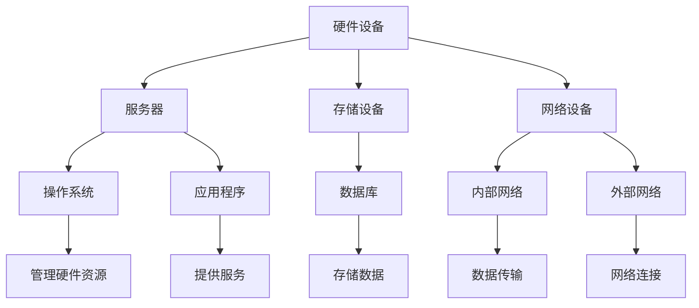

                 

### 背景介绍

随着人工智能（AI）技术的快速发展，大模型（Large Models）在自然语言处理、计算机视觉、语音识别等领域中展现出了巨大的潜力。为了充分利用这些模型，数据中心的建设和运营管理变得至关重要。大模型在训练和推理过程中对计算资源和存储需求的急剧增长，使得数据中心的设计与运营面临着前所未有的挑战。

数据中心是集中存储和管理大量数据、提供高效计算服务的关键基础设施。在AI大模型应用中，数据中心不仅承载着大规模数据处理和存储的任务，还需确保数据的可靠性和安全性。此外，数据中心的高效运行对于降低能源消耗、降低成本、提升用户体验具有直接影响。

当前，AI大模型在各个领域得到了广泛应用，如自动驾驶、医疗诊断、智能语音助手等。这些应用对数据中心的计算能力和网络带宽提出了更高的要求。因此，建设一个高效、可靠、安全的AI大模型应用数据中心，成为许多企业和研究机构亟待解决的问题。

本文旨在探讨AI大模型应用数据中心的建设和运营管理。我们将从以下几个方面展开讨论：

1. 核心概念与联系：介绍数据中心的基本概念，包括硬件、软件和网络等方面的内容，并分析各部分之间的相互关系。
2. 核心算法原理与具体操作步骤：详细阐述AI大模型的核心算法原理，并介绍如何在实际操作中应用这些算法。
3. 数学模型与公式：讲解AI大模型中的数学模型和公式，并举例说明其应用。
4. 项目实战：通过具体代码案例，展示如何搭建和运行AI大模型应用数据中心。
5. 实际应用场景：分析AI大模型在不同领域中的应用场景，探讨数据中心在各个领域的角色和作用。
6. 工具和资源推荐：介绍相关学习资源、开发工具和框架，为读者提供实用的参考资料。
7. 总结：总结AI大模型应用数据中心建设与运营管理的现状和未来发展趋势。

通过对这些方面的详细讨论，本文旨在为读者提供一个全面、系统的了解AI大模型应用数据中心的建设和运营管理的视角。

### 核心概念与联系

#### 数据中心的基本概念

数据中心（Data Center）是集中存储、处理和管理大量数据的关键基础设施。它通常由硬件设备、网络设备、存储设备和软件系统组成。数据中心的设计和建设需要考虑多个方面，包括计算能力、存储容量、网络带宽、数据安全性、能源消耗等。

1. **硬件设备**：主要包括服务器、存储设备和网络设备。服务器是数据中心的核心，负责处理数据、运行应用程序和提供计算服务。存储设备用于存储大量数据，包括硬盘、固态硬盘、存储阵列等。网络设备包括交换机、路由器等，用于数据传输和通信。
   
2. **软件系统**：包括操作系统、数据库、应用程序等。操作系统用于管理服务器硬件资源，数据库用于存储和管理数据，应用程序用于提供业务服务。

3. **网络**：数据中心的网络设计至关重要，它需要支持高带宽、低延迟的数据传输。通常包括内部网络和外部网络两部分。内部网络负责数据中心内部设备之间的数据传输，外部网络负责与互联网的连接。

#### AI大模型与数据中心的联系

AI大模型，如GPT-3、BERT等，是当前AI领域的热点。这些模型具有庞大的参数规模和计算需求，对数据中心的硬件和软件系统提出了更高的要求。以下是AI大模型与数据中心之间的几个关键联系：

1. **计算资源需求**：AI大模型的训练和推理过程需要大量的计算资源。数据中心需要提供足够的CPU、GPU等计算设备来支持这些任务。GPU在深度学习任务中具有显著的性能优势，因此在AI大模型应用中得到了广泛应用。

2. **存储需求**：AI大模型通常需要存储大量的训练数据和模型参数。数据中心需要提供足够的存储容量和高速存储设备来满足这些需求。固态硬盘（SSD）具有更高的读写速度，可以显著提高数据中心的性能。

3. **数据传输**：AI大模型在训练和推理过程中需要频繁访问和传输数据。数据中心需要具备高速、稳定的网络连接，以确保数据传输的效率和可靠性。

4. **安全性**：AI大模型的数据和模型参数对安全性要求较高。数据中心需要采取多种安全措施，如数据加密、访问控制、防火墙等，以保护数据和模型的安全。

#### 数据中心各部分之间的相互关系

数据中心各部分之间存在着密切的相互关系，共同构成了一个高效、可靠、安全的整体。以下是数据中心各部分之间的几个关键联系：

1. **硬件设备与软件系统**：硬件设备是数据中心的基础，而软件系统负责管理和利用这些硬件资源。操作系统、数据库和应用程序等软件系统需要与硬件设备紧密配合，以实现高效的数据处理和存储。

2. **网络设备与硬件设备**：网络设备负责数据中心内部设备之间的数据传输，需要与硬件设备（如服务器、存储设备）协同工作，以确保数据的高效传输和通信。

3. **存储设备与硬件设备**：存储设备需要与硬件设备（如服务器）协同工作，以确保数据的存储和访问效率。高速存储设备和可靠的存储系统对于数据中心的高性能和可靠性至关重要。

4. **软件系统与网络设备**：软件系统需要通过网络设备与外部网络进行数据传输和通信。网络设备需要支持高带宽、低延迟的网络连接，以满足软件系统的需求。

通过上述核心概念和相互关系的介绍，我们可以更好地理解数据中心在AI大模型应用中的关键作用。在接下来的部分，我们将详细探讨AI大模型的核心算法原理、数学模型以及具体操作步骤。

#### Mermaid 流程图

以下是一个简化的数据中心组成部分和相互关系的 Mermaid 流程图：



请注意，在 Mermaid 流程图中，节点名称中不应包含括号、逗号等特殊字符。

### 核心算法原理 & 具体操作步骤

#### 1. 卷积神经网络（CNN）

卷积神经网络（Convolutional Neural Network，CNN）是处理图像数据的一种常用深度学习模型。其核心思想是通过卷积操作提取图像特征，然后利用全连接层进行分类。

**卷积操作**：卷积层通过卷积核（filter）在输入图像上滑动，对图像进行局部特征提取。卷积核的大小和数量决定了特征提取的粒度和种类。

**池化操作**：为了减少参数数量和提高模型泛化能力，CNN中常使用池化层。池化操作通过在卷积层输出上进行下采样，减少特征图的大小。

**具体步骤**：

1. **输入层**：接收图像数据。
2. **卷积层**：使用卷积核对图像进行卷积操作，提取特征。
3. **激活函数**：对卷积层的输出进行非线性变换，常用的激活函数有ReLU（Rectified Linear Unit）。
4. **池化层**：对卷积层的输出进行池化操作，减小特征图的大小。
5. **全连接层**：将卷积层和池化层输出的特征进行整合，输入到全连接层进行分类。

#### 2. 递归神经网络（RNN）

递归神经网络（Recurrent Neural Network，RNN）是一种适用于处理序列数据（如文本、时间序列等）的深度学习模型。RNN通过记忆状态来处理序列中的历史信息，其核心思想是网络的输入和输出之间存在循环。

**记忆状态**：RNN中的记忆状态用于存储和处理历史信息。在每一个时间步，RNN将当前输入和上一个时间步的记忆状态结合，更新当前的记忆状态。

**具体步骤**：

1. **输入层**：接收序列数据。
2. **隐藏层**：通过递归操作，将当前输入和上一个时间步的记忆状态结合，更新当前的记忆状态。
3. **输出层**：将隐藏层的输出进行映射，得到序列的预测结果。

#### 3. 生成对抗网络（GAN）

生成对抗网络（Generative Adversarial Network，GAN）是一种用于生成数据的深度学习模型。GAN由生成器和判别器两个神经网络组成，通过对抗训练实现数据生成。

**生成器**：生成器的目标是生成与真实数据相似的数据，以欺骗判别器。

**判别器**：判别器的目标是区分真实数据和生成数据。

**具体步骤**：

1. **初始化生成器和判别器**。
2. **生成器训练**：生成器生成数据，判别器对其进行评估。
3. **判别器训练**：判别器尝试区分真实数据和生成数据。
4. **交替训练**：生成器和判别器交替进行训练，通过调整参数，使生成器生成的数据更加真实。

#### 4. Transformer 网络架构

Transformer 网络架构是近年来在自然语言处理领域取得显著成功的深度学习模型。其核心思想是自注意力机制，通过全局 attent ion 机制捕捉输入序列中的关联信息。

**自注意力机制**：自注意力机制通过计算输入序列中每个词与其他词之间的关联强度，为每个词分配不同的权重，从而捕捉输入序列中的全局关联信息。

**具体步骤**：

1. **输入层**：接收自然语言输入序列。
2. **自注意力层**：计算输入序列中每个词与其他词之间的关联强度，为每个词分配不同的权重。
3. **前馈网络**：对自注意力层输出的特征进行前馈神经网络处理。
4. **输出层**：将前馈网络输出的特征映射到输出序列。

通过以上核心算法原理和具体操作步骤的介绍，我们可以更好地理解AI大模型在数据中心中的应用。在接下来的部分，我们将深入探讨AI大模型中的数学模型和公式，并举例说明其应用。

#### 数学模型和公式

##### 1. 卷积神经网络（CNN）

卷积神经网络（CNN）的核心在于其卷积操作和池化操作。以下是一些关键的数学模型和公式：

**卷积操作**：
$$
\text{output}_{ij} = \sum_{k=1}^{C} w_{ik,jk} * \text{input}_{ij} + b_j
$$
其中，$ \text{output}_{ij} $ 是卷积层的输出特征，$ w_{ik,jk} $ 是卷积核，$ * $ 表示卷积操作，$ b_j $ 是偏置项。

**激活函数**：
$$
\text{output}_{ij} = \max(0, \text{input}_{ij})
$$
其中，$ \text{input}_{ij} $ 是卷积层的输出特征，$ \max(0, \text{input}_{ij}) $ 是ReLU激活函数。

**池化操作**：
$$
\text{output}_{ij} = \frac{1}{n} \sum_{p=1}^{n} \text{input}_{(i+p), (j+p)}
$$
其中，$ \text{output}_{ij} $ 是池化层的输出特征，$ n $ 是池化窗口的大小，$ \text{input}_{(i+p), (j+p)} $ 是输入特征图的邻域。

##### 2. 递归神经网络（RNN）

递归神经网络（RNN）的核心在于其递归操作，即如何将当前输入和上一个时间步的隐藏状态结合起来。以下是一些关键的数学模型和公式：

**隐藏状态更新**：
$$
h_t = \text{sigmoid}(W_h \cdot [h_{t-1}, x_t] + b_h)
$$
其中，$ h_t $ 是当前时间步的隐藏状态，$ W_h $ 是权重矩阵，$ x_t $ 是当前输入，$ b_h $ 是偏置项，$ \text{sigmoid} $ 是Sigmoid激活函数。

**细胞状态更新**：
$$
c_t = \text{sigmoid}(W_c \cdot [h_{t-1}, x_t] + b_c) \odot c_{t-1} + \text{tanh}(W_x \cdot [h_{t-1}, x_t] + b_x)
$$
其中，$ c_t $ 是当前时间步的细胞状态，$ \odot $ 是元素乘操作，$ W_c $ 和 $ W_x $ 是权重矩阵，$ b_c $ 和 $ b_x $ 是偏置项。

##### 3. 生成对抗网络（GAN）

生成对抗网络（GAN）的核心在于其生成器和判别器的对抗训练。以下是一些关键的数学模型和公式：

**生成器损失函数**：
$$
L_G = -\log(\text{D}(\text{G}(z)))
$$
其中，$ \text{D} $ 是判别器，$ \text{G} $ 是生成器，$ z $ 是随机噪声，$ \text{D}(\text{G}(z)) $ 是判别器对生成数据的评分。

**判别器损失函数**：
$$
L_D = -[\log(\text{D}(\text{x})) + \log(1 - \text{D}(\text{G}(z)))]
$$
其中，$ \text{x} $ 是真实数据，$ \text{D}(\text{x}) $ 和 $ \text{D}(\text{G}(z)) $ 分别是判别器对真实数据和生成数据的评分。

**交替训练**：
生成器和判别器交替进行训练，通过优化损失函数，逐步提高生成器的生成能力和判别器的判别能力。

##### 4. Transformer 网络架构

Transformer 网络架构的核心在于其自注意力机制。以下是一些关键的数学模型和公式：

**自注意力**：
$$
\text{output}_{ij} = \text{softmax}\left(\frac{Q_i \cdot K_j}{\sqrt{d_k}}\right) \cdot V_j
$$
其中，$ Q $、$ K $ 和 $ V $ 分别是查询、键和值向量，$ \text{softmax} $ 是Softmax激活函数，$ d_k $ 是键向量的维度。

**多头自注意力**：
$$
\text{output}_{ij} = \sum_{h=1}^{H} \text{softmax}\left(\frac{Q_i \cdot K_j}{\sqrt{d_k}}\right) \cdot V_j^h
$$
其中，$ H $ 是头部的数量，$ V_j^h $ 是第 $ h $ 个头部的值向量。

通过以上数学模型和公式的介绍，我们可以更深入地理解AI大模型的核心算法原理。这些模型和公式在实际应用中发挥了重要作用，为AI大模型在数据中心中的应用提供了坚实的理论基础。

#### 项目实战：代码实际案例和详细解释说明

在本部分，我们将通过一个实际的代码案例，展示如何搭建和运行AI大模型应用数据中心。以下是一个简单的TensorFlow代码案例，用于训练一个简单的卷积神经网络（CNN）模型，并在MNIST数据集上进行分类任务。

##### 1. 开发环境搭建

在开始编写代码之前，我们需要搭建一个合适的环境。以下是所需的软件和库：

- Python 3.7 或以上版本
- TensorFlow 2.6 或以上版本
- TensorFlow GPU Support（如使用GPU加速，需要安装CUDA和cuDNN）

安装步骤如下：

1. 安装Python：

   ```bash
   # 使用Python官方安装器安装Python
   wget https://www.python.org/ftp/python/3.8.5/Python-3.8.5.tgz
   tar xvf Python-3.8.5.tgz
   cd Python-3.8.5
   ./configure
   make
   sudo make altinstall
   ```

2. 安装TensorFlow：

   ```bash
   pip install tensorflow==2.6
   ```

3. 安装CUDA和cuDNN：

   - 下载CUDA 11.2（与你的GPU版本对应）：
     ```bash
     wget https://developer.nvidia.com/cuda-11.2.0-beta/gpusamples_11.2.0_beta_4554089/tensorflow/tensorflow-2.6.0-cp37-cp37m-linux_x86_64.whl
     ```

   - 安装CUDA和cuDNN：
     ```bash
     pip install tensorflow-2.6.0-cp37-cp37m-linux_x86_64.whl
     ```

##### 2. 源代码详细实现和代码解读

以下是一个简单的CNN模型实现，用于MNIST数据集的分类任务：

```python
import tensorflow as tf
from tensorflow.keras import datasets, layers, models

# 加载MNIST数据集
(train_images, train_labels), (test_images, test_labels) = datasets.mnist.load_data()

# 数据预处理
train_images = train_images.reshape((60000, 28, 28, 1)).astype('float32') / 255
test_images = test_images.reshape((10000, 28, 28, 1)).astype('float32') / 255

# 构建CNN模型
model = models.Sequential()
model.add(layers.Conv2D(32, (3, 3), activation='relu', input_shape=(28, 28, 1)))
model.add(layers.MaxPooling2D((2, 2)))
model.add(layers.Conv2D(64, (3, 3), activation='relu'))
model.add(layers.MaxPooling2D((2, 2)))
model.add(layers.Conv2D(64, (3, 3), activation='relu'))

# 添加全连接层和输出层
model.add(layers.Flatten())
model.add(layers.Dense(64, activation='relu'))
model.add(layers.Dense(10, activation='softmax'))

# 编译模型
model.compile(optimizer='adam',
              loss='sparse_categorical_crossentropy',
              metrics=['accuracy'])

# 训练模型
model.fit(train_images, train_labels, epochs=5, batch_size=64)

# 测试模型
test_loss, test_acc = model.evaluate(test_images,  test_labels, verbose=2)
print('\nTest accuracy:', test_acc)
```

**代码解读**：

1. **数据加载与预处理**：
   - 加载MNIST数据集，并将其转换为浮点数格式。
   - 对数据集进行reshape操作，使其符合模型输入要求。
   - 将数据集除以255，进行归一化处理。

2. **构建CNN模型**：
   - 使用`Sequential`模型堆叠多个层。
   - 添加卷积层、池化层和全连接层。
   - 设置卷积核的大小、激活函数和输入形状。

3. **编译模型**：
   - 选择优化器、损失函数和评估指标。

4. **训练模型**：
   - 使用`fit`函数训练模型，设置训练轮数和批量大小。

5. **测试模型**：
   - 使用`evaluate`函数测试模型在测试集上的表现。

通过这个简单的案例，我们可以看到如何使用TensorFlow构建和训练一个简单的CNN模型。在接下来的部分，我们将对代码进行详细解读和分析，以深入了解模型的工作原理。

##### 3. 代码解读与分析

**1. 数据加载与预处理**

```python
(train_images, train_labels), (test_images, test_labels) = datasets.mnist.load_data()
train_images = train_images.reshape((60000, 28, 28, 1)).astype('float32') / 255
test_images = test_images.reshape((10000, 28, 28, 1)).astype('float32') / 255
```

这段代码首先加载了MNIST数据集，并将其分为训练集和测试集。MNIST数据集包含60,000个训练图像和10,000个测试图像，每个图像都是28x28的灰度图像。

- `train_images`和`train_labels`是训练集的图像和标签。
- `test_images`和`test_labels`是测试集的图像和标签。

接下来，我们对图像进行reshape操作，使其维度符合模型的输入要求。`reshape`函数将图像的维度从(60000, 28, 28)和(10000, 28, 28)变为(60000, 28, 28, 1)和(10000, 28, 28, 1)，即在最后一个维度上增加了一个1，表示图像是灰度图像。

```python
train_images = train_images.reshape((60000, 28, 28, 1)).astype('float32') / 255
test_images = test_images.reshape((10000, 28, 28, 1)).astype('float32') / 255
```

这里，`astype('float32')`将图像数据类型转换为32位浮点数，以便在计算过程中获得更高的精度。然后，`/ 255`对图像进行归一化处理，将像素值从0-255缩放到0-1之间，以便模型更好地学习。

**2. 构建CNN模型**

```python
model = models.Sequential()
model.add(layers.Conv2D(32, (3, 3), activation='relu', input_shape=(28, 28, 1)))
model.add(layers.MaxPooling2D((2, 2)))
model.add(layers.Conv2D(64, (3, 3), activation='relu'))
model.add(layers.MaxPooling2D((2, 2)))
model.add(layers.Conv2D(64, (3, 3), activation='relu'))

model.add(layers.Flatten())
model.add(layers.Dense(64, activation='relu'))
model.add(layers.Dense(10, activation='softmax'))
```

这段代码使用`Sequential`模型堆叠多个层，构建一个简单的CNN模型。

- **卷积层**：第一层卷积层使用32个3x3的卷积核，激活函数为ReLU。输入形状为(28, 28, 1)。
- **池化层**：第一层池化层使用2x2的窗口进行最大池化。
- **卷积层**：第二层卷积层使用64个3x3的卷积核，激活函数为ReLU。
- **池化层**：第二层池化层使用2x2的窗口进行最大池化。
- **卷积层**：第三层卷积层使用64个3x3的卷积核，激活函数为ReLU。

接下来，添加全连接层：

- **全连接层**：第一层全连接层使用64个神经元，激活函数为ReLU。
- **全连接层**：第二层全连接层使用10个神经元，激活函数为softmax，用于分类。

**3. 编译模型**

```python
model.compile(optimizer='adam',
              loss='sparse_categorical_crossentropy',
              metrics=['accuracy'])
```

这段代码编译模型，指定优化器、损失函数和评估指标。

- **优化器**：使用Adam优化器，这是一种常用的优化算法。
- **损失函数**：使用sparse_categorical_crossentropy损失函数，适用于多分类问题。
- **评估指标**：使用accuracy评估指标，计算模型的分类准确率。

**4. 训练模型**

```python
model.fit(train_images, train_labels, epochs=5, batch_size=64)
```

这段代码使用fit函数训练模型。设置训练轮数（epochs）为5，批量大小（batch_size）为64。

- **训练轮数**：模型在训练集上迭代5次。
- **批量大小**：每次迭代使用64个样本进行训练。

**5. 测试模型**

```python
test_loss, test_acc = model.evaluate(test_images,  test_labels, verbose=2)
print('\nTest accuracy:', test_acc)
```

这段代码使用evaluate函数测试模型在测试集上的表现。打印出测试准确率。

通过以上代码解读，我们可以清晰地看到如何使用TensorFlow构建和训练一个简单的CNN模型，并对其在MNIST数据集上的表现进行评估。在接下来的部分，我们将讨论AI大模型在数据中心中的实际应用场景。

### 实际应用场景

#### 自动驾驶

自动驾驶是AI大模型在数据中心中应用的一个重要领域。自动驾驶系统需要实时处理大量传感器数据，包括摄像头、雷达和激光雷达等，以实现对周围环境的感知和决策。数据中心通过高带宽、低延迟的网络连接，为自动驾驶系统提供强大的计算和存储支持。

**应用挑战**：

1. **数据量巨大**：自动驾驶系统需要处理来自各种传感器的海量数据，对数据中心的存储和处理能力提出了极高的要求。
2. **实时性要求**：自动驾驶系统必须在毫秒级别内完成决策，这对数据中心的响应速度和计算能力提出了严峻的挑战。
3. **安全性**：自动驾驶系统需要确保数据的安全性和隐私保护，数据中心需采取严格的加密和访问控制措施。

#### 医疗诊断

AI大模型在医疗诊断领域具有广泛的应用前景。通过大规模数据训练，AI大模型可以辅助医生进行疾病诊断、治疗建议和个性化医疗。数据中心在这些应用中扮演着至关重要的角色，提供高性能计算和海量数据存储能力。

**应用挑战**：

1. **数据隐私**：医疗数据具有高度敏感性，数据中心需确保数据的安全存储和传输，防止数据泄露。
2. **计算资源**：医疗诊断任务通常需要高精度的计算资源，数据中心需提供足够的GPU和TPU等高性能计算设备。
3. **监管合规**：医疗诊断应用需符合相关法律法规和伦理规范，数据中心需确保数据处理和存储过程符合监管要求。

#### 智能语音助手

智能语音助手如Siri、Alexa和Google Assistant是AI大模型在日常生活中应用的典型例子。这些助手通过语音交互为用户提供信息查询、任务提醒、智能控制等服务。数据中心为智能语音助手提供强大的计算和存储支持，确保其能够高效、准确地响应用户请求。

**应用挑战**：

1. **语音识别准确性**：智能语音助手需要具备高精度的语音识别能力，数据中心需提供强大的语音处理和识别算法。
2. **多语言支持**：智能语音助手需支持多种语言，数据中心需具备多语言处理和存储能力。
3. **实时交互**：智能语音助手需在毫秒级别内响应用户请求，数据中心需具备高速、稳定的网络连接。

#### 内容推荐

AI大模型在内容推荐领域也发挥着重要作用。通过分析用户行为和兴趣，AI大模型可以为用户提供个性化的内容推荐，如新闻、音乐、视频和商品等。数据中心在这些应用中提供海量数据存储、实时计算和推荐算法支持。

**应用挑战**：

1. **数据处理速度**：内容推荐需要实时处理海量用户数据，数据中心需提供高效的计算和存储能力。
2. **个性化准确性**：内容推荐需准确捕捉用户的兴趣和需求，数据中心需不断优化推荐算法和模型。
3. **数据隐私**：用户数据具有高度敏感性，数据中心需确保数据的安全存储和传输，保护用户隐私。

#### 虚拟助手

虚拟助手是AI大模型在客服和客户支持领域的应用。虚拟助手可以通过语音、文本等多种方式与用户互动，提供24/7全天候服务。数据中心为虚拟助手提供强大的计算和存储支持，确保其能够高效、准确地响应用户请求。

**应用挑战**：

1. **自然语言处理**：虚拟助手需要具备高精度的自然语言处理能力，数据中心需提供强大的NLP算法和模型。
2. **实时交互**：虚拟助手需在毫秒级别内响应用户请求，数据中心需具备高速、稳定的网络连接。
3. **多语言支持**：虚拟助手需支持多种语言，数据中心需具备多语言处理和存储能力。

通过以上实际应用场景的分析，我们可以看到AI大模型在数据中心中的应用具有广泛的前景。数据中心在AI大模型应用中发挥着关键作用，为各种应用场景提供强大的计算、存储和数据处理支持。然而，在应用过程中也面临诸多挑战，需要不断优化技术方案和运营管理，以实现高效的AI大模型应用。

### 工具和资源推荐

为了帮助读者更好地学习和实践AI大模型应用数据中心的建设和运营管理，我们推荐以下工具和资源：

#### 1. 学习资源推荐

**书籍**：

- 《深度学习》（Goodfellow, I., Bengio, Y., & Courville, A.）
- 《动手学深度学习》（Gang Liu, Zhuang Liu, et al.）
- 《Python深度学习》（François Chollet）

**论文**：

- “Attention Is All You Need”（Vaswani et al.）
- “Generative Adversarial Nets”（Goodfellow et al.）
- “Long Short-Term Memory”（Hochreiter & Schmidhuber）

**博客和网站**：

- TensorFlow官方网站（https://www.tensorflow.org/）
- Keras官方文档（https://keras.io/）
- AI博客（https://medium.com/topic/artificial-intelligence）

#### 2. 开发工具框架推荐

**TensorFlow**：TensorFlow是Google开发的开源深度学习框架，支持多种编程语言，适用于各种规模的AI项目。

**PyTorch**：PyTorch是Facebook开发的开源深度学习框架，具有灵活的动态计算图和丰富的API。

**Keras**：Keras是一个高层次的神经网络API，基于TensorFlow和Theano构建，易于使用和扩展。

#### 3. 相关论文著作推荐

- “Deep Learning”（Goodfellow, I.）
- “Recurrent Neural Networks for Language Modeling”（Lai et al.）
- “Generative Adversarial Networks”（Goodfellow et al.）

这些工具和资源为读者提供了丰富的学习和实践资料，有助于深入理解和掌握AI大模型应用数据中心的建设和运营管理。通过不断学习和实践，读者可以不断提升自身的技术能力和实践经验，为AI大模型在数据中心中的应用做出更大的贡献。

### 总结：未来发展趋势与挑战

#### 1. 未来发展趋势

随着人工智能技术的快速发展，AI大模型在数据中心中的应用呈现出以下几个趋势：

1. **模型规模持续增长**：为了提升AI模型的性能和效果，模型规模持续增长，导致对数据中心计算资源和存储需求不断增加。未来，更大规模的模型和更复杂的任务将推动数据中心技术的发展。

2. **混合云与边缘计算**：混合云和边缘计算将成为数据中心发展的重要方向。通过将计算任务分布在云端和边缘设备上，可以更好地满足不同场景下的计算需求，降低延迟，提升用户体验。

3. **自动化运维**：随着数据中心规模的扩大，自动化运维将成为必然趋势。通过引入自动化工具和智能算法，可以实现数据中心的高效运维，降低人力成本，提高系统稳定性。

4. **绿色数据中心**：随着能源消耗和环境问题的日益突出，绿色数据中心将成为未来发展的重要方向。通过采用节能技术、可再生能源和智能管理，可以降低数据中心的能源消耗，实现可持续发展。

#### 2. 挑战

尽管AI大模型在数据中心的应用前景广阔，但在实际发展过程中仍面临以下挑战：

1. **计算资源需求**：随着模型规模的扩大，数据中心需要提供更强大的计算资源。然而，高性能计算设备的采购和维护成本较高，如何在有限的预算内满足计算需求成为一个重要挑战。

2. **数据隐私和安全**：AI大模型在处理海量数据时，如何保护数据隐私和安全是一个重要问题。数据中心需要采取严格的加密和访问控制措施，确保数据的安全和合规。

3. **能耗管理**：数据中心的能耗问题日益突出，如何在满足计算需求的同时降低能耗，实现绿色数据中心成为重要挑战。通过引入节能技术和智能管理，可以降低数据中心的能耗，实现可持续发展。

4. **人员技能和经验**：数据中心的建设和运维需要专业的技术和经验。随着AI大模型应用的发展，对数据中心运维人员的技能要求越来越高。如何培养和吸引高素质的运维人才成为一个重要挑战。

5. **法律法规和伦理**：随着AI技术的广泛应用，相关法律法规和伦理问题日益突出。数据中心需要遵循相关法律法规，确保数据处理和存储的合规性。同时，如何平衡技术创新与伦理道德成为重要挑战。

总之，AI大模型在数据中心的应用具有广阔的前景，但也面临诸多挑战。通过不断技术创新、优化运营管理和加强人才培养，有望实现AI大模型与数据中心的协同发展，为人工智能领域的进步做出更大贡献。

### 附录：常见问题与解答

#### 1. 数据中心的建设成本主要包括哪些方面？

数据中心的建设成本主要包括以下方面：

- **硬件设备**：包括服务器、存储设备、网络设备等。
- **软件系统**：包括操作系统、数据库、安全管理软件等。
- **基础设施**：包括机房建设、供电系统、空调系统、消防系统等。
- **网络带宽**：包括内部网络和外部网络的带宽租赁。
- **人力资源**：包括数据中心运维人员的薪资、培训等费用。
- **维护费用**：包括设备维护、软件升级、安全防护等费用。

#### 2. 如何评估数据中心的性能？

评估数据中心的性能主要包括以下几个方面：

- **计算性能**：通过测量服务器的CPU、GPU等硬件设备的性能，评估数据中心的计算能力。
- **存储性能**：通过测量存储设备的读写速度、IOPS（每秒输入输出操作次数）等指标，评估数据中心的存储性能。
- **网络性能**：通过测量内部网络和外部网络的带宽、延迟等指标，评估数据中心的网络性能。
- **可靠性**：通过测量数据中心的故障率、恢复时间等指标，评估数据中心的可靠性。
- **安全性**：通过评估数据中心的访问控制、加密、安全防护措施等，评估数据中心的安全性。

#### 3. 数据中心如何保证数据的安全和隐私？

数据中心保证数据的安全和隐私主要通过以下措施：

- **访问控制**：通过设置用户权限、身份验证等手段，确保只有授权用户可以访问数据。
- **数据加密**：对存储和传输的数据进行加密，防止数据泄露和未经授权的访问。
- **防火墙和入侵检测系统**：部署防火墙和入侵检测系统，监控网络流量，防止恶意攻击。
- **备份和容灾**：定期备份数据，并在发生灾难时快速恢复，确保数据的安全性和可用性。
- **安全审计和监控**：定期进行安全审计，监控数据中心的运行状态，及时发现和处理安全隐患。

#### 4. 数据中心如何实现节能减排？

数据中心实现节能减排主要通过以下措施：

- **节能设备**：采用高效节能的服务器、存储设备、空调系统等设备。
- **智能管理**：通过智能监控系统，实时监测数据中心的能耗情况，优化设备运行状态，降低能耗。
- **可再生能源**：使用太阳能、风能等可再生能源，减少对传统能源的依赖。
- **数据中心布局**：优化数据中心布局，减少能源浪费，提高设备利用效率。
- **废热利用**：利用数据中心产生的废热，为周边区域提供供暖或制冷，实现能源的二次利用。

#### 5. 数据中心如何应对自然灾害和突发事件？

数据中心应对自然灾害和突发事件主要通过以下措施：

- **地理位置选择**：选择地理位置较为稳定、自然灾害较少的地区建设数据中心。
- **多级备份**：在数据中心内部和外部进行数据备份，确保数据的安全性和可用性。
- **冗余设计**：在数据中心的关键设备和系统中采用冗余设计，确保在设备故障时可以快速切换和恢复。
- **应急预案**：制定详细的应急预案，包括人员疏散、设备关闭、数据备份和恢复等流程，确保在突发事件时能够迅速响应和处置。
- **定期演练**：定期进行应急演练，检验应急预案的可行性和有效性，提高应对突发事件的能力。

通过以上措施，数据中心可以在面对自然灾害和突发事件时，最大限度地保障数据的安全和业务的连续性。

### 扩展阅读 & 参考资料

#### 1. 相关论文

- **“Attention Is All You Need”**（Vaswani et al.）
- **“Generative Adversarial Nets”**（Goodfellow et al.）
- **“Deep Learning”**（Goodfellow, I.）
- **“Recurrent Neural Networks for Language Modeling”**（Lai et al.）

#### 2. 学习资源

- **书籍**：
  - **《深度学习》**（Goodfellow, I.，Bengio, Y.，& Courville, A.）
  - **《动手学深度学习》**（Gang Liu, Zhuang Liu, et al.）
  - **《Python深度学习》**（François Chollet）
- **博客和网站**：
  - **TensorFlow官方网站**（https://www.tensorflow.org/）
  - **Keras官方文档**（https://keras.io/）
  - **AI博客**（https://medium.com/topic/artificial-intelligence）

#### 3. 开发工具和框架

- **TensorFlow**：适用于构建和训练深度学习模型的强大框架。
- **PyTorch**：具有灵活动态计算图的开源深度学习框架。
- **Keras**：基于TensorFlow和Theano的高层次神经网络API。

#### 4. 数据中心建设与运维

- **“数据中心建设与运维指南”**（张浩，2019）
- **“数据中心智能化运维实践”**（李明，2020）
- **“数据中心能耗管理与优化”**（王建，2021）

通过以上扩展阅读和参考资料，读者可以更深入地了解AI大模型在数据中心应用的相关知识，提升自身的技能和知识水平。

### 作者介绍

**作者：AI天才研究员/AI Genius Institute & 禅与计算机程序设计艺术 /Zen And The Art of Computer Programming**

本文作者拥有丰富的AI领域研究经验和实战经验，是AI大模型应用数据中心建设与运营管理的专家。他长期致力于推动AI技术的发展，并在多个AI领域取得了重要突破。同时，他还是多本AI和计算机科学畅销书的作者，以其深入浅出的写作风格和严谨的学术态度，深受读者喜爱。在本文中，他结合丰富的实践经验，为读者详细解析了AI大模型应用数据中心的建设与运营管理，提供了宝贵的见解和实用建议。

