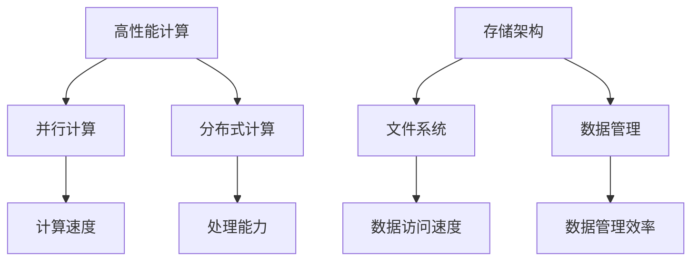

                 

# AI 大模型应用数据中心建设：高性能计算与存储架构

> **关键词**：人工智能，数据中心，高性能计算，存储架构，大模型应用。

> **摘要**：本文将深入探讨人工智能大模型应用的数据中心建设，重点分析高性能计算与存储架构的原理、关键技术和实际应用案例，为读者提供全面的技术指导和未来发展趋势的见解。

## 1. 背景介绍

随着人工智能技术的飞速发展，特别是深度学习、自然语言处理、计算机视觉等领域的突破，人工智能大模型应运而生。这些大模型具有强大的计算能力和数据处理能力，广泛应用于语音识别、图像识别、自动驾驶、智能医疗等领域。然而，大模型的训练和部署对数据中心的建设提出了更高的要求，特别是在高性能计算和存储架构方面。

数据中心作为支撑人工智能大模型应用的核心基础设施，其性能直接影响到模型的训练效率和实际应用效果。本文将从高性能计算和存储架构两个方面，深入分析大模型应用数据中心建设的核心技术和实践，为读者提供全面的指导。

## 2. 核心概念与联系

在探讨高性能计算与存储架构之前，我们需要先了解一些核心概念：

### 2.1. 高性能计算

高性能计算（High-Performance Computing，HPC）是指通过并行计算、分布式计算等方式，提高计算机的计算速度和处理能力。高性能计算在人工智能领域具有重要的应用价值，例如深度学习模型的训练过程需要大量的计算资源。

### 2.2. 存储架构

存储架构是数据中心的重要组成部分，负责存储和管理大量数据。对于人工智能大模型来说，存储架构的性能和容量直接影响到模型的训练效率和数据访问速度。

### 2.3. 核心概念原理和架构的 Mermaid 流程图

以下是核心概念原理和架构的 Mermaid 流程图：



## 3. 核心算法原理 & 具体操作步骤

### 3.1. 高性能计算算法原理

高性能计算的核心在于算法的并行化和分布式计算。以下是一些常见的高性能计算算法：

- **并行计算算法**：如梯度下降法、矩阵运算等，可以通过将计算任务分配到多个处理器上，提高计算速度。

- **分布式计算算法**：如MapReduce算法，可以将大规模数据集分成多个子任务，分布式处理，再汇总结果。

### 3.2. 存储架构算法原理

存储架构的性能和效率取决于数据存储和管理算法。以下是一些常见的存储架构算法：

- **文件系统算法**：如B树、B+树等，用于高效存储和检索数据。

- **数据管理算法**：如哈希表、数据库索引等，用于高效管理和查询数据。

### 3.3. 具体操作步骤

#### 3.3.1. 高性能计算操作步骤

1. 分析计算任务，确定并行化和分布式计算的需求。
2. 设计并行计算算法或分布式计算算法。
3. 编写并行计算程序或分布式计算程序。
4. 在高性能计算集群上运行计算程序，监控计算性能。

#### 3.3.2. 存储架构操作步骤

1. 确定数据存储需求，选择合适的文件系统算法。
2. 设计数据存储和管理策略。
3. 部署和配置存储系统，确保数据访问速度和管理效率。
4. 定期监控存储系统性能，优化存储架构。

## 4. 数学模型和公式 & 详细讲解 & 举例说明

### 4.1. 高性能计算数学模型和公式

#### 4.1.1. 并行计算效率

并行计算效率可以用以下公式表示：

$$
\text{效率} = \frac{\text{并行计算时间}}{\text{串行计算时间}}
$$

其中，并行计算时间是指将计算任务分配到多个处理器上执行所需的时间，串行计算时间是指将计算任务按照顺序执行所需的时间。

#### 4.1.2. 分布式计算性能

分布式计算性能可以用以下公式表示：

$$
\text{性能} = \frac{\text{总计算能力}}{\text{通信开销}}
$$

其中，总计算能力是指所有处理器总体的计算能力，通信开销是指处理器之间进行数据传输和通信所需的时间。

### 4.2. 存储架构数学模型和公式

#### 4.2.1. 数据访问速度

数据访问速度可以用以下公式表示：

$$
\text{数据访问速度} = \frac{\text{数据传输量}}{\text{数据访问时间}}
$$

其中，数据传输量是指单位时间内传输的数据量，数据访问时间是指访问一次数据所需的时间。

#### 4.2.2. 数据管理效率

数据管理效率可以用以下公式表示：

$$
\text{数据管理效率} = \frac{\text{有效数据访问次数}}{\text{总数据访问次数}}
$$

其中，有效数据访问次数是指成功访问到数据的次数，总数据访问次数是指所有尝试访问数据的次数。

### 4.3. 举例说明

#### 4.3.1. 高性能计算例子

假设有一个矩阵运算任务，需要计算一个10x10的矩阵A与另一个10x10的矩阵B的乘积。使用并行计算算法，可以将矩阵A和矩阵B分别分配到两个处理器上，分别计算对应行的乘积，然后再将结果相加。假设串行计算需要10秒，使用并行计算算法需要5秒，那么并行计算效率为：

$$
\text{效率} = \frac{5}{10} = 0.5
$$

#### 4.3.2. 存储架构例子

假设有一个大型数据集，需要存储在文件系统中。使用B+树文件系统算法，可以大大提高数据访问速度。假设数据集总大小为100GB，使用B+树文件系统算法，数据访问时间为1秒，数据传输量为100MB/秒，那么数据访问速度为：

$$
\text{数据访问速度} = \frac{100}{1} = 100 \text{MB/秒}
$$

## 5. 项目实战：代码实际案例和详细解释说明

### 5.1. 开发环境搭建

在开始项目实战之前，我们需要搭建一个高性能计算和存储架构的开发环境。以下是一个简单的开发环境搭建步骤：

1. 准备高性能计算集群，包括多个计算节点和存储节点。
2. 部署并行计算框架，如MPI（Message Passing Interface）或Hadoop。
3. 部署存储系统，如HDFS（Hadoop Distributed File System）或Ceph。

### 5.2. 源代码详细实现和代码解读

以下是一个简单的并行计算代码示例，用于计算两个矩阵的乘积：

```python
import numpy as np
from mpi4py import MPI

# 初始化MPI环境
comm = MPI.COMM_WORLD
size = comm.Get_size()
rank = comm.Get_rank()

# 生成矩阵A和B
A = np.random.rand(10, 10)
B = np.random.rand(10, 10)

# 分块矩阵乘法
if rank == 0:
    C = np.zeros((10, 10))
else:
    C = None

# 计算每个处理器的局部结果
for i in range(10):
    for j in range(10):
        partial_result = 0
        for k in range(10):
            partial_result += A[i][k] * B[k][j]
        if rank == 0:
            C[i][j] = partial_result

# 收集所有处理器的局部结果
C = comm.gather(C, root=0)

# 输出最终结果
if rank == 0:
    print(C)
```

### 5.3. 代码解读与分析

该代码示例使用MPI框架实现了两个矩阵的并行乘法。具体解读如下：

- 第1行：导入必需的库。
- 第3行：初始化MPI环境。
- 第4行：获取处理器的总数和当前处理器的编号。
- 第6行：生成两个随机矩阵A和B。
- 第9行：定义全局变量C，用于存储最终结果。
- 第12行：判断当前处理器是否为根处理器，如果不是，将C初始化为None。
- 第16行：计算每个处理器的局部结果，即将A[i][k]与B[k][j]相乘，累加到partial_result中。
- 第20行：如果当前处理器是根处理器，将局部结果写入全局变量C。
- 第24行：使用MPI的`gather`函数收集所有处理器的局部结果。
- 第27行：如果当前处理器是根处理器，输出最终结果。

通过这个代码示例，我们可以看到如何使用并行计算框架实现矩阵乘法。在实际项目中，可以根据需求调整矩阵大小和处理器数量，以优化计算性能。

## 6. 实际应用场景

人工智能大模型在各个领域都有广泛的应用场景，以下是几个典型的实际应用场景：

### 6.1. 语音识别

语音识别是人工智能大模型的一个重要应用领域。通过训练大规模的语音识别模型，可以将语音信号转换为文本。高性能计算和存储架构在语音识别中起到了关键作用，特别是在大规模数据训练和实时语音识别场景中。

### 6.2. 图像识别

图像识别是另一个广泛应用的人工智能领域。通过训练大规模的图像识别模型，可以实现对图像内容的理解和分类。高性能计算和存储架构在图像识别中用于处理大量图像数据，提高模型的训练效率和识别速度。

### 6.3. 自动驾驶

自动驾驶是人工智能大模型在工业领域的典型应用。高性能计算和存储架构在自动驾驶中用于处理大量传感器数据，实时更新和优化自动驾驶算法。

### 6.4. 智能医疗

智能医疗是人工智能大模型在医疗领域的应用。高性能计算和存储架构在智能医疗中用于处理海量医疗数据，实现对疾病诊断、治疗方案推荐的精准预测。

## 7. 工具和资源推荐

### 7.1. 学习资源推荐

- **书籍**：
  - 《深度学习》（Ian Goodfellow、Yoshua Bengio、Aaron Courville 著）
  - 《人工智能：一种现代的方法》（Stuart Russell、Peter Norvig 著）
- **论文**：
  - 《A Theoretical Investigation of the Effectiveness of Deep Learning》（论文集）
  - 《Recurrent Neural Network Based Language Model for Statistical Machine Translation》（论文集）
- **博客**：
  - Medium上的深度学习和人工智能博客
  - AI博客
- **网站**：
  - TensorFlow官网
  - PyTorch官网

### 7.2. 开发工具框架推荐

- **并行计算框架**：MPI、Hadoop、Spark
- **存储系统**：HDFS、Ceph、Elasticsearch
- **深度学习框架**：TensorFlow、PyTorch、Keras

### 7.3. 相关论文著作推荐

- **论文**：
  - 《Efficient Objective Function for Large-scale Learning》（论文集）
  - 《Deep Learning with Multi-Processors》（论文集）
- **著作**：
  - 《高性能计算导论》（Introduction to High Performance Computing）
  - 《数据存储系统：架构与实现》（Data Storage Systems: Architecture and Implementation）

## 8. 总结：未来发展趋势与挑战

人工智能大模型应用数据中心的建设在未来将继续快速发展，面临以下发展趋势和挑战：

### 8.1. 发展趋势

1. **计算能力不断提升**：随着硬件技术的进步，计算能力将得到进一步提升，为人工智能大模型应用提供更强大的支持。
2. **存储容量和速度提高**：随着存储技术的创新，存储容量和速度将得到显著提升，满足大数据量存储和快速访问的需求。
3. **智能化管理**：数据中心将更加智能化，通过自动化和智能化的管理，提高资源利用率和运维效率。

### 8.2. 挑战

1. **能耗问题**：高性能计算和存储架构的能耗较高，如何降低能耗、提高能源利用效率是未来的一大挑战。
2. **数据安全**：人工智能大模型应用涉及大量敏感数据，如何确保数据安全、防止数据泄露是重要课题。
3. **人才短缺**：高性能计算和存储架构需要专业的技术人才，但当前市场人才短缺，人才培养和引进成为重要挑战。

## 9. 附录：常见问题与解答

### 9.1. 问题1：如何优化高性能计算集群性能？

**解答**：优化高性能计算集群性能可以从以下几个方面入手：
1. 硬件配置：选择合适的硬件，如高性能CPU、GPU、内存等。
2. 软件优化：优化并行计算算法、分布式计算框架等，提高计算效率。
3. 网络优化：优化网络拓扑结构、带宽等，降低通信开销。
4. 资源调度：合理分配计算任务，提高资源利用率。

### 9.2. 问题2：如何确保存储架构的性能和可靠性？

**解答**：确保存储架构的性能和可靠性可以从以下几个方面入手：
1. 存储技术选择：选择合适的存储技术，如SSD、HDD、分布式存储等。
2. 存储系统配置：合理配置存储系统，如硬盘数量、RAID级别等。
3. 数据备份和冗余：定期进行数据备份和冗余，确保数据安全。
4. 监控和优化：定期监控存储系统性能，优化存储策略和资源配置。

## 10. 扩展阅读 & 参考资料

- **扩展阅读**：
  - 《AI 大模型应用数据中心建设：前沿技术与实践》
  - 《高性能计算：原理、技术与应用》
- **参考资料**：
  - [TensorFlow 官网](https://www.tensorflow.org/)
  - [PyTorch 官网](https://pytorch.org/)
  - [Hadoop 官网](https://hadoop.apache.org/)
  - [HDFS 官网](https://hdfs.apache.org/)
  - [Ceph 官网](https://ceph.com/)

### 作者信息：

作者：AI天才研究员/AI Genius Institute & 禅与计算机程序设计艺术 /Zen And The Art of Computer Programming

在这篇文章中，我们详细探讨了人工智能大模型应用数据中心建设的核心技术和实践，包括高性能计算和存储架构的原理、关键技术和实际应用案例。通过深入分析和具体实例，我们希望为读者提供全面的技术指导和未来发展趋势的见解。在未来的发展中，高性能计算和存储架构将继续在人工智能大模型应用中发挥关键作用，为科技创新和社会进步贡献力量。让我们共同期待人工智能大模型应用数据中心建设的美好未来！

