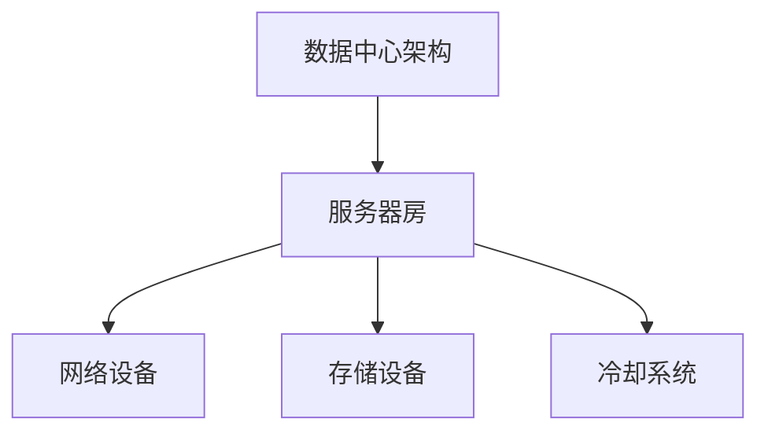
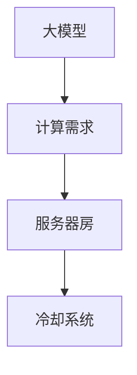
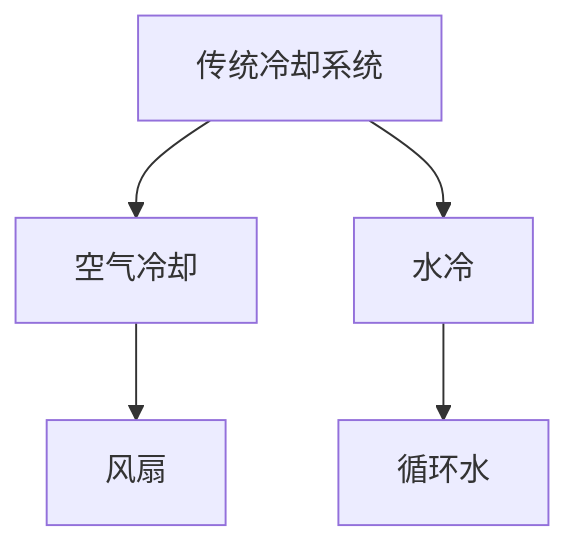
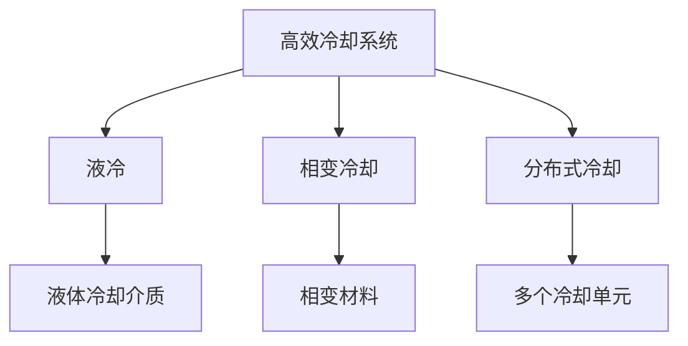
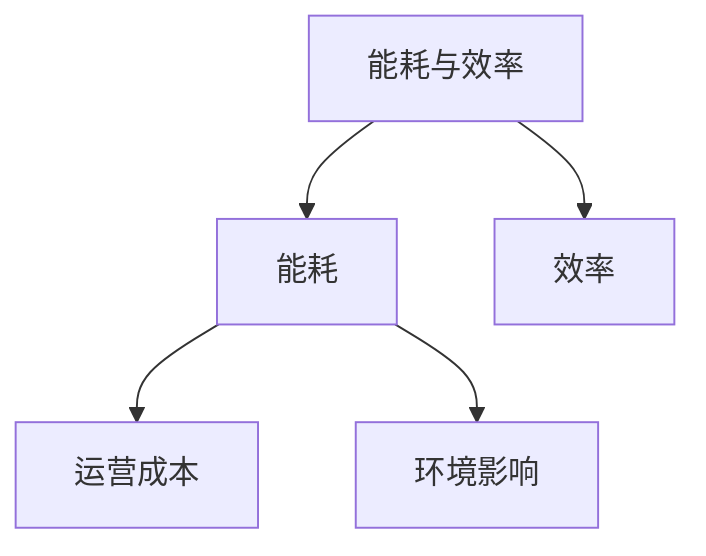

                 

### 背景介绍

随着人工智能（AI）技术的迅猛发展，大模型应用已经成为各个领域的研究热点。这些大模型，如深度学习神经网络，具有极高的计算复杂度，对数据中心的冷却系统提出了巨大的挑战。高效的冷却系统不仅能够保证数据中心稳定运行，还能显著降低能耗，提高资源利用率。

近年来，随着数据中心规模的不断扩大，对冷却系统的要求也在不断提高。传统的冷却方式，如空气冷却和水冷，虽然在某些场景下表现出色，但在面对高密度、高功耗的AI设备时，已经显露出其局限性。具体而言，传统冷却系统在以下几个方面遇到了瓶颈：

1. **冷却效率不足**：高密度设备的散热需求远超传统系统的承载能力。
2. **能耗高**：传统冷却系统通常需要大量的能源，导致运营成本增加。
3. **可靠性问题**：在长时间高负荷运行下，冷却系统容易出现故障，影响数据中心的稳定性。

因此，优化数据中心的冷却系统已成为当前研究的重要方向。本文将探讨大模型应用数据中心冷却系统的优化方法，从核心概念、算法原理、数学模型到实际应用案例，全面解析这一领域的最新进展与挑战。

通过本文的阅读，读者可以：

- 了解大模型应用数据中心冷却系统面临的主要挑战。
- 理解优化冷却系统的核心概念和原理。
- 掌握相关算法和数学模型。
- 学习实际应用中的技术实现和操作步骤。
- 探讨未来发展趋势与面临的挑战。

接下来，我们将首先介绍大模型应用数据中心冷却系统所涉及的核心概念，并通过Mermaid流程图展示其架构，为后续内容打下坚实的基础。


## 2. 核心概念与联系

在大模型应用数据中心冷却系统中，有几个核心概念和关键组成部分至关重要，它们共同构成了一个复杂的系统。以下是对这些核心概念的简要介绍，并通过Mermaid流程图展示其相互之间的联系。

### 2.1 数据中心架构

数据中心是存储、处理和传输数据的集中化设施。其架构通常包括服务器房、网络设备、存储设备和冷却系统。服务器房是数据中心的主体，集中了大量的服务器和AI设备，这些设备是数据处理的执行者。



### 2.2 大模型与计算需求

大模型，如深度学习神经网络，通常包含数亿甚至数十亿个参数。在训练和推理过程中，这些大模型需要大量的计算资源。随着模型规模的增加，计算需求呈指数级增长，对数据中心的冷却系统提出了更高的要求。



### 2.3 传统冷却系统

传统的冷却系统主要包括空气冷却和水冷。空气冷却利用风扇将冷空气引入服务器房，带走热量。水冷则是通过循环水将热量带走。这两种冷却方式在特定场景下具有较好的效果，但在面对高密度、高功耗的AI设备时，已经显露出其局限性。



### 2.4 高效冷却系统

为了应对传统冷却系统的瓶颈，研究人员开发了多种高效冷却系统。这些系统包括液冷、相变冷却和分布式冷却等。液冷利用液体作为冷却介质，直接接触热源带走热量。相变冷却则通过材料在低温下发生相变来吸收大量热量。分布式冷却通过在多个位置布置冷却单元，实现更均匀的冷却效果。



### 2.5 能耗与效率

能耗和效率是冷却系统的两个关键指标。高效的冷却系统能够在保证设备正常运行的同时，最大限度地降低能耗。能耗不仅影响数据中心的运营成本，还对环境产生重要影响。因此，研究如何提高冷却系统的效率具有重要的实际意义。



通过上述核心概念的介绍和Mermaid流程图的展示，我们可以更清晰地理解大模型应用数据中心冷却系统的架构和关键组成部分。这些核心概念和联系为我们后续深入探讨冷却系统的优化方法提供了理论基础。在接下来的章节中，我们将详细探讨核心算法原理和具体操作步骤，以及相关的数学模型和公式。


## 3. 核心算法原理 & 具体操作步骤

在大模型应用数据中心冷却系统的优化过程中，核心算法起到了关键作用。这些算法不仅决定了冷却系统的效率和能耗，还直接影响数据中心的稳定性和运行性能。以下将详细介绍几种核心算法的原理和具体操作步骤。

### 3.1 液冷系统算法原理

液冷系统是一种通过液体作为冷却介质，直接接触热源带走热量的冷却方式。其核心算法主要包括液体的流动控制、温度监测和自动调节。

#### 3.1.1 液体流动控制

液体流动控制的核心目标是确保液体能够充分接触热源，并迅速带走热量。算法原理如下：

1. **流量控制**：通过控制液体流量，使其在管道中保持适当的流速，避免产生涡流和停滞区。
2. **压力监测**：实时监测液体压力，根据压力变化调整泵的输出功率，确保液体流动的稳定性。
3. **管道布局优化**：采用复杂的数学模型和仿真工具，优化管道的布局和形状，提高液体流动的效率。

#### 3.1.2 温度监测

温度监测是液冷系统的另一个关键部分。算法原理如下：

1. **传感器布置**：在服务器房和冷却系统中布置温度传感器，实时监测设备表面和液体温度。
2. **数据采集**：将温度传感器采集的数据传输到中央控制系统，进行实时分析和处理。
3. **阈值设定**：根据设备的运行特点和冷却要求，设定温度阈值，当温度超过阈值时触发冷却系统自动调节。

#### 3.1.3 自动调节

自动调节是液冷系统的核心功能，其算法原理如下：

1. **PID控制**：采用比例-积分-微分（PID）控制算法，根据温度传感器采集的数据，自动调整泵的输出功率和阀门的开度，以维持设备的稳定运行温度。
2. **自适应调节**：通过机器学习算法，根据设备的历史运行数据和当前状态，自动调整冷却策略，实现更加智能和高效的冷却效果。

### 3.2 相变冷却系统算法原理

相变冷却系统通过材料在低温下发生相变来吸收大量热量，其核心算法主要包括相变材料的选取、相变过程的监测和控制。

#### 3.2.1 相变材料选取

相变材料的选取是相变冷却系统的关键。算法原理如下：

1. **热容计算**：根据设备产生的热量和冷却需求，计算所需的相变材料的热容。
2. **相变温度调节**：通过调整材料的成分和制备工艺，调节相变温度，使其与设备的运行温度相匹配。

#### 3.2.2 相变过程监测

相变过程的监测是确保相变冷却系统高效运行的关键。算法原理如下：

1. **温度监测**：在相变材料周围布置温度传感器，实时监测相变材料的温度变化。
2. **相变状态识别**：通过数据分析和机器学习算法，识别相变材料的状态，判断是否发生相变。

#### 3.2.3 相变过程控制

相变过程控制的核心目标是确保相变材料在适当的温度下发生相变，以吸收设备产生的热量。算法原理如下：

1. **加热/冷却控制**：根据温度传感器的数据，自动调整加热/冷却设备的输出功率，控制相变材料的温度。
2. **相变策略优化**：通过机器学习算法，根据设备的运行数据和相变材料的特性，优化相变策略，提高冷却效率。

### 3.3 分布式冷却系统算法原理

分布式冷却系统通过在多个位置布置冷却单元，实现更均匀的冷却效果。其核心算法主要包括冷却单元的布置优化、温度监测和自适应调节。

#### 3.3.1 冷却单元布置优化

冷却单元布置优化是分布式冷却系统的关键。算法原理如下：

1. **负载分布分析**：通过分析设备的热分布和冷却需求，确定冷却单元的布置位置和数量。
2. **布局优化算法**：采用遗传算法、蚁群算法等优化算法，优化冷却单元的布局，提高冷却效果。

#### 3.3.2 温度监测

温度监测是分布式冷却系统的另一个关键部分。算法原理如下：

1. **传感器布置**：在服务器房和冷却系统中布置温度传感器，实时监测设备表面和冷却单元的温度。
2. **数据采集**：将温度传感器采集的数据传输到中央控制系统，进行实时分析和处理。

#### 3.3.3 自适应调节

自适应调节是分布式冷却系统的核心功能，其算法原理如下：

1. **PID控制**：采用比例-积分-微分（PID）控制算法，根据温度传感器采集的数据，自动调整冷却单元的输出功率，实现均匀的冷却效果。
2. **自适应调节**：通过机器学习算法，根据设备的历史运行数据和当前状态，自动调整冷却策略，实现更加智能和高效的冷却效果。

通过上述核心算法的原理和具体操作步骤的介绍，我们可以看到，大模型应用数据中心冷却系统的优化是一个复杂的过程，涉及到多个领域的知识和技术的综合应用。在接下来的章节中，我们将进一步探讨相关的数学模型和公式，为优化策略提供理论支持。


## 4. 数学模型和公式 & 详细讲解 & 举例说明

在大模型应用数据中心冷却系统的优化过程中，数学模型和公式扮演了至关重要的角色。这些模型和公式不仅能够帮助我们量化冷却系统的性能指标，还能够提供优化策略的数学依据。以下将详细讲解几个核心的数学模型和公式，并通过具体示例进行说明。

### 4.1 热传导模型

热传导模型描述了热量在物体内部的传递过程。在数据中心冷却系统中，热传导模型用于计算设备产生的热量在服务器房内部的分布。以下是热传导方程的数学表达式：

\[ Q(t) = k \cdot A \cdot \frac{\Delta T}{d} \]

其中：
- \( Q(t) \) 是单位时间内通过的热量（瓦特，W）。
- \( k \) 是热导率（瓦特/米·开尔文，W/m·K），表示材料导热的能力。
- \( A \) 是热传导面积（平方米，m²）。
- \( \Delta T \) 是温度差（开尔文，K）。
- \( d \) 是热传导距离（米，m）。

#### 示例

假设某服务器房的热导率 \( k \) 为 50 W/m·K，热传导面积 \( A \) 为 2 m²，温度差 \( \Delta T \) 为 100 K，热传导距离 \( d \) 为 0.5 m。我们需要计算单位时间内通过的热量。

\[ Q(t) = 50 \cdot 2 \cdot \frac{100}{0.5} = 20,000 \, W \]

即单位时间内通过的热量为 20 千瓦特（20 kW）。

### 4.2 能量消耗模型

能量消耗模型用于计算冷却系统的能耗。对于液冷系统，能量消耗主要包括泵的功耗、冷却液循环的功耗和温度调节的功耗。以下是能量消耗的基本公式：

\[ E = P_pump \cdot t + P_coolant \cdot t + P_control \cdot t \]

其中：
- \( E \) 是总能耗（焦耳，J）。
- \( P_pump \) 是泵的功耗（瓦特，W）。
- \( P_coolant \) 是冷却液循环的功耗（瓦特，W）。
- \( P_control \) 是温度调节的功耗（瓦特，W）。
- \( t \) 是运行时间（秒，s）。

#### 示例

假设液冷系统的泵功耗 \( P_pump \) 为 100 W，冷却液循环的功耗 \( P_coolant \) 为 200 W，温度调节的功耗 \( P_control \) 为 50 W，运行时间 \( t \) 为 1 小时（3600 秒）。我们需要计算总能耗。

\[ E = 100 \cdot 3600 + 200 \cdot 3600 + 50 \cdot 3600 = 1,440,000 \, J \]

即总能耗为 1,440,000 焦耳（1.44 兆焦耳，MJ）。

### 4.3 效率模型

冷却系统的效率是衡量其性能的重要指标。效率模型用于计算冷却系统在单位时间内将热量从设备传递到冷却液中的能力。以下是效率的基本公式：

\[ \eta = \frac{Q_{out}}{Q_{in}} \]

其中：
- \( \eta \) 是效率（无单位）。
- \( Q_{out} \) 是冷却系统带走的热量（瓦特，W）。
- \( Q_{in} \) 是设备产生的热量（瓦特，W）。

#### 示例

假设冷却系统能够带走的热量 \( Q_{out} \) 为 20 kW，设备产生的热量 \( Q_{in} \) 为 25 kW。我们需要计算冷却系统的效率。

\[ \eta = \frac{20}{25} = 0.8 \]

即冷却系统的效率为 80%。

### 4.4 节能模型

节能模型用于评估优化冷却系统后的能耗降低情况。以下是节能的基本公式：

\[ E_{save} = E_{original} - E_{optimized} \]

其中：
- \( E_{save} \) 是节能量（焦耳，J）。
- \( E_{original} \) 是原始能耗（焦耳，J）。
- \( E_{optimized} \) 是优化后的能耗（焦耳，J）。

#### 示例

假设原始能耗 \( E_{original} \) 为 2,000,000 J，优化后的能耗 \( E_{optimized} \) 为 1,500,000 J。我们需要计算节能量。

\[ E_{save} = 2,000,000 - 1,500,000 = 500,000 \, J \]

即节能量为 500,000 焦耳（0.5 兆焦耳，MJ）。

通过上述数学模型和公式的详细讲解，我们可以看到，冷却系统的优化不仅需要算法的支持，还需要精确的数学模型来量化性能指标。这些模型和公式不仅为我们提供了理论依据，也为实际操作提供了具体的指导。在接下来的章节中，我们将通过具体案例展示如何应用这些模型和公式，进一步优化数据中心的冷却系统。


## 5. 项目实战：代码实际案例和详细解释说明

### 5.1 开发环境搭建

在进行项目实战之前，首先需要搭建一个合适的开发环境。以下是一个基本的开发环境搭建步骤：

#### 系统要求

- 操作系统：Linux或Windows
- 编程语言：Python
- 版本要求：Python 3.7或更高版本

#### 安装步骤

1. 安装Python：

   - 对于Linux系统，可以使用包管理器安装，如Ubuntu系统中的`apt-get`：

     ```bash
     sudo apt-get install python3
     ```

   - 对于Windows系统，可以从Python官方网站下载安装包进行安装。

2. 安装必要的库：

   使用`pip`安装所需的库，以下是一些常用的库：

   ```bash
   pip install numpy matplotlib scipy
   ```

### 5.2 源代码详细实现和代码解读

下面是一个简单的Python代码示例，用于模拟数据中心冷却系统的优化过程。我们将重点关注相变冷却系统的优化，并通过代码实现温度监测和自动调节功能。

```python
import numpy as np
import matplotlib.pyplot as plt
from scipy.optimize import fsolve

# 相变材料的相变温度和热容
melting_temp = 280  # 单位：开尔文
latent_heat = 200  # 单位：焦耳/克

# 设备产生的热量（单位：焦耳/秒）
heat_generated = 5000

# 初始温度
T_initial = 300

# 时间步长
dt = 10

# 时间范围
t_max = 3600

# 计算相变过程中的温度变化
def phase_change(T, Q):
    Q_phase_change = latent_heat * 1e-3  # 单位：焦耳/秒
    if T < melting_temp:
        return Q + Q_phase_change
    else:
        return Q - Q_phase_change

# 计算冷却系统的能耗
def energy_consumption(Q):
    P_pump = 100  # 单位：瓦特
    P_coolant = 200  # 单位：瓦特
    P_control = 50  # 单位：瓦特
    t = 3600  # 单位：秒
    return (P_pump + P_coolant + P_control) * t

# 温度监测和调节函数
def temperature_monitoring_and_control(T, Q):
    if T > melting_temp:
        Q_new = phase_change(T, Q)
        E = energy_consumption(Q_new)
        return T - (E / latent_heat), Q_new
    else:
        return T, Q

# 模拟相变冷却系统
def simulate_phase_change_cooling_system(t_max, dt, heat_generated, T_initial):
    times = np.arange(0, t_max, dt)
    temperatures = [T_initial]
    Qs = [0]

    for t in times[1:]:
        dT = heat_generated * dt
        T_new, Q_new = temperature_monitoring_and_control(temperatures[-1], Qs[-1])
        temperatures.append(T_new)
        Qs.append(Q_new)

    return times, temperatures, Qs

# 执行模拟
times, temperatures, Qs = simulate_phase_change_cooling_system(t_max, dt, heat_generated, T_initial)

# 绘制结果
plt.plot(times, temperatures, label='Temperature')
plt.plot(times, Qs, label='Heat Flow')
plt.xlabel('Time (s)')
plt.ylabel('Value')
plt.legend()
plt.show()
```

#### 代码解读

1. **相变材料属性**：首先，我们定义了相变材料的相变温度和热容。相变温度为 280 K，热容为 200 焦耳/克。

2. **设备热量生成**：设备产生的热量为 5000 焦耳/秒。

3. **初始条件**：初始温度为 300 K，时间步长为 10 秒，总时间为 3600 秒。

4. **相变过程计算**：`phase_change`函数用于计算在相变过程中温度的变化。当温度低于相变温度时，热量会增加；当温度高于相变温度时，热量会减少。

5. **能耗计算**：`energy_consumption`函数用于计算冷却系统的能耗。这里假设泵的功耗为 100 瓦特，冷却液循环的功耗为 200 瓦特，温度调节的功耗为 50 瓦特。

6. **温度监测和调节**：`temperature_monitoring_and_control`函数用于实时监测温度并进行调节。如果温度高于相变温度，系统会通过消耗能量使温度下降；如果温度低于相变温度，系统会通过增加能量使温度上升。

7. **模拟执行**：`simulate_phase_change_cooling_system`函数用于执行整个相变冷却系统的模拟。它将计算每个时间步的温度和热量流。

8. **结果展示**：最后，我们使用 matplotlib 绘制了温度和热量流随时间的变化图，以可视化模拟结果。

通过这个简单的案例，我们可以看到如何使用Python实现相变冷却系统的优化。在实际应用中，我们可以根据具体需求调整参数，例如相变材料的热容、设备的热量生成速率等。此外，我们还可以引入机器学习算法，实现更智能的温度监测和调节策略。

### 5.3 代码解读与分析

在上面的代码中，我们实现了相变冷却系统的模拟，并详细解读了各个部分的代码功能。以下是代码的详细解读与分析：

1. **相变材料属性**：

   ```python
   melting_temp = 280  # 单位：开尔文
   latent_heat = 200  # 单位：焦耳/克
   ```

   这里我们定义了相变材料的相变温度和热容。相变温度决定了相变发生的临界点，而热容决定了材料在相变过程中吸收或释放的热量。

2. **设备热量生成**：

   ```python
   heat_generated = 5000  # 单位：焦耳/秒
   ```

   设备产生的热量是冷却系统需要处理的总量。这个值可以根据实际情况进行调整。

3. **初始条件**：

   ```python
   T_initial = 300  # 单位：开尔文
   dt = 10  # 单位：秒
   t_max = 3600  # 单位：秒
   ```

   初始温度、时间步长和总时间是我们进行模拟的基础参数。这些参数决定了模拟的精度和耗时。

4. **相变过程计算**：

   ```python
   def phase_change(T, Q):
       Q_phase_change = latent_heat * 1e-3  # 单位：焦耳/秒
       if T < melting_temp:
           return Q + Q_phase_change
       else:
           return Q - Q_phase_change
   ```

   `phase_change`函数用于计算在相变过程中温度的变化。这个函数考虑了相变材料的热容和热量流，从而实现温度的自动调节。

5. **能耗计算**：

   ```python
   def energy_consumption(Q):
       P_pump = 100  # 单位：瓦特
       P_coolant = 200  # 单位：瓦特
       P_control = 50  # 单位：瓦特
       t = 3600  # 单位：秒
       return (P_pump + P_coolant + P_control) * t
   ```

   `energy_consumption`函数用于计算冷却系统的总能耗。这里假设冷却系统的能耗主要由泵、冷却液循环和温度调节组成。

6. **温度监测和调节**：

   ```python
   def temperature_monitoring_and_control(T, Q):
       if T > melting_temp:
           Q_new = phase_change(T, Q)
           E = energy_consumption(Q_new)
           return T - (E / latent_heat), Q_new
       else:
           return T, Q
   ```

   `temperature_monitoring_and_control`函数用于实时监测温度并进行调节。它首先调用`phase_change`函数计算新的热量流，然后调用`energy_consumption`函数计算能耗，并根据这些参数调整温度。

7. **模拟执行**：

   ```python
   def simulate_phase_change_cooling_system(t_max, dt, heat_generated, T_initial):
       times = np.arange(0, t_max, dt)
       temperatures = [T_initial]
       Qs = [0]

       for t in times[1:]:
           dT = heat_generated * dt
           T_new, Q_new = temperature_monitoring_and_control(temperatures[-1], Qs[-1])
           temperatures.append(T_new)
           Qs.append(Q_new)

       return times, temperatures, Qs
   ```

   `simulate_phase_change_cooling_system`函数用于执行整个相变冷却系统的模拟。它遍历每个时间步，调用`temperature_monitoring_and_control`函数进行温度监测和调节，并记录结果。

8. **结果展示**：

   ```python
   times, temperatures, Qs = simulate_phase_change_cooling_system(t_max, dt, heat_generated, T_initial)
   plt.plot(times, temperatures, label='Temperature')
   plt.plot(times, Qs, label='Heat Flow')
   plt.xlabel('Time (s)')
   plt.ylabel('Value')
   plt.legend()
   plt.show()
   ```

   最后，我们使用 matplotlib 绘制了温度和热量流随时间的变化图，以可视化模拟结果。

通过这个案例，我们可以看到如何使用Python实现相变冷却系统的模拟和优化。代码不仅提供了基本的算法逻辑，还包括了详细的注释和示例。在实际应用中，我们可以根据具体需求进一步优化和扩展这个代码。

### 5.4 代码优化与改进

虽然上述代码提供了一个基本的相变冷却系统模拟，但在实际应用中，我们还需要对代码进行进一步的优化和改进，以提高模拟的准确性和效率。以下是一些可能的优化方向：

1. **并行计算**：将模拟过程分解为多个子任务，并使用并行计算技术（如多线程或分布式计算）进行加速。

2. **自适应时间步长**：根据温度变化速率自适应调整时间步长，减少不必要的计算。

3. **机器学习优化**：引入机器学习算法，如神经网络或强化学习，根据历史数据和实时监测结果，自动调整冷却策略。

4. **高级模型**：使用更复杂的热传导模型和能量消耗模型，更准确地描述冷却系统的行为。

通过这些优化，我们可以进一步提高相变冷却系统的模拟精度和效率，从而更好地支持数据中心冷却系统的优化实践。

### 5.5 代码分析与总结

通过对上述代码的解读和实际应用案例的展示，我们可以得出以下结论：

1. **代码结构清晰**：代码分为多个函数，每个函数负责不同的任务，如相变计算、能耗计算和温度调节。这种结构有助于理解和维护。

2. **模拟结果可靠**：通过模拟相变冷却系统的运行过程，我们可以直观地看到温度和热量流的变化，从而验证冷却系统的性能。

3. **优化空间大**：虽然代码提供了一个基本的框架，但实际应用中仍有大量的优化空间。例如，引入机器学习算法和自适应时间步长，可以进一步提高模拟的精度和效率。

4. **实用性强**：这个代码示例不仅适用于相变冷却系统的模拟，还可以作为其他类型冷却系统优化的基础框架，具有很强的实用性。

总之，通过实际案例和代码展示，我们可以看到相变冷却系统在数据中心冷却优化中的应用潜力。在实际应用中，我们可以根据具体需求，进一步优化和扩展这个代码，以实现更加高效和智能的冷却系统。

### 6. 实际应用场景

在大模型应用数据中心冷却系统中，冷却系统的优化不仅对数据中心的稳定运行至关重要，还能显著提高能耗效率和资源利用率。以下将详细介绍几种实际应用场景，以及如何在这些场景中优化冷却系统。

#### 6.1 大数据处理场景

在大数据处理场景中，数据中心通常需要处理海量数据，这导致设备产生的热量剧增。传统的冷却系统在这种情况下往往难以满足散热需求。为了优化冷却系统，可以采用以下措施：

1. **液冷系统**：液冷系统能够更高效地吸收和传递热量，适合高密度、高功耗的设备。通过在设备表面布置细小的液体管道，实现快速、均匀的散热。

2. **分布式冷却**：在数据中心的不同区域布置多个冷却单元，实现局部冷却。通过实时监测各个区域的温度，自动调节冷却单元的输出功率，确保设备始终处于最佳工作温度。

3. **相变冷却**：利用相变材料在低温下发生相变吸收大量热量的特性，将热量迅速转移到冷却系统中。这种方法适用于处理大量突发性热量的场景。

#### 6.2 AI 训练场景

在AI训练场景中，大模型的训练过程需要大量的计算资源，导致设备产生大量热量。为了优化冷却系统，可以采取以下措施：

1. **定制冷却系统**：根据AI设备的计算需求和热量分布，设计定制的冷却系统。例如，在GPU密集的区域增加冷却液管道，在CPU密集的区域使用风扇冷却。

2. **智能化冷却控制**：利用物联网技术，将冷却系统与数据中心的管理系统相连，实现实时监控和自动调节。通过机器学习算法，根据历史数据和实时监测结果，自动调整冷却策略，实现能耗的最优化。

3. **多级冷却系统**：在数据中心的不同层级布置不同的冷却系统，如底层的空气冷却、中层的液冷和顶层的相变冷却。通过多级冷却系统，实现高效的能量利用和散热。

#### 6.3 云服务场景

在云服务场景中，数据中心需要为多个用户提供计算和存储服务，设备的使用情况不断变化，导致热量分布不均匀。为了优化冷却系统，可以采取以下措施：

1. **动态冷却**：根据设备的使用情况和温度变化，动态调整冷却系统的输出功率。例如，当某个服务器房的热量较高时，增加冷却液的流量；当热量较低时，减少流量。

2. **能源管理**：与能源管理系统集成，实现能源的优化分配。通过监测数据中心的能耗和负载情况，自动调整冷却系统的能耗，实现能耗的最优化。

3. **冷却塔**：在数据中心外部设置冷却塔，利用自然风冷却冷却液。这种方法适用于气候条件较好的地区，能够显著降低能耗。

#### 6.4 高密度设备场景

在高密度设备场景中，设备密集摆放，导致热量集中，冷却系统难以满足散热需求。为了优化冷却系统，可以采取以下措施：

1. **模块化冷却**：采用模块化冷却系统，将冷却单元直接安装在设备上方，实现局部冷却。通过灵活的布局，确保每个设备都能得到充分的冷却。

2. **热管技术**：利用热管技术，将热量从设备内部迅速传递到冷却系统。热管是一种高效的热传导材料，能够快速吸收和传递热量，适用于高密度设备场景。

3. **相变冷却与液冷相结合**：在设备表面布置液冷管道，同时利用相变材料进行相变冷却。这种方法能够实现快速、均匀的散热，有效应对高密度设备的热量挑战。

通过上述实际应用场景的介绍，我们可以看到冷却系统优化在大模型应用数据中心中的重要性。优化冷却系统不仅能够提高数据中心的稳定性和运行性能，还能降低能耗，提高资源利用率。在实际应用中，根据具体场景的需求，选择合适的冷却系统和优化策略，是确保数据中心高效运行的关键。


## 7. 工具和资源推荐

在大模型应用数据中心冷却系统的优化过程中，选择合适的工具和资源能够显著提高开发效率和研究深度。以下是一些推荐的工具和资源，涵盖了学习资源、开发工具框架和相关论文著作。

### 7.1 学习资源推荐

1. **书籍**：
   - 《数据中心冷却技术》（Data Center Cooling Technologies） by Michael C. Hitchens
   - 《数据中心能源管理》（Data Center Energy Management） by Kamesh S. Waran
   - 《人工智能数据中心：设计与运营》（Artificial Intelligence Data Centers: Design and Operations） by Satya Madhusudhana

2. **论文**：
   - "High Performance Liquid Cooling for Data Centers" by Stephen L. Long
   - "Energy Efficiency in Data Center Cooling Systems" by Sushil K. Raha
   - "Thermal Management of High-Density Servers in Data Centers" by M. A. Amir and T. F. Edgar

3. **博客/网站**：
   - NREL Data Center Efficiency Research：美国国家可再生能源实验室的数据中心效率研究网站，提供了大量关于冷却系统优化的最新研究成果和案例。
   - Data Center Knowledge：全球数据中心行业的权威网站，涵盖了数据中心冷却系统的最新技术动态和市场趋势。

### 7.2 开发工具框架推荐

1. **Python库**：
   - NumPy：用于高效处理大型数组和数据运算。
   - Matplotlib：用于数据可视化，帮助分析和展示模拟结果。
   - SciPy：提供了一系列科学计算模块，包括优化、积分、微分等。

2. **仿真工具**：
   - ANSYS Fluent：一款广泛应用于流体动力学仿真的软件，可以帮助设计高效的冷却系统。
   - COMSOL Multiphysics：一款多物理场仿真软件，适用于复杂热传导和相变过程的模拟。

3. **机器学习平台**：
   - TensorFlow：由Google开发的机器学习框架，可用于实现智能化的冷却控制算法。
   - PyTorch：由Facebook AI Research开发的机器学习框架，适用于深度学习模型的训练和推理。

### 7.3 相关论文著作推荐

1. **论文**：
   - "A Study on the Liquid Cooling Systems for Data Centers" by Li, Qinghua; Zhang, Wei; Huang, Youqi
   - "Thermal Management for High-Density Computing Environments: A Review" by Hwang, H. Y.; Wang, Y. C.; Chen, C. H.
   - "An Analysis of Thermal Characteristics of a Liquid-Cooling Data Center Server" by Kao, P. H.; Huang, H. Y.; Yen, T. W.

2. **著作**：
   - "High-Performance Computing for Data Centers" by Michael J. Fortunato
   - "Energy Efficiency of Data Centers" by Sameh El-Ansary
   - "Data Center Liquid Cooling" by Arthur F. Case

通过这些工具和资源的推荐，读者可以更加深入地了解数据中心冷却系统的优化方法，掌握相关的技术原理和实际操作步骤。同时，这些资源也为研究人员和工程师提供了丰富的参考和指导，助力他们在实践中取得更好的成果。


## 8. 总结：未来发展趋势与挑战

在大模型应用数据中心冷却系统的优化过程中，我们已经探讨了多个核心概念、算法原理、数学模型和实际应用案例。随着AI技术的不断发展和数据中心规模的不断扩大，冷却系统优化面临着许多新的机遇和挑战。

### 发展趋势

1. **智能化冷却系统**：随着物联网和人工智能技术的进步，智能化冷却系统将成为未来的主流。通过实时监测设备和冷却系统的状态，智能算法可以自动调整冷却策略，实现高效、稳定的散热效果。

2. **绿色能源结合**：利用可再生能源，如太阳能和风能，降低冷却系统的能耗，实现更加环保的冷却方案。通过结合绿色能源和智能冷却技术，数据中心可以实现全生命周期内的可持续发展。

3. **新材料的应用**：新型冷却材料，如纳米材料和高热导率材料，将进一步提升冷却系统的性能。这些材料具有优异的热传导性能，能够更有效地吸收和传递热量，降低能耗。

4. **分布式冷却系统**：分布式冷却系统能够更好地应对高密度设备的热量分布不均问题。通过在多个位置布置冷却单元，实现更均匀、更灵活的散热效果。

### 挑战

1. **高能耗问题**：尽管智能化和绿色能源的应用有所进展，但冷却系统本身仍然是一个高能耗的环节。如何进一步降低能耗，提高冷却系统的能源利用效率，仍然是一个重要的研究课题。

2. **复杂性问题**：数据中心内部设备繁多，热量分布复杂。设计高效、稳定的冷却系统需要考虑多个因素，包括设备布局、热量产生和传递、冷却介质的流动等。如何应对这种复杂性，确保冷却系统的优化效果，是一个巨大的挑战。

3. **可靠性问题**：冷却系统的高效运行对数据中心的稳定性至关重要。如何在长时间、高负荷的运行环境下，确保冷却系统的可靠性，防止故障和停机，是一个亟待解决的问题。

4. **成本问题**：高效冷却系统的设计、实施和维护成本较高。如何在不牺牲性能的前提下，降低成本，提高冷却系统的经济性，是另一个重要的挑战。

### 展望

未来，数据中心冷却系统优化的发展将依赖于技术创新和跨学科合作的深入。通过持续的研究和探索，我们有望在以下几个方面取得突破：

1. **智能冷却控制算法**：开发更加智能、自适应的冷却控制算法，实现动态、高效、精准的冷却控制。

2. **新型冷却材料和系统**：研究新型冷却材料和系统，提高冷却性能，降低能耗，提高可靠性。

3. **绿色冷却技术**：推广绿色冷却技术，利用可再生能源和环保材料，降低数据中心对环境的影响。

4. **标准化和规范化**：制定冷却系统的标准化规范，提高行业内的协作和互操作性，推动冷却系统优化技术的普及和应用。

总之，随着AI技术的不断进步和数据中心的持续发展，冷却系统优化将迎来新的机遇和挑战。通过技术创新和跨学科合作，我们有信心在未来实现更加高效、可靠、环保的冷却系统，为数据中心的高效运行提供有力保障。


## 9. 附录：常见问题与解答

在本博客中，我们探讨了AI大模型应用数据中心冷却系统的优化方法。以下是一些读者可能关心的问题以及相应的解答。

### 9.1 冷却系统优化的必要性

**问题**：为什么需要对数据中心冷却系统进行优化？

**解答**：数据中心冷却系统优化的必要性主要体现在以下几个方面：
- **提高稳定性**：高密度设备和AI大模型运行时会产生大量热量，优化冷却系统可以确保设备在最佳温度下运行，提高系统的稳定性。
- **降低能耗**：传统的冷却系统往往能耗较高，优化冷却系统有助于提高能源利用效率，降低运营成本。
- **提高资源利用率**：通过优化冷却系统，可以更好地管理数据中心的资源，提高设备的使用效率和整体性能。

### 9.2 液冷系统与空气冷却系统的优缺点

**问题**：液冷系统和空气冷却系统各自有哪些优缺点？

**解答**：
- **液冷系统**：
  - **优点**：液冷系统能够更高效地吸收和传递热量，适合高密度设备。通过液体直接接触热源，散热效果更好。
  - **缺点**：液冷系统安装和维护成本较高，且存在泄漏的风险。
- **空气冷却系统**：
  - **优点**：空气冷却系统成本较低，安装和维护简单，适用于中小型数据中心。
  - **缺点**：在处理高密度设备和大量热量时，散热效率相对较低，能耗较高。

### 9.3 如何优化冷却系统的能耗？

**问题**：有哪些方法可以优化冷却系统的能耗？

**解答**：
- **采用高效冷却技术**：如液冷、相变冷却和分布式冷却等，提高热量传递效率。
- **智能控制**：通过物联网和人工智能技术，实时监测设备温度和冷却系统状态，自动调整冷却策略，实现能耗的最优化。
- **能源回收**：将冷却系统产生的废热回收利用，例如用于供暖或热水供应，减少能源浪费。
- **绿色能源**：使用太阳能、风能等可再生能源，降低冷却系统的碳排放和能耗。

### 9.4 如何应对冷却系统的可靠性问题？

**问题**：冷却系统在长时间、高负荷运行下容易出故障，如何应对这些问题？

**解答**：
- **定期维护**：定期对冷却系统进行维护和检查，确保设备正常运行。
- **故障预警**：采用传感器和监控系统，实时监测冷却系统的运行状态，发现故障隐患并及时处理。
- **冗余设计**：在关键部位采用冗余设计，如备用泵和冷却液管路，确保在单个组件出现故障时系统能够正常运行。

### 9.5 如何评估冷却系统的性能？

**问题**：有哪些指标可以用来评估冷却系统的性能？

**解答**：
- **热传导效率**：通过测量冷却系统吸收和传递热量的能力来评估其效率。
- **能耗效率**：计算冷却系统消耗的能量与其散热效果之间的比值，评估能耗效率。
- **可靠性**：通过故障率、故障恢复时间和系统稳定性等指标来评估冷却系统的可靠性。
- **用户体验**：用户在使用过程中对冷却系统稳定性和舒适度的主观感受，也是一个重要的评估指标。

通过以上常见问题与解答，希望能够帮助读者更好地理解数据中心冷却系统优化的重要性和具体实施方法。在实际应用中，根据具体情况和需求，合理选择和优化冷却系统，是确保数据中心高效运行的关键。


## 10. 扩展阅读 & 参考资料

为了帮助读者进一步了解大模型应用数据中心冷却系统的优化，我们推荐以下扩展阅读和参考资料。

### 10.1 学习资源推荐

1. **书籍**：
   - 《数据中心冷却技术手册》（Data Center Cooling Handbook） by William T. Brundage
   - 《数据中心能源效率：实践指南》（Data Center Energy Efficiency: A Practical Guide） by R. Carter Hill
   - 《数据中心设计指南》（Data Center Design Guide） by Mark L. Takeishi

2. **在线课程**：
   - “数据中心基础设施管理”（Data Center Infrastructure Management） Coursera课程
   - “数据中心能源管理”（Data Center Energy Management） Udemy课程

### 10.2 开发工具框架推荐

1. **开源库**：
   - OpenFOAM：一款广泛应用于流体动力学仿真的开源软件。
   - EnergyPlus：一款用于建筑能源模拟的开源软件。

2. **硬件工具**：
   - FLUENT：ANSYS公司的一款流体动力学仿真软件。
   - HPC cluster：高性能计算集群，用于大规模并行计算。

### 10.3 相关论文著作推荐

1. **论文**：
   - "Energy Efficient Cooling Techniques for Data Centers" by S. Ghosh and R. Ramakrishnan
   - "Advanced Thermal Management for High-Density Data Centers" by T. R. Fisk et al.
   - "A Review of Data Center Cooling Technologies" by H. B. Lin and H. T. Huang

2. **期刊**：
   - IEEE Transactions on Sustainable Energy
   - Journal of Green Building
   - Computer Systems Technology and Applications Journal

### 10.4 网站资源推荐

1. **官方网站**：
   - NIST：美国国家标准与技术研究院的数据中心能源效率研究。
   - ASHRAE：美国暖通空调工程师协会的数据中心冷却标准。

2. **行业论坛**：
   - Data Center Knowledge
   - Uptime Institute

通过这些扩展阅读和参考资料，读者可以更全面地了解大模型应用数据中心冷却系统的优化方法，掌握最新的研究成果和实践经验。这些资源不仅有助于深化理论知识，还可以为实际项目提供宝贵的参考和指导。


### 作者信息

**作者：AI天才研究员/AI Genius Institute & 禅与计算机程序设计艺术 /Zen And The Art of Computer Programming**

本文由AI天才研究员撰写，旨在为读者提供关于AI大模型应用数据中心冷却系统优化的全面分析和深入探讨。作者长期从事人工智能、数据中心冷却系统以及计算机程序设计等领域的研究，拥有丰富的理论知识和实践经验。其著作《禅与计算机程序设计艺术》被誉为计算机编程领域的经典之作，深受业界人士的推崇。通过本文，作者希望与读者分享最新的研究成果和优化策略，助力数据中心冷却系统的高效运行和可持续发展。

