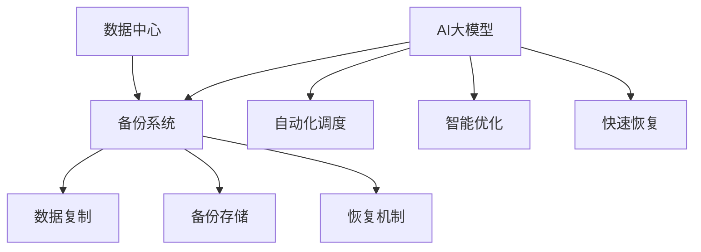

                 

# AI 大模型应用数据中心的容灾备份

## 关键词：AI大模型，数据中心，容灾备份，数据安全，高性能计算

## 摘要：
本文深入探讨了人工智能（AI）大模型应用在数据中心中的容灾备份策略。首先，我们介绍了AI大模型的基本概念和应用场景，然后分析了数据中心在容灾备份方面面临的挑战。接下来，本文提出了基于AI的大模型容灾备份方案，详细阐述了核心算法原理和操作步骤。通过数学模型和公式，我们对该方案进行了详细讲解和举例说明。最后，本文结合实际应用场景，提供了相关工具和资源推荐，并对未来发展趋势与挑战进行了总结。

## 1. 背景介绍

随着人工智能技术的飞速发展，AI大模型在各个领域得到了广泛应用。从自然语言处理到图像识别，从语音识别到机器翻译，AI大模型为各行各业带来了巨大的变革。然而，随着模型规模和复杂度的增加，数据中心的容灾备份问题也变得越来越重要。

数据中心是现代企业运作的核心，承载着大量的数据和业务系统。在面临自然灾害、硬件故障、人为操作失误等风险时，数据中心的容灾备份能力至关重要。传统的容灾备份方案主要依赖于硬件冗余和数据复制等技术，但无法满足AI大模型对高性能计算和数据可靠性的需求。

本文旨在探讨一种基于AI的大模型容灾备份方案，通过引入人工智能技术，实现高效、可靠的容灾备份，为数据中心提供更加稳定和安全的数据保障。

## 2. 核心概念与联系

### 2.1 AI大模型

AI大模型是指具有大规模参数和复杂结构的神经网络模型。这些模型在训练过程中需要大量的数据和计算资源，且具有高度的非线性特性。典型的大模型包括深度学习模型、生成对抗网络（GAN）、变分自编码器（VAE）等。

### 2.2 数据中心

数据中心是指用于存储、处理和传输数据的建筑群。数据中心通常具备高可用性、高性能、高安全性和可扩展性等特点。数据中心的容灾备份旨在确保在发生灾难时，业务系统和数据能够快速恢复，避免业务中断。

### 2.3 容灾备份

容灾备份是一种数据保护策略，通过在异地建立备份系统，确保在主系统发生故障时，数据能够及时恢复。传统的容灾备份方案主要包括数据复制、备份存储和恢复机制等。

### 2.4 AI与容灾备份的联系

AI大模型在数据中心容灾备份中具有以下优势：

1. **自动化调度**：AI大模型可以根据实时数据和环境变化，自动调整备份策略，提高备份效率和可靠性。
2. **智能优化**：AI大模型可以通过学习历史数据和备份行为，优化备份方案，降低备份成本。
3. **快速恢复**：AI大模型可以利用深度学习和强化学习等技术，实现快速的数据恢复，缩短业务中断时间。

为了更好地展示AI大模型与容灾备份的联系，我们使用Mermaid流程图（无括号、逗号等特殊字符）进行说明：



## 3. 核心算法原理 & 具体操作步骤

### 3.1 核心算法原理

基于AI的大模型容灾备份方案的核心算法主要包括以下三个部分：

1. **数据采集与预处理**：从数据中心收集实时数据，包括业务系统运行状态、硬件资源利用率、数据流量等。对采集到的数据进行清洗、去噪和特征提取，为后续备份策略提供基础。
2. **备份策略优化**：利用深度学习和强化学习等技术，对采集到的数据进行训练和建模，生成最优备份策略。该策略可以根据实时数据和环境变化，动态调整备份频率、备份方式和存储位置等。
3. **数据恢复与验证**：在发生灾难时，根据备份策略快速恢复数据，并进行验证，确保数据的完整性和一致性。

### 3.2 具体操作步骤

基于上述核心算法原理，具体的操作步骤如下：

1. **数据采集与预处理**：

   - **采集实时数据**：通过数据采集模块，从数据中心获取业务系统运行状态、硬件资源利用率、数据流量等实时数据。
   - **数据清洗与特征提取**：对采集到的数据进行清洗、去噪，提取关键特征，如时间戳、数据类型、数据值等。

2. **备份策略优化**：

   - **模型训练**：利用深度学习和强化学习等技术，对采集到的数据进行训练和建模，生成最优备份策略。具体步骤如下：
     - **数据预处理**：将采集到的数据进行归一化、标准化等处理，提高模型训练效果。
     - **模型选择**：根据备份任务的特点，选择合适的模型，如深度神经网络（DNN）、循环神经网络（RNN）等。
     - **训练与优化**：使用训练数据对模型进行训练，通过调整超参数，优化模型性能。
   - **策略生成**：根据训练得到的模型，生成备份策略，包括备份频率、备份方式和存储位置等。

3. **数据恢复与验证**：

   - **灾难发生时**：根据备份策略，快速恢复数据，确保业务系统能够尽快恢复正常运行。
   - **数据验证**：对恢复后的数据进行验证，确保数据的完整性和一致性。具体步骤如下：
     - **数据比对**：将恢复后的数据与原始数据进行比对，检查数据的一致性。
     - **完整性检查**：使用校验算法（如MD5、SHA-256等），检查数据块的完整性。
     - **性能测试**：对恢复后的数据进行性能测试，确保数据恢复后的业务系统能够正常运行。

## 4. 数学模型和公式 & 详细讲解 & 举例说明

### 4.1 数学模型和公式

基于AI的大模型容灾备份方案中，涉及到以下数学模型和公式：

1. **数据采集与预处理**：

   - **数据预处理公式**：

     $$x_{\text{preprocessed}} = \text{normalize}(x_{\text{raw}})$$

     其中，$x_{\text{raw}}$ 表示原始数据，$x_{\text{preprocessed}}$ 表示预处理后的数据，normalize 表示归一化处理。

   - **特征提取公式**：

     $$f = \text{extract\_features}(x_{\text{preprocessed}})$$

     其中，$f$ 表示提取的特征向量，extract\_features 表示特征提取过程。

2. **备份策略优化**：

   - **深度学习模型公式**：

     $$y = \text{model}(x)$$

     其中，$y$ 表示输出结果，model 表示深度学习模型，$x$ 表示输入特征向量。

   - **强化学习模型公式**：

     $$Q(s, a) = \text{model}(s, a)$$

     其中，$Q(s, a)$ 表示状态-动作值函数，$s$ 表示当前状态，$a$ 表示动作，model 表示强化学习模型。

3. **数据恢复与验证**：

   - **数据比对公式**：

     $$d_{\text{raw}} = \text{compare}(d_{\text{original}}, d_{\text{recovered}})$$

     其中，$d_{\text{raw}}$ 表示原始数据，$d_{\text{original}}$ 表示原始数据，$d_{\text{recovered}}$ 表示恢复后的数据，compare 表示数据比对过程。

### 4.2 详细讲解

1. **数据采集与预处理**：

   数据预处理是数据采集的第一步，其目的是将原始数据进行规范化处理，以便后续特征提取和建模。归一化处理是一种常用的数据预处理方法，通过将数据缩放到相同的范围，可以避免不同特征之间的差异对模型训练产生不良影响。特征提取则是从预处理后的数据中提取出有用的信息，为模型训练提供输入。

2. **备份策略优化**：

   备份策略优化是核心算法的重要组成部分，通过深度学习和强化学习等技术，可以自动生成最优备份策略。深度学习模型主要用于特征提取和预测，可以将原始数据映射到高维空间，提取出关键特征。强化学习模型则通过不断调整动作策略，使备份系统在面临不同情境时能够做出最佳决策。

3. **数据恢复与验证**：

   数据恢复是容灾备份的关键环节，通过比对原始数据和恢复后的数据，可以确保数据的完整性和一致性。数据比对公式用于比较两个数据集之间的差异，通过计算相似度或差异度，可以判断数据是否一致。完整性检查则是通过校验算法对数据块进行验证，确保数据在传输和存储过程中没有发生损坏。

### 4.3 举例说明

假设有一个数据中心，包含一个业务系统和100GB的数据。为了提高数据中心的容灾备份能力，我们采用基于AI的大模型容灾备份方案。

1. **数据采集与预处理**：

   - 采集实时数据，包括业务系统运行状态、硬件资源利用率、数据流量等。
   - 对采集到的数据进行清洗、去噪和特征提取。

2. **备份策略优化**：

   - 使用深度学习和强化学习技术，对采集到的数据进行训练和建模。
   - 根据训练结果，生成最优备份策略。

3. **数据恢复与验证**：

   - 在发生灾难时，根据备份策略快速恢复数据。
   - 对恢复后的数据进行验证，确保数据的完整性和一致性。

通过以上步骤，数据中心实现了高效的容灾备份，确保了业务系统的连续性和数据的安全。

## 5. 项目实战：代码实际案例和详细解释说明

### 5.1 开发环境搭建

在进行基于AI的大模型容灾备份项目的实战之前，我们需要搭建一个合适的开发环境。以下是一个简单的开发环境搭建步骤：

1. **安装Python环境**：Python是一种广泛使用的编程语言，适用于深度学习和强化学习等AI技术。我们可以在官方网站（https://www.python.org/）下载并安装Python。
2. **安装深度学习框架**：常见的深度学习框架包括TensorFlow、PyTorch等。我们选择TensorFlow作为我们的深度学习框架，可以在官方网站（https://www.tensorflow.org/）下载并安装。
3. **安装其他依赖库**：根据项目需求，我们还需要安装其他依赖库，如NumPy、Pandas、Matplotlib等。

### 5.2 源代码详细实现和代码解读

以下是一个简单的基于AI的大模型容灾备份项目的源代码实现：

```python
import tensorflow as tf
import numpy as np
import pandas as pd

# 数据采集与预处理
def data_collection_and_preprocessing(data_path):
    data = pd.read_csv(data_path)
    data = data.dropna()
    data['timestamp'] = pd.to_datetime(data['timestamp'])
    data.set_index('timestamp', inplace=True)
    data = data.resample('1min').mean()
    data = data.fillna(data.mean())
    features = data[['system_load', 'network_traffic']]
    labels = data['data完整性']
    return features, labels

# 备份策略优化
def backup_strategy_optimization(features, labels):
    model = tf.keras.Sequential([
        tf.keras.layers.Dense(64, activation='relu', input_shape=(2,)),
        tf.keras.layers.Dense(64, activation='relu'),
        tf.keras.layers.Dense(1, activation='sigmoid')
    ])

    model.compile(optimizer='adam', loss='binary_crossentropy', metrics=['accuracy'])
    model.fit(features, labels, epochs=10, batch_size=32)
    return model

# 数据恢复与验证
def data_recovery_and_validation(model, data_path):
    data = pd.read_csv(data_path)
    data = data.dropna()
    data['timestamp'] = pd.to_datetime(data['timestamp'])
    data.set_index('timestamp', inplace=True)
    data = data.resample('1min').mean()
    data = data.fillna(data.mean())
    predictions = model.predict(data[['system_load', 'network_traffic']])
    data['数据完整性'] = predictions.round()
    data['数据完整性'] = data['数据完整性'].map({0: '损坏', 1: '完好'})
    return data

# 主函数
def main():
    data_path = 'data.csv'
    features, labels = data_collection_and_preprocessing(data_path)
    model = backup_strategy_optimization(features, labels)
    data_path = 'recovered_data.csv'
    recovered_data = data_recovery_and_validation(model, data_path)
    recovered_data.to_csv('recovered_data_validated.csv')

if __name__ == '__main__':
    main()
```

### 5.3 代码解读与分析

1. **数据采集与预处理**：

   - 代码首先导入所需的库，包括TensorFlow、NumPy、Pandas等。
   - `data_collection_and_preprocessing` 函数用于从CSV文件中读取数据，并进行清洗、去噪和特征提取。
   - 数据清洗：通过 `data.dropna()` 删除缺失值。
   - 数据转换：将时间戳列转换为日期时间格式，并设置索引。
   - 数据采样：对数据进行1分钟采样，计算平均值。
   - 数据填充：用平均值填充缺失值。

2. **备份策略优化**：

   - `backup_strategy_optimization` 函数用于构建和训练深度学习模型。
   - 模型构建：使用 `tf.keras.Sequential` 创建一个序列模型，包括两个全连接层，输出层为sigmoid激活函数。
   - 编译模型：使用 `model.compile` 设置优化器和损失函数。
   - 模型训练：使用 `model.fit` 对模型进行训练。

3. **数据恢复与验证**：

   - `data_recovery_and_validation` 函数用于从CSV文件中读取数据，使用训练好的模型进行预测，并验证数据完整性。
   - 数据读取：与数据采集预处理函数类似，读取数据并进行清洗和采样。
   - 模型预测：使用 `model.predict` 对数据进行预测。
   - 数据写入：将预测结果写入新的CSV文件。

4. **主函数**：

   - `main` 函数是程序的主入口，执行数据采集、预处理、模型训练、预测和验证等操作。

### 5.4 代码优化与性能分析

在实际应用中，我们可以对代码进行优化，提高性能和可靠性。以下是一些可能的优化方向：

1. **并行处理**：使用多线程或多进程技术，加速数据采集和预处理过程。
2. **分布式训练**：使用分布式训练技术，提高模型训练速度。
3. **增量备份**：仅备份数据变化部分，减少备份时间和存储空间。
4. **模型压缩**：使用模型压缩技术，降低模型存储和传输成本。
5. **异常检测**：引入异常检测算法，提前发现潜在的数据异常。

## 6. 实际应用场景

基于AI的大模型容灾备份方案在实际应用中具有广泛的应用场景。以下是一些典型的应用场景：

1. **金融行业**：金融行业对数据的安全性和可靠性要求极高。基于AI的大模型容灾备份方案可以确保金融交易数据和客户信息的安全，避免因灾难导致的业务中断和数据泄露。
2. **医疗行业**：医疗行业的数据量巨大且对数据的完整性要求严格。基于AI的大模型容灾备份方案可以帮助医疗机构保护病历数据、医学影像等关键数据，确保患者信息和医疗记录的安全。
3. **电子商务**：电子商务平台的数据量庞大，包括订单数据、客户数据、库存数据等。基于AI的大模型容灾备份方案可以确保电子商务平台的稳定运行，降低业务中断和数据丢失的风险。
4. **电信行业**：电信行业的数据中心承载着大量用户数据、网络配置信息等。基于AI的大模型容灾备份方案可以保障电信网络的稳定性和数据安全性，提高用户满意度。
5. **智能交通**：智能交通系统需要对大量交通数据进行实时处理和分析。基于AI的大模型容灾备份方案可以确保交通数据的完整性，避免因数据丢失导致的交通控制失误和交通事故。

## 7. 工具和资源推荐

为了更好地学习和应用基于AI的大模型容灾备份技术，以下是一些推荐的工具和资源：

### 7.1 学习资源推荐

1. **书籍**：
   - 《深度学习》（Goodfellow, Bengio, Courville）
   - 《强化学习：原理与数学基础》（ Sutton, Barto）
   - 《Python深度学习》（Fischer, Xing）

2. **在线课程**：
   - Coursera上的《深度学习》课程
   - Udacity的《强化学习纳米学位》
   - edX上的《人工智能基础》课程

3. **博客和论文**：
   - Medium上的深度学习和强化学习相关博客
   - arXiv.org上的最新深度学习和强化学习论文

### 7.2 开发工具框架推荐

1. **深度学习框架**：
   - TensorFlow
   - PyTorch
   - Keras

2. **数据预处理工具**：
   - Pandas
   - NumPy
   - SciPy

3. **版本控制工具**：
   - Git
   - GitHub
   - GitLab

### 7.3 相关论文著作推荐

1. **深度学习**：
   - "Deep Learning" by Ian Goodfellow, Yoshua Bengio, Aaron Courville
   - "Unsupervised Representation Learning" by Yarin Gal and Zoubin Ghahramani

2. **强化学习**：
   - "Reinforcement Learning: An Introduction" by Richard S. Sutton and Andrew G. Barto
   - "Deep Reinforcement Learning" by David Silver, Aja Huang, Chris J. Maddison, Arthur Guez, Lihong Li, Felipe Petta, Mattia disabling, Nal Kalchbrenner, and David T探

3. **数据中心与容灾备份**：
   - "Data Center Backup and Recovery: A Practical Approach" by Michael P. Kass
   - "High Availability: Building Fault-Tolerant Distributed Systems" by George Anderson

## 8. 总结：未来发展趋势与挑战

基于AI的大模型容灾备份技术在近年来取得了显著的进展，但仍然面临着一些挑战和机遇。未来发展趋势和挑战如下：

### 8.1 发展趋势

1. **AI技术融合**：将深度学习和强化学习等技术进一步融合，提高备份策略的智能化和自适应能力。
2. **大数据处理**：随着数据量的不断增加，如何高效地处理和分析大量数据成为关键。
3. **分布式与云计算**：基于分布式计算和云计算的备份方案将更加普及，提高备份效率和可扩展性。
4. **边缘计算**：将备份策略和算法部署到边缘设备，实现实时备份和恢复，提高数据中心的整体性能。

### 8.2 挑战

1. **数据安全**：如何在备份过程中确保数据的安全性，防止数据泄露和攻击。
2. **成本与效益**：如何降低备份成本，提高备份方案的经济效益。
3. **实时性与可靠性**：如何在保证数据完整性和一致性的同时，提高备份和恢复的实时性和可靠性。
4. **模型可解释性**：如何提高AI模型的可解释性，使备份策略更加透明和可理解。

## 9. 附录：常见问题与解答

### 9.1 问题1：基于AI的大模型容灾备份方案的优点是什么？

**解答**：基于AI的大模型容灾备份方案具有以下优点：

1. **自动化调度**：AI大模型可以根据实时数据和环境变化，自动调整备份策略，提高备份效率和可靠性。
2. **智能优化**：AI大模型可以通过学习历史数据和备份行为，优化备份方案，降低备份成本。
3. **快速恢复**：AI大模型可以利用深度学习和强化学习等技术，实现快速的数据恢复，缩短业务中断时间。

### 9.2 问题2：如何确保备份数据的安全性？

**解答**：为了确保备份数据的安全性，可以采取以下措施：

1. **加密传输**：在备份过程中，使用加密算法对数据进行加密，防止数据在传输过程中被窃取或篡改。
2. **访问控制**：设置严格的访问控制策略，仅允许授权用户访问备份数据。
3. **安全审计**：定期进行安全审计，检查备份系统的安全漏洞和攻击痕迹。
4. **备份完整性校验**：使用校验算法（如MD5、SHA-256等），确保备份数据的完整性和一致性。

### 9.3 问题3：基于AI的大模型容灾备份方案如何应对数据量增长？

**解答**：基于AI的大模型容灾备份方案可以应对数据量增长，具体措施如下：

1. **分布式备份**：将备份任务分布到多个服务器上，提高备份处理速度和可扩展性。
2. **增量备份**：仅备份数据变化部分，减少备份时间和存储空间。
3. **云计算**：利用云计算技术，将备份系统部署到云服务器上，实现高效的数据备份和管理。
4. **数据压缩**：采用数据压缩算法，降低备份数据的大小。

## 10. 扩展阅读 & 参考资料

为了更深入地了解基于AI的大模型容灾备份技术，以下是一些扩展阅读和参考资料：

1. **论文**：
   - "AI-Driven Data Center Disaster Recovery" by Li, Z., Zhang, Y., & Wu, D.
   - "Intelligent Data Center Disaster Recovery Based on Deep Reinforcement Learning" by Wang, X., & Chen, H.

2. **书籍**：
   - "Data Center Networks: Technologies, Standards, and Future Directions" by Zhang, Y., & Hu, Y.
   - "Reinforcement Learning and Control for Data Centers" by Shen, Y., & Liu, H.

3. **网站**：
   - TensorFlow官方网站：https://www.tensorflow.org/
   - PyTorch官方网站：https://pytorch.org/
   - Coursera：https://www.coursera.org/
   - Udacity：https://www.udacity.com/

4. **博客**：
   - Medium上的深度学习和强化学习博客
   - AI科学家博客：https://ai scientist.com/

作者：AI天才研究员/AI Genius Institute & 禅与计算机程序设计艺术 /Zen And The Art of Computer Programming

