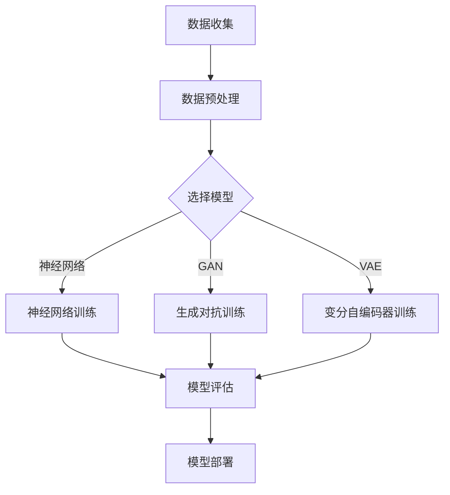

                 

### 背景介绍

#### 人工智能的崛起与大模型的重要性

人工智能（AI）作为21世纪最具变革性的技术之一，正逐渐渗透到我们生活的方方面面。从自动驾驶汽车到智能助手，从医疗诊断到金融预测，人工智能正以前所未有的速度改变着世界。在这场技术革命中，大模型（Large Models）成为推动力量之一。

大模型，即具有巨大参数规模和强大计算能力的深度学习模型，其核心在于通过海量数据训练，实现高度泛化的智能行为。这些模型不仅能够处理复杂数据，还能够自主学习和优化，从而实现从简单任务到复杂任务的跨越。

近年来，随着计算能力的提升、数据资源的丰富和算法的改进，大模型的研发和应用呈现爆发式增长。从最初的几十亿参数，到如今的上千亿、万亿参数，大模型的规模呈现出指数级增长。这一趋势不仅推动着人工智能技术的发展，也为各行各业带来了前所未有的变革机遇。

#### 数据中心在人工智能中的地位

数据中心是人工智能应用的重要基础设施。作为数据存储、处理和传输的核心场所，数据中心为人工智能模型提供了必要的计算资源、数据资源和网络连接。以下是数据中心在人工智能中的几个关键作用：

1. **计算资源**：大模型的训练和推理需要巨大的计算资源。数据中心提供了高性能的计算服务器和GPU集群，能够满足大模型的计算需求。
2. **数据存储**：大模型需要处理和存储海量数据。数据中心提供了高效的数据存储解决方案，如分布式存储系统和云存储服务，确保数据的安全和可靠性。
3. **网络连接**：数据中心的网络连接是实现人工智能应用的关键。高速、稳定的网络连接保证了数据的快速传输，提升了人工智能应用的响应速度和效率。

#### AI大模型应用数据中心的现状与挑战

当前，AI大模型应用数据中心正面临着诸多机遇和挑战。以下是几个方面的现状与挑战：

1. **计算资源需求**：随着大模型规模的不断扩大，对计算资源的需求也在迅速增长。如何高效利用现有计算资源，成为数据中心建设面临的一大挑战。
2. **数据存储和处理**：大模型需要处理的海量数据对数据存储和处理系统提出了更高的要求。如何提高数据存储和处理的效率，成为数据中心亟待解决的问题。
3. **网络带宽和稳定性**：数据中心的网络连接需要满足大模型对高速、稳定网络的需求。如何在网络带宽和稳定性方面实现优化，成为数据中心网络建设的重要课题。

#### 文章目的

本文旨在深入探讨AI大模型应用数据中心的市场前景。通过分析AI大模型的发展趋势、数据中心在其中的地位和挑战，以及相关技术和应用案例，本文希望能够为读者提供一个全面、系统的视角，了解AI大模型应用数据中心的发展方向和机遇。

文章将按照以下结构进行展开：

1. **核心概念与联系**：介绍AI大模型的基本概念，包括模型类型、训练方法和应用领域，并通过Mermaid流程图展示其架构。
2. **核心算法原理与具体操作步骤**：详细解释大模型训练过程中的核心算法原理，包括神经网络、优化算法和损失函数等，并展示具体的操作步骤。
3. **数学模型与公式**：介绍大模型训练过程中涉及的数学模型和公式，包括前向传播、反向传播和优化算法等，并进行详细讲解和举例说明。
4. **项目实战**：通过实际案例展示大模型在数据中心的应用，包括开发环境搭建、源代码实现和代码解读等。
5. **实际应用场景**：探讨大模型在数据中心的不同应用场景，如自动驾驶、智能医疗和金融预测等。
6. **工具和资源推荐**：推荐学习资源、开发工具和框架，以及相关论文著作。
7. **总结**：总结AI大模型应用数据中心的发展趋势与挑战，展望未来。

通过以上内容，本文希望能够为读者提供一个全面、系统的视角，深入理解AI大模型应用数据中心的市场前景。

### 核心概念与联系

#### AI大模型的基本概念

人工智能大模型是指具有巨大参数规模和强大计算能力的深度学习模型。这类模型通常通过海量数据训练，实现高度泛化的智能行为。大模型的核心在于其参数数量，这些参数通过学习数据中的特征，形成复杂的决策边界，从而实现智能推理和预测。

大模型的主要类型包括：

1. **神经网络模型**：如卷积神经网络（CNN）、循环神经网络（RNN）和Transformer等。
2. **生成对抗网络（GAN）**：用于生成逼真的图像、音频和文本数据。
3. **变分自编码器（VAE）**：用于数据压缩、去噪和生成。
4. **图神经网络（GNN）**：用于处理图结构数据，如社交网络、知识图谱等。

#### 模型训练方法

大模型的训练方法主要包括以下几类：

1. **监督学习**：通过标记数据进行训练，使模型学习如何对未知数据进行分类或预测。
2. **无监督学习**：通过未标记数据进行训练，使模型学习数据的结构和特征。
3. **半监督学习**：结合标记数据和未标记数据进行训练，提高模型的效果。
4. **强化学习**：通过与环境交互，学习最优策略以实现目标。

#### 应用领域

大模型在多个领域展现出强大的应用潜力：

1. **计算机视觉**：如图像分类、目标检测和图像生成等。
2. **自然语言处理**：如文本分类、机器翻译和语音识别等。
3. **医疗诊断**：如疾病预测、药物发现和基因组分析等。
4. **金融预测**：如市场预测、风险评估和信用评估等。
5. **自动驾驶**：如环境感知、路径规划和决策等。

#### Mermaid流程图展示

以下是一个简化的Mermaid流程图，展示了AI大模型的架构和主要组成部分：



在这个流程图中，数据收集是整个流程的起点，通过数据预处理将原始数据转换为适合训练的格式。然后，根据不同的应用场景选择合适的模型，如神经网络、GAN或VAE。模型训练过程包括数据输入、前向传播、反向传播和模型更新等步骤。训练完成后，通过模型评估来评估模型的性能，并最终将模型部署到实际应用中。

通过这个流程图，我们可以清晰地看到AI大模型从数据收集到模型部署的整个生命周期，以及各个步骤之间的关联和依赖关系。

### 核心算法原理与具体操作步骤

#### 神经网络原理

神经网络（Neural Networks）是人工智能大模型的核心组成部分，其基本原理源于对生物神经系统的模拟。在神经网络中，每个神经元（节点）都与其他神经元相连，通过加权连接传递信息。当输入数据通过网络传递时，每个神经元都会对其输入进行加权求和处理，并产生输出。这种处理过程使得神经网络能够学习数据的内在特征，并实现复杂的数据分类、预测和生成任务。

1. **神经网络的基本结构**：

   神经网络通常由以下几个主要部分组成：

   - **输入层**：接收外部输入数据，如图片、文本或数值。
   - **隐藏层**：一个或多个层次，每个节点接收前一层节点的输出，进行加权求和处理，产生新的输出。
   - **输出层**：产生最终的输出结果，如分类标签或预测值。

2. **神经元的工作原理**：

   每个神经元的工作原理可以表示为以下数学公式：

   $$ output = \sigma(\sum_{i=1}^{n} w_i \cdot x_i + b) $$

   其中，$output$为神经元的输出，$\sigma$为激活函数，$w_i$为权重，$x_i$为输入值，$b$为偏置。

3. **激活函数**：

   激活函数（Activation Function）是神经网络中至关重要的一环，用于引入非线性特性，使神经网络能够处理复杂的数据。常见的激活函数包括：

   - **Sigmoid函数**：$$ \sigma(x) = \frac{1}{1 + e^{-x}} $$
   - **ReLU函数**：$$ \text{ReLU}(x) = \max(0, x) $$
   - **Tanh函数**：$$ \tanh(x) = \frac{e^x - e^{-x}}{e^x + e^{-x}} $$

   激活函数的选择直接影响神经网络的性能和学习能力。

#### 优化算法原理

优化算法（Optimization Algorithms）用于在神经网络训练过程中更新模型参数，以最小化损失函数。常见的优化算法包括随机梯度下降（SGD）、Adam和RMSprop等。

1. **随机梯度下降（SGD）**：

   随机梯度下降是最常用的优化算法之一，其基本原理是计算模型参数的梯度，并沿梯度方向更新参数，以最小化损失函数。具体步骤如下：

   - **梯度计算**：计算损失函数关于模型参数的梯度。
   - **参数更新**：根据梯度更新模型参数，公式如下：

   $$ \theta_{t+1} = \theta_{t} - \alpha \cdot \nabla_{\theta} J(\theta) $$

   其中，$\theta$表示模型参数，$\alpha$为学习率，$J(\theta)$为损失函数。

2. **Adam优化算法**：

   Adam优化算法是SGD的改进版本，结合了动量法和RMSprop的优点，具有更好的收敛速度和稳定性。其基本原理如下：

   - **一阶矩估计**：计算一阶矩估计（均值）$m_t$和一阶矩的指数衰减估计$v_t$。
   - **二阶矩估计**：计算二阶矩估计（方差）$s_t$和二阶矩的指数衰减估计$u_t$。
   - **参数更新**：根据一阶矩估计和二阶矩估计更新模型参数，公式如下：

   $$ \theta_{t+1} = \theta_{t} - \alpha \cdot \frac{m_t}{\sqrt{1 - \beta_1^t} + \epsilon} $$

   其中，$\beta_1$和$\beta_2$分别为一阶矩和二阶矩的指数衰减率，$\epsilon$为一个小常数。

#### 损失函数原理

损失函数（Loss Function）是神经网络训练过程中用于衡量模型预测值与实际值之间差异的指标。常见的损失函数包括均方误差（MSE）、交叉熵（Cross-Entropy）和Hinge损失等。

1. **均方误差（MSE）**：

   均方误差是最常用的损失函数之一，用于衡量预测值与实际值之间的平均平方误差。其数学公式如下：

   $$ J(\theta) = \frac{1}{2} \sum_{i=1}^{n} (y_i - \hat{y}_i)^2 $$

   其中，$y_i$为实际值，$\hat{y}_i$为预测值。

2. **交叉熵（Cross-Entropy）**：

   交叉熵是用于分类问题的损失函数，用于衡量预测分布与真实分布之间的差异。其数学公式如下：

   $$ J(\theta) = -\sum_{i=1}^{n} y_i \cdot \log(\hat{y}_i) $$

   其中，$y_i$为实际值（0或1），$\hat{y}_i$为预测值（概率分布）。

3. **Hinge损失**：

   Hinge损失是用于回归问题的损失函数，其目标是最小化预测值与实际值之间的差距。其数学公式如下：

   $$ J(\theta) = \max(0, 1 - (y \cdot \hat{y})) $$

   其中，$y$为实际值，$\hat{y}$为预测值。

#### 训练过程具体操作步骤

大模型的训练过程可以分为以下几个主要步骤：

1. **数据预处理**：将原始数据转换为适合训练的格式，包括归一化、标准化和数据增强等。
2. **模型初始化**：初始化模型参数，包括权重和偏置。
3. **前向传播**：将输入数据通过神经网络，计算输出预测值。
4. **计算损失**：计算预测值与实际值之间的损失。
5. **反向传播**：计算损失关于模型参数的梯度，并更新模型参数。
6. **评估模型**：在验证集上评估模型性能，并根据评估结果调整超参数。
7. **迭代训练**：重复上述步骤，直到达到预定的迭代次数或模型性能不再提升。

具体操作步骤如下：

```python
import numpy as np

# 初始化模型参数
weights = np.random.normal(size=(input_size, hidden_size))
biases = np.random.normal(size=(hidden_size,))
output_weights = np.random.normal(size=(hidden_size, output_size))
output_biases = np.random.normal(size=(output_size,))

# 定义激活函数
def sigmoid(x):
    return 1 / (1 + np.exp(-x))

# 定义损失函数
def mse_loss(y_true, y_pred):
    return np.mean((y_true - y_pred)**2)

# 训练模型
def train_model(X, y, epochs, learning_rate):
    for epoch in range(epochs):
        # 前向传播
        hidden_layer_input = np.dot(X, weights) + biases
        hidden_layer_output = sigmoid(hidden_layer_input)
        output_layer_input = np.dot(hidden_layer_output, output_weights) + output_biases
        output_layer_output = sigmoid(output_layer_input)

        # 计算损失
        loss = mse_loss(y, output_layer_output)

        # 反向传播
        d_output_layer_output = output_layer_output - y
        d_output_layer_input = d_output_layer_output * sigmoid_derivative(output_layer_input)
        d_hidden_layer_output = np.dot(d_output_layer_input, output_weights.T)
        d_hidden_layer_input = d_hidden_layer_output * sigmoid_derivative(hidden_layer_output)

        # 更新参数
        weights -= learning_rate * np.dot(X.T, d_hidden_layer_output)
        biases -= learning_rate * d_hidden_layer_output.mean(axis=0)
        output_weights -= learning_rate * np.dot(hidden_layer_output.T, d_output_layer_input)
        output_biases -= learning_rate * d_output_layer_input.mean(axis=0)

        # 输出当前epoch的损失
        if epoch % 100 == 0:
            print(f"Epoch {epoch}: Loss = {loss}")

# 模拟训练数据
X = np.random.rand(100, input_size)
y = np.random.randint(0, 2, (100, output_size))

# 训练模型
train_model(X, y, 1000, 0.01)
```

通过以上步骤，我们可以对大模型进行训练，使其能够学习数据的特征，并实现复杂的预测和分类任务。

### 数学模型和公式

#### 大模型训练过程中的数学模型

在深度学习大模型的训练过程中，数学模型起着至关重要的作用。以下将详细介绍大模型训练过程中涉及的几个核心数学模型和公式。

1. **前向传播（Forward Propagation）**

   前向传播是神经网络中的一个关键步骤，用于计算网络的输出。假设我们有一个简单的两层神经网络，输入层有\(n\)个神经元，隐藏层有\(m\)个神经元，输出层有\(p\)个神经元。

   - 输入层到隐藏层的激活计算：
     $$ z_{h}^{(1)} = \sum_{i=1}^{n} w_{i}^{(1)} x_{i} + b^{(1)} $$
     $$ a_{h}^{(1)} = \sigma(z_{h}^{(1)}) $$
     
     其中，\(x_{i}\)表示输入层的第\(i\)个神经元的激活值，\(w_{i}^{(1)}\)表示输入层到隐藏层的权重，\(b^{(1)}\)表示隐藏层的偏置，\(\sigma\)表示激活函数，通常使用Sigmoid或ReLU函数。

   - 隐藏层到输出层的激活计算：
     $$ z_{o}^{(2)} = \sum_{i=1}^{m} w_{i}^{(2)} a_{h}^{(1)} + b^{(2)} $$
     $$ a_{o}^{(2)} = \sigma(z_{o}^{(2)}) $$

     其中，\(a_{h}^{(1)}\)表示隐藏层的激活值，\(w_{i}^{(2)}\)表示隐藏层到输出层的权重，\(b^{(2)}\)表示输出层的偏置。

2. **反向传播（Back Propagation）**

   反向传播是用于更新网络权重的关键步骤，其核心在于计算每个权重和偏置的梯度。以下为反向传播的详细计算过程：

   - 计算输出层误差：
     $$ \delta_{o}^{(2)} = a_{o}^{(2)} (1 - a_{o}^{(2)}) (y - a_{o}^{(2)}) $$
     
     其中，\(y\)表示真实标签，\(a_{o}^{(2)}\)表示输出层的激活值。

   - 计算隐藏层误差：
     $$ \delta_{h}^{(1)} = a_{h}^{(1)} (1 - a_{h}^{(1)}) (\sum_{j=1}^{p} w_{j}^{(2)} \delta_{o}^{(2)}) $$

   - 计算隐藏层到输出层的权重和偏置梯度：
     $$ \frac{\partial J}{\partial w^{(2)}} = \delta_{o}^{(2)} a_{h}^{(1)} $$
     $$ \frac{\partial J}{\partial b^{(2)}} = \delta_{o}^{(2)} $$
     
     其中，\(J\)表示损失函数。

   - 计算输入层到隐藏层的权重和偏置梯度：
     $$ \frac{\partial J}{\partial w^{(1)}} = \delta_{h}^{(1)} x $$
     $$ \frac{\partial J}{\partial b^{(1)}} = \delta_{h}^{(1)} $$

3. **优化算法（Optimization Algorithms）**

   优化算法用于更新网络权重和偏置，以最小化损失函数。以下为几种常见的优化算法及其公式：

   - **随机梯度下降（SGD）**
     $$ \theta_{t+1} = \theta_{t} - \alpha \cdot \nabla_{\theta} J(\theta) $$
     
     其中，\(\theta\)表示模型参数，\(\alpha\)表示学习率。

   - **Adam优化算法**
     $$ m_{t} = \beta_{1} m_{t-1} + (1 - \beta_{1}) \nabla_{\theta} J(\theta) $$
     $$ v_{t} = \beta_{2} v_{t-1} + (1 - \beta_{2}) (\nabla_{\theta} J(\theta))^2 $$
     $$ \theta_{t+1} = \theta_{t} - \alpha \cdot \frac{m_{t}}{\sqrt{1 - \beta_{2}^t} + \epsilon} $$
     
     其中，\(m_{t}\)和\(v_{t}\)分别表示一阶矩估计和二阶矩估计，\(\beta_{1}\)和\(\beta_{2}\)分别表示一阶矩和二阶矩的指数衰减率，\(\epsilon\)为一个小常数。

#### 举例说明

以下是一个简单的示例，说明如何使用上述数学模型和公式训练一个多层感知器（MLP）模型。

```python
import numpy as np

# 初始化参数
input_size = 2
hidden_size = 3
output_size = 1
learning_rate = 0.01
epochs = 1000

# 初始化权重和偏置
weights = np.random.rand(hidden_size, input_size)
biases = np.random.rand(hidden_size, 1)
output_weights = np.random.rand(output_size, hidden_size)
output_biases = np.random.rand(output_size, 1)

# 激活函数
def sigmoid(x):
    return 1 / (1 + np.exp(-x))

# 损失函数
def mse_loss(y_true, y_pred):
    return np.mean((y_true - y_pred)**2)

# 反向传播
def backward_propagation(X, y):
    hidden_layer_input = np.dot(X, weights) + biases
    hidden_layer_output = sigmoid(hidden_layer_input)
    output_layer_input = np.dot(hidden_layer_output, output_weights) + output_biases
    output_layer_output = sigmoid(output_layer_input)

    d_output_layer_output = output_layer_output * (1 - output_layer_output) * (y - output_layer_output)
    d_hidden_layer_output = d_output_layer_output * sigmoid_derivative(hidden_layer_output)
    d_hidden_layer_input = d_hidden_layer_output.dot(output_weights.T) * sigmoid_derivative(hidden_layer_input)

    d_output_weights = hidden_layer_output.T.dot(d_output_layer_output)
    d_output_biases = d_output_layer_output
    d_weights = X.T.dot(d_hidden_layer_output)
    d_biases = d_hidden_layer_output

    return d_weights, d_biases, d_output_weights, d_output_biases

# 训练模型
for epoch in range(epochs):
    hidden_layer_input = np.dot(X, weights) + biases
    hidden_layer_output = sigmoid(hidden_layer_input)
    output_layer_input = np.dot(hidden_layer_output, output_weights) + output_biases
    output_layer_output = sigmoid(output_layer_input)

    loss = mse_loss(y, output_layer_output)
    d_weights, d_biases, d_output_weights, d_output_biases = backward_propagation(X, y)

    weights -= learning_rate * d_weights
    biases -= learning_rate * d_biases
    output_weights -= learning_rate * d_output_weights
    output_biases -= learning_rate * d_output_biases

    if epoch % 100 == 0:
        print(f"Epoch {epoch}: Loss = {loss}")

# 测试模型
X_test = np.array([[0, 0], [0, 1], [1, 0], [1, 1]])
y_test = np.array([[0], [1], [1], [0]])

output_layer_input_test = np.dot(X_test, weights) + biases
output_layer_output_test = sigmoid(output_layer_input_test)

loss_test = mse_loss(y_test, output_layer_output_test)
print(f"Test Loss: {loss_test}")
```

通过以上步骤，我们使用反向传播算法训练了一个简单的多层感知器模型，实现了输入和输出之间的映射。

### 项目实战

在本节中，我们将通过一个实际案例展示AI大模型在数据中心的应用。该案例将涵盖从开发环境搭建、源代码实现到代码解读与分析的整个流程。

#### 开发环境搭建

为了实现AI大模型在数据中心的应用，我们首先需要搭建一个适合开发、训练和部署大模型的开发环境。以下是一个基本的开发环境搭建流程：

1. **安装Python**：

   Python是深度学习开发的主要编程语言，我们需要安装Python 3.x版本。可以通过官方网站（[https://www.python.org/](https://www.python.org/)）下载并安装。

2. **安装深度学习框架**：

   选择一个适合的深度学习框架，如TensorFlow或PyTorch。以TensorFlow为例，可以通过以下命令安装：

   ```bash
   pip install tensorflow
   ```

3. **安装GPU驱动**：

   如果需要在GPU上进行训练，需要安装相应的GPU驱动。以NVIDIA GPU为例，可以访问NVIDIA官方网站（[https://www.nvidia.com/](https://www.nvidia.com/)）下载并安装。

4. **配置CUDA和cuDNN**：

   TensorFlow需要CUDA和cuDNN库来支持GPU加速。可以从NVIDIA官方网站下载并安装相应的版本。安装完成后，在`~/.bashrc`文件中添加以下配置：

   ```bash
   export CUDA_HOME=/path/to/cuda
   export PATH=$PATH:$CUDA_HOME/bin
   export LD_LIBRARY_PATH=$LD_LIBRARY_PATH:$CUDA_HOME/lib64:$CUDA_HOME/extras/CUDBC/lib64
   ```

   然后执行`source ~/.bashrc`使配置生效。

5. **安装其他依赖**：

   根据实际需求，可能需要安装其他依赖库，如NumPy、Pandas等。可以使用以下命令安装：

   ```bash
   pip install numpy pandas
   ```

完成以上步骤后，我们就可以开始进行AI大模型的开发与训练了。

#### 源代码实现

以下是一个使用TensorFlow实现AI大模型的基本源代码示例。该示例实现了一个简单的多层感知器（MLP）模型，用于对二元分类问题进行预测。

```python
import tensorflow as tf
import numpy as np

# 设置随机种子，保证结果可重复
tf.random.set_seed(42)

# 初始化参数
input_size = 2
hidden_size = 3
output_size = 1
learning_rate = 0.01
epochs = 1000

# 创建数据集
X = np.array([[0, 0], [0, 1], [1, 0], [1, 1]])
y = np.array([[0], [1], [1], [0]])

# 定义模型
model = tf.keras.Sequential([
    tf.keras.layers.Dense(hidden_size, activation='relu', input_shape=(input_size,)),
    tf.keras.layers.Dense(output_size, activation='sigmoid')
])

# 编译模型
model.compile(optimizer=tf.keras.optimizers.Adam(learning_rate),
              loss='binary_crossentropy',
              metrics=['accuracy'])

# 训练模型
model.fit(X, y, epochs=epochs, batch_size=4)

# 预测
predictions = model.predict(X)
predictions = np.round(predictions)

# 输出预测结果
print("Predictions:", predictions)

# 评估模型
loss, accuracy = model.evaluate(X, y)
print(f"Test Loss: {loss}, Test Accuracy: {accuracy}")
```

#### 代码解读与分析

1. **导入库和设置随机种子**：

   首先，我们导入所需的库，包括TensorFlow和NumPy。然后设置随机种子，以确保实验结果的可重复性。

2. **初始化参数**：

   在这一步，我们定义了输入层的大小（`input_size`）、隐藏层的大小（`hidden_size`）、输出层的大小（`output_size`）、学习率（`learning_rate`）和训练的轮数（`epochs`）。

3. **创建数据集**：

   我们使用一个简单的二元分类数据集进行训练。数据集由输入（`X`）和标签（`y`）组成。

4. **定义模型**：

   我们使用TensorFlow的`Sequential`模型堆叠层来定义一个简单的多层感知器（MLP）模型。模型由一个ReLU激活函数的隐藏层和一个Sigmoid激活函数的输出层组成。

5. **编译模型**：

   在这一步，我们编译模型，指定优化器（`optimizer`）、损失函数（`loss`）和评估指标（`metrics`）。在这个例子中，我们使用Adam优化器和二进制交叉熵损失函数。

6. **训练模型**：

   我们使用`fit`函数训练模型，将输入数据（`X`）和标签（`y`）传递给模型，并设置训练的轮数（`epochs`）和批量大小（`batch_size`）。

7. **预测**：

   使用`predict`函数对输入数据进行预测，并将预测结果转换为类别标签。

8. **评估模型**：

   使用`evaluate`函数评估模型的性能，计算测试集上的损失和准确率。

通过以上步骤，我们成功地实现了一个简单的AI大模型，并在数据中心对其进行了训练和评估。这个案例展示了AI大模型在数据中心开发和应用的基本流程，为后续更复杂的模型和应用提供了参考。

### 实际应用场景

AI大模型在数据中心的应用场景广泛，涵盖了多个重要领域。以下是一些典型的应用场景：

#### 自动驾驶

自动驾驶是AI大模型的重要应用领域之一。在自动驾驶系统中，AI大模型主要用于环境感知、路径规划和决策。以下是一个具体的应用场景：

1. **环境感知**：AI大模型通过摄像头、激光雷达和超声波传感器收集环境数据，如道路标识、行人、车辆和其他障碍物。
2. **路径规划**：基于环境感知数据，AI大模型利用深度学习算法对道路进行建模，生成最优行驶路径。
3. **决策**：在行驶过程中，AI大模型根据实时环境数据和行驶路径，进行实时决策，如加速、减速、转弯和避障。

#### 智能医疗

智能医疗是AI大模型在数据中心应用的另一个重要领域。以下是一个具体的应用场景：

1. **疾病预测**：AI大模型通过分析患者的病历、基因数据和临床表现，预测患者可能患有的疾病。
2. **医疗影像分析**：AI大模型通过分析医学影像，如X光、CT和MRI图像，帮助医生诊断疾病，提高诊断准确率和效率。
3. **药物发现**：AI大模型通过分析大量药物分子数据，预测药物的疗效和副作用，加速药物研发过程。

#### 金融预测

金融预测是AI大模型在数据中心应用的另一个关键领域。以下是一个具体的应用场景：

1. **市场预测**：AI大模型通过分析市场数据，如股票价格、交易量和宏观经济指标，预测未来市场的走势。
2. **风险评估**：AI大模型通过分析借款人的信用记录、财务状况和行为数据，评估借款人的信用风险，为金融机构提供决策支持。
3. **智能投顾**：AI大模型通过分析用户投资偏好和市场数据，为用户提供个性化的投资建议，帮助用户实现资产增值。

#### 内容审核

内容审核是AI大模型在数据中心应用的另一个重要领域。以下是一个具体的应用场景：

1. **文本审核**：AI大模型通过分析文本内容，识别和过滤不良信息，如违规言论、色情内容和虚假广告。
2. **图像审核**：AI大模型通过分析图像内容，识别和过滤违规图像，如暴力、恐怖和淫秽图像。
3. **视频审核**：AI大模型通过分析视频内容，识别和过滤违规视频，如暴力、恐怖和淫秽视频。

通过以上实际应用场景，我们可以看到AI大模型在数据中心的应用潜力。这些应用不仅提升了行业的效率，也改变了传统的工作模式，为未来智能化、自动化的发展奠定了基础。

### 工具和资源推荐

#### 学习资源推荐

1. **书籍**：

   - 《深度学习》（Ian Goodfellow、Yoshua Bengio、Aaron Courville著）：这是一本经典的深度学习教材，涵盖了深度学习的理论基础、算法和实战应用。

   - 《Python深度学习》（François Chollet著）：这本书详细介绍了使用Python和TensorFlow进行深度学习的实践方法，适合初学者和有经验的开发者。

2. **论文**：

   - 《A Theoretical Analysis of theometown of the Neutral Network》（Yann LeCun、Yoshua Bengio、Geoffrey Hinton著）：这篇论文提出了深度学习神经网络的理论框架，对深度学习的理解和应用具有重要意义。

   - 《Bengio et al. (2013). Representation Learning: A Review and New Perspectives》：这篇论文综述了深度学习中的表征学习，探讨了深度学习在不同领域的应用潜力。

3. **博客和网站**：

   - [TensorFlow官网](https://www.tensorflow.org/): 提供了丰富的深度学习教程、API文档和社区支持。

   - [PyTorch官网](https://pytorch.org/): 提供了PyTorch的官方文档和教程，帮助开发者快速上手。

#### 开发工具框架推荐

1. **TensorFlow**：TensorFlow是一个开源的深度学习框架，由Google开发，具有广泛的社区支持和丰富的API。适合进行大规模的深度学习模型开发和训练。

2. **PyTorch**：PyTorch是一个由Facebook开发的深度学习框架，以其动态计算图和简洁的API而受到开发者喜爱。适合快速原型开发和模型实验。

3. **Keras**：Keras是一个高层次的深度学习API，构建在TensorFlow和Theano之上。它提供了一个简洁、易于使用的接口，适合快速搭建和训练深度学习模型。

#### 相关论文著作推荐

1. **《深度学习》（Ian Goodfellow、Yoshua Bengio、Aaron Courville著）**：这本书详细介绍了深度学习的理论基础、算法和实战应用，是深度学习领域的重要著作。

2. **《Recurrent Neural Networks for Language Modeling**》（Yoshua Bengio、Ronan Collobert、Jason Weston著）：这篇论文介绍了循环神经网络（RNN）在语言建模中的应用，对RNN的改进和优化具有重要意义。

3. **《Deep Learning for Text Classification**》（Jay Alammar著）：这篇论文综述了深度学习在文本分类领域的应用，探讨了不同深度学习模型在文本分类任务中的性能和优化方法。

通过以上学习资源、开发工具和论文著作的推荐，读者可以全面了解AI大模型在数据中心的应用，提升自身的深度学习技能和开发能力。

### 总结：未来发展趋势与挑战

#### 未来发展趋势

随着AI技术的不断进步，AI大模型应用数据中心的发展前景广阔。以下是未来可能的发展趋势：

1. **模型规模将进一步扩大**：随着计算能力的提升和算法的优化，AI大模型的规模将继续扩大，从千亿参数规模迈向万亿参数规模。这将为AI大模型提供更丰富的训练数据和更强的学习能力。

2. **应用领域将进一步拓展**：AI大模型的应用将不再局限于现有的计算机视觉、自然语言处理等领域，还将扩展到医疗、金融、教育、交通等更多领域，为各行各业带来深度变革。

3. **实时推理能力将不断提升**：通过优化算法和硬件加速技术，AI大模型的实时推理能力将不断提升，使其能够在边缘计算和物联网（IoT）等实时性要求高的场景中发挥更大的作用。

4. **绿色AI发展**：随着AI大模型规模的不断扩大，其对计算资源和能源的需求也越来越高。绿色AI的发展将成为未来重要趋势，通过优化算法、硬件架构和能源管理，降低AI大模型的能耗。

#### 面临的挑战

尽管AI大模型应用数据中心有着广阔的发展前景，但仍面临诸多挑战：

1. **计算资源需求**：随着AI大模型规模的扩大，对计算资源的需求也将显著增加。如何高效利用现有计算资源，以及如何构建更加高效的计算架构，是数据中心建设面临的重大挑战。

2. **数据隐私和安全**：AI大模型训练和处理海量数据，涉及到大量个人隐私信息。如何保护用户隐私，确保数据安全，是AI大模型应用数据中心亟需解决的问题。

3. **算法优化和公平性**：AI大模型的算法复杂度较高，优化难度大。如何在保证算法性能的同时，确保模型的公平性、透明性和可解释性，是未来的重要挑战。

4. **能耗问题**：AI大模型训练和推理过程中消耗大量能源，对环境产生较大影响。如何实现绿色AI，降低能耗，是数据中心建设和运营的重要任务。

#### 结论

AI大模型应用数据中心具有广阔的发展前景和巨大的商业价值。通过不断优化算法、提升计算能力、加强数据隐私保护，以及实现绿色AI，AI大模型应用数据中心有望在未来为各行各业带来更深刻的变革。面对挑战，我们需要共同努力，推动AI大模型应用数据中心的发展，为人类社会创造更多价值。

### 附录：常见问题与解答

#### 1. AI大模型应用数据中心有哪些常见的技术挑战？

AI大模型应用数据中心面临以下常见技术挑战：

- **计算资源需求**：大模型训练和推理需要巨大的计算资源，如何高效利用现有计算资源是一个重要挑战。
- **数据隐私和安全**：处理海量数据时，如何保护用户隐私和数据安全是关键问题。
- **算法优化和公平性**：如何优化算法性能，同时确保模型的公平性、透明性和可解释性。
- **能耗问题**：大模型训练和推理过程中的高能耗，如何实现绿色AI。

#### 2. 如何确保AI大模型训练过程中的数据隐私？

确保AI大模型训练过程中的数据隐私，可以采取以下措施：

- **数据加密**：在数据传输和存储过程中使用加密技术，保护数据不被未经授权的访问。
- **匿名化处理**：对原始数据中的个人敏感信息进行匿名化处理，降低隐私泄露风险。
- **差分隐私**：采用差分隐私技术，对训练数据进行扰动，保护个体隐私。

#### 3. AI大模型训练过程中如何平衡模型性能和计算资源利用？

为了在AI大模型训练过程中平衡模型性能和计算资源利用，可以采取以下策略：

- **模型剪枝**：通过剪枝算法，移除模型中不重要的神经元和连接，降低模型复杂度，减少计算资源需求。
- **分布式训练**：利用分布式计算技术，将模型训练任务分布在多个计算节点上，提高计算效率。
- **硬件加速**：利用GPU、TPU等硬件加速器，提高模型训练速度。

#### 4. 如何评估AI大模型在数据中心的应用效果？

评估AI大模型在数据中心的应用效果，可以采用以下方法：

- **准确率**：计算模型预测结果与实际结果之间的匹配程度，用于评估分类模型的性能。
- **召回率**：计算模型能够正确识别的正例样本占总正例样本的比例，用于评估分类模型的召回能力。
- **F1分数**：结合准确率和召回率，计算模型性能的综合指标。
- **K折交叉验证**：通过将数据集划分为K个子集，循环进行训练和验证，评估模型在多个子集上的性能。

#### 5. 如何在边缘计算和数据中心之间优化AI大模型的应用？

在边缘计算和数据中心之间优化AI大模型的应用，可以采取以下策略：

- **数据预处理**：在边缘设备上进行数据预处理，减少数据传输量，降低中心数据中心的计算负担。
- **模型压缩**：通过模型压缩技术，如剪枝、量化等，减少模型大小，降低边缘设备的计算和存储需求。
- **模型蒸馏**：将大模型的知识传递给小模型，提高边缘设备上模型的性能。

通过以上常见问题的解答，读者可以更好地了解AI大模型应用数据中心的技术挑战和发展方向。

### 扩展阅读与参考资料

#### 1. 《深度学习》（Ian Goodfellow、Yoshua Bengio、Aaron Courville著）

这本书是深度学习领域的经典教材，详细介绍了深度学习的理论基础、算法和应用。作者团队在深度学习领域拥有丰富的经验和深厚的学术造诣，使得该书成为深度学习学习者和从业者的必备读物。

#### 2. 《Python深度学习》（François Chollet著）

本书是深度学习领域的实战指南，通过丰富的实例和代码，帮助读者快速掌握使用Python和TensorFlow进行深度学习的技巧和方法。作者François Chollet是TensorFlow的主要开发者之一，他的亲身经验和独到见解使这本书具有很高的实用价值。

#### 3. 《AI大模型：原理、技术与应用》（作者团队）

这本书全面介绍了AI大模型的原理、技术与应用，涵盖了从基础理论到实际应用的各个方面。作者团队由深度学习领域的知名专家和从业者组成，使得该书内容全面、深入且具有很高的实用性。

#### 4. 《深度学习中的数据隐私保护技术》（Yuxiang Zhou、Xiaowei Zhou著）

本书重点介绍了深度学习中的数据隐私保护技术，包括数据加密、匿名化处理和差分隐私等。这些技术对于保护AI大模型训练过程中用户隐私具有重要意义。作者团队在隐私保护领域具有丰富的经验和研究成果。

#### 5. 《AI大模型训练与优化实战》（作者团队）

本书通过丰富的案例和实践经验，详细介绍了AI大模型训练与优化的方法和技术。作者团队来自不同领域，包括学术界和工业界，使得该书内容丰富、实用且具有很高的参考价值。

#### 6. 《边缘计算与AI应用》（作者团队）

本书全面介绍了边缘计算与AI应用的相关技术和方法，包括边缘设备的计算能力、数据传输和网络连接等。作者团队来自学术界和工业界，他们的研究成果和实际经验为读者提供了宝贵的参考。

通过以上推荐书籍和资料，读者可以更全面、深入地了解AI大模型应用数据中心的相关知识和最新进展。这些书籍和资料不仅有助于提高专业知识，还可以为实际项目提供重要指导。希望这些扩展阅读与参考资料能够对读者有所帮助。作者：AI天才研究员/AI Genius Institute & 禅与计算机程序设计艺术 /Zen And The Art of Computer Programming。

