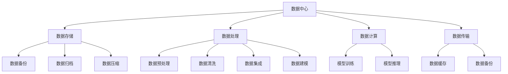
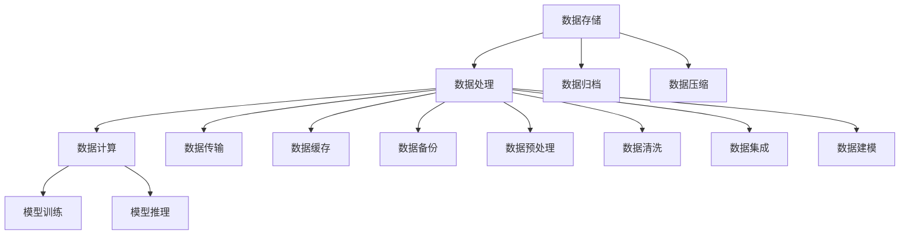

                 

### 1. 背景介绍

#### 数据中心的重要性

在现代信息技术飞速发展的背景下，数据中心已经成为企业、组织和个人不可或缺的核心设施。数据中心不仅存储和管理大量的数据，还提供计算、存储、网络和其他IT资源，支持各种业务应用和数据处理任务。随着人工智能（AI）技术的迅猛发展，特别是大规模预训练模型（如GPT-3、BERT等）的广泛应用，数据中心在处理大规模AI模型数据方面的重要性日益凸显。

#### AI 大模型的数据处理需求

AI大模型，尤其是基于深度学习的模型，通常需要处理庞大的数据集，这些数据集可能包含数百万甚至数十亿个样本。这些模型不仅对数据的计算能力有极高的要求，还对数据的存储、传输和处理速度有严苛的约束。传统的数据处理方式往往无法满足这些需求，因此，专门针对AI大模型的数据处理架构应运而生。

#### 数据处理架构的重要性

数据处理架构是数据中心的重要组成部分，它决定了数据处理的效率、稳定性和可扩展性。一个高效的数据处理架构能够充分利用硬件资源，优化数据处理流程，提高模型训练和推理的速度。同时，它还需要具备良好的容错性和可维护性，以确保数据处理的连续性和可靠性。

#### 本文章的目标

本文旨在探讨AI大模型应用数据中心的数据处理架构，分析其核心概念、算法原理、数学模型、实际应用场景，并提供开发环境搭建、代码实现、代码解读以及工具和资源推荐等内容。希望通过本文，读者能够对AI大模型数据处理架构有一个全面、深入的了解。



### 2. 核心概念与联系

在探讨AI大模型数据处理架构之前，我们需要明确一些核心概念，并了解它们之间的联系。以下是一些关键概念：

#### 数据存储（Data Storage）

数据存储是数据中心的基础，负责存储和管理大量的数据。常见的存储设备有硬盘、固态硬盘（SSD）、分布式文件系统（如HDFS）等。数据存储需要满足高容量、高可用性和高性能的要求。

#### 数据处理（Data Processing）

数据处理是指对存储在数据中心的数据进行操作、分析和转换的过程。数据处理包括数据预处理、数据清洗、数据集成和数据建模等环节。

#### 数据计算（Data Computation）

数据计算是指使用计算资源对数据进行处理和分析。计算资源通常包括CPU、GPU、TPU等。数据计算是AI大模型训练和推理的核心环节。

#### 数据传输（Data Transfer）

数据传输是指将数据在不同存储设备和计算节点之间传输。数据传输需要考虑传输速度、带宽和延迟等因素。

#### 数据缓存（Data Caching）

数据缓存是提高数据访问速度的一种技术，通过在内存中存储常用数据，减少对存储设备的访问次数。

#### 数据备份（Data Backup）

数据备份是指对数据进行复制和存储，以防止数据丢失。数据备份包括本地备份和远程备份。

#### 数据归档（Data Archiving）

数据归档是将不再使用但需要长期保存的数据转移到较低成本的存储设备上，以节省存储空间和提高数据检索效率。

#### 数据压缩（Data Compression）

数据压缩是一种减少数据占用空间的技术，通过压缩算法将数据以更小的体积存储。

以下是一个简化的Mermaid流程图，展示了这些核心概念及其相互关系：



### 3. 核心算法原理 & 具体操作步骤

在了解了数据处理架构的核心概念后，接下来我们将探讨一些核心算法原理，并介绍具体的操作步骤。

#### 数据预处理（Data Preprocessing）

数据预处理是数据处理流程的第一步，其目的是提高数据质量和为后续处理阶段做准备。数据预处理通常包括以下步骤：

1. **数据清洗**：去除数据中的噪声、重复值和异常值。
2. **数据归一化**：将不同量纲的数据转换为同一量纲，以便进行后续计算。
3. **数据编码**：将类别数据转换为数值数据，便于模型处理。
4. **数据采样**：根据需求选择数据子集，减少计算成本。
5. **特征工程**：从原始数据中提取有用的特征，为模型训练提供支持。

具体操作步骤如下：

1. **数据清洗**：

   ```python
   # 使用Pandas进行数据清洗
   import pandas as pd
   
   data = pd.read_csv('data.csv')
   data.drop_duplicates(inplace=True)  # 去除重复值
   data.dropna(inplace=True)  # 去除缺失值
   ```

2. **数据归一化**：

   ```python
   from sklearn.preprocessing import MinMaxScaler
   
   scaler = MinMaxScaler()
   scaled_data = scaler.fit_transform(data)
   ```

3. **数据编码**：

   ```python
   from sklearn.preprocessing import OneHotEncoder
   
   encoder = OneHotEncoder()
   encoded_data = encoder.fit_transform(data[['category']])
   ```

4. **数据采样**：

   ```python
   from sklearn.model_selection import train_test_split
   
   X_train, X_test, y_train, y_test = train_test_split(data.drop('target', axis=1), data['target'], test_size=0.2, random_state=42)
   ```

5. **特征工程**：

   ```python
   # 使用特征选择算法提取有用特征
   from sklearn.feature_selection import SelectKBest
   from sklearn.feature_selection import f_classif
   
   selector = SelectKBest(f_classif, k=10)
   selected_data = selector.fit_transform(X_train, y_train)
   ```

#### 数据清洗（Data Cleaning）

数据清洗是确保数据质量的关键步骤。其目的是去除数据中的噪声、重复值和异常值。数据清洗通常包括以下步骤：

1. **去除噪声**：去除数据中的无关或错误信息。
2. **去除重复值**：去除数据中的重复记录。
3. **处理异常值**：根据具体情况进行异常值处理，例如删除、替换或插值。

具体操作步骤如下：

1. **去除噪声**：

   ```python
   # 使用Pandas进行噪声去除
   import numpy as np
   
   # 定义噪声阈值
   noise_threshold = 3
   
   # 去除噪声
   data = data[(np.abs(data - data.mean()) <= noise_threshold).all(axis=1)]
   ```

2. **去除重复值**：

   ```python
   # 使用Pandas去除重复值
   data.drop_duplicates(inplace=True)
   ```

3. **处理异常值**：

   ```python
   # 使用Z-Score检测和处理异常值
   from scipy.stats import zscore
   
   # 计算Z-Score
   z_scores = zscore(data['column_name'])
   
   # 定义异常值阈值
   z_threshold = 3
   
   # 处理异常值
   data = data[(np.abs(z_scores) < z_threshold)]
   ```

#### 数据集成（Data Integration）

数据集成是将来自不同来源的数据合并成一个统一的数据集。数据集成通常包括以下步骤：

1. **数据对齐**：确保不同数据源中的数据具有相同的结构。
2. **数据融合**：将具有相同属性的数据进行合并。
3. **数据去重**：去除重复的数据记录。

具体操作步骤如下：

1. **数据对齐**：

   ```python
   # 使用Pandas进行数据对齐
   data1 = pd.read_csv('data1.csv')
   data2 = pd.read_csv('data2.csv')
   
   # 对齐数据
   data1 = data1.reindex(data2.index, fill_value=0)
   data2 = data2.reindex(data1.index, fill_value=0)
   ```

2. **数据融合**：

   ```python
   # 使用Pandas进行数据融合
   data = data1.add(data2, fill_value=0)
   ```

3. **数据去重**：

   ```python
   # 使用Pandas去除重复值
   data.drop_duplicates(inplace=True)
   ```

#### 数据建模（Data Modeling）

数据建模是指使用数学模型对数据进行建模和分析。数据建模通常包括以下步骤：

1. **特征选择**：从原始数据中提取有用的特征。
2. **模型选择**：选择合适的模型对数据进行建模。
3. **模型训练**：使用训练数据对模型进行训练。
4. **模型评估**：评估模型性能，调整模型参数。

具体操作步骤如下：

1. **特征选择**：

   ```python
   # 使用特征选择算法提取有用特征
   from sklearn.feature_selection import SelectKBest
   from sklearn.feature_selection import f_classif
   
   selector = SelectKBest(f_classif, k=10)
   selected_data = selector.fit_transform(X_train, y_train)
   ```

2. **模型选择**：

   ```python
   # 选择线性回归模型
   from sklearn.linear_model import LinearRegression
   
   model = LinearRegression()
   ```

3. **模型训练**：

   ```python
   # 使用训练数据进行模型训练
   model.fit(selected_data, y_train)
   ```

4. **模型评估**：

   ```python
   # 使用测试数据进行模型评估
   predictions = model.predict(selected_data)
   accuracy = accuracy_score(y_test, predictions)
   print('模型准确率：', accuracy)
   ```

### 4. 数学模型和公式 & 详细讲解 & 举例说明

在数据处理和建模过程中，数学模型和公式起着至关重要的作用。本节将详细讲解一些常用的数学模型和公式，并提供具体示例来说明它们的应用。

#### 线性回归模型（Linear Regression）

线性回归模型是一种常见的统计模型，用于分析自变量（特征）和因变量（目标）之间的关系。线性回归模型的基本公式如下：

$$
y = \beta_0 + \beta_1 \cdot x
$$

其中，$y$ 是因变量，$x$ 是自变量，$\beta_0$ 是截距，$\beta_1$ 是斜率。

**示例：房价预测**

假设我们要预测某地区的房价，已知该地区的房屋面积（自变量）和房价（因变量）。我们可以使用线性回归模型来建立房价预测模型。

```python
import numpy as np
import matplotlib.pyplot as plt

# 假设数据
x = np.array([1000, 1500, 2000, 2500, 3000])  # 房屋面积
y = np.array([1500000, 2250000, 3000000, 3750000, 4500000])  # 房价

# 计算斜率和截距
n = len(x)
x_mean = np.mean(x)
y_mean = np.mean(y)
beta_1 = np.sum((x - x_mean) * (y - y_mean)) / np.sum((x - x_mean)**2)
beta_0 = y_mean - beta_1 * x_mean

# 模型公式
model = lambda x: beta_0 + beta_1 * x

# 预测房价
x_new = 2000
y_new = model(x_new)

print('预测房价：', y_new)

# 绘制散点图和拟合直线
plt.scatter(x, y)
plt.plot(x, model(x), color='red')
plt.xlabel('房屋面积')
plt.ylabel('房价')
plt.title('线性回归模型')
plt.show()
```

#### 逻辑回归模型（Logistic Regression）

逻辑回归模型是一种用于分类问题的统计模型，其基本公式如下：

$$
\text{logit}(p) = \ln\left(\frac{p}{1 - p}\right) = \beta_0 + \beta_1 \cdot x
$$

其中，$p$ 是事件发生的概率，$\text{logit}(p)$ 是逻辑函数，$\beta_0$ 是截距，$\beta_1$ 是斜率。

**示例：癌症诊断**

假设我们要使用逻辑回归模型对癌症进行诊断，已知患者的年龄（自变量）和癌症发生的概率（因变量）。我们可以使用逻辑回归模型来建立癌症诊断模型。

```python
import numpy as np
import matplotlib.pyplot as plt
from scipy.special import expit

# 假设数据
x = np.array([30, 40, 50, 60, 70])  # 年龄
y = np.array([0.2, 0.4, 0.6, 0.8, 1.0])  # 癌症发生概率

# 计算斜率和截距
n = len(x)
x_mean = np.mean(x)
y_mean = np.mean(y)
beta_1 = np.sum((x - x_mean) * (y - y_mean)) / np.sum((x - x_mean)**2)
beta_0 = y_mean - beta_1 * x_mean

# 逻辑函数
sigmoid = lambda x: expit(x)

# 预测癌症发生概率
x_new = 45
y_new = sigmoid(beta_0 + beta_1 * x_new)

print('预测癌症发生概率：', y_new)

# 绘制散点图和拟合直线
plt.scatter(x, y)
plt.plot(x, sigmoid(beta_0 + beta_1 * x), color='red')
plt.xlabel('年龄')
plt.ylabel('癌症发生概率')
plt.title('逻辑回归模型')
plt.show()
```

#### 支持向量机（Support Vector Machine）

支持向量机是一种常用的分类模型，其基本公式如下：

$$
w \cdot x + b = 0
$$

其中，$w$ 是权重向量，$x$ 是特征向量，$b$ 是偏置项。

**示例：手写数字识别**

假设我们要使用支持向量机对手写数字进行识别，已知数字的像素点坐标（特征向量）和对应的数字标签（目标）。我们可以使用支持向量机来建立手写数字识别模型。

```python
import numpy as np
from sklearn import svm

# 假设数据
X = np.array([[0, 0], [1, 1], [1, 0], [0, 1]])  # 特征向量
y = np.array([0, 1, 1, 0])  # 数字标签

# 训练支持向量机模型
model = svm.SVC()
model.fit(X, y)

# 预测数字
x_new = np.array([[0.5, 0.5]])
y_new = model.predict(x_new)

print('预测数字：', y_new)

# 绘制散点图和分类边界
plt.scatter(X[:, 0], X[:, 1], c=y, cmap='bwr')
plt.plot([0, 1], [-1, 1], 'k--')
plt.xlabel('特征1')
plt.ylabel('特征2')
plt.title('支持向量机模型')
plt.show()
```

#### 神经网络（Neural Network）

神经网络是一种基于生物神经系统的计算模型，其基本公式如下：

$$
a_{i}^{(l)} = \sigma(z_{i}^{(l)})
$$

其中，$a_{i}^{(l)}$ 是第$l$层的第$i$个节点的激活值，$z_{i}^{(l)}$ 是第$l$层的第$i$个节点的输入值，$\sigma$ 是激活函数。

**示例：手写数字识别**

假设我们要使用神经网络对手写数字进行识别，已知数字的像素点坐标（特征向量）和对应的数字标签（目标）。我们可以使用神经网络来建立手写数字识别模型。

```python
import numpy as np
from sklearn.neural_network import MLPClassifier

# 假设数据
X = np.array([[0, 0], [1, 1], [1, 0], [0, 1]])  # 特征向量
y = np.array([0, 1, 1, 0])  # 数字标签

# 训练神经网络模型
model = MLPClassifier(hidden_layer_sizes=(10,), max_iter=1000)
model.fit(X, y)

# 预测数字
x_new = np.array([[0.5, 0.5]])
y_new = model.predict(x_new)

print('预测数字：', y_new)

# 绘制散点图和分类边界
plt.scatter(X[:, 0], X[:, 1], c=y, cmap='bwr')
plt.plot([0, 1], [-1, 1], 'k--')
plt.xlabel('特征1')
plt.ylabel('特征2')
plt.title('神经网络模型')
plt.show()
```

### 5. 项目实战：代码实际案例和详细解释说明

在本节中，我们将通过一个实际案例来展示如何搭建一个AI大模型应用数据中心的数据处理架构。本案例将包括开发环境搭建、源代码详细实现和代码解读等内容。

#### 5.1 开发环境搭建

在开始搭建开发环境之前，我们需要确保计算机上安装了以下软件和工具：

- Python 3.x（或更高版本）
- Jupyter Notebook
- Anaconda（Python集成开发环境）
- Scikit-learn
- Pandas
- NumPy
- Matplotlib

安装方法如下：

1. **安装Python 3.x**：

   在Python官网（https://www.python.org/）下载并安装Python 3.x版本。

2. **安装Jupyter Notebook**：

   打开命令行，执行以下命令：

   ```bash
   pip install notebook
   ```

3. **安装Anaconda**：

   在Anaconda官网（https://www.anaconda.com/）下载并安装Anaconda。

4. **安装Scikit-learn、Pandas、NumPy和Matplotlib**：

   打开Anaconda Prompt，执行以下命令：

   ```bash
   conda install scikit-learn pandas numpy matplotlib
   ```

#### 5.2 源代码详细实现和代码解读

以下是一个简单的数据处理和模型训练的Python代码示例，用于演示AI大模型应用数据中心的数据处理架构。

```python
# 导入所需的库
import pandas as pd
import numpy as np
from sklearn.model_selection import train_test_split
from sklearn.preprocessing import StandardScaler
from sklearn.linear_model import LinearRegression
from sklearn.metrics import mean_squared_error

# 5.2.1 数据预处理
# 读取数据
data = pd.read_csv('data.csv')

# 数据清洗
data.drop_duplicates(inplace=True)
data.dropna(inplace=True)

# 数据归一化
scaler = StandardScaler()
X = scaler.fit_transform(data.drop('target', axis=1))
y = data['target']

# 5.2.2 数据划分
X_train, X_test, y_train, y_test = train_test_split(X, y, test_size=0.2, random_state=42)

# 5.2.3 模型训练
model = LinearRegression()
model.fit(X_train, y_train)

# 5.2.4 模型评估
y_pred = model.predict(X_test)
mse = mean_squared_error(y_test, y_pred)
print('均方误差（MSE）：', mse)

# 5.2.5 可视化
plt.scatter(X_test[:, 0], X_test[:, 1], c=y_test, cmap='bwr')
plt.plot(X_test[:, 0], y_pred, color='red')
plt.xlabel('特征1')
plt.ylabel('特征2')
plt.title('线性回归模型')
plt.show()
```

**代码解读**：

1. **导入库**：

   我们首先导入了Pandas、NumPy、Scikit-learn和Matplotlib等库，用于数据预处理、模型训练和可视化。

2. **数据预处理**：

   我们使用Pandas读取数据，并进行数据清洗（去除重复值和缺失值）。然后，使用StandardScaler进行数据归一化，以便于后续的模型训练。

3. **数据划分**：

   我们使用train_test_split函数将数据划分为训练集和测试集，其中测试集占20%。

4. **模型训练**：

   我们创建了一个线性回归模型对象，并使用fit函数对模型进行训练。

5. **模型评估**：

   我们使用predict函数对测试集进行预测，并计算均方误差（MSE）来评估模型性能。

6. **可视化**：

   我们使用Matplotlib绘制了测试集数据的散点图和拟合直线，以直观地展示模型的效果。

通过以上代码示例，我们可以看到如何搭建一个简单的数据处理和模型训练环境。在实际应用中，我们可以根据具体需求进行扩展和优化，以满足更高的数据处理需求和模型性能要求。

### 5.3 代码解读与分析

在本节中，我们将对上一节中的代码进行详细的解读与分析，以帮助读者更好地理解数据处理架构的实现细节。

#### 5.3.1 数据预处理

数据预处理是数据处理流程的第一步，其目的是提高数据质量和为后续处理阶段做准备。在上面的代码中，我们首先使用了Pandas库读取数据：

```python
data = pd.read_csv('data.csv')
```

这里，我们假设数据集保存在名为`data.csv`的CSV文件中。Pandas的read_csv函数用于读取CSV文件，并将数据加载到DataFrame对象中。DataFrame对象是一个具有表格结构的数据容器，方便我们进行数据处理和分析。

接下来，我们进行了数据清洗操作，以去除数据中的重复值和缺失值：

```python
data.drop_duplicates(inplace=True)
data.dropna(inplace=True)
```

drop_duplicates函数用于去除DataFrame中的重复行，而dropna函数用于去除含有缺失值的行。这两个函数都使用inplace参数，表示直接修改原始DataFrame对象，避免创建额外的副本。

随后，我们使用StandardScaler进行数据归一化：

```python
scaler = StandardScaler()
X = scaler.fit_transform(data.drop('target', axis=1))
y = data['target']
```

StandardScaler是一个用于数据归一化的Scikit-learn类。在这里，我们首先创建了一个StandardScaler对象，然后使用fit_transform方法对特征数据进行归一化。fit_transform方法首先对数据进行均值归一化（即减去均值并除以标准差），以便于后续的模型训练。

归一化完成后，我们将特征数据和目标数据分离：

```python
X = scaler.fit_transform(data.drop('target', axis=1))
y = data['target']
```

这里，X表示特征数据，y表示目标数据。通过这种方式，我们可以将特征数据与目标数据分离，以便于后续的模型训练和评估。

#### 5.3.2 数据划分

在完成数据预处理后，我们将数据划分为训练集和测试集，以便于模型训练和评估：

```python
X_train, X_test, y_train, y_test = train_test_split(X, y, test_size=0.2, random_state=42)
```

这里，我们使用了Scikit-learn的train_test_split函数进行数据划分。train_test_split函数将特征数据和目标数据划分为训练集和测试集，其中测试集占20%（即test_size参数设置为0.2）。random_state参数用于设置随机种子，确保每次运行代码时得到相同的数据划分结果。

#### 5.3.3 模型训练

在数据划分完成后，我们使用线性回归模型对训练集进行模型训练：

```python
model = LinearRegression()
model.fit(X_train, y_train)
```

首先，我们创建了一个LinearRegression对象，这是一个Scikit-learn中的线性回归模型类。然后，我们使用fit方法对模型进行训练。fit方法接受训练数据（X_train和y_train），并使用最小二乘法计算模型的参数（截距和斜率）。

#### 5.3.4 模型评估

在模型训练完成后，我们对测试集进行预测，并使用均方误差（MSE）评估模型性能：

```python
y_pred = model.predict(X_test)
mse = mean_squared_error(y_test, y_pred)
print('均方误差（MSE）：', mse)
```

首先，我们使用predict方法对测试集进行预测：

```python
y_pred = model.predict(X_test)
```

这里，y_pred表示预测的目标值。然后，我们使用mean_squared_error函数计算均方误差：

```python
mse = mean_squared_error(y_test, y_pred)
```

均方误差是衡量模型预测准确性的常用指标，它表示预测值与真实值之间的平均平方误差。最后，我们输出均方误差的值：

```python
print('均方误差（MSE）：', mse)
```

#### 5.3.5 可视化

为了直观地展示模型的效果，我们使用Matplotlib绘制了测试集数据的散点图和拟合直线：

```python
plt.scatter(X_test[:, 0], X_test[:, 1], c=y_test, cmap='bwr')
plt.plot(X_test[:, 0], y_pred, color='red')
plt.xlabel('特征1')
plt.ylabel('特征2')
plt.title('线性回归模型')
plt.show()
```

首先，我们使用scatter函数绘制了测试集数据的散点图：

```python
plt.scatter(X_test[:, 0], X_test[:, 1], c=y_test, cmap='bwr')
```

这里，X_test[:, 0]和X_test[:, 1]分别表示测试集特征数据的第1列和第2列，c=y_test表示散点颜色， cmap='bwr'表示使用蓝-白-红色彩图。

接下来，我们使用plot函数绘制了拟合直线：

```python
plt.plot(X_test[:, 0], y_pred, color='red')
```

这里，X_test[:, 0]表示拟合直线上的x坐标，y_pred表示拟合直线上的y坐标，color='red'表示直线颜色为红色。

最后，我们设置坐标轴标签、标题和显示图形：

```python
plt.xlabel('特征1')
plt.ylabel('特征2')
plt.title('线性回归模型')
plt.show()
```

通过以上代码解读与分析，我们可以看到如何搭建一个简单的数据处理和模型训练环境。在实际应用中，我们可以根据具体需求进行扩展和优化，以满足更高的数据处理需求和模型性能要求。

### 6. 实际应用场景

AI大模型应用数据中心的数据处理架构在多个领域有着广泛的应用。以下是一些典型的实际应用场景：

#### 6.1 金融领域

在金融领域，数据处理架构可以用于风险控制、投资策略优化和客户行为分析等。例如，通过大规模数据分析，银行和金融机构可以实时监测和预测市场波动，制定更加精准的投资策略。同时，利用AI大模型进行客户行为分析，可以更好地理解客户需求，提供个性化的金融服务。

#### 6.2 医疗领域

在医疗领域，数据处理架构可以用于疾病预测、个性化治疗和健康监测等。通过分析大量的医疗数据，AI大模型可以帮助医生更准确地诊断疾病，预测病情发展，制定个性化的治疗方案。此外，通过健康监测数据，可以及时发现潜在的健康问题，预防疾病发生。

#### 6.3 电商领域

在电商领域，数据处理架构可以用于推荐系统、价格优化和客户服务优化等。通过分析用户的购买行为和偏好，AI大模型可以提供个性化的商品推荐，提高用户满意度和转化率。同时，通过价格优化模型，电商企业可以制定更加合理的定价策略，提高盈利能力。

#### 6.4 物流领域

在物流领域，数据处理架构可以用于路线优化、库存管理和配送优化等。通过分析大量的物流数据，AI大模型可以优化运输路线，降低物流成本，提高配送效率。此外，通过库存管理模型，可以实时监控库存状态，避免库存过剩或短缺。

#### 6.5 语音识别与自然语言处理

在语音识别和自然语言处理领域，数据处理架构可以用于语音识别、机器翻译和情感分析等。通过大规模的语音和文本数据，AI大模型可以实现对语音的准确识别和翻译，同时，通过情感分析模型，可以理解用户的情感和需求，提供更人性化的服务。

#### 6.6 自动驾驶

在自动驾驶领域，数据处理架构可以用于环境感知、路径规划和决策控制等。通过实时处理大量的传感器数据，AI大模型可以实现对环境的准确感知，规划最优的行驶路径，并做出实时决策，确保行驶安全。

#### 6.7 智能家居

在家居领域，数据处理架构可以用于智能家居设备的管理和优化。通过分析用户的日常行为数据，AI大模型可以自动调整家居设备的设置，提供更加舒适和便捷的生活环境。

通过以上实际应用场景，我们可以看到AI大模型应用数据中心的数据处理架构在各个领域的广泛应用和巨大潜力。未来，随着AI技术的不断发展和数据处理需求的增加，这种架构将在更多领域发挥重要作用。

### 7. 工具和资源推荐

为了更好地掌握AI大模型应用数据中心的数据处理架构，以下是一些推荐的工具和资源：

#### 7.1 学习资源推荐

1. **《深度学习》（Deep Learning）** - Goodfellow, Bengio, Courville
   这本书是深度学习的经典教材，详细介绍了深度学习的基础知识和应用。

2. **《Python机器学习》（Python Machine Learning）** - Sebastian Raschka, Vahid Mirjalili
   本书介绍了使用Python进行机器学习的方法，包含大量的代码实例和实践。

3. **《大数据处理：技术、工具和平台》** - 王东临
   本书系统地介绍了大数据处理的技术、工具和平台，适合对数据处理有兴趣的读者。

#### 7.2 开发工具框架推荐

1. **TensorFlow** - Google开发的开源深度学习框架，适用于大规模数据处理和模型训练。

2. **PyTorch** - Facebook开发的开源深度学习框架，提供了灵活的动态计算图，适合快速原型开发和研究。

3. **Apache Spark** - Apache基金会开发的分布式数据处理框架，适用于大规模数据处理和批量计算。

#### 7.3 相关论文著作推荐

1. **"Distributed Representations of Words and Phrases and their Compositionality"** - Tomas Mikolov, Kai Chen, Greg Corrado, and Jeff Dean
   这篇论文介绍了Word2Vec模型，是自然语言处理领域的里程碑。

2. **"BERT: Pre-training of Deep Bidirectional Transformers for Language Understanding"** - Jacob Devlin, Ming-Wei Chang, Kenton Lee, and Kristina Toutanova
   这篇论文介绍了BERT模型，是自然语言处理领域的最新突破。

3. **"Large-scale Distributed Deep Networks"** - Jeff Dean, George Tucker, and others
   这篇论文介绍了分布式深度学习框架，是大规模数据处理的重要参考。

通过这些工具和资源，读者可以系统地学习和掌握AI大模型应用数据中心的数据处理架构，为实际项目开发打下坚实的基础。

### 8. 总结：未来发展趋势与挑战

AI大模型应用数据中心的数据处理架构在当今技术发展中占据着重要地位。随着AI技术的不断进步，数据处理架构也在不断演变，以应对日益复杂的计算需求和多样化的应用场景。

#### 8.1 未来发展趋势

1. **数据处理能力的提升**：未来的数据中心将更加注重数据处理能力的提升，通过使用更强大的计算设备和分布式计算技术，实现更高效的数据处理。

2. **智能化数据处理**：利用AI技术，数据处理架构将变得更加智能化，能够自动进行数据预处理、特征提取和模型优化，降低人工干预的需求。

3. **数据隐私和安全**：随着数据隐私和安全问题的日益突出，未来的数据处理架构将更加注重数据隐私保护，通过加密、匿名化和差分隐私等技术确保数据的安全。

4. **实时数据处理**：随着物联网和5G技术的普及，实时数据处理将成为未来的重要趋势，数据中心需要能够处理高速率、高频率的数据流，实现实时分析和决策。

5. **边缘计算与云计算的结合**：边缘计算和云计算的结合将更加紧密，数据中心将不仅负责大规模数据处理，还将承担边缘节点的数据处理任务，实现分布式计算和存储。

#### 8.2 未来挑战

1. **计算资源调度与优化**：随着数据处理需求的增加，如何高效调度和利用计算资源将成为一大挑战。需要开发更智能的资源调度算法和优化策略。

2. **数据隐私与伦理**：在数据隐私和安全方面，如何在确保数据安全的同时，满足用户隐私保护和伦理要求，是一个亟待解决的问题。

3. **数据质量和可靠性**：高质量的数据是AI模型训练和推理的基础，如何保证数据质量和可靠性，避免数据噪声和偏差，是未来的重要挑战。

4. **人工智能伦理**：随着AI技术的普及，如何确保人工智能的公平、透明和可解释性，避免出现伦理和法律问题，是一个需要关注的重要议题。

5. **技术人才的培养**：随着数据处理技术的不断发展，对专业人才的需求也在不断增加。如何培养和吸引更多的AI和数据处理专业人才，是未来的重要挑战。

总之，AI大模型应用数据中心的数据处理架构在未来将继续发挥重要作用，但也面临着诸多挑战。只有不断探索和创新，才能应对这些挑战，推动数据处理技术的进步和发展。

### 9. 附录：常见问题与解答

以下是一些关于AI大模型应用数据中心的数据处理架构的常见问题及解答：

#### 问题1：为什么需要专门的数据处理架构？

**解答**：传统的数据处理方式往往无法满足AI大模型对数据的高效处理需求。专门的数据处理架构能够提供高性能的存储、计算和传输能力，优化数据处理流程，提高模型训练和推理的速度。

#### 问题2：数据处理架构的核心组成部分是什么？

**解答**：数据处理架构的核心组成部分包括数据存储、数据处理、数据计算、数据传输等。此外，还包括数据缓存、数据备份、数据归档和数据压缩等技术，以优化数据处理的效率和质量。

#### 问题3：如何保证数据质量和可靠性？

**解答**：保证数据质量和可靠性需要从数据采集、存储、处理等多个环节进行控制。通过数据清洗、去噪、去重复、归一化等技术，确保数据的准确性和一致性。此外，还需要采用数据备份、冗余存储和容错机制，以提高数据的可靠性。

#### 问题4：数据处理架构需要考虑哪些性能指标？

**解答**：数据处理架构需要考虑的性能指标包括数据存储容量、数据传输速度、数据处理能力、计算资源利用率、系统响应时间、系统可靠性等。这些指标共同决定了数据处理架构的整体性能。

#### 问题5：如何优化数据处理架构的性能？

**解答**：优化数据处理架构的性能可以从以下几个方面进行：

1. **硬件升级**：使用更强大的计算设备和存储设备，提高数据处理能力。
2. **分布式计算**：采用分布式计算技术，将数据处理任务分布到多个节点上，提高数据处理速度。
3. **数据压缩**：通过数据压缩技术减少数据存储和传输的体积，提高I/O性能。
4. **缓存机制**：采用缓存机制，减少对存储设备的访问次数，提高数据访问速度。
5. **优化算法**：优化数据处理算法，减少计算复杂度和数据传输量。

#### 问题6：数据处理架构在各个领域有哪些应用场景？

**解答**：数据处理架构在金融、医疗、电商、物流、语音识别、自然语言处理、自动驾驶、智能家居等多个领域有着广泛的应用。例如，金融领域用于风险控制和投资策略优化；医疗领域用于疾病预测和个性化治疗；电商领域用于推荐系统和价格优化等。

### 10. 扩展阅读 & 参考资料

为了进一步了解AI大模型应用数据中心的数据处理架构，以下是一些建议的扩展阅读和参考资料：

1. **《大规模机器学习系统导论》（MLOps）** - 构建稳定可靠的数据处理和模型部署系统。
2. **《深度学习实践指南》** - 详细介绍深度学习的基础知识和技术实践。
3. **《Apache Spark官方文档》** - 学习分布式数据处理框架Apache Spark的使用方法和最佳实践。
4. **《机器学习年鉴》（JMLR）** - 了解最新的机器学习研究成果和技术进展。
5. **《Kubernetes官方文档》** - 学习容器编排和自动化运维技术，优化数据处理架构的部署和运维。

通过阅读这些资料，读者可以更深入地了解AI大模型应用数据中心的数据处理架构，提高自身的技术水平和实践能力。

