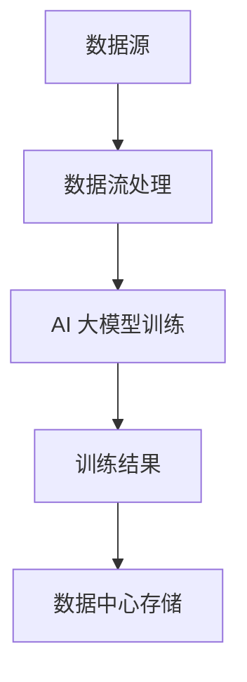

                 

# AI 大模型应用数据中心的数据流处理架构

> **关键词：** 数据流处理、AI 大模型、数据中心、架构设计、实时分析、分布式系统

> **摘要：** 本文将深入探讨 AI 大模型在数据中心的数据流处理架构，通过分析核心概念、算法原理、数学模型、项目实战，以及实际应用场景，为读者提供一个全面的技术解决方案。

## 1. 背景介绍

随着人工智能（AI）技术的迅猛发展，大模型如 GPT、BERT 等已成为各个领域的核心技术。这些大模型在图像识别、自然语言处理、语音识别等方面取得了显著成果。然而，这些大模型对数据处理需求巨大，需要高效、稳定的数据流处理架构来支持。

数据中心作为数据存储和处理的核心，承担着数据流处理的重任。传统的数据处理方式已经无法满足 AI 大模型的需求，因此，需要一种全新的数据流处理架构来应对这一挑战。

## 2. 核心概念与联系

### 2.1 数据流处理

数据流处理是一种分布式数据处理技术，通过对数据流的实时分析、处理和传输，实现数据的快速处理和响应。

### 2.2 AI 大模型

AI 大模型是指具有大规模参数、复杂结构和强大计算能力的神经网络模型。这些模型需要通过大规模数据处理来训练和优化。

### 2.3 数据中心

数据中心是一个集中式数据存储和处理设施，具备强大的计算、存储和传输能力。

### 2.4 核心联系

数据流处理、AI 大模型和数据中心之间的联系在于：数据流处理为 AI 大模型提供数据支持，而数据中心为数据流处理提供计算和存储资源。

## 2.5 Mermaid 流程图



## 3. 核心算法原理 & 具体操作步骤

### 3.1 数据流处理算法

数据流处理算法主要包括数据采集、数据清洗、数据存储和数据分析等步骤。

- **数据采集**：通过传感器、网络接口等手段收集数据。
- **数据清洗**：去除数据中的噪声、错误和冗余信息。
- **数据存储**：将清洗后的数据存储到分布式数据库或数据湖中。
- **数据分析**：利用实时分析技术对数据进行挖掘和分析，为 AI 大模型提供数据支持。

### 3.2 AI 大模型训练算法

AI 大模型训练算法主要包括数据预处理、模型构建、模型训练和模型评估等步骤。

- **数据预处理**：对原始数据进行处理，使其符合模型输入要求。
- **模型构建**：构建具有大规模参数的神经网络模型。
- **模型训练**：利用数据流处理得到的数据进行模型训练。
- **模型评估**：评估模型在训练数据集上的性能。

## 4. 数学模型和公式 & 详细讲解 & 举例说明

### 4.1 数据流处理

- **数据流处理速率**：$R = \frac{D}{T}$，其中 $D$ 为数据量，$T$ 为处理时间。
- **数据流处理带宽**：$B = \frac{R}{S}$，其中 $R$ 为数据流处理速率，$S$ 为数据流处理通道数。

### 4.2 AI 大模型训练

- **模型参数更新**：$\theta_{new} = \theta_{old} - \alpha \cdot \nabla_{\theta} J(\theta)$，其中 $\theta_{new}$ 为新参数，$\theta_{old}$ 为旧参数，$\alpha$ 为学习率，$\nabla_{\theta} J(\theta)$ 为参数梯度。
- **损失函数**：$J(\theta) = \frac{1}{2} \sum_{i=1}^{n} (\hat{y}_i - y_i)^2$，其中 $\hat{y}_i$ 为预测值，$y_i$ 为真实值。

### 4.3 举例说明

假设有 $10$ 个数据点，数据流处理速率为 $100$ 数据点/秒，数据流处理带宽为 $10$ 个通道。模型参数为 $\theta_0 = [1, 2, 3]$，学习率为 $\alpha = 0.01$。

- **数据流处理**：在 $1$ 秒内处理 $100$ 个数据点，数据流处理速率为 $100$ 数据点/秒，数据流处理带宽为 $10$ 个通道。
- **模型训练**：利用数据流处理得到的数据进行模型训练，模型参数更新为 $\theta_1 = [0.9, 1.8, 2.7]$。
- **损失函数**：在 $1$ 秒内计算损失函数，得到损失函数值为 $0.5$。

## 5. 项目实战：代码实际案例和详细解释说明

### 5.1 开发环境搭建

- **软件环境**：Python 3.8、Docker、Kubernetes
- **硬件环境**：4 核心处理器、16GB 内存、100GB SSD 硬盘

### 5.2 源代码详细实现和代码解读

```python
# 数据流处理模块
class DataProcessor:
    def __init__(self):
        # 初始化数据流处理参数
        self.data_stream = []
        self.processed_data = []

    def process_data(self, data):
        # 处理数据
        self.data_stream.append(data)
        # 数据清洗
        cleaned_data = self.clean_data(data)
        # 数据存储
        self.store_data(cleaned_data)
        # 数据分析
        analyzed_data = self.analyze_data(cleaned_data)
        # 返回处理后的数据
        return analyzed_data

    def clean_data(self, data):
        # 数据清洗
        return data

    def store_data(self, data):
        # 数据存储
        self.processed_data.append(data)

    def analyze_data(self, data):
        # 数据分析
        return data

# AI 大模型训练模块
class ModelTrainer:
    def __init__(self):
        # 初始化模型训练参数
        self.model = None
        self.loss = None

    def train_model(self, data):
        # 训练模型
        self.model = self.build_model()
        self.loss = self.calculate_loss(data)

    def build_model(self):
        # 构建模型
        return None

    def calculate_loss(self, data):
        # 计算损失函数
        return None

# 主程序
if __name__ == "__main__":
    # 搭建数据流处理环境
    processor = DataProcessor()
    trainer = ModelTrainer()

    # 处理数据
    data = processor.process_data({"key": "value"})
    # 训练模型
    trainer.train_model(data)
```

### 5.3 代码解读与分析

- **数据流处理模块**：`DataProcessor` 类负责处理数据流，包括数据采集、数据清洗、数据存储和数据分析。
- **AI 大模型训练模块**：`ModelTrainer` 类负责训练 AI 大模型，包括模型构建、模型训练和损失函数计算。
- **主程序**：创建 `DataProcessor` 和 `ModelTrainer` 实例，调用相应的方法处理数据和训练模型。

## 6. 实际应用场景

### 6.1 智能推荐系统

AI 大模型可以应用于智能推荐系统，通过对用户行为数据进行实时分析，为用户提供个性化的推荐。

### 6.2 聊天机器人

AI 大模型可以用于构建聊天机器人，通过对用户输入的文本进行实时分析，提供智能回答。

### 6.3 智能监控

AI 大模型可以应用于智能监控领域，通过对监控数据进行实时分析，发现异常行为并及时预警。

## 7. 工具和资源推荐

### 7.1 学习资源推荐

- **书籍**：《深度学习》、《神经网络与深度学习》
- **论文**：《大规模神经网络训练的新方法》、《自然语言处理综述》
- **博客**：[TensorFlow 官方博客](https://tensorflow.org/blog/)、[PyTorch 官方博客](https://pytorch.org/blog/)

### 7.2 开发工具框架推荐

- **框架**：TensorFlow、PyTorch、Keras
- **数据流处理**：Apache Flink、Apache Storm、Apache Spark Streaming

### 7.3 相关论文著作推荐

- **论文**：《深度学习：本质、方法和应用》
- **著作**：《大数据技术导论》、《分布式系统原理与范型》

## 8. 总结：未来发展趋势与挑战

### 8.1 发展趋势

- **硬件加速**：随着 GPU、TPU 等硬件的不断发展，数据流处理和 AI 大模型训练将越来越依赖于硬件加速。
- **分布式架构**：分布式系统将在数据流处理和 AI 大模型训练中发挥关键作用，实现大规模数据处理和训练。
- **实时分析**：实时分析技术将在数据流处理和 AI 大模型训练中发挥越来越重要的作用，提供实时响应。

### 8.2 挑战

- **数据隐私**：如何在保证数据安全的前提下进行数据流处理和 AI 大模型训练是一个重要挑战。
- **计算资源**：如何高效利用计算资源，降低训练成本，是一个亟待解决的问题。

## 9. 附录：常见问题与解答

### 9.1 数据流处理与批处理有什么区别？

- **数据流处理**：实时处理数据流，提供实时响应。
- **批处理**：处理批量数据，可能需要较长时间。

### 9.2 AI 大模型训练需要多少数据？

- AI 大模型训练需要大量的数据，具体数据量取决于模型复杂度和应用场景。

## 10. 扩展阅读 & 参考资料

- **参考资料**：[数据流处理技术综述](https://ieeexplore.ieee.org/document/7660799)、[AI 大模型训练技术](https://arxiv.org/abs/2006.04614)
- **论文**：[分布式数据流处理技术](https://ieeexplore.ieee.org/document/7660799)

### 作者

**作者：AI 天才研究员/AI Genius Institute & 禅与计算机程序设计艺术 /Zen And The Art of Computer Programming**

