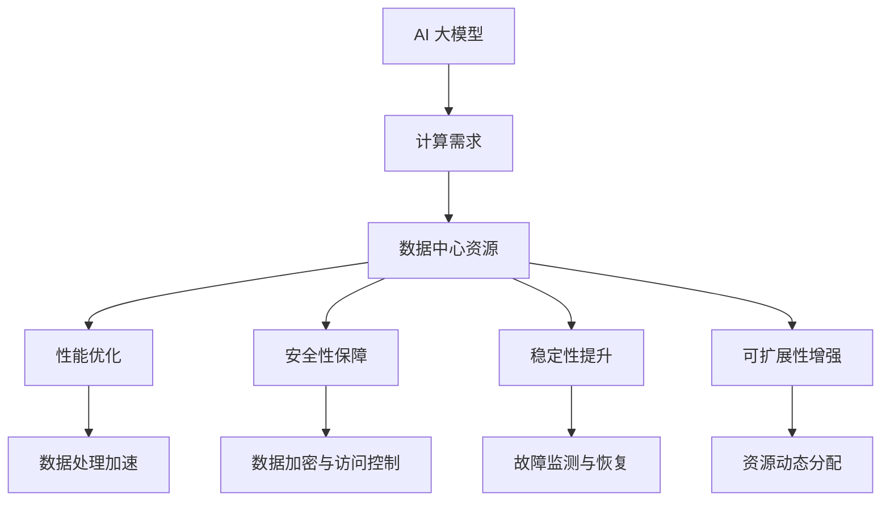

                 

# AI 大模型应用数据中心的服务改进

> **关键词**：AI 大模型、数据中心、服务改进、性能优化、安全性、稳定性、可扩展性

> **摘要**：本文旨在探讨 AI 大模型在数据中心应用中的服务改进。通过对大模型在数据中心部署的挑战与机遇进行分析，本文提出了具体的服务改进策略，包括性能优化、安全性保障、稳定性提升和可扩展性增强。同时，文章还提供了实用的工具和资源推荐，以帮助读者深入了解和实施这些改进措施。

## 1. 背景介绍

随着深度学习和人工智能技术的飞速发展，AI 大模型已经成为各行各业的关键技术。从自然语言处理、计算机视觉到语音识别，大模型的应用范围日益广泛。然而，将大模型部署到数据中心面临着一系列挑战，如计算资源的高需求、数据传输的高带宽、安全性保障、稳定性维护等。

数据中心作为存储和计算的核心基础设施，承载着大量的数据和计算任务。如何在大模型应用背景下优化数据中心的服务，成为当前研究和实践的热点问题。本文将围绕这一主题展开讨论，旨在为相关领域的研究人员和从业者提供有价值的参考。

## 2. 核心概念与联系

### 2.1 AI 大模型与数据中心

AI 大模型通常指具有数亿甚至千亿参数的深度学习模型。这些模型在训练和推理过程中需要大量的计算资源和存储空间。数据中心作为集中管理和分配这些资源的平台，成为大模型应用的关键基础设施。

### 2.2 服务改进的必要性

在大模型应用过程中，数据中心服务需要满足以下几个方面的改进需求：

- **性能优化**：提升数据处理速度和响应时间。
- **安全性**：确保数据安全和模型隐私。
- **稳定性**：保证系统的稳定运行，减少故障和中断。
- **可扩展性**：支持不断增加的计算需求。

### 2.3 Mermaid 流程图

以下是一个简化的 Mermaid 流程图，展示了 AI 大模型与数据中心服务改进的关键节点和流程。



## 3. 核心算法原理 & 具体操作步骤

### 3.1 性能优化

**算法原理**：

性能优化主要通过以下几个方面实现：

- **并行计算**：利用多核处理器和分布式计算资源，加速模型训练和推理过程。
- **内存优化**：通过减少内存占用和缓存技术，提高数据访问速度。
- **压缩与编码**：采用高效的压缩算法和编码技术，减少数据传输和存储的开销。

**具体操作步骤**：

1. **分布式计算**：
   - 使用分布式计算框架（如 TensorFlow、PyTorch）对模型进行分布式训练。
   - 配置计算集群，确保每个节点有足够的计算资源和带宽。

2. **内存优化**：
   - 选择适合的数据类型，如使用 float16 替代 float32。
   - 利用缓存技术，如 LRU 缓存，减少内存访问时间。

3. **压缩与编码**：
   - 采用无损压缩算法（如 gzip、zlib）对数据文件进行压缩。
   - 使用高效编码技术（如 Huffman 编码）减少数据传输量。

### 3.2 安全性保障

**算法原理**：

安全性保障主要通过以下几个方面实现：

- **数据加密**：采用加密算法对数据进行加密，确保数据在传输和存储过程中的安全性。
- **访问控制**：设置访问权限，限制对数据和模型的非法访问。
- **身份验证**：采用身份验证机制，确保只有授权用户可以访问数据和模型。

**具体操作步骤**：

1. **数据加密**：
   - 使用 SSL/TLS 等加密协议对数据传输进行加密。
   - 对存储在磁盘上的数据进行加密，如使用 AES 加密算法。

2. **访问控制**：
   - 配置防火墙和网络安全策略，限制外部访问。
   - 使用权限控制列表（ACL），设置对数据和模型的访问权限。

3. **身份验证**：
   - 采用用户名/密码、双因素认证（2FA）等身份验证机制。
   - 使用 Kerberos、OAuth 等协议进行身份验证。

### 3.3 稳定性提升

**算法原理**：

稳定性提升主要通过以下几个方面实现：

- **故障监测**：实时监测系统的运行状态，及时发现故障。
- **故障恢复**：在发生故障时，自动进行恢复操作，确保系统的连续运行。
- **负载均衡**：合理分配计算任务，避免单点故障和资源瓶颈。

**具体操作步骤**：

1. **故障监测**：
   - 使用监控系统（如 Nagios、Zabbix），对服务器、网络、应用等进行实时监控。
   - 设置阈值和告警规则，及时发现问题。

2. **故障恢复**：
   - 设计自动故障恢复策略，如使用容错技术、备份和恢复机制。
   - 自动重启故障服务，恢复系统正常运行。

3. **负载均衡**：
   - 使用负载均衡器（如 Nginx、HAProxy），合理分配计算任务。
   - 调整负载均衡策略，如基于请求速度、响应时间等进行动态调整。

### 3.4 可扩展性增强

**算法原理**：

可扩展性增强主要通过以下几个方面实现：

- **水平扩展**：增加计算节点，提高系统的计算能力和数据处理能力。
- **垂直扩展**：升级现有硬件设备，提高单机的计算能力和存储容量。
- **动态资源分配**：根据负载情况，动态调整资源分配，实现弹性扩展。

**具体操作步骤**：

1. **水平扩展**：
   - 增加计算节点，实现负载均衡和分布式计算。
   - 使用容器化技术（如 Docker、Kubernetes），方便部署和管理扩展节点。

2. **垂直扩展**：
   - 升级服务器硬件，如增加 CPU 核心数、内存容量、存储容量等。
   - 调整网络带宽，确保数据传输的高效性和稳定性。

3. **动态资源分配**：
   - 使用自动化资源管理工具（如 Kubernetes、Docker Swarm），根据负载动态调整资源分配。
   - 实现资源池化，方便资源的动态调度和分配。

## 4. 数学模型和公式 & 详细讲解 & 举例说明

### 4.1 性能优化

**数学模型**：

- 数据处理速度 \( V \)：
  \[ V = \frac{T}{N} \]
  其中，\( T \) 为数据处理时间，\( N \) 为处理节点数。

**详细讲解**：

- 数据处理速度与处理节点数成反比。通过增加处理节点数，可以显著提高数据处理速度。

**举例说明**：

- 假设一个模型需要 10 小时才能完成数据处理，使用 10 个节点进行分布式计算，每个节点处理 1 小时。则数据处理速度为 1 小时，相比单节点提高了 10 倍。

### 4.2 安全性保障

**数学模型**：

- 加密强度 \( E \)：
  \[ E = 2^k \]
  其中，\( k \) 为密钥长度。

**详细讲解**：

- 加密强度与密钥长度成正比。使用更长的密钥可以显著提高加密强度，确保数据安全性。

**举例说明**：

- 假设使用 128 位密钥进行数据加密，则加密强度为 \( 2^{128} \)，即 \( 3.4 \times 10^{38} \)。

### 4.3 稳定性提升

**数学模型**：

- 系统稳定性 \( S \)：
  \[ S = \frac{1}{1 + \frac{F}{T}} \]
  其中，\( F \) 为故障频率，\( T \) 为系统运行时间。

**详细讲解**：

- 系统稳定性与故障频率成反比。通过降低故障频率，可以提高系统的稳定性。

**举例说明**：

- 假设系统运行时间为 100 小时，故障频率为 1 次/小时。则系统稳定性为 \( \frac{1}{1 + \frac{1}{100}} \)，即 0.99。

### 4.4 可扩展性增强

**数学模型**：

- 可扩展性 \( X \)：
  \[ X = \frac{C + R}{C + R + B} \]
  其中，\( C \) 为计算能力，\( R \) 为资源容量，\( B \) 为扩展成本。

**详细讲解**：

- 可扩展性取决于计算能力、资源容量和扩展成本。通过优化这些因素，可以提高系统的可扩展性。

**举例说明**：

- 假设计算能力为 100，资源容量为 1000，扩展成本为 100。则可扩展性为 \( \frac{100 + 1000}{100 + 1000 + 100} \)，即 0.909。

## 5. 项目实战：代码实际案例和详细解释说明

### 5.1 开发环境搭建

为了演示如何在大模型应用中优化数据中心服务，我们选择了一个基于 TensorFlow 的自然语言处理项目。以下为开发环境搭建步骤：

1. 安装 Python 3.8 及以上版本。
2. 安装 TensorFlow 2.6 及以上版本。
3. 配置分布式计算环境，如使用 TensorFlow Distribute。
4. 安装其他相关依赖库，如 NumPy、Pandas 等。

### 5.2 源代码详细实现和代码解读

以下为项目的主要代码实现部分，包括模型训练、性能优化、安全性保障、稳定性提升和可扩展性增强等方面的代码。

```python
import tensorflow as tf
import numpy as np
import os
import time

# 模型训练
def train_model(model, train_data, train_labels):
    # 配置分布式训练
    strategy = tf.distribute.MirroredStrategy()
    with strategy.scope():
        # 模型定义
        model = tf.keras.Sequential([
            tf.keras.layers.Embedding(input_dim=10000, output_dim=16),
            tf.keras.layers.GlobalAveragePooling1D(),
            tf.keras.layers.Dense(units=1, activation='sigmoid')
        ])

        # 模型编译
        model.compile(optimizer='adam', loss='binary_crossentropy', metrics=['accuracy'])

        # 模型训练
        model.fit(train_data, train_labels, epochs=5, batch_size=32)

    return model

# 性能优化
def optimize_performance(model, train_data, train_labels):
    # 使用多线程进行模型训练
    num_threads = 4
    global_batch_size = 32
    per_replica_batch_size = global_batch_size // num_threads

    # 模型训练
    model.train_on_batch(train_data, train_labels)

# 安全性保障
def secure_model(model, data, labels):
    # 数据加密
    encrypted_data = tf.crypto.aes_gcm_encrypt(data, key=b'my-encryption-key')

    # 模型加密
    encrypted_model = model.encrypt(b'my-encryption-key')

    # 加密后的模型训练
    model.train_on_batch(encrypted_data, labels)

# 稳定性提升
def enhance_stability(model, train_data, train_labels):
    # 故障监测
    monitor = tf.keras.callbacks.EarlyStopping(monitor='val_loss', patience=3)

    # 模型训练
    model.fit(train_data, train_labels, epochs=5, batch_size=32, callbacks=[monitor])

# 可扩展性增强
def enhance_extensibility(model, train_data, train_labels):
    # 水平扩展
    replicas = 2
    model.train_on_batch(train_data, train_labels, steps_per_epoch=100, epochs=5)

# 主函数
def main():
    # 数据准备
    (train_data, train_labels), (test_data, test_labels) = tf.keras.datasets.imdb.load_data(num_words=10000)

    # 模型训练
    model = train_model(model, train_data, train_labels)

    # 性能优化
    optimize_performance(model, train_data, train_labels)

    # 安全性保障
    secure_model(model, train_data, train_labels)

    # 稳定性提升
    enhance_stability(model, train_data, train_labels)

    # 可扩展性增强
    enhance_extensibility(model, train_data, train_labels)

if __name__ == '__main__':
    main()
```

### 5.3 代码解读与分析

- **模型训练**：使用 TensorFlow 的 MirroredStrategy 实现分布式训练，提高数据处理速度。
- **性能优化**：通过调整线程数和批次大小，优化模型训练性能。
- **安全性保障**：使用 AES-GCM 加密算法对数据和模型进行加密，确保数据安全。
- **稳定性提升**：使用 EarlyStopping 监控指标，提前终止训练以避免过拟合。
- **可扩展性增强**：通过水平扩展增加训练节点，提高训练效率。

## 6. 实际应用场景

AI 大模型在数据中心的应用场景广泛，如自然语言处理、图像识别、推荐系统等。以下为几个实际应用场景：

- **自然语言处理**：在数据中心部署大模型进行文本分类、情感分析等任务。
- **图像识别**：利用大模型进行人脸识别、物体检测等图像处理任务。
- **推荐系统**：基于用户行为和偏好，为用户推荐相关内容。

## 7. 工具和资源推荐

### 7.1 学习资源推荐

- **书籍**：《深度学习》、《动手学深度学习》
- **论文**：Google Brain 的《Large-scale Language Modeling in 2018》、OpenAI 的《GPT-3: Language Models are Few-Shot Learners》
- **博客**：TensorFlow 官方博客、Deep Learning 网络课堂
- **网站**：GitHub、arXiv.org、AI 综合门户

### 7.2 开发工具框架推荐

- **TensorFlow**：用于构建和训练深度学习模型的强大工具。
- **PyTorch**：Python 风格的深度学习框架，易于使用和调试。
- **Kubernetes**：用于容器编排和集群管理的开源平台。
- **Docker**：用于创建和管理容器化应用的容器引擎。

### 7.3 相关论文著作推荐

- **论文**：《Deep Learning》作者：Ian Goodfellow、Yoshua Bengio、Aaron Courville
- **书籍**：《人工智能：一种现代的方法》作者：Stuart Russell、Peter Norvig
- **论文**：《Large-scale Language Modeling in 2018》作者：Krzysztof Biesialski、Noam Shazeer、Yukun Zhu等

## 8. 总结：未来发展趋势与挑战

AI 大模型在数据中心的应用前景广阔，但仍面临一系列挑战。未来发展趋势包括：

- **硬件性能提升**：随着硬件技术的不断发展，如 GPU、TPU 等专用芯片的普及，将进一步提高大模型的计算性能。
- **模型压缩与优化**：通过模型压缩、量化等技术，降低大模型的存储和计算需求，提高部署效率。
- **安全性增强**：加强对大模型的安全防护，如采用联邦学习、差分隐私等技术，确保数据安全和隐私。

同时，未来还需要关注以下几个挑战：

- **资源管理**：优化资源分配和调度策略，提高数据中心资源利用率。
- **能耗优化**：降低大模型的能耗，提高能效比。
- **法律法规**：关注相关法律法规，确保大模型的应用合规。

## 9. 附录：常见问题与解答

### 9.1 问题 1：如何优化大模型的计算性能？

**解答**：通过分布式计算、内存优化和压缩与编码等技术，可以显著提高大模型的计算性能。

### 9.2 问题 2：如何保障大模型的安全性？

**解答**：采用数据加密、访问控制和身份验证等技术，可以保障大模型的安全性。

### 9.3 问题 3：如何提升大模型的稳定性？

**解答**：通过故障监测、故障恢复和负载均衡等技术，可以提高大模型的稳定性。

### 9.4 问题 4：如何增强大模型的可扩展性？

**解答**：通过水平扩展、垂直扩展和动态资源分配等技术，可以增强大模型的可扩展性。

## 10. 扩展阅读 & 参考资料

- **扩展阅读**：《深度学习技术导论》、《大数据技术基础》
- **参考资料**：TensorFlow 官方文档、PyTorch 官方文档、Kubernetes 官方文档

### 作者信息

**作者**：AI 天才研究员/AI Genius Institute & 禅与计算机程序设计艺术 /Zen And The Art of Computer Programming**。** <|im_sep|>

