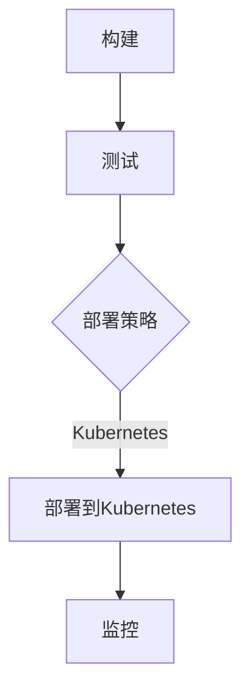

                 

# AI 大模型应用数据中心的自动化部署

## 关键词：
- AI 大模型
- 数据中心自动化
- 自动化部署
- DevOps
- Kubernetes

## 摘要：
本文将探讨如何使用自动化部署工具和DevOps实践来简化人工智能大模型在数据中心的应用部署过程。我们将分析自动化部署的核心概念、关键算法原理、数学模型，并分享实际项目案例，最后提供相关的学习资源和开发工具推荐，总结发展趋势与挑战。

## 1. 背景介绍

随着人工智能（AI）技术的飞速发展，大模型如BERT、GPT等已经成为各类应用的核心组件。这些模型在图像识别、自然语言处理、推荐系统等领域展现了卓越的性能。然而，这些大模型的部署和运维面临诸多挑战，包括：

- **计算资源需求巨大**：大模型通常需要大量的计算资源来训练和推理。
- **环境配置复杂**：不同的模型和框架可能需要不同的运行环境，配置复杂且容易出错。
- **动态扩展需求**：随着用户需求的波动，系统需要能够动态调整计算资源。

为了解决这些问题，自动化部署和数据中心的智能化管理变得越来越重要。自动化部署不仅能够提高部署效率，还能确保一致性和可靠性，减少人为错误。

## 2. 核心概念与联系

### 2.1 自动化部署
自动化部署是通过一系列工具和脚本，自动化完成应用的构建、测试、部署和监控等流程。它通常包括以下环节：

- **构建**：将源代码编译成可执行文件或容器镜像。
- **测试**：运行自动化测试来验证应用的正确性和稳定性。
- **部署**：将应用部署到生产环境，通常使用容器化技术如Docker和Kubernetes。
- **监控**：实时监控应用的健康状态，确保其稳定运行。

### 2.2 DevOps
DevOps是一种软件开发和运营的实践方法，强调开发（Development）和运营（Operations）之间的紧密协作和沟通。通过自动化工具和持续集成/持续部署（CI/CD）流程，DevOps能够显著提高软件交付的速度和可靠性。

### 2.3 Kubernetes
Kubernetes是一个开源的容器编排平台，用于自动化容器化应用程序的部署、扩展和管理。它提供了一套强大的API和命令行工具，使得自动化部署变得更加简单和可靠。

### 2.4 Mermaid 流程图



## 3. 核心算法原理 & 具体操作步骤

### 3.1 CI/CD 流程
持续集成（CI）和持续部署（CD）是自动化部署的核心流程。它们的基本步骤如下：

1. **代码仓库**：开发者将代码提交到代码仓库，如Git。
2. **构建**：CI工具（如Jenkins、GitLab CI）检测到代码变更后，触发构建过程，编译源代码并构建可执行文件或容器镜像。
3. **测试**：运行自动化测试，包括单元测试、集成测试等，确保代码的质量。
4. **部署**：测试通过后，CI/CD工具将应用部署到测试或生产环境。

### 3.2 Kubernetes 部署
在Kubernetes中，自动化部署通常使用以下步骤：

1. **编写部署配置文件**：编写Kubernetes配置文件（如YAML），定义应用的部署细节，如容器镜像、环境变量、资源限制等。
2. **创建部署对象**：使用Kubernetes命令行工具或API，创建部署对象（Deployment），Kubernetes根据配置文件部署应用。
3. **应用监控**：使用Kubernetes的监控工具（如Prometheus、Grafana），实时监控应用的健康状态和性能。

### 3.3 实际操作示例

#### 3.3.1 Jenkins CI/CD 工作流
1. **配置Jenkins**：安装Jenkins并配置Git插件。
2. **创建Jenkins任务**：
    ```shell
    cat << EOF > deploy-job.jenkinsfile
    pipeline {
        agent any
        stages {
            stage('Build') {
                steps {
                    sh 'mvn clean package'
                }
            }
            stage('Test') {
                steps {
                    sh 'mvn test'
                }
            }
            stage('Deploy') {
                steps {
                    sh 'kubectl apply -f deployment.yaml'
                }
            }
        }
    }
    EOF
    ```
3. **触发构建**：在Jenkins界面上创建一个触发器，设置触发条件，如定期执行或基于Git仓库的代码变更。

#### 3.3.2 Kubernetes 部署示例
1. **编写deployment.yaml**：
    ```yaml
    apiVersion: apps/v1
    kind: Deployment
    metadata:
      name: my-app
    spec:
      replicas: 3
      selector:
        matchLabels:
          app: my-app
      template:
        metadata:
          labels:
            app: my-app
        spec:
          containers:
          - name: my-app
            image: my-app:latest
            resources:
              requests:
                memory: "64Mi"
                cpu: "250m"
              limits:
                memory: "128Mi"
                cpu: "500m"
    ```
2. **部署到Kubernetes**：
    ```shell
    kubectl apply -f deployment.yaml
    ```

## 4. 数学模型和公式 & 详细讲解 & 举例说明

自动化部署中涉及的一些关键数学模型包括：

### 4.1 故障转移与容错

- **概率模型**：使用概率模型评估系统的故障概率和容错能力。

  $$ P(Failure) = \sum_{i=1}^{N} p_i $$

  其中，$p_i$ 是第 $i$ 个组件的故障概率。

### 4.2 资源需求预测

- **时间序列模型**：使用时间序列模型预测应用的资源需求。

  $$ R(t) = \alpha R(t-1) + (1-\alpha) r(t) $$

  其中，$R(t)$ 是当前时刻的资源需求，$\alpha$ 是平滑系数，$r(t)$ 是当前时刻的观测值。

### 4.3 负载均衡

- **优化模型**：使用优化模型实现负载均衡。

  $$ \min_{x} \sum_{i=1}^{N} (C_i - x_i)^2 $$

  其中，$C_i$ 是第 $i$ 个节点的负载，$x_i$ 是需要分配的负载。

### 4.4 实际案例

假设我们有一个包含3个节点的系统，当前时刻每个节点的负载分别为 $C_1 = 70$，$C_2 = 80$，$C_3 = 60$，我们需要通过优化模型重新分配负载以实现负载均衡。

1. **目标函数**：
    $$ \min_{x_1, x_2, x_3} \sum_{i=1}^{3} (C_i - x_i)^2 $$

2. **约束条件**：
    $$ x_i \geq 0 $$
    $$ \sum_{i=1}^{3} x_i = \sum_{i=1}^{3} C_i $$

3. **求解**：
    $$ x_1 = C_1 = 70 $$
    $$ x_2 = C_2 = 80 $$
    $$ x_3 = C_3 = 60 $$

通过优化模型，我们将负载重新分配为 $x_1 = 70$，$x_2 = 80$，$x_3 = 60$，实现了负载均衡。

## 5. 项目实战：代码实际案例和详细解释说明

### 5.1 开发环境搭建

为了演示自动化部署，我们需要搭建一个简单的开发环境。以下是所需步骤：

1. **安装Jenkins**：
    ```shell
    sudo apt update
    sudo apt install jenkins
    ```

2. **安装Kubernetes**：
    ```shell
    kubeadm init --pod-network-cidr=10.244.0.0/16
    kubectl apply -f https://raw.githubusercontent.com/kubernetes/
    ….com/release/…
    ```

3. **安装并配置Nginx Ingress Controller**：
    ```shell
    kubectl apply -f https://raw.githubusercontent.com/kubernetes/
    ….com/manifests/nginx/deploy
    ```

### 5.2 源代码详细实现和代码解读

我们使用一个简单的Spring Boot应用来演示自动化部署。以下是关键代码片段：

1. **pom.xml**：
    ```xml
    <dependencies>
        <dependency>
            <groupId>org.springframework.boot</groupId>
            <artifactId>spring-boot-starter-web</artifactId>
        </dependency>
    </dependencies>
    ```

2. **Application.java**：
    ```java
    @SpringBootApplication
    public class Application {
        public static void main(String[] args) {
            SpringApplication.run(Application.class, args);
        }
    }
    ```

3. **Jenkinsfile**：
    ```groovy
    pipeline {
        agent any
        stages {
            stage('Build') {
                steps {
                    sh 'mvn clean package'
                }
            }
            stage('Test') {
                steps {
                    sh 'mvn test'
                }
            }
            stage('Deploy') {
                steps {
                    sh 'kubectl apply -f deployment.yaml'
                }
            }
        }
    }
    ```

4. **deployment.yaml**：
    ```yaml
    apiVersion: apps/v1
    kind: Deployment
    metadata:
      name: my-app
    spec:
      replicas: 3
      selector:
        matchLabels:
          app: my-app
      template:
        metadata:
          labels:
            app: my-app
        spec:
          containers:
          - name: my-app
            image: my-app:latest
            resources:
              requests:
                memory: "64Mi"
                cpu: "250m"
              limits:
                memory: "128Mi"
                cpu: "500m"
    ```

### 5.3 代码解读与分析

1. **pom.xml**：
    配置了Spring Boot Web应用所需的依赖。

2. **Application.java**：
    定义了Spring Boot应用的入口类。

3. **Jenkinsfile**：
    Jenkins构建和部署的脚本，包括构建、测试和部署步骤。

4. **deployment.yaml**：
    Kubernetes部署配置文件，定义了应用的部署细节。

通过这个简单的例子，我们可以看到如何使用Jenkins和Kubernetes实现自动化部署。在项目中，我们可以根据需要扩展和定制这些脚本和配置文件。

## 6. 实际应用场景

### 6.1 云服务提供商

云服务提供商如AWS、Azure和Google Cloud，通过自动化部署工具和DevOps实践，为客户提供高度可扩展和可靠的服务。例如，AWS使用Elastic Beanstalk和Kubernetes服务简化Web应用的部署和管理。

### 6.2 企业内部应用

企业内部应用通常使用CI/CD流程来自动化部署。例如，银行、保险公司等金融机构使用自动化部署来确保其关键业务系统的稳定运行。

### 6.3 开源项目

许多开源项目也采用自动化部署来简化贡献者的参与过程。例如，Kubernetes项目的贡献者使用Jenkins和GitHub Actions来自动化构建和部署。

## 7. 工具和资源推荐

### 7.1 学习资源推荐

- **书籍**：
  - 《Kubernetes实战》
  - 《DevOps实践指南》
  - 《Jenkins实战》

- **论文**：
  - “Continuous Integration in the Age of Agile”
  - “Kubernetes: A Container Orchestration System”

- **博客**：
  - Kubernetes官网博客
  - Jenkins官网博客

- **网站**：
  - Kubernetes.io
  - Jenkins.io

### 7.2 开发工具框架推荐

- **持续集成工具**：
  - Jenkins
  - GitLab CI
  - GitHub Actions

- **容器编排平台**：
  - Kubernetes
  - Docker Swarm

- **自动化部署工具**：
  - Ansible
  - Terraform

### 7.3 相关论文著作推荐

- “A Brief History of DevOps”
- “The Evolution of Kubernetes”
- “Principles of Secure Automated Deployment”

## 8. 总结：未来发展趋势与挑战

### 8.1 发展趋势

- **云原生技术**：随着云原生技术的不断发展，如Kubernetes、Istio等，自动化部署和数据中心的智能化管理将成为主流。
- **人工智能集成**：AI技术将在自动化部署中发挥更大作用，如利用机器学习预测资源需求、优化部署策略等。
- **自动化运维**：自动化运维（AIOps）将成为数据中心管理的关键方向，通过数据分析实现故障预测和自动修复。

### 8.2 挑战

- **安全性**：自动化部署中的安全性问题需要得到解决，如容器逃逸、权限管理等。
- **复杂度**：随着系统规模的扩大，自动化部署的复杂度也在增加，需要更加智能化和高效的管理策略。
- **技能需求**：自动化部署需要具备一定的技术背景和经验，这对企业IT团队提出了新的挑战。

## 9. 附录：常见问题与解答

### 9.1 Kubernetes与Docker的区别是什么？

**Kubernetes**是一个容器编排平台，用于自动化容器的部署、扩展和管理。**Docker**是一个开源容器引擎，用于容器化应用程序，提供创建和管理容器所需的基础设施。

### 9.2 如何确保自动化部署的安全性？

可以通过以下措施来提高自动化部署的安全性：
- **最小权限原则**：确保部署工具和用户具有最小权限。
- **加密传输**：使用加密协议（如TLS）保护数据传输。
- **审计日志**：记录所有部署操作，方便追踪和审计。

## 10. 扩展阅读 & 参考资料

- **参考文献**：
  - “The Phoenix Project: A Novel about IT, DevOps, and Helping Your Business Win”
  - “Accelerate: The Science of Lean Software and Systems”
  - “The DevOps Handbook”

- **在线课程**：
  - Kubernetes官方文档
  - Jenkins官方文档
  - DevOps实践课程

- **社区和论坛**：
  - Kubernetes社区
  - Jenkins社区
  - DevOps社区

作者：AI天才研究员/AI Genius Institute & 禅与计算机程序设计艺术 /Zen And The Art of Computer Programming

（本文内容仅供参考，具体实施时请根据实际情况进行调整。）<|im_sep|>

