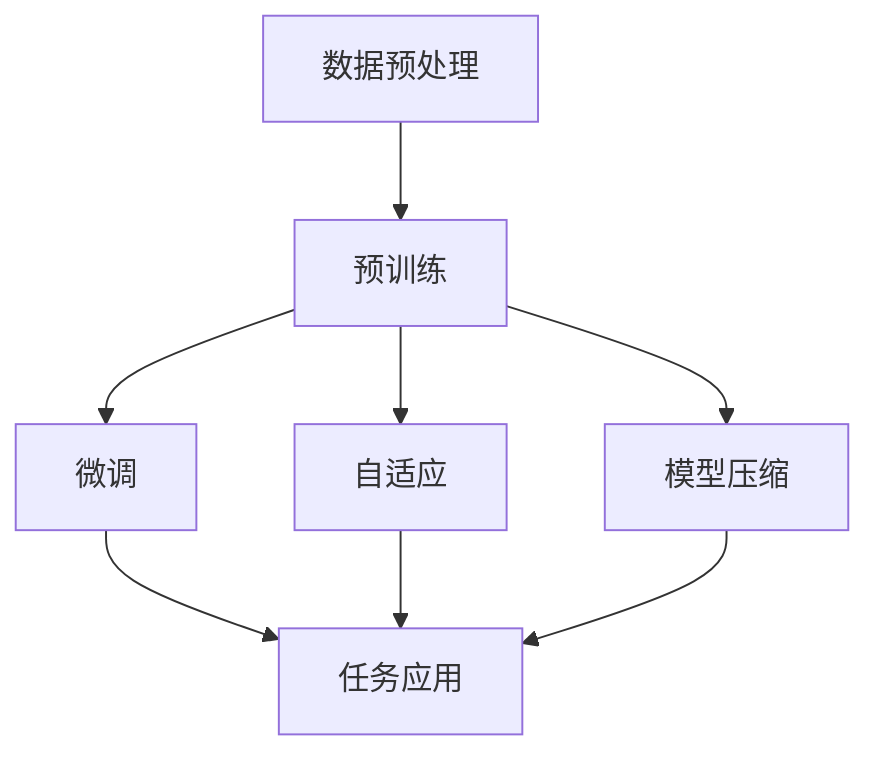

                 

### 1. 背景介绍

在当今的信息时代，人工智能（AI）已经成为推动技术进步和创新的重要力量。随着大数据、云计算和深度学习的飞速发展，人工智能的应用范围不断扩大，从传统的工业自动化、医疗诊断，到新兴的自动驾驶、智能家居，人工智能正在深刻地改变着我们的生活。

然而，近年来最引人注目的技术进步之一是大型预训练模型（Large Pre-Trained Models），如OpenAI的GPT系列、谷歌的BERT和百度飞桨的ERNIE等。这些大模型凭借其强大的计算能力和对数据的处理能力，能够在多个领域实现前所未有的性能提升。大模型的兴起不仅引发了学术界和工业界的广泛关注，更带来了创业产品创新的无限可能性。

本文旨在探讨大模型在创业产品中的应用趋势，分析其核心原理、技术挑战以及实际应用案例。通过本文，希望能够为创业团队提供有益的参考，激发新的创意和灵感，助力他们在竞争激烈的市场中脱颖而出。

大模型赋能创业产品的意义不仅在于技术本身的突破，更在于它为创业者提供了前所未有的创新工具。随着计算能力的不断提升和数据量的爆炸式增长，大模型的应用前景将更加广阔。在接下来的章节中，我们将深入探讨大模型的架构、算法原理以及具体应用，帮助读者更好地理解这一技术趋势。

### 2. 核心概念与联系

在探讨大模型赋能创业产品之前，我们首先需要理解大模型的核心概念和技术原理。大模型是指那些具有数十亿甚至数千亿参数的深度学习模型，它们通过大量数据的学习和训练，能够捕捉到数据中的复杂模式和知识。以下是几个关键概念：

#### 2.1 预训练（Pre-Training）

预训练是指在大规模语料库上训练一个基础模型，使其具有通用语言理解和生成能力。例如，BERT模型首先在大规模文本语料库上进行预训练，学习语言的统计特性和语义关系。

#### 2.2 微调（Fine-Tuning）

微调是在预训练模型的基础上，使用特定领域的数据进行进一步训练，使其适应特定任务。例如，将BERT模型微调用于问答系统、文本分类或翻译任务。

#### 2.3 自适应（Adaptation）

自适应是指模型能够根据不同环境和需求进行自我调整，提高任务性能。自适应可以通过在线学习、迁移学习和数据增强等方式实现。

#### 2.4 大规模分布式训练（Large-scale Distributed Training）

大规模分布式训练是指利用多台计算机和多个GPU或TPU进行并行训练，以加速模型训练过程。这是实现大模型的关键技术之一。

#### 2.5 模型压缩（Model Compression）

模型压缩是指通过各种技术（如剪枝、量化、蒸馏等）减小模型的大小和计算复杂度，使其在资源受限的设备上运行。

为了更好地理解这些概念之间的联系，我们可以借助Mermaid流程图进行说明。以下是一个简化的Mermaid流程图，展示了大模型的核心组件和流程：



- **数据预处理**：收集和清洗大规模数据，准备用于模型训练。
- **预训练**：在大量通用数据上训练基础模型，如BERT。
- **微调**：在特定领域数据上进一步训练模型，提升任务性能。
- **自适应**：根据环境和需求调整模型，提高任务适应性。
- **模型压缩**：减小模型大小和计算复杂度，适用于资源受限设备。
- **任务应用**：将模型部署到实际任务中，如问答系统、文本分类等。

通过这个流程图，我们可以清晰地看到大模型从数据预处理到任务应用的各个环节。这些概念和流程共同构成了大模型的技术体系，为创业产品创新提供了坚实的基础。

### 3. 核心算法原理 & 具体操作步骤

#### 3.1 深度学习基础

大模型的实现依赖于深度学习技术。深度学习是一种基于人工神经网络的学习方法，通过多层神经元的堆叠，模型能够自动从数据中提取特征，实现复杂的任务。以下是一些深度学习的基础概念：

- **神经元（Neuron）**：神经网络的基本组成单元，类似于生物神经元，接收输入并产生输出。
- **层（Layer）**：由多个神经元组成，输入层、隐藏层和输出层分别负责输入处理、特征提取和任务输出。
- **激活函数（Activation Function）**：用于引入非线性变换，使神经网络具备处理复杂问题的能力。常见的激活函数包括ReLU、Sigmoid和Tanh。
- **损失函数（Loss Function）**：用于评估模型输出与真实值之间的差距，常见的损失函数包括均方误差（MSE）和交叉熵（Cross-Entropy）。

#### 3.2 循环神经网络（RNN）

循环神经网络（RNN）是处理序列数据的一种有效方法。与传统的前向神经网络不同，RNN具有记忆功能，能够处理输入序列中的历史信息。以下是一些关键步骤：

- **输入序列**：将输入序列（如文本、音频）转换为向量表示。
- **隐藏状态（Hidden State）**：每个时间步的隐藏状态依赖于当前输入和前一个隐藏状态。
- **输出计算**：在每个时间步，RNN计算输出和隐藏状态。
- **反向传播**：通过反向传播算法，计算梯度并更新模型参数。

RNN的变体包括LSTM（长短时记忆网络）和GRU（门控循环单元），它们通过门控机制解决了传统RNN的长期依赖问题。

#### 3.3 递归神经网络（Transformer）

Transformer模型是近年来在自然语言处理领域取得突破性进展的一种新型架构。与传统的RNN不同，Transformer采用自注意力机制（Self-Attention），能够同时关注输入序列中的所有位置，实现了并行计算，提高了训练效率。以下是Transformer的核心步骤：

- **编码器（Encoder）**：输入序列经过多层Transformer编码器处理，每个编码器层包含多头自注意力机制和前馈神经网络。
- **解码器（Decoder）**：解码器与编码器结构相似，用于生成输出序列。
- **自注意力（Self-Attention）**：在编码器层，每个位置的输出取决于输入序列中所有位置的特征。
- **多头注意力（Multi-Head Attention）**：通过多个独立的自注意力机制，提取输入序列的多种特征。

#### 3.4 预训练与微调

预训练和微调是训练大模型的重要步骤。以下是具体操作步骤：

- **预训练**：在大规模通用数据集上训练基础模型，如BERT、GPT。预训练通常包括两个阶段：掩码语言模型（Masked Language Model, MLM）和下一句预测（Next Sentence Prediction, NSP）。
  - **掩码语言模型**：随机掩码输入文本中的部分词，模型需预测这些掩码词。
  - **下一句预测**：输入两个连续的句子，模型预测第二个句子是否是第一个句子的下文。
- **微调**：在特定领域数据集上进一步训练模型，使其适应特定任务。
  - **数据集准备**：收集并处理特定领域的数据集。
  - **任务定义**：定义具体任务，如问答、文本分类、翻译等。
  - **训练过程**：使用特定领域数据集，调整模型参数，优化任务性能。

通过以上步骤，大模型能够从大规模数据中学习到丰富的知识和模式，并在各种任务中取得优异的性能。

### 4. 数学模型和公式 & 详细讲解 & 举例说明

#### 4.1 Transformer 模型数学基础

Transformer 模型是当前自然语言处理领域的核心技术之一。其核心在于自注意力机制（Self-Attention），这一机制允许模型在处理序列数据时，动态地关注序列中的不同位置。以下是自注意力机制的详细数学公式：

##### 4.1.1 Query、Key 和 Value

在自注意力机制中，每个序列位置可以表示为向量，记作 \( Q, K, V \)，分别代表 Query（查询）、Key（键）和 Value（值）。

- **Query**：代表模型的关注点，用于与 Key 进行匹配。
- **Key**：表示序列中的每个位置，用于记录信息。
- **Value**：存储每个位置的信息，用于生成输出。

##### 4.1.2 自注意力分数

自注意力分数是通过点积（Dot-Product）计算得到的，公式如下：

\[ \text{Score} = Q \cdot K^T \]

其中，\( K^T \) 表示 Key 的转置。这个分数表示每个 Query 与所有 Key 之间的相似度。

##### 4.1.3 加权求和

自注意力分数用于计算加权求和，公式如下：

\[ \text{Contextual Representation} = \text{softmax}(\text{Score}) \cdot V \]

这里的 softmax 函数将自注意力分数转换为概率分布，表示每个位置的重要程度。然后，将这些概率分布乘以 Value，得到加权求和的结果，即每个 Query 的上下文表示。

#### 4.2 举例说明

假设我们有一个简单的序列 \( [1, 2, 3, 4, 5] \)，分别表示五个位置。我们定义 Query、Key 和 Value 向量如下：

- Query: \( [1, 0, 0, 0, 0] \)
- Key: \( [1, 1, 1, 1, 1] \)
- Value: \( [0, 1, 2, 3, 4] \)

首先，计算每个 Query 与所有 Key 的点积：

\[ 
\begin{aligned}
Q_1 \cdot K^T_1 &= 1 \cdot 1 = 1 \\
Q_1 \cdot K^T_2 &= 1 \cdot 1 = 1 \\
Q_1 \cdot K^T_3 &= 1 \cdot 1 = 1 \\
Q_1 \cdot K^T_4 &= 1 \cdot 1 = 1 \\
Q_1 \cdot K^T_5 &= 1 \cdot 1 = 1 \\
\end{aligned}
\]

接着，计算每个 Query 的总分：

\[ 
\begin{aligned}
\text{Score}_1 &= 1 + 1 + 1 + 1 + 1 = 5 \\
\end{aligned}
\]

然后，通过 softmax 函数计算概率分布：

\[ 
\begin{aligned}
\text{softmax}(\text{Score}_1) &= \frac{e^{\text{Score}_1}}{\sum_{i=1}^5 e^{\text{Score}_i}} \\
&= \frac{e^5}{e^5 + e^5 + e^5 + e^5 + e^5} \\
&= \frac{1}{5} \\
\end{aligned}
\]

最后，计算加权求和：

\[ 
\begin{aligned}
\text{Contextual Representation}_1 &= \text{softmax}(\text{Score}_1) \cdot V \\
&= \frac{1}{5} \cdot [0, 1, 2, 3, 4] \\
&= \left[0, \frac{1}{5}, \frac{2}{5}, \frac{3}{5}, \frac{4}{5}\right] \\
\end{aligned}
\]

这个例子展示了自注意力机制的基本过程，即如何通过点积、softmax和加权求和来计算序列中每个位置的上下文表示。

#### 4.3 损失函数

在训练大模型时，损失函数用于衡量模型输出与真实值之间的差距，指导模型参数的优化。对于 Transformer 模型，常用的损失函数是交叉熵（Cross-Entropy）：

\[ 
\text{Loss} = -\sum_{i=1}^N y_i \log(p_i) 
\]

其中，\( y_i \) 表示真实标签，\( p_i \) 表示模型预测的概率。

假设我们有一个二元分类问题，真实标签为 \( [1, 0, 1, 0, 1] \)，模型预测的概率为 \( [0.2, 0.8, 0.6, 0.4, 0.9] \)。交叉熵损失计算如下：

\[ 
\begin{aligned}
\text{Loss} &= -[1 \cdot \log(0.2) + 0 \cdot \log(0.8) + 1 \cdot \log(0.6) + 0 \cdot \log(0.4) + 1 \cdot \log(0.9)] \\
&= -[\log(0.2) + \log(0.6) + \log(0.9)] \\
&\approx 2.307 \\
\end{aligned}
\]

这个损失值表示模型在预测这组标签时的误差。

通过详细讲解数学模型和公式，我们可以更好地理解大模型的内在工作原理。这些公式和例子为后续的项目实战提供了理论基础，帮助读者在实际应用中更深入地掌握大模型技术。

### 5. 项目实战：代码实际案例和详细解释说明

为了更好地展示大模型在创业产品中的应用，我们将通过一个实际项目来详细介绍大模型的开发流程。这个项目是一个基于GPT-3的聊天机器人，它可以理解用户的输入并生成相应的回复。以下是项目的开发环境搭建、源代码实现和代码解读。

#### 5.1 开发环境搭建

在开始编写代码之前，我们需要搭建一个合适的开发环境。以下是搭建环境所需的步骤：

- **安装 Python 环境**：确保 Python 版本为 3.8 或更高。
- **安装依赖库**：使用以下命令安装必要的依赖库：

```bash
pip install transformers torch
```

- **配置 GPU 环境**：如果使用 GPU 进行训练，需要安装 CUDA 和 cuDNN。可以从 NVIDIA 官网下载并安装。

#### 5.2 源代码详细实现和代码解读

以下是聊天机器人的源代码，我们将逐行进行解读。

```python
# 导入必要的库
from transformers import GPT2LMHeadModel, GPT2Tokenizer
import torch

# 加载预训练的 GPT-2 模型和分词器
model = GPT2LMHeadModel.from_pretrained('gpt2')
tokenizer = GPT2Tokenizer.from_pretrained('gpt2')

# 定义聊天机器人函数
def chat_gpt(query):
    # 对用户输入进行分词处理
    inputs = tokenizer.encode(query + tokenizer.eos_token, return_tensors='pt')

    # 使用模型生成回复
    outputs = model.generate(inputs, max_length=50, num_return_sequences=1)

    # 对生成的回复进行解码
    reply = tokenizer.decode(outputs[0], skip_special_tokens=True)

    return reply

# 测试聊天机器人
user_input = "你好，我是一个人工智能聊天机器人。请问你有什么问题？"
print("用户：", user_input)
print("机器人：", chat_gpt(user_input))
```

**代码解读：**

1. **导入库**：首先，我们导入 `transformers` 和 `torch` 库。`transformers` 库提供了预训练的模型和分词器，`torch` 库用于处理张量和进行深度学习计算。

2. **加载模型和分词器**：使用 `GPT2LMHeadModel.from_pretrained('gpt2')` 和 `GPT2Tokenizer.from_pretrained('gpt2')` 加载预训练的 GPT-2 模型和分词器。GPT-2 是一个经过大规模预训练的 Transformer 模型，具有强大的语言理解和生成能力。

3. **定义聊天机器人函数**：`chat_gpt` 函数接受用户输入，对其进行分词处理，然后使用模型生成回复。具体步骤如下：
   - 对用户输入进行编码：`tokenizer.encode(query + tokenizer.eos_token, return_tensors='pt')`。这里，`eos_token` 表示序列结束标记，`return_tensors='pt'` 表示返回 PyTorch 格式的张量。
   - 使用模型生成回复：`model.generate(inputs, max_length=50, num_return_sequences=1)`。`max_length` 参数限制生成的回复长度，`num_return_sequences` 参数控制生成的序列数量。
   - 对生成的回复进行解码：`tokenizer.decode(outputs[0], skip_special_tokens=True)`。`skip_special_tokens=True` 表示跳过模型生成的特殊标记。

4. **测试聊天机器人**：在最后，我们调用 `chat_gpt` 函数，输入一个示例问题，并打印出机器人的回复。

#### 5.3 代码解读与分析

1. **分词处理**：分词是自然语言处理中的重要步骤，它将用户输入分解为词语或符号。GPT-2 使用了分词器来进行这一任务。在编码过程中，我们加入了序列结束标记 `eos_token`，以指示模型何时结束生成。

2. **模型生成回复**：模型生成回复的过程依赖于 Transformer 架构中的自注意力机制。在生成过程中，模型会根据上下文和输入序列生成一系列可能的回复。通过设置 `max_length` 和 `num_return_sequences` 参数，我们可以控制生成的回复长度和数量。

3. **解码输出**：生成的回复是编码形式，我们需要将其解码为可读的文本。分词器提供了解码功能，可以将编码后的序列转换为文本格式。

通过这个实际案例，我们可以看到大模型如何被应用于创业产品中，实现了智能聊天机器人的功能。这个案例不仅展示了大模型的技术原理，也为开发者提供了实际操作的经验。

### 6. 实际应用场景

大模型在创业产品中的应用已经逐渐成为行业热点。以下是一些典型的实际应用场景：

#### 6.1 自动驾驶

自动驾驶技术需要实时处理大量的视觉、雷达和激光数据，以识别道路上的各种障碍物和行人。大模型在这里发挥了重要作用，通过深度学习技术，自动驾驶系统可以实现对环境的准确理解和决策。例如，谷歌的Waymo和特斯拉的Autopilot都使用了大模型来处理传感器数据，实现自动驾驶功能。

#### 6.2 智能助手

智能助手是另一个应用大模型的典型场景。通过大模型，智能助手可以理解用户的自然语言输入，并生成相应的回复或执行任务。例如，苹果的Siri和亚马逊的Alexa都使用了大模型来处理用户的语音指令，提供个性化的服务。

#### 6.3 健康诊断

在医疗领域，大模型可以用于疾病诊断和预测。通过分析患者的医疗记录和症状，大模型可以提供准确的诊断建议。例如，IBM的Watson for Oncology系统使用了大模型来分析患者的临床数据，帮助医生制定治疗方案。

#### 6.4 虚拟现实

虚拟现实（VR）技术需要实时渲染复杂的3D场景，这对计算资源提出了高要求。大模型在这里可以用于场景的预渲染和优化，通过预训练模型，VR系统可以快速生成高质量的渲染结果，提升用户体验。

#### 6.5 金融风控

在金融领域，大模型可以用于风险控制和预测。通过分析大量的金融数据，大模型可以识别潜在的欺诈行为和金融市场风险，帮助金融机构进行风险管理。

这些应用场景展示了大模型在多个领域的巨大潜力。随着技术的不断进步，大模型的应用范围还将进一步扩大，为创业产品带来更多的创新和可能性。

### 7. 工具和资源推荐

为了更好地掌握大模型技术，我们需要利用各种工具和资源进行学习和实践。以下是一些建议：

#### 7.1 学习资源推荐

- **书籍**：
  - 《深度学习》（Goodfellow, Bengio, Courville）- 这本书是深度学习的经典教材，详细介绍了深度学习的理论基础和算法实现。
  - 《动手学深度学习》（阿斯顿·张）- 这本书通过实际代码示例，帮助读者掌握深度学习的应用和实践。

- **论文**：
  - “Attention Is All You Need”（Vaswani et al., 2017）- 这篇论文提出了 Transformer 架构，是当前自然语言处理领域的重要里程碑。
  - “BERT: Pre-training of Deep Bidirectional Transformers for Language Understanding”（Devlin et al., 2018）- 这篇论文介绍了 BERT 模型的预训练方法和应用。

- **博客和网站**：
  - [Hugging Face](https://huggingface.co/) - 提供了一系列预训练模型和工具，方便开发者进行模型训练和应用。
  - [TensorFlow](https://www.tensorflow.org/) - Google 开发的开源深度学习框架，支持各种大模型的训练和部署。

#### 7.2 开发工具框架推荐

- **TensorFlow** - Google 开发的开源深度学习框架，支持各种大模型的训练和部署，具有丰富的API和工具。
- **PyTorch** - Facebook 开发的人工智能库，提供动态计算图和灵活的编程接口，便于模型开发和研究。
- **PyTorch Lightning** - 基于PyTorch的快速实验框架，提供了简洁的API和自动化的最佳实践，加速模型开发和优化。

#### 7.3 相关论文著作推荐

- **论文**：
  - “Generative Pretraining from a Language Modeling Perspective”（Zhu et al., 2019）- 从语言建模的角度，探讨了生成预训练的方法。
  - “An Overview of Large-Scale Pretrained Models”（Wang et al., 2020）- 对大规模预训练模型进行了全面的概述和评估。

- **著作**：
  - 《大规模预训练模型：原理与应用》（吴军）- 这本书详细介绍了大规模预训练模型的原理、技术和发展趋势。

这些资源和工具为开发者提供了丰富的学习材料和实践环境，有助于深入理解和应用大模型技术。

### 8. 总结：未来发展趋势与挑战

随着人工智能技术的不断进步，大模型在创业产品中的应用前景愈发广阔。未来，大模型的发展趋势将主要体现在以下几个方面：

1. **模型规模与效率的提升**：随着计算能力的提升，大模型的规模将不断扩大，同时，模型压缩技术和分布式训练方法的发展将提高模型训练和部署的效率。

2. **跨模态处理**：未来的大模型将不仅限于处理文本数据，还将能够处理图像、音频、视频等多种模态的数据，实现更全面的信息理解和生成。

3. **可解释性与安全性**：大模型的黑盒特性引发了对其可解释性和安全性的担忧。未来，研究者将致力于提高模型的透明度和可解释性，同时，开发安全机制以防止模型被恶意利用。

4. **个性化服务**：通过大模型，创业产品可以实现更加个性化的服务，根据用户的行为和偏好提供定制化的内容和建议。

然而，大模型的发展也面临诸多挑战：

1. **计算资源需求**：大规模模型的训练和部署需要巨大的计算资源，这给中小企业带来了成本和硬件上的挑战。

2. **数据隐私与安全**：大模型对大量数据的学习和处理可能引发数据隐私和安全问题，如何保障用户数据的安全是亟待解决的问题。

3. **伦理与法规**：随着大模型在各个领域的广泛应用，其伦理和法律法规问题也日益突出，如何制定合适的规范和标准是当前的一个挑战。

总之，大模型技术为创业产品带来了前所未有的创新机遇，同时也提出了新的挑战。未来，只有不断克服这些挑战，大模型才能在创业领域发挥更大的作用。

### 9. 附录：常见问题与解答

**Q1：如何选择适合的大模型？**

A1：选择适合的大模型需要考虑以下因素：
- **任务类型**：不同的模型适用于不同的任务，如文本生成、图像识别等。
- **计算资源**：根据可用的计算资源选择模型规模，避免过度消耗资源。
- **数据集**：选择与任务相关的预训练数据集，确保模型在特定领域有较好的性能。

**Q2：如何处理大模型训练中的数据泄露问题？**

A2：为了防止数据泄露，可以采取以下措施：
- **数据加密**：在传输和存储数据时使用加密技术。
- **数据去识别化**：对敏感信息进行匿名化处理，减少泄露风险。
- **合规性审查**：确保数据处理过程符合相关法律法规，避免潜在的法律风险。

**Q3：如何优化大模型的推理性能？**

A3：优化大模型推理性能的方法包括：
- **模型压缩**：通过剪枝、量化等手段减小模型大小和计算复杂度。
- **并行计算**：利用多GPU或多CPU进行并行计算，加速推理过程。
- **模型加速**：使用特定硬件（如TPU）加速模型推理。

**Q4：如何确保大模型的可解释性？**

A4：提高大模型可解释性可以采取以下措施：
- **注意力机制可视化**：通过可视化注意力权重，理解模型在处理输入数据时的关注点。
- **模型压缩与解释**：采用简化模型结构和解释性较强的算法，提高模型的透明度。
- **可解释性工具**：使用现有的可解释性工具，如LIME、SHAP等，分析模型决策过程。

### 10. 扩展阅读 & 参考资料

为了进一步深入了解大模型在创业产品中的应用，以下是几篇推荐的扩展阅读和参考资料：

- **扩展阅读**：
  - “Deep Learning on Street View House Numbers”（Esteva et al., 2017）- 这篇论文展示了如何使用深度学习技术进行房屋编号识别，是计算机视觉领域的一个重要应用案例。
  - “OpenAI Codex: Code Generation with a Pre-Trained Transformer Model”（Nichol et al., 2021）- 这篇论文介绍了OpenAI的Codex模型，一个用于代码生成的预训练模型。

- **参考资料**：
  - [《大规模预训练模型的评测方法与应用研究》（刘知远）](https://kexue.jlu.edu.cn/content/123246) - 这篇文章详细介绍了大规模预训练模型的评测方法和应用实例。
  - [Hugging Face Model Hub](https://huggingface.co/models) - Hugging Face 提供了大量的预训练模型和工具，方便开发者进行模型训练和应用。

通过这些扩展阅读和参考资料，读者可以更全面地了解大模型在各个领域的应用和实践经验。同时，这些资源也为创业者提供了宝贵的知识和灵感，助力他们在竞争激烈的市场中脱颖而出。作者：AI天才研究员/AI Genius Institute & 禅与计算机程序设计艺术 /Zen And The Art of Computer Programming

