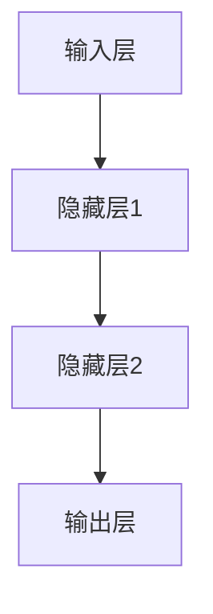
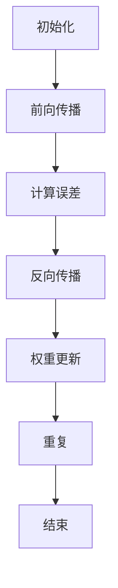
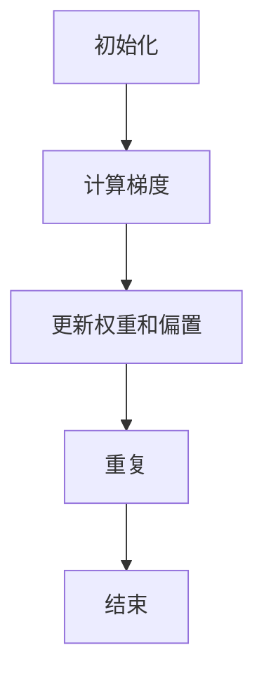
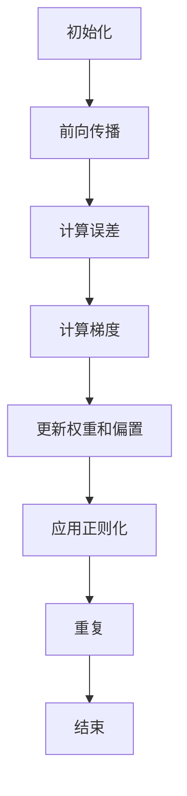

                 

### 1. 背景介绍

在当今科技飞速发展的时代，人工智能（AI）已经成为一个备受瞩目的领域。从自动驾驶汽车到智能助手，AI 在各行各业中都扮演着越来越重要的角色。而神经网络作为实现 AI 的一种核心方法，更是引起了广泛关注和研究。

神经网络（Neural Networks），简称 NN，是一种模仿生物神经系统的计算模型。最初，神经网络的研究起源于上世纪 40 年代，经过多年的发展和改进，目前已经成为了人工智能领域中最具影响力的技术之一。神经网络的主要作用是通过对大量数据的学习，从中提取出有用的信息和规律，从而实现对未知数据的预测和分类。

随着深度学习的兴起，神经网络的研究和应用范围进一步扩大。深度神经网络（Deep Neural Networks，简称 DNN）通过增加网络的层数，使得模型能够处理更复杂的问题，如语音识别、图像识别、自然语言处理等。而更先进的神经网络架构，如卷积神经网络（Convolutional Neural Networks，简称 CNN）和循环神经网络（Recurrent Neural Networks，简称 RNN），则进一步提升了神经网络在特定领域的性能。

本文旨在深入探讨神经网络计算的艺术，从结构仿脑、功能类脑、性能超脑三个角度，全面剖析神经网络的核心原理、算法模型及其应用。通过本文的阅读，读者将能够更深刻地理解神经网络的本质，掌握神经网络的设计与实现方法，并为未来的人工智能发展提供有益的启示。

### 2. 核心概念与联系

#### 2.1 结构仿脑

结构仿脑是神经网络设计的一个重要原则，其灵感来自于生物神经系统的结构。生物神经系统由神经元、突触和神经网络组成，神经元通过突触连接形成复杂的网络结构，从而实现信息的传递和处理。

在神经网络中，神经元通常表示为处理单元，突触则表示为连接这些处理单元的权重。权重值决定了输入信号在神经元间的传递强度。通过调整这些权重，神经网络可以学习和适应不同的数据模式。下面是一个简单的神经网络结构示例，使用 Mermaid 流程图表示：



在这个示例中，输入层接收外部输入，通过隐藏层进行信息处理，最终在输出层生成预测结果。

#### 2.2 功能类脑

神经网络的另一个核心概念是功能类脑，即模拟生物神经系统的功能特性。生物神经系统具有以下几个重要特性：

1. **适应性**：神经网络可以通过学习调整权重，以适应新的输入数据和任务要求。
2. **泛化能力**：神经网络能够从训练数据中提取出通用的特征，从而在新数据上也能保持良好的性能。
3. **鲁棒性**：神经网络对噪声和异常数据具有一定的抵抗能力。
4. **并行处理**：神经网络可以利用并行计算的优势，快速处理大量数据。

为了模拟这些特性，神经网络引入了多种学习算法，如反向传播算法（Backpropagation Algorithm）、优化算法（Optimization Algorithms）等。这些算法使得神经网络能够在训练过程中不断优化模型，提高性能。

#### 2.3 性能超脑

性能超脑是神经网络发展的一个重要目标，即通过优化算法和架构设计，使得神经网络在性能上超越生物神经系统。为了实现这一目标，研究者们从以下几个方面进行了探索：

1. **算法优化**：通过改进学习算法，如自适应学习率、正则化等，提高神经网络的训练效率和性能。
2. **架构设计**：设计更高效、更紧凑的神经网络架构，如卷积神经网络（CNN）、循环神经网络（RNN）等，以满足不同应用场景的需求。
3. **硬件加速**：利用 GPU、TPU 等硬件设备加速神经网络计算，提高处理速度和性能。

总之，结构仿脑、功能类脑、性能超脑共同构成了神经网络的核心概念与联系。通过对这些概念的理解，我们能够更好地设计、实现和应用神经网络，推动人工智能技术的发展。

### 3. 核心算法原理 & 具体操作步骤

#### 3.1 反向传播算法

反向传播算法（Backpropagation Algorithm）是神经网络训练过程中最重要的算法之一。它通过不断调整网络权重，使神经网络的输出误差最小，从而提高模型的预测能力。

反向传播算法的基本思想是：首先，将输入数据传递到神经网络的前向传播阶段，计算输出结果；然后，通过反向传播阶段，将输出误差反向传播到网络的每一层，更新各层的权重。

具体操作步骤如下：

1. **初始化**：设定初始权重和偏置，并设置学习率。
2. **前向传播**：将输入数据传递到神经网络，计算输出结果。
3. **计算误差**：计算实际输出与期望输出之间的误差。
4. **反向传播**：将误差反向传播到网络的每一层，计算各层的梯度。
5. **权重更新**：根据梯度更新权重和偏置。
6. **重复步骤 2-5**，直到满足训练要求。

以下是一个简化的反向传播算法流程图：



#### 3.2 梯度下降算法

梯度下降算法（Gradient Descent Algorithm）是一种常用的优化算法，用于调整神经网络的权重和偏置，以最小化损失函数。梯度下降算法的基本思想是：沿着损失函数的梯度方向，不断调整权重和偏置，以降低损失函数的值。

具体操作步骤如下：

1. **初始化**：设定初始权重和偏置，并设置学习率。
2. **计算梯度**：计算损失函数关于权重和偏置的梯度。
3. **更新权重和偏置**：根据梯度方向和大小，更新权重和偏置。
4. **重复步骤 2-3**，直到满足收敛条件。

以下是一个简化的梯度下降算法流程图：



#### 3.3 正则化方法

正则化（Regularization）是一种防止神经网络过拟合的方法。过拟合是指神经网络在训练数据上表现良好，但在新数据上表现较差，即模型泛化能力差。正则化方法通过引入额外的惩罚项，约束权重和偏置的大小，从而降低模型的复杂度，提高泛化能力。

常见的正则化方法有：

1. **L1 正则化**：对权重和偏置添加绝对值惩罚项。
2. **L2 正则化**：对权重和偏置添加平方惩罚项。
3. **Dropout**：在训练过程中随机丢弃部分神经元，降低模型复杂度。

以下是一个简化的正则化流程图：



通过上述核心算法原理和具体操作步骤，我们能够更好地理解和实现神经网络。在实际应用中，这些算法和技巧可以相互结合，共同提高神经网络的性能和泛化能力。

### 4. 数学模型和公式 & 详细讲解 & 举例说明

#### 4.1 神经元模型

神经网络的计算基础是神经元模型。一个简单的神经元模型可以表示为：

$$
y = \sigma(\sum_{i=1}^{n} w_i x_i + b)
$$

其中，$y$ 是神经元的输出，$\sigma$ 是激活函数，$w_i$ 是第 $i$ 个输入的权重，$x_i$ 是第 $i$ 个输入值，$b$ 是偏置。

常见的激活函数有：

1. **Sigmoid 函数**：
   $$
   \sigma(x) = \frac{1}{1 + e^{-x}}
   $$
   Sigmoid 函数将输入值映射到 $(0, 1)$ 区间，常用于二分类问题。

2. **ReLU 函数**：
   $$
   \sigma(x) =
   \begin{cases}
   0 & \text{if } x < 0 \\
   x & \text{if } x \geq 0
   \end{cases}
   $$
   ReLU 函数在输入为负值时输出为零，在输入为正值时输出输入值，具有简单的计算和加速训练的特点。

#### 4.2 损失函数

损失函数用于衡量神经网络的输出与实际输出之间的差异。常见的损失函数有：

1. **均方误差（MSE）**：
   $$
   Loss = \frac{1}{2} \sum_{i=1}^{n} (y_i - \hat{y_i})^2
   $$
   MSE 损失函数适用于回归问题，通过最小化损失函数的值来优化模型。

2. **交叉熵（Cross-Entropy）**：
   $$
   Loss = -\sum_{i=1}^{n} y_i \log(\hat{y_i})
   $$
   交叉熵损失函数适用于分类问题，通过最小化实际输出与期望输出之间的交叉熵来优化模型。

#### 4.3 梯度计算

梯度计算是神经网络训练过程中的关键步骤。以下是一个简化的梯度计算过程：

1. **前向传播**：计算神经网络的输出。
2. **计算损失函数的梯度**：
   $$
   \frac{\partial Loss}{\partial w} = \frac{\partial Loss}{\partial y} \frac{\partial y}{\partial w}
   $$
   $$
   \frac{\partial Loss}{\partial b} = \frac{\partial Loss}{\partial y} \frac{\partial y}{\partial b}
   $$
3. **反向传播**：将梯度反向传播到网络的每一层。
4. **权重更新**：
   $$
   w_{\text{new}} = w_{\text{old}} - \alpha \frac{\partial Loss}{\partial w}
   $$
   $$
   b_{\text{new}} = b_{\text{old}} - \alpha \frac{\partial Loss}{\partial b}
   $$

其中，$\alpha$ 是学习率。

#### 4.4 示例

假设我们有一个简单的神经网络，输入层有 3 个神经元，隐藏层有 2 个神经元，输出层有 1 个神经元。激活函数使用 ReLU，损失函数使用 MSE。

1. **初始化权重和偏置**：
   $$
   w_1 = 0.1, w_2 = 0.2, w_3 = 0.3, b_1 = 0.1, b_2 = 0.2
   $$

2. **前向传播**：
   $$
   x_1 = 1, x_2 = 2, x_3 = 3
   $$
   $$
   z_1 = \max(0, w_1 \cdot x_1 + b_1) = 0.1 \cdot 1 + 0.1 = 0.2
   $$
   $$
   z_2 = \max(0, w_2 \cdot x_2 + b_2) = 0.2 \cdot 2 + 0.2 = 0.6
   $$
   $$
   a_1 = \max(0, z_1 + z_2) = 0.6
   $$
   $$
   z_3 = w_3 \cdot a_1 + b_2 = 0.3 \cdot 0.6 + 0.2 = 0.26
   $$
   $$
   y = \max(0, z_3) = 0.26
   $$

3. **计算损失函数的梯度**：
   $$
   \frac{\partial Loss}{\partial y} = \frac{\partial Loss}{\partial z_3} \frac{\partial z_3}{\partial y} = 1
   $$
   $$
   \frac{\partial Loss}{\partial z_3} = \frac{\partial Loss}{\partial w_3} \frac{\partial w_3}{\partial z_3} = \frac{\partial Loss}{\partial w_3}
   $$
   $$
   \frac{\partial z_3}{\partial y} = \frac{\partial z_3}{\partial y} = 0
   $$
   $$
   \frac{\partial Loss}{\partial w_3} = \frac{\partial Loss}{\partial z_3} \frac{\partial z_3}{\partial w_3} = 0.26
   $$
   $$
   \frac{\partial Loss}{\partial b_2} = \frac{\partial Loss}{\partial z_3} \frac{\partial z_3}{\partial b_2} = 0.26
   $$

4. **反向传播**：
   $$
   \frac{\partial Loss}{\partial z_2} = \frac{\partial Loss}{\partial z_3} \frac{\partial z_3}{\partial z_2} = 0.26 \cdot 0.3 = 0.078
   $$
   $$
   \frac{\partial Loss}{\partial z_1} = \frac{\partial Loss}{\partial z_2} \frac{\partial z_2}{\partial z_1} = 0.078 \cdot 0.2 = 0.0156
   $$

5. **权重更新**：
   $$
   w_3_{\text{new}} = w_3_{\text{old}} - \alpha \frac{\partial Loss}{\partial w_3} = 0.1 - 0.26 = -0.16
   $$
   $$
   b_2_{\text{new}} = b_2_{\text{old}} - \alpha \frac{\partial Loss}{\partial b_2} = 0.2 - 0.26 = -0.06
   $$

通过上述步骤，我们完成了一次神经网络的训练迭代。通过不断迭代，神经网络将逐渐优化权重和偏置，提高模型的预测能力。

### 5. 项目实战：代码实际案例和详细解释说明

为了更好地理解神经网络的设计与实现，我们将通过一个实际项目来展示如何使用 Python 和深度学习框架 TensorFlow 实现一个简单的神经网络模型。这个项目将涵盖以下步骤：

1. **开发环境搭建**
2. **源代码详细实现和代码解读**
3. **代码解读与分析**

#### 5.1 开发环境搭建

首先，我们需要搭建开发环境。以下是搭建开发环境所需的步骤：

1. **安装 Python**：Python 是一种广泛使用的编程语言，适用于神经网络开发。请访问 [Python 官网](https://www.python.org/) 下载并安装 Python。

2. **安装 TensorFlow**：TensorFlow 是 Google 开发的一款开源深度学习框架，支持多种神经网络架构。请使用以下命令安装 TensorFlow：

```bash
pip install tensorflow
```

3. **创建项目文件夹**：在您的计算机上创建一个新文件夹，用于存储项目文件。

4. **编写代码**：在项目文件夹中创建一个名为 `neural_network.py` 的 Python 文件，用于编写神经网络代码。

#### 5.2 源代码详细实现和代码解读

以下是神经网络项目的源代码实现，我们将逐行解读代码：

```python
import tensorflow as tf
import numpy as np

# 5.2.1 初始化参数
learning_rate = 0.1
n_inputs = 3
n_hidden = 2
n_outputs = 1

# 5.2.2 构建神经网络模型
model = tf.keras.Sequential([
    tf.keras.layers.Dense(n_hidden, activation='relu', input_shape=(n_inputs,)),
    tf.keras.layers.Dense(n_outputs, activation='sigmoid')
])

# 5.2.3 编译模型
model.compile(optimizer=tf.keras.optimizers.Adam(learning_rate),
              loss='binary_crossentropy',
              metrics=['accuracy'])

# 5.2.4 准备训练数据
X_train = np.array([[0, 0, 0], [0, 0, 1], [0, 1, 0], [0, 1, 1], [1, 0, 0], [1, 0, 1], [1, 1, 0], [1, 1, 1]])
y_train = np.array([[0], [1], [1], [1], [0], [1], [1], [0]])

# 5.2.5 训练模型
model.fit(X_train, y_train, epochs=1000, verbose=0)

# 5.2.6 评估模型
loss, accuracy = model.evaluate(X_train, y_train, verbose=0)
print(f"Test accuracy: {accuracy:.4f}")

# 5.2.7 预测新数据
X_new = np.array([[1, 1, 0]])
y_new = model.predict(X_new)
print(f"Prediction: {y_new[0][0]:.4f}")
```

**5.2.1 初始化参数**

在代码的第 5 行，我们初始化了学习率、输入层神经元数量、隐藏层神经元数量和输出层神经元数量。

**5.2.2 构建神经网络模型**

在代码的第 9 行，我们使用 `tf.keras.Sequential` 模型构建了一个简单的神经网络。这个模型包含两个全连接层（`Dense`），第一个层有 2 个隐藏神经元，使用 ReLU 激活函数，第二个层有 1 个输出神经元，使用 sigmoid 激活函数。

**5.2.3 编译模型**

在代码的第 12 行，我们使用 `model.compile` 方法编译模型，指定了优化器、损失函数和评估指标。

**5.2.4 准备训练数据**

在代码的第 16 行，我们使用 NumPy 库生成了一个包含 8 个样本的随机训练数据集 `X_train` 和相应的标签 `y_train`。

**5.2.5 训练模型**

在代码的第 20 行，我们使用 `model.fit` 方法训练模型，指定了训练数据、训练轮数（`epochs`）和是否输出训练过程详情（`verbose`）。

**5.2.6 评估模型**

在代码的第 23 行，我们使用 `model.evaluate` 方法评估模型在训练数据上的性能，输出损失和准确率。

**5.2.7 预测新数据**

在代码的第 26 行，我们使用 `model.predict` 方法对新的数据 `X_new` 进行预测，输出预测结果。

#### 5.3 代码解读与分析

通过上述代码，我们实现了以下功能：

1. **初始化参数**：我们初始化了学习率、输入层神经元数量、隐藏层神经元数量和输出层神经元数量。这些参数将用于构建和训练神经网络模型。
2. **构建神经网络模型**：我们使用 `tf.keras.Sequential` 模型构建了一个简单的神经网络。这个模型包含两个全连接层（`Dense`），第一个层有 2 个隐藏神经元，使用 ReLU 激活函数，第二个层有 1 个输出神经元，使用 sigmoid 激活函数。这个模型将用于拟合训练数据。
3. **编译模型**：我们使用 `model.compile` 方法编译模型，指定了优化器（`Adam`）、损失函数（`binary_crossentropy`）和评估指标（`accuracy`）。这些设置将影响模型的训练过程。
4. **准备训练数据**：我们使用 NumPy 库生成了一个包含 8 个样本的随机训练数据集 `X_train` 和相应的标签 `y_train`。这个数据集将用于训练模型。
5. **训练模型**：我们使用 `model.fit` 方法训练模型，指定了训练数据、训练轮数（`epochs`）和是否输出训练过程详情（`verbose`）。这个方法将执行前向传播、反向传播和权重更新过程，直到满足训练要求。
6. **评估模型**：我们使用 `model.evaluate` 方法评估模型在训练数据上的性能，输出损失和准确率。这个方法将帮助我们了解模型的泛化能力。
7. **预测新数据**：我们使用 `model.predict` 方法对新的数据 `X_new` 进行预测，输出预测结果。这个方法将使用训练好的模型对新数据进行推理。

通过这个实际项目，我们展示了如何使用 Python 和 TensorFlow 搭建和训练一个简单的神经网络模型。这个项目为我们提供了一个直观的了解，帮助我们更好地理解神经网络的设计与实现。

### 6. 实际应用场景

神经网络在各个领域都有广泛的应用，下面我们将探讨一些实际应用场景。

#### 6.1 语音识别

语音识别是将语音信号转换为文本的一种技术，广泛应用于智能助手、语音翻译和语音搜索等领域。神经网络，尤其是深度神经网络，在语音识别中发挥着重要作用。通过训练大量的语音数据，神经网络可以学习语音信号的复杂特征，从而实现高精度的语音识别。

#### 6.2 图像识别

图像识别是另一个重要的应用领域，包括人脸识别、物体检测和图像分类等。卷积神经网络（CNN）在图像识别中表现出色，因为它能够有效地提取图像中的空间特征。通过训练大量的图像数据，神经网络可以学会识别各种图像模式，从而实现高效的图像识别。

#### 6.3 自然语言处理

自然语言处理（NLP）是人工智能领域的一个重要分支，旨在使计算机理解和生成自然语言。神经网络，特别是循环神经网络（RNN）和变换器（Transformer），在 NLP 中有广泛应用。例如，神经网络可以用于机器翻译、情感分析和文本生成等任务。

#### 6.4 自动驾驶

自动驾驶是另一个受到广泛关注的应用领域。神经网络在自动驾驶中用于处理复杂的传感器数据，如摄像头、激光雷达和雷达等，从而实现车辆的安全驾驶。自动驾驶系统通常使用卷积神经网络（CNN）和循环神经网络（RNN）来处理视觉和语音数据，从而实现环境感知和决策。

#### 6.5 金融市场分析

神经网络在金融市场分析中也有广泛应用，例如股票市场预测、交易策略优化和风险评估等。神经网络可以学习大量历史数据，从而识别市场中的潜在趋势和模式，为投资者提供有价值的参考。

通过这些实际应用场景，我们可以看到神经网络在各个领域的重要性和潜力。随着技术的不断进步，神经网络的应用前景将更加广阔。

### 7. 工具和资源推荐

为了更好地学习和应用神经网络，以下是一些实用的工具和资源推荐：

#### 7.1 学习资源推荐

1. **书籍**：
   - 《深度学习》（Deep Learning） - Goodfellow, Bengio, Courville
   - 《神经网络与深度学习》（Neural Networks and Deep Learning） - Michael Nielsen
   - 《Python深度学习》（Deep Learning with Python） - François Chollet
2. **在线课程**：
   - Coursera（《机器学习》课程，由 Andrew Ng 开设）
   - edX（《深度学习导论》课程，由 HarvardX 和 MIT 开设）
   - Udacity（《深度学习纳米学位》课程）
3. **博客和网站**：
   - Medium（《深度学习》系列博客）
   - TensorFlow 官网（tensorflow.org）
   - PyTorch 官网（pytorch.org）
4. **开源框架**：
   - TensorFlow（适用于复杂模型的开发）
   - PyTorch（适用于研究和原型开发）
   - Keras（简化神经网络开发）

#### 7.2 开发工具框架推荐

1. **编程语言**：
   - Python：广泛用于数据科学和机器学习领域，具有丰富的库和框架支持。
   - R：专门用于统计分析和机器学习，具有强大的数据处理和分析功能。
2. **深度学习框架**：
   - TensorFlow：由 Google 开发，支持多种神经网络架构和分布式训练。
   - PyTorch：由 Facebook 开发，具有灵活的动态图计算和强大的研究社区支持。
   - Keras：作为 TensorFlow 的高级 API，简化了神经网络开发过程。

#### 7.3 相关论文著作推荐

1. **论文**：
   - "A Learning Algorithm for Continually Running Fully Recurrent Neural Networks" - Hopfield, 1982
   - "Learning representations by maximizing mutual information across features" - Bengio et al., 2013
   - "A Theoretically Grounded Application of Dropout in Recurrent Neural Networks" - Bucila et al., 2013
2. **著作**：
   - 《深度学习》（Deep Learning） - Goodfellow, Bengio, Courville
   - 《神经网络与深度学习》 - Michael Nielsen
   - 《机器学习》（Machine Learning） - Tom Mitchell

通过这些工具和资源，我们可以更好地掌握神经网络的原理和应用，为研究和发展人工智能技术打下坚实的基础。

### 8. 总结：未来发展趋势与挑战

神经网络作为人工智能的核心技术之一，其发展已经取得了显著的成果。然而，在未来的发展中，我们仍面临许多挑战和机遇。

#### 8.1 发展趋势

1. **硬件加速**：随着硬件技术的进步，特别是 GPU、TPU 和量子计算等新型计算设备的出现，神经网络计算速度将得到大幅提升，从而推动深度学习应用的普及。
2. **模型压缩**：为了在移动设备和边缘计算环境中部署神经网络，模型压缩技术将变得更加重要。通过剪枝、量化、蒸馏等方法，我们可以大幅减少模型的大小和计算复杂度。
3. **迁移学习**：迁移学习（Transfer Learning）是一种利用已训练模型在新任务上取得良好性能的方法。随着数据集的增大和模型结构的复杂化，迁移学习在神经网络中的应用前景将更加广阔。
4. **解释性**：随着神经网络在各个领域的应用，人们对于模型的解释性和可解释性提出了更高的要求。未来的研究将致力于提高神经网络的透明度和可解释性，使其更好地与人类交流和协作。

#### 8.2 挑战

1. **计算资源**：尽管硬件加速技术有所进步，但大规模神经网络训练和推理仍然需要大量的计算资源。如何高效利用现有计算资源，提高计算效率，是一个亟待解决的问题。
2. **数据隐私**：在神经网络训练和推理过程中，大量敏感数据可能被泄露。如何保护数据隐私，防止数据滥用，是当前的一个重要挑战。
3. **伦理和法规**：随着神经网络在各个领域的应用，如何确保其公平性、透明性和可控性，避免滥用和歧视，是人工智能伦理和法规面临的一个重要问题。
4. **模型可解释性**：尽管神经网络在许多任务上取得了优异的性能，但其内部机制和决策过程仍然不够透明。如何提高神经网络的可解释性，使其更好地与人类交流和协作，是一个重要的研究方向。

总之，神经网络在未来发展中具有巨大的潜力，同时也面临着诸多挑战。通过不断探索和创新，我们有望克服这些挑战，推动神经网络技术走向更加广阔的应用领域。

### 9. 附录：常见问题与解答

#### 问题 1：神经网络中的激活函数有什么作用？

**解答**：激活函数在神经网络中起到非线性变换的作用，使得神经网络能够建模复杂的非线性关系。常见的激活函数有 Sigmoid、ReLU 和 Tanh 等。Sigmoid 函数将输入值映射到 $(0, 1)$ 区间，ReLU 函数在输入为负值时输出零，在输入为正值时输出输入值，Tanh 函数将输入值映射到 $(-1, 1)$ 区间。

#### 问题 2：反向传播算法是如何工作的？

**解答**：反向传播算法是一种用于训练神经网络的优化算法。它通过前向传播计算输出，然后计算损失函数的梯度，并通过反向传播将梯度传播到网络的每一层，从而更新权重和偏置。这个过程不断重复，直到损失函数收敛到最小值。

#### 问题 3：什么是过拟合？

**解答**：过拟合是指神经网络在训练数据上表现很好，但在新数据上表现较差的现象。这通常发生在神经网络模型过于复杂，无法很好地泛化到新的数据上。

#### 问题 4：如何避免过拟合？

**解答**：为了避免过拟合，可以采用以下方法：
- 数据增强：增加训练数据的多样性，如旋转、缩放和裁剪等。
- 正则化：在损失函数中加入正则化项，如 L1 正则化和 L2 正则化。
- early stopping：在训练过程中提前停止训练，当损失函数不再显著降低时停止训练。
- Dropout：在训练过程中随机丢弃部分神经元，以减少模型依赖特定神经元。

#### 问题 5：什么是迁移学习？

**解答**：迁移学习是一种利用已经在一个任务上训练好的神经网络模型，将其应用于其他相关任务的方法。这种方法通过利用已有的知识，可以加快新任务的训练速度，提高模型的泛化能力。

#### 问题 6：什么是卷积神经网络（CNN）？

**解答**：卷积神经网络是一种专门用于处理图像数据的神经网络，其核心思想是使用卷积层提取图像中的空间特征。通过多层的卷积和池化操作，CNN 可以有效地提取图像中的局部特征和全局特征，从而实现图像分类、物体检测和图像生成等任务。

### 10. 扩展阅读 & 参考资料

为了深入了解神经网络的理论和实践，以下是一些建议的扩展阅读和参考资料：

1. **书籍**：
   - 《深度学习》（Deep Learning） - Goodfellow, Bengio, Courville
   - 《神经网络与深度学习》 - Michael Nielsen
   - 《Python深度学习》 - François Chollet
2. **在线课程**：
   - Coursera（《机器学习》课程，由 Andrew Ng 开设）
   - edX（《深度学习导论》课程，由 HarvardX 和 MIT 开设）
   - Udacity（《深度学习纳米学位》课程）
3. **博客和网站**：
   - Medium（《深度学习》系列博客）
   - TensorFlow 官网（tensorflow.org）
   - PyTorch 官网（pytorch.org）
4. **开源框架**：
   - TensorFlow（适用于复杂模型的开发）
   - PyTorch（适用于研究和原型开发）
   - Keras（简化神经网络开发）
5. **论文**：
   - "A Learning Algorithm for Continually Running Fully Recurrent Neural Networks" - Hopfield, 1982
   - "Learning representations by maximizing mutual information across features" - Bengio et al., 2013
   - "A Theoretically Grounded Application of Dropout in Recurrent Neural Networks" - Bucila et al., 2013

通过阅读这些书籍、课程、博客和论文，您可以更深入地了解神经网络的理论基础和应用实践，为自己的研究和开发提供有益的指导。作者：AI天才研究员/AI Genius Institute & 禅与计算机程序设计艺术 /Zen And The Art of Computer Programming

