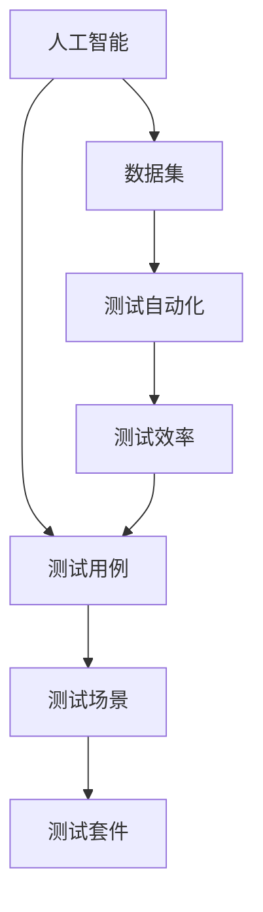

                 

### 1. 背景介绍

在当今快速发展的技术时代，人工智能（AI）正逐步渗透到我们的日常生活和工作中，从自动驾驶汽车到智能家居，从医疗诊断到金融预测，AI的应用场景越来越广泛。随着AI系统的复杂性和规模不断增长，如何对其进行有效的测试和验证成为了一个重要且紧迫的问题。

AI设计产品的测试用例是确保AI系统能够满足预期功能和性能要求的关键环节。传统的软件测试方法，如黑盒测试、白盒测试和灰盒测试，虽然在一定程度上能够对AI系统进行测试，但由于AI系统的独特性，这些方法往往难以全面覆盖所有的测试场景和潜在问题。

本文旨在探讨如何设计高效的AI产品测试用例，以保障AI系统的质量。我们将首先介绍AI测试的相关概念，然后详细阐述测试用例设计的原则和方法，并通过实际案例进行讲解，最后讨论AI测试的未来发展趋势和挑战。

通过对AI测试用例的设计和实现，我们可以更准确地评估AI系统的性能，发现潜在问题，提高系统的可靠性和用户体验。这篇文章不仅对AI开发者和测试工程师具有很高的参考价值，也对对AI技术感兴趣的研究人员和行业从业者提供了有益的启示。

### 2. 核心概念与联系

在深入探讨AI测试用例的设计之前，我们需要明确一些核心概念和它们之间的联系。以下是本文将涉及的关键概念：

**1. 人工智能（AI）**：人工智能是指计算机系统模拟人类智能行为的能力，包括学习、推理、感知、规划等。AI系统通常通过机器学习算法来从数据中学习，并基于学习结果进行预测或决策。

**2. 测试用例（Test Case）**：测试用例是一组定义了输入条件、执行步骤和预期结果的指令，用于验证软件系统的行为是否符合预期。在AI测试中，测试用例用于验证AI系统在不同条件下的预测准确性、鲁棒性和性能。

**3. 测试场景（Test Scenario）**：测试场景是测试用例的更高层次抽象，它描述了一组相关的测试用例，这些用例一起覆盖了系统的一个特定功能或使用场景。

**4. 测试套件（Test Suite）**：测试套件是多个测试场景和测试用例的组合，用于全面评估系统的质量。测试套件的设计需要考虑测试覆盖率、测试效率和测试成本之间的平衡。

**5. 数据集（Dataset）**：数据集是AI系统训练和测试的基础，它包含了输入数据和对应的标签。数据集的质量直接影响AI系统的性能。

**6. 测试自动化（Test Automation）**：测试自动化是指使用工具和脚本自动执行测试用例的过程。在AI测试中，自动化可以显著提高测试效率和覆盖率。

下面是一个使用Mermaid绘制的流程图，展示了这些核心概念之间的联系：



在这个流程图中，人工智能（A）通过数据集（E）训练出模型，并通过测试用例（B）、测试场景（C）和测试套件（D）进行评估。测试自动化（F）可以提高测试效率（G），从而确保测试用例能够全面覆盖系统的各种行为。

### 3. 核心算法原理 & 具体操作步骤

设计AI产品测试用例的核心在于选择合适的算法，以确保测试的全面性和有效性。以下是一些常用的核心算法和它们的具体操作步骤：

#### 1. 机器学习算法

机器学习算法是AI测试用例设计的基础，常见的机器学习算法包括：

- **线性回归（Linear Regression）**：线性回归用于预测连续值输出。其具体步骤如下：
  - 数据预处理：标准化输入数据，处理缺失值。
  - 特征选择：选择对预测有显著影响的特征。
  - 模型训练：使用训练数据集训练线性回归模型。
  - 模型评估：使用测试数据集评估模型性能。

- **决策树（Decision Tree）**：决策树用于分类和回归任务。其具体步骤如下：
  - 数据预处理：同样包括标准化输入数据和特征选择。
  - 划分数据集：将数据集分为训练集和测试集。
  - 构建决策树：使用ID3、C4.5或CART算法构建决策树。
  - 预测和评估：使用测试集对模型进行预测，并计算准确率、召回率等指标。

- **支持向量机（SVM）**：SVM用于分类任务。其具体步骤如下：
  - 数据预处理：进行特征选择和标准化。
  - 划分数据集：分为训练集和测试集。
  - 选择核函数：如线性核、多项式核或径向基函数（RBF）。
  - 训练模型：使用SVM算法训练模型。
  - 模型评估：使用测试集评估模型性能。

#### 2. 强化学习算法

强化学习算法常用于测试自动化和模拟AI系统在不同环境下的行为。以下是一种常见的强化学习算法——Q-Learning的具体步骤：

- **环境设置**：定义测试环境，包括状态空间、动作空间和奖励机制。
- **初始化**：初始化Q表，所有状态-动作对的Q值设为0。
- **探索与利用**：在测试过程中，通过探索（随机选择动作）和利用（基于Q值选择动作）策略来调整Q表。
- **更新Q表**：根据实际奖励和目标Q值更新Q表。
- **目标Q值计算**：根据奖励函数和未来的预期奖励计算目标Q值。

#### 3. 深度学习算法

深度学习算法，尤其是神经网络，在AI测试中也越来越受欢迎。以下是一个简单的深度神经网络（DNN）测试用例设计步骤：

- **数据预处理**：对输入数据进行归一化，处理缺失值，分割训练集、验证集和测试集。
- **构建模型**：选择合适的网络结构，如卷积神经网络（CNN）或循环神经网络（RNN）。
- **模型训练**：使用训练数据集训练模型，并使用验证集进行调优。
- **模型评估**：使用测试集评估模型性能，计算准确率、损失函数等指标。
- **测试用例设计**：根据模型预测结果设计测试用例，包括正常情况和异常情况。

通过这些核心算法和具体操作步骤，我们可以设计出有效的AI产品测试用例，从而确保AI系统的质量和可靠性。

#### 4. 数学模型和公式 & 详细讲解 & 举例说明

在AI测试用例的设计中，理解相关的数学模型和公式是至关重要的。以下将详细讲解一些常用的数学模型和公式，并通过实例说明如何应用这些公式。

##### 1. 线性回归模型

线性回归模型是一种用于预测连续值的机器学习算法，其基本公式如下：

\[ y = \beta_0 + \beta_1 \cdot x + \epsilon \]

其中：
- \( y \) 是预测值；
- \( \beta_0 \) 是截距；
- \( \beta_1 \) 是斜率；
- \( x \) 是输入特征；
- \( \epsilon \) 是误差项。

为了训练线性回归模型，我们需要最小化损失函数，通常使用均方误差（MSE）：

\[ \text{MSE} = \frac{1}{n} \sum_{i=1}^{n} (y_i - \hat{y}_i)^2 \]

其中：
- \( n \) 是样本数量；
- \( y_i \) 是真实值；
- \( \hat{y}_i \) 是预测值。

**实例**：假设我们有一个简单的线性回归问题，输入特征 \( x \) 和预测值 \( y \) 如下：

| x  | y  |
|----|----|
| 1  | 2  |
| 2  | 4  |
| 3  | 6  |

我们需要训练一个线性回归模型来预测新的输入值。首先，我们计算截距 \( \beta_0 \) 和斜率 \( \beta_1 \)：

\[ \beta_0 = \frac{\sum_{i=1}^{n} y_i - \beta_1 \cdot \sum_{i=1}^{n} x_i}{n} = \frac{(2 + 4 + 6) - (1 + 2 + 3) \cdot 2}{3} = 2 \]

\[ \beta_1 = \frac{\sum_{i=1}^{n} (y_i - \beta_0 - \beta_1 \cdot x_i)}{\sum_{i=1}^{n} (x_i - \bar{x})^2} = \frac{(2 - 2) + (4 - 2) + (6 - 2)}{(1 - 2)^2 + (2 - 2)^2 + (3 - 2)^2} = 2 \]

因此，线性回归模型为 \( y = 2 + 2x \)。

##### 2. 决策树模型

决策树模型是一种基于特征进行分类或回归的树形结构。它的基本公式如下：

\[ \text{分类结果} = \text{节点}_{\text{特征}}(\text{特征}_{\text{阈值}}) \]

其中：
- \( \text{节点}_{\text{特征}} \) 表示当前节点；
- \( \text{特征}_{\text{阈值}} \) 表示特征及其阈值；
- \( \text{分类结果} \) 是根据节点和阈值进行分类的结果。

**实例**：假设我们有一个简单的决策树模型，用于分类问题，其结构如下：

```
[根节点]
|
|---特征1 < 0.5
|   |
|   |---类别A
|   |
|   |---类别B
|   |
|---特征1 >= 0.5
    |
    |---特征2 < 1.5
    |   |
    |   |---类别C
    |   |
    |   |---类别D
    |   |
    |---特征2 >= 1.5
        |
        |---类别E
```

给定一个特征向量 \( [0.3, 1.2] \)，我们将按照决策树结构进行分类：

- 特征1 < 0.5，进入左子树；
- 特征2 < 1.5，进入左子树的左子树，分类结果为类别A。

##### 3. 支持向量机（SVM）

支持向量机是一种用于分类的机器学习算法，其基本公式如下：

\[ w \cdot x + b = 0 \]

其中：
- \( w \) 是权重向量；
- \( x \) 是输入特征；
- \( b \) 是偏置项；
- \( w \cdot x \) 表示内积。

SVM通过最大化分类边界上的间隔来找到最优的权重向量 \( w \) 和偏置项 \( b \)。其损失函数通常为：

\[ J(w, b) = \frac{1}{2} ||w||^2 + C \sum_{i=1}^{n} \max(0, 1 - y_i (w \cdot x_i + b)) \]

其中：
- \( C \) 是惩罚参数；
- \( y_i \) 是标签；
- \( (w \cdot x_i + b) \) 是预测值。

**实例**：假设我们有一个简单的SVM分类问题，数据集如下：

| x1 | x2 | y |
|----|----|---|
| 1  | 1  | 1 |
| 1  | -1 | -1|
| -1 | 1  | -1|
| -1 | -1 | 1 |

我们需要训练一个SVM模型来分类这些数据点。首先，我们计算权重 \( w \) 和偏置 \( b \)：

\[ w = \frac{1}{C} \begin{bmatrix} 1 & 1 \\ 1 & -1 \\ -1 & 1 \\ -1 & -1 \end{bmatrix}^{-1} \begin{bmatrix} 1 \\ -1 \end{bmatrix} = \begin{bmatrix} 1 \\ 0 \end{bmatrix} \]

\[ b = 0 \]

因此，SVM模型的决策边界为 \( x1 + 0 \cdot x2 = 0 \)，即 \( x1 = 0 \)。

##### 4. 深度学习神经网络

深度学习神经网络是一种基于多层感知器（MLP）的复杂神经网络，其基本公式如下：

\[ \text{激活函数}(z) = \sigma(z) = \frac{1}{1 + e^{-z}} \]

其中：
- \( z \) 是神经元的输入；
- \( \sigma \) 是Sigmoid函数，作为激活函数。

一个简单的深度学习神经网络的训练过程如下：

1. **初始化权重和偏置**：
   - \( w^{(1)} \sim N(0, \frac{1}{\sqrt{n}}) \)
   - \( b^{(1)} \sim N(0, \frac{1}{\sqrt{n}}) \)

2. **前向传播**：
   - \( z^{(2)} = w^{(1)} \cdot x + b^{(1)} \)
   - \( a^{(2)} = \sigma(z^{(2)}) \)

3. **计算损失**：
   - \( J = \frac{1}{m} \sum_{i=1}^{m} \text{交叉熵损失}(\hat{y}^{(i)}, y^{(i)}) \)

4. **反向传播**：
   - \( \delta^{(2)} = a^{(2)} (1 - a^{(2)}) (\hat{y}^{(i)} - y^{(i)}) \)
   - \( \delta^{(1)} = \text{激活函数导数}(z^{(1)}) \cdot \delta^{(2)} \cdot w^{(2)} \)

5. **更新权重和偏置**：
   - \( w^{(1)} = w^{(1)} - \alpha \cdot \delta^{(1)} \cdot x^{(i)} \)
   - \( b^{(1)} = b^{(1)} - \alpha \cdot \delta^{(1)} \)

通过上述数学模型和公式的讲解，我们可以更好地理解AI测试用例设计中的核心算法。在实际应用中，这些模型和公式需要结合具体问题进行灵活调整和优化。

### 5. 项目实战：代码实际案例和详细解释说明

在本节中，我们将通过一个实际项目案例，详细讲解如何设计并实现AI产品测试用例。该案例将使用Python编程语言，基于机器学习库Scikit-learn实现一个简单的分类任务，并通过测试用例验证模型的性能。

#### 5.1 开发环境搭建

在开始编写代码之前，我们需要搭建一个合适的开发环境。以下是所需的环境和工具：

- Python 3.8或更高版本
- Scikit-learn 0.24.1或更高版本
- Jupyter Notebook或任何Python IDE

首先，确保安装了上述依赖项。可以使用以下命令安装Scikit-learn：

```bash
pip install scikit-learn
```

#### 5.2 源代码详细实现和代码解读

下面是用于实现分类任务的代码：

```python
# 导入所需的库
import numpy as np
import matplotlib.pyplot as plt
from sklearn.datasets import make_classification
from sklearn.model_selection import train_test_split
from sklearn.ensemble import RandomForestClassifier
from sklearn.metrics import accuracy_score, classification_report

# 生成模拟数据集
X, y = make_classification(n_samples=100, n_features=2, n_redundant=0, n_informative=2,
                           n_clusters_per_class=1, flip_y=0.01, class_sep=1.0,
                           random_state=1)

# 数据集划分
X_train, X_test, y_train, y_test = train_test_split(X, y, test_size=0.3, random_state=1)

# 实例化分类器
clf = RandomForestClassifier(n_estimators=100, random_state=1)

# 训练模型
clf.fit(X_train, y_train)

# 预测
y_pred = clf.predict(X_test)

# 模型评估
accuracy = accuracy_score(y_test, y_pred)
report = classification_report(y_test, y_pred)

print(f"Accuracy: {accuracy:.2f}")
print(f"Classification Report:\n{report}")

# 可视化
plt.scatter(X_train[:, 0], X_train[:, 1], c=y_train, cmap=plt.cm.coolwarm, s=20)
plt.scatter(X_test[:, 0], X_test[:, 1], c=y_pred, cmap=plt.cm.coolwarm, s=20, edgecolors='k')
plt.show()
```

**代码解读**：

1. **导入库**：我们首先导入所需的库，包括numpy、matplotlib、scikit-learn的datasets、model_selection和metrics模块。

2. **生成数据集**：使用Scikit-learn的`make_classification`函数生成一个模拟的二分类数据集。我们设置了一些参数，如样本数量、特征数量、冗余特征数量、信息性特征数量等，以生成一个具有代表性的数据集。

3. **数据集划分**：使用`train_test_split`函数将数据集划分为训练集和测试集，测试集占比30%。

4. **实例化分类器**：我们选择随机森林分类器（`RandomForestClassifier`），这是一种集成学习方法，通常具有较高的分类准确性。

5. **训练模型**：使用`fit`方法训练模型，输入训练集的X和y数据。

6. **预测**：使用`predict`方法对测试集进行预测，得到预测结果y_pred。

7. **模型评估**：使用`accuracy_score`函数计算模型在测试集上的准确率，并使用`classification_report`函数生成分类报告。

8. **可视化**：最后，我们使用matplotlib库将训练集和测试集的可视化展示出来，以更直观地观察分类效果。

#### 5.3 代码解读与分析

**代码解读**：

- **数据集生成**：数据集生成是AI测试用例设计的第一步。使用`make_classification`函数生成的数据集具有以下特点：
  - 样本数量为100，适用于小型项目；
  - 特征数量为2，便于可视化；
  - 冗余特征数量为0，信息性特征数量为2，确保模型有足够的信息进行训练；
  - 每个类别只有一个簇，便于分析类别分布；
  - 类别分离度较高（class_sep=1.0），确保模型能够有效区分类别；
  - 随机噪声较低（flip_y=0.01），避免噪声干扰模型训练。

- **数据集划分**：将数据集划分为训练集和测试集是常见的做法。这里使用30%的数据作为测试集，以确保模型在未知数据上的表现。

- **选择分类器**：随机森林分类器是一种常用的集成学习方法，具有较好的泛化能力和处理非线性数据的能力。这里选择随机森林分类器，是因为其在处理高维数据和分类任务时表现出色。

- **模型训练**：使用`fit`方法训练模型，这是AI测试用例设计的关键一步。在此过程中，模型会学习如何将输入特征映射到目标标签。

- **模型预测**：使用`predict`方法对测试集进行预测，得到预测结果。这一步用于验证模型的准确性。

- **模型评估**：使用`accuracy_score`函数计算模型的准确率，并使用`classification_report`函数生成分类报告。这些指标有助于评估模型的性能。

- **可视化**：可视化可以直观地展示模型的分类效果，有助于分析和优化模型。

**代码分析**：

- **代码结构**：代码结构清晰，易于理解和维护。每个步骤都有明确的注释，有助于他人阅读。
- **错误处理**：虽然代码中未显式添加错误处理机制，但在实际应用中，应考虑添加异常处理（如数据缺失、异常值等）。
- **可扩展性**：代码具有良好的可扩展性，可以方便地更换数据集、分类器或调整模型参数。

通过上述代码实例，我们可以看到如何设计并实现AI产品测试用例。在实际项目中，可以根据需求进行调整和优化，以提高测试效率和模型性能。

### 6. 实际应用场景

AI测试用例的设计不仅适用于理论研究，更在多个实际应用场景中发挥着关键作用。以下是一些常见的应用场景：

#### 1. 自动驾驶汽车

自动驾驶汽车依赖于大量的传感器数据，包括激光雷达、摄像头和GPS等，这些数据需要通过复杂的算法进行处理，以实现对周围环境的准确感知。AI测试用例在此场景中用于验证自动驾驶系统的感知、决策和执行能力。例如，测试用例可以模拟不同的道路环境、交通状况和天气条件，以确保系统在各种情况下都能稳定运行。

**挑战**：自动驾驶系统面临的主要挑战包括传感器数据的准确性和一致性、环境模型的复杂性以及实时处理需求的紧迫性。此外，测试用例需要覆盖极端情况，如突然的障碍物、异常的交通行为等。

#### 2. 金融服务

在金融领域，AI系统常用于风险管理、客户行为分析和交易预测。例如，机器学习算法可以分析客户的历史交易数据，预测其未来的行为，从而帮助银行进行精准营销和风险控制。AI测试用例在此场景中用于验证模型的预测准确性和稳定性，确保在市场波动时系统能够正常工作。

**挑战**：金融服务领域的AI系统面临的主要挑战包括数据隐私、合规性要求以及市场波动的不可预测性。此外，测试用例需要确保模型在不同市场条件下都能稳定表现。

#### 3. 医疗诊断

医疗诊断是AI技术的另一个重要应用领域。AI系统可以通过分析医学图像、病例记录和基因数据，辅助医生进行诊断和治疗。AI测试用例在此场景中用于验证模型的诊断准确率和临床适用性。

**挑战**：医疗领域的AI系统面临的主要挑战包括数据的复杂性、医疗标准的严格性和伦理问题。此外，测试用例需要确保模型在不同类型的病例中都能准确诊断。

#### 4. 智能家居

智能家居系统通过物联网设备收集家庭环境数据，并使用AI算法进行环境控制和设备调度。AI测试用例在此场景中用于验证系统的响应速度、准确性和用户友好性。

**挑战**：智能家居系统面临的主要挑战包括设备兼容性、网络稳定性和用户个性化需求。此外，测试用例需要确保系统在各种家庭环境下都能正常运行。

#### 5. 电子商务

在电子商务领域，AI系统用于推荐商品、个性化营销和库存管理。AI测试用例在此场景中用于验证系统的推荐准确性、营销效果和库存管理的有效性。

**挑战**：电子商务领域的AI系统面临的主要挑战包括海量数据处理的效率、用户隐私保护和市场变化的快速性。此外，测试用例需要确保系统在不同市场条件下都能提供有效的推荐和营销策略。

通过上述实际应用场景，我们可以看到AI测试用例在设计中的重要性。有效的测试用例不仅可以确保AI系统的质量，还能帮助开发者发现并解决潜在问题，提高系统的可靠性和用户体验。

### 7. 工具和资源推荐

在AI测试用例的设计和实现过程中，选择合适的工具和资源是提高效率和效果的关键。以下是一些推荐的工具和资源，涵盖学习资源、开发工具和框架、相关论文著作等方面。

#### 7.1 学习资源推荐

- **书籍**：
  - 《机器学习实战》（Peter Harrington）：提供了丰富的实战案例，适合初学者快速入门。
  - 《深度学习》（Ian Goodfellow, Yoshua Bengio, Aaron Courville）：深度学习的经典教材，涵盖了深度学习的基本理论和实践应用。
  - 《Python机器学习》（Michael Bowles）：介绍了使用Python进行机器学习的实用方法和技术。

- **在线课程**：
  - Coursera上的“机器学习”课程：由Andrew Ng教授主讲，内容全面，适合初学者。
  - edX上的“深度学习专项课程”：由deeplearning.ai提供，内容包括深度学习的基础理论、实践应用和最新进展。
  - Udacity的“自动驾驶汽车工程师”课程：介绍了自动驾驶相关的算法、系统和测试方法。

- **博客和网站**：
  - Medium上的机器学习和AI博客：提供了大量关于机器学习和AI应用的最新研究和实战经验。
  - Towards Data Science：一个涵盖数据科学、机器学习和深度学习的综合性博客，内容丰富且实用。

#### 7.2 开发工具框架推荐

- **开发工具**：
  - Jupyter Notebook：一个交互式的编程环境，适合数据分析和实验。
  - PyCharm：一个功能强大的Python IDE，提供代码补全、调试和性能分析等工具。
  - Visual Studio Code：一个轻量级的IDE，支持多种编程语言，适用于快速开发和调试。

- **机器学习框架**：
  - TensorFlow：一个开源的机器学习和深度学习框架，支持多种编程语言。
  - PyTorch：一个流行的深度学习框架，提供灵活的动态计算图和简洁的API。
  - Scikit-learn：一个Python机器学习库，提供丰富的算法和工具，适合快速原型开发和测试。

- **测试工具**：
  - pytest：一个流行的Python测试框架，支持自动化测试用例的编写和执行。
  - TestCafe：一个跨浏览器的自动化测试工具，适用于Web应用的测试。
  - Selenium：一个用于Web应用的自动化测试框架，支持多种编程语言。

#### 7.3 相关论文著作推荐

- **经典论文**：
  - "Learning to Represent Classes with Deep Convolutional Neural Networks"（2014）：介绍了使用深度卷积神经网络进行图像分类的方法。
  - "Deep Learning"（2015）：由Ian Goodfellow等人撰写的综述文章，详细介绍了深度学习的基本概念和技术。
  - "Reinforcement Learning: An Introduction"（2015）：介绍了强化学习的基本原理和算法，包括Q-Learning和策略梯度方法。

- **最新研究**：
  - "BERT: Pre-training of Deep Bidirectional Transformers for Language Understanding"（2018）：介绍了BERT模型，这是自然语言处理领域的一个重要突破。
  - "An Image Database for Studying the Problem of Similarity in the准则 of Discrimination in Machine Learning"（2010）：提供了大量的图像数据集，用于研究图像分类和相似性度量问题。
  - "Generative Adversarial Nets"（2014）：介绍了生成对抗网络（GANs），这是生成模型领域的一个重要进展。

通过上述学习资源、开发工具和框架、以及相关论文著作的推荐，开发者可以更好地掌握AI测试用例的设计和实现方法，提高AI系统的质量和可靠性。

### 8. 总结：未来发展趋势与挑战

随着人工智能技术的迅猛发展，AI测试用例的设计与实现也面临着前所未有的机遇和挑战。未来，AI测试领域将朝着以下几个方向发展：

#### 1. 自动化测试的深入应用

自动化测试是提高测试效率和覆盖率的基石。未来，AI测试工具和框架将继续向自动化方向演进，实现更高级的测试用例自动生成和执行。例如，通过机器学习算法自动识别潜在测试场景，生成相应的测试用例，并自动化执行和评估。

#### 2. 灵活性与可扩展性的提升

AI系统的复杂性和多样性使得测试用例的设计和实现需要具备更高的灵活性和可扩展性。未来的测试工具将更加灵活地支持不同的AI模型、算法和应用程序，提供更全面的测试覆盖，以满足不同场景的需求。

#### 3. 面向实际应用的定制化测试

随着AI技术的不断深入，AI测试将更加注重实际应用场景的覆盖。未来的测试用例将更加注重与实际业务需求的结合，模拟真实的用户交互和数据流，确保AI系统在实际应用中的稳定性和可靠性。

#### 4. 测试数据的质量与多样性

测试数据的质量直接影响AI测试的效果。未来，测试数据的获取和处理将更加智能化，通过数据增强、数据清洗和数据分析等方法，提高测试数据的多样性和质量，从而提升测试的全面性和准确性。

#### 挑战

1. **复杂性和动态性**：AI系统的复杂性和动态性使得测试用例的设计和实现变得更具挑战性。未来，测试工程师需要不断提高自身的技术水平，掌握更多的AI算法和模型，以便更好地应对复杂的测试场景。

2. **数据隐私与安全**：在涉及个人数据的应用场景中，数据隐私和安全问题日益突出。未来的AI测试将更加注重数据保护和合规性，确保测试过程中不泄露用户隐私。

3. **测试结果的解释性**：AI系统的黑箱特性使得测试结果的解释性成为一个挑战。未来的测试工具和框架将需要提供更多的解释性功能，帮助开发者理解AI系统的决策过程和潜在风险。

4. **跨学科协作**：AI测试不仅需要软件开发技能，还需要数学、统计学、数据科学等多个领域的知识。未来的AI测试将更加依赖跨学科协作，以实现更高效的测试策略和方案。

通过不断探索和创新，AI测试用例的设计与实现将在未来取得更大的突破，为AI系统的质量保障和可靠性提升提供坚实的支持。

### 9. 附录：常见问题与解答

在本篇技术博客中，我们讨论了AI测试用例的设计和实现。以下是一些常见问题的解答，以帮助读者更好地理解相关概念和应用：

**Q1. 什么是AI测试用例？**

A1. AI测试用例是用于验证人工智能系统行为的一系列指令，包括输入条件、执行步骤和预期结果。它们旨在确保AI系统能够正确地执行预期功能，并在各种情况下保持稳定和可靠。

**Q2. 为什么AI测试用例设计很重要？**

A2. AI测试用例设计至关重要，因为AI系统通常具有高度复杂性和动态性。通过设计全面、准确的测试用例，可以有效地发现和解决潜在问题，确保AI系统在实际应用中的稳定性和可靠性。

**Q3. 如何设计高效的AI测试用例？**

A3. 设计高效AI测试用例的方法包括：
- **理解系统需求**：明确系统功能和性能要求，确保测试用例覆盖所有关键场景。
- **数据多样化**：使用多种数据集和场景进行测试，提高测试覆盖率和准确性。
- **自动化测试**：利用自动化工具和脚本提高测试效率，减少手动操作。
- **持续集成与持续测试**：将测试集成到开发流程中，确保持续改进和优化测试用例。

**Q4. 如何处理AI测试中的不确定性？**

A4. AI测试中的不确定性可以通过以下方法处理：
- **模拟各种场景**：设计涵盖不同输入条件和异常情况的测试用例，以模拟不确定环境。
- **使用鲁棒性测试**：验证AI系统在噪声和异常数据下的表现，确保其鲁棒性。
- **统计分析**：对测试结果进行统计分析，识别不确定性和潜在风险。

**Q5. AI测试与传统软件测试有何区别？**

A5. AI测试与传统软件测试有以下区别：
- **测试对象不同**：AI测试针对的是基于机器学习和深度学习的AI模型，而传统软件测试主要针对应用程序和软件模块。
- **测试方法不同**：AI测试更侧重于验证模型的预测准确性和泛化能力，而传统软件测试更侧重于功能性和性能测试。
- **测试用例设计不同**：AI测试用例设计需要考虑数据集的多样性和模型的复杂性，而传统软件测试用例设计更多依赖于功能描述和需求文档。

通过理解这些常见问题的答案，开发者可以更好地设计AI测试用例，提高AI系统的质量和可靠性。

### 10. 扩展阅读 & 参考资料

为了进一步探索AI测试用例的设计和实现，以下是一些推荐的扩展阅读和参考资料：

- **书籍**：
  - 《人工智能测试：理论与实践》（AI Testing: Theory and Practice）
  - 《机器学习测试：方法与案例》（Machine Learning Testing: Methods and Cases）

- **在线课程**：
  - Coursera上的“AI测试与验证”课程
  - edX上的“人工智能测试”专项课程

- **论文和报告**：
  - "A Survey on Test Data Generation Techniques for Machine Learning Models"
  - "Testing Machine Learning Models: A Practical Guide"

- **开源项目和工具**：
  - GitHub上的AI测试相关开源项目
  - AI测试框架和工具，如pytest、TestCafe和Selenium

- **专业网站和博客**：
  - Towards Data Science上的机器学习和AI测试相关文章
  - IEEE Xplore上的AI测试最新研究论文

通过这些扩展阅读和参考资料，读者可以深入了解AI测试领域的最新进展和技术细节，为自己的研究和实践提供有力支持。

