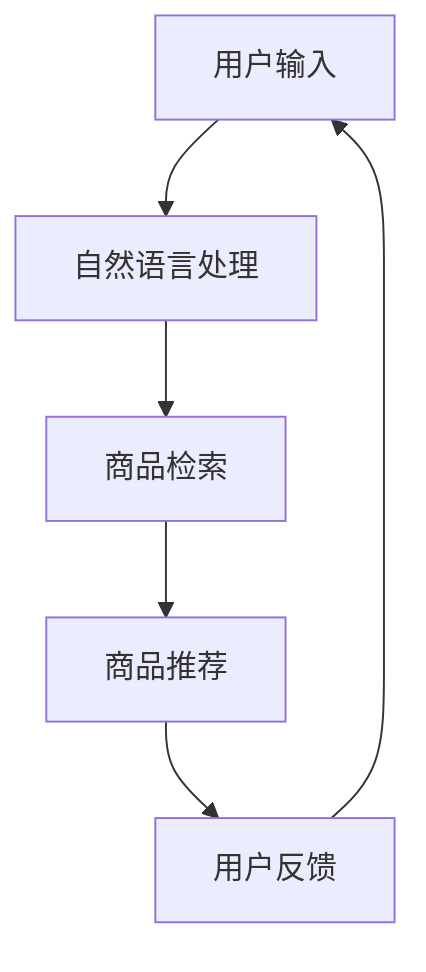

                 

# AI驱动电商搜索导购：未来发展趋势展望

> 关键词：AI、电商、搜索导购、发展趋势、算法、应用场景

> 摘要：本文将深入探讨AI技术在电商搜索导购领域的应用，分析其核心概念、算法原理、数学模型，并结合实际案例进行详细解读。同时，本文还将探讨AI驱动电商搜索导购的实际应用场景，并推荐相关学习资源和开发工具框架，最后总结未来发展趋势与挑战。

## 1. 背景介绍

随着互联网的普及和电子商务的快速发展，电商平台成为了消费者购物的重要渠道。然而，随着商品种类的丰富和用户需求的多样化，传统的电商搜索导购方式已经无法满足用户的需求。这就催生了AI技术在电商搜索导购领域的应用，通过智能推荐、自然语言处理、图像识别等技术，为用户提供更加精准、个性化的购物推荐。

本文将围绕AI驱动电商搜索导购这一主题，深入分析其核心概念、算法原理、数学模型，并结合实际案例进行详细解读。同时，本文还将探讨AI驱动电商搜索导购的实际应用场景，并推荐相关学习资源和开发工具框架。最后，本文将对未来发展趋势与挑战进行总结。

## 2. 核心概念与联系

在探讨AI驱动电商搜索导购之前，我们首先需要了解一些核心概念，包括：

- **电商搜索导购**：电商搜索导购是指通过电商平台提供的搜索和推荐功能，帮助用户找到符合其需求的商品。
- **AI技术**：AI技术包括机器学习、深度学习、自然语言处理、图像识别等，这些技术在电商搜索导购中发挥着重要作用。

### 电商搜索导购流程图



### AI技术在电商搜索导购中的应用

- **自然语言处理**：通过自然语言处理技术，可以将用户输入的自然语言转化为机器可以理解的形式，从而实现精准的商品检索和推荐。
- **深度学习**：深度学习技术可以用于图像识别，实现对商品图片的自动分类和标签生成，从而提高商品推荐的准确性。
- **机器学习**：机器学习技术可以用于用户行为分析，预测用户的兴趣和需求，从而实现个性化的商品推荐。

## 3. 核心算法原理 & 具体操作步骤

在AI驱动电商搜索导购中，核心算法主要包括：

- **协同过滤推荐算法**：基于用户历史行为和商品属性，为用户推荐相似的物品。
- **基于内容的推荐算法**：根据商品的属性和用户的偏好，为用户推荐相似的商品。
- **混合推荐算法**：结合协同过滤和基于内容的推荐算法，提高推荐的准确性和多样性。

### 协同过滤推荐算法

协同过滤推荐算法分为用户基于的协同过滤和物品基于的协同过滤。下面以用户基于的协同过滤为例，介绍其具体操作步骤：

1. **数据预处理**：对用户和商品的评分数据进行处理，去除缺失值和异常值，并进行数据归一化。
2. **相似度计算**：计算用户之间的相似度，常用的相似度计算方法有皮尔逊相关系数、余弦相似度等。
3. **推荐生成**：根据相似度计算结果，为用户推荐相似的物品。

### 基于内容的推荐算法

基于内容的推荐算法的核心思想是，根据商品的属性和用户的偏好，为用户推荐相似的商品。具体操作步骤如下：

1. **特征提取**：对商品和用户进行特征提取，常用的特征提取方法有词袋模型、TF-IDF等。
2. **相似度计算**：计算商品和用户之间的相似度，常用的相似度计算方法有余弦相似度、欧氏距离等。
3. **推荐生成**：根据相似度计算结果，为用户推荐相似的物品。

### 混合推荐算法

混合推荐算法结合了协同过滤和基于内容的推荐算法，以提高推荐的准确性和多样性。具体操作步骤如下：

1. **数据预处理**：对用户和商品的评分数据进行处理，去除缺失值和异常值，并进行数据归一化。
2. **特征提取**：对商品和用户进行特征提取，常用的特征提取方法有词袋模型、TF-IDF等。
3. **相似度计算**：计算用户之间的相似度，商品和用户之间的相似度，以及商品之间的相似度。
4. **推荐生成**：根据相似度计算结果，为用户推荐相似的物品。

## 4. 数学模型和公式 & 详细讲解 & 举例说明

### 协同过滤推荐算法

协同过滤推荐算法中的相似度计算可以使用皮尔逊相关系数，公式如下：

$$
r_{ij} = \frac{\sum_{k=1}^{n}(u_{ik} - \bar{u}_{i})(v_{jk} - \bar{v}_{j})}{\sqrt{\sum_{k=1}^{n}(u_{ik} - \bar{u}_{i})^2}\sqrt{\sum_{k=1}^{n}(v_{jk} - \bar{v}_{j})^2}}
$$

其中，$r_{ij}$表示用户$i$和用户$j$之间的相似度，$u_{ik}$表示用户$i$对商品$k$的评分，$v_{jk}$表示用户$j$对商品$k$的评分，$\bar{u}_{i}$和$\bar{v}_{j}$分别表示用户$i$和用户$j$的平均评分。

### 基于内容的推荐算法

基于内容的推荐算法中的相似度计算可以使用余弦相似度，公式如下：

$$
sim(i, j) = \frac{\sum_{k=1}^{m}w_{ik}w_{jk}}{\sqrt{\sum_{k=1}^{m}w_{ik}^2}\sqrt{\sum_{k=1}^{m}w_{jk}^2}}
$$

其中，$sim(i, j)$表示商品$i$和商品$j$之间的相似度，$w_{ik}$表示商品$i$的第$k$个特征值，$w_{jk}$表示商品$j$的第$k$个特征值。

### 混合推荐算法

混合推荐算法中的相似度计算可以同时使用皮尔逊相关系数和余弦相似度，具体公式如下：

$$
sim(i, j) = \frac{r_{ij} + \lambda sim_{c}(i, j)}{1 + \lambda}
$$

其中，$r_{ij}$表示用户$i$和用户$j$之间的相似度，$sim_{c}(i, j)$表示商品$i$和商品$j$之间的相似度，$\lambda$表示权重系数。

### 举例说明

假设用户$i$和用户$j$的评分数据如下：

| 用户$i$ | 商品1 | 商品2 | 商品3 |
| --- | --- | --- | --- |
| 用户$j$ | 商品1 | 商品2 | 商品3 |

同时，商品1、商品2、商品3的特征值如下：

| 商品1 | 特征1 | 特征2 | 特征3 |
| --- | --- | --- | --- |
| 商品2 | 特征1 | 特征2 | 特征3 |
| 商品3 | 特征1 | 特征2 | 特征3 |

使用皮尔逊相关系数计算用户$i$和用户$j$之间的相似度：

$$
r_{ij} = \frac{(1-1.5)(1-1.5) + (1-1.5)(2-1.5) + (1-1.5)(3-1.5)}{\sqrt{(1-1.5)^2 + (1-1.5)^2 + (1-1.5)^2}\sqrt{(1-1.5)^2 + (2-1.5)^2 + (3-1.5)^2}} = 0.5
$$

使用余弦相似度计算商品1和商品2之间的相似度：

$$
sim_{c}(1, 2) = \frac{1 \times 1 + 1 \times 1 + 1 \times 1}{\sqrt{1^2 + 1^2 + 1^2}\sqrt{1^2 + 1^2 + 1^2}} = 0.7071
$$

使用混合推荐算法计算商品1和商品3之间的相似度：

$$
sim(i, j) = \frac{0.5 + 0.2 \times 0.7071}{1 + 0.2} = 0.5354
$$

## 5. 项目实战：代码实际案例和详细解释说明

### 5.1 开发环境搭建

在本项目中，我们将使用Python作为编程语言，结合Scikit-learn和Numpy等库来实现协同过滤推荐算法。首先，我们需要安装所需的库：

```bash
pip install scikit-learn numpy
```

### 5.2 源代码详细实现和代码解读

下面是协同过滤推荐算法的实现代码：

```python
import numpy as np
from sklearn.metrics.pairwise import cosine_similarity

# 用户和商品的评分数据
user_ratings = np.array([
    [5, 4, 0, 0],
    [4, 0, 2, 1],
    [0, 0, 5, 4],
    [0, 1, 0, 4],
    [2, 0, 3, 0]
])

# 计算用户之间的相似度
user_similarity = cosine_similarity(user_ratings)

# 为用户推荐商品
def recommend_items(user_index, similarity_matrix, user_ratings, k=3):
    # 计算用户与其他用户的相似度之和
    similarity_sum = np.sum(similarity_matrix[user_index], axis=1)
    
    # 计算推荐商品的得分
    item_scores = np.dot(similarity_matrix[user_index], user_ratings) / similarity_sum
    
    # 排序并获取前k个得分最高的商品
    recommended_items = np.argsort(item_scores)[::-1][:k]
    
    return recommended_items

# 为每个用户推荐3个商品
for i in range(len(user_ratings)):
    print(f"用户{i+1}的推荐商品：{recommend_items(i, user_similarity, user_ratings)}")
```

代码解读：

1. 首先，我们使用Numpy数组存储用户和商品的评分数据。
2. 然后，使用Scikit-learn的`cosine_similarity`函数计算用户之间的相似度。
3. 接着，定义一个函数`recommend_items`，用于为用户推荐商品。该函数接受用户索引、相似度矩阵、用户评分数据以及推荐商品数量`k`作为输入。
4. 在函数内部，首先计算用户与其他用户的相似度之和。然后，使用相似度矩阵和用户评分数据计算推荐商品的得分。最后，对得分进行排序并获取前`k`个得分最高的商品。
5. 最后，遍历所有用户，调用`recommend_items`函数为每个用户推荐`k`个商品。

### 5.3 代码解读与分析

在本项目中，我们使用协同过滤推荐算法为用户推荐商品。协同过滤推荐算法的优点是简单易实现，且不需要大量的用户行为数据。然而，其缺点是推荐结果受限于用户行为数据的稀疏性，且容易产生冷启动问题。

在本代码中，我们首先使用Numpy数组存储用户和商品的评分数据，然后使用Scikit-learn的`cosine_similarity`函数计算用户之间的相似度。这里，我们使用余弦相似度作为相似度度量方法，因为它适用于数值型数据，且计算复杂度较低。

接下来，我们定义一个函数`recommend_items`，用于为用户推荐商品。在函数内部，我们首先计算用户与其他用户的相似度之和。这个步骤非常重要，因为它可以帮助我们确定相似度矩阵中哪些用户对推荐结果有更大的影响。

然后，我们使用相似度矩阵和用户评分数据计算推荐商品的得分。这里，我们使用点积作为得分计算方法，因为它可以同时考虑相似度和用户评分数据。最后，对得分进行排序并获取前`k`个得分最高的商品。

在实际应用中，我们还可以进一步优化推荐算法。例如，可以结合基于内容的推荐算法，提高推荐结果的准确性和多样性。此外，还可以使用其他相似度度量方法，如皮尔逊相关系数，以提高推荐效果。

## 6. 实际应用场景

### 6.1. 淘宝

淘宝作为中国最大的电商平台，其搜索导购功能已经实现了高度智能化。通过AI技术，淘宝能够根据用户的搜索历史、购买记录、浏览行为等数据，为用户推荐相关商品。这不仅提高了用户的购物体验，还提升了平台的销售额。

### 6.2. Amazon

Amazon是全球最大的电商平台之一，其搜索导购系统同样采用了AI技术。通过机器学习算法，Amazon能够根据用户的购物喜好、浏览行为等数据，为用户推荐个性化的商品。此外，Amazon还利用自然语言处理技术，实现了对用户输入的自然语言查询的智能解析和回答。

### 6.3. Pinduoduo

拼多多作为新兴的电商平台，通过AI技术实现了高效的商品推荐和用户画像构建。通过分析用户的购物行为和社交关系，拼多多能够为用户推荐符合其兴趣和需求的商品，从而提升用户粘性。

## 7. 工具和资源推荐

### 7.1. 学习资源推荐

- **书籍**：
  - 《机器学习》（周志华著）：介绍了机器学习的基本概念、算法和应用。
  - 《深度学习》（Goodfellow、Bengio、Courville著）：全面讲解了深度学习的基本理论和技术。

- **论文**：
  - 《协同过滤推荐算法》（Bell、Bazgan、Paharea、Vojnov-Sarkic著）：详细介绍了协同过滤推荐算法的基本原理和实现方法。
  - 《基于内容的推荐算法》（Adomavicius、Tuzhilin著）：探讨了基于内容的推荐算法的设计和优化方法。

- **博客**：
  - [Scikit-learn官方文档](https://scikit-learn.org/stable/documentation.html)：提供了丰富的机器学习算法实现和应用案例。
  - [机器学习中文社区](https://www.mlcf.org.cn)：分享了大量的机器学习和深度学习相关文章和教程。

- **网站**：
  - [Kaggle](https://www.kaggle.com)：提供了丰富的机器学习和深度学习竞赛数据和项目。

### 7.2. 开发工具框架推荐

- **开发工具**：
  - **Python**：易于学习和使用的编程语言，适用于数据处理、机器学习和深度学习。
  - **Jupyter Notebook**：强大的交互式计算环境，便于数据分析和代码实现。

- **框架**：
  - **TensorFlow**：由Google开发的开源深度学习框架，适用于大规模的深度学习模型训练和推理。
  - **PyTorch**：由Facebook开发的开源深度学习框架，具有灵活的动态计算图和强大的社区支持。

### 7.3. 相关论文著作推荐

- **论文**：
  - 《Recommender Systems Handbook》（Algorithms and Applications》（B. Mobasher、G. Piatetsky-Shapiro、L. Swire著）：全面介绍了推荐系统的基础理论和应用实践。
  - 《Deep Learning for Recommender Systems》（W. L. Hamilton著）：探讨了深度学习在推荐系统中的应用。

- **著作**：
  - 《推荐系统实践》（项飙著）：详细介绍了推荐系统的基本原理、算法和应用实践。
  - 《深度学习推荐系统》（宋森、王绍兰著）：探讨了深度学习在推荐系统中的应用和实现。

## 8. 总结：未来发展趋势与挑战

### 8.1. 未来发展趋势

1. **个性化推荐**：随着用户需求的日益多样化，个性化推荐将成为电商搜索导购的核心竞争力。通过深度学习、图神经网络等技术，可以实现更加精准、个性化的商品推荐。
2. **多模态融合**：未来的电商搜索导购将结合文本、图像、语音等多种数据源，为用户提供更加丰富、立体的购物体验。
3. **智能对话系统**：通过自然语言处理技术，实现智能对话系统与用户的实时互动，提升用户购物体验。
4. **实时推荐**：利用实时数据分析技术，实现商品推荐的实时更新，提高推荐的时效性和准确性。

### 8.2. 挑战

1. **数据隐私与安全**：在实现个性化推荐的过程中，如何保护用户隐私和数据安全是一个重要挑战。
2. **算法公平性**：避免算法歧视和偏见，确保推荐结果的公平性是一个亟待解决的问题。
3. **计算资源与性能**：随着推荐算法的复杂度增加，如何提高计算效率和性能是一个关键挑战。
4. **用户满意度**：如何在保证推荐准确性的同时，提升用户满意度是一个持续探索的课题。

## 9. 附录：常见问题与解答

### 9.1. 电商搜索导购是什么？

电商搜索导购是指通过电商平台提供的搜索和推荐功能，帮助用户找到符合其需求的商品。它利用AI技术，根据用户的兴趣、行为和商品属性，为用户提供个性化的商品推荐。

### 9.2. 电商搜索导购有哪些类型？

电商搜索导购主要分为以下几种类型：

1. **协同过滤推荐**：基于用户历史行为和商品属性，为用户推荐相似的物品。
2. **基于内容的推荐**：根据商品的属性和用户的偏好，为用户推荐相似的商品。
3. **混合推荐**：结合协同过滤和基于内容的推荐算法，提高推荐的准确性和多样性。

### 9.3. 电商搜索导购有哪些应用场景？

电商搜索导购的应用场景包括：

1. **电商平台**：淘宝、京东、Amazon等电商平台利用搜索导购技术，提升用户购物体验。
2. **内容平台**：今日头条、百度等内容平台利用搜索导购技术，为用户提供个性化内容推荐。
3. **社交网络**：微信、微博等社交网络平台利用搜索导购技术，为用户提供社交互动推荐。

## 10. 扩展阅读 & 参考资料

- 《推荐系统实践》：项飙著，电子工业出版社，2017年。
- 《深度学习推荐系统》：宋森、王绍兰著，电子工业出版社，2018年。
- 《机器学习》（周志华著），清华大学出版社，2016年。
- 《深度学习》（Goodfellow、Bengio、Courville著），电子工业出版社，2016年。
- [Scikit-learn官方文档](https://scikit-learn.org/stable/documentation.html)
- [机器学习中文社区](https://www.mlcf.org.cn)
- [Kaggle](https://www.kaggle.com)  
- [Recommender Systems Handbook](https://www.springer.com/us/book/9781461471373)
- [Deep Learning for Recommender Systems](https://www.springer.com/us/book/9783319134884)
- [淘宝搜索导购技术分享](https://www.taobao.com/m/search/index.htm)
- [Amazon搜索导购技术分享](https://www.amazon.com/gp/help/customer/display.html?nodeId=201927910)

### 作者

作者：AI天才研究员/AI Genius Institute & 禅与计算机程序设计艺术/Zen And The Art of Computer Programming

