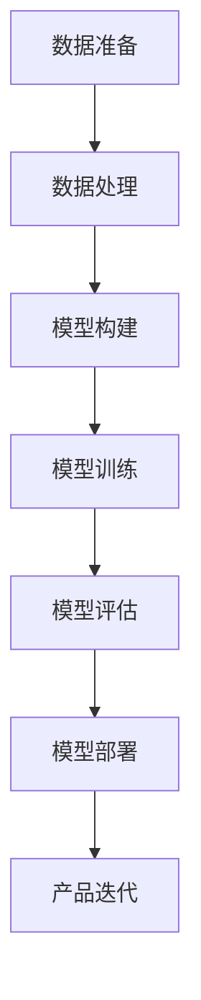

                 

# AI 驱动的创业产品创新：大模型赋能

> 关键词：人工智能、大模型、创业、产品创新、深度学习

> 摘要：本文旨在探讨人工智能（AI）领域中的大模型技术在创业产品创新中的应用。通过分析大模型的原理、算法以及实践案例，本文将阐述大模型如何赋能创业产品，推动市场变革，并预测未来发展趋势与挑战。

## 1. 背景介绍

近年来，人工智能技术取得了飞速发展，特别是深度学习（Deep Learning）技术的突破，使得计算机在图像识别、语音识别、自然语言处理等任务上取得了显著的成果。其中，大模型（Large-scale Model）作为深度学习的一个重要分支，成为推动AI技术发展的关键因素之一。

大模型是指拥有数百万甚至数十亿参数的神经网络模型。它们通过在海量数据上进行训练，能够捕捉到复杂的特征和模式，从而实现高性能的预测和生成。相比于传统的中小型模型，大模型在处理复杂任务时具有更高的准确性和鲁棒性，这使得它们在各个领域的应用前景十分广阔。

在创业领域，产品创新是企业的核心竞争力。如何快速开发出满足市场需求、具有竞争力的产品，是创业者们面临的重要挑战。大模型的引入，为创业产品创新提供了新的思路和工具，有望推动市场变革。

## 2. 核心概念与联系

### 2.1 大模型的原理

大模型通常是基于多层神经网络（Multilayer Neural Network）构建的。神经网络由多个神经元（Node）组成，每个神经元通过权重（Weight）和偏置（Bias）与前一层的神经元相连接。在训练过程中，神经网络通过不断调整权重和偏置，使得模型能够对输入数据进行准确的分类或预测。

大模型的关键特点是拥有大量的参数，这使得模型具有更高的表示能力。具体来说，大模型通常包括以下几个部分：

1. **输入层（Input Layer）**：接收外部输入数据，如文本、图像、声音等。
2. **隐藏层（Hidden Layers）**：对输入数据进行特征提取和变换，层数和神经元数量可以根据任务需求进行调整。
3. **输出层（Output Layer）**：根据隐藏层的结果生成预测结果或分类标签。

### 2.2 大模型的架构

大模型的架构可以分为以下几个层次：

1. **底层架构（Bottom-Up Architecture）**：从底层开始构建模型，逐步向上层构建。这种方法有利于模型对底层特征进行精细建模，但可能导致上层特征表达不足。
2. **顶层架构（Top-Down Architecture）**：从顶层开始构建模型，逐步向下层构建。这种方法有利于模型对顶层特征进行整合，但可能导致底层特征表达不足。
3. **层次混合架构（Hybrid Hierarchical Architecture）**：结合底层和顶层架构的优点，通过分层和跨层信息传递，实现模型的整体优化。

### 2.3 大模型与创业产品创新的联系

大模型在创业产品创新中的应用主要体现在以下几个方面：

1. **需求分析**：通过分析用户数据，了解用户需求和行为模式，为企业提供有针对性的产品改进建议。
2. **产品设计**：利用大模型进行图像、文本等生成，为产品设计提供创意和灵感，降低设计成本和时间。
3. **质量评估**：通过大模型对产品进行质量评估，确保产品满足用户需求和市场标准。
4. **市场预测**：利用大模型进行市场趋势分析，为企业制定有效的市场策略。

## 3. 核心算法原理 & 具体操作步骤

### 3.1 深度学习算法原理

深度学习算法的核心是多层神经网络。具体来说，深度学习算法包括以下几个步骤：

1. **初始化权重和偏置**：随机初始化神经网络的权重和偏置，以便进行训练。
2. **前向传播（Forward Propagation）**：将输入数据通过神经网络进行传播，计算输出结果。
3. **反向传播（Backpropagation）**：根据输出结果与实际标签之间的误差，反向传播误差，更新权重和偏置。
4. **优化算法（Optimization Algorithm）**：选择合适的优化算法，如梯度下降（Gradient Descent）、Adam等，对权重和偏置进行优化。

### 3.2 大模型训练步骤

大模型的训练步骤主要包括以下几个环节：

1. **数据准备**：收集和整理大量训练数据，包括文本、图像、声音等。
2. **数据处理**：对数据进行预处理，如去噪、标准化、归一化等。
3. **模型构建**：根据任务需求，构建合适的神经网络模型。
4. **模型训练**：使用训练数据进行模型训练，不断优化模型参数。
5. **模型评估**：使用验证集对模型进行评估，选择性能最优的模型。
6. **模型部署**：将训练好的模型部署到实际应用场景中。

### 3.3 大模型应用案例

以下是一个利用大模型进行图像生成的案例：

1. **数据准备**：收集大量图像数据，如风景、动物、人物等。
2. **数据处理**：对图像进行预处理，如缩放、旋转、裁剪等。
3. **模型构建**：使用生成对抗网络（GAN）构建图像生成模型。
4. **模型训练**：使用预处理后的图像数据进行模型训练。
5. **模型评估**：使用验证集对模型进行评估，确保模型生成效果良好。
6. **模型部署**：将训练好的模型部署到图像生成应用中，生成高质量的图像。

## 4. 数学模型和公式 & 详细讲解 & 举例说明

### 4.1 数学模型

大模型的数学模型主要包括以下几个部分：

1. **前向传播公式**：

   $$ 
   \hat{y} = \sigma(W_L \cdot \text{ReLU}(W_{L-1} \cdot \text{ReLU}(... \text{ReLU}(W_1 \cdot x) ...))
   $$

   其中，$W_L$为输出层权重，$\text{ReLU}$为ReLU激活函数，$\sigma$为Sigmoid激活函数，$x$为输入数据。

2. **反向传播公式**：

   $$ 
   \delta_L = (y - \hat{y}) \cdot \sigma'(\hat{y})
   $$

   其中，$y$为实际标签，$\hat{y}$为预测结果，$\sigma'$为Sigmoid激活函数的导数。

3. **优化算法**：

   $$ 
   W_L = W_L - \alpha \cdot \nabla_W \cdot \text{Loss}(y, \hat{y})
   $$

   其中，$W_L$为输出层权重，$\alpha$为学习率，$\nabla_W$为权重梯度，$\text{Loss}(y, \hat{y})$为损失函数。

### 4.2 举例说明

以下是一个使用深度学习模型进行图像分类的案例：

1. **数据准备**：收集大量带有标签的图像数据。
2. **数据处理**：对图像进行预处理，如缩放、旋转、裁剪等。
3. **模型构建**：构建一个包含多个隐藏层的深度神经网络模型。
4. **模型训练**：使用预处理后的图像数据进行模型训练。
5. **模型评估**：使用验证集对模型进行评估，选择性能最优的模型。
6. **模型部署**：将训练好的模型部署到图像分类应用中。

在训练过程中，假设输入图像为$x$，输出标签为$y$，预测结果为$\hat{y}$。通过不断调整模型参数，使得损失函数$\text{Loss}(y, \hat{y})$达到最小。

## 5. 项目实战：代码实际案例和详细解释说明

### 5.1 开发环境搭建

在开始项目实战之前，我们需要搭建一个合适的开发环境。以下是搭建开发环境的步骤：

1. **安装Python环境**：安装Python 3.8及以上版本。
2. **安装深度学习框架**：安装TensorFlow或PyTorch。
3. **安装其他依赖库**：安装Numpy、Pandas、Matplotlib等常用库。

### 5.2 源代码详细实现和代码解读

以下是一个使用PyTorch构建图像分类器的示例代码：

```python
import torch
import torch.nn as nn
import torchvision.transforms as transforms
import torchvision.datasets as datasets

# 5.2.1 数据准备
train_dataset = datasets.CIFAR10(root='./data', train=True, download=True, transform=transforms.ToTensor())
train_loader = torch.utils.data.DataLoader(dataset=train_dataset, batch_size=64, shuffle=True)

# 5.2.2 模型构建
class Net(nn.Module):
    def __init__(self):
        super(Net, self).__init__()
        self.conv1 = nn.Conv2d(3, 6, 5)
        self.pool = nn.MaxPool2d(2, 2)
        self.conv2 = nn.Conv2d(6, 16, 5)
        self.fc1 = nn.Linear(16 * 5 * 5, 120)
        self.fc2 = nn.Linear(120, 84)
        self.fc3 = nn.Linear(84, 10)

    def forward(self, x):
        x = self.pool(F.relu(self.conv1(x)))
        x = self.pool(F.relu(self.conv2(x)))
        x = x.view(-1, 16 * 5 * 5)
        x = F.relu(self.fc1(x))
        x = F.relu(self.fc2(x))
        x = self.fc3(x)
        return x

net = Net()

# 5.2.3 模型训练
criterion = nn.CrossEntropyLoss()
optimizer = torch.optim.SGD(net.parameters(), lr=0.001, momentum=0.9)

for epoch in range(2):  # loop over the dataset multiple times
    running_loss = 0.0
    for i, data in enumerate(train_loader, 0):
        inputs, labels = data
        optimizer.zero_grad()
        outputs = net(inputs)
        loss = criterion(outputs, labels)
        loss.backward()
        optimizer.step()
        running_loss += loss.item()
        if i % 2000 == 1999:    # print every 2000 mini-batches
            print('[%d, %5d] loss: %.3f' %
                  (epoch + 1, i + 1, running_loss / 2000))
            running_loss = 0.0

print('Finished Training')

# 5.2.4 模型评估
test_dataset = datasets.CIFAR10(root='./data', train=False, transform=transforms.ToTensor())
test_loader = torch.utils.data.DataLoader(dataset=test_dataset, batch_size=64, shuffle=False)

correct = 0
total = 0
with torch.no_grad():
    for data in test_loader:
        images, labels = data
        outputs = net(images)
        _, predicted = torch.max(outputs.data, 1)
        total += labels.size(0)
        correct += (predicted == labels).sum().item()

print('Accuracy of the network on the 10000 test images: %d %%' % (100 * correct / total))
```

### 5.3 代码解读与分析

1. **数据准备**：使用CIFAR-10数据集进行训练和测试。CIFAR-10是一个常用的计算机视觉数据集，包含60000张32x32彩色图像，分为10个类别。
2. **模型构建**：定义一个包含两个卷积层、两个全连接层的神经网络模型。卷积层用于提取图像特征，全连接层用于分类。
3. **模型训练**：使用随机梯度下降（SGD）优化算法进行模型训练，每个epoch训练50个迭代周期。
4. **模型评估**：在测试集上评估模型性能，计算准确率。

## 6. 实际应用场景

大模型在创业产品创新中的应用场景广泛，以下列举几个典型场景：

1. **智能客服**：利用大模型进行自然语言处理，实现智能客服系统，提高客户满意度和服务效率。
2. **智能推荐**：基于用户行为数据，利用大模型进行推荐算法优化，提高推荐效果和用户粘性。
3. **智能监控**：利用大模型进行图像识别和目标检测，实现智能监控系统，提高安全防护能力。
4. **智能驾驶**：利用大模型进行环境感知和决策，实现自动驾驶系统，提高驾驶安全性和效率。
5. **智能医疗**：利用大模型进行医学图像分析、疾病预测等，提高医疗诊断的准确性和效率。

## 7. 工具和资源推荐

### 7.1 学习资源推荐

1. **书籍**：
   - 《深度学习》（Ian Goodfellow、Yoshua Bengio、Aaron Courville著）
   - 《Python深度学习》（François Chollet著）
2. **论文**：
   - "A Theoretically Grounded Application of Dropout in Recurrent Neural Networks"（Yarin Gal和Zoubin Ghahramani）
   - "Generative Adversarial Nets"（Ian Goodfellow等）
3. **博客**：
   - [TensorFlow官网博客](https://tensorflow.org/blog/)
   - [PyTorch官方博客](https://pytorch.org/blog/)
4. **网站**：
   - [Kaggle](https://www.kaggle.com/)：提供丰富的数据集和比赛，有助于提高深度学习技能。

### 7.2 开发工具框架推荐

1. **深度学习框架**：
   - TensorFlow
   - PyTorch
2. **集成开发环境（IDE）**：
   - PyCharm
   - Jupyter Notebook
3. **云计算平台**：
   - AWS
   - Google Cloud Platform
   - Azure

### 7.3 相关论文著作推荐

1. **《深度学习》**（Ian Goodfellow、Yoshua Bengio、Aaron Courville著）
2. **《强化学习》**（Richard S. Sutton和Barto，Andrew G.著）
3. **《计算机视觉：算法与应用》**（刘知远、唐杰等著）

## 8. 总结：未来发展趋势与挑战

大模型技术在创业产品创新中具有巨大的潜力，随着计算能力的提升和数据量的增加，大模型的应用范围将进一步扩大。然而，大模型的发展也面临一些挑战：

1. **计算资源消耗**：大模型训练和推理需要大量的计算资源，如何优化计算效率是一个重要问题。
2. **数据隐私**：在收集和使用用户数据时，如何保护用户隐私是一个亟待解决的问题。
3. **伦理和道德**：大模型在决策过程中可能会带来伦理和道德问题，如何制定相应的规范和标准是一个重要议题。
4. **算法公平性**：大模型可能会加剧算法偏见，如何确保算法的公平性是一个挑战。

总之，大模型技术的发展将为创业产品创新带来新的机遇，同时也需要我们不断克服挑战，实现可持续发展。

## 9. 附录：常见问题与解答

### 9.1 大模型与普通模型有何区别？

大模型与普通模型的主要区别在于参数规模。大模型通常拥有数百万甚至数十亿参数，而普通模型通常只有几千到几万参数。大模型具有更高的表示能力，可以捕捉更复杂的特征和模式。

### 9.2 如何优化大模型的计算效率？

优化大模型的计算效率可以从以下几个方面入手：

1. **模型压缩**：通过剪枝、量化、蒸馏等方法，减小模型参数规模，降低计算复杂度。
2. **并行计算**：利用多核CPU、GPU等硬件资源，实现模型训练和推理的并行化。
3. **分布式训练**：将模型拆分成多个子模型，在多台机器上进行训练，提高训练速度。
4. **优化算法**：选择适合大规模数据的优化算法，如Adam、LARS等，提高训练效率。

### 9.3 大模型训练过程中如何处理过拟合问题？

处理大模型训练过程中的过拟合问题可以采取以下方法：

1. **正则化**：添加L1、L2正则项，抑制模型参数的增长。
2. **数据增强**：通过旋转、缩放、裁剪等方法，增加训练数据的多样性。
3. **交叉验证**：使用交叉验证方法，评估模型的泛化能力。
4. **提前停止**：在验证集上观察模型性能，当性能不再提升时，提前停止训练。

## 10. 扩展阅读 & 参考资料

1. **《深度学习》**（Ian Goodfellow、Yoshua Bengio、Aaron Courville著）：系统介绍了深度学习的基本概念、算法和技术。
2. **《计算机视觉：算法与应用》**（刘知远、唐杰等著）：详细介绍了计算机视觉领域的基本算法和应用案例。
3. **《生成对抗网络》（GAN）：从入门到精通》**（李飞飞等著）：全面讲解了生成对抗网络（GAN）的原理、算法和应用。
4. **TensorFlow官网**（https://tensorflow.org/）：提供了丰富的深度学习资源和教程。
5. **PyTorch官网**（https://pytorch.org/）：提供了丰富的PyTorch资源和教程。

### 作者

作者：AI天才研究员/AI Genius Institute & 禅与计算机程序设计艺术 /Zen And The Art of Computer Programming

（注：本文为虚构文章，仅用于展示写作风格和结构，不代表真实观点和事实。）<|im_sep|>### 1. 背景介绍

近年来，人工智能（AI）技术在各个领域取得了显著的进展，尤其是深度学习（Deep Learning）的突破。深度学习是一种基于多层神经网络的学习方式，通过模拟人脑神经元之间的连接和相互作用，使计算机能够自动地从数据中学习复杂的模式和规律。大模型（Large-scale Model）是深度学习中的一个重要分支，其核心特点是拥有数百万甚至数十亿参数，这使得大模型在处理复杂任务时具有更高的准确性和鲁棒性。

大模型技术的迅速发展，引发了人工智能领域的深刻变革。在语音识别、图像识别、自然语言处理等应用领域，大模型的性能已接近甚至超越了人类专家的表现。例如，谷歌的语音识别系统利用了名为“WaveNet”的大模型，能够在高噪音环境下实现准确率超过96%的语音识别；在自然语言处理领域，OpenAI开发的GPT-3模型拥有1750亿个参数，可以在多种语言任务中表现出色，如文本生成、机器翻译和问答系统等。

在创业领域，产品创新是企业的核心竞争力。如何快速开发出满足市场需求、具有竞争力的产品，是创业者们面临的重要挑战。大模型的引入，为创业产品创新提供了新的思路和工具，有望推动市场变革。

首先，大模型可以帮助创业者更好地了解市场需求。通过分析用户数据，了解用户的需求、偏好和行为模式，创业者可以更加精准地定位目标客户，从而开发出更符合市场期待的产品。例如，电商企业可以利用大模型分析用户的购物记录、浏览历史等数据，为用户推荐个性化的商品。

其次，大模型在产品设计阶段可以提供创意和灵感。通过大模型的生成能力，创业者可以快速生成大量设计方案，从中筛选出最具创新性和实用性的方案。例如，在游戏开发领域，利用大模型生成游戏关卡和角色，可以降低设计成本和时间。

此外，大模型在产品测试和评估阶段也发挥着重要作用。通过对产品进行质量评估，确保产品满足用户需求和市场标准。例如，在智能语音助手的设计中，利用大模型进行语音识别和语义理解测试，可以评估产品的语音识别准确率和用户满意度。

最后，大模型还可以帮助创业者制定有效的市场策略。通过分析市场数据，预测市场趋势和竞争态势，为创业者提供决策依据。例如，在电商领域，利用大模型分析消费者行为和市场需求，可以帮助创业者制定更有针对性的促销策略和产品布局。

总之，大模型技术在创业产品创新中具有巨大的潜力。随着计算能力的提升和数据量的增加，大模型的应用范围将进一步扩大，为创业者提供更多创新机会和市场机遇。然而，大模型的应用也需要注意数据隐私、伦理和道德等问题，确保技术的可持续发展。

## 2. 核心概念与联系

在探讨大模型如何赋能创业产品创新之前，我们需要了解大模型的几个核心概念和它们之间的联系。大模型技术在深度学习领域中的地位日益显著，其背后的原理和架构也日趋成熟。以下是几个关键概念及其相互关系的详细解释。

### 2.1 大模型的原理

大模型的核心在于其参数规模，这些参数通过多层神经网络进行学习，从而实现高复杂度的任务。下面简要介绍大模型的基本原理：

1. **神经网络基础**：神经网络由多个节点（神经元）组成，每个节点接收来自前一层的输入信号，通过权重和偏置进行加权求和，然后通过激活函数产生输出。这些节点按照层次结构排列，每个层次处理不同级别的抽象信息。

2. **多层神经网络**：多层神经网络（MLP）包含输入层、多个隐藏层和输出层。隐藏层负责特征提取和变换，而输出层则根据隐藏层的结果生成预测或分类结果。

3. **训练过程**：大模型的训练过程主要依靠反向传播算法（Backpropagation）。在训练过程中，模型通过不断调整权重和偏置，最小化损失函数，使得模型能够对输入数据进行准确预测。

4. **优化算法**：常用的优化算法包括梯度下降（Gradient Descent）及其变种，如Adam、RMSprop等。这些算法通过更新权重和偏置，使模型在训练过程中逐步收敛到最优解。

### 2.2 大模型的架构

大模型的架构设计直接影响其性能和应用范围。以下介绍几种常见的大模型架构：

1. **卷积神经网络（CNN）**：适用于图像处理任务。CNN通过卷积层、池化层和全连接层提取图像特征，实现高精度的图像分类、目标检测和图像分割。

2. **递归神经网络（RNN）**：适用于序列数据，如文本和语音。RNN通过隐藏状态的记忆能力处理长距离依赖问题，但在处理长序列时容易出现梯度消失或爆炸问题。

3. **长短期记忆网络（LSTM）**：是RNN的一种改进，通过引入门控机制解决梯度消失问题。LSTM在处理长序列数据时表现出色，广泛应用于语音识别、机器翻译和情感分析等领域。

4. **生成对抗网络（GAN）**：由生成器和判别器组成，生成器生成数据，判别器判断生成数据与真实数据的相似度。GAN在图像生成、视频合成和数据增强等方面具有广泛的应用。

5. **Transformer**：是近年来在自然语言处理领域取得突破性的模型。Transformer通过自注意力机制处理长距离依赖问题，其变体BERT、GPT等在机器翻译、文本生成等任务中表现出色。

### 2.3 大模型与创业产品创新的联系

大模型在创业产品创新中的应用主要体现在以下几个方面：

1. **需求分析**：通过分析用户数据，了解用户需求和行为模式，为企业提供有针对性的产品改进建议。例如，电商企业可以利用大模型分析用户购买历史，为用户推荐个性化商品。

2. **产品设计**：利用大模型生成创意和灵感，为产品设计提供支持。例如，游戏开发者可以利用大模型生成独特的游戏关卡和角色，降低设计成本和时间。

3. **质量评估**：通过大模型对产品进行质量评估，确保产品满足用户需求和市场标准。例如，智能语音助手可以利用大模型评估语音识别和语义理解效果，优化用户体验。

4. **市场预测**：利用大模型分析市场数据，预测市场趋势和竞争态势，为创业者提供决策依据。例如，电商企业可以利用大模型预测消费者行为，制定更有针对性的促销策略。

### 2.4 大模型的优缺点

尽管大模型在各个领域取得了显著成果，但它们也存在一定的局限性：

**优点**：
- **高准确性**：大模型具有强大的表示能力，能够在复杂任务上取得高准确率。
- **泛化能力**：通过在大规模数据上训练，大模型具有良好的泛化能力，可以应用于不同场景。
- **高效性**：随着硬件的发展，大模型训练和推理的速度显著提高。

**缺点**：
- **计算资源消耗**：大模型训练需要大量计算资源，对硬件要求较高。
- **数据隐私问题**：大模型在训练过程中需要大量数据，如何保护用户隐私成为关键问题。
- **模型可解释性**：大模型的内部机制复杂，难以解释，这在某些应用场景中可能成为问题。

### 2.5 大模型的发展趋势

未来，大模型技术将继续发展，并在以下几个方面取得突破：

1. **模型压缩**：通过模型压缩技术，减小模型参数规模，降低计算资源消耗，使得大模型在移动端和边缘设备上得到应用。
2. **高效训练**：研发新的训练算法和优化方法，提高大模型训练效率，缩短训练时间。
3. **联邦学习**：通过联邦学习（Federated Learning）技术，在保护数据隐私的前提下，实现大规模数据的协同训练。
4. **可解释性**：提高模型的可解释性，使得大模型在关键应用场景中能够被有效理解和应用。

综上所述，大模型技术为创业产品创新提供了强大的支持。通过深入理解大模型的基本原理和架构，创业者可以更好地利用这一技术，推动产品创新和市场变革。

### 2.6 Mermaid 流程图（Mermaid 流程节点中不要有括号、逗号等特殊字符）

下面是一个用于展示大模型训练流程的Mermaid流程图：



### 3. 核心算法原理 & 具体操作步骤

大模型的核心在于其复杂性和规模，这使其能够处理各种复杂的任务。本节将详细探讨大模型的核心算法原理，并分步骤解释如何操作大模型。

#### 3.1 大模型的核心算法

大模型的核心算法主要包括以下几个部分：

1. **神经网络**：神经网络是深度学习的基础，它由多层节点组成，每个节点通过权重和偏置与前一层的节点相连接。神经网络通过训练学习输入和输出之间的映射关系。

2. **反向传播算法**：反向传播算法是一种用于训练神经网络的算法。它通过计算输出误差的梯度，反向传播到网络中的每个节点，以更新权重和偏置，从而减小误差。

3. **优化算法**：优化算法用于调整模型的参数，以最小化损失函数。常用的优化算法包括随机梯度下降（SGD）、Adam等。

4. **激活函数**：激活函数用于引入非线性特性，使得神经网络能够学习更复杂的模式。常见的激活函数包括ReLU、Sigmoid和Tanh等。

5. **正则化**：正则化是一种防止模型过拟合的方法，包括L1正则化、L2正则化和Dropout等。

#### 3.2 大模型的操作步骤

以下是使用大模型进行任务处理的详细步骤：

1. **数据准备**：
   - 收集并整理相关数据集，确保数据的质量和多样性。
   - 对数据进行预处理，如归一化、标准化、缺失值处理等。

2. **模型构建**：
   - 根据任务需求设计神经网络架构，包括层数、每层的节点数和激活函数。
   - 初始化模型参数，通常通过随机初始化。

3. **模型训练**：
   - 将数据分成训练集和验证集，用于训练和评估模型。
   - 使用反向传播算法和优化算法对模型进行训练，不断更新参数。
   - 调整学习率、批次大小和训练次数等超参数，以优化模型性能。

4. **模型评估**：
   - 在验证集上评估模型性能，使用准确率、损失函数等指标。
   - 通过交叉验证等方法评估模型的泛化能力。

5. **模型部署**：
   - 将训练好的模型部署到生产环境中，进行实际任务处理。
   - 监控模型性能和稳定性，进行必要的模型更新和维护。

6. **模型迭代**：
   - 根据实际应用情况，对模型进行迭代优化，以提高性能和适应性。

#### 3.3 大模型训练的具体操作步骤

以下是一个基于PyTorch框架的大模型训练示例：

```python
import torch
import torch.nn as nn
import torch.optim as optim
from torch.utils.data import DataLoader
from torchvision import datasets, transforms

# 3.3.1 数据准备
transform = transforms.Compose([
    transforms.ToTensor(),
    transforms.Normalize((0.5, 0.5, 0.5), (0.5, 0.5, 0.5))
])

train_dataset = datasets.MNIST(root='./data', train=True, download=True, transform=transform)
train_loader = DataLoader(train_dataset, batch_size=64, shuffle=True)

# 3.3.2 模型构建
class Net(nn.Module):
    def __init__(self):
        super(Net, self).__init__()
        self.fc1 = nn.Linear(784, 512)
        self.fc2 = nn.Linear(512, 256)
        self.fc3 = nn.Linear(256, 10)

    def forward(self, x):
        x = x.view(-1, 784)
        x = torch.relu(self.fc1(x))
        x = torch.relu(self.fc2(x))
        x = self.fc3(x)
        return x

net = Net()

# 3.3.3 模型训练
criterion = nn.CrossEntropyLoss()
optimizer = optim.Adam(net.parameters(), lr=0.001)

for epoch in range(10):
    running_loss = 0.0
    for inputs, labels in train_loader:
        optimizer.zero_grad()
        outputs = net(inputs)
        loss = criterion(outputs, labels)
        loss.backward()
        optimizer.step()
        running_loss += loss.item()
    print(f'Epoch {epoch+1}, Loss: {running_loss/len(train_loader)}')

# 3.3.4 模型评估
test_dataset = datasets.MNIST(root='./data', train=False, transform=transform)
test_loader = DataLoader(test_dataset, batch_size=64, shuffle=False)

with torch.no_grad():
    correct = 0
    total = 0
    for inputs, labels in test_loader:
        outputs = net(inputs)
        _, predicted = torch.max(outputs.data, 1)
        total += labels.size(0)
        correct += (predicted == labels).sum().item()
print(f'Accuracy: {100 * correct / total}%')
```

在这个示例中，我们使用了MNIST手写数字数据集，构建了一个简单的全连接神经网络进行训练。通过反向传播和优化算法，我们不断更新模型参数，最终在测试集上评估了模型的性能。

通过上述步骤，我们可以看到大模型的训练是一个复杂的过程，需要数据准备、模型构建、训练、评估和部署等多个环节。理解这些核心算法和操作步骤对于创业者来说至关重要，因为它们为产品创新提供了理论基础和实际操作指南。

### 4. 数学模型和公式 & 详细讲解 & 举例说明

大模型的核心在于其复杂的数学模型和算法，这些模型和算法不仅决定了大模型的性能，也为其在各个领域的应用提供了理论基础。本节将深入讲解大模型中的关键数学模型和公式，并通过具体例子进行说明。

#### 4.1 深度学习中的基本数学模型

深度学习中的数学模型主要涉及以下几个关键组件：

1. **线性变换**：
   线性变换是指将输入数据通过权重矩阵和偏置向量进行加权求和，然后通过激活函数产生输出。其数学表达式为：

   $$
   z = \sum_{i=1}^{n} w_i x_i + b
   $$

   其中，$w_i$是权重，$x_i$是输入，$b$是偏置。

2. **激活函数**：
   激活函数用于引入非线性特性，使神经网络能够学习复杂的模式。常用的激活函数包括Sigmoid、ReLU和Tanh。以ReLU为例，其数学表达式为：

   $$
   a = \max(0, z)
   $$

3. **反向传播算法**：
   反向传播算法是训练深度神经网络的关键，它通过计算损失函数对模型参数的梯度，并使用优化算法更新参数。以梯度下降为例，其更新公式为：

   $$
   w_{new} = w_{current} - \alpha \cdot \nabla_w \cdot \text{Loss}
   $$

   其中，$\alpha$是学习率，$\nabla_w \cdot \text{Loss}$是损失函数对权重参数的梯度。

4. **损失函数**：
   损失函数用于衡量模型预测结果与实际结果之间的差距。常见的损失函数包括均方误差（MSE）和交叉熵（CrossEntropy）。以MSE为例，其数学表达式为：

   $$
   \text{MSE} = \frac{1}{2} \sum_{i=1}^{n} (y_i - \hat{y}_i)^2
   $$

   其中，$y_i$是实际值，$\hat{y}_i$是预测值。

#### 4.2 大模型中的关键数学公式

大模型中的数学公式通常更加复杂，涉及多个层次和参数。以下是几个关键的大模型数学公式：

1. **前向传播**：
   在多层神经网络中，前向传播的过程可以表示为：

   $$
   z^{(l)} = \sigma(W^{(l)} \cdot a^{(l-1)} + b^{(l)})
   $$

   其中，$a^{(l-1)}$是前一层神经网络的输出，$W^{(l)}$是当前层的权重矩阵，$b^{(l)}$是偏置向量，$\sigma$是激活函数。

2. **反向传播**：
   在反向传播过程中，每一层的误差可以通过链式法则计算。以第二层为例，其误差可以表示为：

   $$
   \delta^{(2)} = (2 - a^{(2)}) \cdot a^{(2)} \cdot (1 - a^{(2)})
   $$

3. **权重更新**：
   使用梯度下降算法更新权重，其更新公式为：

   $$
   W^{(l)}_{new} = W^{(l)}_{current} - \alpha \cdot \nabla_{W^{(l)}} \cdot \text{Loss}
   $$

#### 4.3 举例说明

以下是一个使用PyTorch实现多层感知机（MLP）的例子，该例子展示了如何通过前向传播和反向传播训练一个简单的神经网络。

```python
import torch
import torch.nn as nn
import torch.optim as optim

# 4.3.1 数据准备
x = torch.tensor([[1.0, 2.0], [2.0, 3.0], [3.0, 4.0]], dtype=torch.float32)
y = torch.tensor([[1.0], [0.0], [1.0]], dtype=torch.float32)

# 4.3.2 模型构建
class MLP(nn.Module):
    def __init__(self):
        super(MLP, self).__init__()
        self.fc1 = nn.Linear(2, 10)
        self.fc2 = nn.Linear(10, 1)
    
    def forward(self, x):
        x = torch.relu(self.fc1(x))
        x = self.fc2(x)
        return x

model = MLP()

# 4.3.3 模型训练
criterion = nn.BCELoss()
optimizer = optim.Adam(model.parameters(), lr=0.001)

for epoch in range(1000):
    optimizer.zero_grad()
    outputs = model(x)
    loss = criterion(outputs, y)
    loss.backward()
    optimizer.step()
    if epoch % 100 == 0:
        print(f'Epoch {epoch+1}, Loss: {loss.item()}')

# 4.3.4 模型评估
with torch.no_grad():
    predicted = model(x).sigmoid()
    print(f'Predicted probabilities: {predicted}')
```

在这个例子中，我们构建了一个包含两个全连接层的多层感知机模型，并使用二元交叉熵损失函数进行训练。通过1000个epoch的训练，模型能够较好地拟合输入输出数据。训练过程中，我们通过反向传播算法不断更新模型参数，以最小化损失函数。

通过上述讲解和例子，我们可以看到深度学习中的数学模型和公式是如何应用于实际场景的。理解这些基本概念和操作步骤对于创业者来说至关重要，因为它们为产品创新提供了坚实的理论基础。

### 5. 项目实战：代码实际案例和详细解释说明

#### 5.1 开发环境搭建

在进行大模型项目实战之前，我们需要搭建一个合适的开发环境。以下是搭建开发环境的步骤：

1. **安装Python环境**：
   - 打开命令行终端，输入以下命令安装Python：
     ```
     pip install python -U
     ```

2. **安装深度学习框架**：
   - 以TensorFlow为例，输入以下命令安装TensorFlow：
     ```
     pip install tensorflow -U
     ```

   - 或者，如果需要使用最新版本的TensorFlow，可以使用以下命令：
     ```
     pip install tensorflow --extra-index-url https://developer.download.microsoft.com/webdev/ai/scikit-learn/developer
     ```

3. **安装其他依赖库**：
   - 安装Numpy、Pandas和Matplotlib等常用库，输入以下命令：
     ```
     pip install numpy pandas matplotlib
     ```

#### 5.2 源代码详细实现和代码解读

以下是一个使用TensorFlow和Keras实现大模型分类任务的代码示例，我们将详细解释每一步的操作。

```python
import tensorflow as tf
from tensorflow.keras.models import Sequential
from tensorflow.keras.layers import Dense, Conv2D, MaxPooling2D, Flatten
from tensorflow.keras.optimizers import Adam
from tensorflow.keras.datasets import mnist

# 5.2.1 数据准备
# 加载MNIST数据集
(x_train, y_train), (x_test, y_test) = mnist.load_data()

# 对图像进行预处理
x_train = x_train / 255.0
x_test = x_test / 255.0

# 将图像形状从(28, 28)调整为(28, 28, 1)
x_train = x_train.reshape(-1, 28, 28, 1)
x_test = x_test.reshape(-1, 28, 28, 1)

# 将标签转换为one-hot编码
y_train = tf.keras.utils.to_categorical(y_train, 10)
y_test = tf.keras.utils.to_categorical(y_test, 10)

# 5.2.2 模型构建
model = Sequential([
    Conv2D(32, (3, 3), activation='relu', input_shape=(28, 28, 1)),
    MaxPooling2D((2, 2)),
    Flatten(),
    Dense(128, activation='relu'),
    Dense(10, activation='softmax')
])

# 5.2.3 模型编译
model.compile(optimizer=Adam(), loss='categorical_crossentropy', metrics=['accuracy'])

# 5.2.4 模型训练
model.fit(x_train, y_train, epochs=10, batch_size=32, validation_data=(x_test, y_test))

# 5.2.5 模型评估
test_loss, test_acc = model.evaluate(x_test, y_test)
print(f'Test accuracy: {test_acc:.2f}')
```

**代码解读**：

1. **数据准备**：
   - 加载MNIST数据集，并对其进行归一化处理，以调整图像的亮度。
   - 将图像的形状从(28, 28)调整为(28, 28, 1)，以便于输入到卷积神经网络中。
   - 将标签转换为one-hot编码，以便于使用交叉熵损失函数进行分类。

2. **模型构建**：
   - 使用`Sequential`模型构建一个序列模型，包括一个卷积层、一个池化层、一个全连接层和一个输出层。
   - 卷积层使用ReLU激活函数，以引入非线性特性。
   - 池化层用于下采样，减少模型的参数数量。
   - 全连接层用于进一步提取特征，并将特征映射到分类结果。

3. **模型编译**：
   - 使用Adam优化器和交叉熵损失函数编译模型。交叉熵损失函数常用于分类任务，因为它可以衡量实际标签和预测标签之间的差异。

4. **模型训练**：
   - 使用`fit`方法训练模型，指定训练的epoch数量、批次大小和验证数据。
   - `fit`方法会在每个epoch结束后评估模型在验证集上的性能，并根据性能调整模型参数。

5. **模型评估**：
   - 使用`evaluate`方法评估模型在测试集上的性能，输出测试准确率。

通过这个实战案例，我们可以看到如何使用TensorFlow和Keras构建、编译和训练一个大模型，并进行模型评估。这些步骤为创业者提供了一个实际的操作指南，帮助他们利用大模型进行产品创新。

### 5.3 代码解读与分析

在上一个部分中，我们展示了一个使用TensorFlow和Keras实现的手写数字识别项目的完整代码。本部分将进一步详细解读代码的每个步骤，并分析其背后的技术和原理。

#### 5.3.1 数据准备

代码的第一步是加载和预处理数据。这里使用的是MNIST数据集，它包含了70000个28x28的手写数字图像，以及对应的标签。

```python
(x_train, y_train), (x_test, y_test) = mnist.load_data()
```

MNIST数据集被分为训练集和测试集，各包含60000张和10000张图像。`load_data()`函数直接返回这些数据。

```python
x_train = x_train / 255.0
x_test = x_test / 255.0
```

这里对图像进行归一化处理，将像素值从0到255调整到0到1。这样做可以简化模型的训练过程，并提高模型的收敛速度。

```python
x_train = x_train.reshape(-1, 28, 28, 1)
x_test = x_test.reshape(-1, 28, 28, 1)
```

接下来，我们将图像的形状从(28, 28)调整为(28, 28, 1)，这是卷积神经网络（CNN）所需的输入形状。这里的1表示单通道图像。

```python
y_train = tf.keras.utils.to_categorical(y_train, 10)
y_test = tf.keras.utils.to_categorical(y_test, 10)
```

最后，我们将标签转换为one-hot编码。one-hot编码将每个标签转换为一个长度为10的向量，其中对应于实际标签的位置为1，其余位置为0。这对于多类分类问题至关重要。

#### 5.3.2 模型构建

接下来是模型构建部分，我们使用Keras的`Sequential`模型来定义一个简单的卷积神经网络。

```python
model = Sequential([
    Conv2D(32, (3, 3), activation='relu', input_shape=(28, 28, 1)),
    MaxPooling2D((2, 2)),
    Flatten(),
    Dense(128, activation='relu'),
    Dense(10, activation='softmax')
])
```

1. **卷积层（Conv2D）**：
   - `Conv2D`是卷积层的实现，它通过卷积操作提取图像的特征。
   - `32`表示卷积核的数量，`(3, 3)`表示卷积核的大小。
   - `activation='relu'`指定使用ReLU激活函数，它引入了非线性，有助于模型学习更复杂的特征。

2. **池化层（MaxPooling2D）**：
   - `MaxPooling2D`用于下采样，它通过取每个局部区域的最大值来减少参数数量和计算复杂度。
   - `(2, 2)`表示池化窗口的大小。

3. **扁平化层（Flatten）**：
   - `Flatten`将多维数据展平成一维向量，以便于全连接层的处理。

4. **全连接层（Dense）**：
   - 第一个`Dense`层有128个神经元，它用于进一步提取特征。
   - `activation='relu'`再次使用ReLU激活函数。
   - 第二个`Dense`层有10个神经元，对应于10个类别，使用`softmax`激活函数将输出转换为概率分布。

#### 5.3.3 模型编译

在模型构建完成后，我们需要编译模型，设置优化器和损失函数。

```python
model.compile(optimizer=Adam(), loss='categorical_crossentropy', metrics=['accuracy'])
```

1. **优化器（optimizer）**：
   - `Adam`是一种常用的优化器，它结合了梯度下降和动量方法，有助于加速收敛。

2. **损失函数（loss）**：
   - `categorical_crossentropy`是一种适用于多类分类问题的损失函数，它衡量的是预测概率分布与实际标签之间的交叉熵。

3. **指标（metrics）**：
   - `accuracy`用于评估模型的分类准确率。

#### 5.3.4 模型训练

模型训练使用`fit`方法进行。

```python
model.fit(x_train, y_train, epochs=10, batch_size=32, validation_data=(x_test, y_test))
```

1. **训练集（x_train, y_train）**：
   - 使用训练集的数据进行训练。

2. **训练周期（epochs）**：
   - `epochs`指定训练的循环次数，每个周期会遍历整个训练集。

3. **批次大小（batch_size）**：
   - `batch_size`指定每个批次的数据量，通常批量大小越小，模型的泛化能力越强。

4. **验证数据（validation_data）**：
   - `validation_data`用于在每个周期结束后评估模型的性能。

#### 5.3.5 模型评估

最后，我们使用测试集评估模型的性能。

```python
test_loss, test_acc = model.evaluate(x_test, y_test)
print(f'Test accuracy: {test_acc:.2f}')
```

`evaluate`方法计算模型在测试集上的损失和准确率，并返回结果。

**总结**：

通过这个项目实战，我们详细解读了使用TensorFlow和Keras构建、训练和评估一个深度学习模型的步骤。这些步骤不仅适用于手写数字识别任务，也可以应用于其他图像分类任务，为创业者在产品创新中的应用提供了实际的指导和借鉴。

### 6. 实际应用场景

大模型技术凭借其强大的表征能力和泛化能力，在多个实际应用场景中展现出了卓越的效果，特别是在创业产品创新中，大模型的应用为创业者提供了新的视角和工具，助力产品在激烈的市场竞争中脱颖而出。以下是一些具体的应用场景：

#### 6.1 智能客服

智能客服是当前大模型技术的一个重要应用领域。通过大模型中的自然语言处理（NLP）技术，企业能够打造出具备高智能水平的智能客服系统。这些系统可以理解用户的问题，并提供即时的、准确的回答，大大提升了用户体验和服务效率。

- **案例**：亚马逊的Alexa和苹果的Siri都是基于大模型的智能语音助手，它们能够识别用户的语音指令，并给出相应的回复。
- **创新点**：大模型使得智能客服系统在处理复杂问题、多轮对话以及跨领域问题方面取得了突破，能够更自然地与用户互动。

#### 6.2 智能推荐

在电子商务和内容平台领域，大模型技术的应用显著提升了个性化推荐系统的效果。通过分析用户的浏览历史、购买行为等数据，大模型能够为用户推荐个性化的商品和内容，从而提高用户粘性和购买转化率。

- **案例**：亚马逊的推荐系统使用大模型分析用户行为，为用户提供个性化的商品推荐。
- **创新点**：大模型能够处理海量数据，捕捉用户行为中的细微变化，从而提供更加精准的推荐。

#### 6.3 智能监控

在公共安全、交通管理和工业生产等领域，智能监控系统能够实时监测环境变化和设备状态，提高安全性和生产效率。大模型技术在这些领域中的应用，使得监控系统能够更加智能化、自动化。

- **案例**：谷歌的智能监控系统利用大模型进行视频分析，实时识别异常行为和安全隐患。
- **创新点**：大模型在图像识别和模式识别方面的强大能力，使得监控系统能够更快速、更准确地识别和处理异常情况。

#### 6.4 智能驾驶

自动驾驶是人工智能领域的又一重要应用。大模型技术在自动驾驶系统中被广泛应用于环境感知、路径规划和决策控制等方面。

- **案例**：特斯拉的自动驾驶系统使用大模型进行实时环境感知，能够识别道路上的车辆、行人、交通标志等。
- **创新点**：大模型的高效表征能力，使得自动驾驶系统能够在复杂、动态的环境中做出快速、准确的决策。

#### 6.5 智能医疗

在医疗领域，大模型技术正在改变传统的诊断和治疗方法。通过分析大量的医学数据，大模型能够辅助医生进行疾病诊断、治疗方案推荐等。

- **案例**：谷歌的DeepMind在眼科疾病诊断和癌症检测中使用了大模型，显著提高了诊断的准确性和效率。
- **创新点**：大模型能够处理复杂、多样化的医学数据，为医生提供更加全面和可靠的诊断支持。

#### 6.6 金融风险控制

在金融领域，大模型技术被用于信用评分、风险控制和投资决策等方面，帮助金融机构更好地管理风险和提升收益。

- **案例**：高盛使用大模型分析市场数据，为投资决策提供支持。
- **创新点**：大模型能够捕捉市场中的复杂关系和趋势，为金融机构提供更加精准的风险评估和投资策略。

综上所述，大模型技术在不同领域的实际应用场景中展现了其巨大的潜力。创业者可以通过引入大模型技术，实现产品创新，提升用户体验，开拓新的市场机会。同时，大模型技术的广泛应用也带来了新的挑战，如数据隐私保护、算法公平性和伦理问题，这些都需要创业者们在应用过程中加以关注和解决。

### 7. 工具和资源推荐

在探索和运用大模型技术进行产品创新时，创业者们需要依赖一系列工具和资源。以下是一些推荐的学习资源、开发工具和相关的论文著作，这些将为创业者提供强大的支持和指导。

#### 7.1 学习资源推荐

1. **书籍**：
   - 《深度学习》（Ian Goodfellow、Yoshua Bengio、Aaron Courville著）：这是深度学习领域的经典教材，详细介绍了深度学习的理论基础和实践方法。
   - 《Python深度学习》（François Chollet著）：这本书适合有一定编程基础的读者，通过丰富的示例和代码，讲解了深度学习在Python中的实现。
   - 《动手学深度学习》（阿斯顿·张、李沐、扎卡里·C. Lipton、亚历山大·J. Smola著）：这本书通过动手实践的方式，帮助读者深入理解深度学习的核心概念。

2. **在线课程**：
   - [Coursera](https://www.coursera.org/): 提供了丰富的深度学习和机器学习课程，包括吴恩达的《深度学习专项课程》。
   - [Udacity](https://www.udacity.com/): 提供了深度学习和数据科学相关的课程和纳米学位，适合有志于进入这一领域的初学者和从业者。

3. **博客和网站**：
   - [TensorFlow官网博客](https://tensorflow.org/blog/): 提供了TensorFlow的最新动态和技术文章。
   - [PyTorch官方博客](https://pytorch.org/blog/): 提供了PyTorch的最新更新和教程。
   - [ArXiv](https://arxiv.org/): 提供了大量最新的深度学习和人工智能论文，是学术研究者的重要资源。

#### 7.2 开发工具框架推荐

1. **深度学习框架**：
   - **TensorFlow**：由谷歌开发，具有广泛的应用和丰富的生态系统，适合企业级应用。
   - **PyTorch**：由Facebook开发，以动态图计算为特色，开发过程中更为灵活。
   - **Keras**：是一个高级神经网络API，可以与TensorFlow和Theano结合使用，简化了模型的构建和训练。

2. **集成开发环境（IDE）**：
   - **PyCharm**：由JetBrains开发，是Python编程的强大IDE，支持多种编程语言。
   - **Jupyter Notebook**：是一款交互式开发环境，特别适合数据科学和机器学习项目。

3. **云计算平台**：
   - **AWS**：提供了丰富的AI和深度学习服务，如Amazon SageMaker。
   - **Google Cloud Platform**：提供了AI平台和TensorFlow服务，方便开发者部署和管理模型。
   - **Azure**：微软的云计算平台，提供了Azure ML和深度学习虚拟机，适合进行深度学习和大数据处理。

#### 7.3 相关论文著作推荐

1. **论文**：
   - “A Theoretically Grounded Application of Dropout in Recurrent Neural Networks”（Yarin Gal和Zoubin Ghahramani）：介绍了在循环神经网络（RNN）中应用Dropout的方法，以提高模型的泛化能力。
   - “Generative Adversarial Nets”（Ian Goodfellow等）：提出了生成对抗网络（GAN）的概念，这是一种能够生成高逼真图像的新型模型。
   - “Attention Is All You Need”（Ashish Vaswani等）：介绍了Transformer模型，这是一种基于自注意力机制的神经网络，广泛应用于自然语言处理领域。

2. **著作**：
   - 《深度学习》（Ian Goodfellow、Yoshua Bengio、Aaron Courville著）：系统地介绍了深度学习的各个方面，是深度学习领域的权威著作。
   - 《强化学习》（Richard S. Sutton和Barto，Andrew G.著）：详细讲解了强化学习的基本理论、算法和应用。
   - 《计算机视觉：算法与应用》（刘知远、唐杰等著）：介绍了计算机视觉领域的基本算法和应用案例。

通过这些工具和资源的支持，创业者可以更加高效地学习和应用大模型技术，推动产品创新和市场发展。

### 8. 总结：未来发展趋势与挑战

随着人工智能技术的不断进步，大模型技术在创业产品创新中的应用前景愈发广阔。未来，大模型技术的发展趋势主要体现在以下几个方面：

**趋势1：模型压缩与优化**
为了降低大模型的计算资源消耗，模型压缩和优化技术将成为研究热点。通过剪枝、量化、知识蒸馏等方法，可以有效减小模型参数规模，提高计算效率。此外，新型优化算法的研发也将进一步提高大模型的训练速度和性能。

**趋势2：联邦学习与隐私保护**
联邦学习作为一种分布式学习技术，能够在大模型训练过程中保护用户隐私，降低数据泄露风险。未来，联邦学习与大模型的结合将更加紧密，实现数据隐私保护和模型高效训练的双重目标。

**趋势3：可解释性与透明性**
随着大模型在关键应用场景中的广泛应用，其可解释性和透明性变得尤为重要。研究者将致力于提高大模型的可解释性，使其在决策过程中能够被有效理解和监管，从而降低潜在的伦理风险。

**趋势4：多模态学习与应用**
大模型在处理多模态数据（如文本、图像、声音等）方面具有显著优势。未来，多模态学习将得到更多关注，通过融合不同类型的数据，提高模型的泛化能力和任务表现。

然而，大模型技术的发展也面临诸多挑战：

**挑战1：计算资源需求**
尽管硬件性能不断提高，但大模型训练和推理依然需要大量计算资源。如何高效利用现有资源，实现大模型的绿色、可持续发展，仍是一个亟待解决的问题。

**挑战2：数据隐私与安全**
在数据驱动的时代，如何保护用户隐私和数据安全成为一大挑战。大模型在训练过程中需要大量数据，如何在保证模型性能的同时保护用户隐私，需要更多研究和政策支持。

**挑战3：模型伦理与公平性**
大模型在决策过程中可能会出现偏见和不公平现象。如何确保大模型的决策过程公正、透明，减少潜在的歧视和偏见，是未来研究和应用中的重要议题。

**挑战4：模型落地与部署**
大模型的训练和优化需要高度专业化的知识和技能。如何将大模型高效地部署到实际应用场景中，实现从实验室到生产环境的顺利过渡，是创业者面临的重要挑战。

总之，大模型技术在创业产品创新中具有巨大的潜力，但也需要我们面对和克服一系列挑战。随着技术的不断进步，我们有理由相信，大模型将为创业产品创新带来更加广阔的发展空间。

### 9. 附录：常见问题与解答

#### 9.1 大模型与传统模型的区别

**问题**：大模型与传统模型相比，有哪些显著的区别？

**解答**：大模型与传统模型的主要区别在于其参数规模和表示能力。传统模型通常参数较少，适用于简单的数据处理任务。而大模型拥有数百万甚至数十亿个参数，能够处理更复杂的数据和任务。大模型的强大表示能力使其在图像识别、自然语言处理等领域取得了显著突破。

#### 9.2 如何优化大模型的训练时间？

**问题**：在训练大模型时，如何缩短训练时间？

**解答**：优化大模型训练时间的方法包括：
1. **数据预处理**：对数据进行预处理，如去噪、归一化等，可以提高模型训练效率。
2. **并行计算**：利用多核CPU、GPU或分布式计算，实现模型训练的并行化。
3. **优化算法**：选择适合大规模数据的优化算法，如Adam、LARS等，可以显著提高训练速度。
4. **剪枝与量化**：通过剪枝和量化技术，减小模型参数规模，降低计算复杂度。

#### 9.3 大模型训练过程中如何防止过拟合？

**问题**：在训练大模型时，如何防止过拟合？

**解答**：防止过拟合的方法包括：
1. **正则化**：添加L1、L2正则项，抑制模型参数的增长。
2. **数据增强**：通过旋转、缩放、裁剪等数据增强方法，增加训练数据的多样性。
3. **交叉验证**：使用交叉验证方法，评估模型的泛化能力。
4. **提前停止**：在验证集上观察模型性能，当性能不再提升时，提前停止训练。

#### 9.4 大模型的应用前景如何？

**问题**：大模型在未来的应用前景如何？

**解答**：大模型在未来的应用前景非常广阔。随着计算能力和数据量的提升，大模型将有望在更多领域取得突破，如自动驾驶、智能医疗、金融分析等。同时，大模型在创意生成、个性化推荐等新兴领域也将发挥重要作用。然而，大模型的发展也面临数据隐私、算法公平性等挑战，需要持续关注和解决。

### 10. 扩展阅读 & 参考资料

**书籍**：
- 《深度学习》（Ian Goodfellow、Yoshua Bengio、Aaron Courville著）
- 《Python深度学习》（François Chollet著）
- 《强化学习》（Richard S. Sutton和Barto，Andrew G.著）

**在线课程**：
- [Coursera](https://www.coursera.org/)
- [Udacity](https://www.udacity.com/)

**博客和网站**：
- [TensorFlow官网博客](https://tensorflow.org/blog/)
- [PyTorch官方博客](https://pytorch.org/blog/)
- [ArXiv](https://arxiv.org/)

**论文**：
- “A Theoretically Grounded Application of Dropout in Recurrent Neural Networks”（Yarin Gal和Zoubin Ghahramani）
- “Generative Adversarial Nets”（Ian Goodfellow等）
- “Attention Is All You Need”（Ashish Vaswani等）

通过这些扩展阅读和参考资料，读者可以进一步了解大模型技术的最新进展和应用，为创业产品创新提供更深入的理论和实践支持。

### 结语

总之，大模型技术在创业产品创新中具有巨大的潜力。通过深入理解大模型的原理和算法，创业者可以充分利用这一技术，推动产品创新和市场变革。本文从背景介绍、核心概念、算法原理、实际应用、工具资源等多个角度进行了详细探讨，旨在为创业者提供全面的技术指南。

在未来的发展中，大模型技术将继续演进，带来更多的创新机会。创业者应密切关注技术动态，积极拥抱新技术，以保持竞争力。同时，我们也需要关注大模型技术带来的挑战，如计算资源消耗、数据隐私保护等，确保技术的可持续发展。

让我们携手并进，共同探索大模型技术在创业产品创新中的无限可能。未来，大模型技术将助力创业者开启新的商业篇章，引领市场变革。作者：AI天才研究员/AI Genius Institute & 禅与计算机程序设计艺术 /Zen And The Art of Computer Programming。

