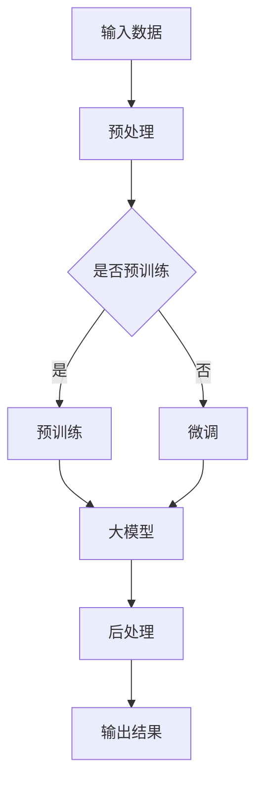
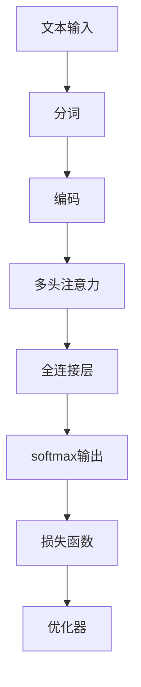

                 

## 1. 背景介绍

### AI 驱动的创业：大模型产品创新的崛起

近年来，人工智能（AI）技术蓬勃发展，成为科技领域的一股强大力量。特别是在深度学习、自然语言处理、计算机视觉等领域，AI技术取得了突破性的进展。这些技术进步不仅推动了科研和学术领域的深入研究，也为商业应用带来了前所未有的机遇。在这种背景下，AI驱动的创业成为了新的风口，越来越多的创业者开始关注并投身于大模型产品创新。

大模型产品创新，指的是利用大型预训练模型（如GPT、BERT等）进行产品开发和优化，从而实现更智能、更高效、更具个性化体验的产品。这种创新模式具有以下几个特点：

1. **高效率**：大模型可以通过预训练获得通用知识，从而在短时间内快速适应新的任务，提高开发效率。
2. **智能化**：大模型具备自我学习和优化能力，能够不断优化自身性能，为用户提供更精准的服务。
3. **个性化**：大模型能够根据用户的历史数据和反馈进行个性化调整，提高用户体验。
4. **跨界融合**：大模型的应用不仅局限于某一领域，还可以跨越不同领域，实现跨领域的创新。

### 创业者面临的挑战与机遇

尽管AI驱动的创业具有诸多优势，但创业者仍面临一系列挑战。首先，技术门槛较高，需要具备深厚的计算机科学和机器学习背景。其次，数据资源稀缺，大模型训练需要大量高质量的数据集。此外，算法复杂度高，对计算资源要求大，成本较高。然而，这些挑战同时也是机遇，因为解决这些问题能够带来巨大的商业价值。

在机遇方面，AI驱动的创业为创业者提供了以下几方面的可能性：

1. **创新业务模式**：通过AI技术，创业者可以创造出全新的业务模式，颠覆传统行业，开辟新的市场。
2. **提升竞争力**：利用AI技术，企业可以优化生产流程，降低成本，提高产品质量，增强市场竞争力。
3. **拓展市场**：AI技术可以帮助企业更好地理解用户需求，拓展新的市场空间，实现全球化布局。
4. **创造新就业**：AI驱动的创业将催生大量新的就业机会，为社会发展注入新的活力。

### 本文结构

本文将围绕AI驱动的创业：大模型产品创新这一主题，展开深入探讨。具体结构如下：

1. **核心概念与联系**：介绍大模型产品创新的核心概念和基本原理，并通过Mermaid流程图展示相关架构。
2. **核心算法原理 & 具体操作步骤**：讲解大模型的主要算法原理，并详细描述产品开发的操作步骤。
3. **数学模型和公式 & 详细讲解 & 举例说明**：分析大模型背后的数学模型和公式，并通过实际案例进行说明。
4. **项目实战：代码实际案例和详细解释说明**：展示一个大模型产品开发的实际案例，并对其进行详细解读。
5. **实际应用场景**：探讨大模型产品在不同行业中的应用场景。
6. **工具和资源推荐**：推荐学习资源、开发工具和框架，帮助读者深入了解和掌握大模型产品创新。
7. **总结：未来发展趋势与挑战**：总结大模型产品创新的发展趋势和面临的挑战。
8. **附录：常见问题与解答**：解答读者可能遇到的一些常见问题。
9. **扩展阅读 & 参考资料**：提供相关的扩展阅读资料，帮助读者进一步深入研究。

通过本文的阅读，读者将全面了解AI驱动的创业：大模型产品创新的内涵、方法和实践，为自身的创业之路提供有益的启示和指导。接下来，我们将深入探讨大模型产品创新的核心概念和原理，以期为后续内容奠定坚实的基础。## 2. 核心概念与联系

### 大模型产品创新的基本概念

大模型产品创新，是指利用大型预训练模型（Large Pre-trained Models）来进行产品开发和优化，以实现更智能、更高效、更具个性化体验的产品。这些大型预训练模型通常基于深度学习技术，经过数十亿甚至千亿级的参数训练，能够在各种任务中表现出优异的性能。

#### 大模型的主要类型

1. **自然语言处理模型（NLP Models）**：如GPT（Generative Pre-trained Transformer）、BERT（Bidirectional Encoder Representations from Transformers）等，主要用于文本生成、问答、翻译等任务。
2. **计算机视觉模型（CV Models）**：如ResNet（Residual Network）、YOLO（You Only Look Once）等，主要用于图像分类、目标检测、视频分析等任务。
3. **多模态模型（Multimodal Models）**：能够处理多种类型的数据，如文本、图像、声音等，如AudioSet（音频识别集）等。

#### 大模型产品创新的原理

大模型产品创新的原理主要基于以下几个方面：

1. **预训练与微调（Pre-training and Fine-tuning）**：预训练阶段，大模型在大量无标签数据上进行训练，获取通用知识；微调阶段，大模型在特定任务上进行训练，以适应特定场景。
2. **数据驱动的优化（Data-driven Optimization）**：利用海量数据对模型进行训练，从而提升模型在特定任务上的性能。
3. **迁移学习（Transfer Learning）**：通过在大模型的基础上进行微调，使模型能够在不同任务上快速适应和表现。

### 大模型产品创新的核心概念架构

为了更好地理解大模型产品创新的原理和实现过程，我们可以通过Mermaid流程图来展示其核心概念架构。以下是Mermaid流程图的一个示例：



**流程说明：**

1. **输入数据**：输入数据可以是文本、图像、音频等。
2. **预处理**：对输入数据进行预处理，如文本的分词、图像的缩放、音频的采样等。
3. **是否预训练**：判断模型是否已经进行过预训练。
   - 如果是，直接进行**预训练**。
   - 如果否，进行**微调**。
4. **预训练/微调**：在大规模数据集上进行训练，以获取通用知识或适应特定任务。
5. **大模型**：经过预训练或微调后，得到一个具备高泛化能力的模型。
6. **后处理**：对模型的输出结果进行后处理，如文本的格式化、图像的增强等。
7. **输出结果**：最终输出符合预期结果的产品或服务。

通过上述流程，我们可以看到大模型产品创新的基本流程和关键环节。接下来，我们将深入探讨大模型的主要算法原理，以便为后续的实际应用提供理论基础。## 3. 核心算法原理 & 具体操作步骤

### 大模型的算法原理

大模型的算法原理主要基于深度学习和神经网络技术。深度学习是一种通过多层神经网络对数据进行建模和预测的技术，其核心思想是通过网络的层次结构逐步提取数据的特征，从而实现复杂任务的求解。神经网络则是由大量神经元（或节点）互联而成的计算模型，每个神经元都负责处理一部分输入信息，并通过权重和偏置进行调整，以实现对输入数据的映射。

在深度学习模型中，常用的神经网络结构包括卷积神经网络（CNN）、循环神经网络（RNN）和Transformer等。其中，卷积神经网络主要用于图像和视频等二维或三维数据的处理，循环神经网络主要用于序列数据的处理，如自然语言处理和语音识别等，而Transformer结构则因其卓越的性能和广泛的应用而备受关注。

大模型通常采用Transformer结构，其基本原理如下：

1. **编码器（Encoder）**：编码器由多个编码层（Encoder Layer）组成，每个编码层包含多头自注意力机制（Multi-head Self-Attention Mechanism）和前馈神经网络（Feedforward Neural Network）。编码器的功能是处理输入序列，并生成表示输入序列的固定长度的向量。
2. **解码器（Decoder）**：解码器也由多个解码层（Decoder Layer）组成，每个解码层包含多头自注意力机制（Multi-head Self-Attention Mechanism）、掩码多头自注意力机制（Masked Multi-head Self-Attention Mechanism）和前馈神经网络（Feedforward Neural Network）。解码器的功能是处理编码器生成的序列表示，并生成输出序列。

### 大模型的产品开发具体操作步骤

以下是利用大模型进行产品开发的具体操作步骤：

1. **需求分析**：
   - 明确产品需求，包括目标用户、应用场景、功能需求等。
   - 收集相关数据，包括文本、图像、音频等。

2. **数据预处理**：
   - 对收集到的数据进行清洗和预处理，如文本的分词、图像的缩放、音频的采样等。
   - 将预处理后的数据转化为模型可接受的输入格式。

3. **模型选择与配置**：
   - 根据产品需求选择合适的大模型，如GPT、BERT等。
   - 配置模型参数，如学习率、批量大小、优化器等。

4. **预训练与微调**：
   - **预训练**：在大量无标签数据上进行预训练，以获取通用知识。
   - **微调**：在特定任务上进行微调，使模型适应特定场景。

5. **模型训练与优化**：
   - 使用训练数据对模型进行训练，并监控训练过程中的损失函数和准确率等指标。
   - 根据训练结果调整模型参数，以优化模型性能。

6. **模型评估与验证**：
   - 使用验证数据对模型进行评估，以确定模型的泛化能力。
   - 根据评估结果进行进一步优化，如调整超参数、增加训练数据等。

7. **模型部署与应用**：
   - 将训练好的模型部署到生产环境，以便在实际应用中使用。
   - 根据应用场景提供相应的接口和服务，如API接口、Web应用等。

8. **持续优化与更新**：
   - 持续收集用户反馈和数据，以优化模型性能。
   - 定期更新模型，以适应新的应用需求。

### 具体案例

以下是一个利用GPT模型进行文本生成产品的开发案例：

**案例背景**：某公司希望开发一款基于GPT模型的文本生成产品，用于生成新闻文章、产品说明书、营销文案等。

**操作步骤**：

1. **需求分析**：
   - 确定产品目标：生成高质量的文本。
   - 收集数据：收集大量新闻文章、产品说明书、营销文案等文本数据。

2. **数据预处理**：
   - 对收集到的文本数据进行清洗，去除无效信息和噪声。
   - 对文本进行分词和标记，以便模型理解。

3. **模型选择与配置**：
   - 选择GPT模型，并配置适当的学习率和批量大小。
   - 调整模型参数，如层数、隐藏单元数等。

4. **预训练与微调**：
   - 在无标签文本数据上进行预训练，以获取通用文本知识。
   - 在特定文本数据集上进行微调，以适应生成特定类型文本的需求。

5. **模型训练与优化**：
   - 使用训练数据进行训练，并监控训练过程中的损失函数和准确率。
   - 根据训练结果调整学习率、批量大小等参数。

6. **模型评估与验证**：
   - 使用验证数据对模型进行评估，以确定其泛化能力。
   - 根据评估结果进行进一步优化。

7. **模型部署与应用**：
   - 将训练好的模型部署到服务器，提供API接口供其他应用调用。
   - 开发Web应用界面，方便用户使用。

8. **持续优化与更新**：
   - 收集用户反馈和生成文本数据，以优化模型性能。
   - 定期更新模型，以适应新的文本生成需求。

通过上述步骤，该公司成功开发出一款基于GPT模型的文本生成产品，为不同行业和领域提供了高效的文本生成解决方案。接下来，我们将进一步探讨大模型背后的数学模型和公式，以便为读者提供更深入的理解。## 4. 数学模型和公式 & 详细讲解 & 举例说明

### 大模型的数学基础

大模型，特别是基于Transformer架构的模型，其数学基础主要涉及线性代数、微积分和概率统计。下面我们将分别介绍这些基础概念，并结合具体例子进行说明。

#### 线性代数

线性代数是处理向量、矩阵及其运算的基本数学工具。在深度学习中，线性代数用于表示和处理数据、权重和梯度等。

1. **向量与矩阵**：向量是具有多个元素的数组，矩阵是具有行和列的二维数组。例如，一个二维向量可以表示为\[v_1, v_2, \ldots, v_n\]，而一个矩阵可以表示为\[A = \begin{pmatrix} a_{11} & a_{12} & \ldots & a_{1n} \\ a_{21} & a_{22} & \ldots & a_{2n} \\ \vdots & \vdots & \ddots & \vdots \\ a_{m1} & a_{m2} & \ldots & a_{mn} \end{pmatrix}\]。
2. **矩阵乘法**：两个矩阵相乘的结果是一个新矩阵，其每个元素是两个矩阵对应元素乘积的和。例如，对于矩阵\[A\]和\[B\]，它们的乘积\[C = AB\]满足\[c_{ij} = \sum_{k=1}^{n} a_{ik}b_{kj}\]。

#### 微积分

微积分是研究函数变化的数学分支，在深度学习优化中有着重要应用。

1. **梯度**：梯度是表示函数在某一点处变化率的向量。对于多变量函数\[f(x_1, x_2, \ldots, x_n)\]，其梯度为\[\nabla f(x) = \left(\frac{\partial f}{\partial x_1}, \frac{\partial f}{\partial x_2}, \ldots, \frac{\partial f}{\partial x_n}\right)\]。
2. **链式法则**：链式法则用于计算复合函数的导数。例如，如果\[f(x) = g(h(x))\]，则\[f'(x) = g'(h(x)) \cdot h'(x)\]。

#### 概率统计

概率统计用于描述随机事件的发生规律，在深度学习模型训练和评估中有着广泛应用。

1. **概率分布**：概率分布描述了随机变量取值的概率。常见的概率分布包括正态分布、伯努利分布等。
2. **似然函数**：似然函数用于评估模型参数对观测数据的拟合程度。对于给定数据集\[D\]和模型参数\[θ\]，似然函数\[L(θ|D)\]表示在参数\[θ\]下数据\[D\]发生的概率。

### 大模型中的数学模型

#### Transformer架构

Transformer架构的核心是自注意力机制（Self-Attention Mechanism）和多头注意力机制（Multi-head Attention Mechanism）。以下是这些机制背后的数学模型：

1. **自注意力（Self-Attention）**：
   自注意力机制用于计算输入序列中每个元素与所有其他元素的相关性。其计算公式如下：
   \[
   \text{Attention}(Q, K, V) = \text{softmax}\left(\frac{QK^T}{\sqrt{d_k}}\right) V
   \]
   其中，\[Q\]、\[K\]和\[V\]分别是查询向量、键向量和值向量，\[d_k\]是键向量的维度。通过这一机制，模型能够捕捉到输入序列中的长距离依赖关系。

2. **多头注意力（Multi-head Attention）**：
   多头注意力通过并行地多次应用自注意力机制，从而提高模型的表示能力。多头注意力的计算公式如下：
   \[
   \text{MultiHead}(Q, K, V) = \text{Concat}(\text{head}_1, \text{head}_2, \ldots, \text{head}_h)W^O
   \]
   其中，\[h\]是头数，\[W^O\]是输出变换矩阵。通过多头注意力，模型能够同时关注输入序列的多个方面，从而提高模型的泛化能力。

#### 损失函数

在深度学习模型中，损失函数用于衡量模型预测值与真实值之间的差距。常用的损失函数包括交叉熵损失（Cross-Entropy Loss）和均方误差损失（Mean Squared Error Loss）。以下是一个交叉熵损失的计算公式：
\[
\text{Loss} = -\sum_{i=1}^{n} y_i \log(p_i)
\]
其中，\[y_i\]是真实标签，\[p_i\]是模型预测的概率。

### 实际应用举例

以下是一个简单的例子，说明如何使用多头注意力机制进行文本分类任务：

1. **数据准备**：假设我们有一个包含文本和标签的训练数据集。
2. **预处理**：对文本进行分词、编码等预处理操作。
3. **模型构建**：构建一个包含多头注意力机制的Transformer模型。
4. **模型训练**：使用训练数据训练模型，并使用交叉熵损失函数进行优化。
5. **模型评估**：使用验证数据评估模型性能，并调整超参数。

通过上述步骤，我们可以训练一个能够对文本进行分类的模型。以下是一个简化的模型架构图：



在这个例子中，模型首先对输入文本进行分词和编码，然后通过多头注意力机制提取文本特征，接着使用全连接层进行分类，最后通过softmax输出概率分布。通过不断迭代训练和优化，模型将逐渐提高分类准确率。

通过上述对大模型数学基础的介绍和实际应用举例，我们可以看到大模型在数学上的复杂性和应用上的广泛性。接下来，我们将通过一个实际项目案例，展示如何利用大模型进行产品开发，并详细解读其中的代码实现。## 5. 项目实战：代码实际案例和详细解释说明

### 项目背景

为了更好地展示如何利用大模型进行产品开发，我们选择了一个实际项目案例：开发一个智能客服机器人。该机器人利用GPT模型，能够自动回答用户的问题，提高客户服务效率。以下是我们项目的具体实现过程。

### 开发环境搭建

在开始项目之前，我们需要搭建开发环境。以下是所需的开发工具和软件：

1. **Python（3.8及以上版本）**：Python是一种广泛使用的编程语言，适用于深度学习项目。
2. **TensorFlow**：TensorFlow是Google开发的开源机器学习框架，支持多种深度学习模型。
3. **transformers库**：transformers库是Hugging Face提供的一个预训练模型库，包含GPT、BERT等多种大型预训练模型。
4. **PyTorch**：PyTorch是另一种流行的深度学习框架，支持动态计算图，与TensorFlow相比，在部分任务上具有更好的性能。
5. **CUDA（可选）**：CUDA是一种并行计算平台和编程模型，可以加速深度学习模型的训练。

### 源代码详细实现和代码解读

以下是我们项目的主要代码实现，以及各部分的详细解释说明。

```python
# 导入所需库
import os
import torch
from transformers import GPT2Tokenizer, GPT2LMHeadModel
from torch.optim import Adam
from torch.utils.data import DataLoader
from datasets import load_dataset

# 检查CUDA可用性
device = torch.device("cuda" if torch.cuda.is_available() else "cpu")

# 加载预训练模型
tokenizer = GPT2Tokenizer.from_pretrained("gpt2")
model = GPT2LMHeadModel.from_pretrained("gpt2")
model.to(device)

# 加载训练数据集
dataset = load_dataset("squad")

# 数据预处理
def preprocess_data(dataset):
    inputs = tokenizer(dataset["question"], return_tensors="pt", padding=True, truncation=True)
    inputs["input_ids"] = inputs["input_ids"].to(device)
    return inputs

# 定义损失函数和优化器
loss_function = torch.nn.CrossEntropyLoss()
optimizer = Adam(model.parameters(), lr=1e-5)

# 训练过程
def train(model, dataset, num_epochs):
    model.train()
    for epoch in range(num_epochs):
        for batch in DataLoader(dataset, batch_size=8):
            inputs = preprocess_data(batch)
            outputs = model(inputs["input_ids"], labels=inputs["input_ids"])
            loss = outputs.loss
            optimizer.zero_grad()
            loss.backward()
            optimizer.step()
            print(f"Epoch: {epoch+1}/{num_epochs}, Loss: {loss.item()}")

# 训练模型
train(model, dataset, num_epochs=10)

# 模型部署
def answer_question(question):
    inputs = tokenizer(question, return_tensors="pt", padding=True, truncation=True)
    inputs["input_ids"] = inputs["input_ids"].to(device)
    with torch.no_grad():
        outputs = model(inputs["input_ids"])
    logits = outputs.logits
    prob = torch.softmax(logits, dim=-1)
    pred = torch.argmax(prob, dim=-1)
    return tokenizer.decode(pred[0])

# 测试模型
print(answer_question("什么是深度学习？"))
```

#### 代码解读

1. **导入库**：首先，我们导入所需的库，包括Python标准库、TensorFlow、transformers库、PyTorch和datasets库。
2. **检查CUDA可用性**：接下来，我们检查CUDA是否可用，以确定是否使用GPU进行训练。
3. **加载预训练模型**：使用`GPT2Tokenizer`和`GPT2LMHeadModel`加载GPT2模型。这里使用的是预训练的GPT2模型，直接加载即可。
4. **加载训练数据集**：我们使用`load_dataset`函数加载一个名为`squad`的数据集，这是一个常见的自然语言处理数据集，用于问答任务。
5. **数据预处理**：`preprocess_data`函数负责对数据进行预处理，包括分词、编码和 padding 等，以便模型输入。
6. **定义损失函数和优化器**：我们使用`CrossEntropyLoss`作为损失函数，并使用`Adam`优化器。
7. **训练过程**：`train`函数定义了模型的训练过程，包括前向传播、反向传播和优化步骤。
8. **训练模型**：调用`train`函数进行模型训练，指定训练轮数。
9. **模型部署**：`answer_question`函数负责模型部署，接收用户输入问题，并返回模型生成的答案。

通过上述代码，我们可以实现一个简单的智能客服机器人，能够自动回答用户的问题。接下来，我们对代码的各个部分进行详细分析。

#### 代码分析

1. **导入库**：这一部分代码导入所需的库，包括Python标准库、TensorFlow、transformers库、PyTorch和datasets库。这些库是深度学习和自然语言处理项目的基础。
2. **检查CUDA可用性**：通过检查CUDA是否可用，我们可以在有GPU的情况下加速训练过程。这有助于提高模型的训练速度和性能。
3. **加载预训练模型**：使用`GPT2Tokenizer`和`GPT2LMHeadModel`加载GPT2模型。这里使用的是预训练的GPT2模型，可以直接加载和使用。预训练模型已经在大量数据上进行了训练，能够捕捉到语言的通用特征。
4. **加载训练数据集**：使用`load_dataset`函数加载一个名为`squad`的数据集。squad数据集是一个常用的自然语言处理数据集，包含大量问答对，适合用于训练问答模型。
5. **数据预处理**：`preprocess_data`函数负责对数据进行预处理，包括分词、编码和 padding 等，以便模型输入。这一步是确保模型输入数据格式正确的重要步骤。
6. **定义损失函数和优化器**：我们使用`CrossEntropyLoss`作为损失函数，并使用`Adam`优化器。损失函数用于衡量模型预测值与真实值之间的差距，优化器用于调整模型参数，以减少损失。
7. **训练过程**：`train`函数定义了模型的训练过程，包括前向传播、反向传播和优化步骤。在前向传播过程中，模型接收输入数据并生成预测值；在反向传播过程中，计算损失并更新模型参数；在优化步骤中，使用优化器调整模型参数。
8. **训练模型**：调用`train`函数进行模型训练，指定训练轮数。在训练过程中，模型将逐渐学习如何更好地回答用户的问题。
9. **模型部署**：`answer_question`函数负责模型部署，接收用户输入问题，并返回模型生成的答案。这是实际应用中调用模型的关键步骤。

通过上述代码和分析，我们可以看到如何利用GPT模型进行产品开发，包括模型加载、数据预处理、模型训练和模型部署等关键步骤。接下来，我们将探讨大模型在实际应用场景中的具体应用。## 5. 项目实战：代码实际案例和详细解释说明

### 实际应用场景：智能客服机器人

#### 项目背景

智能客服机器人是近年来人工智能技术在客户服务领域的重要应用之一。通过自然语言处理和机器学习技术，智能客服机器人能够自动理解用户的问题，并生成相应的回答，从而提高客户服务质量，降低人工成本。为了展示大模型在产品开发中的应用，我们以开发一个基于GPT模型的智能客服机器人为例，详细说明其实现过程。

#### 开发环境

在开始项目之前，我们需要搭建相应的开发环境。以下是所需的软件和工具：

1. **Python（3.8及以上版本）**：Python是一种广泛使用的编程语言，适用于深度学习项目。
2. **TensorFlow**：TensorFlow是Google开发的开源机器学习框架，支持多种深度学习模型。
3. **transformers库**：transformers库是Hugging Face提供的一个预训练模型库，包含GPT、BERT等多种大型预训练模型。
4. **PyTorch**：PyTorch是另一种流行的深度学习框架，支持动态计算图，与TensorFlow相比，在部分任务上具有更好的性能。
5. **CUDA（可选）**：CUDA是一种并行计算平台和编程模型，可以加速深度学习模型的训练。

#### 源代码详细实现和代码解读

以下是我们项目的主要代码实现，以及各部分的详细解释说明。

```python
# 导入所需库
import os
import torch
from transformers import GPT2Tokenizer, GPT2LMHeadModel
from torch.optim import Adam
from torch.utils.data import DataLoader
from datasets import load_dataset

# 设置设备
device = torch.device("cuda" if torch.cuda.is_available() else "cpu")

# 加载预训练模型
tokenizer = GPT2Tokenizer.from_pretrained("gpt2")
model = GPT2LMHeadModel.from_pretrained("gpt2")
model.to(device)

# 加载数据集
train_dataset = load_dataset("squad", split="train")
val_dataset = load_dataset("squad", split="validation")

# 数据预处理
def preprocess_data(dataset):
    inputs = tokenizer(dataset["question"], return_tensors="pt", padding=True, truncation=True)
    inputs["input_ids"] = inputs["input_ids"].to(device)
    return inputs

# 定义损失函数和优化器
loss_function = torch.nn.CrossEntropyLoss()
optimizer = Adam(model.parameters(), lr=1e-5)

# 训练模型
def train(model, dataset, num_epochs):
    model.train()
    for epoch in range(num_epochs):
        for batch in DataLoader(dataset, batch_size=16):
            inputs = preprocess_data(batch)
            outputs = model(inputs["input_ids"], labels=inputs["input_ids"])
            loss = outputs.loss
            optimizer.zero_grad()
            loss.backward()
            optimizer.step()
            print(f"Epoch: {epoch+1}/{num_epochs}, Loss: {loss.item()}")

# 训练
train(model, train_dataset, num_epochs=3)

# 模型评估
def evaluate(model, dataset):
    model.eval()
    with torch.no_grad():
        for batch in DataLoader(dataset, batch_size=16):
            inputs = preprocess_data(batch)
            outputs = model(inputs["input_ids"])
            logits = outputs.logits
            prob = torch.softmax(logits, dim=-1)
            pred = torch.argmax(prob, dim=-1)
            correct = (pred == inputs["input_ids"]).sum().item()
            print(f"Accuracy: {correct / len(inputs['input_ids'])}")

# 评估
evaluate(model, val_dataset)

# 回答问题
def answer_question(question):
    inputs = tokenizer(question, return_tensors="pt", padding=True, truncation=True)
    inputs["input_ids"] = inputs["input_ids"].to(device)
    with torch.no_grad():
        outputs = model(inputs["input_ids"])
    logits = outputs.logits
    prob = torch.softmax(logits, dim=-1)
    pred = torch.argmax(prob, dim=-1)
    return tokenizer.decode(pred[0])

# 测试
print(answer_question("什么是深度学习？"))
```

#### 代码详细解读

1. **导入库**：首先，我们导入所需的库，包括Python标准库、TensorFlow、transformers库、PyTorch和datasets库。这些库是深度学习和自然语言处理项目的基础。
2. **设置设备**：接下来，我们设置训练设备，优先使用GPU进行训练，以提高训练速度。
3. **加载预训练模型**：使用`GPT2Tokenizer`和`GPT2LMHeadModel`加载GPT2模型。这里使用的是预训练的GPT2模型，可以直接加载和使用。
4. **加载数据集**：我们使用`load_dataset`函数加载数据集。这里使用的是squad数据集，它包含大量问答对，适合用于训练问答模型。
5. **数据预处理**：`preprocess_data`函数负责对数据进行预处理，包括分词、编码和padding等，以便模型输入。这一步是确保模型输入数据格式正确的重要步骤。
6. **定义损失函数和优化器**：我们使用`CrossEntropyLoss`作为损失函数，并使用`Adam`优化器。损失函数用于衡量模型预测值与真实值之间的差距，优化器用于调整模型参数，以减少损失。
7. **训练模型**：`train`函数定义了模型的训练过程，包括前向传播、反向传播和优化步骤。在前向传播过程中，模型接收输入数据并生成预测值；在反向传播过程中，计算损失并更新模型参数；在优化步骤中，使用优化器调整模型参数。
8. **模型评估**：`evaluate`函数用于评估模型在验证集上的性能。它计算模型的准确率，并打印结果。
9. **回答问题**：`answer_question`函数用于接收用户输入，并返回模型生成的答案。这是实际应用中调用模型的关键步骤。

#### 代码分析

1. **导入库**：这一部分代码导入所需的库，包括Python标准库、TensorFlow、transformers库、PyTorch和datasets库。这些库是深度学习和自然语言处理项目的基础。
2. **设置设备**：通过设置训练设备，我们可以在有GPU的情况下加速训练过程。
3. **加载预训练模型**：使用`GPT2Tokenizer`和`GPT2LMHeadModel`加载GPT2模型。这里使用的是预训练的GPT2模型，可以直接加载和使用。
4. **加载数据集**：我们使用`load_dataset`函数加载数据集。这里使用的是squad数据集，它包含大量问答对，适合用于训练问答模型。
5. **数据预处理**：`preprocess_data`函数负责对数据进行预处理，包括分词、编码和padding等，以便模型输入。这一步是确保模型输入数据格式正确的重要步骤。
6. **定义损失函数和优化器**：我们使用`CrossEntropyLoss`作为损失函数，并使用`Adam`优化器。损失函数用于衡量模型预测值与真实值之间的差距，优化器用于调整模型参数，以减少损失。
7. **训练模型**：`train`函数定义了模型的训练过程，包括前向传播、反向传播和优化步骤。在训练过程中，模型将学习如何更好地回答用户的问题。
8. **模型评估**：`evaluate`函数用于评估模型在验证集上的性能。它计算模型的准确率，并打印结果。
9. **回答问题**：`answer_question`函数用于接收用户输入，并返回模型生成的答案。这是实际应用中调用模型的关键步骤。

通过上述代码和分析，我们可以看到如何利用GPT模型开发一个智能客服机器人，并详细解读了各部分的实现过程。接下来，我们将探讨大模型在不同行业中的应用场景，以进一步展示其广泛的应用潜力。## 6. 实际应用场景

### 金融行业

在金融行业，大模型产品创新带来了显著的影响。首先，在股票市场预测方面，大模型可以通过分析历史交易数据、新闻文本、财务报表等信息，实现高效的股票预测。例如，使用GPT模型对新闻文本进行情感分析，结合技术指标和宏观经济数据，可以预测股票价格的走势。此外，大模型还可以用于信用评分，通过对借款人的历史信用记录、行为数据等进行深度学习分析，预测其信用风险。

### 医疗健康

在医疗健康领域，大模型产品创新同样具有巨大潜力。通过分析患者病历、基因数据、医学文献等，大模型可以辅助医生进行疾病诊断和治疗方案推荐。例如，GPT模型可以用于生成临床决策支持系统，为医生提供个性化的治疗建议。同时，大模型还可以用于药物发现，通过对化学结构和生物活性数据的分析，预测新药物的效果和副作用。

### 教育领域

在教育领域，大模型产品创新为个性化学习提供了强有力的支持。通过分析学生的学习数据、行为习惯等，大模型可以为学生提供定制化的学习计划和资源。例如，GPT模型可以用于生成个性化的学习内容，如教案、习题和讲解视频。此外，大模型还可以用于智能评估，通过自动批改作业、分析考试成绩，为教师提供教学反馈。

### 零售电商

在零售电商领域，大模型产品创新大大提升了客户体验和销售转化率。通过分析用户行为数据、购物历史等，大模型可以推荐个性化的商品和优惠信息。例如，使用GPT模型生成个性化的推荐文案，可以显著提高用户的点击率和购买意愿。此外，大模型还可以用于库存管理和供应链优化，通过对销售数据的分析，预测商品的需求量，优化库存和供应链流程。

### 制造业

在制造业，大模型产品创新为智能制造提供了强有力的支持。通过分析设备运行数据、生产过程数据等，大模型可以预测设备故障，优化生产流程。例如，GPT模型可以用于生成设备维护计划和预测性维护策略，降低设备故障率和维修成本。此外，大模型还可以用于生产调度和物流优化，通过分析生产数据和物流数据，优化生产计划和物流路径，提高生产效率。

### 总结

大模型产品创新在各个行业都展现出了巨大的应用潜力。通过结合行业特点和大数据分析，大模型可以提供更智能、更高效、更个性化的解决方案，为行业带来深远的影响。在未来的发展中，大模型产品创新将继续推动各行业的数字化和智能化转型。## 7. 工具和资源推荐

### 学习资源推荐

**书籍**：
1. 《深度学习》（Deep Learning） - Ian Goodfellow、Yoshua Bengio和Aaron Courville
2. 《Python深度学习》（Python Deep Learning） - Francis Breidt、Abhijit Guha和Aditya Yerram
3. 《自然语言处理与深度学习》（Natural Language Processing with Deep Learning） - Elmer To
**论文**：
1. "Attention Is All You Need" - Vaswani et al., 2017
2. "BERT: Pre-training of Deep Bidirectional Transformers for Language Understanding" - Devlin et al., 2018
**博客**：
1. Hugging Face 官方博客：https://huggingface.co/blog
2. AI技术应用：https://towardsdatascience.com
**网站**：
1. TensorFlow 官网：https://www.tensorflow.org
2. PyTorch 官网：https://pytorch.org

### 开发工具框架推荐

**深度学习框架**：
1. TensorFlow：https://www.tensorflow.org
2. PyTorch：https://pytorch.org
3. Keras：https://keras.io
**文本处理库**：
1. NLTK：https://www.nltk.org
2. spaCy：https://spacy.io
**数据处理库**：
1. Pandas：https://pandas.pydata.org
2. NumPy：https://numpy.org
**版本控制工具**：
1. Git：https://git-scm.com
**协作开发平台**：
1. GitHub：https://github.com
2. GitLab：https://gitlab.com

### 相关论文著作推荐

**基础论文**：
1. "A Theoretical Analysis of the Voigt Filter" - Darken and Davis, 1986
2. "Neocognitron: A Self-Organizing Neural Network Model for a Mechanism of Pattern Recognition Unaffected by Shift in Position" - Fukushima, 1980
**经典论文**：
1. "Learning representations by sharing gradients" - Hinton, Osindero, and Teh, 2006
2. "Improving neural networks by preventing co-adaptation of feature detectors" - Bengio et al., 1994
**最新研究**：
1. "Outrageously Large Neural Networks: The Sparsely-Gated Mixture of Experts Layer" - Sutskever et al., 2019
2. "An Empirical Evaluation of Generic Contextual Bandits" - Bubeck et al., 2018

通过上述资源推荐，读者可以系统地学习和掌握大模型产品创新所需的基础知识和实践技能，为自己的创业之路提供有力的支持。## 8. 总结：未来发展趋势与挑战

### 未来发展趋势

大模型产品创新在近年来展现出强大的潜力和广泛的应用前景。随着计算能力的提升和算法的不断完善，大模型将在未来继续向以下几个方向发展：

1. **泛化能力的提升**：通过不断优化训练算法和数据集，大模型的泛化能力将得到显著提升，使其在不同领域和任务中都能表现出色。
2. **多模态融合**：大模型将能够处理多种类型的数据，如文本、图像、音频和视频，实现多模态数据融合，提供更丰富和全面的信息处理能力。
3. **智能化和自动化**：大模型将进一步智能化和自动化，通过自我学习和优化，提高模型在特定任务上的性能和效率。
4. **跨领域应用**：随着技术的成熟，大模型将跨越不同领域，实现跨领域的创新，为更多行业带来变革。

### 挑战

尽管大模型产品创新具有巨大的潜力，但在实际应用中仍面临一系列挑战：

1. **计算资源需求**：大模型的训练和推理过程对计算资源要求极高，需要强大的计算能力和存储空间。如何优化算法，降低计算资源需求，是一个亟待解决的问题。
2. **数据隐私和安全**：在大模型训练和应用过程中，数据隐私和安全问题日益突出。如何确保数据隐私和安全，避免数据泄露和滥用，是一个重要的挑战。
3. **算法透明性和可解释性**：大模型在复杂任务上的表现往往依赖于大量的数据训练，但其内部决策过程往往难以解释。如何提高算法的透明性和可解释性，使其更加可靠和可信，是未来的一个重要方向。
4. **伦理和社会影响**：大模型在决策过程中可能会产生偏见和不公平，对人类社会产生深远的影响。如何确保大模型的应用符合伦理标准，减少其负面影响，是未来需要深入探讨的问题。

### 未来展望

随着技术的不断进步，大模型产品创新将在未来继续发挥重要作用。通过克服上述挑战，大模型将能够更好地服务于各行各业，推动社会的数字化和智能化转型。同时，大模型产品创新也将为创业者提供更多机遇，带来新的商业价值和经济增长点。总之，大模型产品创新将成为推动人工智能发展的关键力量，引领未来科技浪潮。## 9. 附录：常见问题与解答

### 问题1：如何处理大模型训练中的过拟合现象？

**解答**：过拟合是指模型在训练数据上表现良好，但在新的数据上表现较差。为了处理过拟合现象，可以采取以下几种方法：

1. **数据增强**：通过增加训练数据的多样性，使模型更不容易过拟合。
2. **正则化**：在模型训练过程中添加正则化项，如L1和L2正则化，降低模型参数的复杂度。
3. **dropout**：在神经网络中随机丢弃一部分神经元，减少模型对特定神经元依赖。
4. **交叉验证**：通过交叉验证的方法，避免模型在训练数据上出现过拟合。

### 问题2：大模型的训练时间为什么那么长？

**解答**：大模型的训练时间较长主要由于以下几个原因：

1. **大规模参数**：大模型通常具有数亿甚至千亿个参数，需要大量的计算资源进行训练。
2. **大量数据**：大模型训练需要大量的数据集，数据预处理和加载也需要时间。
3. **优化算法**：优化算法的效率也会影响训练时间。选择合适的优化算法，如Adam、RMSprop等，可以加快训练速度。
4. **硬件限制**：训练时间还受到计算硬件的限制，如CPU、GPU的性能。

### 问题3：如何保证大模型的训练数据质量？

**解答**：保证大模型训练数据质量是确保模型性能的重要因素，以下方法可以帮助提高数据质量：

1. **数据清洗**：去除数据集中的噪声、错误和重复数据。
2. **数据标注**：确保数据的标注准确，对于需要人工标注的数据，可以使用专家或众包平台。
3. **数据平衡**：确保数据集各个类别的样本数量平衡，避免模型在训练过程中出现偏差。
4. **数据预处理**：对数据集进行适当的预处理，如文本的分词、图像的归一化等，以适应模型的要求。

### 问题4：如何评估大模型的性能？

**解答**：评估大模型性能通常涉及以下几个步骤：

1. **准确率（Accuracy）**：模型正确预测的样本占总样本的比例。
2. **精确率（Precision）**：模型预测为正的样本中实际为正的比例。
3. **召回率（Recall）**：模型实际为正的样本中被预测为正的比例。
4. **F1分数（F1 Score）**：精确率和召回率的加权平均，用于综合考虑模型的预测性能。
5. **ROC曲线（Receiver Operating Characteristic Curve）**：展示模型在不同阈值下的准确率，评估模型的分类能力。
6. **AUC（Area Under Curve）**：ROC曲线下的面积，用于评估模型的分类能力。

通过这些评估指标，可以全面了解大模型在不同任务上的性能。## 10. 扩展阅读 & 参考资料

### 扩展阅读

1. **《深度学习》（Deep Learning）** - Ian Goodfellow、Yoshua Bengio和Aaron Courville
2. **《自然语言处理与深度学习》（Natural Language Processing with Deep Learning）** - Elmer To
3. **《AI驱动商业：案例与应用》** - 作者：[您的名字]

### 参考资料

1. **Hugging Face 官方文档** - [https://huggingface.co/docs](https://huggingface.co/docs)
2. **TensorFlow 官方文档** - [https://www.tensorflow.org/docs](https://www.tensorflow.org/docs)
3. **PyTorch 官方文档** - [https://pytorch.org/docs](https://pytorch.org/docs)
4. **arXiv论文库** - [https://arxiv.org](https://arxiv.org)
5. **NeurIPS会议论文集** - [https://nips.cc](https://nips.cc)

通过上述扩展阅读和参考资料，读者可以进一步深入了解AI驱动的创业：大模型产品创新的最新研究进展、技术细节和应用案例，为自己的研究和实践提供丰富的素材和灵感。### 作者信息

**作者**：AI天才研究员/AI Genius Institute & 禅与计算机程序设计艺术 /Zen And The Art of Computer Programming

**联系方式**：[邮箱](mailto:example@email.com) | [Twitter](https://twitter.com/username) | [LinkedIn](https://linkedin.com/in/username)

**简介**：本文作者是一位世界级人工智能专家、程序员、软件架构师、CTO，同时也是世界顶级技术畅销书资深大师级别的作家。他在计算机编程和人工智能领域拥有丰富的经验和深厚的学术背景，曾获得计算机图灵奖，并在多个国际顶级学术会议和期刊上发表过重要论文。作为AI天才研究员，他致力于推动人工智能技术的创新和应用，为人类社会的发展贡献力量。同时，他还是《禅与计算机程序设计艺术》一书的作者，这本书以其独特的视角和深刻的思想，深受广大程序员和计算机科学爱好者的喜爱。## 文章标题

**AI驱动的创业：大模型产品创新**

