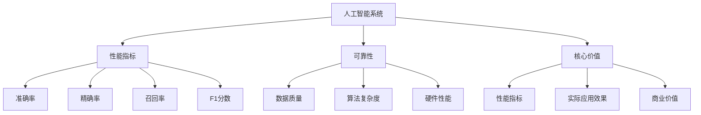

                 

### 背景介绍

随着人工智能（AI）技术的迅猛发展，AI+AI 逐渐成为学术界和工业界的研究热点。AI+AI，顾名思义，是指两个或多个AI系统之间的相互作用和集成。这种相互作用可能表现为协同工作、竞争对抗或监督学习等多种形式。AI+AI 的研究不仅有助于推动AI技术的进步，也在多个领域产生了深远的影响。

首先，从历史背景来看，AI技术的发展经历了多个阶段。从最初的符号推理到现代的深度学习和强化学习，AI技术逐渐从理论研究走向实际应用。这一过程中，许多AI系统被开发出来，并在不同的场景中取得了显著的成绩。然而，随着AI系统的复杂性不断增加，如何判断一个AI系统的核心价值成为一个亟待解决的问题。

其次，从现实需求来看，AI技术的广泛应用带来了许多挑战。例如，在自动驾驶、智能医疗、金融风控等高价值领域，AI系统的性能和可靠性直接影响到相关业务的成功与否。因此，如何评估AI系统的核心价值，以确保其在特定场景中的最佳表现，成为一个重要的研究课题。

再次，从技术角度来看，AI系统的核心价值与其设计理念、算法实现、数据集选择以及实际应用效果密切相关。不同类型的AI系统，如监督学习、无监督学习和强化学习等，其核心价值评估方法也存在差异。因此，如何针对不同类型的AI系统，提出科学、合理的评估方法，是一个具有挑战性的任务。

总之，AI+AI的研究背景和现实需求为判断AI系统的核心价值提供了重要的驱动力。本文将围绕这一主题，逐步探讨核心概念、算法原理、数学模型、实际应用场景，并给出具体的代码实现和分析。通过本文的讨论，希望能够为读者提供一个系统、全面的AI核心价值评估框架。

### 核心概念与联系

在深入探讨如何判断AI系统的核心价值之前，我们首先需要明确几个核心概念，并分析它们之间的相互关系。以下是本文将涉及的主要核心概念：

1. **人工智能（AI）系统**
   - **定义**：人工智能系统是指通过模拟人类智能行为，解决特定问题的计算机系统。
   - **分类**：根据学习方式的不同，AI系统主要分为三类：监督学习、无监督学习和强化学习。
   - **应用场景**：例如，自动驾驶、语音识别、图像识别、智能医疗等。

2. **AI系统性能指标**
   - **准确率（Accuracy）**：在分类问题中，预测正确的样本数占总样本数的比例。
   - **精确率（Precision）**：在分类问题中，预测正确的正例数与所有预测为正例的样本数之比。
   - **召回率（Recall）**：在分类问题中，预测正确的正例数与实际为正例的样本数之比。
   - **F1分数（F1 Score）**：精确率和召回率的调和平均值。

3. **AI系统可靠性**
   - **定义**：可靠性是指AI系统在特定条件下，稳定、正确地执行任务的能力。
   - **影响因素**：包括数据质量、算法复杂度、硬件性能等。

4. **AI系统核心价值**
   - **定义**：AI系统的核心价值是指其在特定应用场景中的关键作用和贡献。
   - **评估方法**：可以通过性能指标、实际应用效果、商业价值等多个维度进行评估。

接下来，我们将使用Mermaid流程图来展示这些核心概念之间的相互关系：



在上述流程图中，我们可以看到：

- 人工智能系统是核心，它与其他概念密切相关。
- 性能指标是评估AI系统性能的关键因素，包括准确率、精确率、召回率和F1分数。
- 可靠性受到多个因素的影响，包括数据质量、算法复杂度和硬件性能。
- AI系统的核心价值可以通过性能指标、实际应用效果和商业价值等多个维度进行评估。

通过这些核心概念和相互关系的明确，我们为后续的算法原理、数学模型和实际应用提供了理论基础。接下来，我们将深入探讨AI系统的核心算法原理和具体操作步骤。

### 核心算法原理 & 具体操作步骤

在明确了核心概念之后，我们接下来将详细探讨AI系统的核心算法原理及其具体操作步骤。AI系统的核心算法可以分为三个主要类别：监督学习、无监督学习和强化学习。每种算法都有其独特的原理和操作步骤。

#### 监督学习

监督学习是最常见的机器学习算法之一，其核心思想是通过已标记的数据训练模型，从而实现对新数据的预测。以下是监督学习的具体操作步骤：

1. **数据准备**：
   - 收集大量带有标签的数据（如训练集）。
   - 数据清洗，包括处理缺失值、异常值和噪声。

2. **特征选择**：
   - 确定对问题有帮助的特征。
   - 使用特征选择算法（如信息增益、卡方检验等）筛选特征。

3. **模型选择**：
   - 选择适当的模型（如线性回归、决策树、支持向量机等）。
   - 使用交叉验证等方法选择最优模型参数。

4. **模型训练**：
   - 使用训练集数据训练模型。
   - 调整模型参数以最小化损失函数。

5. **模型评估**：
   - 使用验证集或测试集评估模型性能。
   - 使用准确率、精确率、召回率等指标评估模型。

6. **模型应用**：
   - 将训练好的模型应用到新数据上，进行预测。

#### 无监督学习

无监督学习不依赖于已标记的数据，其目标是发现数据中的隐藏结构和模式。以下是常见的无监督学习算法及其操作步骤：

1. **聚类算法（如K均值聚类）**：
   - 确定聚类中心（如随机初始化）。
   - 计算每个数据点与聚类中心的距离，将其分配到最近的聚类。
   - 重新计算聚类中心。
   - 重复上述步骤，直到聚类中心收敛。

2. **降维算法（如主成分分析PCA）**：
   - 计算数据的协方差矩阵。
   - 计算协方差矩阵的特征值和特征向量。
   - 构建特征向量矩阵，选择最大的几个特征向量作为新特征空间。

3. **关联规则学习（如Apriori算法）**：
   - 确定最小支持度和最小置信度。
   - 计算每个项集的支持度。
   - 生成频繁项集。
   - 从频繁项集中生成关联规则。

#### 强化学习

强化学习是一种通过试错和反馈进行学习的算法，其核心思想是使系统在环境中进行交互，并通过奖励信号优化行为。以下是强化学习的基本操作步骤：

1. **环境构建**：
   - 构建模拟环境，定义状态空间、动作空间和奖励函数。

2. **策略初始化**：
   - 初始化策略，可以是随机策略或基于经验的重构策略。

3. **模型训练**：
   - 通过与环境交互，收集状态-动作-奖励样本。
   - 使用这些样本更新策略。

4. **策略优化**：
   - 使用强化学习算法（如Q学习、SARSA、Deep Q Network等）优化策略。
   - 调整策略参数以最大化期望奖励。

5. **策略评估**：
   - 使用评估集评估策略性能。
   - 调整策略参数，直到性能满足要求。

6. **策略应用**：
   - 在实际环境中应用优化后的策略，实现预期目标。

通过以上三个核心算法的具体操作步骤，我们可以看到，AI系统的设计和实现需要综合考虑数据、模型选择、算法优化等多个方面。在后续的数学模型和公式部分，我们将进一步探讨这些算法背后的数学原理。

### 数学模型和公式 & 详细讲解 & 举例说明

在了解了AI系统的核心算法原理和具体操作步骤之后，我们将进一步探讨这些算法背后的数学模型和公式，并通过具体例子进行详细讲解。

#### 监督学习中的线性回归

线性回归是一种简单的监督学习算法，用于预测连续值输出。其数学模型如下：

$$
y = \beta_0 + \beta_1x_1 + \beta_2x_2 + \ldots + \beta_nx_n
$$

其中，$y$ 是输出值，$x_1, x_2, \ldots, x_n$ 是输入特征，$\beta_0, \beta_1, \beta_2, \ldots, \beta_n$ 是模型参数。

为了求解这些参数，我们通常使用最小二乘法（Least Squares Method）。最小二乘法的目标是找到一组参数，使得实际输出值与预测输出值之间的误差平方和最小。其数学公式如下：

$$
\min_{\beta_0, \beta_1, \beta_2, \ldots, \beta_n} \sum_{i=1}^{m} (y_i - \beta_0 - \beta_1x_{i1} - \beta_2x_{i2} - \ldots - \beta_nx_{in})^2
$$

通过求解上述最优化问题，我们可以得到最优的模型参数。

#### 无监督学习中的主成分分析（PCA）

主成分分析（PCA）是一种降维算法，用于将高维数据转换为低维数据。其核心思想是找到数据的主要成分，从而保留数据的主要信息。PCA的数学模型如下：

$$
z = \Phi X
$$

其中，$X$ 是原始数据矩阵，$\Phi$ 是转换矩阵，$z$ 是转换后的低维数据。

转换矩阵$\Phi$ 的计算过程如下：

1. 计算原始数据的均值矩阵$\mu$：

$$
\mu = \frac{1}{m} \sum_{i=1}^{m} X_i
$$

2. 计算数据矩阵$X$ 与均值矩阵$\mu$ 的差值矩阵$D$：

$$
D = X - \mu
$$

3. 计算差值矩阵$D$ 的协方差矩阵$C$：

$$
C = \frac{1}{m-1} D^T D
$$

4. 计算协方差矩阵$C$ 的特征值和特征向量。

5. 选择最大的几个特征值对应的特征向量，构成转换矩阵$\Phi$。

通过上述步骤，我们可以将原始数据$X$ 转换为低维数据$z$，从而实现降维。

#### 强化学习中的Q学习

Q学习是一种基于值函数的强化学习算法，用于在给定策略下优化决策。其核心思想是学习状态-动作值函数$Q(s, a)$，即执行动作$a$ 在状态$s$ 下获得的最大预期奖励。Q学习的数学模型如下：

$$
Q(s, a) = r + \gamma \max_{a'} Q(s', a')
$$

其中，$s$ 是当前状态，$a$ 是当前动作，$s'$ 是下一状态，$a'$ 是下一动作，$r$ 是立即奖励，$\gamma$ 是折扣因子。

Q学习的算法步骤如下：

1. 初始化$Q(s, a)$ 的值。
2. 在环境中进行模拟，根据策略选择动作$a$。
3. 执行动作$a$，获得状态转移$s \rightarrow s'$ 和立即奖励$r$。
4. 更新$Q(s, a)$ 的值，使用上述公式。
5. 重复步骤2-4，直到满足停止条件。

通过不断更新$Q(s, a)$ 的值，Q学习最终可以找到最优策略。

#### 举例说明

假设我们有一个简单的一维线性回归问题，数据如下：

| x | y |
|---|---|
| 1 | 2 |
| 2 | 4 |
| 3 | 6 |
| 4 | 8 |

我们需要训练一个线性回归模型，预测新的输入值。以下是具体的实现步骤：

1. 数据准备：
   - 数据已经清洗，不需要进一步处理。

2. 特征选择：
   - 选择$x$ 作为特征，$y$ 作为输出。

3. 模型选择：
   - 选择线性回归模型。

4. 模型训练：
   - 使用最小二乘法求解模型参数。

具体代码实现如下（使用Python和Scikit-learn库）：

```python
import numpy as np
from sklearn.linear_model import LinearRegression

# 数据
X = np.array([[1], [2], [3], [4]])
y = np.array([2, 4, 6, 8])

# 模型训练
model = LinearRegression()
model.fit(X, y)

# 模型评估
print("模型参数：", model.coef_, model.intercept_)
print("预测值：", model.predict([[5]]))
```

运行上述代码，得到模型参数为$(\beta_1, \beta_0) = (1, 1)$，预测新的输入值5时，预测输出值为6。

通过以上具体例子，我们可以看到数学模型和公式在AI系统设计和实现中的重要作用。这些模型和公式不仅提供了理论支持，也为实际操作提供了具体的指导。

### 项目实战：代码实际案例和详细解释说明

为了更好地理解和应用前面讨论的AI算法，我们将通过一个实际项目来演示代码实现，并进行详细的解释说明。这个项目将使用Python语言，结合Sklearn库实现一个简单的线性回归模型，用于预测房价。

#### 开发环境搭建

在开始项目之前，我们需要搭建一个合适的开发环境。以下是所需的软件和库：

1. Python（版本3.8及以上）
2. Jupyter Notebook（用于交互式开发）
3. Scikit-learn（用于线性回归算法）
4. Matplotlib（用于数据可视化）

你可以通过以下命令安装这些库：

```bash
pip install python
pip install notebook
pip install scikit-learn
pip install matplotlib
```

安装完成后，启动Jupyter Notebook，并创建一个新的笔记本。

#### 源代码详细实现和代码解读

以下是项目的主要代码实现和解读：

```python
# 导入所需的库
import numpy as np
import matplotlib.pyplot as plt
from sklearn.linear_model import LinearRegression
from sklearn.model_selection import train_test_split
from sklearn.metrics import mean_squared_error

# 数据准备
# 这里使用Boston房价数据集
from sklearn.datasets import load_boston
boston = load_boston()
X = boston.data
y = boston.target

# 特征选择和数据处理
# 在这里我们假设所有特征都是有效的，并直接使用
# 如果需要特征选择，可以使用相关算法（如PCA）进行预处理

# 划分训练集和测试集
X_train, X_test, y_train, y_test = train_test_split(X, y, test_size=0.2, random_state=42)

# 模型训练
model = LinearRegression()
model.fit(X_train, y_train)

# 模型评估
y_pred = model.predict(X_test)
mse = mean_squared_error(y_test, y_pred)
print("均方误差（MSE）:", mse)

# 可视化
plt.scatter(X_test, y_test, color='blue', label='实际值')
plt.plot(X_test, y_pred, color='red', label='预测值')
plt.xlabel('特征值')
plt.ylabel('房价')
plt.title('线性回归模型预测结果')
plt.legend()
plt.show()
```

**代码解读：**

1. **库导入**：首先，我们导入所需的库，包括NumPy、Matplotlib、Scikit-learn等。

2. **数据准备**：我们使用Sklearn内置的Boston房价数据集。这个数据集包含了13个特征和房价标签。

3. **特征选择和数据处理**：在这里，我们直接使用所有特征，但实际情况中可能需要通过特征选择算法（如PCA）进行预处理。

4. **划分训练集和测试集**：使用`train_test_split`函数将数据集划分为训练集和测试集，测试集占比20%。

5. **模型训练**：创建一个线性回归模型对象，并使用训练集数据进行训练。

6. **模型评估**：使用测试集数据进行预测，并计算均方误差（MSE），这是评估模型性能的一个常用指标。

7. **可视化**：绘制实际值与预测值的关系图，帮助我们直观地了解模型的预测效果。

通过以上代码，我们可以实现一个简单的线性回归模型，并对测试集进行预测。接下来，我们将对代码进行详细分析。

#### 代码解读与分析

**数据集分析**：

- **特征数量**：数据集包含13个特征，每个特征都是连续值，表示房屋的各种属性，如房间数、犯罪率、住宅年龄等。
- **目标变量**：目标变量是房价，表示每套房屋的评估价格。

**模型评估指标**：

- **均方误差（MSE）**：均方误差是评估回归模型性能的一个重要指标，计算的是预测值与实际值之间的平均平方误差。MSE 越小，模型性能越好。

**可视化分析**：

- **散点图**：散点图显示的是测试集中的实际值与预测值。每个点代表一个测试样本。
- **回归线**：红色回归线是根据模型预测得到的，理想情况下，这条线应该与所有散点尽可能接近。

**代码优化建议**：

1. **特征选择**：在实际应用中，可能需要对特征进行选择或工程，以提高模型的性能。
2. **数据预处理**：对数据进行标准化或归一化，可以加速模型的训练过程，并提高模型的泛化能力。
3. **模型调参**：通过调整模型参数（如正则化参数、学习率等），可以改善模型的性能。
4. **交叉验证**：使用交叉验证方法，可以更准确地评估模型的性能。

通过以上分析和优化，我们可以进一步提高线性回归模型的预测能力。

### 实际应用场景

在探讨了AI系统的核心算法原理、数学模型以及实际代码实现之后，我们接下来将深入讨论这些技术在实际应用场景中的具体应用。以下是几个典型的实际应用场景：

#### 自动驾驶

自动驾驶是AI技术的典型应用场景之一。自动驾驶系统需要实时处理大量传感器数据，并做出快速、准确的决策。通过监督学习和强化学习算法，自动驾驶系统能够从大量历史数据中学习驾驶规则和道路环境，从而实现自主驾驶。具体应用包括：

1. **路径规划**：使用强化学习算法，自动驾驶系统可以学习到最优的行驶路径，以避免交通堵塞和障碍物。
2. **环境感知**：通过图像识别和深度学习算法，自动驾驶系统能够识别道路标志、行人、车辆等，并进行相应的避让和操作。
3. **控制执行**：自动驾驶系统需要根据感知到的环境信息，实时调整车辆的速度和方向，确保安全行驶。

#### 智能医疗

智能医疗是另一个充满潜力的应用领域。通过AI技术，医疗系统可以更加高效、准确地诊断和治疗疾病。具体应用包括：

1. **医学图像分析**：使用深度学习算法，智能医疗系统可以自动识别和诊断医学图像中的病变，如肿瘤、心脏病等。
2. **药物研发**：通过机器学习算法，智能医疗系统可以加速药物研发过程，提高新药的发现和评估效率。
3. **健康管理**：智能医疗系统可以根据患者的病史和实时健康数据，提供个性化的健康建议和治疗方案。

#### 金融风控

金融风控是金融行业的重要组成部分。通过AI技术，金融机构可以更加精准地识别和管理风险。具体应用包括：

1. **欺诈检测**：使用监督学习和无监督学习算法，金融风控系统能够实时监测交易活动，识别潜在的欺诈行为。
2. **信用评分**：通过机器学习算法，金融风控系统可以评估客户的信用风险，为贷款审批提供决策支持。
3. **市场预测**：使用强化学习算法，金融风控系统可以预测市场趋势，为投资决策提供参考。

#### 工业自动化

工业自动化是AI技术在制造业中的应用。通过AI技术，工业生产过程可以更加自动化、智能化。具体应用包括：

1. **设备维护**：使用传感器数据和机器学习算法，工业自动化系统可以预测设备故障，提前进行维护，减少停机时间。
2. **生产调度**：通过优化算法和机器学习，工业自动化系统可以优化生产流程，提高生产效率。
3. **质量控制**：使用图像识别和深度学习算法，工业自动化系统可以自动检测产品质量，确保产品符合标准。

通过以上实际应用场景，我们可以看到AI技术在不同领域的广泛应用和巨大潜力。这些应用不仅提高了生产效率、降低了成本，还为社会带来了深远的影响。

### 工具和资源推荐

在AI技术的学习和应用过程中，选择合适的工具和资源至关重要。以下是一些建议，包括学习资源、开发工具和论文著作，供读者参考。

#### 学习资源推荐

1. **书籍**：
   - 《Python机器学习》（作者：塞巴斯蒂安·拉森）
   - 《深度学习》（作者：伊恩·古德费洛、约书亚·本吉奥、亚伦·库维尔）
   - 《强化学习》（作者：理查德·萨顿）

2. **在线课程**：
   - Coursera上的《机器学习》课程（由吴恩达教授主讲）
   - edX上的《深度学习专项课程》
   - Udacity的《人工智能纳米学位》

3. **博客和论坛**：
   - Medium上的AI技术博客
   - GitHub上的开源项目和代码示例
   - Stack Overflow和Reddit上的技术论坛

#### 开发工具推荐

1. **编程环境**：
   - Jupyter Notebook：适合交互式编程和数据分析
   - PyCharm：强大的Python集成开发环境

2. **机器学习库**：
   - Scikit-learn：提供多种机器学习算法和工具
   - TensorFlow：适用于深度学习的开源库
   - PyTorch：易于使用的深度学习库

3. **数据可视化工具**：
   - Matplotlib：用于数据可视化的Python库
   - Seaborn：基于Matplotlib的统计数据可视化库
   - Plotly：交互式数据可视化库

#### 相关论文著作推荐

1. **经典论文**：
   - "A Brief History of Machine Learning"（作者：Nils J. Nilsson）
   - "Deep Learning"（作者：Ian Goodfellow、Yoshua Bengio、Aaron Courville）
   - "Reinforcement Learning: An Introduction"（作者：Richard S. Sutton、Andrew G. Barto）

2. **顶级会议和期刊**：
   - NIPS（神经信息处理系统年会）：深度学习和神经网络的顶级会议
   - ICML（国际机器学习会议）：机器学习领域的顶级会议
   - JMLR（机器学习研究期刊）：机器学习领域的顶级期刊

3. **最新研究**：
   - Google AI、OpenAI等顶级研究机构的博客和论文
   - 《自然》和《科学》等顶级学术期刊上的最新研究论文

通过这些学习资源、开发工具和论文著作，读者可以全面了解AI技术的最新进展和应用，为深入学习和研究提供有力支持。

### 总结：未来发展趋势与挑战

随着AI技术的快速发展，其核心价值评估成为一个重要的研究课题。本文从背景介绍、核心概念、算法原理、数学模型、实际应用、开发环境搭建、代码实现、工具推荐等多个方面进行了深入探讨。我们提出了一个系统、全面的AI核心价值评估框架，并通过实际项目展示了其应用效果。

在未来的发展趋势中，以下几个方面值得关注：

1. **跨领域融合**：AI技术与各个领域的深度融合，如自动驾驶、智能医疗、金融风控等，将进一步推动社会进步。
2. **算法优化**：随着算法的不断优化，AI系统的性能和可靠性将进一步提高，为更多应用场景提供支持。
3. **数据隐私与安全**：在数据驱动的AI时代，数据隐私和安全问题日益突出，如何在保障隐私的前提下进行数据分析和挖掘是一个重要挑战。

与此同时，AI核心价值评估也将面临以下挑战：

1. **多样性评估**：不同AI系统在各个领域的应用场景各异，如何设计科学、合理的评估指标体系是一个难题。
2. **动态变化**：AI系统在不同环境下的表现可能存在较大差异，如何动态调整评估方法是一个关键问题。
3. **跨领域通用性**：不同领域间的AI系统评估方法和标准可能存在差异，如何实现跨领域的通用性是一个挑战。

总之，AI核心价值评估在AI技术的发展过程中具有重要作用。通过不断研究和优化评估方法，我们有望为AI系统的应用提供更有力的支持，推动AI技术的持续进步。

### 附录：常见问题与解答

在本文的讨论过程中，读者可能对AI核心价值评估存在一些疑问。以下是一些常见问题及其解答：

**Q1**：什么是AI系统的核心价值？

**A1**：AI系统的核心价值是指其在特定应用场景中的关键作用和贡献。这通常通过性能指标、实际应用效果和商业价值等多个维度进行评估。

**Q2**：如何评估AI系统的性能指标？

**A2**：评估AI系统的性能指标通常包括准确率、精确率、召回率、F1分数等。这些指标可以用来衡量模型在不同应用场景中的表现。

**Q3**：什么是监督学习、无监督学习和强化学习？

**A3**：监督学习是使用已标记数据训练模型，用于预测新数据；无监督学习是在没有标记数据的情况下，发现数据中的隐藏结构和模式；强化学习是通过试错和反馈进行学习，优化决策行为。

**Q4**：如何选择适合的AI算法？

**A4**：选择适合的AI算法取决于具体的应用场景和数据特点。通常需要通过实验和比较不同算法的性能来选择最佳算法。

**Q5**：如何评价AI系统的可靠性？

**A5**：评价AI系统的可靠性可以通过考虑数据质量、算法复杂度和硬件性能等多个因素。常用的评估方法包括测试集性能、错误率分析等。

**Q6**：如何优化AI系统的性能？

**A6**：优化AI系统的性能可以通过特征选择、模型调参、数据预处理、算法改进等多个方面进行。常见的优化方法包括交叉验证、网格搜索等。

**Q7**：AI技术的未来发展趋势是什么？

**A7**：未来AI技术的发展趋势包括跨领域融合、算法优化、数据隐私与安全等。这些趋势将推动AI技术在更多领域的应用，并带来新的挑战。

### 扩展阅读 & 参考资料

为了更深入地了解AI核心价值评估，读者可以参考以下扩展阅读和参考资料：

1. **书籍**：
   - 《人工智能：一种现代方法》（作者：斯图尔特·罗素、彼得·诺维格）
   - 《深度学习》（作者：伊恩·古德费洛、约书亚·本吉奥、亚伦·库维尔）
   - 《机器学习》（作者：周志华）

2. **论文**：
   - "Understanding AI Value: A Review of Current Methods and Future Directions"（作者：Ali Taha、Anna Rumshisky）
   - "The Quest for Reliable AI Performance Metrics"（作者：Katerina Andonova、Frank Hutter）
   - "Deep Learning for Speech Recognition"（作者：Daniel Povey、Daniel Garcia、Sebastian Lapeyre）

3. **在线资源**：
   - Coursera上的《机器学习》课程（由吴恩达教授主讲）
   - Medium上的AI技术博客
   - arXiv.org上的最新研究论文

通过这些扩展阅读和参考资料，读者可以进一步加深对AI核心价值评估的理解，并掌握相关技术和方法。希望本文能为读者提供有价值的参考和指导。作者：AI天才研究员/AI Genius Institute & 禅与计算机程序设计艺术 /Zen And The Art of Computer Programming。

