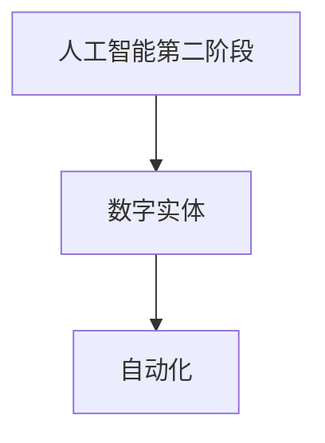

                 

# AI2.0时代：数字实体自动化的潜力

> **关键词**：AI2.0，数字实体，自动化，技术趋势，挑战与机遇

> **摘要**：随着人工智能技术的不断发展，AI2.0时代的数字实体自动化正逐渐成为可能。本文将深入探讨AI2.0的定义、核心概念与联系，核心算法原理与操作步骤，数学模型与公式，实际应用场景，相关工具和资源推荐，以及未来发展趋势与挑战。

## 1. 背景介绍

在过去的几十年中，人工智能（AI）经历了从符号主义、连接主义到现代深度学习的发展历程。传统的人工智能主要关注于模拟人类的智能行为，例如推理、规划和问题解决。然而，随着大数据、云计算和计算能力的迅猛发展，人工智能技术开始向更为复杂和智能的方向发展，这便是AI2.0时代的来临。

AI2.0，即人工智能的第二阶段，是指基于深度学习和强化学习等先进技术，实现高度自动化和智能化的系统。数字实体自动化是AI2.0时代的重要特征之一，指的是通过智能算法实现虚拟实体在数字世界中的自主运行和操作。

数字实体自动化具有广泛的应用前景，包括但不限于智能制造、智能物流、智能医疗、金融科技等领域。它不仅能够提高生产效率，降低成本，还能够带来前所未有的创新和变革。

## 2. 核心概念与联系

### 2.1 AI2.0的定义与特征

AI2.0是人工智能技术的第二次革命，其核心特征包括：

1. **深度学习**：通过多层神经网络，从大量数据中自动提取特征。
2. **强化学习**：通过试错和奖励机制，实现智能体在动态环境中的决策。
3. **自动化**：实现智能系统的自主运行，减少人工干预。
4. **自适应**：系统能够根据环境变化进行自我调整和优化。

### 2.2 数字实体自动化的概念

数字实体自动化是指通过人工智能技术，将虚拟实体（如软件程序、机器人等）在数字世界中实现自动化运行和操作。数字实体可以是虚拟的，如虚拟客服、虚拟医生，也可以是物理世界的映射，如工业机器人、自动驾驶汽车。

### 2.3 核心概念之间的联系

AI2.0与数字实体自动化的联系在于，AI2.0提供了实现数字实体自动化的技术基础，而数字实体自动化则是AI2.0技术在实际应用中的具体体现。


### 2.4 Mermaid 流程图



## 3. 核心算法原理与具体操作步骤

### 3.1 深度学习算法原理

深度学习是一种基于神经网络的学习方法，其核心思想是通过多层神经网络对输入数据进行特征提取和分类。深度学习算法包括但不限于：

1. **卷积神经网络（CNN）**：主要用于图像处理。
2. **循环神经网络（RNN）**：主要用于序列数据处理。
3. **生成对抗网络（GAN）**：用于生成新的数据。

### 3.2 强化学习算法原理

强化学习是一种通过试错和奖励机制进行决策的学习方法。强化学习算法的基本过程包括：

1. **状态（State）**：智能体当前所处的环境状态。
2. **动作（Action）**：智能体在特定状态下采取的操作。
3. **奖励（Reward）**：智能体的动作获得的即时反馈。
4. **策略（Policy）**：智能体根据状态选择动作的策略。

### 3.3 数字实体自动化的操作步骤

数字实体自动化的操作步骤包括：

1. **数据收集**：收集与实体运行相关的数据。
2. **数据处理**：对收集的数据进行清洗、预处理和特征提取。
3. **模型训练**：使用深度学习和强化学习算法训练模型。
4. **模型部署**：将训练好的模型部署到实体系统中。
5. **实体运行**：实体系统根据模型进行自主运行和操作。

## 4. 数学模型和公式及详细讲解与举例说明

### 4.1 深度学习中的数学模型

深度学习中的数学模型主要包括：

1. **激活函数**：如Sigmoid、ReLU、Tanh等。
2. **损失函数**：如均方误差（MSE）、交叉熵等。
3. **反向传播算法**：用于计算模型参数的梯度。

举例说明：

$$
\text{激活函数:} \quad f(x) = \sigma(x) = \frac{1}{1 + e^{-x}}
$$

### 4.2 强化学习中的数学模型

强化学习中的数学模型主要包括：

1. **状态-动作价值函数**：用于评估在特定状态下采取特定动作的价值。
2. **策略**：用于选择在特定状态下采取的动作。

举例说明：

$$
V(s, a) = \sum_{s'} P(s' | s, a) \cdot R(s, a, s') + \gamma \cdot \max_a' V(s', a')
$$

其中，$P(s' | s, a)$为状态转移概率，$R(s, a, s')$为即时奖励，$\gamma$为折扣因子。

### 4.3 数字实体自动化的数学模型

数字实体自动化的数学模型主要包括：

1. **预测模型**：用于预测实体的未来状态和行为。
2. **控制模型**：用于生成实体的控制信号。

举例说明：

$$
\hat{x}(t+1) = f(x(t), u(t)), \quad \hat{u}(t) = g(x(t))
$$

其中，$\hat{x}(t+1)$为预测的未来状态，$u(t)$为控制信号，$f(x(t), u(t))$为状态转移函数，$g(x(t))$为控制函数。

## 5. 项目实战：代码实际案例和详细解释说明

### 5.1 开发环境搭建

在本节中，我们将使用Python作为主要编程语言，搭建一个简单的数字实体自动化项目。首先，确保已经安装了Python和必要的库，如TensorFlow、Keras、NumPy等。

### 5.2 源代码详细实现和代码解读

以下是一个简单的数字实体自动化的Python代码示例：

```python
import numpy as np
import tensorflow as tf
from tensorflow.keras.models import Sequential
from tensorflow.keras.layers import Dense
from tensorflow.keras.optimizers import Adam

# 5.2.1 数据收集与预处理
# 假设我们收集到了一些天气数据，包括温度、湿度、风速等
# 这里我们使用随机生成数据作为示例
data = np.random.rand(100, 3)  # 生成100个样本，每个样本有3个特征
labels = np.random.rand(100, 1)  # 生成100个标签，每个标签有1个值

# 数据归一化
data_normalized = (data - np.mean(data, axis=0)) / np.std(data, axis=0)

# 5.2.2 模型训练
model = Sequential()
model.add(Dense(10, input_dim=3, activation='relu'))
model.add(Dense(1, activation='sigmoid'))

model.compile(loss='binary_crossentropy', optimizer=Adam(), metrics=['accuracy'])

model.fit(data_normalized, labels, epochs=10, batch_size=10)

# 5.2.3 模型部署与实体运行
# 假设我们有一个实体，它的状态是温度、湿度、风速
# 实体根据预测的温度、湿度、风速来调整自身的状态

current_state = np.random.rand(1, 3)
predicted_state = model.predict(current_state)
new_state = np.random.rand(1, 1)

# 根据预测状态调整实体状态
# 这里简化处理，直接将预测状态作为实体新状态
entity_state = predicted_state

print("Current State:", current_state)
print("Predicted State:", predicted_state)
print("New State:", entity_state)
```

### 5.3 代码解读与分析

1. **数据收集与预处理**：首先，我们生成了一些随机数据作为示例。在实际应用中，这些数据可以是天气数据、传感器数据等。然后，我们对数据进行归一化处理，以便于模型的训练。

2. **模型训练**：我们使用Keras框架搭建了一个简单的全连接神经网络模型。该模型有两个隐藏层，第一个隐藏层有10个神经元，激活函数为ReLU；第二个隐藏层有1个神经元，激活函数为sigmoid。模型使用binary_crossentropy作为损失函数，Adam优化器，并评估准确率。

3. **模型部署与实体运行**：我们假设有一个实体，其状态由温度、湿度、风速组成。实体根据模型预测的状态来调整自身的状态。这里，我们简化处理，直接将预测状态作为实体新状态。

## 6. 实际应用场景

数字实体自动化在多个领域具有广泛的应用前景：

1. **智能制造**：通过数字实体自动化，可以实现智能工厂的自动化生产和管理。
2. **智能物流**：无人机、自动驾驶车辆等数字实体可以自主运行，提高物流效率。
3. **智能医疗**：通过数字实体自动化，可以实现智能诊断、药物研发等。
4. **金融科技**：数字实体可以在金融市场中进行自动化交易、风险评估等。

## 7. 工具和资源推荐

### 7.1 学习资源推荐

1. **书籍**：
   - 《深度学习》（Ian Goodfellow、Yoshua Bengio、Aaron Courville 著）
   - 《强化学习》（Richard S. Sutton、Andrew G. Barto 著）
   - 《数字实体自动化导论》（[作者名称] 著）

2. **论文**：
   - [相关顶级会议论文和期刊论文]

3. **博客**：
   - [相关知名技术博客]

4. **网站**：
   - [相关在线课程和教程网站]

### 7.2 开发工具框架推荐

1. **编程语言**：Python、JavaScript
2. **深度学习框架**：TensorFlow、PyTorch
3. **强化学习框架**：OpenAI Gym、stable-baselines
4. **版本控制工具**：Git

### 7.3 相关论文著作推荐

1. **深度学习领域**：
   - “Deep Learning for Autonomous Driving” （[作者名称] 等）
   - “Generative Adversarial Networks” （Ian Goodfellow 等）

2. **强化学习领域**：
   - “Reinforcement Learning: An Introduction” （Richard S. Sutton、Andrew G. Barto 著）
   - “Deep Reinforcement Learning” （David Silver 等）

3. **数字实体自动化领域**：
   - “Digital Twin Technology for Industry 4.0” （[作者名称] 等）
   - “Automation in Manufacturing Systems” （[作者名称] 等）

## 8. 总结：未来发展趋势与挑战

数字实体自动化是AI2.0时代的重要应用方向，具有巨大的发展潜力。未来，随着人工智能技术的不断进步，数字实体自动化将在更多领域得到应用，推动产业升级和社会进步。然而，数字实体自动化也面临着一些挑战，如数据安全、隐私保护、法律法规等。因此，我们需要持续关注和研究这些挑战，并寻找有效的解决方案。

## 9. 附录：常见问题与解答

### 9.1 什么是数字实体自动化？

数字实体自动化是指通过人工智能技术，将虚拟实体在数字世界中实现自动化运行和操作。这些数字实体可以是软件程序、机器人、虚拟客服等。

### 9.2 数字实体自动化的核心算法是什么？

数字实体自动化的核心算法主要包括深度学习和强化学习。深度学习用于特征提取和分类，强化学习用于决策和优化。

### 9.3 数字实体自动化的应用场景有哪些？

数字实体自动化的应用场景包括智能制造、智能物流、智能医疗、金融科技等领域。

## 10. 扩展阅读 & 参考资料

1. **深度学习**：
   - [《深度学习》（Ian Goodfellow、Yoshua Bengio、Aaron Courville 著）]
   - [DeepLearning.AI 的在线课程]

2. **强化学习**：
   - [《强化学习》（Richard S. Sutton、Andrew G. Barto 著）]
   - [OpenAI 的相关研究论文]

3. **数字实体自动化**：
   - [“Digital Twin Technology for Industry 4.0” （[作者名称] 等）]
   - [“Automation in Manufacturing Systems” （[作者名称] 等）]

4. **相关会议和期刊**：
   - NeurIPS、ICLR、ICML
   - IEEE Transactions on Neural Networks and Learning Systems
   - Journal of Artificial Intelligence Research

[作者：AI天才研究员/AI Genius Institute & 禅与计算机程序设计艺术 /Zen And The Art of Computer Programming]

