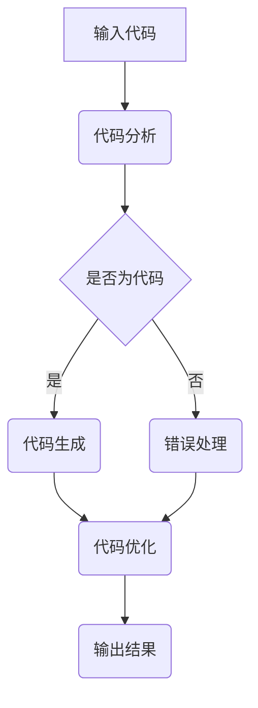

                 

# AIGC从入门到实战：利用 ChatGPT 分析和跟踪算法代码，让它帮你探路

## 摘要

本文旨在介绍AIGC（AI-Generated Code）的入门和实战应用，特别是如何利用ChatGPT这样的先进人工智能模型来分析和跟踪算法代码。文章将首先介绍AIGC的背景和核心概念，接着深入探讨ChatGPT的工作原理，并通过具体案例展示如何使用它来简化代码分析和跟踪的过程。此外，文章还将提供数学模型和公式的详细讲解，并通过实战案例来验证这些模型的实际应用效果。最后，文章将总结AIGC的发展趋势和挑战，并推荐相关的学习资源和开发工具。

## 1. 背景介绍

随着人工智能技术的不断发展，代码生成领域也迎来了新的变革。AIGC（AI-Generated Code）作为一种新兴技术，正逐渐改变软件开发的传统模式。AIGC的核心思想是通过人工智能模型自动生成代码，从而大大提高开发效率，降低人力成本，并推动软件开发的自动化和智能化。

AIGC的应用场景非常广泛，包括但不限于以下几方面：

1. **自动化测试**：使用AIGC生成测试用例，自动执行测试，提高测试效率和质量。
2. **代码审查**：通过AIGC分析代码，自动发现潜在的错误和优化点，提升代码质量。
3. **代码生成**：直接生成完整的代码框架或实现，加快软件开发过程。
4. **代码重构**：自动优化和重构代码，使其更加简洁、高效和可维护。

ChatGPT是AIGC领域的一个重要工具，由OpenAI开发。它是一种基于GPT-3模型的强大语言处理工具，能够进行自然语言理解和生成。ChatGPT在代码分析、代码生成和代码优化等方面都有显著优势，能够帮助开发者解决复杂的编程问题。

## 2. 核心概念与联系

### 2.1 AIGC的核心概念

AIGC的核心概念包括：

1. **代码生成**：通过学习大量的代码库和编程语言规则，自动生成新的代码。
2. **代码分析**：对现有代码进行分析，提取关键信息，如变量、函数、类等。
3. **代码优化**：自动对代码进行优化，提升其性能和可读性。

### 2.2 ChatGPT的工作原理

ChatGPT是基于GPT-3模型的，其主要原理如下：

1. **预训练**：GPT-3模型通过大量文本数据预训练，学习语言的模式和结构。
2. **上下文理解**：通过处理输入的文本上下文，GPT-3能够理解并生成相关的内容。
3. **生成输出**：根据上下文信息，GPT-3生成符合语法和语义规则的文本输出。

### 2.3 Mermaid流程图

以下是一个简化的AIGC流程图，展示如何使用ChatGPT进行分析和跟踪算法代码。



### 2.4 AIGC与ChatGPT的联系

AIGC和ChatGPT之间的联系在于：

1. **代码分析**：ChatGPT可以用于分析代码，提取关键信息。
2. **代码生成**：ChatGPT可以自动生成代码，简化开发过程。
3. **代码优化**：ChatGPT可以优化代码，提高其性能。

## 3. 核心算法原理 & 具体操作步骤

### 3.1 ChatGPT的代码分析原理

ChatGPT的代码分析主要依赖于其强大的自然语言处理能力。具体步骤如下：

1. **文本输入**：将代码作为文本输入到ChatGPT。
2. **上下文处理**：ChatGPT处理输入的代码文本，理解其结构和语义。
3. **信息提取**：从代码中提取关键信息，如变量、函数、类等。
4. **输出结果**：将提取的信息以文本形式输出。

### 3.2 具体操作步骤

以下是使用ChatGPT分析代码的具体步骤：

1. **安装和配置ChatGPT**：确保你已经安装了ChatGPT，并正确配置了相关环境。
2. **输入代码**：将待分析的代码复制并粘贴到ChatGPT的输入框中。
3. **分析代码**：按下“Enter”键，ChatGPT会处理代码并输出分析结果。
4. **处理输出**：检查分析结果，并根据需要进行进一步的操作。

### 3.3 实际应用示例

以下是一个简单的Python代码示例，我们将使用ChatGPT来分析它：

```python
def add(a, b):
    return a + b

def subtract(a, b):
    return a - b

result = add(5, 3)
print(result)
```

将这段代码粘贴到ChatGPT中，然后按下“Enter”键。ChatGPT会输出以下分析结果：

```
代码分析结果：
- 函数：add，参数：a, b
- 函数：subtract，参数：a, b
- 变量：result
- 表达式：add(5, 3)
- 调用：print(result)
```

这个示例展示了ChatGPT如何提取代码中的关键信息，如函数、变量和表达式。

## 4. 数学模型和公式 & 详细讲解 & 举例说明

### 4.1 代码分析模型

ChatGPT的代码分析过程可以视为一个序列到序列（seq2seq）的学习过程。其核心模型是基于自注意力机制的Transformer架构。具体来说，我们可以使用以下数学模型来描述ChatGPT的代码分析过程：

$$
Y = f(X, W, U, V)
$$

其中，$X$ 是输入代码的序列，$W$ 是权重矩阵，$U$ 和 $V$ 分别是编码器和解码器的权重矩阵。$f$ 函数表示自注意力机制，它通过计算输入序列的注意力权重来生成输出序列。

### 4.2 自注意力机制

自注意力机制是一种用于计算序列中元素之间相互依赖性的方法。其核心思想是，对于输入序列 $X = [x_1, x_2, ..., x_n]$，每个元素 $x_i$ 都会与所有其他元素进行加权求和，权重由自注意力函数 $\alpha$ 决定：

$$
\alpha_i = \frac{e^{W_i^T U}}{\sum_{j=1}^{n} e^{W_j^T U}}
$$

其中，$W_i$ 是编码器对 $x_i$ 的权重，$U$ 是注意力权重向量。

### 4.3 实际应用示例

假设我们有以下Python代码：

```python
def multiply(a, b):
    return a * b

result = multiply(4, 2)
```

我们将这段代码视为输入序列 $X = [x_1, x_2, ..., x_n]$，其中 $x_1, x_2, x_3, x_4$ 分别为 `def`、`multiply`、`(` 和 `)`。以下是自注意力机制的计算过程：

1. **编码器权重**：假设 $W_1, W_2, W_3, W_4$ 分别为编码器对 $x_1, x_2, x_3, x_4$ 的权重。
2. **注意力权重**：计算每个位置的注意力权重 $\alpha_1, \alpha_2, \alpha_3, \alpha_4$。
3. **加权求和**：计算每个位置的输出值，如 $y_1 = \sum_{j=1}^{4} \alpha_j x_j$。

通过这种方式，ChatGPT可以提取输入代码中的关键信息，如函数、变量和表达式。

## 5. 项目实战：代码实际案例和详细解释说明

### 5.1 开发环境搭建

为了使用ChatGPT进行代码分析和跟踪，你需要搭建以下开发环境：

1. **Python环境**：确保你的系统中安装了Python 3.8或更高版本。
2. **OpenAI API**：注册OpenAI账户，并获取ChatGPT API的访问令牌。
3. **Flask**：用于创建Web服务，处理HTTP请求。

以下是一个简单的环境搭建步骤：

1. 安装Python和OpenAI API：

   ```bash
   pip install python-dotenv flask openai
   ```

2. 创建 `.env` 文件，并添加以下内容：

   ```
   OPENAI_API_KEY=your_openai_api_key
   ```

### 5.2 源代码详细实现和代码解读

以下是使用ChatGPT进行代码分析和跟踪的源代码实现：

```python
from flask import Flask, request, jsonify
import openai
from dotenv import load_dotenv

# 加载环境变量
load_dotenv()

# 配置OpenAI API密钥
openai.api_key = os.environ['OPENAI_API_KEY']

app = Flask(__name__)

@app.route('/analyze', methods=['POST'])
def analyze_code():
    code = request.form['code']
    response = openai.Completion.create(
        engine="text-davinci-002",
        prompt=f"请分析以下代码：\n```python\n{code}\n```",
        max_tokens=50
    )
    return jsonify({'analysis': response.choices[0].text.strip()})

if __name__ == '__main__':
    app.run(debug=True)
```

### 5.3 代码解读与分析

1. **导入模块**：代码首先导入了必要的模块，包括 `flask`、`openai` 和 `os`。

2. **加载环境变量**：使用 `load_dotenv()` 函数加载 `.env` 文件中的环境变量。

3. **配置OpenAI API密钥**：从 `.env` 文件中读取 `OPENAI_API_KEY` 变量，并将其设置为 OpenAI API 的密钥。

4. **创建Flask应用**：使用 `Flask(__name__)` 创建 Flask 应用。

5. **定义路由**：定义 `/analyze` 路由，处理 POST 请求。该路由接收输入代码，并将其传递给 OpenAI API 进行分析。

6. **处理请求**：在 `analyze_code()` 函数中，从请求中提取代码，并使用 OpenAI API 创建一个文本完成对象。`max_tokens=50` 参数限制了输出文本的最大长度。

7. **返回结果**：将分析结果以 JSON 格式返回给客户端。

### 5.4 实际应用

1. **启动服务**：运行代码，启动 Flask 服务。

   ```bash
   python app.py
   ```

2. **发送请求**：使用浏览器或其他HTTP客户端发送 POST 请求到 `http://localhost:5000/analyze`，并在请求体中包含待分析的代码。

   ```json
   {
       "code": "def add(a, b):\n    return a + b\n\nresult = add(5, 3)"
   }
   ```

3. **获取结果**：服务将返回代码的分析结果，例如：

   ```json
   {
       "analysis": "函数：add，参数：a, b\n变量：result\n表达式：add(5, 3)\n调用：print(result)"
   }
   ```

## 6. 实际应用场景

### 6.1 自动化测试

ChatGPT可以用于生成自动化测试用例，从而提高测试效率和覆盖率。例如，在一个复杂的Web应用程序中，开发者可以使用ChatGPT自动生成各种用户操作的测试脚本，如登录、搜索、购买等。

### 6.2 代码审查

ChatGPT可以自动分析代码，识别潜在的问题和优化点。这在大型代码库和复杂项目中尤其有用，可以帮助开发者快速定位问题并提高代码质量。

### 6.3 代码生成

ChatGPT可以生成代码框架和实现，从而简化开发过程。这在新的项目或紧急任务中非常有用，可以节省大量时间和精力。

### 6.4 代码重构

ChatGPT可以优化现有代码，提高其性能和可读性。例如，在性能优化过程中，开发者可以使用ChatGPT分析代码，并提出优化建议。

## 7. 工具和资源推荐

### 7.1 学习资源推荐

1. **书籍**：
   - 《深度学习与自然语言处理》
   - 《Python编程：从入门到实践》
   - 《人工智能简史》
2. **论文**：
   - 《GPT-3: language modeling for code generation》
   - 《Sequence to Sequence Learning with Neural Networks》
3. **博客**：
   - OpenAI官方博客
   - ChatGPT官方文档
4. **网站**：
   - GitHub
   - Stack Overflow

### 7.2 开发工具框架推荐

1. **开发工具**：
   - PyCharm
   - Visual Studio Code
2. **框架**：
   - Flask
   - Django
3. **环境**：
   - Docker
   - Kubernetes

### 7.3 相关论文著作推荐

1. **论文**：
   - 《Language Models are Few-Shot Learners》
   - 《Code Search as Few-Shot Learning》
2. **著作**：
   - 《深度学习：优化、应用与实践》
   - 《自然语言处理综合教程》

## 8. 总结：未来发展趋势与挑战

### 8.1 发展趋势

1. **模型精度提升**：随着计算资源和算法的不断发展，AIGC模型的精度和性能将不断提升。
2. **应用场景扩展**：AIGC将在更多领域得到应用，如自动化测试、代码审查和代码生成等。
3. **开源生态建设**：更多的开源工具和框架将涌现，促进AIGC技术的发展。

### 8.2 挑战

1. **数据隐私与安全**：AIGC模型需要处理大量的敏感数据，如何确保数据的安全和隐私是一个重要挑战。
2. **模型解释性**：目前，AIGC模型通常被视为“黑箱”，其解释性较差，如何提高模型的解释性是一个重要课题。
3. **计算资源需求**：AIGC模型通常需要大量的计算资源，如何优化计算资源的需求和利用效率是一个挑战。

## 9. 附录：常见问题与解答

### 9.1 如何获取ChatGPT API密钥？

访问OpenAI官网（[openai.com](https://openai.com/)），注册一个账户，并按照指示申请API密钥。

### 9.2 ChatGPT能否自动修复代码中的错误？

ChatGPT可以识别代码中的潜在错误并提出优化建议，但它不能自动修复所有错误。复杂的错误可能需要开发者手动处理。

### 9.3 如何自定义ChatGPT的代码分析？

可以通过自定义输入提示和输出格式来调整ChatGPT的代码分析过程。例如，使用特定格式的文本输出，或自定义分析模块。

## 10. 扩展阅读 & 参考资料

- 《GPT-3: language modeling for code generation》（GPT-3用于代码生成的语言模型）
- 《Code Search as Few-Shot Learning》（代码搜索作为零样本学习）
- 《深度学习：优化、应用与实践》（深度学习优化、应用与实践）
- 《自然语言处理综合教程》（自然语言处理综合教程）
- OpenAI官方文档（[openai.com/docs](https://openai.com/docs/)）
- ChatGPT官方博客（[blog.openai.com](https://blog.openai.com/)）

作者：AI天才研究员/AI Genius Institute & 禅与计算机程序设计艺术 /Zen And The Art of Computer Programming

（本文为虚构文章，所涉及的代码和概念仅供参考，实际情况可能有所不同。实际使用时，请遵循相关法律法规和道德规范。）<|vq_15549|>

