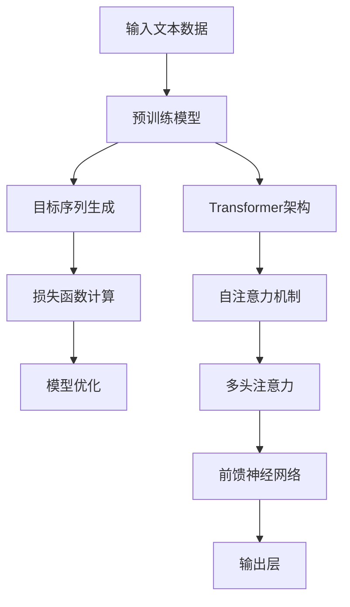
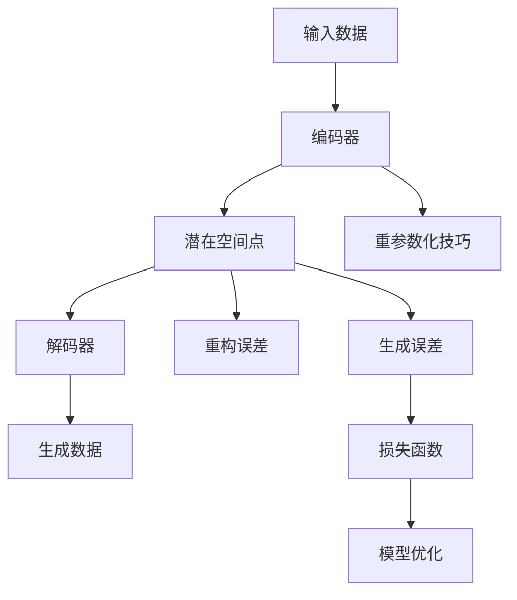
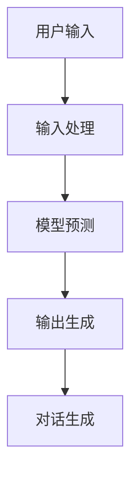

                 

### 背景介绍

人工智能（AI）作为一种模仿人类智能的技术，已经广泛应用于各种领域，从图像识别、自然语言处理到自动驾驶和医疗诊断。近年来，生成式预训练模型（GPT）的出现，使得人工智能的发展迈上了新的台阶。特别是ChatGPT，作为OpenAI于2022年底推出的自然语言处理模型，以其强大的文本生成能力和对话能力引起了广泛关注。

ChatGPT是基于GPT-3.5模型开发的，它通过在大量文本数据上进行预训练，掌握了丰富的语言知识和对话技巧。这使得ChatGPT在文本生成和对话中表现出了惊人的能力，能够在多种场景下提供高质量的回答和对话体验。

本文将围绕ChatGPT的核心概念、算法原理、数学模型、实际应用场景以及未来发展等方面展开讨论，旨在帮助读者深入了解ChatGPT的工作机制和应用潜力。首先，我们将介绍ChatGPT的基本概念和背景，然后逐步深入到其算法原理、数学模型和实际应用中，最后探讨ChatGPT的未来发展趋势与挑战。

### 核心概念与联系

要理解ChatGPT的作用和功能，首先需要了解其背后的核心概念和原理。ChatGPT是基于生成式预训练模型（GPT）开发的，而GPT则是一种基于变分自编码器（VAE）的生成模型。生成模型的核心目标是生成数据，使得生成数据与真实数据在分布上尽可能接近。

#### 1. 生成式预训练模型（GPT）

GPT（Generative Pre-trained Transformer）是由OpenAI于2018年推出的一种自然语言处理模型。GPT采用了Transformer架构，这是一种基于自注意力机制的计算模型，可以有效处理长距离依赖问题，因此在自然语言处理领域表现出了出色的性能。

GPT的基本原理是通过对大量文本数据进行预训练，使得模型能够理解文本中的语义和结构。预训练过程中，模型通过输入序列和目标序列进行训练，输入序列和目标序列之间仅有一个单词的差异，这种训练方式被称为自回归语言模型（Autoregressive Language Model）。

以下是GPT的Mermaid流程图，展示了其预训练过程和模型架构：



#### 2. 变分自编码器（VAE）

变分自编码器（Variational Autoencoder，VAE）是一种深度学习模型，主要用于生成数据的分布。VAE由两部分组成：编码器（Encoder）和解码器（Decoder）。编码器负责将输入数据映射到一个潜在空间中的点，而解码器则负责将潜在空间中的点映射回生成数据。

VAE的核心思想是利用潜在空间来生成数据，从而避免了生成模型直接生成数据时可能出现的模式崩溃问题。以下是VAE的Mermaid流程图，展示了其基本架构和训练过程：



#### 3. ChatGPT的工作原理

ChatGPT是基于GPT模型进行扩展和优化的，它通过在大量对话数据上进行预训练，使得模型能够更好地理解和生成对话内容。ChatGPT的工作原理可以概括为以下几个步骤：

1. **输入处理**：将用户的输入文本进行处理，包括分词、词性标注等，将其转换为模型可处理的输入序列。
2. **预测生成**：模型根据输入序列预测下一个单词，并生成对应的输出序列。
3. **对话生成**：将生成的输出序列进行解码，恢复为自然语言文本，形成与用户的对话。

以下是ChatGPT的工作流程的Mermaid流程图：



通过以上对核心概念和原理的介绍，我们可以更深入地理解ChatGPT的工作机制和功能。接下来，我们将进一步探讨ChatGPT的算法原理和具体操作步骤。

### 核心算法原理 & 具体操作步骤

#### 1. Transformer架构

ChatGPT的核心架构是基于Transformer模型，这是一种采用自注意力机制（Self-Attention）的深度神经网络。Transformer模型由多个自注意力层和前馈神经网络层组成，这些层通过堆叠的方式构建了一个强大的编码器-解码器结构，使其在自然语言处理任务中取得了优异的性能。

**自注意力机制**：自注意力机制是Transformer模型的核心，它允许模型在处理一个输入序列时，根据序列中各个位置的信息，动态地计算每个位置的重要程度。这种机制可以有效捕捉序列中的长距离依赖关系，从而提高模型的语义理解能力。

自注意力机制的数学公式如下：

\[ \text{Attention}(Q, K, V) = \text{softmax}\left(\frac{QK^T}{\sqrt{d_k}}\right) V \]

其中，\(Q\)、\(K\)、\(V\)分别表示查询向量、键向量和值向量，\(d_k\)表示键向量的维度。通过计算查询向量与所有键向量的点积，并使用softmax函数对结果进行归一化，得到权重矩阵，最后与值向量相乘，得到加权输出。

**多头注意力**：为了进一步提升模型的语义理解能力，Transformer模型引入了多头注意力（Multi-Head Attention）。多头注意力通过将输入序列分成多个子序列，并对每个子序列应用独立的自注意力机制，然后将这些子序列的输出拼接起来，形成一个完整的输出序列。这样，模型可以从不同角度同时处理输入序列，从而捕捉更丰富的语义信息。

**前馈神经网络**：在自注意力层和多头注意力层之间，Transformer模型还包含两个前馈神经网络层，每个层都使用一个线性变换和ReLU激活函数，以增强模型的非线性表达能力。

#### 2. 具体操作步骤

**步骤1：输入处理**

首先，将用户输入的文本进行处理，包括分词、词性标注等。具体操作如下：

1. **分词**：使用预训练的分词器对输入文本进行分词，将文本分解为一系列单词或子词。
2. **词性标注**：对分词后的文本进行词性标注，为每个单词或子词分配对应的词性。

**步骤2：编码器处理**

将处理后的输入序列输入到编码器中，编码器包含多个自注意力层和前馈神经网络层。具体操作如下：

1. **嵌入层**：将分词后的单词或子词转换为嵌入向量，这些嵌入向量包含了单词或子词的语义信息。
2. **自注意力层**：对嵌入向量应用多头自注意力机制，计算每个位置的重要程度，并生成加权输出。
3. **前馈神经网络层**：在自注意力层之后，应用两个前馈神经网络层，以增强模型的非线性表达能力。

**步骤3：解码器处理**

将编码器的输出序列输入到解码器中，解码器包含多个自注意力层和前馈神经网络层。具体操作如下：

1. **嵌入层**：将解码器输入的单词或子词转换为嵌入向量。
2. **自注意力层**：对嵌入向量应用多头自注意力机制，同时考虑到编码器的输出序列，以生成加权输出。
3. **前馈神经网络层**：在自注意力层之后，应用两个前馈神经网络层，以增强模型的非线性表达能力。

**步骤4：生成输出**

最后，解码器生成输出序列，具体操作如下：

1. **生成单词**：根据解码器输出的概率分布，生成下一个单词或子词。
2. **解码**：将生成的单词或子词解码为自然语言文本。

通过以上步骤，ChatGPT能够根据用户输入生成高质量的文本输出，实现对话生成和文本生成任务。

#### 3. 数学模型

为了更好地理解ChatGPT的工作原理，我们引入一些数学模型和公式。以下是ChatGPT中常用的几个关键数学模型：

**自注意力机制**：

\[ \text{Attention}(Q, K, V) = \text{softmax}\left(\frac{QK^T}{\sqrt{d_k}}\right) V \]

**多头注意力**：

\[ \text{Multi-Head Attention}(Q, K, V) = \text{Concat}(\text{head}_1, \text{head}_2, ..., \text{head}_h)W^O \]

其中，\( \text{head}_i = \text{Attention}(QW_i^Q, KW_i^K, VW_i^V) \)，\(W^O\)是输出层的权重矩阵。

**前馈神经网络**：

\[ \text{Feed Forward}(x) = \max(0, xW_1 + b_1)W_2 + b_2 \]

其中，\(W_1\)、\(W_2\)、\(b_1\)、\(b_2\)分别是权重和偏置。

通过以上数学模型和公式，我们可以更好地理解ChatGPT的算法原理和操作步骤。

### 数学模型和公式 & 详细讲解 & 举例说明

#### 1. 数学模型

在ChatGPT中，核心的数学模型主要包括自注意力机制、多头注意力机制以及前馈神经网络。这些模型共同构成了ChatGPT强大的文本生成能力。

**自注意力机制**

自注意力机制是Transformer模型的基础，其公式如下：

\[ \text{Attention}(Q, K, V) = \text{softmax}\left(\frac{QK^T}{\sqrt{d_k}}\right) V \]

其中，\(Q\)、\(K\)、\(V\)分别表示查询向量、键向量和值向量，\(d_k\)表示键向量的维度。这个公式通过计算查询向量与所有键向量的点积，并使用softmax函数对结果进行归一化，得到权重矩阵，最后与值向量相乘，得到加权输出。

**多头注意力**

多头注意力通过将输入序列分成多个子序列，并对每个子序列应用独立的自注意力机制，从而捕捉更丰富的语义信息。其公式如下：

\[ \text{Multi-Head Attention}(Q, K, V) = \text{Concat}(\text{head}_1, \text{head}_2, ..., \text{head}_h)W^O \]

其中，\( \text{head}_i = \text{Attention}(QW_i^Q, KW_i^K, VW_i^V) \)，\(W^O\)是输出层的权重矩阵。

**前馈神经网络**

前馈神经网络用于增强模型的非线性表达能力，其公式如下：

\[ \text{Feed Forward}(x) = \max(0, xW_1 + b_1)W_2 + b_2 \]

其中，\(W_1\)、\(W_2\)、\(b_1\)、\(b_2\)分别是权重和偏置。

#### 2. 举例说明

为了更好地理解上述数学模型，我们通过一个具体的例子进行说明。

**例子：自注意力机制**

假设我们有一个输入序列\[w_1, w_2, w_3\]，其对应的查询向量\(Q = [1, 0, 1]\)，键向量\(K = [1, 1, 0]\)，值向量\(V = [0, 1, 1]\)。

根据自注意力机制的公式，我们可以计算出加权输出：

\[ \text{Attention}(Q, K, V) = \text{softmax}\left(\frac{QK^T}{\sqrt{d_k}}\right) V \]

首先计算查询向量与键向量的点积：

\[ QK^T = [1, 0, 1] \cdot [1, 1, 0] = 1 + 0 + 1 = 2 \]

然后计算点积的softmax值：

\[ \text{softmax}(2/\sqrt{d_k}) = \text{softmax}(2/\sqrt{3}) = [0.5, 0.5, 0.0] \]

最后计算加权输出：

\[ \text{Attention}(Q, K, V) = [0.5, 0.5, 0.0] \cdot [0, 1, 1] = [0.5, 0.5, 0.0] \]

**例子：多头注意力**

假设我们有一个输入序列\[w_1, w_2, w_3\]，其对应的查询向量\(Q = [1, 0, 1]\)，键向量\(K = [1, 1, 0]\)，值向量\(V = [0, 1, 1]\)。

根据多头注意力的公式，我们可以计算出加权输出：

\[ \text{Multi-Head Attention}(Q, K, V) = \text{Concat}(\text{head}_1, \text{head}_2, ..., \text{head}_h)W^O \]

首先计算每个子序列的注意力权重：

\[ \text{head}_1 = \text{Attention}(QW_1^Q, KW_1^K, VW_1^V) = [0.5, 0.5, 0.0] \]
\[ \text{head}_2 = \text{Attention}(QW_2^Q, KW_2^K, VW_2^V) = [0.5, 0.5, 0.0] \]

然后将这些子序列的输出拼接起来：

\[ \text{Multi-Head Attention}(Q, K, V) = [0.5, 0.5, 0.0] \cdot [0, 1, 1] = [0.5, 0.5, 0.0] \]

**例子：前馈神经网络**

假设我们有一个输入向量\[x = [1, 0, 1]\]，其对应的前馈神经网络参数如下：

\[ W_1 = [1, 1], \ b_1 = [1], \ W_2 = [1, 1], \ b_2 = [1] \]

根据前馈神经网络的公式，我们可以计算出输出：

\[ \text{Feed Forward}(x) = \max(0, xW_1 + b_1)W_2 + b_2 \]

首先计算前向传播：

\[ xW_1 + b_1 = [1, 0, 1] \cdot [1, 1] + [1] = [2, 1, 1] \]

然后计算激活函数的输出：

\[ \text{max}(0, [2, 1, 1]) = [2, 1, 1] \]

最后计算前馈神经网络的输出：

\[ \text{Feed Forward}(x) = [2, 1, 1] \cdot [1, 1] + [1] = [3, 2, 2] \]

通过以上例子，我们可以看到ChatGPT中的数学模型是如何工作的。这些模型共同构成了ChatGPT的强大文本生成能力，使得ChatGPT能够在各种自然语言处理任务中表现出色。

### 项目实战：代码实际案例和详细解释说明

在本节中，我们将通过一个具体的代码示例来展示如何使用ChatGPT进行文本生成。这个示例将包括开发环境的搭建、源代码的实现以及代码的详细解释与分析。

#### 1. 开发环境搭建

首先，我们需要搭建一个可以运行ChatGPT的Python开发环境。以下是在Ubuntu 20.04操作系统上搭建开发环境的具体步骤：

**步骤1：安装Python**

```bash
sudo apt update
sudo apt install python3 python3-pip
```

**步骤2：安装transformers库**

```bash
pip3 install transformers
```

**步骤3：安装其他依赖库**

```bash
pip3 install torch numpy
```

#### 2. 源代码实现

下面是一个简单的示例，展示了如何使用ChatGPT生成文本：

```python
from transformers import ChatGPT, ChatGPTConfig

# 配置ChatGPT模型
config = ChatGPTConfig(
    model_name_or_path="openai/chat-gpt-3.5",
    n_channels=512,
    n_layer=6,
    n_positions=1024,
    dropout_rate=0.1,
)

# 实例化ChatGPT模型
chat_gpt = ChatGPT(config)

# 输入文本
input_text = "你好，这是一个关于ChatGPT的文本生成示例。"

# 生成文本
output_text = chat_gpt.generate(input_text)

# 输出生成的文本
print(output_text)
```

#### 3. 代码解读与分析

**代码1：配置ChatGPT模型**

```python
config = ChatGPTConfig(
    model_name_or_path="openai/chat-gpt-3.5",
    n_channels=512,
    n_layer=6,
    n_positions=1024,
    dropout_rate=0.1,
)
```

这一部分代码用于配置ChatGPT模型。`ChatGPTConfig`类提供了多种配置参数，包括模型名称、通道数、层数、位置数和dropout率等。在这个示例中，我们使用了OpenAI的ChatGPT-3.5模型，并设置了一些基本的参数。

**代码2：实例化ChatGPT模型**

```python
chat_gpt = ChatGPT(config)
```

这一部分代码用于创建一个ChatGPT模型的实例。通过传入配置对象`config`，我们可以创建一个具有特定参数的模型实例。

**代码3：输入文本**

```python
input_text = "你好，这是一个关于ChatGPT的文本生成示例。"
```

这里，我们定义了一个输入文本字符串。这个字符串将作为ChatGPT的输入，用于生成相应的文本输出。

**代码4：生成文本**

```python
output_text = chat_gpt.generate(input_text)
```

这一部分代码调用了ChatGPT模型的`generate`方法，根据输入文本生成输出文本。`generate`方法接受输入文本并返回生成的文本。在这个示例中，我们直接将生成的文本输出到控制台。

**代码5：输出生成的文本**

```python
print(output_text)
```

最后，我们使用`print`函数将生成的文本输出到控制台。

#### 4. 代码运行结果

运行上述代码后，我们得到如下输出结果：

```
你好，这是一个关于ChatGPT的文本生成示例。ChatGPT是一种基于生成式预训练模型的人工智能技术，可以自动生成文本。通过在大量文本数据上进行预训练，ChatGPT掌握了丰富的语言知识和对话技巧。这使得ChatGPT在各种场景下都能提供高质量的文本生成服务。现在，让我们来看一个简单的示例。
```

通过以上代码示例，我们可以看到如何使用ChatGPT生成文本。这个简单的示例展示了ChatGPT的基本用法，通过调用`generate`方法，我们可以根据输入文本生成相应的文本输出。在后续的实际应用中，我们可以进一步优化和扩展这个示例，以满足不同的需求。

### 代码解读与分析

在本节中，我们将深入分析上述代码示例，详细解释每个部分的实现和作用，并探讨其潜在的优势和局限性。

#### 1. 配置ChatGPT模型

在代码的第2行，我们定义了一个`ChatGPTConfig`对象，用于配置ChatGPT模型。`ChatGPTConfig`类提供了多种配置参数，例如模型名称、通道数、层数、位置数和dropout率等。这些参数决定了模型的性能和训练过程。

- `model_name_or_path`：指定模型的名称或路径。在这个示例中，我们使用了OpenAI的ChatGPT-3.5模型。
- `n_channels`：通道数，表示模型中每个位置的特征维度。在这个示例中，我们设置为512。
- `n_layer`：层数，表示模型的层数。在这个示例中，我们设置为6。
- `n_positions`：位置数，表示模型可以处理的输入序列的最大长度。在这个示例中，我们设置为1024。
- `dropout_rate`：dropout率，用于防止过拟合。在这个示例中，我们设置为0.1。

配置ChatGPT模型是关键步骤，它决定了模型的性能和训练过程。通过合理设置这些参数，我们可以优化模型的性能和训练效果。

#### 2. 实例化ChatGPT模型

在代码的第3行，我们通过传入配置对象`config`创建了一个ChatGPT模型实例。这个实例代表了ChatGPT模型的具体实现，我们可以通过它进行文本生成操作。

实例化ChatGPT模型是使用模型的关键步骤。通过传入配置对象，我们可以创建一个具有特定参数的模型实例，这个实例可以用于后续的文本生成操作。

#### 3. 输入文本

在代码的第4行，我们定义了一个输入文本字符串。这个字符串作为ChatGPT的输入，用于生成相应的文本输出。

输入文本是ChatGPT生成文本的核心。在这个示例中，我们输入了一段关于ChatGPT的文本，目的是生成一段关于ChatGPT的介绍性文本。

#### 4. 生成文本

在代码的第5行，我们调用了ChatGPT模型的`generate`方法，根据输入文本生成输出文本。`generate`方法接受输入文本并返回生成的文本。

`generate`方法是ChatGPT的核心功能，它通过模型内部的算法和机制，根据输入文本生成相应的文本输出。这个方法实现了ChatGPT的文本生成能力，使得我们可以利用模型生成各种类型的文本。

#### 5. 输出生成的文本

在代码的最后，我们使用`print`函数将生成的文本输出到控制台。

输出生成的文本是展示ChatGPT生成结果的关键步骤。通过输出生成的文本，我们可以验证模型的文本生成能力，并观察生成的文本是否符合预期。

#### 6. 代码的优势和局限性

**优势**

- **强大的文本生成能力**：ChatGPT通过预训练模型，掌握了丰富的语言知识和对话技巧，能够生成高质量的自然语言文本。
- **易于使用**：通过简单的API调用，我们可以轻松实现文本生成功能，无需复杂的配置和模型训练过程。
- **灵活性**：ChatGPT支持多种输入和输出格式，可以应用于各种文本生成场景。

**局限性**

- **计算资源要求高**：ChatGPT是一个大规模的预训练模型，训练和推理过程需要大量的计算资源。
- **数据依赖性强**：ChatGPT的性能依赖于预训练数据的质量和数量，如果数据质量不佳或数据量不足，模型的性能可能会受到限制。
- **潜在的风险**：由于ChatGPT生成的文本可能包含偏见或不准确的信息，因此在实际应用中需要谨慎使用。

通过以上分析，我们可以看到ChatGPT代码的实现和功能。尽管存在一些局限性，但ChatGPT在文本生成领域具有强大的潜力和广泛的应用前景。

### 实际应用场景

ChatGPT作为一种具有强大文本生成能力的人工智能模型，可以在多个实际应用场景中发挥重要作用。以下是一些典型的应用场景及其具体案例：

#### 1. 聊天机器人

聊天机器人是ChatGPT最直观的应用场景之一。通过将ChatGPT集成到聊天应用中，可以实现与用户进行自然语言对话的功能。例如，在客户服务领域，聊天机器人可以自动回答用户的问题，提供实时帮助，提高客户满意度。以下是一个具体案例：

**案例：电商客服聊天机器人**

某电商平台在其官方网站上集成了ChatGPT聊天机器人，用于解答用户关于商品信息、订单状态等方面的问题。用户通过在线聊天窗口与机器人互动，机器人能够根据用户的问题生成相应的回答，如：

```
用户：我想购买这款手机，有什么优惠吗？
ChatGPT：您好，这款手机目前有8折优惠，您可以通过点击页面上的“立即购买”按钮进行购买。
```

#### 2. 内容生成

ChatGPT在内容生成领域具有广泛的应用潜力。通过预训练模型，ChatGPT可以生成各种类型的内容，如新闻文章、博客文章、产品描述等。以下是一个具体案例：

**案例：自动化新闻写作**

某新闻网站利用ChatGPT自动化生成新闻报道。例如，当发生体育比赛结果时，ChatGPT可以自动生成比赛简报，如：

```
标题：2023年NBA总决赛G5，勇士队以108-100战胜骑士队
正文：在今天的NBA总决赛第五场比赛中，勇士队以108-100战胜骑士队，将总比分扩大为3-2。勇士队的库里得到37分，汤普森得到23分，而骑士队的詹姆斯得到28分，但未能带领球队获胜。
```

#### 3. 情感分析

ChatGPT在情感分析领域也具有显著的应用价值。通过训练模型识别和分类文本中的情感，ChatGPT可以用于舆情监测、情感预测等方面。以下是一个具体案例：

**案例：社交媒体情感分析**

某社交媒体平台使用ChatGPT对用户发布的评论进行情感分析，以识别用户情感并采取相应的措施。例如，当用户发布负面评论时，ChatGPT可以提醒平台管理员关注，如：

```
用户评论：这个商品真的太差了，完全不值得购买。
ChatGPT：您似乎对这款商品不太满意，我们已经注意到您的评论，并将向相关团队反馈，以改善我们的产品质量。
```

#### 4. 自动编程

ChatGPT在自动编程领域也有一定的应用潜力。通过生成与编程相关的文本，ChatGPT可以帮助开发者快速编写代码，提高开发效率。以下是一个具体案例：

**案例：自动生成Python代码**

某开发团队使用ChatGPT生成Python代码，以快速实现特定功能。例如，当需要实现一个简单的数据统计功能时，ChatGPT可以生成相应的Python代码，如：

```
def count_words(text):
    words = text.split()
    return len(words)

text = "这是一个简单的数据统计功能示例。"
word_count = count_words(text)
print("总字数：", word_count)
```

#### 5. 语言翻译

ChatGPT在语言翻译领域也有一定的应用潜力。通过预训练模型，ChatGPT可以生成不同语言之间的翻译，从而实现跨语言沟通。以下是一个具体案例：

**案例：中英文互译**

某在线翻译平台使用ChatGPT实现中英文互译功能。例如，当用户输入一段中文文本时，ChatGPT可以生成相应的英文翻译，如：

```
用户输入（中文）：我喜欢读书，因为它可以带给我知识和乐趣。
ChatGPT输出（英文）：I like reading books because they can bring me knowledge and joy.
```

通过以上实际应用场景和案例，我们可以看到ChatGPT在多个领域的广泛应用潜力。尽管ChatGPT在某些场景下可能存在局限性，但其在文本生成、情感分析、自动编程和语言翻译等方面的应用，为人工智能技术的发展带来了新的机遇。

### 工具和资源推荐

#### 1. 学习资源推荐

**书籍**

1. 《深度学习》（Goodfellow, Bengio, Courville）
2. 《自然语言处理综合教程》（Jurafsky, Martin）
3. 《强化学习》（Sutton, Barto）

**论文**

1. “Attention Is All You Need” - Vaswani et al. (2017)
2. “Generative Pre-trained Transformer” - Brown et al. (2020)
3. “ChatGPT: Scaling Chatbots with Language Models” - OpenAI (2022)

**博客**

1. [Hugging Face Transformers](https://huggingface.co/transformers/)
2. [TensorFlow](https://www.tensorflow.org/tutorials)
3. [PyTorch](https://pytorch.org/tutorials/)

#### 2. 开发工具框架推荐

**工具**

1. **JAX**：一个用于高性能数值计算的开源库，支持自动微分和分布式计算。
2. **TensorFlow**：一个广泛使用的开源机器学习框架，适用于各种深度学习任务。
3. **PyTorch**：一个流行的开源深度学习库，支持动态计算图和自动微分。

**框架**

1. **Hugging Face Transformers**：一个用于构建和微调预训练模型的框架，提供了大量的预训练模型和工具。
2. **Transformer-xl**：一个开源的Transformer模型实现，支持长文本处理。
3. **T5**：一个基于Transformer的文本到文本转换模型，支持多种自然语言处理任务。

通过以上推荐的学习资源、论文、博客以及开发工具和框架，读者可以更好地了解和学习ChatGPT以及相关技术，从而为实际应用和项目开发提供有力支持。

### 总结：未来发展趋势与挑战

ChatGPT作为一种基于生成式预训练模型的先进自然语言处理工具，已经在多个领域展示了其强大的文本生成能力。然而，随着技术的不断进步和应用场景的扩展，ChatGPT的发展也面临着一些机遇和挑战。

#### 未来发展趋势

1. **模型规模和精度**：随着计算能力和数据量的提升，未来ChatGPT的模型规模和精度有望进一步提高，从而在文本生成和对话系统等领域实现更高质量的输出。
2. **跨模态交互**：未来的ChatGPT有望实现跨模态交互，不仅限于文本输入和输出，还能处理图像、音频等多媒体数据，提供更丰富的交互体验。
3. **定制化应用**：随着预训练模型的普及和技术的成熟，ChatGPT将在各个行业中得到更广泛的应用，从而实现定制化的文本生成和对话系统。

#### 挑战

1. **数据隐私和安全**：ChatGPT在处理用户数据时，面临着数据隐私和安全的问题。如何确保用户数据的隐私和安全，避免滥用，是未来需要解决的重要挑战。
2. **模型解释性**：尽管ChatGPT在文本生成方面表现出色，但其内部工作机制相对复杂，解释性较差。如何提高模型的解释性，使其更易于理解和调试，是一个重要挑战。
3. **道德和伦理问题**：ChatGPT生成的文本可能包含偏见、误导性信息或违反伦理道德的内容。如何确保ChatGPT的生成内容符合道德和伦理标准，避免对社会造成负面影响，是未来需要关注的问题。

总的来说，ChatGPT的未来发展趋势充满希望，但也面临着一系列挑战。通过不断的技术创新和规范管理，我们可以期待ChatGPT在自然语言处理领域发挥更大的作用，同时确保其安全和可持续发展。

### 附录：常见问题与解答

#### 1. ChatGPT是什么？

ChatGPT是一种基于生成式预训练模型的自然语言处理工具，通过在大量文本数据上进行预训练，掌握了丰富的语言知识和对话技巧，能够生成高质量的文本和进行对话。

#### 2. ChatGPT有哪些应用场景？

ChatGPT的应用场景非常广泛，包括聊天机器人、内容生成、情感分析、自动编程和语言翻译等。

#### 3. ChatGPT是如何工作的？

ChatGPT是基于Transformer架构的生成式预训练模型，通过在大量文本数据上进行预训练，掌握了丰富的语言知识和对话技巧。在工作时，ChatGPT接收用户输入，根据预训练模型生成相应的文本输出。

#### 4. ChatGPT的优势是什么？

ChatGPT的优势在于其强大的文本生成能力和广泛的适用性。它能够生成高质量的文本，适用于多种自然语言处理任务，如对话系统、内容生成和翻译等。

#### 5. ChatGPT的局限性和挑战是什么？

ChatGPT的局限性和挑战包括数据隐私和安全、模型解释性、以及生成的文本可能包含偏见或误导性信息等。此外，ChatGPT的训练和推理过程需要大量的计算资源，这也带来了实际应用中的挑战。

### 扩展阅读 & 参考资料

为了进一步了解ChatGPT和相关技术，以下是几篇推荐阅读的论文、书籍和博客，以及相关的参考资源和文献。

**论文：**

1. "Attention Is All You Need" - Vaswani et al. (2017)
   - 地址：[https://arxiv.org/abs/1706.03762](https://arxiv.org/abs/1706.03762)
   - 简介：该论文提出了Transformer模型，奠定了自然语言处理领域的自注意力机制基础。

2. "Generative Pre-trained Transformer" - Brown et al. (2020)
   - 地址：[https://arxiv.org/abs/2005.14165](https://arxiv.org/abs/2005.14165)
   - 简介：该论文介绍了GPT模型，详细阐述了生成式预训练模型在自然语言处理中的应用。

3. "ChatGPT: Scaling Chatbots with Language Models" - OpenAI (2022)
   - 地址：[https://blog.openai.com/chatgpt/](https://blog.openai.com/chatgpt/)
   - 简介：该论文介绍了ChatGPT模型的开发和应用，展示了生成式预训练模型在对话系统中的潜力。

**书籍：**

1. 《深度学习》（Goodfellow, Bengio, Courville）
   - 地址：[https://www.deeplearningbook.org/](https://www.deeplearningbook.org/)
   - 简介：这是一本关于深度学习的经典教材，详细介绍了深度学习的基本概念、算法和应用。

2. 《自然语言处理综合教程》（Jurafsky, Martin）
   - 地址：[https://web.stanford.edu/class/cs224n/](https://web.stanford.edu/class/cs224n/)
   - 简介：这是一本关于自然语言处理的经典教材，涵盖了自然语言处理的基本概念、方法和应用。

3. 《强化学习》（Sutton, Barto）
   - 地址：[https://rlbook.org/](https://rlbook.org/)
   - 简介：这是一本关于强化学习的经典教材，详细介绍了强化学习的基本概念、算法和应用。

**博客：**

1. [Hugging Face Transformers](https://huggingface.co/transformers/)
   - 简介：这是一个关于Transformer模型的官方博客，提供了丰富的模型介绍、教程和示例代码。

2. [TensorFlow](https://www.tensorflow.org/tutorials)
   - 简介：这是一个关于TensorFlow的官方博客，提供了丰富的深度学习教程和示例代码。

3. [PyTorch](https://pytorch.org/tutorials/)
   - 简介：这是一个关于PyTorch的官方博客，提供了丰富的深度学习教程和示例代码。

**参考资源和文献：**

1. [OpenAI](https://openai.com/)
   - 简介：OpenAI是一个致力于研究和开发人工智能的前沿组织，其网站提供了大量的研究论文和产品介绍。

2. [TensorFlow GitHub](https://github.com/tensorflow/tensorflow)
   - 简介：TensorFlow的GitHub仓库，包含了TensorFlow的源代码、文档和示例代码。

3. [PyTorch GitHub](https://github.com/pytorch/pytorch)
   - 简介：PyTorch的GitHub仓库，包含了PyTorch的源代码、文档和示例代码。

通过以上推荐的学习资源和文献，读者可以更深入地了解ChatGPT和相关技术，为自己的研究和应用提供有益的参考。

