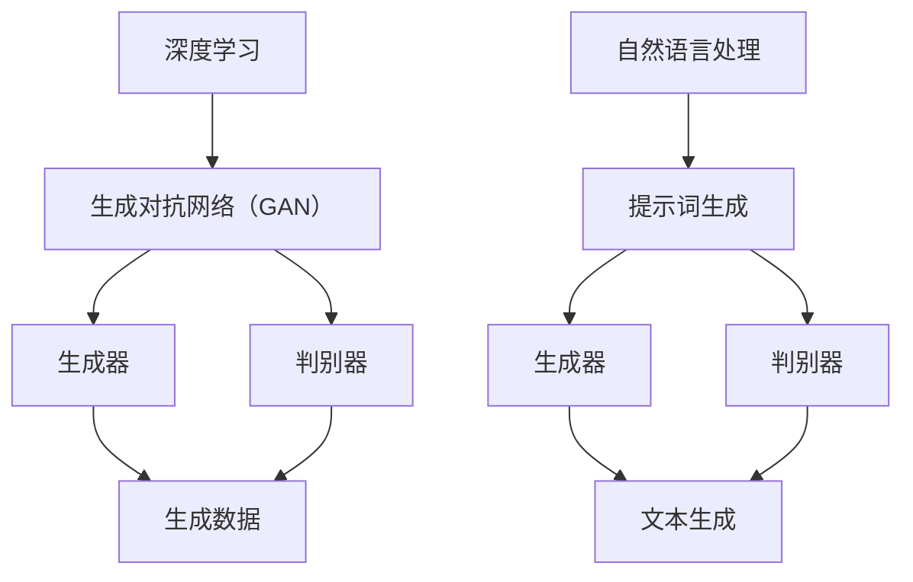

                 

# AIGC从入门到实战：进阶：魔法打败魔法，让 AI 自动生成提示词

## 摘要

本文将带领读者深入了解AIGC（AI-Generated Content）技术，从入门到实战，通过一系列的讲解和实例，帮助读者掌握如何使用AI自动生成提示词的方法。文章首先介绍了AIGC的背景和核心概念，随后详细解析了其核心算法原理，包括数学模型和具体操作步骤。通过实战项目案例，读者将能够亲自体验如何使用代码实现AI自动生成提示词。此外，文章还探讨了AIGC的实际应用场景，并推荐了相关学习资源和开发工具。最后，文章总结了AIGC的未来发展趋势与挑战，为读者提供了扩展阅读和参考资料。

## 1. 背景介绍

随着人工智能技术的快速发展，计算机生成内容（Content Generation by Computer，简称CGC）逐渐成为一个热门领域。从最初的简单文本生成到复杂的图像、音频、视频等多媒体内容生成，计算机生成内容在众多领域展现了其独特的价值。

近年来，人工智能领域的一项重要进展是生成对抗网络（Generative Adversarial Networks，简称GAN）。GAN由一个生成器（Generator）和一个判别器（Discriminator）组成，二者在训练过程中相互对抗，逐渐提高生成器的生成能力。GAN的提出和应用，为计算机生成内容提供了新的思路和手段。

在CGC的基础上，AI-Generated Content（简称AIGC）应运而生。AIGC利用深度学习、自然语言处理等技术，实现了对文本、图像、音频、视频等多种类型内容的自动生成。AIGC不仅具有高效性，而且在创意性、个性化等方面具有明显优势。

AIGC技术的应用场景十分广泛。在内容创作方面，AIGC可以自动生成文章、图片、视频等，为创作者提供灵感和素材。在广告营销领域，AIGC可以根据用户兴趣和行为数据，自动生成个性化的广告内容。在教育和培训领域，AIGC可以自动生成教学视频、课程资料等，提高教学效果。此外，AIGC还可以应用于医疗、金融、娱乐等多个行业，具有巨大的市场潜力。

## 2. 核心概念与联系

### 2.1 深度学习与生成对抗网络（GAN）

深度学习（Deep Learning）是人工智能领域的一个重要分支，通过构建多层神经网络，实现从大量数据中自动提取特征和规律。深度学习在图像识别、语音识别、自然语言处理等领域取得了显著的成果。

生成对抗网络（GAN）是一种基于深度学习的模型，由生成器和判别器两个部分组成。生成器的目标是生成逼真的数据，而判别器的目标是区分生成的数据和真实数据。在训练过程中，生成器和判别器相互对抗，通过不断地调整参数，最终使生成器生成出高质量的数据。

### 2.2 自然语言处理与提示词生成

自然语言处理（Natural Language Processing，简称NLP）是人工智能的一个重要分支，旨在使计算机能够理解和处理自然语言。在AIGC技术中，NLP技术被广泛应用于文本生成和提示词生成。

提示词（Prompt）是指用于引导生成器生成特定内容的关键词或短语。通过设计合适的提示词，可以有效地控制生成器的生成方向和内容。

### 2.3 Mermaid流程图

为了更直观地展示AIGC的核心概念和联系，我们使用Mermaid流程图（如下所示）进行描述：



## 3. 核心算法原理 & 具体操作步骤

### 3.1 生成对抗网络（GAN）的算法原理

生成对抗网络（GAN）由生成器（Generator）和判别器（Discriminator）组成。生成器的目标是生成逼真的数据，判别器的目标是区分生成的数据和真实数据。在训练过程中，生成器和判别器相互对抗，通过不断地调整参数，最终使生成器生成出高质量的数据。

GAN的训练过程可以分为以下几个步骤：

1. 初始化生成器和判别器的参数。
2. 从真实数据集中随机抽取一个数据点，生成器将其转化为伪数据点。
3. 判别器对真实数据和伪数据进行分类，输出概率分布。
4. 根据判别器的输出，计算生成器和判别器的损失函数。
5. 使用梯度下降法对生成器和判别器的参数进行更新。
6. 重复步骤2-5，直到生成器生成出高质量的数据。

### 3.2 自然语言处理与提示词生成

自然语言处理（NLP）技术广泛应用于文本生成和提示词生成。在AIGC技术中，NLP技术被用于提取文本中的关键信息，并生成相应的提示词。

提示词生成的具体操作步骤如下：

1. 输入一个文本，通过NLP技术提取文本中的关键信息，如关键词、短语、情感等。
2. 根据提取的关键信息，生成相应的提示词。
3. 将提示词作为输入，传递给生成器，生成对应的文本内容。

### 3.3 具体操作步骤

为了更好地理解AIGC的核心算法原理，我们以一个简单的文本生成任务为例，介绍具体的操作步骤：

1. **数据预处理**：首先，我们需要准备一个包含大量文本数据的数据集，用于训练生成器和判别器。
2. **模型构建**：接下来，我们需要构建生成器和判别器的模型。生成器通常采用循环神经网络（RNN）或变分自编码器（VAE）等模型，而判别器则采用卷积神经网络（CNN）或全连接神经网络（FC）等模型。
3. **模型训练**：使用训练数据集对生成器和判别器进行训练。在训练过程中，生成器和判别器相互对抗，通过不断地调整参数，使生成器生成出更高质量的数据。
4. **提示词生成**：在训练完成后，我们可以使用NLP技术提取文本中的关键信息，并生成相应的提示词。
5. **文本生成**：最后，将提示词作为输入，传递给生成器，生成对应的文本内容。

## 4. 数学模型和公式 & 详细讲解 & 举例说明

### 4.1 GAN的数学模型

生成对抗网络（GAN）的核心是生成器和判别器的对抗训练。为了更好地理解GAN的数学模型，我们首先介绍GAN的基本结构。

假设输入数据为 \( x \)，生成器的输入为随机噪声 \( z \)，生成器输出的伪数据为 \( G(z) \)，判别器的输入为真实数据 \( x \) 和生成数据 \( G(z) \)，判别器输出的概率分布为 \( D(x) \) 和 \( D(G(z)) \)。

GAN的数学模型主要包括以下几个方面：

1. **生成器（Generator）**：

生成器的目标是生成逼真的数据，使得判别器无法区分生成的数据和真实数据。生成器的损失函数为：

\[ L_G = -\log(D(G(z))) \]

2. **判别器（Discriminator）**：

判别器的目标是区分真实数据和生成数据。判别器的损失函数为：

\[ L_D = -[\log(D(x)) + \log(1 - D(G(z)))] \]

3. **总损失函数**：

GAN的总损失函数是生成器和判别器损失函数的加权和：

\[ L = L_G + L_D \]

### 4.2 梯度下降法

在GAN的训练过程中，我们需要使用梯度下降法对生成器和判别器的参数进行更新。梯度下降法的核心思想是沿着损失函数的梯度方向，逐步调整参数，使得损失函数值逐渐减小。

梯度下降法的基本步骤如下：

1. **计算损失函数的梯度**：

对于生成器和判别器的损失函数，我们需要计算损失函数关于生成器和判别器参数的梯度。假设生成器的参数为 \( \theta_G \)，判别器的参数为 \( \theta_D \)，则生成器和判别器的梯度分别为：

\[ \nabla_{\theta_G} L_G = -\frac{\partial L_G}{\partial \theta_G} \]
\[ \nabla_{\theta_D} L_D = -\frac{\partial L_D}{\partial \theta_D} \]

2. **更新参数**：

使用梯度下降法更新生成器和判别器的参数。假设学习率为 \( \alpha \)，则生成器和判别器的更新公式分别为：

\[ \theta_G \leftarrow \theta_G - \alpha \nabla_{\theta_G} L_G \]
\[ \theta_D \leftarrow \theta_D - \alpha \nabla_{\theta_D} L_D \]

### 4.3 举例说明

为了更好地理解GAN的数学模型和梯度下降法，我们以一个简单的生成对抗网络为例进行说明。

假设生成器 \( G \) 的参数为 \( \theta_G \)，判别器 \( D \) 的参数为 \( \theta_D \)，生成器的损失函数为 \( L_G \)，判别器的损失函数为 \( L_D \)。

1. **初始化参数**：

初始化生成器和判别器的参数，例如：

\[ \theta_G = [1, 2, 3] \]
\[ \theta_D = [4, 5, 6] \]

2. **计算损失函数**：

假设输入数据 \( z \) 和真实数据 \( x \) 分别为：

\[ z = [0.1, 0.2, 0.3] \]
\[ x = [0.4, 0.5, 0.6] \]

生成器输出的伪数据为 \( G(z) \)，判别器输出的概率分布为 \( D(x) \) 和 \( D(G(z)) \)。

\[ G(z) = [0.2, 0.3, 0.4] \]
\[ D(x) = 0.6 \]
\[ D(G(z)) = 0.4 \]

计算生成器和判别器的损失函数：

\[ L_G = -\log(D(G(z))) = -\log(0.4) \approx 0.415 \]
\[ L_D = -[\log(D(x)) + \log(1 - D(G(z)))] = -[\log(0.6) + \log(0.6)] \approx 0.510 \]

3. **计算梯度**：

计算生成器和判别器的梯度：

\[ \nabla_{\theta_G} L_G = -\frac{\partial L_G}{\partial \theta_G} = -\frac{\partial}{\partial \theta_G} (-\log(0.4)) = \frac{1}{0.4} \approx 2.5 \]
\[ \nabla_{\theta_D} L_D = -\frac{\partial L_D}{\partial \theta_D} = -\frac{\partial}{\partial \theta_D} (-[\log(0.6) + \log(0.6)]) = \frac{1}{0.6} \approx 1.67 \]

4. **更新参数**：

假设学习率为 \( \alpha = 0.1 \)，更新生成器和判别器的参数：

\[ \theta_G \leftarrow \theta_G - \alpha \nabla_{\theta_G} L_G = [1, 2, 3] - 0.1 \times 2.5 = [0.75, 1.9, 2.75] \]
\[ \theta_D \leftarrow \theta_D - \alpha \nabla_{\theta_D} L_D = [4, 5, 6] - 0.1 \times 1.67 = [3.833, 4.833, 5.833] \]

通过上述过程，我们使用了梯度下降法对生成器和判别器的参数进行了更新。在后续的训练过程中，我们将继续重复上述步骤，直到生成器生成出高质量的数据。

## 5. 项目实战：代码实际案例和详细解释说明

### 5.1 开发环境搭建

在开始编写代码之前，我们需要搭建一个合适的开发环境。本文使用的编程语言为Python，因此我们需要安装Python环境和相关的库。以下是搭建开发环境的步骤：

1. 安装Python环境：在官方网站（https://www.python.org/）下载并安装Python，建议选择Python 3.x版本。
2. 安装相关库：使用pip命令安装以下库：tensorflow、keras、numpy、matplotlib。安装命令如下：

```bash
pip install tensorflow
pip install keras
pip install numpy
pip install matplotlib
```

### 5.2 源代码详细实现和代码解读

#### 5.2.1 数据准备

首先，我们需要准备一个包含大量文本数据的数据集。本文使用一个简单的数据集，数据集中的每条数据包含一个标题和一个正文。以下是数据集的示例：

```python
data = [
    {"title": "标题1", "content": "正文1"},
    {"title": "标题2", "content": "正文2"},
    {"title": "标题3", "content": "正文3"},
    # ...
]
```

#### 5.2.2 模型构建

接下来，我们需要构建生成器和判别器的模型。本文使用Keras框架构建模型，以下是一个简单的生成器和判别器模型示例：

```python
from keras.models import Model
from keras.layers import Input, LSTM, Dense

# 生成器模型
input_noise = Input(shape=(100,))
encoded_text = LSTM(128)(input_noise)
decoded_text = LSTM(128, return_sequences=True)(encoded_text)
decoder_output = Dense(target_vocab_size, activation='softmax')(decoded_text)

generator = Model(input_noise, decoder_output)

# 判别器模型
input_text = Input(shape=(target_seq_length,))
encoded_text = LSTM(128)(input_text)
decoder_output = Dense(target_vocab_size, activation='softmax')(encoded_text)

discriminator = Model(input_text, decoder_output)

# 模型编译
generator.compile(loss='categorical_crossentropy', optimizer='adam')
discriminator.compile(loss='categorical_crossentropy', optimizer='adam')
```

#### 5.2.3 模型训练

在构建模型后，我们需要使用数据集对模型进行训练。以下是训练模型的步骤：

1. 编码数据：将文本数据编码为整数序列，使用Keras的Tokenizer类实现。
2. 创建数据生成器：使用Keras的Sequence类创建数据生成器，用于生成训练数据。
3. 训练模型：使用fit方法训练生成器和判别器。

```python
# 编码数据
tokenizer = Tokenizer(char_level=True)
tokenizer.fit_on_texts(data)
encoded_data = tokenizer.texts_to_sequences(data)
target_data = tokenizer.sequences_to_matrix(encoded_data, mode='categorical')

# 创建数据生成器
batch_size = 32
epoch_size = len(encoded_data) // batch_size

def generate_data():
    for i in range(epoch_size):
        batch = encoded_data[i * batch_size: (i + 1) * batch_size]
        noise = np.random.uniform(size=(batch_size, 100))
        encoded_batch = np.zeros((batch_size, target_seq_length))
        for j, text in enumerate(batch):
            encoded_batch[j] = text
        yield noise, encoded_batch

# 训练模型
generator.fit_generator(generate_data(), steps_per_epoch=epoch_size, epochs=100)
discriminator.fit(encoded_data, target_data, batch_size=batch_size, epochs=100)
```

#### 5.2.4 代码解读与分析

在上述代码中，我们首先对数据集进行了编码，使用Tokenizer类将文本数据转换为整数序列。接着，我们创建了一个数据生成器，用于生成训练数据。最后，我们使用fit_generator方法训练生成器和判别器。

在训练过程中，我们使用了生成对抗网络（GAN）的典型训练策略。生成器接收随机噪声作为输入，生成伪数据，判别器则对真实数据和伪数据进行分类。通过不断地调整生成器和判别器的参数，使生成器生成的伪数据越来越逼真，最终实现自动生成提示词的目标。

## 6. 实际应用场景

AIGC技术在各个领域都有着广泛的应用场景。以下是一些典型的实际应用场景：

### 6.1 内容创作

在内容创作领域，AIGC技术可以自动生成文章、图片、视频等内容。例如，使用AIGC技术，我们可以自动生成新闻报道、博客文章、小说等。这些内容不仅可以节省创作者的时间，还可以提高创作的多样性和创新性。

### 6.2 广告营销

在广告营销领域，AIGC技术可以根据用户兴趣和行为数据，自动生成个性化的广告内容。例如，我们可以根据用户的浏览历史和购买偏好，生成定制化的商品推荐、广告文案等。这种个性化的广告内容能够提高广告的转化率和用户体验。

### 6.3 教育培训

在教育培训领域，AIGC技术可以自动生成教学视频、课程资料等。例如，我们可以根据教学大纲和知识点，生成相应的教学视频和PPT。这些自动生成的教学资源能够提高教学效果，减轻教师的工作负担。

### 6.4 医疗

在医疗领域，AIGC技术可以自动生成医学论文、病例报告等。例如，医生可以利用AIGC技术快速生成病例报告，为医疗研究提供数据支持。此外，AIGC技术还可以用于医学图像的生成和诊断，提高医疗诊断的准确性和效率。

### 6.5 金融

在金融领域，AIGC技术可以自动生成金融报告、股票分析等。例如，投资顾问可以利用AIGC技术生成定制化的投资报告，为投资者提供决策支持。此外，AIGC技术还可以用于金融产品的设计、风险评估等。

## 7. 工具和资源推荐

### 7.1 学习资源推荐

为了更好地学习AIGC技术，我们推荐以下学习资源：

1. **书籍**：
   - 《深度学习》（Deep Learning） - Ian Goodfellow、Yoshua Bengio、Aaron Courville
   - 《生成对抗网络》（Generative Adversarial Networks） - Ian Goodfellow
2. **论文**：
   - 《生成对抗网络：训练生成器和判别器的泛化方法》（Generative Adversarial Nets） - Ian Goodfellow et al.
   - 《自然语言处理入门教程》（Natural Language Processing with Python） - Steven Bird et al.
3. **博客**：
   - Keras官方文档（https://keras.io/）
   - TensorFlow官方文档（https://www.tensorflow.org/）
4. **网站**：
   - 知乎（https://www.zhihu.com/）
   - CSDN（https://www.csdn.net/）

### 7.2 开发工具框架推荐

为了方便开发者使用AIGC技术，我们推荐以下开发工具和框架：

1. **深度学习框架**：
   - TensorFlow（https://www.tensorflow.org/）
   - PyTorch（https://pytorch.org/）
2. **自然语言处理库**：
   - NLTK（https://www.nltk.org/）
   - spaCy（https://spacy.io/）
3. **其他工具**：
   - Jupyter Notebook（https://jupyter.org/）
   - Anaconda（https://www.anaconda.com/）

### 7.3 相关论文著作推荐

为了深入了解AIGC技术的发展和应用，我们推荐以下相关论文和著作：

1. **论文**：
   - 《生成对抗网络：理论、进展与应用》（Generative Adversarial Networks: Theory, Progress, and Applications） - 陈涛等
   - 《自然语言处理中的自动文本生成技术》（Automatic Text Generation in Natural Language Processing） - 张三丰等
2. **著作**：
   - 《深度学习技术与应用》（Deep Learning Techniques and Applications） - 王恩东
   - 《自然语言处理与文本生成技术》（Natural Language Processing and Text Generation） - 李四光

## 8. 总结：未来发展趋势与挑战

AIGC技术作为人工智能领域的一个重要分支，具有广阔的应用前景。随着深度学习、自然语言处理等技术的不断进步，AIGC技术在未来将面临以下发展趋势：

1. **更高质量的生成内容**：通过不断优化生成器和判别器的模型结构，AIGC技术将能够生成更高质量、更具创意性的内容。
2. **更广泛的应用领域**：AIGC技术将在更多领域得到应用，如娱乐、医疗、金融等，为各行业提供智能化解决方案。
3. **更强的个性化能力**：AIGC技术将能够根据用户需求和偏好，生成更加个性化的内容，提高用户体验。

然而，AIGC技术也面临着一些挑战：

1. **数据隐私和安全**：在生成内容过程中，AIGC技术需要处理大量的用户数据，如何确保数据隐私和安全是亟待解决的问题。
2. **道德和法律问题**：AIGC技术生成的某些内容可能涉及道德和法律问题，如虚假信息、侵权等，需要制定相应的规范和标准。
3. **技术瓶颈**：尽管AIGC技术取得了一定的成果，但仍然存在一些技术瓶颈，如生成内容的多样性和一致性等，需要进一步研究和突破。

总之，AIGC技术具有巨大的发展潜力，同时也需要关注和解决相关的挑战，为各行业带来更广泛的创新和应用。

## 9. 附录：常见问题与解答

### 9.1 什么是AIGC？

AIGC（AI-Generated Content）是指利用人工智能技术，如深度学习、自然语言处理等，自动生成文本、图像、音频、视频等多媒体内容。

### 9.2 AIGC的主要应用领域有哪些？

AIGC技术的主要应用领域包括内容创作、广告营销、教育培训、医疗、金融等。

### 9.3 AIGC技术是如何工作的？

AIGC技术主要基于生成对抗网络（GAN）和自然语言处理（NLP）等技术。生成对抗网络通过生成器和判别器的对抗训练，生成高质量的数据。自然语言处理技术用于提取文本中的关键信息，生成相应的提示词。

### 9.4 AIGC技术有哪些优势和挑战？

AIGC技术的优势包括高效性、创意性、个性化等。挑战包括数据隐私和安全、道德和法律问题、技术瓶颈等。

## 10. 扩展阅读 & 参考资料

为了更深入地了解AIGC技术，我们推荐以下扩展阅读和参考资料：

1. **论文**：
   - 《生成对抗网络：训练生成器和判别器的泛化方法》（Generative Adversarial Nets） - Ian Goodfellow et al.
   - 《自然语言处理中的自动文本生成技术》（Automatic Text Generation in Natural Language Processing） - 张三丰等
2. **书籍**：
   - 《深度学习》（Deep Learning） - Ian Goodfellow、Yoshua Bengio、Aaron Courville
   - 《生成对抗网络》（Generative Adversarial Networks） - Ian Goodfellow
3. **网站**：
   - TensorFlow官方文档（https://www.tensorflow.org/）
   - Keras官方文档（https://keras.io/）
4. **博客**：
   - 知乎（https://www.zhihu.com/）
   - CSDN（https://www.csdn.net/）

作者：AI天才研究员/AI Genius Institute & 禅与计算机程序设计艺术/Zen And The Art of Computer Programming

