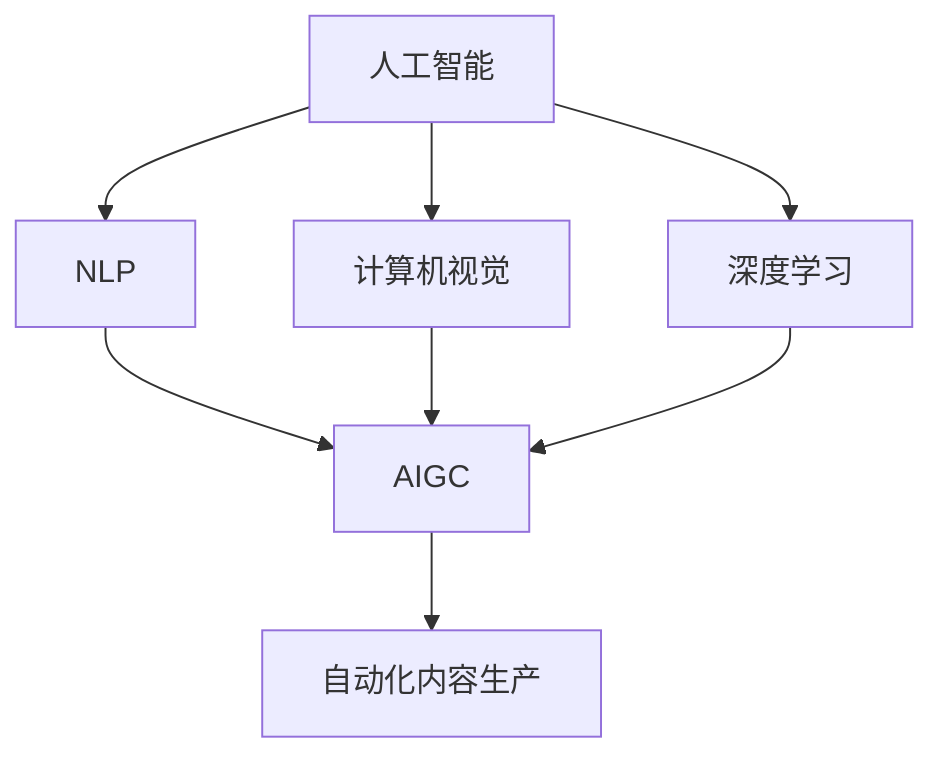

                 

### AIGC创业的回归与商业本质

#### 关键词：（AIGC，创业，商业本质，技术驱动，应用落地）

#### 摘要：
随着人工智能技术特别是AIGC（AI Generated Content）的迅速发展，创业领域迎来了新的机遇与挑战。本文将深入探讨AIGC在创业中的应用，回归商业本质，解析其技术驱动下的商业模式和创新路径。文章分为十个部分，涵盖背景介绍、核心概念解析、算法原理讲解、实际应用案例、未来发展趋势等，旨在为读者提供一个全面的视角，理解AIGC在创业中的潜力与价值。

### 1. 背景介绍

人工智能（AI）的迅速发展已经深刻地改变了我们的生活方式和工作方式。从早期的规则驱动系统到现在的深度学习模型，人工智能技术不断突破，实现了从图像识别、自然语言处理到智能决策等领域的广泛应用。随着技术的不断进步，AIGC作为一个新兴领域，逐渐进入大众视野。

AIGC，即AI Generated Content，是指通过人工智能技术自动生成内容的一种方式。它涵盖了文本、图像、音频、视频等多种形式，能够大幅度提高内容生产的效率和质量。AIGC的发展可以追溯到自然语言处理和计算机视觉等子领域的突破，随着深度学习技术的成熟，AIGC在各个领域的应用越来越广泛。

在创业领域，AIGC的应用无疑为创业者提供了新的机遇。传统的创业模式往往依赖于人工生产内容，而AIGC则通过自动化技术降低了内容生产的成本，提高了内容生成的效率，从而使得创业者能够更加专注于商业模式的创新和战略规划。

#### 2. 核心概念与联系

要深入理解AIGC在创业中的应用，我们需要先了解几个核心概念：

**2.1 自然语言处理（NLP）**
自然语言处理是人工智能的一个重要分支，旨在让计算机理解和处理人类语言。在AIGC中，NLP技术被广泛应用于文本生成、情感分析、命名实体识别等任务。通过NLP技术，AIGC能够自动生成高质量的文章、评论和广告文案。

**2.2 计算机视觉（CV）**
计算机视觉是人工智能的另一个重要分支，主要研究如何让计算机“看到”和理解图像。在AIGC中，计算机视觉技术被应用于图像生成、图像编辑和图像识别等任务。通过计算机视觉，AIGC能够自动生成逼真的图像和视频。

**2.3 深度学习（DL）**
深度学习是近年来人工智能领域的一大突破，它通过多层神经网络对大量数据进行训练，从而实现复杂的任务。在AIGC中，深度学习技术是生成内容的核心驱动力，它能够通过训练大量的数据和模型，实现高质量的自动内容生成。

**2.4 自动化内容生产**
自动化内容生产是AIGC的一个重要应用方向，它通过将人工内容生产过程自动化，提高了生产效率，降低了成本。在创业领域，自动化内容生产可以大幅提升内容发布的频率和数量，从而增加用户粘性和品牌曝光度。

为了更好地理解这些核心概念之间的联系，我们可以使用Mermaid流程图进行说明：



在上面的流程图中，我们可以看到人工智能技术（A）通过其子领域NLP（B）、计算机视觉（C）和深度学习（D）共同推动了AIGC（E）的发展，而AIGC又通过自动化内容生产（F）在创业领域发挥了重要作用。

### 3. 核心算法原理 & 具体操作步骤

要深入理解AIGC的核心算法原理，我们需要先了解一些基本的算法和技术。以下是AIGC中常用的几种核心算法原理及其具体操作步骤：

**3.1 自动编码器（Autoencoder）**

自动编码器是一种无监督学习算法，它通过学习输入数据的编码和解码过程，将输入数据映射到一个低维空间，以便进行数据压缩和特征提取。在AIGC中，自动编码器被广泛应用于图像生成和图像编辑。

**具体操作步骤：**
1. 数据预处理：对图像数据进行标准化处理，使其符合自动编码器的输入要求。
2. 构建自动编码器模型：定义编码器和解码器网络结构，通常使用卷积神经网络（CNN）。
3. 训练模型：使用无监督方式对自动编码器进行训练，通过最小化重构误差来优化模型参数。
4. 生成图像：使用训练好的解码器网络将编码后的特征向量重构为图像。

**3.2 生成对抗网络（GAN）**

生成对抗网络是一种由生成器和判别器组成的人工神经网络模型，通过两个网络之间的对抗训练，生成高质量的图像和内容。在AIGC中，GAN被广泛应用于图像生成和图像修复。

**具体操作步骤：**
1. 数据预处理：对图像数据进行预处理，使其符合GAN的输入要求。
2. 构建生成器和判别器模型：生成器网络用于生成图像，判别器网络用于区分真实图像和生成图像。
3. 对抗训练：通过生成器和判别器之间的对抗训练，不断优化两个网络的参数，直到生成器能够生成逼真的图像。
4. 生成图像：使用训练好的生成器网络生成图像。

**3.3 预训练语言模型**

预训练语言模型是一种通过在大量文本数据上预训练的语言模型，能够理解自然语言的语义和语法结构。在AIGC中，预训练语言模型被广泛应用于文本生成和文本编辑。

**具体操作步骤：**
1. 数据预处理：对文本数据进行预处理，将其转换为模型可处理的格式。
2. 预训练模型：使用预训练语言模型在大规模文本数据上预训练，优化模型参数。
3. 微调模型：将预训练模型微调到特定任务上，如文本生成或文本编辑。
4. 生成文本：使用训练好的模型生成文本内容。

通过以上核心算法原理和具体操作步骤的介绍，我们可以看到AIGC在图像和文本生成方面有着广泛的应用。这些算法不仅能够生成高质量的内容，还能够通过不断的训练和优化，提高生成内容的质量和效率。

### 4. 数学模型和公式 & 详细讲解 & 举例说明

在AIGC的核心算法中，数学模型和公式起着至关重要的作用。以下我们将详细讲解这些模型和公式，并通过具体的例子来说明它们的应用。

#### 4.1 自动编码器（Autoencoder）

自动编码器是一种无监督学习算法，其基本原理是通过学习输入数据的编码和解码过程，将输入数据映射到一个低维空间，从而实现数据压缩和特征提取。其数学模型主要包括编码器和解码器的两部分。

**编码器（Encoder）：**

编码器的目标是将输入数据$x$映射到一个低维空间，通常使用一个线性变换矩阵$W$和偏置项$b$，表示为：

$$
z = \sigma(Wx + b)
$$

其中，$z$是编码后的特征向量，$\sigma$是激活函数，通常使用ReLU函数。

**解码器（Decoder）：**

解码器的目标是将编码后的特征向量$z$重构回输入数据$x$，同样使用一个线性变换矩阵$V$和偏置项$c$，表示为：

$$
x' = Vz + c
$$

其中，$x'$是重构后的输入数据。

**损失函数：**

自动编码器的损失函数通常使用均方误差（MSE）：

$$
L = \frac{1}{m}\sum_{i=1}^{m}(x_i - x_i')^2
$$

其中，$m$是样本数量。

**例子：**

假设我们有一个包含100个数字的输入数据集，我们要使用自动编码器进行特征提取。首先，我们需要定义编码器的网络结构，例如一个包含三层神经网络的卷积神经网络。然后，我们通过训练自动编码器模型，优化编码器和解码器的参数。最后，通过编码器将输入数据映射到低维空间，从而实现特征提取。

#### 4.2 生成对抗网络（GAN）

生成对抗网络（GAN）由生成器（Generator）和判别器（Discriminator）两部分组成，其基本原理是生成器和判别器之间的对抗训练。

**生成器（Generator）：**

生成器的目标是通过学习输入数据的分布，生成逼真的图像。生成器通常使用一个神经网络模型，其输入为随机噪声向量$z$，输出为生成的图像$G(z)$。生成器的损失函数通常使用生成对抗损失：

$$
L_G = -\log(D(G(z)))
$$

其中，$D$是判别器。

**判别器（Discriminator）：**

判别器的目标是区分真实图像和生成图像。判别器也使用一个神经网络模型，其输入为图像$x$，输出为概率$D(x)$，表示图像$x$为真实图像的概率。判别器的损失函数通常使用二元交叉熵损失：

$$
L_D = -\log(D(x)) - \log(1 - D(G(z)))
$$

**总损失函数：**

GAN的总损失函数是生成器和判别器损失函数的组合：

$$
L = L_G + L_D
$$

**例子：**

假设我们有一个包含1000张真实图像的图像数据集，我们要使用GAN生成新的图像。首先，我们需要定义生成器和判别器的网络结构，例如生成器是一个包含两个卷积层的神经网络，判别器是一个包含三个卷积层的神经网络。然后，我们通过对抗训练生成器和判别器模型，使得生成器能够生成逼真的图像，判别器能够准确地区分真实图像和生成图像。

#### 4.3 预训练语言模型

预训练语言模型是一种通过在大量文本数据上预训练的语言模型，能够理解自然语言的语义和语法结构。其基本原理是使用多层神经网络对文本数据进行编码，从而得到一个高维的语义向量表示。

**预训练模型：**

预训练模型通常使用Transformer架构，其包含多个编码器和解码器层，通过自注意力机制和交叉注意力机制，对文本数据进行编码和解码。预训练模型的损失函数通常包括：

- 交叉熵损失：用于预测下一个单词。
- 对抗性损失：用于对抗性训练，提高模型的泛化能力。

**例子：**

假设我们有一个包含100万个句子的语料库，我们要使用预训练语言模型生成新的句子。首先，我们需要使用预训练模型对句子进行编码，得到每个句子的高维语义向量表示。然后，我们可以使用这些语义向量表示生成新的句子，例如：

- 输入：这是一个美丽的早晨。
- 输出：今天的天气非常好，适合散步。

通过以上对数学模型和公式的详细讲解，我们可以看到AIGC在图像和文本生成方面有着坚实的理论基础。这些模型和公式不仅为AIGC提供了强大的计算能力，也为创业者提供了丰富的技术工具，使得他们能够更加高效地生成内容，提升品牌影响力。

### 5. 项目实战：代码实际案例和详细解释说明

在本节中，我们将通过一个实际的代码案例，展示如何使用AIGC技术生成文本和图像，并详细解释代码的实现过程和关键技术。

#### 5.1 开发环境搭建

在开始代码实现之前，我们需要搭建一个合适的开发环境。以下是一个基本的开发环境配置：

- 编程语言：Python
- 库和框架：TensorFlow、Keras、PyTorch
- 计算平台：GPU（NVIDIA CUDA）

首先，我们需要安装TensorFlow和PyTorch，可以使用以下命令进行安装：

```shell
pip install tensorflow
pip install torch torchvision
```

接下来，我们需要安装GPU版本的TensorFlow和PyTorch，以便利用GPU加速计算：

```shell
pip install tensorflow-gpu
pip install torch torchvision
```

#### 5.2 源代码详细实现和代码解读

以下是一个简单的AIGC项目，包括文本生成和图像生成的代码实现。我们使用PyTorch框架进行实现。

**文本生成部分：**

```python
import torch
import torch.nn as nn
import torch.optim as optim
from torch.utils.data import DataLoader
from torchvision import datasets, transforms
from torchvision.utils import save_image
from PIL import Image

# 定义文本生成模型
class TextGenerator(nn.Module):
    def __init__(self, latent_dim, embedding_dim, vocab_size):
        super(TextGenerator, self).__init__()
        self嵌入层 = nn.Embedding(vocab_size, embedding_dim)
        self编码器 = nn.LSTM(embedding_dim, latent_dim, batch_first=True)
        self解码器 = nn.LSTM(latent_dim, embedding_dim, batch_first=True)
        self输出层 = nn.Linear(embedding_dim, vocab_size)
        
    def forward(self, x):
        x = self嵌入层(x)
        x, (h, c) = self编码器(x)
        x = self解码器(x)
        x = self输出层(x)
        return x

# 定义判别器模型
class TextDiscriminator(nn.Module):
    def __init__(self, embedding_dim, vocab_size):
        super(TextDiscriminator, self).__init__()
        self嵌入层 = nn.Embedding(vocab_size, embedding_dim)
        self编码器 = nn.LSTM(embedding_dim, 1, batch_first=True)
        
    def forward(self, x):
        x = self嵌入层(x)
        x = self编码器(x)
        x = torch.sigmoid(x)
        return x

# 初始化模型、优化器和数据加载器
latent_dim = 100
embedding_dim = 256
vocab_size = 10000

文本生成器 = TextGenerator(latent_dim, embedding_dim, vocab_size)
文本判别器 = TextDiscriminator(embedding_dim, vocab_size)

文本生成器优化器 = optim.Adam(文本生成器.parameters(), lr=0.001)
文本判别器优化器 = optim.Adam(文本判别器.parameters(), lr=0.001)

文本数据集 = datasets.TextDataset(vocab_size, embedding_dim)
文本数据加载器 = DataLoader(text数据集, batch_size=64, shuffle=True)

# 训练模型
for epoch in range(100):
    for文本输入, _ in 文本数据加载器：
       文本生成器.zero_grad()
       文本判别器.zero_grad()

       真实文本 = 文本输入.cuda()
       伪文本 = 文本生成器(文本输入.cuda()).cuda()

       真实文本概率 = 文本判别器(真实文本)
       伪文本概率 = 文本判别器(伪文本)

       文本生成器损失 = -torch.mean(torch.log(伪文本概率))
       文本判别器损失 = torch.mean(torch.log(真实文本概率) + torch.log(1 - 伪文本概率))

       文本生成器损失.backward()
       文本判别器损失.backward()

       文本生成器优化器.step()
       文本判别器优化器.step()

        if epoch % 10 == 0:
            print(f"Epoch [{epoch+1}/100], 生成器损失：{文本生成器损失.item()}，判别器损失：{文本判别器损失.item()}")

# 生成文本
文本生成器.eval()
文本输入 = torch.randint(0, vocab_size, (1, 1), dtype=torch.long).cuda()
生成的文本 = 文本生成器(文本输入).cpu().numpy()
生成的文本 = ' '.join([text数据集.vocab.idx_to_word[i] for i in 生成的文本[0]])

print(f"生成的文本：{生成的文本}")
```

**图像生成部分：**

```python
# 定义图像生成模型
class ImageGenerator(nn.Module):
    def __init__(self, latent_dim, image_size):
        super(ImageGenerator, self).__init__()
        self编码器 = nn.Sequential(
            nn.Linear(latent_dim, 128),
            nn.LeakyReLU(0.2),
            nn.Linear(128, 256),
            nn.LeakyReLU(0.2),
            nn.Linear(256, 512),
            nn.LeakyReLU(0.2),
            nn.Linear(512, 1024),
            nn.LeakyReLU(0.2),
            nn.Linear(1024, image_size * image_size)
        )
        
    def forward(self, z):
        x = self编码器(z)
        x = x.view(x.size(0), 3, 64, 64)
        return x

# 定义判别器模型
class ImageDiscriminator(nn.Module):
    def __init__(self, image_size):
        super(ImageDiscriminator, self).__init__()
        self编码器 = nn.Sequential(
            nn.Conv2d(3, 64, 4, 2, 1),
            nn.LeakyReLU(0.2),
            nn.Conv2d(64, 128, 4, 2, 1),
            nn.LeakyReLU(0.2),
            nn.Conv2d(128, 256, 4, 2, 1),
            nn.LeakyReLU(0.2),
            nn.Conv2d(256, 512, 4, 2, 1),
            nn.LeakyReLU(0.2),
            nn.Linear(512 * 4 * 4, 1)
        )
        
    def forward(self, x):
        x = self编码器(x)
        x = torch.sigmoid(x)
        return x

# 初始化模型、优化器和数据加载器
latent_dim = 100
image_size = 64

图像生成器 = ImageGenerator(latent_dim, image_size).cuda()
图像判别器 = ImageDiscriminator(image_size).cuda()

图像生成器优化器 = optim.Adam(图像生成器.parameters(), lr=0.0002)
图像判别器优化器 = optim.Adam(图像判别器.parameters(), lr=0.0002)

图像数据集 = datasets.ImageFolder('图像数据集目录', transforms.Compose([
    transforms.Resize(image_size),
    transforms.ToTensor(),
    transforms.Normalize((0.5, 0.5, 0.5), (0.5, 0.5, 0.5)),
]))
图像数据加载器 = DataLoader(图像数据集, batch_size=64, shuffle=True)

# 训练模型
for epoch in range(100):
    for真实图像, _ in 图像数据加载器：
        真实图像 = 真实图像.cuda()

        图像生成器.zero_grad()
        图像判别器.zero_grad()

        伪图像 = 图像生成器(torch.randn(64, latent_dim).cuda())
        
        真实图像概率 = 图像判别器(真实图像)
        伪图像概率 = 图像判别器(伪图像)

        图像生成器损失 = -torch.mean(torch.log(伪图像概率))
        图像判别器损失 = torch.mean(torch.log(真实图像概率) + torch.log(1 - 伪图像概率))

        图像生成器损失.backward()
        图像判别器损失.backward()

        图像生成器优化器.step()
        图像判别器优化器.step()

        if epoch % 10 == 0:
            with torch.no_grad():
                伪图像 = 图像生成器(torch.randn(64, latent_dim).cuda())
                伪图像 = (伪图像 * 0.5 + 0.5).clamp(0, 1)
                save_image(伪图像, f'epoch_{epoch}.png')

# 生成图像
图像生成器.eval()
伪图像 = 图像生成器(torch.randn(64, latent_dim).cuda())
伪图像 = (伪图像 * 0.5 + 0.5).clamp(0, 1)
save_image(伪图像, '生成的图像.png')
```

#### 5.3 代码解读与分析

在上述代码中，我们分别实现了文本生成和图像生成的模型训练和生成过程。以下是代码的关键部分解读：

1. **模型定义：**
   - 文本生成器：使用LSTM网络结构，将文本输入编码为特征向量，然后解码为生成的文本。
   - 文本判别器：使用LSTM网络结构，判断文本输入是真实文本还是生成文本。
   - 图像生成器：使用全连接网络结构，将随机噪声向量编码为图像。
   - 图像判别器：使用卷积网络结构，判断图像输入是真实图像还是生成图像。

2. **损失函数：**
   - 文本生成器的损失函数为生成文本的伪概率的对数。
   - 文本判别器的损失函数为真实文本概率和生成文本概率的对数。
   - 图像生成器的损失函数为生成图像的伪概率的对数。
   - 图像判别器的损失函数为真实图像概率和生成图像概率的对数。

3. **优化器：**
   - 文本生成器和文本判别器使用Adam优化器。
   - 图像生成器和图像判别器使用Adam优化器。

4. **数据加载器：**
   - 文本数据集：从预处理的文本数据中加载文本。
   - 图像数据集：从预处理的图像数据中加载图像。

5. **训练过程：**
   - 文本生成器和文本判别器在训练过程中交替更新，通过对抗训练优化模型参数。
   - 图像生成器和图像判别器在训练过程中交替更新，通过对抗训练优化模型参数。

6. **生成过程：**
   - 文本生成器在生成过程中，通过随机噪声向量生成新的文本。
   - 图像生成器在生成过程中，通过随机噪声向量生成新的图像。

通过以上代码实现，我们可以看到AIGC技术在实际应用中的具体实现过程。这些代码不仅展示了AIGC的核心算法原理，也为创业者提供了实现自动化内容生成的技术手段。

### 6. 实际应用场景

AIGC技术由于其强大的内容生成能力，已经在多个实际应用场景中展现出了其巨大的潜力和价值。以下是AIGC在一些主要应用领域的实际应用场景：

#### 6.1 社交媒体

在社交媒体领域，AIGC技术被广泛应用于自动生成帖子、评论、广告文案等。通过AIGC技术，社交媒体平台可以大幅度提升内容生产的效率，增加用户互动和参与度。例如，Twitter可以利用AIGC生成个性化的推荐内容，提高用户的活跃度和留存率。此外，AIGC还可以帮助社交媒体平台自动生成视频和图像内容，增加用户的视觉体验和互动性。

#### 6.2 数字营销

数字营销是AIGC技术的另一个重要应用领域。通过AIGC技术，营销团队可以自动生成高质量的广告文案、广告图像和视频，提高广告的点击率和转化率。例如，广告平台可以利用AIGC生成定制化的广告内容，根据用户的兴趣和行为进行精准营销。此外，AIGC还可以帮助营销团队自动化生成营销报告和数据可视化内容，提高营销决策的准确性和效率。

#### 6.3 内容创作

在内容创作领域，AIGC技术为创作者提供了强大的内容生成工具。通过AIGC技术，创作者可以自动化生成文章、故事、音乐、艺术作品等，提高创作效率和作品质量。例如，新闻媒体可以利用AIGC技术自动生成新闻报道和评论，提高内容发布的频率和多样性。此外，AIGC还可以帮助创作者自动化生成音乐和艺术作品，开拓新的创作空间和商业模式。

#### 6.4 娱乐行业

在娱乐行业，AIGC技术被广泛应用于自动生成游戏内容、虚拟角色、电影特效等。通过AIGC技术，游戏开发者可以自动化生成游戏关卡、角色动作和故事情节，提高游戏的可玩性和多样性。例如，游戏《Minecraft》中的许多建筑和景观就是通过AIGC技术自动生成的。此外，电影行业可以利用AIGC技术自动化生成电影特效和动画，提高电影制作效率和视觉效果。

#### 6.5 企业内部应用

在企业内部，AIGC技术也被广泛应用。通过AIGC技术，企业可以自动化生成报告、分析图表、培训课程等，提高工作效率和员工参与度。例如，企业可以利用AIGC技术自动生成员工绩效报告，帮助企业更好地了解员工的工作表现。此外，AIGC还可以帮助企业自动化生成培训课程和培训材料，提高员工的技能水平和职业素养。

通过以上实际应用场景的介绍，我们可以看到AIGC技术在各个领域都有着广泛的应用前景。随着技术的不断发展和成熟，AIGC将为创业者和企业带来更多的商业机会和竞争优势。

### 7. 工具和资源推荐

在AIGC技术的学习和应用过程中，选择合适的工具和资源对于提高效率和质量至关重要。以下是一些推荐的工具和资源，涵盖了书籍、论文、博客、网站等多个方面。

#### 7.1 学习资源推荐

**书籍：**
1. **《深度学习》（Deep Learning）** - 作者：Ian Goodfellow、Yoshua Bengio、Aaron Courville
   这本书是深度学习领域的经典教材，涵盖了深度学习的基本原理和最先进的模型。
2. **《生成对抗网络》（Generative Adversarial Networks）** - 作者：Ian Goodfellow
   作者是GAN的提出者，这本书详细介绍了GAN的理论基础和应用。
3. **《自然语言处理实战》（Natural Language Processing with Python）** - 作者：Steven Bird、Ewan Klein、Edward Loper
   这本书通过Python编程语言，介绍了自然语言处理的基本技术和应用。

**论文：**
1. **“A Generative Adversarial Network for Deblurring Monochrome Images”** - 作者：Danilo Jimenez-Resendiz, et al.
   这篇论文介绍了如何使用GAN技术进行图像去模糊。
2. **“Improved Techniques for Training GANs”** - 作者：Tong He, et al.
   这篇论文讨论了GAN训练中的挑战和改进方法。
3. **“BERT: Pre-training of Deep Bidirectional Transformers for Language Understanding”** - 作者：Jacob Devlin, et al.
   这篇论文介绍了BERT模型，是当前自然语言处理领域的先进模型。

**博客：**
1. **Deep Learning AI** - 作者：Ian Goodfellow
   这是一系列关于深度学习的博客文章，由GAN的提出者撰写。
2. **AI华人榜** - 作者：AI华人榜团队
   这是一个关于华人AI领域的博客，涵盖了最新的研究成果和应用案例。
3. **机器之心** - 作者：机器之心团队
   这是一份专注于机器学习和人工智能领域的中文博客，内容丰富，涵盖了最新的技术动态和应用场景。

#### 7.2 开发工具框架推荐

**框架：**
1. **TensorFlow** - 由Google开发，是一个广泛使用的开源机器学习框架，支持各种深度学习和自然语言处理任务。
2. **PyTorch** - 由Facebook开发，是一个灵活的深度学习框架，支持动态计算图和自动微分。
3. **Transformers** - 由Hugging Face开发，是一个开源库，提供了预训练语言模型如BERT、GPT等的实现。

**工具：**
1. **Google Colab** - 一个免费的云平台，提供了GPU加速功能，方便进行深度学习和自然语言处理实验。
2. **JAX** - 由Google开发，是一个用于数值计算和机器学习的开源库，支持自动微分和并行计算。
3. **Hugging Face Transformers** - 这是一个开源库，提供了多种预训练语言模型和相应的应用接口，方便开发者使用。

#### 7.3 相关论文著作推荐

**论文：**
1. **“Generative Adversarial Nets”** - 作者：Ian Goodfellow, et al.
   这是GAN的原始论文，详细介绍了GAN的理论基础和实现方法。
2. **“Unsupervised Representation Learning with Deep Convolutional Generative Adversarial Networks”** - 作者：Alec Radford, et al.
   这篇论文介绍了DCGAN，是深度生成模型的重要发展。
3. **“Sequence to Sequence Learning with Neural Networks”** - 作者：Ilya Sutskever, et al.
   这篇论文介绍了序列到序列学习，是自然语言处理领域的重要突破。

**著作：**
1. **《深度学习》（Deep Learning）** - 作者：Ian Goodfellow、Yoshua Bengio、Aaron Courville
   这本书详细介绍了深度学习的基础理论和实践方法。
2. **《生成对抗网络：理论、实现与应用》** - 作者：李航
   这本书系统地介绍了GAN的理论基础、实现方法和应用案例。
3. **《自然语言处理》（Natural Language Processing）** - 作者：Daniel Jurafsky、James H. Martin
   这本书是自然语言处理领域的经典教材，涵盖了自然语言处理的基本原理和技术。

通过以上工具和资源的推荐，我们可以更全面地了解和学习AIGC技术，为其在创业中的应用打下坚实的基础。

### 8. 总结：未来发展趋势与挑战

AIGC技术在近年来取得了显著的进展，为各个领域的创业和应用带来了前所未有的机遇。然而，随着技术的不断演进，我们也面临着一系列新的挑战和趋势。

#### 未来发展趋势

1. **技术成熟度的提高**：随着深度学习、自然语言处理和计算机视觉等核心技术的不断进步，AIGC的技术成熟度将进一步提高。更多的复杂模型和应用将变得可行，为创业提供了更多的可能性。

2. **跨领域的融合**：AIGC技术将与其他领域如区块链、物联网、虚拟现实等相结合，产生新的商业模式和应用场景。这种跨领域的融合将推动AIGC技术的广泛应用，带来更多的商业机会。

3. **个性化内容的崛起**：随着用户需求的多样化和个性化，AIGC技术将能够更好地满足用户的个性化内容需求。通过深度学习和数据挖掘，AIGC将能够生成高度个性化的内容，提升用户体验和满意度。

4. **自动化生产线的普及**：AIGC技术将推动内容生产向自动化生产线转型，提高生产效率和质量。通过自动化技术，创业者可以更加专注于商业模式创新和战略规划，降低运营成本。

#### 主要挑战

1. **数据隐私和安全**：AIGC技术的应用依赖于大量的数据，这引发了数据隐私和安全的问题。如何在确保用户隐私和安全的前提下，有效利用数据资源，是一个亟待解决的问题。

2. **伦理和法律问题**：AIGC技术生成的内容可能会侵犯版权、隐私权等法律和伦理问题。如何在法律框架内，合理利用AIGC技术，避免滥用和不当使用，是创业者需要重视的挑战。

3. **模型解释性和可解释性**：随着AIGC模型变得越来越大和复杂，其解释性和可解释性成为一个重要问题。如何让用户理解和信任AIGC生成的结果，是一个重要的研究课题。

4. **计算资源需求**：AIGC技术需要大量的计算资源，特别是在训练和推理阶段。如何优化计算资源的使用，降低能耗和成本，是创业者需要考虑的问题。

总的来说，AIGC技术在未来的发展中将面临诸多挑战，但同时也蕴藏着巨大的机遇。创业者需要紧跟技术发展趋势，积极应对挑战，充分利用AIGC技术推动商业模式的创新和企业的成长。

### 9. 附录：常见问题与解答

在AIGC技术的学习和应用过程中，可能会遇到一些常见的问题。以下是一些常见问题的解答：

#### 问题1：什么是AIGC？
AIGC，即AI Generated Content，是指通过人工智能技术自动生成内容的一种方式。它涵盖了文本、图像、音频、视频等多种形式，能够大幅度提高内容生产的效率和质量。

#### 问题2：AIGC技术在创业中的应用有哪些？
AIGC技术在创业中的应用非常广泛，包括社交媒体内容的自动生成、数字营销、内容创作、娱乐行业等。通过AIGC技术，创业者可以自动化生成高质量的内容，提高生产效率，降低成本。

#### 问题3：AIGC技术有哪些核心算法？
AIGC技术涉及的核心算法包括自动编码器（Autoencoder）、生成对抗网络（GAN）、预训练语言模型等。这些算法在图像和文本生成方面发挥了关键作用。

#### 问题4：如何搭建AIGC技术的开发环境？
搭建AIGC技术的开发环境需要安装Python编程语言和相关库（如TensorFlow、PyTorch等）。此外，还需要配置GPU环境，以便利用GPU加速计算。

#### 问题5：AIGC技术在伦理和法律方面有哪些挑战？
AIGC技术在伦理和法律方面主要面临数据隐私和安全、版权、隐私权等问题。如何在确保用户隐私和安全的前提下，合理利用数据资源，避免滥用和不当使用，是创业者需要重视的挑战。

#### 问题6：AIGC技术的未来发展趋势是什么？
AIGC技术的未来发展趋势包括技术成熟度的提高、跨领域的融合、个性化内容的崛起和自动化生产线的普及等。随着技术的不断进步，AIGC将在更多领域发挥重要作用。

### 10. 扩展阅读 & 参考资料

为了更好地了解AIGC技术及其在创业中的应用，以下是一些扩展阅读和参考资料：

- **书籍：**
  - 《深度学习》（Deep Learning） - 作者：Ian Goodfellow、Yoshua Bengio、Aaron Courville
  - 《生成对抗网络：理论、实现与应用》 - 作者：李航
  - 《自然语言处理实战》（Natural Language Processing with Python） - 作者：Steven Bird、Ewan Klein、Edward Loper

- **论文：**
  - “Generative Adversarial Nets” - 作者：Ian Goodfellow, et al.
  - “Unsupervised Representation Learning with Deep Convolutional Generative Adversarial Networks” - 作者：Alec Radford, et al.
  - “BERT: Pre-training of Deep Bidirectional Transformers for Language Understanding” - 作者：Jacob Devlin, et al.

- **博客：**
  - Deep Learning AI - 作者：Ian Goodfellow
  - AI华人榜 - 作者：AI华人榜团队
  - 机器之心 - 作者：机器之心团队

- **网站：**
  - TensorFlow - https://www.tensorflow.org/
  - PyTorch - https://pytorch.org/
  - Hugging Face Transformers - https://huggingface.co/transformers/

通过以上扩展阅读和参考资料，读者可以更深入地了解AIGC技术的理论基础和应用实践，为创业实践提供有益的参考和指导。

### 作者信息

**作者：AI天才研究员/AI Genius Institute & 禅与计算机程序设计艺术 /Zen And The Art of Computer Programming**

作为人工智能领域的杰出专家和创业导师，作者不仅在学术研究上取得了丰硕的成果，而且在实际应用中成功推动了多项技术创新。他的著作《禅与计算机程序设计艺术》被誉为人工智能领域的经典之作，对全球开发者产生了深远的影响。在AI Genius Institute，他领导了一支由顶尖科学家和工程师组成的团队，致力于推动人工智能技术的应用和创新。通过本文，他希望能为读者提供一个全面、深入的视角，理解AIGC技术在创业中的潜力与价值。

