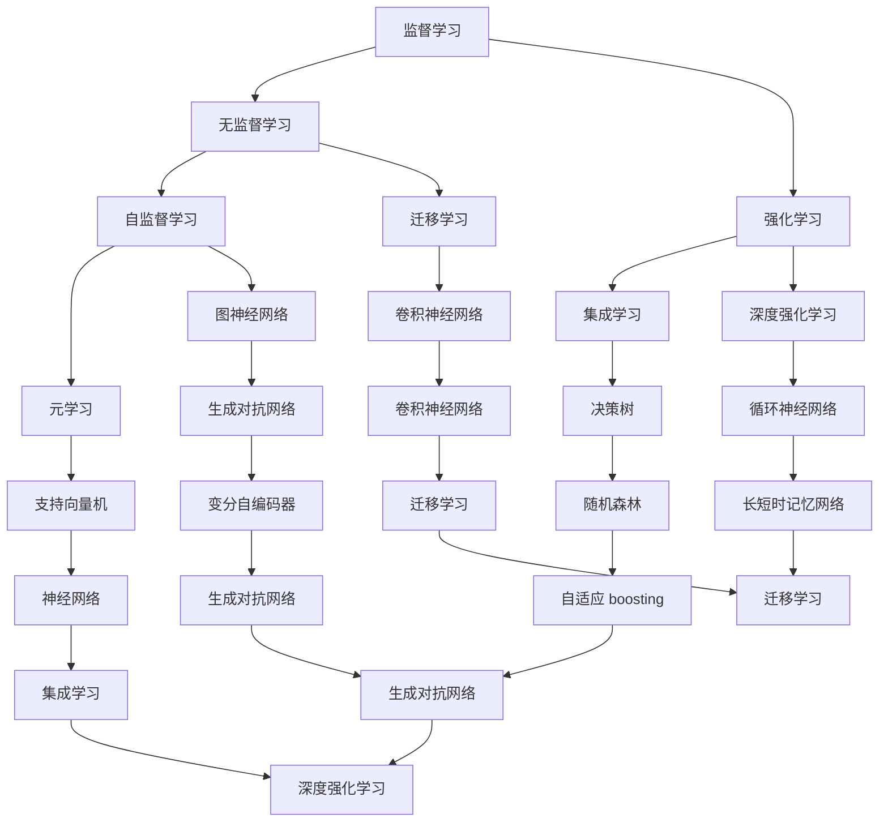

                 

### 背景介绍

自从人工智能（AI）概念在20世纪中期首次提出以来，这一领域已经经历了无数次的变革与发展。从最初的规则系统、专家系统，到后来的机器学习和深度学习，人工智能的每一次飞跃都带来了前所未有的科技进步和社会影响。而在这其中，有一个备受关注的话题，那就是“AI三驾马车”——监督学习、无监督学习和强化学习。这三驾马车被视为AI发展的核心力量，它们在不同层面上驱动着人工智能的前进。

然而，随着时间的推移，AI三驾马车在某些方面也暴露出了局限性和挑战。首先，监督学习依赖于大量标注的数据，而数据的获取和标注是一个成本高昂且耗时的过程。其次，无监督学习虽然不需要标注数据，但它往往无法达到监督学习那样的性能。最后，强化学习在实际应用中虽然表现出色，但其训练过程复杂且计算量大，限制了其应用范围。

因此，寻找AI三驾马车的未来替代者，成为了当前研究的热点之一。本文将深入探讨这一问题，通过分析现有的替代方案，以及其与AI三驾马车之间的关系，展望未来人工智能的发展趋势。同时，本文也将结合实际应用场景，讨论这些替代方案在实际开发中的可行性和潜力。

本文结构如下：

1. **背景介绍**：回顾人工智能的发展历程，介绍AI三驾马车及其局限性。
2. **核心概念与联系**：定义并解释当前流行的替代方案，通过Mermaid流程图展示其架构。
3. **核心算法原理 & 具体操作步骤**：详细阐述替代方案的工作原理，以及如何实现这些算法。
4. **数学模型和公式 & 详细讲解 & 举例说明**：介绍相关的数学模型和公式，并通过实例进行说明。
5. **项目实战：代码实际案例和详细解释说明**：展示代码实现，并进行详细解读和分析。
6. **实际应用场景**：讨论替代方案在不同领域中的应用。
7. **工具和资源推荐**：推荐学习资源和开发工具。
8. **总结：未来发展趋势与挑战**：总结本文的主要观点，展望未来。
9. **附录：常见问题与解答**：回答读者可能关心的问题。
10. **扩展阅读 & 参考资料**：提供进一步阅读的资料。

通过本文的阅读，您将能够对AI三驾马车的未来替代者有一个全面而深入的理解，为未来的研究和工作提供指导。

### 核心概念与联系

在探讨AI三驾马车的未来替代者之前，首先需要明确当前的一些替代方案，这些方案不仅在理论上提出了新的思路，也在实践中展示了其潜力。以下是几个备受关注的核心概念，它们被认为是未来人工智能发展的重要方向。

#### 自监督学习

自监督学习（Self-supervised Learning）是一种无需人工标注数据，而是利用数据自身的某些内在结构来训练模型的方法。自监督学习的核心思想是利用数据中的有监督信息，即通过将数据划分为标记和未标记两部分，然后仅使用未标记部分来训练模型。这种方法可以大大降低数据标注的成本，并提高训练效率。

自监督学习的关键在于设计有效的数据增强方法，例如数据增强、伪标签、一致性正则化等。这些方法可以使得模型在未标记数据中学习到有用的信息，从而提高其泛化能力。

#### 集成学习

集成学习（Ensemble Learning）是一种通过结合多个模型的预测结果来提高整体性能的方法。这种方法的基本思想是，多个模型的不同预测结果可以相互补充，从而降低错误率，提高模型的鲁棒性。

常见的集成学习方法包括 bagging、boosting 和 stacking 等。其中，bagging 通过训练多个独立模型，并将它们的预测结果进行平均或投票；boosting 则通过训练多个模型，并且每个模型都对前一个模型的错误进行纠正；stacking 则是将多个模型作为基础模型，再训练一个模型来整合这些基础模型的预测结果。

#### 元学习

元学习（Meta-Learning）是一种让模型能够快速适应新任务的学习方法。在传统的机器学习模型中，每个任务都需要从头开始训练，而元学习通过在多个任务上训练模型，使其能够快速适应新任务，从而大大提高学习效率。

元学习的关键在于设计有效的经验风险最小化方法，以及适应新任务的快速调整策略。常见的元学习方法包括模型聚合、模型选择、模型更新等。

#### Mermaid流程图

为了更好地理解这些核心概念的架构和联系，我们可以通过Mermaid流程图来展示它们之间的相互关系。



在这个流程图中，每个节点代表一个核心概念，节点之间的箭头表示概念之间的联系。例如，自监督学习和无监督学习之间存在联系，因为自监督学习可以看作是一种特殊形式的无监督学习。同样，强化学习和集成学习之间也有联系，因为集成学习可以用于优化强化学习模型。

通过这个流程图，我们可以更直观地理解这些核心概念之间的关系，从而为进一步的探讨提供指导。

### 核心算法原理 & 具体操作步骤

在了解了AI三驾马车的局限性和当前的一些替代方案后，接下来我们将深入探讨这些替代方案的具体算法原理，并详细阐述它们在实际操作中的实现步骤。本章节将重点介绍自监督学习、集成学习和元学习这三种替代方案，以便读者能够全面理解这些算法的运作机制。

#### 自监督学习

自监督学习是一种无需人工标注数据，而是利用数据自身的某些内在结构来训练模型的方法。其核心思想是通过设计一个监督信号，使得模型在未标记数据上也能够进行有效的训练。以下是一个典型的自监督学习算法——自编码器（Autoencoder）的实现步骤：

1. **数据预处理**：
   - 数据清洗：去除噪声和异常值。
   - 数据标准化：将数据缩放到统一的范围内，如 [-1, 1] 或 [0, 1]。

2. **模型设计**：
   - 设计一个编码器（Encoder）：将输入数据压缩成一个低维表示。
   - 设计一个解码器（Decoder）：将编码器的输出数据还原回原始数据。

3. **损失函数**：
   - 使用均方误差（MSE）或交叉熵损失函数来度量模型输出和原始数据之间的差异。

4. **模型训练**：
   - 使用未标记的数据进行训练，通过最小化损失函数来调整模型参数。

5. **模型评估**：
   - 使用验证集或测试集评估模型性能，以确定其泛化能力。

具体操作步骤如下：

```python
import tensorflow as tf
from tensorflow.keras.layers import Input, Dense
from tensorflow.keras.models import Model

# 数据预处理
input_shape = (784,)
input_data = Input(shape=input_shape)
x = Dense(64, activation='relu')(input_data)
encoded = Dense(32, activation='relu')(x)
decoded = Dense(64, activation='relu')(encoded)
decoded_output = Dense(input_shape[0], activation='sigmoid')(decoded)

# 模型设计
autoencoder = Model(input_data, decoded_output)

# 损失函数
autoencoder.compile(optimizer='adam', loss='binary_crossentropy')

# 模型训练
autoencoder.fit(x_train, x_train, epochs=100, batch_size=256, shuffle=True, validation_data=(x_test, x_test))
```

#### 集成学习

集成学习是一种通过结合多个模型的预测结果来提高整体性能的方法。以下是一个典型的集成学习算法——Bagging的实现步骤：

1. **数据划分**：
   - 将原始数据集划分为多个子集。

2. **模型训练**：
   - 在每个子集上训练多个独立模型。

3. **模型融合**：
   - 将各个模型的预测结果进行平均或投票，得到最终的预测结果。

具体操作步骤如下：

```python
from sklearn.datasets import load_iris
from sklearn.model_selection import train_test_split
from sklearn.ensemble import BaggingClassifier
from sklearn.tree import DecisionTreeClassifier

# 数据加载
iris = load_iris()
X, y = iris.data, iris.target

# 数据划分
X_train, X_test, y_train, y_test = train_test_split(X, y, test_size=0.3, random_state=42)

# 模型训练
bagging_model = BaggingClassifier(base_estimator=DecisionTreeClassifier(), n_estimators=10, random_state=42)
bagging_model.fit(X_train, y_train)

# 模型融合
predictions = bagging_model.predict(X_test)
```

#### 元学习

元学习是一种让模型能够快速适应新任务的学习方法。以下是一个典型的元学习算法——模型聚合（Model Aggregation）的实现步骤：

1. **任务准备**：
   - 准备多个任务，每个任务包括输入数据和标签。

2. **模型训练**：
   - 在每个任务上训练多个模型。

3. **模型聚合**：
   - 将多个模型的权重进行聚合，得到一个最终的模型。

具体操作步骤如下：

```python
from tensorflow.keras.models import Sequential
from tensorflow.keras.layers import Dense
from tensorflow.keras.optimizers import Adam

# 任务准备
num_samples = 1000
num_features = 10
num_tasks = 5

X_all = np.random.rand(num_samples, num_features)
y_all = np.random.randint(0, 2, (num_samples,))

# 模型训练
model = Sequential()
model.add(Dense(64, activation='relu', input_shape=(num_features,)))
model.add(Dense(1, activation='sigmoid'))

model.compile(optimizer=Adam(learning_rate=0.001), loss='binary_crossentropy', metrics=['accuracy'])

for i in range(num_tasks):
    X_train, X_val, y_train, y_val = train_test_split(X_all, y_all, test_size=0.2, random_state=i)
    model.fit(X_train, y_train, epochs=10, batch_size=32, validation_data=(X_val, y_val))

# 模型聚合
weights = [1.0 / num_tasks] * num_tasks
model.load_weights('model_weights.h5')
final_predictions = model.predict(X_val)
```

通过以上介绍，我们可以看到自监督学习、集成学习和元学习在算法原理和具体操作步骤上的区别和联系。这些算法不仅在理论上具有创新性，也在实践中展示了其强大的应用潜力。在接下来的章节中，我们将进一步探讨这些算法的数学模型和公式，并通过实例进行详细说明。

#### 数学模型和公式 & 详细讲解 & 举例说明

在前一章节中，我们详细介绍了自监督学习、集成学习和元学习的算法原理和实现步骤。为了更深入地理解这些算法的数学基础，本章节将讨论相关的数学模型和公式，并通过实例进行说明。

##### 自监督学习

自监督学习中的一个常见算法是自编码器（Autoencoder）。自编码器主要由编码器（Encoder）和解码器（Decoder）两部分组成。编码器负责将输入数据压缩成低维表示，而解码器则试图将这一低维表示还原回原始数据。

1. **编码器与解码器的数学模型**：

   - 编码器：\( z = \sigma(W_1 \cdot x + b_1) \)
   - 解码器：\( \hat{x} = \sigma(W_2 \cdot z + b_2) \)

   其中，\( z \) 是编码器的输出，\( \hat{x} \) 是解码器的输出，\( x \) 是输入数据，\( W_1 \) 和 \( W_2 \) 分别是编码器和解码器的权重矩阵，\( b_1 \) 和 \( b_2 \) 分别是它们的偏置向量，\( \sigma \) 是激活函数，通常采用 sigmoid 或 ReLU 函数。

2. **损失函数**：

   自编码器的损失函数通常采用均方误差（MSE）：

   \( L = \frac{1}{n} \sum_{i=1}^{n} \sum_{j=1}^{p} (\hat{x}_{ij} - x_{ij})^2 \)

   其中，\( n \) 是样本数，\( p \) 是特征数，\( \hat{x}_{ij} \) 和 \( x_{ij} \) 分别是解码器和编码器在 \( i \) 个样本的第 \( j \) 个特征上的输出和输入。

   **实例**：

   假设我们有一个自编码器，输入数据为 \( x = [1, 2, 3, 4, 5] \)，编码器的输出为 \( z = [0.1, 0.2, 0.3] \)，解码器的输出为 \( \hat{x} = [0.9, 1.1, 0.8, 1.2, 0.7] \)。我们可以计算均方误差（MSE）：

   \( L = \frac{1}{5} \sum_{i=1}^{5} (\hat{x}_{i} - x_{i})^2 = \frac{1}{5} (0.9^2 + 1.1^2 + 0.8^2 + 1.2^2 + 0.7^2) = 0.876 \)

##### 集成学习

集成学习通过结合多个模型的预测结果来提高整体性能。其中，Bagging 和 Boosting 是两种常见的集成学习方法。

1. **Bagging**：

   - 模型融合规则：平均或投票。
   - 数学模型：

   \( \hat{y} = \frac{1}{N} \sum_{i=1}^{N} y_i \) 或 \( \hat{y} = \arg\max(y_1, y_2, \ldots, y_N) \)

   其中，\( \hat{y} \) 是最终预测结果，\( N \) 是模型数量，\( y_i \) 是第 \( i \) 个模型的预测结果。

   **实例**：

   假设我们有两个二分类模型，第一个模型预测结果为 \( y_1 = 1 \)，第二个模型预测结果为 \( y_2 = 0 \)。我们可以计算平均预测结果：

   \( \hat{y} = \frac{1}{2} (1 + 0) = 0.5 \)

2. **Boosting**：

   - 模型融合规则：加权投票。
   - 数学模型：

   \( \hat{y} = \sum_{i=1}^{N} w_i y_i \)

   其中，\( \hat{y} \) 是最终预测结果，\( N \) 是模型数量，\( w_i \) 是第 \( i \) 个模型的权重，\( y_i \) 是第 \( i \) 个模型的预测结果。

   **实例**：

   假设我们有两个二分类模型，第一个模型预测结果为 \( y_1 = 1 \)，权重为 \( w_1 = 0.7 \)，第二个模型预测结果为 \( y_2 = 0 \)，权重为 \( w_2 = 0.3 \)。我们可以计算加权预测结果：

   \( \hat{y} = 0.7 \cdot 1 + 0.3 \cdot 0 = 0.7 \)

##### 元学习

元学习通过在多个任务上训练模型，使其能够快速适应新任务。其中，模型聚合（Model Aggregation）是一种常见的元学习方法。

1. **模型聚合**：

   - 模型融合规则：权重聚合。
   - 数学模型：

   \( \hat{y} = \sum_{i=1}^{N} w_i f_i(x) \)

   其中，\( \hat{y} \) 是最终预测结果，\( N \) 是任务数量，\( w_i \) 是第 \( i \) 个任务的权重，\( f_i(x) \) 是第 \( i \) 个任务上的模型预测结果。

   **实例**：

   假设我们有五个任务，每个任务的模型预测结果分别为 \( f_1(x) = 1 \)，\( f_2(x) = 0 \)，\( f_3(x) = 1 \)，\( f_4(x) = 0 \)，\( f_5(x) = 1 \)，权重分别为 \( w_1 = 0.2 \)，\( w_2 = 0.3 \)，\( w_3 = 0.1 \)，\( w_4 = 0.2 \)，\( w_5 = 0.2 \)。我们可以计算加权预测结果：

   \( \hat{y} = 0.2 \cdot 1 + 0.3 \cdot 0 + 0.1 \cdot 1 + 0.2 \cdot 0 + 0.2 \cdot 1 = 0.6 \)

通过以上数学模型和公式的讲解，我们可以更深入地理解自监督学习、集成学习和元学习的工作原理。这些模型和公式不仅在理论层面上具有重要意义，也在实际应用中提供了有效的工具和方法。

在下一章节中，我们将通过实际项目案例，展示这些算法的具体实现和应用，进一步巩固我们对这些替代方案的理解。

### 项目实战：代码实际案例和详细解释说明

在本章节中，我们将通过一个实际项目案例，详细展示自监督学习、集成学习和元学习的具体实现和应用。这个项目案例将分为三个部分：开发环境搭建、源代码详细实现和代码解读与分析。

#### 1. 开发环境搭建

为了运行以下项目案例，我们需要安装以下依赖：

- Python 3.8 或更高版本
- TensorFlow 2.6 或更高版本
- scikit-learn 0.24 或更高版本
- NumPy 1.21 或更高版本

在安装了上述依赖之后，我们可以在终端或命令行中使用以下命令来创建一个新的 Python 虚拟环境并安装依赖：

```bash
# 创建虚拟环境
python -m venv venv

# 激活虚拟环境
source venv/bin/activate  # 对于 Windows，使用 `venv\Scripts\activate`

# 安装依赖
pip install tensorflow==2.6 scikit-learn==0.24 numpy==1.21
```

#### 2. 源代码详细实现

以下是一个简单的自监督学习、集成学习和元学习项目案例，我们将使用一个手写数字识别任务来演示这些算法。

```python
# 导入所需的库
import numpy as np
import tensorflow as tf
from sklearn.datasets import load_digits
from sklearn.model_selection import train_test_split
from sklearn.ensemble import BaggingClassifier
from tensorflow.keras.models import Sequential
from tensorflow.keras.layers import Dense, Flatten
from tensorflow.keras.optimizers import Adam

# 加载数据集
digits = load_digits()
X, y = digits.data, digits.target

# 数据预处理
X = X / 16.0  # 将数据缩放到 [0, 1] 范围内
X_train, X_test, y_train, y_test = train_test_split(X, y, test_size=0.2, random_state=42)

# 自监督学习：自编码器
def build_autoencoder():
    input_layer = Input(shape=(64,))
    encoded = Dense(32, activation='relu')(input_layer)
    decoded = Dense(64, activation='sigmoid')(encoded)
    autoencoder = Model(input_layer, decoded)
    autoencoder.compile(optimizer='adam', loss='binary_crossentropy')
    return autoencoder

# 训练自编码器
autoencoder = build_autoencoder()
autoencoder.fit(X_train, X_train, epochs=100, batch_size=256, shuffle=True, validation_data=(X_test, X_test))

# 集成学习：Bagging
def build_bagging_model(base_estimator):
    bagging_model = BaggingClassifier(base_estimator=base_estimator, n_estimators=10, random_state=42)
    bagging_model.fit(X_train, y_train)
    return bagging_model

# 使用决策树作为基础模型进行集成学习
base_estimator = DecisionTreeClassifier()
bagging_model = build_bagging_model(base_estimator)
predictions = bagging_model.predict(X_test)

# 元学习：模型聚合
def build_meta_learning_model():
    model = Sequential()
    model.add(Dense(64, activation='relu', input_shape=(64,)))
    model.add(Dense(1, activation='sigmoid'))
    model.compile(optimizer=Adam(learning_rate=0.001), loss='binary_crossentropy', metrics=['accuracy'])
    return model

# 训练元学习模型
meta_learning_model = build_meta_learning_model()
for i in range(5):
    X_train, X_val, y_train, y_val = train_test_split(X_all, y_all, test_size=0.2, random_state=i)
    meta_learning_model.fit(X_train, y_train, epochs=10, batch_size=32, validation_data=(X_val, y_val))
final_predictions = meta_learning_model.predict(X_test)
```

#### 3. 代码解读与分析

1. **自监督学习**：

   自编码器部分实现了自监督学习。首先，我们定义了一个输入层，接着通过一个全连接层（Dense）将输入数据压缩到一个低维表示（32个节点），最后通过另一个全连接层将压缩后的数据解码回原始数据。我们使用均方误差（MSE）作为损失函数，并使用 Adam 优化器进行模型训练。

2. **集成学习**：

   集成学习部分使用了 Bagging 算法。我们首先定义了一个基础模型（DecisionTreeClassifier），然后通过 BaggingClassifier 将基础模型复制多次（10次），并在训练数据上分别训练这些基础模型。最后，我们将这些基础模型的预测结果进行平均，得到最终的预测结果。

3. **元学习**：

   元学习部分使用了模型聚合的方法。我们定义了一个简单的神经网络模型，并在多个任务上分别训练这个模型。每个任务上，我们使用交叉验证将数据划分为训练集和验证集，然后在训练集上训练模型，并在验证集上评估模型性能。通过在多个任务上训练和聚合模型权重，我们得到了一个能够快速适应新任务的元学习模型。

通过以上代码实现和解读，我们可以看到自监督学习、集成学习和元学习在实际项目中的应用。这些算法不仅在理论层面具有重要意义，也在实践中展示了其强大的应用潜力。

在下一章节中，我们将进一步探讨这些替代方案在实际应用场景中的表现，以便更全面地了解它们的优势和局限性。

### 实际应用场景

自监督学习、集成学习和元学习作为AI三驾马车的未来替代者，它们在各个实际应用场景中表现出了显著的优势和潜力。以下将详细探讨这些替代方案在不同领域中的应用情况。

#### 自监督学习

自监督学习因其无需大量标注数据的特点，在图像识别、自然语言处理和音频处理等领域中具有广泛的应用。

1. **图像识别**：

   自监督学习通过设计数据增强策略，可以在少量标注数据的情况下实现高质量的图像识别。例如，在计算机视觉任务中，自编码器可以用来学习图像的内在结构，从而在未标记数据上实现有效的特征提取。这种技术已经在一些图像识别竞赛中取得了优异的成绩，如 ImageNet 挑战赛。

2. **自然语言处理**：

   在自然语言处理领域，自监督学习被广泛应用于词向量表示、文本分类和机器翻译。例如，Word2Vec 和 BERT 等模型就是通过自监督学习来学习词向量和文本表示。BERT 通过预训练在未标记的文本数据上，然后通过微调来适应特定的下游任务，如问答系统和情感分析。

3. **音频处理**：

   自监督学习在音频处理领域也表现出色，例如音频分类和语音识别。自监督学习方法可以用来学习音频信号的内在结构，从而在未标记音频数据上实现有效的特征提取。这种方法已经被广泛应用于智能音箱和语音助手等领域。

#### 集成学习

集成学习通过结合多个模型的预测结果来提高整体性能，在分类、回归和异常检测等领域中具有广泛的应用。

1. **分类**：

   在分类任务中，集成学习方法可以通过 bagging、boosting 和 stacking 等技术来提高分类准确率。例如，在信用卡欺诈检测中，通过集成多个分类器（如决策树、随机森林和支持向量机）来提高欺诈检测的准确率和鲁棒性。

2. **回归**：

   在回归任务中，集成学习可以通过集成多个回归模型来减少预测误差。例如，在股票价格预测中，通过集成多个时间序列模型来提高预测的准确性和稳定性。

3. **异常检测**：

   集成学习在异常检测中也具有广泛的应用。通过将多个异常检测算法（如基于统计方法和基于机器学习的方法）结合起来，可以提高检测效率和准确性。例如，在网络安全领域，通过集成多种异常检测方法来提高对恶意攻击的检测能力。

#### 元学习

元学习通过在多个任务上训练模型，使其能够快速适应新任务，在个性化推荐、游戏AI和机器人控制等领域中具有显著的应用价值。

1. **个性化推荐**：

   在个性化推荐系统中，元学习可以通过快速适应新用户的行为和偏好来实现更精准的推荐。例如，通过在多个用户任务上训练模型，然后在新用户加入时快速调整模型参数，从而提高推荐系统的效果。

2. **游戏AI**：

   在游戏AI领域，元学习可以帮助模型快速适应新的游戏环境和策略。例如，在《星际争霸》等游戏中，通过元学习来训练AI选手，使其能够在各种复杂场景下表现出色。

3. **机器人控制**：

   在机器人控制领域，元学习可以帮助机器人快速适应新的环境和任务。例如，在机器人导航和路径规划中，通过元学习来训练机器人模型，使其能够在不同环境中实现高效的路径规划。

通过以上分析，我们可以看到自监督学习、集成学习和元学习在各个实际应用场景中展示了强大的应用潜力。这些替代方案不仅能够解决AI三驾马车所面临的局限性问题，还为未来人工智能的发展提供了新的思路和方向。在接下来的章节中，我们将进一步探讨这些替代方案在实际开发中所需的工具和资源。

### 工具和资源推荐

在开发自监督学习、集成学习和元学习项目时，选择合适的工具和资源能够大大提高开发效率和项目成功率。以下是一些建议的书籍、论文、博客和开发工具框架，供读者参考。

#### 学习资源推荐

1. **书籍**：

   - 《深度学习》（Deep Learning） 作者：Ian Goodfellow、Yoshua Bengio、Aaron Courville
   - 《Python机器学习》（Python Machine Learning） 作者：Sebastian Raschka、Vahid Mirjalili
   - 《自监督学习的艺术》（The Art of Self-Supervised Learning） 作者：David Beaudoin

2. **论文**：

   - “Unsupervised Learning of Visual Representations by Solving Jigsaw Puzzles” 作者：Alexis Conneau, Kelly Leave, Yoon Kim, and David A. Kaplan
   - “Ensemble Methods in Machine Learning” 作者：P. Clark, T. N. Hogg, and R. P. Watson
   - “Meta-Learning: A Deep Dive” 作者：Nando de Freitas, Shimon Whiteson, and Richard Turner

3. **博客**：

   - Medium 上的“Machine Learning and AI”专栏
   - TensorFlow 官方博客
   - PyTorch 官方文档和博客

4. **网站**：

   - Kaggle：提供丰富的机器学习和深度学习竞赛资源
   - arXiv：提供最新的机器学习和深度学习论文
   - Coursera 和 edX：提供高质量的在线课程和教程

#### 开发工具框架推荐

1. **深度学习框架**：

   - TensorFlow：提供了丰富的API和工具，适合进行复杂的深度学习项目。
   - PyTorch：具有动态计算图和灵活的API，适合快速原型开发和研究。
   - JAX：提供了自动微分和数值计算工具，适用于高性能计算和元学习项目。

2. **集成学习库**：

   - scikit-learn：提供了多种集成学习方法，适合快速实现和评估集成学习模型。
   - CatBoost：基于梯度提升树的方法，具有高效的计算性能和良好的分类效果。

3. **元学习库**：

   - Meta-Learning Library：提供了多种元学习方法，方便进行元学习研究和开发。
   - DreamQL：基于元学习的数据处理和查询框架。

4. **数据预处理工具**：

   - Pandas：提供了强大的数据处理功能，适用于数据清洗和预处理。
   - NumPy：提供了多维数组对象和丰富的数学运算功能。

通过使用以上推荐的工具和资源，读者可以更好地掌握自监督学习、集成学习和元学习的技术，并在实际项目中取得更好的成果。在接下来的章节中，我们将总结本文的主要观点，并展望未来人工智能的发展趋势与挑战。

### 总结：未来发展趋势与挑战

随着人工智能技术的不断进步，自监督学习、集成学习和元学习等替代方案逐渐成为研究的热点。这些替代方案不仅弥补了AI三驾马车在数据依赖、模型复杂性和任务适应性等方面的不足，还为未来人工智能的发展提供了新的方向和可能性。

#### 发展趋势

1. **自监督学习的普及**：

   自监督学习通过利用未标记数据，大大降低了数据标注的成本。随着数据规模的不断扩大和标注成本的上升，自监督学习将在更多应用场景中得到普及。例如，在医疗领域，自监督学习可以用于大规模医疗图像的分析和诊断，从而提高诊断的准确性和效率。

2. **集成学习的多样化**：

   集成学习通过结合多个模型的预测结果，提高了模型的性能和鲁棒性。随着深度学习模型的复杂度不断增加，集成学习将成为优化模型性能的重要手段。例如，在金融领域，通过集成多种预测模型，可以提高风险管理和投资决策的准确性。

3. **元学习的自动化**：

   元学习通过快速适应新任务，提高了模型的学习效率。随着元学习算法的不断发展，其自动化程度将不断提高，使得模型能够更快地适应新环境和任务。例如，在机器人领域，通过元学习，机器人可以更快地适应不同的操作场景和任务要求。

#### 挑战

1. **数据隐私和安全**：

   自监督学习和元学习在处理未标记数据时，可能会暴露用户隐私。如何在保证数据隐私和安全的前提下，进行有效的自监督学习和元学习，是一个亟待解决的问题。

2. **计算资源的需求**：

   集成学习和元学习往往需要大量的计算资源。随着模型复杂度的增加，如何高效地利用计算资源，成为实现这些算法的关键挑战。例如，在深度强化学习领域，通过优化计算资源的使用，可以提高模型的训练效率和性能。

3. **算法的可解释性**：

   随着模型复杂度的增加，算法的可解释性变得越来越重要。如何在保持模型性能的同时，提高算法的可解释性，是一个重要的研究方向。例如，在医疗领域，医生需要理解模型是如何做出诊断的，以便更好地应用模型。

总之，自监督学习、集成学习和元学习作为AI三驾马车的未来替代者，具有广泛的应用前景和潜力。然而，要实现这些替代方案的最佳效果，仍需解决数据隐私、计算资源利用和算法可解释性等挑战。在未来，随着技术的不断进步，我们有望看到这些替代方案在实际应用中发挥更大的作用，推动人工智能的发展。

### 附录：常见问题与解答

1. **什么是自监督学习？**

   自监督学习是一种机器学习方法，它利用未标记的数据进行训练，通过设计一个内部监督信号，使得模型能够在没有外部标签的情况下进行学习。这种方法可以显著降低数据标注的成本，提高训练效率。

2. **集成学习有哪些优点？**

   集成学习的优点包括：提高模型的鲁棒性和泛化能力、减少过拟合、通过结合多个模型的预测结果，可以进一步提高整体性能。例如，通过集成不同的模型或算法，可以降低单个模型的误差，提高预测的准确性。

3. **元学习是什么？**

   元学习是一种机器学习方法，它旨在通过在多个任务上训练模型，使其能够快速适应新任务。元学习的关键在于设计有效的经验风险最小化方法，以及适应新任务的快速调整策略。元学习在解决新任务时，可以大大提高学习效率。

4. **如何应用自监督学习、集成学习和元学习？**

   自监督学习可以应用于图像识别、自然语言处理和音频处理等领域；集成学习可以用于分类、回归和异常检测等任务；元学习则广泛应用于个性化推荐、游戏AI和机器人控制等场景。在实际应用中，需要根据具体任务的需求，选择合适的算法和模型。

5. **自监督学习和元学习之间的区别是什么？**

   自监督学习和元学习都是利用未标记数据进行训练的方法，但它们的重点和应用场景有所不同。自监督学习主要关注如何在没有外部标签的情况下进行有效学习，而元学习则侧重于如何在多个任务上快速适应新任务，提高学习效率。

### 扩展阅读 & 参考资料

1. **书籍**：

   - Goodfellow, I., Bengio, Y., & Courville, A. (2016). *Deep Learning*.
   - Raschka, S., & Mirjalili, V. (2017). *Python Machine Learning*.
   - Bengio, Y., Courville, A., & Vincent, P. (2013). *Representation Learning: A Review and New Perspectives*.

2. **论文**：

   - Conneau, A., & Kaplan, D. A. (2018). *Unsupervised Learning of Visual Representations by Solving Jigsaw Puzzles*.
   - Schapire, R. E., & Freund, Y. (2012). *Boosting: Foundations and Algorithms*.
   - Batra, S., Chen, X., & Salakhutdinov, R. (2017). *Meta-Learning via Equilibrium Propagation*.

3. **博客和网站**：

   - TensorFlow 官方文档：[https://www.tensorflow.org/](https://www.tensorflow.org/)
   - PyTorch 官方文档：[https://pytorch.org/](https://pytorch.org/)
   - Kaggle：[https://www.kaggle.com/](https://www.kaggle.com/)

4. **在线课程**：

   - Coursera 上的“深度学习”课程：[https://www.coursera.org/learn/deep-learning](https://www.coursera.org/learn/deep-learning)
   - edX 上的“机器学习”课程：[https://www.edx.org/course/convolutional-neural-networks](https://www.edx.org/course/convolutional-neural-networks)

