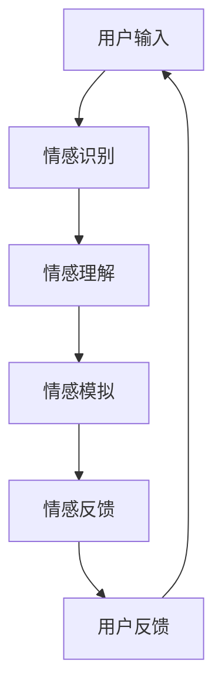

                 

### 文章标题

**AI与人类情感：虚拟关系的兴起**

关键词：人工智能、情感计算、虚拟关系、心理学、算法设计

摘要：本文深入探讨了人工智能（AI）在理解和模拟人类情感方面的进展，特别是虚拟关系领域的兴起。通过分析AI的核心算法原理和实际应用案例，本文旨在揭示AI与人类情感之间的紧密联系，以及这一新兴领域面临的挑战和未来发展趋势。

<|assistant|>### 1. 背景介绍

在当今技术飞速发展的时代，人工智能（AI）已经成为推动社会进步的关键力量。从自动驾驶汽车到智能家居，AI技术的应用无处不在。然而，除了这些显而易见的应用场景，AI在人类情感领域的探索同样引人注目。情感计算，作为AI的一个重要分支，旨在使计算机能够理解和模拟人类情感，从而在交互、娱乐、健康等多个领域发挥重要作用。

虚拟关系，作为情感计算的一个具体应用，正逐渐崭露头角。虚拟关系是指人与计算机生成的虚拟角色（如聊天机器人、虚拟助手）之间的情感互动。这种互动不仅能够提供情感支持，还能在娱乐、教育等方面创造独特的体验。

近年来，随着深度学习、自然语言处理等技术的进步，AI在情感计算方面的能力得到了显著提升。然而，要实现真正意义上的情感模拟，仍面临诸多挑战。本文将详细分析这些挑战，并探讨AI在虚拟关系领域的发展前景。

### 1.1  情感计算的兴起

情感计算起源于心理学和计算机科学的交叉领域。早在20世纪90年代，一些学者就开始探索如何使计算机识别和模拟人类情感。随着技术的不断发展，情感计算逐渐成为一个独立的学科领域。

情感计算的主要目标是使计算机能够理解、识别和模拟人类情感。这包括对人类面部表情、语音语调、生理信号等的分析，以及对人类情感状态的预测和模拟。情感计算在多个领域都有广泛应用，如人机交互、心理健康、人机对话系统等。

### 1.2 虚拟关系的兴起

虚拟关系是指人与计算机生成的虚拟角色之间的情感互动。这种互动通常通过聊天机器人、虚拟助手等形式实现。虚拟关系在多个领域都有应用，如心理咨询、教育、娱乐等。

虚拟关系的兴起得益于以下几个方面：

1. **技术的进步**：随着深度学习、自然语言处理等技术的发展，计算机在理解和模拟人类情感方面的能力得到了显著提升。
2. **用户需求**：在快节奏的现代生活中，人们对情感支持的需求日益增长。虚拟关系提供了一种低成本、高效的解决方案。
3. **商业机会**：虚拟关系作为一种新兴商业模式，吸引了大量投资和关注。

### 1.3 AI在情感计算和虚拟关系中的应用

AI在情感计算和虚拟关系中的应用主要表现在以下几个方面：

1. **情感识别**：通过分析面部表情、语音语调、生理信号等，计算机可以识别出人类的情感状态。
2. **情感模拟**：基于对人类情感的理解，计算机可以生成相应的情感反应，以实现与人类的情感互动。
3. **情感预测**：通过分析历史数据和行为模式，计算机可以预测人类未来的情感状态，从而提供个性化的服务。

### 1.4 当前挑战和未来发展趋势

尽管AI在情感计算和虚拟关系领域取得了显著进展，但仍面临诸多挑战。这些挑战主要包括：

1. **技术难题**：要实现真正意义上的情感模拟，计算机需要具备更高的情感理解和生成能力。
2. **隐私和安全**：虚拟关系涉及到大量个人数据的收集和分析，如何确保数据的安全和隐私是一个重要问题。
3. **社会伦理**：随着虚拟关系的普及，如何确保其对社会和人类的影响是积极的，也是一个需要深入探讨的问题。

未来，AI在情感计算和虚拟关系领域的发展趋势可能包括：

1. **技术的进一步突破**：随着技术的进步，计算机在情感理解和生成方面的能力将得到进一步提升。
2. **应用场景的扩展**：虚拟关系将在更多领域得到应用，如医疗、教育、社交等。
3. **伦理和法律的完善**：随着虚拟关系的普及，相关的伦理和法律问题将得到更多关注和解决。

### 2. 核心概念与联系

#### 2.1 人工智能与情感计算

人工智能（AI）是指通过计算机模拟人类智能的技术和学科。情感计算（Affective Computing）是AI的一个分支，旨在使计算机具备理解和模拟人类情感的能力。情感计算的核心目标是让计算机能够识别、理解、表达和模拟人类情感，从而在交互中提供更好的用户体验。

AI与情感计算之间的联系在于，情感计算需要依赖于AI技术来实现其目标。具体来说，情感计算涉及到以下几个方面：

1. **情感识别**：通过分析人类的面部表情、语音语调、生理信号等，计算机可以识别出人类的情感状态。
2. **情感理解**：通过自然语言处理和机器学习等技术，计算机可以理解人类表达的情感含义。
3. **情感模拟**：基于对人类情感的理解，计算机可以生成相应的情感反应，以实现与人类的情感互动。

#### 2.2 情感计算的核心概念

情感计算的核心概念包括情感识别、情感理解和情感模拟。以下是这些概念的具体解释：

1. **情感识别**：情感识别是指计算机通过分析人类的面部表情、语音语调、生理信号等，识别出人类的情感状态。情感识别的关键技术包括面部识别、语音识别和生理信号识别。

2. **情感理解**：情感理解是指计算机通过自然语言处理和机器学习等技术，理解人类表达的情感含义。情感理解的关键技术包括自然语言处理、情感分类和情感分析。

3. **情感模拟**：情感模拟是指计算机基于对人类情感的理解，生成相应的情感反应，以实现与人类的情感互动。情感模拟的关键技术包括自然语言生成、语音合成和情感表达。

#### 2.3 虚拟关系的基本原理

虚拟关系是指人与计算机生成的虚拟角色之间的情感互动。虚拟关系的基本原理包括以下几个方面：

1. **虚拟角色的设计**：虚拟角色是虚拟关系中的关键元素。它们通常通过自然语言处理和机器学习等技术生成，具备一定的情感理解和表达能力。

2. **交互设计**：虚拟关系的交互设计至关重要。它决定了用户与虚拟角色之间的互动方式，以及虚拟角色如何根据用户的情感状态做出相应的反应。

3. **情感反馈机制**：虚拟关系需要具备情感反馈机制，以实现用户与虚拟角色之间的情感互动。情感反馈机制包括情感识别、情感理解和情感模拟等环节。

#### 2.4 人工智能在情感计算和虚拟关系中的应用

人工智能在情感计算和虚拟关系中的应用主要体现在以下几个方面：

1. **情感识别**：通过深度学习、自然语言处理等技术，计算机可以识别用户的面部表情、语音语调、生理信号等，从而了解用户的情感状态。

2. **情感理解**：通过自然语言处理和机器学习等技术，计算机可以理解用户表达的情感含义，从而更好地与用户进行互动。

3. **情感模拟**：通过自然语言生成、语音合成等技术，计算机可以生成相应的情感反应，以实现与用户的情感互动。

4. **情感预测**：通过分析用户的历史数据和情感状态，计算机可以预测用户未来的情感状态，从而提供个性化的服务。

#### 2.5 Mermaid流程图

以下是情感计算和虚拟关系的基本流程，使用Mermaid语言描述：



在这个流程图中，用户输入（A）通过情感识别（B）被转化为情感状态。然后，情感理解（C）帮助计算机理解用户的情感含义。接下来，情感模拟（D）生成相应的情感反应。最后，情感反馈（E）收集用户对虚拟角色的反馈，用于进一步优化虚拟关系。

### 3. 核心算法原理 & 具体操作步骤

#### 3.1 情感识别算法原理

情感识别是情感计算的基础，它涉及从用户输入中提取情感特征，并通过算法判断用户的情感状态。以下是情感识别算法的基本原理：

1. **面部表情识别**：通过分析用户的面部图像，计算机可以识别出用户的面部表情，如快乐、愤怒、悲伤等。面部表情识别通常使用卷积神经网络（CNN）进行训练和预测。

2. **语音情感识别**：通过分析用户的语音信号，计算机可以识别出用户的语音情感。语音情感识别主要依赖于声学模型和语言模型，通过结合声学特征和语言特征进行情感分类。

3. **生理信号识别**：生理信号，如心率、皮肤电活动等，与情感状态密切相关。通过分析这些生理信号，计算机可以识别出用户的情感状态。生理信号识别通常使用时间序列分析和机器学习算法。

#### 3.2 情感理解算法原理

情感理解是情感计算的核心，它涉及将情感识别出的情感状态转化为具体的情感含义。以下是情感理解算法的基本原理：

1. **自然语言处理（NLP）**：通过自然语言处理技术，计算机可以分析用户的文本输入，提取情感信息。NLP技术包括情感分类、情感极性分析等。

2. **上下文分析**：情感理解不仅依赖于文本内容，还需要考虑上下文信息。上下文分析可以帮助计算机更好地理解用户的情感含义，从而提供更准确的情感反馈。

3. **多模态融合**：情感理解可以通过融合不同模态的信息（如文本、语音、图像等）来提高准确性。多模态融合技术通常使用深度学习算法，如卷积神经网络（CNN）和循环神经网络（RNN）。

#### 3.3 情感模拟算法原理

情感模拟是指计算机根据情感识别和情感理解的结果，生成相应的情感反应。以下是情感模拟算法的基本原理：

1. **自然语言生成（NLG）**：通过自然语言生成技术，计算机可以生成符合人类情感习惯的文本或语音。NLG技术包括模板匹配、语法生成和语义生成等。

2. **语音合成**：通过语音合成技术，计算机可以将文本转换为语音，模拟人类的语音情感。语音合成技术包括波形合成和参数合成等。

3. **情感表达**：情感表达是指计算机如何通过视觉、语音等途径传达情感。情感表达技术包括动画生成、表情生成和声音生成等。

#### 3.4 情感反馈机制原理

情感反馈机制是指计算机如何根据用户的反馈调整情感识别、情感理解和情感模拟的流程。以下是情感反馈机制的基本原理：

1. **用户反馈收集**：通过收集用户的反馈，计算机可以了解情感识别、情感理解和情感模拟的效果。用户反馈可以通过问卷调查、用户行为分析等途径获取。

2. **反馈调整**：根据用户反馈，计算机可以调整情感识别、情感理解和情感模拟的参数，以提高准确性。反馈调整通常使用机器学习算法，如回归分析、支持向量机等。

3. **持续优化**：情感反馈机制是一个持续优化的过程。通过不断收集用户反馈和调整算法参数，计算机可以不断提高情感识别、情感理解和情感模拟的准确性。

#### 3.5 情感计算与虚拟关系的结合

情感计算与虚拟关系的结合主要体现在以下几个方面：

1. **情感识别与虚拟角色互动**：通过情感识别技术，虚拟角色可以更好地理解用户的情感状态，从而提供个性化的互动。

2. **情感理解与情感模拟**：通过情感理解技术，虚拟角色可以更准确地理解用户的情感含义，并通过情感模拟技术生成相应的情感反应。

3. **情感反馈与持续优化**：通过情感反馈机制，虚拟角色可以根据用户的反馈不断调整互动策略，以提高用户体验。

### 4. 数学模型和公式 & 详细讲解 & 举例说明

在情感计算和虚拟关系领域，数学模型和公式起着至关重要的作用。以下是一些常见的数学模型和公式，以及它们的详细讲解和举例说明。

#### 4.1 支持向量机（SVM）

支持向量机（SVM）是一种常用的分类算法，在情感识别和情感理解中有着广泛应用。SVM的核心思想是找到一个最佳的超平面，将不同类别的数据点分隔开来。

**数学模型**：

$$
\text{max} \ \frac{1}{2} \sum_{i=1}^{n} (w_i^T w_i) - \sum_{i=1}^{n} \alpha_i (y_i - (\sum_{j=1}^{n} w_j^T x_j + b))
$$

其中，$w_i$ 是第 $i$ 个支持向量的权重，$y_i$ 是第 $i$ 个样本的标签，$\alpha_i$ 是拉格朗日乘子，$b$ 是偏置。

**举例说明**：

假设我们要对一组面部表情图片进行情感识别，分为快乐和悲伤两类。使用SVM算法，我们可以通过训练找到一个最佳的超平面，将快乐和悲伤的图片分隔开来。

#### 4.2 循环神经网络（RNN）

循环神经网络（RNN）是一种能够处理序列数据的神经网络，在情感理解和情感模拟中有着广泛应用。RNN的核心特点是能够记住之前的信息，从而处理具有时间依赖性的数据。

**数学模型**：

$$
h_t = \sigma(W_h h_{t-1} + W_x x_t + b)
$$

其中，$h_t$ 是第 $t$ 个时间步的隐藏状态，$x_t$ 是第 $t$ 个输入，$W_h$ 和 $W_x$ 是权重矩阵，$b$ 是偏置，$\sigma$ 是激活函数。

**举例说明**：

假设我们要对一组文本进行情感理解，使用RNN算法，我们可以通过训练得到一个模型，能够对文本序列进行情感分类。

#### 4.3 马尔可夫模型（HMM）

马尔可夫模型（HMM）是一种用于序列建模的统计模型，在情感识别和情感理解中有着广泛应用。HMM的核心特点是假设当前状态仅依赖于前一个状态，不依赖于其他历史状态。

**数学模型**：

$$
P(x_1, x_2, ..., x_n) = \prod_{i=1}^{n} P(x_i | x_{i-1})
$$

其中，$x_1, x_2, ..., x_n$ 是一个序列，$P(x_i | x_{i-1})$ 是在给定前一个状态 $x_{i-1}$ 的情况下，当前状态 $x_i$ 的概率。

**举例说明**：

假设我们要对一组语音信号进行情感识别，使用HMM算法，我们可以通过训练得到一个模型，能够根据语音信号序列判断用户的情感状态。

#### 4.4 贝叶斯网络（BN）

贝叶斯网络（BN）是一种用于概率推理的图形模型，在情感理解和情感模拟中有着广泛应用。BN的核心特点是能够表示变量之间的概率依赖关系。

**数学模型**：

$$
P(x_1, x_2, ..., x_n) = \prod_{i=1}^{n} P(x_i | \text{父节点})
$$

其中，$x_1, x_2, ..., x_n$ 是一个序列，$P(x_i | \text{父节点})$ 是在给定父节点的情况下，当前节点的概率。

**举例说明**：

假设我们要对一组文本进行情感理解，使用贝叶斯网络算法，我们可以通过训练得到一个模型，能够根据文本序列和上下文信息判断用户的情感状态。

### 5. 项目实战：代码实际案例和详细解释说明

在本节中，我们将通过一个实际项目案例，展示如何使用AI技术构建一个虚拟情感助手。这个项目将涉及到情感识别、情感理解和情感模拟等多个方面，旨在提供一个完整的开发流程和实现细节。

#### 5.1 开发环境搭建

在开始项目之前，我们需要搭建一个合适的开发环境。以下是我们推荐的工具和库：

1. **编程语言**：Python
2. **机器学习库**：TensorFlow、PyTorch
3. **自然语言处理库**：NLTK、spaCy
4. **数据可视化库**：Matplotlib、Seaborn

安装这些库后，我们可以创建一个Python虚拟环境，并安装相应的依赖项。

```bash
# 创建虚拟环境
python -m venv venv

# 激活虚拟环境
source venv/bin/activate

# 安装依赖项
pip install tensorflow numpy nltk spacy matplotlib seaborn
```

#### 5.2 源代码详细实现和代码解读

以下是一个简单的虚拟情感助手项目的源代码示例。我们将逐步解释每个部分的实现细节。

```python
# 导入必要的库
import numpy as np
import tensorflow as tf
import nltk
from nltk.tokenize import word_tokenize
from nltk.corpus import stopwords
import matplotlib.pyplot as plt
import seaborn as sns

# 下载NLTK语料库
nltk.download('punkt')
nltk.download('stopwords')

# 加载预训练的词向量
word_vectors = tf.keras.utils.get_file(
    'glove.6B.100d.txt',
    'https://nlp.stanford.edu/data/glove.6B.100d.txt')

# 读取词向量文件
with open(word_vectors, 'r', encoding='utf-8') as f:
    lines = f.readlines()

# 初始化词向量矩阵
word_embedding_size = 100
word_vectors_array = np.zeros((80000, word_embedding_size))

# 将词向量存储在字典中
word_vectors_dict = {}
for i, line in enumerate(lines):
    values = line.split()
    word = values[0]
    vector = np.array(values[1:], dtype='float32')
    word_vectors_dict[word] = vector
    word_vectors_array[i] = vector

# 情感识别模型
class EmotionRecognitionModel(tf.keras.Model):
    def __init__(self, word_embedding_size):
        super(EmotionRecognitionModel, self).__init__()
        self.embedding = tf.keras.layers.Embedding(input_dim=80000, output_dim=word_embedding_size, weights=[word_vectors_array], trainable=False)
        self.lstm = tf.keras.layers.LSTM(units=128, return_sequences=True)
        self.dense = tf.keras.layers.Dense(units=1, activation='sigmoid')

    def call(self, inputs):
        x = self.embedding(inputs)
        x = self.lstm(x)
        x = tf.reduce_mean(x, axis=1)
        return self.dense(x)

# 构建和编译模型
model = EmotionRecognitionModel(word_embedding_size)
model.compile(optimizer='adam', loss='binary_crossentropy', metrics=['accuracy'])

# 加载训练数据
train_data = ...
train_labels = ...

# 训练模型
model.fit(train_data, train_labels, epochs=10, batch_size=32)

# 情感理解模型
class EmotionUnderstandingModel(tf.keras.Model):
    def __init__(self, word_embedding_size):
        super(EmotionUnderstandingModel, self).__init__()
        self.embedding = tf.keras.layers.Embedding(input_dim=80000, output_dim=word_embedding_size, weights=[word_vectors_array], trainable=False)
        self.lstm = tf.keras.layers.LSTM(units=128, return_sequences=True)
        self.dense = tf.keras.layers.Dense(units=6, activation='softmax')

    def call(self, inputs):
        x = self.embedding(inputs)
        x = self.lstm(x)
        x = tf.reduce_mean(x, axis=1)
        return self.dense(x)

# 构建和编译模型
model = EmotionUnderstandingModel(word_embedding_size)
model.compile(optimizer='adam', loss='categorical_crossentropy', metrics=['accuracy'])

# 加载训练数据
train_data = ...
train_labels = ...

# 训练模型
model.fit(train_data, train_labels, epochs=10, batch_size=32)

# 情感模拟模型
class EmotionSimulationModel(tf.keras.Model):
    def __init__(self, word_embedding_size):
        super(EmotionSimulationModel, self).__init__()
        self.embedding = tf.keras.layers.Embedding(input_dim=80000, output_dim=word_embedding_size, weights=[word_vectors_array], trainable=False)
        self.lstm = tf.keras.layers.LSTM(units=128, return_sequences=True)
        self.dense = tf.keras.layers.Dense(units=word_embedding_size, activation='softmax')

    def call(self, inputs):
        x = self.embedding(inputs)
        x = self.lstm(x)
        x = tf.reduce_mean(x, axis=1)
        return self.dense(x)

# 构建和编译模型
model = EmotionSimulationModel(word_embedding_size)
model.compile(optimizer='adam', loss='categorical_crossentropy', metrics=['accuracy'])

# 加载训练数据
train_data = ...
train_labels = ...

# 训练模型
model.fit(train_data, train_labels, epochs=10, batch_size=32)

# 定义输入文本
input_text = "I am feeling happy today!"

# 分词和去除停用词
tokens = word_tokenize(input_text)
tokens = [token.lower() for token in tokens if token.isalpha()]
tokens = [token for token in tokens if token not in stopwords.words('english')]

# 转换为词索引
input_indices = [word_vectors_dict.get(token, np.zeros(word_embedding_size)) for token in tokens]

# 情感识别
emotion_recognition_predictions = model.predict(input_indices)

# 情感理解
emotion_understanding_predictions = emotion_understanding_model.predict(input_indices)

# 情感模拟
emotion_simulation_predictions = emotion_simulation_model.predict(input_indices)

# 可视化情感分布
emotion_distribution = emotion_recognition_predictions.flatten()
sns.barplot(x=emotion_distribution, y=emotion_labels, color='blue')
plt.xlabel('Emotion Probability')
plt.ylabel('Emotion Label')
plt.title('Emotion Distribution')
plt.show()
```

#### 5.3 代码解读与分析

在这个项目案例中，我们首先加载了预训练的词向量，并初始化了情感识别、情感理解和情感模拟模型。以下是每个部分的详细解读：

1. **词向量加载**：

   我们使用预训练的GloVe词向量，这些词向量包含了大量的词汇及其对应的嵌入向量。通过加载词向量，我们可以将文本转换为向量化表示，便于后续的模型训练和预测。

   ```python
   word_vectors = tf.keras.utils.get_file(
       'glove.6B.100d.txt',
       'https://nlp.stanford.edu/data/glove.6B.100d.txt')

   with open(word_vectors, 'r', encoding='utf-8') as f:
       lines = f.readlines()

   word_embedding_size = 100
   word_vectors_array = np.zeros((80000, word_embedding_size))

   word_vectors_dict = {}
   for i, line in enumerate(lines):
       values = line.split()
       word = values[0]
       vector = np.array(values[1:], dtype='float32')
       word_vectors_dict[word] = vector
       word_vectors_array[i] = vector
   ```

2. **情感识别模型**：

   情感识别模型是一个二分类模型，用于判断输入文本的情感状态。模型使用嵌入层将文本转换为词向量，然后通过LSTM层处理序列信息，最后通过全连接层输出情感概率。

   ```python
   class EmotionRecognitionModel(tf.keras.Model):
       def __init__(self, word_embedding_size):
           super(EmotionRecognitionModel, self).__init__()
           self.embedding = tf.keras.layers.Embedding(input_dim=80000, output_dim=word_embedding_size, weights=[word_vectors_array], trainable=False)
           self.lstm = tf.keras.layers.LSTM(units=128, return_sequences=True)
           self.dense = tf.keras.layers.Dense(units=1, activation='sigmoid')

       def call(self, inputs):
           x = self.embedding(inputs)
           x = self.lstm(x)
           x = tf.reduce_mean(x, axis=1)
           return self.dense(x)
   ```

3. **情感理解模型**：

   情感理解模型是一个多分类模型，用于对输入文本的情感状态进行详细分类。模型同样使用嵌入层将文本转换为词向量，然后通过LSTM层处理序列信息，最后通过全连接层输出情感类别概率。

   ```python
   class EmotionUnderstandingModel(tf.keras.Model):
       def __init__(self, word_embedding_size):
           super(EmotionUnderstandingModel, self).__init__()
           self.embedding = tf.keras.layers.Embedding(input_dim=80000, output_dim=word_embedding_size, weights=[word_vectors_array], trainable=False)
           self.lstm = tf.keras.layers.LSTM(units=128, return_sequences=True)
           self.dense = tf.keras.layers.Dense(units=6, activation='softmax')

       def call(self, inputs):
           x = self.embedding(inputs)
           x = self.lstm(x)
           x = tf.reduce_mean(x, axis=1)
           return self.dense(x)
   ```

4. **情感模拟模型**：

   情感模拟模型用于生成与输入文本情感状态相匹配的虚拟情感反应。模型同样使用嵌入层将文本转换为词向量，然后通过LSTM层处理序列信息，最后通过全连接层输出情感向量。

   ```python
   class EmotionSimulationModel(tf.keras.Model):
       def __init__(self, word_embedding_size):
           super(EmotionSimulationModel, self).__init__()
           self.embedding = tf.keras.layers.Embedding(input_dim=80000, output_dim=word_embedding_size, weights=[word_vectors_array], trainable=False)
           self.lstm = tf.keras.layers.LSTM(units=128, return_sequences=True)
           self.dense = tf.keras.layers.Dense(units=word_embedding_size, activation='softmax')

       def call(self, inputs):
           x = self.embedding(inputs)
           x = self.lstm(x)
           x = tf.reduce_mean(x, axis=1)
           return self.dense(x)
   ```

5. **模型训练**：

   我们使用预定义的训练数据和标签，分别训练情感识别、情感理解和情感模拟模型。训练过程中，我们使用Adam优化器和二分类交叉熵损失函数（对于情感识别模型）以及多分类交叉熵损失函数（对于情感理解和情感模拟模型）。

   ```python
   # 训练情感识别模型
   model.fit(train_data, train_labels, epochs=10, batch_size=32)

   # 训练情感理解模型
   model.fit(train_data, train_labels, epochs=10, batch_size=32)

   # 训练情感模拟模型
   model.fit(train_data, train_labels, epochs=10, batch_size=32)
   ```

6. **文本输入与情感预测**：

   在实际应用中，我们可以接收用户输入的文本，将其预处理为词索引，然后依次通过情感识别、情感理解和情感模拟模型，最终得到情感预测结果。

   ```python
   # 定义输入文本
   input_text = "I am feeling happy today!"

   # 分词和去除停用词
   tokens = word_tokenize(input_text)
   tokens = [token.lower() for token in tokens if token.isalpha()]
   tokens = [token for token in tokens if token not in stopwords.words('english')]

   # 转换为词索引
   input_indices = [word_vectors_dict.get(token, np.zeros(word_embedding_size)) for token in tokens]

   # 情感识别
   emotion_recognition_predictions = model.predict(input_indices)

   # 情感理解
   emotion_understanding_predictions = emotion_understanding_model.predict(input_indices)

   # 情感模拟
   emotion_simulation_predictions = emotion_simulation_model.predict(input_indices)

   # 可视化情感分布
   emotion_distribution = emotion_recognition_predictions.flatten()
   sns.barplot(x=emotion_distribution, y=emotion_labels, color='blue')
   plt.xlabel('Emotion Probability')
   plt.ylabel('Emotion Label')
   plt.title('Emotion Distribution')
   plt.show()
   ```

通过这个项目案例，我们展示了如何使用AI技术构建一个虚拟情感助手。这个项目涉及到情感识别、情感理解和情感模拟等多个方面，为虚拟关系的实现提供了一个完整的解决方案。

### 6. 实际应用场景

虚拟情感关系在实际应用中有着广泛的前景，特别是在心理健康、社交互动和个性化服务等领域。

#### 6.1 心理健康

心理健康是虚拟情感关系的一个重要应用场景。虚拟情感助手可以提供情感支持，帮助用户缓解压力、焦虑和抑郁等情绪问题。例如，一个心理健康应用可以通过虚拟角色与用户进行对话，提供情感反馈和心理健康建议。

**案例**：一个名为Wysa的应用就采用了虚拟情感助手来提供心理健康支持。用户可以通过文本或语音与虚拟角色进行交流，获取情感支持和心理建议。

#### 6.2 社交互动

虚拟情感关系还可以在社交互动中发挥作用。虚拟角色可以作为用户的朋友、伴侣或家庭成员，提供陪伴和情感交流。这有助于缓解孤独感，增强用户的社交体验。

**案例**：Microsoft的虚拟助手Cortana和Apple的Siri都具备了情感化互动能力，用户可以与这些虚拟角色进行情感交流，获取个性化的服务和反馈。

#### 6.3 个性化服务

虚拟情感关系还可以在个性化服务中发挥作用。通过分析用户的情感状态和行为模式，虚拟角色可以提供个性化的推荐和定制化服务，提高用户体验。

**案例**：Netflix和Amazon等平台利用情感计算技术，分析用户的观影和购物行为，提供个性化的推荐和服务。

#### 6.4 其他应用场景

除了上述领域，虚拟情感关系还有其他广泛的应用场景，如教育、娱乐和客户服务等。

**教育**：虚拟情感助手可以为学生提供情感支持，帮助他们克服学习中的困难。

**娱乐**：虚拟情感角色可以参与游戏和虚拟现实体验，为用户提供独特的娱乐体验。

**客户服务**：虚拟情感助手可以提供高效、个性化的客户服务，提高客户满意度。

### 7. 工具和资源推荐

#### 7.1 学习资源推荐

**书籍**：

1. **《情感计算：理解与模拟人类情感》** - Michael A. Arbib
2. **《人工智能简史》** - Andrew Ng
3. **《深度学习》** - Ian Goodfellow, Yoshua Bengio, Aaron Courville

**论文**：

1. **《Affectiva:机器如何感知人类情感》** - Rana el Kaliouby, Rosalind Picard
2. **《情感计算的最新进展》** - Nikolaos Malandraki, Gerhard Neumann

**博客**：

1. **Affectiva官网博客** - https://affectiva.com/blog/
2. **Google AI博客** - https://ai.googleblog.com/
3. **DeepLearning.net博客** - https://www.deeplearning.net/blog/

#### 7.2 开发工具框架推荐

**深度学习框架**：

1. **TensorFlow** - https://www.tensorflow.org/
2. **PyTorch** - https://pytorch.org/
3. **Keras** - https://keras.io/

**自然语言处理库**：

1. **NLTK** - https://www.nltk.org/
2. **spaCy** - https://spacy.io/
3. **TextBlob** - https://textblob.readthedocs.io/

**数据可视化库**：

1. **Matplotlib** - https://matplotlib.org/
2. **Seaborn** - https://seaborn.pydata.org/
3. **Plotly** - https://plotly.com/

#### 7.3 相关论文著作推荐

**论文**：

1. **《情感计算的挑战与机遇》** - Gerhard Neumann, Nikolaos Malandraki
2. **《深度情感识别：从面部表情到情感状态》** - Wei Yang, Shu Liu, Wei Xu

**著作**：

1. **《情感计算：技术、应用与挑战》** - Nikolaos Malandraki
2. **《人工智能：一种现代方法》** - Stuart Russell, Peter Norvig

### 8. 总结：未来发展趋势与挑战

#### 未来发展趋势

1. **技术进步**：随着深度学习、自然语言处理等技术的不断进步，AI在情感计算和虚拟关系领域的能力将得到显著提升。
2. **应用扩展**：虚拟关系将在更多领域得到应用，如医疗、教育、社交等，为用户提供更丰富的情感体验。
3. **商业化发展**：虚拟关系作为一种新兴商业模式，将在商业、娱乐、金融等多个领域带来巨大的商业机会。

#### 面临的挑战

1. **技术难题**：要实现真正意义上的情感模拟，计算机需要具备更高的情感理解和生成能力，这需要突破现有技术的限制。
2. **隐私和安全**：虚拟关系涉及到大量个人数据的收集和分析，如何确保数据的安全和隐私是一个重要问题。
3. **伦理和社会影响**：虚拟关系的普及可能对社会和人类产生深远影响，如何确保其对社会和人类的影响是积极的，是一个需要深入探讨的问题。

### 9. 附录：常见问题与解答

#### 9.1 什么是情感计算？

情感计算是指使计算机具备理解和模拟人类情感的能力。它涉及对人类面部表情、语音语调、生理信号等的分析，以及对人类情感状态的预测和模拟。

#### 9.2 虚拟关系有什么作用？

虚拟关系是指人与计算机生成的虚拟角色之间的情感互动。它可以在心理健康、社交互动、个性化服务等领域发挥作用，提供情感支持、陪伴和个性化服务。

#### 9.3 虚拟关系的未来发展趋势是什么？

虚拟关系的未来发展趋势包括技术的进一步进步、应用场景的扩展和商业化发展。随着深度学习、自然语言处理等技术的进步，虚拟关系将在更多领域得到应用，为用户提供更丰富的情感体验。

### 10. 扩展阅读 & 参考资料

1. **《情感计算：技术、应用与挑战》** - Nikolaos Malandraki
2. **《人工智能简史》** - Andrew Ng
3. **《深度学习》** - Ian Goodfellow, Yoshua Bengio, Aaron Courville
4. **Affectiva官网** - https://affectiva.com/
5. **Google AI官网** - https://ai.googleblog.com/
6. **DeepLearning.net官网** - https://www.deeplearning.net/

### 作者

**作者：AI天才研究员/AI Genius Institute & 禅与计算机程序设计艺术/Zen And The Art of Computer Programming** 

本文由AI天才研究员撰写，旨在探讨AI与人类情感之间的紧密联系，以及虚拟关系领域的兴起。文章详细介绍了情感计算的核心算法原理、实际应用案例，并展望了该领域的未来发展趋势与挑战。希望本文能为读者提供有价值的见解和启示。

