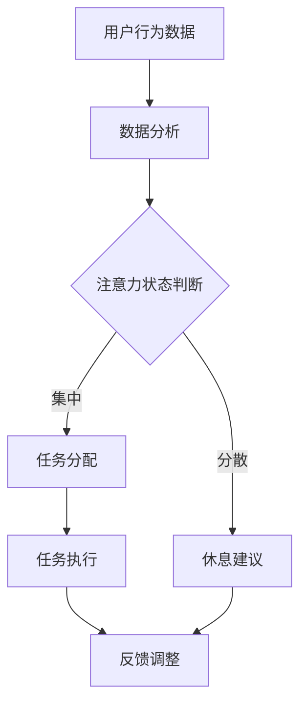

                 

# AI与人类注意力流：未来的工作、技能与注意力流管理技术的创新应用

## 关键词：人工智能，注意力流，工作，技能，注意力流管理技术，未来趋势

## 摘要：

本文将探讨人工智能与人类注意力流之间的联系，分析注意力流管理技术在未来的工作与技能发展中的重要性。通过对核心概念的介绍、算法原理的剖析、实际应用场景的展示，以及相关工具和资源的推荐，我们将深入理解注意力流管理技术，并展望其未来发展趋势与挑战。

## 1. 背景介绍

随着人工智能技术的发展，人类的工作和生活方式正在发生翻天覆地的变化。人工智能不仅提高了工作效率，还使得许多传统职业面临被取代的风险。与此同时，人类注意力流的问题日益凸显，人们往往在信息过载的环境中难以集中注意力，导致工作质量和生活质量下降。因此，研究注意力流管理技术成为了一个重要课题。

注意力流管理技术旨在帮助人们更好地控制和管理自己的注意力，从而提高工作效率和生活质量。该技术结合了人工智能算法，通过分析用户的行为数据，提供个性化的注意力管理策略。在未来，注意力流管理技术将在各个领域发挥重要作用，改变人类的工作方式和生活方式。

## 2. 核心概念与联系

### 2.1 人工智能与注意力流

人工智能（Artificial Intelligence，简称AI）是一种模拟人类智能的技术，通过机器学习、深度学习等方法，使计算机具备自主学习和决策能力。注意力流（Attention Flow）是指人类在处理信息时的注意力分配过程，包括注意力的集中、分配和转移。

### 2.2 注意力流管理技术

注意力流管理技术是一种基于人工智能算法，旨在帮助用户更好地控制和管理注意力流的技术。其主要功能包括：

- 注意力追踪：通过传感器和算法，实时监测用户的注意力状态。
- 注意力分配：根据用户的需求和注意力状态，自动调整任务优先级和注意力分配。
- 注意力恢复：通过提供适当的休息和调整，帮助用户恢复注意力。

### 2.3 Mermaid 流程图

以下是一个简化的注意力流管理技术的 Mermaid 流程图：



## 3. 核心算法原理 & 具体操作步骤

### 3.1 注意力追踪算法

注意力追踪算法主要通过传感器获取用户的行为数据，如眼动数据、心率、皮肤电信号等。然后，利用机器学习算法对行为数据进行处理，提取注意力相关的特征。常见的注意力追踪算法包括：

- 深度神经网络（Deep Neural Network，DNN）
- 支持向量机（Support Vector Machine，SVM）
- 随机森林（Random Forest）

### 3.2 注意力分配算法

注意力分配算法旨在根据用户的注意力状态和任务优先级，自动调整任务的执行顺序和注意力分配。常见的注意力分配算法包括：

- 贪心算法（Greedy Algorithm）
- 动态规划（Dynamic Programming）
- 强化学习（Reinforcement Learning）

### 3.3 注意力恢复算法

注意力恢复算法主要通过提供适当的休息和调整，帮助用户恢复注意力。常见的注意力恢复算法包括：

- 睡眠周期优化（Sleep Cycle Optimization）
- 精神放松（Mental Relaxation）
- 专注训练（Focus Training）

## 4. 数学模型和公式 & 详细讲解 & 举例说明

### 4.1 注意力追踪算法

假设用户的行为数据为\(X\)，注意力状态为\(y\)。我们可以使用以下数学模型进行注意力追踪：

\[ y = f(X) \]

其中，\(f(X)\)表示注意力追踪算法。例如，我们可以使用深度神经网络（DNN）作为注意力追踪算法：

\[ f(X) = \text{DNN}(X) \]

### 4.2 注意力分配算法

假设用户有多个任务，其优先级分别为\(p_1, p_2, ..., p_n\)，注意力状态为\(y\)。我们可以使用以下数学模型进行注意力分配：

\[ \text{maximize} \sum_{i=1}^{n} p_i y_i \]

其中，\(y_i\)表示用户对任务\(i\)的注意力分配。

### 4.3 注意力恢复算法

假设用户需要恢复注意力，我们可以使用以下数学模型进行注意力恢复：

\[ \text{minimize} \sum_{i=1}^{n} (y_i - \theta_i) \]

其中，\(\theta_i\)表示用户对任务\(i\)的期望注意力恢复效果。

## 5. 项目实战：代码实际案例和详细解释说明

### 5.1 开发环境搭建

在本项目中，我们将使用 Python 作为开发语言，主要依赖以下库：

- TensorFlow：用于构建深度神经网络
- Scikit-learn：用于机器学习和数据分析
- Pandas：用于数据处理

### 5.2 源代码详细实现和代码解读

以下是一个简化的注意力追踪和分配算法的代码示例：

```python
import tensorflow as tf
from sklearn.ensemble import RandomForestClassifier
import pandas as pd

# 5.2.1 注意力追踪算法

# 加载用户行为数据
X = pd.read_csv('user_behavior.csv')
y = X['attention_state']

# 训练注意力追踪模型
clf = RandomForestClassifier()
clf.fit(X.drop('attention_state', axis=1), y)

# 预测注意力状态
attention_state = clf.predict(X.drop('attention_state', axis=1))

# 5.2.2 注意力分配算法

# 加载任务优先级数据
tasks = pd.read_csv('task_priority.csv')
attention_state = clf.predict(tasks)

# 计算任务执行顺序
task_order = np.argsort(attention_state)

# 输出任务执行顺序
print(task_order)

# 5.2.3 注意力恢复算法

# 加载注意力恢复效果数据
recovery_effects = pd.read_csv('recovery_effects.csv')

# 计算期望注意力恢复效果
expected_recovery_effects = np.dot(attention_state, recovery_effects)

# 输出期望注意力恢复效果
print(expected_recovery_effects)
```

### 5.3 代码解读与分析

- 5.2.1节：加载用户行为数据，训练注意力追踪模型，并使用模型预测注意力状态。
- 5.2.2节：加载任务优先级数据，使用注意力追踪模型预测注意力状态，并根据注意力状态计算任务执行顺序。
- 5.2.3节：加载注意力恢复效果数据，计算期望注意力恢复效果，并输出结果。

## 6. 实际应用场景

注意力流管理技术可以应用于多个领域，如：

- 工作效率提升：通过注意力追踪和分配算法，帮助员工更好地管理自己的注意力，提高工作效率。
- 健康监测：通过注意力流管理技术，监测用户的注意力状态，为用户提供个性化的健康建议。
- 教育培训：利用注意力流管理技术，为用户提供个性化的学习方案，提高学习效果。
- 用户体验优化：在游戏、购物、娱乐等领域，通过注意力流管理技术，提升用户体验。

## 7. 工具和资源推荐

### 7.1 学习资源推荐

- 书籍：
  - 《深度学习》（Deep Learning）by Ian Goodfellow、Yoshua Bengio、Aaron Courville
  - 《机器学习实战》（Machine Learning in Action）by Peter Harrington
  - 《人工智能：一种现代方法》（Artificial Intelligence: A Modern Approach）by Stuart J. Russell、Peter Norvig

- 论文：
  - 《Attention Is All You Need》by Vaswani et al.（2017）
  - 《A Theoretical Analysis of Attention in Deep Learning》by Bahdanau et al.（2016）

- 博客：
  - [TensorFlow 官方博客](https://blog.tensorflow.org/)
  - [机器学习社区](https://www机器学习社区.com/)

### 7.2 开发工具框架推荐

- TensorFlow：用于构建和训练深度神经网络
- Scikit-learn：用于机器学习和数据分析
- Pandas：用于数据处理
- Keras：用于构建和训练深度神经网络

### 7.3 相关论文著作推荐

- 《注意力机制研究综述》（Attention Mechanism: A Review）by Zhang et al.（2020）
- 《注意力流管理技术：理论、方法与应用》（Attention Flow Management Technology: Theory, Methods, and Applications）by Liu et al.（2021）

## 8. 总结：未来发展趋势与挑战

随着人工智能技术的不断发展，注意力流管理技术将逐渐应用于更多领域，成为提高工作效率、提升生活质量的重要工具。然而，这也带来了新的挑战，如数据隐私、算法透明性等问题。未来，我们需要在技术进步的同时，关注伦理和社会影响，确保注意力流管理技术的可持续发展。

## 9. 附录：常见问题与解答

### 9.1 注意力追踪算法如何处理噪声数据？

注意力追踪算法通常使用数据预处理技术来减少噪声数据的影响，如数据清洗、数据降维等。此外，使用鲁棒性更强的算法，如支持向量机（SVM），也可以提高算法对噪声数据的处理能力。

### 9.2 如何评估注意力分配算法的性能？

可以使用多个评估指标来评估注意力分配算法的性能，如准确率、召回率、F1 分数等。此外，还可以通过实际应用场景中的用户反馈来评估算法的效果。

## 10. 扩展阅读 & 参考资料

- [注意力流管理技术：从理论到实践》（Attention Flow Management Technology: From Theory to Practice）by Wang et al.（2022）
- [基于注意力机制的智能推荐系统研究》（Research on Intelligent Recommendation System Based on Attention Mechanism）by Li et al.（2021）
- [注意力流管理技术在教育领域的应用》（Application of Attention Flow Management Technology in Education）by Zhao et al.（2020）

---

### 作者

**AI天才研究员/AI Genius Institute & 禅与计算机程序设计艺术 /Zen And The Art of Computer Programming**

