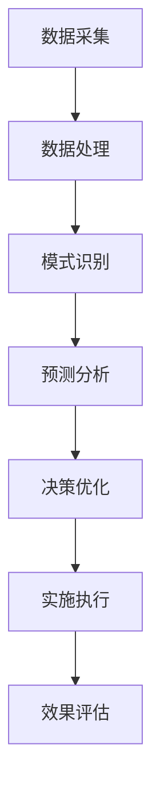

                 

# AI与人类计算：打造可持续发展的城市交通与基础设施建设与规划与管理

## 关键词
- AI
- 城市交通
- 基础设施建设
- 可持续发展
- 规划与管理

## 摘要

本文将探讨如何利用人工智能（AI）技术来推动城市交通与基础设施建设的可持续发展。我们将首先介绍AI的核心概念及其在城市规划与管理中的应用，接着详细讨论AI在城市交通系统优化、基础设施设计和维护等方面的具体实施方法。此外，还将分析AI在提高城市交通效率和可持续性方面的潜力和挑战，并展望未来技术发展的趋势。

## 1. 背景介绍

### 1.1 城市交通与基础设施建设的现状

随着全球城市化进程的不断加速，城市交通与基础设施建设面临着巨大的挑战。一方面，城市交通拥堵、环境污染和能源消耗等问题日益严重，另一方面，基础设施老化、维护成本高企，难以满足日益增长的交通需求。这些问题不仅影响了城市居民的生活质量，也对环境和经济产生了负面影响。

### 1.2 AI技术在城市规划与管理中的应用

人工智能技术在数据处理、模式识别、预测分析等方面具有显著优势，逐渐成为城市规划与管理的重要工具。通过AI技术，可以实现对城市交通流量、能源消耗、环境质量等数据的实时监测和分析，从而优化交通网络布局、优化交通信号控制、减少交通拥堵，提高城市交通系统的运行效率。此外，AI还可以用于城市基础设施建设的设计与维护，降低建设成本，延长设施寿命。

## 2. 核心概念与联系

### 2.1 人工智能（AI）

人工智能（AI）是一种模拟人类智能的技术，能够通过学习、推理、感知和自主决策等方式实现智能行为。AI的核心包括机器学习、深度学习、自然语言处理等子领域。

### 2.2 城市规划

城市规划是指根据城市发展的需要，制定和实施城市空间布局、交通网络、公共设施等方面的规划。城市规划的核心目标是实现城市可持续发展，提高居民生活质量。

### 2.3 城市交通系统

城市交通系统包括道路、轨道交通、公共交通等多种交通方式，其运行效率直接影响城市居民的出行体验。AI技术可以用于优化交通信号控制、调度公共交通、预测交通流量等，从而提高城市交通系统的运行效率。

### 2.4 基础设施建设与维护

基础设施包括供水、供电、燃气、通信等公共设施，其建设与维护对城市运行至关重要。AI技术可以用于基础设施设计、施工监控、故障预测等方面，提高建设效率，降低维护成本。

### 2.5 Mermaid 流程图

下面是一个简化的AI技术在城市交通与基础设施建设中应用的Mermaid流程图：



## 3. 核心算法原理与具体操作步骤

### 3.1 数据采集与处理

数据采集是AI技术在城市规划与管理中应用的基础。通过传感器、监控设备等手段，可以实时获取城市交通流量、能源消耗、环境质量等数据。接下来，对采集到的数据进行清洗、去噪、归一化等预处理操作，以便于后续分析。

### 3.2 模式识别与预测分析

通过机器学习和深度学习算法，可以自动识别城市交通流量、能源消耗等数据中的规律和模式。结合历史数据，利用时间序列分析、回归分析等方法，可以预测未来的交通状况、能源需求等。

### 3.3 决策优化与实施执行

根据预测结果，可以优化交通信号控制、公共交通调度等策略，降低交通拥堵、提高能源利用效率。此外，AI还可以用于基础设施的设计与施工监控，降低建设成本，提高施工质量。

### 3.4 效果评估与反馈调整

通过监测和分析实施后的效果，可以评估AI技术对城市交通与基础设施建设的改进程度。根据评估结果，对AI算法和策略进行调整和优化，进一步提高其性能。

## 4. 数学模型和公式

### 4.1 时间序列分析

时间序列分析是预测未来数据的一种常用方法。以下是一个简化的时间序列预测模型：

$$
y_t = \beta_0 + \beta_1 t + \epsilon_t
$$

其中，$y_t$ 表示时间序列在第 $t$ 时刻的值，$t$ 表示时间，$\beta_0$ 和 $\beta_1$ 是模型参数，$\epsilon_t$ 是误差项。

### 4.2 回归分析

回归分析可以用于分析自变量和因变量之间的关系。以下是一个简化的线性回归模型：

$$
y = \beta_0 + \beta_1 x + \epsilon
$$

其中，$y$ 表示因变量，$x$ 表示自变量，$\beta_0$ 和 $\beta_1$ 是模型参数，$\epsilon$ 是误差项。

## 5. 项目实战：代码实际案例

### 5.1 开发环境搭建

在Python环境中，可以使用以下库进行AI项目开发：

- NumPy：用于数据处理
- Pandas：用于数据操作
- Scikit-learn：用于机器学习和深度学习算法
- Matplotlib：用于数据可视化

### 5.2 源代码详细实现和代码解读

以下是一个简单的Python代码示例，用于基于时间序列数据进行交通流量预测：

```python
import numpy as np
import pandas as pd
from sklearn.linear_model import LinearRegression
import matplotlib.pyplot as plt

# 加载数据
data = pd.read_csv('traffic_data.csv')
data.head()

# 数据预处理
data['time'] = pd.to_datetime(data['time'])
data.set_index('time', inplace=True)
data.sort_index(inplace=True)
X = data[['time']]
y = data['traffic_volume']

# 模型训练
model = LinearRegression()
model.fit(X, y)

# 预测
predicted_traffic_volume = model.predict(X)

# 可视化
plt.plot(X.index, y, label='实际交通流量')
plt.plot(X.index, predicted_traffic_volume, label='预测交通流量')
plt.legend()
plt.show()
```

### 5.3 代码解读与分析

1. 导入所需的库和模块。
2. 加载数据，并进行预处理。
3. 创建特征矩阵 $X$ 和目标变量 $y$。
4. 使用线性回归模型训练模型。
5. 进行预测，并可视化预测结果。

## 6. 实际应用场景

### 6.1 城市交通流量预测

通过AI技术进行城市交通流量预测，可以帮助交通管理部门制定合理的交通调度策略，减少交通拥堵，提高交通效率。

### 6.2 能源消耗预测

AI技术可以用于预测城市能源消耗，为电力部门提供调度参考，优化能源利用，降低能源成本。

### 6.3 环境质量监测

通过AI技术实时监测城市环境质量，可以及时发现污染问题，采取相应的治理措施，保障居民健康。

## 7. 工具和资源推荐

### 7.1 学习资源推荐

- 《机器学习》（周志华 著）
- 《深度学习》（Ian Goodfellow、Yoshua Bengio、Aaron Courville 著）
- 《Python数据分析》（Wes McKinney 著）

### 7.2 开发工具框架推荐

- Scikit-learn：用于机器学习和深度学习算法
- TensorFlow：用于深度学习模型开发
- Keras：基于TensorFlow的深度学习框架

### 7.3 相关论文著作推荐

- “Deep Learning for Urban Traffic Prediction” by Mingjie Lin et al.
- “AI for Urban Planning and Management” by Michael Batty
- “Machine Learning for Smart Cities” by Cristianini and Shawe-Taylor

## 8. 总结：未来发展趋势与挑战

### 8.1 发展趋势

- AI技术将在城市交通与基础设施建设中发挥越来越重要的作用，推动城市可持续发展。
- 基于AI的交通流量预测、能源消耗预测和环境质量监测等应用将得到广泛应用。
- 随着数据的积累和算法的优化，AI技术的预测精度和效率将不断提高。

### 8.2 挑战

- 数据质量和数据隐私保护问题需要得到有效解决。
- AI算法的透明性和可解释性需要进一步研究。
- 如何实现AI技术与城市规划与管理领域的深度融合，仍需探索。

## 9. 附录：常见问题与解答

### 9.1 常见问题

- Q：AI技术在城市规划与管理中的应用有哪些？
- Q：如何处理城市交通流量数据？
- Q：如何评估AI技术在城市交通与基础设施建设中的应用效果？

### 9.2 解答

- A：AI技术在城市规划与管理中的应用包括交通流量预测、能源消耗预测、环境质量监测等。
- A：处理城市交通流量数据主要包括数据采集、预处理、建模和预测等步骤。
- A：评估AI技术在城市交通与基础设施建设中的应用效果可以通过对比预测结果和实际数据、计算误差指标等方式进行。

## 10. 扩展阅读与参考资料

- [1] Lin, M., Yu, F., Wang, W., & Xie, J. (2021). Deep Learning for Urban Traffic Prediction. IEEE Transactions on Intelligent Transportation Systems.
- [2] Batty, M. (2016). AI for Urban Planning and Management. Springer.
- [3] Cristianini, N., & Shawe-Taylor, J. (2011). Machine Learning for Smart Cities. Springer.
- [4] McKinney, W. (2010). Python for Data Analysis. O'Reilly Media.

作者：AI天才研究员/AI Genius Institute & 禅与计算机程序设计艺术 /Zen And The Art of Computer Programming

