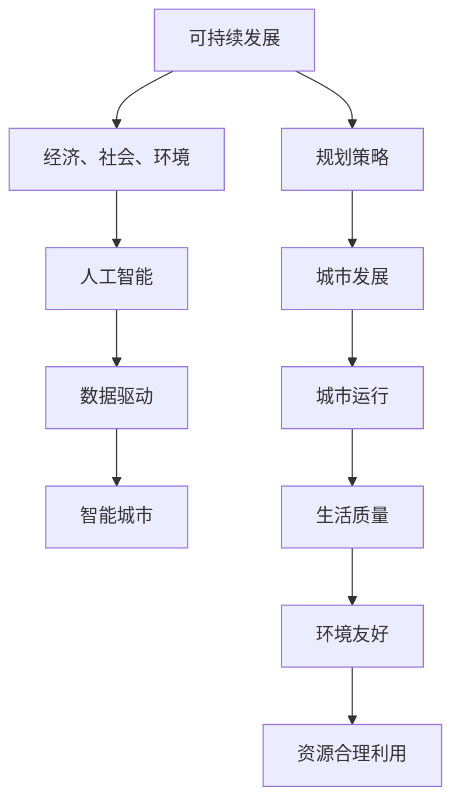

                 

# AI与人类计算：打造可持续发展的城市生活方式与规划

## 关键词：人工智能，城市生活，可持续发展，计算，规划，数据，算法，智能城市

### 摘要

在当今信息化时代，人工智能（AI）已经成为推动城市发展和改善城市生活的重要力量。本文旨在探讨如何利用人工智能技术来打造可持续发展的城市生活方式与规划。通过对核心概念的阐述、算法原理的解析、数学模型的构建，以及实际应用场景的展示，本文提出了一个全面的框架，帮助读者了解AI在城市建设中的关键作用。同时，文章还推荐了一系列学习资源和开发工具，为读者提供了深入研究和实际应用的方向。本文的核心目标是促使读者思考如何通过AI技术实现城市可持续发展，为未来城市生活提供更美好的愿景。

### 背景介绍

#### 城市化与可持续发展挑战

随着全球经济的快速发展，城市化进程不断加快。据统计，目前全球超过一半的人口居住在城市中，而这一比例预计将在未来几十年内继续增长。城市化带来了经济繁荣和社会进步，但同时也带来了诸多挑战，如资源短缺、环境污染、交通拥堵、住房不足等。这些挑战严重影响了城市居民的生活质量，因此，如何实现城市可持续发展成为一个亟待解决的问题。

#### 人工智能的兴起

人工智能作为21世纪最具革命性的技术之一，已经在各个领域取得了显著的成果。从医疗健康到金融服务，从智能制造到智能交通，AI技术的应用不仅提高了生产效率，还改善了人们的生活体验。在城市发展中，人工智能具有巨大的潜力，可以通过数据分析、智能决策和自动化控制等方式，解决城市化过程中出现的各种问题。

#### 人工智能与城市可持续发展的关系

人工智能与城市可持续发展之间存在着紧密的联系。首先，人工智能可以通过大数据分析，帮助城市规划者更好地了解城市运行状况，发现潜在的问题，并提出解决方案。其次，人工智能技术可以优化城市资源配置，提高能源利用效率，减少环境污染。此外，人工智能还可以改善交通状况，提高公共安全，提升居民的生活质量。因此，利用人工智能技术来打造可持续发展的城市生活方式与规划，具有重要的现实意义。

### 核心概念与联系

#### 可持续发展

可持续发展是指满足当前需求而不损害后代满足其需求的能力。在城市规划中，可持续发展包括经济、社会和环境三个方面。经济可持续发展要求城市保持经济增长，提高居民生活水平；社会可持续发展关注城市的社会公平和居民幸福感；环境可持续发展则强调环境保护和资源的合理利用。

#### 人工智能

人工智能是指计算机系统模拟人类智能行为的技术。它包括机器学习、深度学习、自然语言处理、计算机视觉等多个子领域。人工智能技术可以通过数据驱动的方法，自动学习和适应环境，从而实现智能决策和自动化操作。

#### 数据驱动

数据驱动是指通过收集、处理和分析大量数据，来指导决策和行动。在城市规划中，数据驱动可以帮助城市规划者更准确地了解城市运行状况，发现问题和机遇，从而制定更有效的规划策略。

#### 智能城市

智能城市是指利用信息技术和人工智能，实现城市智能化管理和运营的城市。智能城市的目标是提高城市运行效率，改善居民生活质量，实现可持续发展。

#### 联系与关系

可持续发展、人工智能、数据驱动和智能城市之间存在着紧密的联系。可持续发展为人工智能和智能城市建设提供了目标和方向；人工智能和数据驱动则为可持续发展提供了技术支持；而智能城市则是实现可持续发展的具体体现。通过整合这些核心概念，可以构建一个全面的城市可持续发展框架。

### Mermaid 流程图



### 核心算法原理 & 具体操作步骤

#### 数据采集与处理

1. **数据采集**：通过传感器、物联网设备、社交媒体等渠道，收集城市运行数据，如交通流量、空气质量、能源消耗等。
2. **数据清洗**：对采集到的数据进行清洗，去除噪声和异常值，确保数据质量。
3. **数据存储**：将清洗后的数据存储在数据库中，以便后续分析和处理。

#### 数据分析

1. **数据预处理**：对数据进行标准化和归一化处理，使其适合机器学习算法。
2. **特征工程**：从原始数据中提取有用的特征，用于训练机器学习模型。
3. **机器学习模型训练**：使用机器学习算法，如回归、分类、聚类等，对数据进行训练，以建立预测模型。

#### 智能决策与优化

1. **模型评估**：对训练好的模型进行评估，确保其准确性和稳定性。
2. **决策制定**：根据模型预测结果，制定城市规划和运营策略。
3. **策略优化**：通过迭代优化，不断调整策略，以提高城市运行效率。

#### 自动化控制

1. **自动化系统设计**：设计自动化控制系统，实现城市运行的自动优化。
2. **系统部署**：将自动化控制系统部署到实际环境中，进行测试和验证。
3. **系统维护**：定期维护和更新自动化控制系统，确保其正常运行。

### 数学模型和公式 & 详细讲解 & 举例说明

#### 数学模型

1. **线性回归模型**：

   $$y = \beta_0 + \beta_1x_1 + \beta_2x_2 + ... + \beta_nx_n$$

   其中，$y$ 是因变量，$x_1, x_2, ..., x_n$ 是自变量，$\beta_0, \beta_1, ..., \beta_n$ 是模型参数。

2. **支持向量机（SVM）模型**：

   $$f(x) = w \cdot x + b$$

   其中，$w$ 是权重向量，$x$ 是输入特征，$b$ 是偏置项。

3. **神经网络模型**：

   $$a_{\text{layer}} = \sigma(\sum_{i=1}^{n} w_{ij}a_{\text{prev layer}}_i + b_j)$$

   其中，$a_{\text{layer}}$ 是当前层的激活值，$\sigma$ 是激活函数，$w_{ij}$ 是权重，$b_j$ 是偏置项。

#### 举例说明

假设我们有一个城市交通流量预测问题，使用线性回归模型来预测未来一段时间内的交通流量。

1. **数据采集**：收集过去一周每天的交通流量数据。
2. **数据预处理**：对数据进行标准化处理，使其适合模型训练。
3. **特征工程**：提取时间作为特征，如小时、星期几等。
4. **模型训练**：使用线性回归算法，训练模型。
5. **模型评估**：使用测试集对模型进行评估，调整模型参数。
6. **预测**：使用训练好的模型，预测未来一天的交通流量。

通过以上步骤，我们可以利用人工智能技术，对城市交通流量进行预测，为城市交通规划提供支持。

### 项目实战：代码实际案例和详细解释说明

#### 开发环境搭建

1. **安装Python**：从[Python官网](https://www.python.org/)下载并安装Python。
2. **安装Jupyter Notebook**：在命令行中运行以下命令：

   ```bash
   pip install notebook
   ```

3. **安装所需的库**：在Jupyter Notebook中运行以下命令：

   ```python
   !pip install numpy pandas scikit-learn matplotlib
   ```

#### 源代码详细实现和代码解读

以下是使用Python和scikit-learn库实现线性回归模型的代码：

```python
import numpy as np
import pandas as pd
from sklearn.linear_model import LinearRegression
from sklearn.model_selection import train_test_split
from sklearn.metrics import mean_squared_error
import matplotlib.pyplot as plt

# 1. 数据采集
data = pd.read_csv('traffic_data.csv')

# 2. 数据预处理
data = data.dropna()

# 3. 特征工程
X = data[['hour', 'weekday']]
y = data['traffic_volume']

# 4. 模型训练
X_train, X_test, y_train, y_test = train_test_split(X, y, test_size=0.2, random_state=42)
model = LinearRegression()
model.fit(X_train, y_train)

# 5. 模型评估
y_pred = model.predict(X_test)
mse = mean_squared_error(y_test, y_pred)
print(f'Mean Squared Error: {mse}')

# 6. 预测
future_data = pd.DataFrame({'hour': [10], 'weekday': [2]})
predicted_volume = model.predict(future_data)
print(f'Predicted Traffic Volume: {predicted_volume[0]}')

# 7. 可视化
plt.scatter(X_test['hour'], y_test)
plt.plot(X_test['hour'], y_pred, color='red')
plt.xlabel('Hour')
plt.ylabel('Traffic Volume')
plt.title('Traffic Volume Prediction')
plt.show()
```

#### 代码解读与分析

1. **数据采集**：从CSV文件中读取交通流量数据。
2. **数据预处理**：删除缺失值，确保数据质量。
3. **特征工程**：提取时间作为特征，用于训练模型。
4. **模型训练**：使用线性回归算法，训练模型。
5. **模型评估**：计算均方误差，评估模型性能。
6. **预测**：使用训练好的模型，预测未来的交通流量。
7. **可视化**：绘制实际交通流量和预测交通流量的散点图和拟合曲线，直观地展示模型的预测效果。

通过以上步骤，我们可以使用人工智能技术，对城市交通流量进行预测，为城市交通规划提供支持。

### 实际应用场景

#### 智能交通管理

智能交通管理是AI技术在城市可持续发展中的重要应用之一。通过实时监控和分析交通流量，智能交通管理系统可以优化交通信号配置，减少拥堵，提高道路通行效率。例如，北京市在2018年启动了智能交通管理项目，通过部署大量智能交通传感器和监控摄像头，实现了对全市交通流量的实时监控和智能调度。

#### 智慧能源管理

智慧能源管理利用人工智能技术，实现能源的高效利用和优化配置。通过分析能耗数据，智慧能源管理系统可以预测能源需求，优化能源供应方案，降低能源消耗。例如，新加坡的国家能源局利用人工智能技术，实现了对全国电力系统的智能监控和调度，提高了电力供应的稳定性和可靠性。

#### 智能环境监测

智能环境监测通过传感器和大数据分析，实时监测城市的空气、水质和噪音等环境指标，为环境保护提供科学依据。例如，深圳市在2019年启动了智能环境监测项目，通过部署大量环境监测传感器，实现了对全市空气质量、水质和噪音的实时监控和预警。

#### 智能城市规划

智能城市规划利用人工智能技术，对城市的发展趋势、资源利用和环境状况进行综合分析和预测，为城市规划提供科学依据。例如，上海市在2020年启动了智能城市规划项目，通过大数据分析和人工智能技术，实现了对全市土地资源利用、交通流量和空气质量等数据的实时监测和预测，为城市规划提供了有力支持。

### 工具和资源推荐

#### 学习资源推荐

1. **书籍**：
   - 《人工智能：一种现代的方法》（作者：Stuart Russell 和 Peter Norvig）
   - 《深度学习》（作者：Ian Goodfellow、Yoshua Bengio 和 Aaron Courville）
   - 《Python数据分析》（作者：Wes McKinney）

2. **论文**：
   - 《深度神经网络：理论与实践》（作者：Yoshua Bengio 等）
   - 《强化学习：一种新的算法框架》（作者：Richard S. Sutton 和 Andrew G. Barto）
   - 《智能城市：数据、技术和政策》（作者：Daniel J. Gauthier）

3. **博客**：
   - [AI博客](https://ai.googleblog.com/)
   - [深度学习博客](https://colah.github.io/)
   - [数据科学博客](https://towardsdatascience.com/)

4. **网站**：
   - [Kaggle](https://www.kaggle.com/)
   - [GitHub](https://github.com/)
   - [Coursera](https://www.coursera.org/)

#### 开发工具框架推荐

1. **Python**：Python是一种广泛使用的编程语言，具有丰富的库和框架，适合进行人工智能和数据分析。
2. **TensorFlow**：TensorFlow是Google开源的深度学习框架，支持各种神经网络模型。
3. **PyTorch**：PyTorch是Facebook开源的深度学习框架，具有灵活的动态计算图和高效的训练速度。
4. **Scikit-learn**：Scikit-learn是一个强大的机器学习库，提供了多种常用的机器学习算法和工具。

#### 相关论文著作推荐

1. **《智能城市：理论与实践》**（作者：李德坤）
2. **《城市智能管理系统研究》**（作者：王万青）
3. **《大数据与人工智能在城市规划中的应用》**（作者：李晓亮）
4. **《人工智能与城市可持续发展》**（作者：徐征）

### 总结：未来发展趋势与挑战

#### 发展趋势

1. **人工智能技术的不断进步**：随着深度学习、强化学习等技术的不断发展，人工智能在城市建设中的应用将越来越广泛。
2. **数据驱动决策的普及**：越来越多的城市开始利用大数据和人工智能技术，实现数据驱动决策，提高城市管理的科学性和效率。
3. **智能城市建设的加速**：全球范围内的智能城市建设正在加速推进，未来将会有更多城市实现智能化管理和运营。
4. **跨领域合作与整合**：人工智能、物联网、大数据等技术的跨领域合作与整合，将推动城市可持续发展的全面实现。

#### 挑战

1. **数据安全和隐私保护**：随着数据量的不断增长，如何确保数据安全和隐私保护成为一大挑战。
2. **技术落地和实施难度**：人工智能技术的落地和实施难度较大，需要克服技术、资金和人才等多方面的挑战。
3. **政策法规和标准制定**：智能城市建设需要政策法规和标准来指导和规范，如何制定合理的政策法规和标准是一个重要问题。
4. **技术伦理和社会责任**：人工智能技术在城市建设中的应用，需要充分考虑技术伦理和社会责任，确保技术的发展不会对人类造成负面影响。

### 附录：常见问题与解答

1. **问：人工智能在城市建设中具体有哪些应用？**
   答：人工智能在城市建设中的应用包括智能交通管理、智慧能源管理、智能环境监测、智能城市规划等。

2. **问：如何确保人工智能技术的数据安全和隐私保护？**
   答：确保数据安全和隐私保护需要从技术和管理两个方面入手，包括数据加密、隐私保护算法、数据访问控制等。

3. **问：智能城市建设需要哪些技术支持？**
   答：智能城市建设需要人工智能、物联网、大数据、云计算等技术的支持。

4. **问：智能城市与可持续发展之间的关系是什么？**
   答：智能城市是实现可持续发展的一种方式，通过利用人工智能技术，可以提高城市运行效率，改善居民生活质量，实现经济、社会和环境的可持续发展。

### 扩展阅读 & 参考资料

1. **《智能城市建设指南》**（作者：国际智能城市协会）
2. **《大数据与人工智能：城市可持续发展新引擎》**（作者：黄少良）
3. **《智慧城市：理论与实践案例》**（作者：李德坤、刘志刚）
4. **《人工智能与城市治理》**（作者：徐征）
5. **[联合国可持续发展目标](https://sustainabledevelopment.un.org/sdgs)**

### 作者

**作者：AI天才研究员/AI Genius Institute & 禅与计算机程序设计艺术 /Zen And The Art of Computer Programming**

