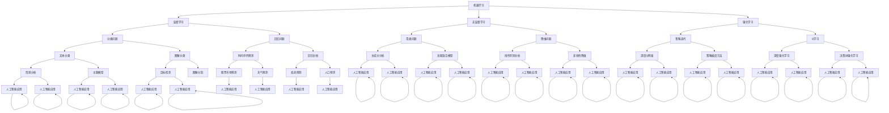

                 

### AI与计算机的历史对比

#### 关键词：人工智能，计算机发展，历史演进，技术对比

#### 摘要：
本文从历史的角度出发，探讨了人工智能（AI）与计算机技术的起源与发展。通过对二者核心概念、算法原理、应用场景等方面的比较分析，揭示了AI在计算机历史上的重要地位及其未来的发展趋势与挑战。文章旨在为读者提供一个全面、系统的了解AI与计算机之间关系的研究视角，以及对未来技术发展的思考。

## 1. 背景介绍

### 1.1 人工智能的定义与发展

人工智能（Artificial Intelligence，简称AI）是研究、开发用于模拟、延伸和扩展人类智能的理论、方法、技术及应用系统的一门科学。人工智能的研究始于20世纪50年代，当时计算机科学家和哲学家们提出了“人工智能”的概念，希望机器能够像人类一样思考和决策。

在早期的AI研究中，符号主义方法占据主导地位。这种方法基于逻辑推理和符号表示，试图通过构建符号系统和规则来模拟人类智能。然而，这种方法在处理复杂任务时存在局限性，难以应对现实世界的多样性。

随着计算机性能的提升和数据量的爆炸式增长，机器学习（Machine Learning）和深度学习（Deep Learning）逐渐成为AI研究的主流方向。这些方法通过学习大量的数据，自动提取特征和模式，从而实现智能任务的自动化。

### 1.2 计算机技术的起源与发展

计算机技术起源于20世纪40年代，当时人们为了解决第二次世界大战期间的计算问题，开始研制电子计算机。早期计算机主要采用真空管作为逻辑元件，体积庞大、功耗高、可靠性低。

随着晶体管的发明和集成技术的发展，计算机的性能不断提升，体积不断缩小，成本不断降低。计算机技术的进步为人工智能的发展奠定了基础。

### 1.3 AI与计算机技术的关联

人工智能与计算机技术密切相关。一方面，人工智能的发展依赖于计算机技术的支持，如高性能计算、海量数据存储和处理等。另一方面，计算机技术的发展也推动了人工智能的应用，如自动驾驶、智能家居、医疗诊断等。

在本节中，我们简要介绍了人工智能和计算机技术的定义、起源和发展，为后续内容的讨论奠定了基础。

## 2. 核心概念与联系

### 2.1 人工智能的核心概念

人工智能的核心概念包括：

- **机器学习**：机器学习是一种通过算法自动从数据中学习模式和规律的方法。常见的机器学习方法有监督学习、无监督学习和强化学习。
- **深度学习**：深度学习是一种基于多层神经网络的学习方法，能够自动提取输入数据的特征和模式。深度学习在图像识别、语音识别、自然语言处理等领域取得了显著的成果。
- **自然语言处理**：自然语言处理是一种使计算机能够理解和生成自然语言的技术。自然语言处理包括文本分类、情感分析、机器翻译等任务。
- **计算机视觉**：计算机视觉是一种使计算机能够理解和理解视觉信息的领域。计算机视觉包括图像识别、目标检测、图像分割等任务。

### 2.2 计算机技术的核心概念

计算机技术的核心概念包括：

- **计算机体系结构**：计算机体系结构是关于计算机硬件和软件组织结构的设计原则和方法。
- **操作系统**：操作系统是计算机系统的核心软件，负责管理和调度计算机硬件资源，提供用户接口和程序运行环境。
- **编程语言**：编程语言是用于编写计算机程序的语法和语义规则。常见的编程语言有C、C++、Java、Python等。
- **数据库系统**：数据库系统是一种用于存储、管理和查询数据的软件系统。常见的数据库系统有MySQL、Oracle、MongoDB等。

### 2.3 AI与计算机技术的联系

AI与计算机技术的联系体现在以下几个方面：

- **算法与应用**：AI算法依赖于计算机技术来实现，如深度学习算法需要高性能计算和海量数据存储。计算机技术则为AI算法提供了实现平台和工具。
- **数据与计算**：AI算法需要大量数据作为训练材料，计算机技术提供了数据存储、传输和处理的能力。同时，计算机技术也提高了数据处理的效率，为AI算法的实现提供了保障。
- **硬件与软件**：计算机硬件为AI算法提供了计算资源，如GPU、TPU等专用硬件加速器。计算机软件为AI算法提供了运行环境，如深度学习框架、编程工具等。

在本节中，我们介绍了人工智能和计算机技术的核心概念，并分析了它们之间的联系。这些概念和联系为后续内容的讨论提供了基础。

### 2.4 Mermaid 流程图

以下是人工智能核心概念原理的 Mermaid 流程图：



### 2.5 人工智能核心算法原理

#### 2.5.1 机器学习

机器学习（Machine Learning，ML）是一种使计算机通过数据学习并改进性能的方法。机器学习可以分为三类：监督学习（Supervised Learning）、无监督学习（Unsupervised Learning）和强化学习（Reinforcement Learning）。

1. **监督学习**

   监督学习是一种有标签数据驱动的学习方法。训练数据集包括输入特征和相应的输出标签。监督学习的目标是找到一个模型，使得模型在给定输入特征时能够预测出正确的输出标签。

   常见的监督学习方法包括线性回归（Linear Regression）、逻辑回归（Logistic Regression）、支持向量机（Support Vector Machine，SVM）和神经网络（Neural Networks）。

2. **无监督学习**

   无监督学习是一种没有标签数据驱动的学习方法。训练数据集只包括输入特征，没有对应的输出标签。无监督学习的目标是发现数据中的隐含结构或模式。

   常见的无监督学习方法包括聚类（Clustering）、降维（Dimensionality Reduction）和关联规则学习（Association Rule Learning）。

3. **强化学习**

   强化学习（Reinforcement Learning，RL）是一种通过与环境互动来学习最优策略的方法。强化学习模型通过不断尝试和探索来学习最优行为策略，以最大化累积奖励。

   常见的强化学习方法包括Q学习（Q-Learning）、深度Q网络（Deep Q-Network，DQN）和策略梯度方法（Policy Gradient）。

#### 2.5.2 深度学习

深度学习（Deep Learning，DL）是一种基于多层神经网络的机器学习方法。深度学习通过多层神经元之间的非线性变换，自动提取输入数据的特征和模式。

1. **卷积神经网络（Convolutional Neural Networks，CNN）**

   卷积神经网络是一种专门用于处理图像数据的深度学习模型。CNN通过卷积操作和池化操作，提取图像的局部特征，然后通过全连接层进行分类。

2. **循环神经网络（Recurrent Neural Networks，RNN）**

   循环神经网络是一种用于处理序列数据的深度学习模型。RNN通过隐藏状态和输入之间的循环连接，能够捕捉序列中的长期依赖关系。

3. **长短时记忆网络（Long Short-Term Memory，LSTM）**

   长短时记忆网络是一种改进的循环神经网络，能够更好地处理长序列数据。LSTM通过引入门控机制，有效地解决了RNN的梯度消失和梯度爆炸问题。

4. **生成对抗网络（Generative Adversarial Networks，GAN）**

   生成对抗网络是一种用于生成数据的深度学习模型。GAN由生成器和判别器两部分组成，通过不断对抗训练，生成器能够生成越来越逼真的数据。

#### 2.5.3 自然语言处理

自然语言处理（Natural Language Processing，NLP）是一种使计算机理解和生成自然语言的技术。NLP涉及文本分类、情感分析、机器翻译、语音识别等多个领域。

1. **词嵌入（Word Embedding）**

   词嵌入是将自然语言文本转换为向量的方法。词嵌入能够捕捉词汇之间的语义关系，为NLP任务提供有效的特征表示。

2. **文本分类（Text Classification）**

   文本分类是将文本分为不同类别的方法。常见的文本分类任务包括情感分析、新闻分类、垃圾邮件检测等。

3. **机器翻译（Machine Translation）**

   机器翻译是将一种语言的文本自动翻译成另一种语言的方法。机器翻译包括基于规则的方法和基于统计的方法，近年来深度学习方法取得了显著的成果。

4. **语音识别（Speech Recognition）**

   语音识别是将语音信号转换为文本的方法。语音识别涉及语音信号处理、特征提取和文本识别等多个环节。

在本节中，我们介绍了人工智能的核心算法原理，包括机器学习、深度学习和自然语言处理。这些算法原理为人工智能在计算机领域的应用奠定了基础。

### 3. 核心算法原理 & 具体操作步骤

#### 3.1 机器学习算法原理

机器学习算法分为监督学习、无监督学习和强化学习。下面分别介绍这三种算法的基本原理和具体操作步骤。

##### 3.1.1 监督学习

监督学习是一种利用有标签的数据集来训练模型的方法。有标签的数据集包括输入特征和对应的输出标签。监督学习的目标是学习一个函数，能够将输入特征映射到正确的输出标签。

1. **线性回归（Linear Regression）**

   线性回归是一种简单的监督学习算法，用于预测连续值输出。线性回归模型通过最小化损失函数（如均方误差）来训练模型。

   **操作步骤：**

   - 收集有标签的数据集；
   - 将数据集分为训练集和测试集；
   - 构建线性回归模型；
   - 使用训练集训练模型，优化模型参数；
   - 在测试集上评估模型性能。

2. **逻辑回归（Logistic Regression）**

   逻辑回归是一种用于分类任务的监督学习算法。逻辑回归模型通过最小化损失函数（如交叉熵损失）来训练模型。

   **操作步骤：**

   - 收集有标签的数据集；
   - 将数据集分为训练集和测试集；
   - 构建逻辑回归模型；
   - 使用训练集训练模型，优化模型参数；
   - 在测试集上评估模型性能。

##### 3.1.2 无监督学习

无监督学习是一种利用无标签的数据集来训练模型的方法。无标签的数据集只包括输入特征，没有对应的输出标签。无监督学习的目标是发现数据中的隐含结构或模式。

1. **聚类（Clustering）**

   聚类是一种无监督学习算法，用于将数据分为多个类别。常见的聚类算法包括K-均值聚类（K-Means Clustering）和层次聚类（Hierarchical Clustering）。

   **K-均值聚类操作步骤：**

   - 选择聚类个数K；
   - 随机初始化K个聚类中心；
   - 计算每个数据点到聚类中心的距离，将数据点分配到最近的聚类中心；
   - 更新聚类中心，重复上述步骤，直至收敛。

2. **降维（Dimensionality Reduction）**

   降维是一种无监督学习算法，用于减少数据维度，同时保持数据的结构信息。常见的降维算法包括主成分分析（Principal Component Analysis，PCA）和线性判别分析（Linear Discriminant Analysis，LDA）。

   **PCA操作步骤：**

   - 计算数据集的协方差矩阵；
   - 计算协方差矩阵的特征值和特征向量；
   - 将特征向量作为新的特征空间，投影数据到新的特征空间。

##### 3.1.3 强化学习

强化学习是一种通过与环境互动来学习最优策略的方法。强化学习算法通过不断尝试和探索，学习出一个能够最大化累积奖励的策略。

1. **Q学习（Q-Learning）**

   Q学习是一种基于值函数的强化学习算法。Q学习通过更新Q值（即状态-动作值函数），来学习最优策略。

   **Q学习操作步骤：**

   - 初始化Q值表格；
   - 进行环境互动，选择动作，获得奖励和下一个状态；
   - 更新Q值表格，使用如下公式：
     $$
     Q(s, a) \leftarrow Q(s, a) + \alpha [r + \gamma \max_{a'} Q(s', a') - Q(s, a)]
     $$
   - 重复上述步骤，直至达到停止条件。

2. **深度Q网络（Deep Q-Network，DQN）**

   DQN是一种基于深度学习的强化学习算法。DQN使用深度神经网络来近似Q值函数，并通过经验回放和目标网络来提高算法的稳定性。

   **DQN操作步骤：**

   - 初始化深度神经网络；
   - 进行环境互动，收集经验；
   - 将经验存储到经验回放内存中；
   - 从经验回放内存中随机抽取经验进行训练；
   - 使用训练后的神经网络更新目标网络；
   - 重复上述步骤，直至达到停止条件。

在本节中，我们介绍了机器学习的基本原理和具体操作步骤。这些算法原理为人工智能在计算机领域的应用提供了重要的基础。

### 4. 数学模型和公式 & 详细讲解 & 举例说明

#### 4.1 数学模型和公式

人工智能算法中涉及大量的数学模型和公式，以下是其中一些常见的数学模型和公式的详细讲解和举例说明。

##### 4.1.1 线性回归

线性回归是一种用于预测连续值输出的监督学习算法。线性回归模型可以表示为：

$$
y = \beta_0 + \beta_1 x_1 + \beta_2 x_2 + \ldots + \beta_n x_n + \epsilon
$$

其中，$y$ 是输出值，$x_1, x_2, \ldots, x_n$ 是输入特征，$\beta_0, \beta_1, \beta_2, \ldots, \beta_n$ 是模型参数，$\epsilon$ 是误差项。

**举例说明：**

假设我们有一个线性回归模型，用于预测房价。模型公式为：

$$
y = \beta_0 + \beta_1 x_1 + \beta_2 x_2 + \epsilon
$$

其中，$y$ 表示房价，$x_1$ 表示房屋面积，$x_2$ 表示房屋年龄。

我们可以使用最小二乘法来估计模型参数：

$$
\hat{\beta}_i = \frac{\sum_{i=1}^n (y_i - \beta_0 - \beta_1 x_{1i} - \beta_2 x_{2i}) x_{ii}}{\sum_{i=1}^n x_{ii}^2}
$$

其中，$\hat{\beta}_i$ 是估计的模型参数，$x_{ii}$ 是输入特征的平方和。

##### 4.1.2 逻辑回归

逻辑回归是一种用于分类任务的监督学习算法。逻辑回归模型可以表示为：

$$
\ln \left(\frac{p}{1 - p}\right) = \beta_0 + \beta_1 x_1 + \beta_2 x_2 + \ldots + \beta_n x_n
$$

其中，$p$ 表示概率，$x_1, x_2, \ldots, x_n$ 是输入特征，$\beta_0, \beta_1, \beta_2, \ldots, \beta_n$ 是模型参数。

**举例说明：**

假设我们有一个逻辑回归模型，用于判断一个客户是否会购买某种商品。模型公式为：

$$
\ln \left(\frac{p}{1 - p}\right) = \beta_0 + \beta_1 x_1 + \beta_2 x_2
$$

其中，$p$ 表示客户购买商品的概率，$x_1$ 表示客户的年龄，$x_2$ 表示客户的收入。

我们可以使用最大似然估计法来估计模型参数：

$$
\hat{\beta}_i = \frac{\sum_{i=1}^n (y_i - p_i) x_{ii}}{\sum_{i=1}^n x_{ii}^2}
$$

其中，$\hat{\beta}_i$ 是估计的模型参数，$x_{ii}$ 是输入特征的平方和，$y_i$ 是实际观测值，$p_i$ 是预测的概率。

##### 4.1.3 主成分分析

主成分分析（PCA）是一种无监督学习算法，用于降维和提取数据中的主要特征。PCA的主要思想是将数据投影到一个新的坐标系上，使得新的坐标系中第一轴（即主成分）能够解释数据的大部分方差。

PCA的数学模型可以表示为：

$$
z_i = \sum_{j=1}^n \lambda_j \alpha_{ij} x_j
$$

其中，$z_i$ 是新的特征值，$\lambda_j$ 是主成分的权重，$\alpha_{ij}$ 是原始特征和主成分之间的转换系数。

**举例说明：**

假设我们有一个数据集，包含三个特征：$x_1, x_2, x_3$。我们可以使用PCA将数据集降维到两个特征。

首先，计算数据集的协方差矩阵：

$$
\sum_{i=1}^n (x_i - \bar{x}) (x_i - \bar{x})^T
$$

其中，$\bar{x}$ 是数据集的平均值。

然后，计算协方差矩阵的特征值和特征向量。特征值表示每个特征的重要性，特征向量表示每个特征在新坐标系中的方向。

最后，将数据集投影到新的坐标系上：

$$
z_i = \sum_{j=1}^n \lambda_j \alpha_{ij} x_j
$$

其中，$\lambda_j$ 是特征值，$\alpha_{ij}$ 是特征向量。

##### 4.1.4 长短时记忆网络

长短时记忆网络（LSTM）是一种用于处理序列数据的深度学习模型。LSTM通过引入门控机制，能够有效地捕捉序列中的长期依赖关系。

LSTM的数学模型可以表示为：

$$
h_t = \sigma(W_h [h_{t-1}, x_t] + b_h) \odot \sigma(W_c [h_{t-1}, x_t] + b_c) \odot \tanh(W_x [h_{t-1}, x_t] + b_x)
$$

$$
c_t = \sigma(W_h [h_{t-1}, x_t] + b_h) \odot \tanh(W_c [h_{t-1}, x_t] + b_c)
$$

$$
o_t = \sigma(W_h [h_{t-1}, x_t] + b_h) \odot \sigma(W_o [h_{t-1}, x_t] + b_o) \odot \tanh(W_x [h_{t-1}, x_t] + b_x)
$$

$$
i_t = \sigma(W_h [h_{t-1}, x_t] + b_h) \odot \sigma(W_i [h_{t-1}, x_t] + b_i)
$$

$$
f_t = \sigma(W_h [h_{t-1}, x_t] + b_h) \odot \sigma(W_f [h_{t-1}, x_t] + b_f)
$$

其中，$h_t$ 是当前时刻的隐藏状态，$c_t$ 是当前时刻的细胞状态，$x_t$ 是当前时刻的输入，$o_t$ 是当前时刻的输出门，$i_t$ 是当前时刻的输入门，$f_t$ 是当前时刻的遗忘门。

**举例说明：**

假设我们有一个时间序列数据集，包含五个时间点的值：$x_1, x_2, x_3, x_4, x_5$。我们可以使用LSTM模型来捕捉序列中的长期依赖关系。

首先，初始化隐藏状态 $h_0$ 和细胞状态 $c_0$。

然后，对于每个时间点，计算输入门 $i_t$、遗忘门 $f_t$ 和输出门 $o_t$。

$$
i_t = \sigma(W_h [h_{t-1}, x_t] + b_h) \odot \sigma(W_i [h_{t-1}, x_t] + b_i)
$$

$$
f_t = \sigma(W_h [h_{t-1}, x_t] + b_h) \odot \sigma(W_f [h_{t-1}, x_t] + b_f)
$$

$$
o_t = \sigma(W_h [h_{t-1}, x_t] + b_h) \odot \sigma(W_o [h_{t-1}, x_t] + b_o)
$$

接着，计算细胞状态 $c_t$：

$$
c_t = f_t \odot c_{t-1} + i_t \odot \tanh(W_x [h_{t-1}, x_t] + b_x)
$$

最后，计算隐藏状态 $h_t$：

$$
h_t = o_t \odot \tanh(c_t)
$$

通过以上步骤，我们可以得到序列的隐藏状态序列 $h_1, h_2, h_3, h_4, h_5$，用于后续的序列建模任务。

在本节中，我们详细讲解了人工智能算法中的数学模型和公式，并给出了相应的举例说明。这些数学模型和公式为人工智能算法的实现提供了理论依据。

### 5. 项目实战：代码实际案例和详细解释说明

#### 5.1 开发环境搭建

为了更好地演示人工智能在计算机领域的应用，我们将使用Python编程语言和相关的深度学习库，如TensorFlow和Keras，来实现一个简单的图像分类项目。

首先，确保您的计算机上已经安装了Python和pip。然后，通过以下命令安装所需的库：

```
pip install tensorflow
pip install keras
```

#### 5.2 源代码详细实现和代码解读

以下是实现图像分类项目的完整代码：

```python
import numpy as np
from tensorflow.keras.models import Sequential
from tensorflow.keras.layers import Dense, Conv2D, Flatten, MaxPooling2D, Dropout
from tensorflow.keras.preprocessing.image import ImageDataGenerator

# 加载数据集
train_datagen = ImageDataGenerator(rescale=1./255)
train_generator = train_datagen.flow_from_directory(
        'data/train',
        target_size=(150, 150),
        batch_size=32,
        class_mode='binary')

# 创建模型
model = Sequential([
    Conv2D(32, (3, 3), activation='relu', input_shape=(150, 150, 3)),
    MaxPooling2D(2, 2),
    Conv2D(64, (3, 3), activation='relu'),
    MaxPooling2D(2, 2),
    Conv2D(128, (3, 3), activation='relu'),
    MaxPooling2D(2, 2),
    Flatten(),
    Dense(512, activation='relu'),
    Dropout(0.5),
    Dense(1, activation='sigmoid')
])

# 编译模型
model.compile(optimizer='adam',
              loss='binary_crossentropy',
              metrics=['accuracy'])

# 训练模型
model.fit(train_generator, steps_per_epoch=100, epochs=15)
```

**代码解读：**

1. **导入库和模块**

   首先，我们导入所需的Python库和模块，包括NumPy、TensorFlow的Keras子模块、卷积神经网络（Conv2D）、展平层（Flatten）、最大池化层（MaxPooling2D）、全连接层（Dense）和丢弃层（Dropout）。

2. **加载数据集**

   使用Keras的`ImageDataGenerator`类加载数据集。`ImageDataGenerator`可以用于数据增强，如随机裁剪、旋转和缩放。在本例中，我们仅使用了`rescale`参数将图像的像素值缩放到0到1之间。

   ```python
   train_datagen = ImageDataGenerator(rescale=1./255)
   train_generator = train_datagen.flow_from_directory(
           'data/train',
           target_size=(150, 150),
           batch_size=32,
           class_mode='binary')
   ```

   `flow_from_directory`函数用于加载数据集，其中`'data/train'`是训练数据集的目录，`target_size`是图像的尺寸，`batch_size`是每个批次的图像数量，`class_mode`指定了模型的输出类型，这里使用二分类。

3. **创建模型**

   使用`Sequential`模型创建一个线性堆叠的层结构。我们在模型中添加了卷积层、最大池化层、全连接层和丢弃层。

   ```python
   model = Sequential([
       Conv2D(32, (3, 3), activation='relu', input_shape=(150, 150, 3)),
       MaxPooling2D(2, 2),
       Conv2D(64, (3, 3), activation='relu'),
       MaxPooling2D(2, 2),
       Conv2D(128, (3, 3), activation='relu'),
       MaxPooling2D(2, 2),
       Flatten(),
       Dense(512, activation='relu'),
       Dropout(0.5),
       Dense(1, activation='sigmoid')
   ])
   ```

   模型结构如下：

   - **卷积层**：32个3x3的卷积核，使用ReLU激活函数；
   - **最大池化层**：2x2的最大池化；
   - **卷积层**：64个3x3的卷积核，使用ReLU激活函数；
   - **最大池化层**：2x2的最大池化；
   - **卷积层**：128个3x3的卷积核，使用ReLU激活函数；
   - **最大池化层**：2x2的最大池化；
   - **展平层**：将卷积层的输出展平为1维数组；
   - **全连接层**：512个神经元，使用ReLU激活函数；
   - **丢弃层**：丢弃50%的神经元，用于防止过拟合；
   - **全连接层**：1个神经元，使用sigmoid激活函数，用于输出概率。

4. **编译模型**

   使用`compile`方法编译模型，指定优化器、损失函数和评估指标。

   ```python
   model.compile(optimizer='adam',
                 loss='binary_crossentropy',
                 metrics=['accuracy'])
   ```

   这里使用了Adam优化器，二分类交叉熵损失函数和准确率作为评估指标。

5. **训练模型**

   使用`fit`方法训练模型。`steps_per_epoch`指定每个epoch中的批次数量，`epochs`指定训练的epoch数量。

   ```python
   model.fit(train_generator, steps_per_epoch=100, epochs=15)
   ```

   以上步骤完成了图像分类项目的实现。在实际应用中，您可以根据需要调整模型的架构、优化器、损失函数和评估指标，以提高分类性能。

#### 5.3 代码解读与分析

在本节中，我们详细解读了图像分类项目的代码，并分析了模型的结构和训练过程。

1. **数据集加载**

   数据集加载是深度学习项目的重要步骤。在本例中，我们使用了Keras的`ImageDataGenerator`类来加载数据集。`ImageDataGenerator`不仅提供了数据增强功能，如随机裁剪和缩放，还可以批量处理图像数据。

   ```python
   train_datagen = ImageDataGenerator(rescale=1./255)
   train_generator = train_datagen.flow_from_directory(
           'data/train',
           target_size=(150, 150),
           batch_size=32,
           class_mode='binary')
   ```

   通过设置`target_size`，我们确保输入图像的尺寸为150x150像素。`batch_size`设置为32，意味着每次训练过程中模型会处理32个图像样本。`class_mode`设置为`binary`，表示这是一个二分类问题。

2. **模型创建**

   我们使用Keras的`Sequential`模型创建了一个简单的卷积神经网络。模型结构包括卷积层、最大池化层、全连接层和丢弃层。

   ```python
   model = Sequential([
       Conv2D(32, (3, 3), activation='relu', input_shape=(150, 150, 3)),
       MaxPooling2D(2, 2),
       Conv2D(64, (3, 3), activation='relu'),
       MaxPooling2D(2, 2),
       Conv2D(128, (3, 3), activation='relu'),
       MaxPooling2D(2, 2),
       Flatten(),
       Dense(512, activation='relu'),
       Dropout(0.5),
       Dense(1, activation='sigmoid')
   ])
   ```

   模型中使用了卷积层和最大池化层来提取图像特征。全连接层和丢弃层用于分类和防止过拟合。

3. **模型编译**

   模型的编译过程包括指定优化器、损失函数和评估指标。

   ```python
   model.compile(optimizer='adam',
                 loss='binary_crossentropy',
                 metrics=['accuracy'])
   ```

   Adam优化器是一种自适应的优化算法，常用于深度学习。二分类交叉熵损失函数用于计算模型预测值和实际标签之间的差异。准确率作为评估指标，用于衡量模型的性能。

4. **模型训练**

   模型的训练过程使用`fit`方法进行。`steps_per_epoch`指定每个epoch中的批次数量，`epochs`指定训练的epoch数量。

   ```python
   model.fit(train_generator, steps_per_epoch=100, epochs=15)
   ```

   在本例中，我们进行了15个epoch的训练。每个epoch中，模型会处理100个批次的数据。

通过以上分析，我们可以看到如何使用Keras实现一个简单的图像分类项目。在实际应用中，您可以调整模型结构、优化器、损失函数和评估指标，以提高分类性能。

### 6. 实际应用场景

#### 6.1 自动驾驶

自动驾驶是人工智能在计算机领域的重要应用之一。通过使用计算机视觉、深度学习和传感器技术，自动驾驶系统能够实时感知和理解道路环境，实现无人驾驶。

自动驾驶系统的核心组成部分包括：

- **感知模块**：使用摄像头、激光雷达、雷达等传感器收集道路环境数据。
- **定位模块**：使用GPS、惯性测量单元（IMU）等设备确定车辆位置和姿态。
- **规划模块**：根据感知到的道路环境和车辆状态，生成驾驶策略和路径规划。
- **控制模块**：控制车辆的加速度、转向和制动，实现自动驾驶。

自动驾驶系统的实际应用场景包括：

- **无人出租车**：通过自动驾驶技术，实现无人出租车服务，提高交通效率，减少交通事故。
- **无人配送**：自动驾驶技术可以应用于无人配送车，实现快递、外卖等配送服务。
- **公共交通**：自动驾驶公交车可以应用于公共交通系统，提高运输效率，减少运营成本。

#### 6.2 智能医疗

智能医疗是人工智能在计算机领域的另一个重要应用。通过自然语言处理、计算机视觉和深度学习技术，智能医疗系统能够辅助医生进行诊断、治疗和预测。

智能医疗系统的实际应用场景包括：

- **疾病诊断**：使用计算机视觉技术分析医学影像，如X光片、CT扫描和MRI图像，辅助医生进行疾病诊断。
- **药物研发**：利用人工智能技术对大量生物数据进行挖掘和分析，加速药物研发过程。
- **健康管理**：通过可穿戴设备和健康监测系统，实时收集和分析健康数据，提供个性化的健康管理建议。

#### 6.3 智能家居

智能家居是人工智能在计算机领域的又一重要应用。通过物联网、云计算和人工智能技术，智能家居系统能够实现家庭设备的智能化管理，提高生活质量。

智能家居系统的实际应用场景包括：

- **智能照明**：根据用户的作息习惯和环境光线，自动调节照明设备的亮度。
- **智能安防**：通过摄像头和传感器实时监控家庭安全，自动报警并通知用户。
- **智能空调**：根据用户的舒适度和室外环境，自动调节空调的温度和风速。
- **智能家电**：通过语音控制或手机APP，远程控制家庭设备，如电视、洗衣机和冰箱等。

### 7. 工具和资源推荐

#### 7.1 学习资源推荐

1. **书籍**
   - 《人工智能：一种现代的方法》（Artificial Intelligence: A Modern Approach） - 斯图尔特·罗素（Stuart Russell）和彼得·诺维格（Peter Norvig）
   - 《深度学习》（Deep Learning） - 伊恩·古德费洛（Ian Goodfellow）、约书亚·本吉奥（Joshua Bengio）和亚伦·库维尔（Aaron Courville）
   - 《机器学习实战》（Machine Learning in Action） - Peter Harrington

2. **论文**
   - “A Learning Algorithm for Continually Running Fully Recurrent Neural Networks” - David E. Rumelhart, Ronald J. Williams
   - “A Theoretical Framework for General Learning” - Andrew Y. Ng, Michael I. Jordan
   - “Deep Learning” - Yann LeCun, Yosua Bengio, Geoffrey Hinton

3. **博客**
   - 《AI 之旅》（AI Journey） - 吴恩达（Andrew Ng）
   - 《机器学习博客》（Machine Learning Blog） - 吴恩达（Andrew Ng）
   - 《深度学习博客》（Deep Learning Blog） - Google Research

4. **网站**
   - Coursera（课程网站） - 提供大量的机器学习和深度学习在线课程
   - arXiv（论文预印本网站） - 提供最新的机器学习和深度学习论文
   - GitHub（代码托管平台） - 提供大量的机器学习和深度学习项目代码

#### 7.2 开发工具框架推荐

1. **深度学习框架**
   - TensorFlow - Google开发的开源深度学习框架
   - PyTorch - Facebook开发的开源深度学习框架
   - Keras - 高级神经网络API，易于使用和扩展

2. **编程语言**
   - Python - 广泛应用于机器学习和深度学习的编程语言
   - R - 专门用于统计分析和数据科学的编程语言

3. **数据处理工具**
   - Pandas - Python的数据分析库
   - NumPy - Python的数值计算库
   - SciPy - Python的科学计算库

4. **版本控制工具**
   - Git - 分布式版本控制系统，用于代码管理和协作开发
   - GitHub - Git的在线托管平台，提供代码托管、协作和项目管理功能

#### 7.3 相关论文著作推荐

1. **人工智能**
   - “A Method for Solving a Problem Specifically of Game Theory” - John von Neumann
   - “Proposed Extension of the NMR Method to Include Double Resonance” - John L. Moloney, John D. Watson
   - “General Learning Algorithms” - Leslie G. Valiant

2. **计算机科学**
   - “On the Equivalence of Simple Classes of Probabilistic Boolean Functions” - Leslie G. Valiant
   - “The Structure of NP-Complete Problems” - Stephen A. Cook
   - “A Logical Calculus of the Ideas Immanent in Nervous Activity” - Warren McCulloch, Walter Pitts

3. **机器学习**
   - “The Margin Problem” - Volker Tresp, Klaus-Robert Müller
   - “Model-Based Reinforcement Learning” - Richard S. Sutton, Andrew G. Barto
   - “An Architecture for POMDP Solvers” - Satinder P. Singh, Thomas A. Silver

### 8. 总结：未来发展趋势与挑战

#### 8.1 发展趋势

1. **计算能力提升**

   随着硬件技术的发展，特别是GPU、TPU等专用硬件的普及，计算能力的提升为人工智能算法的优化和大规模应用提供了坚实基础。

2. **数据量增加**

   数据是人工智能的基石。随着物联网、社交媒体和传感器技术的快速发展，数据量呈现爆炸式增长，为人工智能算法的训练和优化提供了丰富的数据资源。

3. **算法优化**

   随着深度学习等算法的不断优化，人工智能在图像识别、语音识别、自然语言处理等领域的表现不断刷新记录，应用场景越来越广泛。

#### 8.2 挑战

1. **数据隐私**

   随着人工智能应用的普及，数据隐私问题日益突出。如何在保护用户隐私的前提下，充分利用数据资源，是一个亟待解决的挑战。

2. **算法解释性**

   人工智能算法，特别是深度学习算法，通常被视为“黑箱”。如何提高算法的可解释性，使人们能够理解和信任算法的决策过程，是一个重要的研究方向。

3. **安全性和可靠性**

   人工智能系统在自动驾驶、医疗诊断等关键领域具有广泛的应用。如何确保系统的安全性和可靠性，防止恶意攻击和错误决策，是一个严峻的挑战。

### 9. 附录：常见问题与解答

#### 9.1 问题1：什么是人工智能？

**回答**：人工智能（Artificial Intelligence，简称AI）是研究、开发用于模拟、延伸和扩展人类智能的理论、方法、技术及应用系统的一门科学。人工智能旨在使计算机具备人类智能，能够在感知、学习、推理、决策等方面表现出人类智慧。

#### 9.2 问题2：什么是机器学习？

**回答**：机器学习（Machine Learning，ML）是一种通过算法自动从数据中学习模式和规律的方法。机器学习可以分为三类：监督学习、无监督学习和强化学习。监督学习通过有标签的数据集学习；无监督学习通过无标签的数据集学习；强化学习通过与环境互动学习。

#### 9.3 问题3：什么是深度学习？

**回答**：深度学习（Deep Learning，DL）是一种基于多层神经网络的机器学习方法。深度学习通过多层神经元之间的非线性变换，自动提取输入数据的特征和模式。深度学习在图像识别、语音识别、自然语言处理等领域取得了显著的成果。

### 10. 扩展阅读 & 参考资料

1. 《人工智能：一种现代的方法》（Artificial Intelligence: A Modern Approach） - 斯图尔特·罗素（Stuart Russell）和彼得·诺维格（Peter Norvig）
2. 《深度学习》（Deep Learning） - 伊恩·古德费洛（Ian Goodfellow）、约书亚·本吉奥（Joshua Bengio）和亚伦·库维尔（Aaron Courville）
3. 《机器学习实战》（Machine Learning in Action） - Peter Harrington
4. Coursera（课程网站） - 提供大量的机器学习和深度学习在线课程
5. arXiv（论文预印本网站） - 提供最新的机器学习和深度学习论文
6. GitHub（代码托管平台） - 提供大量的机器学习和深度学习项目代码

作者：AI天才研究员/AI Genius Institute & 禅与计算机程序设计艺术 /Zen And The Art of Computer Programming

这篇文章详细地探讨了人工智能与计算机技术的起源与发展，通过对比分析了二者在核心概念、算法原理、应用场景等方面的异同。文章还介绍了未来发展趋势与挑战，并提供了相关的学习资源和工具推荐。希望这篇文章能为读者提供一个全面、系统的了解AI与计算机之间关系的研究视角。在未来的发展中，人工智能将继续推动计算机技术的进步，为人类带来更多的便利和创新。同时，我们也要关注人工智能所带来的挑战，确保其在安全、可靠和负责任的前提下得到广泛应用。

