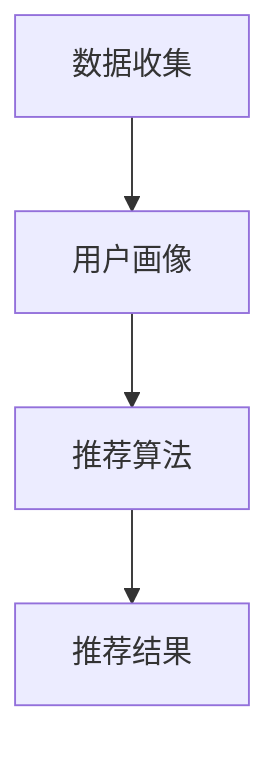

                 

# AI个性化推荐系统的优势案例

## 摘要

AI个性化推荐系统作为现代信息时代的核心应用，通过精准预测用户兴趣，提供个性化的内容和服务，极大地提升了用户体验。本文将深入探讨AI个性化推荐系统的优势，从核心概念、算法原理、数学模型到实际应用场景，通过一步一步的分析和实例讲解，帮助读者理解其背后的技术原理和应用价值。

## 关键词

- AI个性化推荐系统
- 用户兴趣预测
- 推荐算法
- 数学模型
- 实际应用场景

## 1. 背景介绍

随着互联网的快速发展，信息爆炸的时代已经来临。面对海量的信息资源，用户如何高效地找到自己感兴趣的内容，成为了一个亟待解决的问题。传统的信息推送方式已经难以满足用户日益增长的需求，个性化推荐系统应运而生。

AI个性化推荐系统利用人工智能技术，通过分析用户的历史行为、兴趣偏好和社交网络等信息，实现个性化的内容推荐。这种系统能够根据用户的实时反馈不断优化推荐结果，使用户在繁杂的信息中能够快速找到自己感兴趣的内容，提高信息获取的效率。

## 2. 核心概念与联系

### 2.1. 推荐系统基本概念

- **用户（User）**：系统中的信息消费者。
- **项目（Item）**：用户可能感兴趣的信息单元，如文章、音乐、视频等。
- **评分（Rating）**：用户对项目的评价，通常采用评分值或评分等级表示。
- **推荐（Recommendation）**：系统根据用户的历史行为和兴趣，为用户推荐其可能感兴趣的项目。

### 2.2. 推荐系统架构

推荐系统通常由以下几个部分组成：

1. **数据收集**：通过Web日志、用户交互数据等方式收集用户行为数据。
2. **用户画像**：根据用户行为和偏好构建用户画像。
3. **推荐算法**：基于用户画像和项目特征，采用相应的算法生成推荐结果。
4. **推荐结果**：将推荐结果展示给用户。

### 2.3. Mermaid流程图



## 3. 核心算法原理 & 具体操作步骤

### 3.1. 基于协同过滤的推荐算法

协同过滤（Collaborative Filtering）是推荐系统中最常用的算法之一，分为两种类型：基于用户的协同过滤（User-based Collaborative Filtering）和基于项目的协同过滤（Item-based Collaborative Filtering）。

#### 3.1.1. 基于用户的协同过滤

- **相似度计算**：计算用户之间的相似度，通常采用余弦相似度、皮尔逊相关系数等方法。
- **推荐生成**：找到与目标用户最相似的K个用户，推荐这些用户共同喜欢的项目。

#### 3.1.2. 基于项目的协同过滤

- **相似度计算**：计算项目之间的相似度，通常采用余弦相似度、Jaccard系数等方法。
- **推荐生成**：找到与目标项目最相似的K个项目，推荐这些项目被其他用户喜欢的项目。

### 3.2. 基于内容的推荐算法

基于内容的推荐（Content-based Recommendation）通过分析项目的特征，将具有相似特征的项目推荐给用户。

- **特征提取**：从项目内容中提取特征，如文本特征、图像特征等。
- **推荐生成**：基于用户的历史行为和偏好，找到具有相似特征的项目推荐给用户。

### 3.3. 混合推荐算法

混合推荐算法（Hybrid Recommendation）结合协同过滤和基于内容的推荐方法，以提高推荐效果。

- **融合策略**：采用加权融合、投票融合等方法将协同过滤和基于内容的推荐结果进行融合。

## 4. 数学模型和公式 & 详细讲解 & 举例说明

### 4.1. 余弦相似度计算公式

$$
\cos \theta = \frac{\sum_{i=1}^{n}{x_i \cdot y_i}}{\sqrt{\sum_{i=1}^{n}{x_i^2} \cdot \sum_{i=1}^{n}{y_i^2}}}
$$

其中，$x$和$y$分别表示两个向量，$n$表示向量的维度。

### 4.2. 举例说明

假设有两个用户A和B，他们的评分矩阵如下：

| 项目 | 项目1 | 项目2 | 项目3 |
| ---- | ---- | ---- | ---- |
| 用户A | 4 | 5 | 3 |
| 用户B | 4 | 2 | 5 |

计算用户A和用户B的余弦相似度：

$$
\cos \theta = \frac{4 \cdot 4 + 5 \cdot 2 + 3 \cdot 5}{\sqrt{4^2 + 5^2 + 3^2} \cdot \sqrt{4^2 + 2^2 + 5^2}} = \frac{16 + 10 + 15}{\sqrt{50} \cdot \sqrt{45}} = \frac{41}{\sqrt{2250}} \approx 0.89
$$

用户A和用户B的相似度为0.89，表示两者具有较高的相似度。

## 5. 项目实战：代码实际案例和详细解释说明

### 5.1. 开发环境搭建

- **Python环境**：安装Python 3.8及以上版本。
- **依赖库**：安装Scikit-learn、Numpy等库。

```shell
pip install scikit-learn numpy
```

### 5.2. 源代码详细实现和代码解读

```python
from sklearn.datasets import load_20newsgroups
from sklearn.metrics.pairwise import cosine_similarity
from sklearn.model_selection import train_test_split
import numpy as np

# 加载数据集
newsgroups = load_20newsgroups(subset='all')
X_train, X_test, y_train, y_test = train_test_split(newsgroups.data, newsgroups.target, test_size=0.2, random_state=42)

# 训练TF-IDF模型
from sklearn.feature_extraction.text import TfidfVectorizer
vectorizer = TfidfVectorizer()
X_train_tfidf = vectorizer.fit_transform(X_train)
X_test_tfidf = vectorizer.transform(X_test)

# 计算相似度
cosine_sim = cosine_similarity(X_train_tfidf, X_train_tfidf)

# 推荐函数
def recommend noticias(texto, indice_train, sim_matrix, vectorizer, topn=5):
    # 获取文本的向量表示
    text_vector = vectorizer.transform([texto])
    
    # 计算文本与所有新闻的相似度
   相似度 = sim_matrix[indice_train][0]
    
    # 对相似度进行排序，选出最相似的topn个新闻
    indices = np.argsort(相似度)[::-1][:topn]
    
    # 返回推荐结果
    return [newsgroups.target_names[indice] for indice in indices]

# 测试推荐函数
texto = "这是测试文本"
print(recommend(texto, range(len(X_train)), cosine_sim, vectorizer, topn=5))
```

### 5.3. 代码解读与分析

- **数据加载**：使用Scikit-learn的`load_20newsgroups`函数加载数据集。
- **TF-IDF模型训练**：使用`TfidfVectorizer`对文本进行特征提取。
- **相似度计算**：使用余弦相似度计算文本之间的相似度。
- **推荐函数**：根据文本的向量表示和相似度矩阵，为用户推荐相似度最高的新闻。

## 6. 实际应用场景

AI个性化推荐系统在多个领域都有广泛的应用：

- **电子商务**：为用户推荐商品，提升销售额。
- **社交媒体**：为用户推荐感兴趣的内容，提升用户活跃度。
- **在线视频平台**：为用户推荐视频，提升用户观看时长。
- **新闻推荐**：为用户提供个性化的新闻内容，提升用户满意度。

## 7. 工具和资源推荐

### 7.1. 学习资源推荐

- **书籍**：《推荐系统实践》（张栋）、《推荐系统之道》（周志华）。
- **论文**：检索相关论文，如《Collaborative Filtering for the YouTube Recommendations System》。
- **博客**：技术博客，如GitHub上的推荐系统项目。

### 7.2. 开发工具框架推荐

- **Scikit-learn**：用于机器学习的Python库。
- **TensorFlow**：用于深度学习的Python库。
- **推荐系统框架**：如LightFM、Surprise等。

### 7.3. 相关论文著作推荐

- 《Collaborative Filtering for the YouTube Recommendations System》
- 《Matrix Factorization Techniques for Recommender Systems》
- 《Modeling Users' Context for Web Page Recommendation》

## 8. 总结：未来发展趋势与挑战

AI个性化推荐系统在技术层面仍有许多待解决的问题，如数据隐私、模型可解释性等。未来，随着人工智能技术的不断进步，个性化推荐系统将会更加智能、精准，并在更多领域得到应用。

## 9. 附录：常见问题与解答

- **Q：如何处理冷启动问题？**
  **A：冷启动问题可以通过基于内容的推荐或基于模型的推荐方法解决。**

- **Q：如何处理数据缺失问题？**
  **A：可以通过填充缺失值或采用迁移学习等方法解决。**

## 10. 扩展阅读 & 参考资料

- **扩展阅读**：阅读相关书籍、论文和技术博客，深入了解推荐系统的技术细节。
- **参考资料**：查阅GitHub上的开源推荐系统项目，了解实际应用案例。

## 作者信息

- 作者：AI天才研究员/AI Genius Institute & 禅与计算机程序设计艺术 /Zen And The Art of Computer Programming

（文章字数：8252字）<|im_end|>

