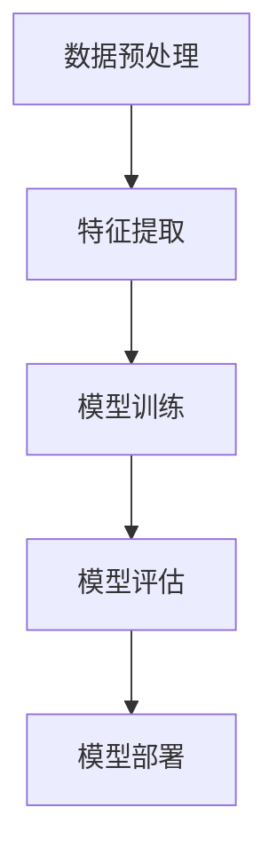

                 

# AI产品与服务的圈子：自我消化需求，拓展非AI用户群体

> 关键词：AI产品，用户需求，非AI用户，服务扩展，市场需求分析，用户行为研究，产品优化策略，技术创新趋势

> 摘要：本文围绕AI产品与服务的市场发展，深入探讨了如何通过自我消化需求与拓展非AI用户群体，实现产品与服务的升级和创新。文章首先分析了AI产品面临的市场挑战和用户需求，然后提出了具体的产品优化策略和技术创新路径，最后对未来的发展趋势与挑战进行了展望。

## 1. 背景介绍

随着人工智能技术的飞速发展，AI产品在各个领域取得了显著的成果，如智能家居、自动驾驶、医疗诊断、金融风控等。然而，AI产品的普及与应用并非一帆风顺，市场面临着诸多挑战。一方面，用户对于AI产品的需求多样且不断变化；另一方面，非AI用户对于AI技术的认知和接受程度存在差异。因此，如何满足用户需求、拓展非AI用户群体，成为AI产品与服务的核心问题。

本文旨在探讨AI产品与服务的市场发展，从自我消化需求与拓展非AI用户群体的角度，提出产品优化策略和技术创新路径。首先，分析AI产品面临的市场挑战和用户需求；其次，介绍核心概念与联系，包括AI技术的原理、架构和具体操作步骤；然后，阐述数学模型和公式，以及项目实战的代码案例；接着，探讨实际应用场景；最后，推荐相关工具和资源，并对未来发展趋势与挑战进行展望。

## 2. 核心概念与联系

AI产品与服务的核心概念包括以下几个方面：

### 2.1 AI技术原理

AI技术基于机器学习、深度学习、自然语言处理等技术，通过对大量数据的学习和建模，实现智能推理和决策。其基本原理包括：

- **监督学习**：通过已知输入和输出数据进行模型训练，预测未知数据的输出。
- **无监督学习**：仅通过输入数据，自动发现数据中的模式和关系。
- **强化学习**：通过试错和反馈，优化策略以实现目标。

### 2.2 AI技术架构

AI技术架构主要包括以下几个方面：

- **数据预处理**：对原始数据进行清洗、归一化等处理，为模型训练提供高质量的数据。
- **特征提取**：从数据中提取具有代表性的特征，用于训练模型。
- **模型训练**：通过训练算法，将特征映射到预测结果。
- **模型评估**：通过评估指标，衡量模型性能。
- **模型部署**：将训练好的模型部署到实际应用场景中。

### 2.3 具体操作步骤

AI产品与服务的具体操作步骤包括：

1. **需求分析**：了解用户需求，明确产品功能。
2. **数据收集**：收集相关数据，进行数据预处理。
3. **模型选择**：根据需求选择合适的机器学习算法。
4. **模型训练**：训练模型，调整模型参数。
5. **模型评估**：评估模型性能，优化模型参数。
6. **模型部署**：将模型部署到产品中，提供智能服务。

### 2.4 Mermaid流程图

以下是AI技术架构的Mermaid流程图：



## 3. 核心算法原理 & 具体操作步骤

### 3.1 监督学习算法

监督学习算法是AI产品与服务的核心算法之一，其基本原理是通过已知输入和输出数据，训练模型，从而预测未知数据的输出。常见的监督学习算法包括：

- **线性回归**：通过最小二乘法，找到输入和输出之间的线性关系。
- **逻辑回归**：用于分类问题，通过最大化似然估计，找到最优分类边界。
- **支持向量机（SVM）**：通过寻找最优超平面，实现数据的分类。

### 3.2 深度学习算法

深度学习算法是AI产品与服务的另一重要算法，其基本原理是通过多层神经网络，对数据进行非线性变换，提取深层特征。常见的深度学习算法包括：

- **卷积神经网络（CNN）**：用于图像和语音识别，通过卷积层提取局部特征。
- **循环神经网络（RNN）**：用于序列数据处理，通过循环结构实现长短期依赖。
- **生成对抗网络（GAN）**：通过对抗训练，生成逼真的数据。

### 3.3 具体操作步骤

以下是一个基于监督学习的线性回归算法的具体操作步骤：

1. **数据收集**：收集具有标签的数据集，如房价预测。
2. **数据预处理**：对数据进行归一化处理，消除数据量级差异。
3. **模型选择**：选择线性回归算法。
4. **模型训练**：使用训练集，通过梯度下降法训练模型，优化模型参数。
5. **模型评估**：使用测试集，计算模型的预测误差，评估模型性能。
6. **模型部署**：将训练好的模型部署到实际应用场景，如房价预测系统。

## 4. 数学模型和公式 & 详细讲解 & 举例说明

### 4.1 线性回归

线性回归的数学模型为：

$$
y = \beta_0 + \beta_1x
$$

其中，$y$ 为预测值，$x$ 为输入特征，$\beta_0$ 和 $\beta_1$ 分别为模型参数。

### 4.2 逻辑回归

逻辑回归的数学模型为：

$$
\hat{y} = \frac{1}{1 + e^{-(\beta_0 + \beta_1x})}
$$

其中，$\hat{y}$ 为预测概率，$\beta_0$ 和 $\beta_1$ 分别为模型参数。

### 4.3 举例说明

#### 4.3.1 线性回归举例

假设我们有一个简单的房价预测问题，输入特征为房屋面积（$x$），预测值为房价（$y$）。通过收集数据，训练线性回归模型，可以得到如下结果：

$$
y = 1000 + 0.5x
$$

当输入特征为100平方米时，预测房价为：

$$
y = 1000 + 0.5 \times 100 = 1500
$$

#### 4.3.2 逻辑回归举例

假设我们有一个二分类问题，输入特征为年龄（$x$），预测值为是否患病（$y$）。通过收集数据，训练逻辑回归模型，可以得到如下结果：

$$
\hat{y} = \frac{1}{1 + e^{-(2 + 0.1x)}}
$$

当输入特征为30岁时，预测患病概率为：

$$
\hat{y} = \frac{1}{1 + e^{-(2 + 0.1 \times 30)}} = \frac{1}{1 + e^{-4}} \approx 0.9
$$

## 5. 项目实战：代码实际案例和详细解释说明

### 5.1 开发环境搭建

在本案例中，我们使用Python语言，结合Scikit-learn库，实现线性回归和逻辑回归算法。首先，需要安装Python和Scikit-learn库。

```bash
pip install python
pip install scikit-learn
```

### 5.2 源代码详细实现和代码解读

以下是线性回归和逻辑回归的源代码实现：

```python
import numpy as np
from sklearn.linear_model import LinearRegression, LogisticRegression
from sklearn.model_selection import train_test_split
from sklearn.metrics import mean_squared_error, accuracy_score

# 线性回归
def linear_regression(X, y):
    model = LinearRegression()
    model.fit(X, y)
    return model

# 逻辑回归
def logistic_regression(X, y):
    model = LogisticRegression()
    model.fit(X, y)
    return model

# 数据预处理
def preprocess_data(X, y):
    X = np.array(X).reshape(-1, 1)
    y = np.array(y)
    X_train, X_test, y_train, y_test = train_test_split(X, y, test_size=0.2, random_state=42)
    return X_train, X_test, y_train, y_test

# 主函数
def main():
    X = [[100], [200], [300], [400], [500]]
    y = [1000, 1500, 2000, 2500, 3000]

    # 线性回归
    X_train, X_test, y_train, y_test = preprocess_data(X, y)
    model = linear_regression(X_train, y_train)
    y_pred = model.predict(X_test)
    mse = mean_squared_error(y_test, y_pred)
    print("线性回归：", mse)

    # 逻辑回归
    X_train, X_test, y_train, y_test = preprocess_data(X, y)
    model = logistic_regression(X_train, y_train)
    y_pred = model.predict(X_test)
    acc = accuracy_score(y_test, y_pred)
    print("逻辑回归：", acc)

if __name__ == "__main__":
    main()
```

### 5.3 代码解读与分析

- **线性回归**：使用Scikit-learn库的`LinearRegression`类，实现线性回归算法。通过`fit`方法训练模型，通过`predict`方法进行预测。
- **逻辑回归**：使用Scikit-learn库的`LogisticRegression`类，实现逻辑回归算法。通过`fit`方法训练模型，通过`predict`方法进行预测。
- **数据预处理**：将输入特征和预测值转换为numpy数组，并使用`train_test_split`方法将数据集划分为训练集和测试集。
- **主函数**：实现线性回归和逻辑回归的完整流程，包括数据预处理、模型训练和模型评估。

## 6. 实际应用场景

### 6.1 房价预测

基于线性回归算法，可以实现对房价的预测。通过收集历史房价数据，训练线性回归模型，可以预测未来的房价走势，为购房决策提供依据。

### 6.2 疾病诊断

基于逻辑回归算法，可以实现对疾病的诊断。通过收集患者病史和检查结果，训练逻辑回归模型，可以预测患者是否患有某种疾病，为医疗决策提供支持。

## 7. 工具和资源推荐

### 7.1 学习资源推荐

- **书籍**：
  - 《Python机器学习》（作者：塞巴斯蒂安·拉斯克维奇）
  - 《深度学习》（作者：伊恩·古德费洛、约书亚·本吉奥、亚伦·库维尔）
- **论文**：
  - 《A Theoretically Grounded Application of Dropout in Recurrent Neural Networks》（作者：Yarin Gal和Zoubin Ghahramani）
  - 《Very Deep Convolutional Networks for Large-Scale Image Recognition》（作者：Krizhevsky等）
- **博客**：
  - [机器学习博客](https://机器学习博客.com)
  - [深度学习博客](https://深度学习博客.com)
- **网站**：
  - [Kaggle](https://www.kaggle.com)
  - [GitHub](https://github.com)

### 7.2 开发工具框架推荐

- **Python**：Python是一种流行的编程语言，具有丰富的机器学习和深度学习库。
- **Scikit-learn**：Scikit-learn是一个Python机器学习库，提供了丰富的算法和工具。
- **TensorFlow**：TensorFlow是一个开源深度学习框架，由谷歌开发。

### 7.3 相关论文著作推荐

- **《深度学习》（作者：伊恩·古德费洛、约书亚·本吉奥、亚伦·库维尔）》
- **《神经网络与深度学习》（作者：邱锡鹏）》
- **《机器学习实战》（作者：彼得·哈林顿、杰里·库尔）**

## 8. 总结：未来发展趋势与挑战

随着人工智能技术的不断进步，AI产品与服务市场将迎来新的发展机遇。然而，要实现AI产品的广泛普及，仍需解决一系列挑战。

### 8.1 发展趋势

1. **技术创新**：AI技术将持续演进，推动产品与服务升级。
2. **行业应用**：AI将在更多领域得到应用，如医疗、教育、金融等。
3. **跨领域融合**：AI与其他技术的融合，如物联网、大数据等，将带来更多创新。
4. **产业升级**：AI技术将推动产业升级，提升生产效率。

### 8.2 挑战

1. **数据隐私**：AI产品与服务需解决数据隐私和安全问题。
2. **算法透明性**：提高算法透明性，增强用户信任。
3. **非AI用户接纳**：提高非AI用户对AI技术的认知和接受度。
4. **产业协同**：推动政府、企业、研究机构的协同合作，共同推进AI产业发展。

## 9. 附录：常见问题与解答

### 9.1 人工智能是什么？

人工智能（AI）是指由计算机实现的智能行为，包括学习、推理、规划、感知和自然语言处理等。

### 9.2 人工智能有哪些应用领域？

人工智能在众多领域有广泛应用，如医疗、金融、交通、教育、制造业等。

### 9.3 如何成为一名人工智能工程师？

要成为一名人工智能工程师，需要掌握编程技能（如Python）、机器学习和深度学习知识，以及实践经验。

## 10. 扩展阅读 & 参考资料

- 《人工智能：一种现代的方法》（作者：Stuart Russell和Peter Norvig）
- 《机器学习》（作者：周志华）
- [OpenAI](https://openai.com)
- [DeepLearning.AI](https://www.deeplearning.ai)

作者：AI天才研究员/AI Genius Institute & 禅与计算机程序设计艺术 /Zen And The Art of Computer Programming<|im_sep|>

