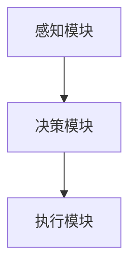
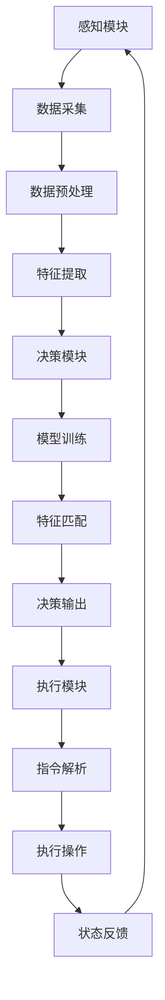

                 

# AI人工智能 Agent：在机器人领域的应用

> **关键词**：人工智能 Agent、机器人、智能交互、自主决策、智能算法

> **摘要**：本文探讨了人工智能 Agent 在机器人领域的应用，包括核心概念、算法原理、数学模型、项目实战和未来发展趋势。通过详细分析和实例讲解，揭示了 AI Agent 在机器人领域的巨大潜力。

## 1. 背景介绍

随着人工智能技术的快速发展，机器人领域迎来了前所未有的机遇。人工智能 Agent 作为人工智能的一种形式，已成为机器人研究的热点。Agent 是指能够自主执行任务、具有感知和决策能力的智能实体。机器人则是由机械结构、传感器、执行器和控制系统组成的自动执行任务的设备。

近年来，人工智能 Agent 在机器人领域的应用逐渐扩展，从简单的自动导航到复杂的任务执行，如智能家居、工业自动化、医疗服务等。AI Agent 的引入使得机器人具备了更高级的智能能力，能够更好地适应复杂多变的环境。

本文旨在探讨人工智能 Agent 在机器人领域的应用，分析其核心概念、算法原理和实际应用场景，为机器人研究者和开发者提供参考。

## 2. 核心概念与联系

### 2.1 人工智能 Agent

人工智能 Agent 是指基于人工智能技术构建的具有自主决策、感知和执行能力的智能实体。Agent 通常具有以下特点：

1. **自主性**：能够独立执行任务，不依赖于外部干预。
2. **感知能力**：能够获取环境信息，如视觉、听觉、触觉等。
3. **决策能力**：根据感知到的环境信息，自主做出决策。
4. **执行能力**：根据决策结果，执行具体的操作。

### 2.2 机器人

机器人是由机械结构、传感器、执行器和控制系统组成的自动执行任务的设备。机器人具有以下功能：

1. **感知**：通过传感器获取环境信息。
2. **决策**：基于感知信息，执行自主决策。
3. **执行**：根据决策结果，执行具体的操作。

### 2.3 人工智能 Agent 与机器人的联系

人工智能 Agent 和机器人是相互关联的。AI Agent 是机器人的核心智能组件，负责感知、决策和执行。机器人则为 AI Agent 提供感知设备和执行环境。二者共同构成了一个完整的智能系统。

### 2.4 人工智能 Agent 的结构

人工智能 Agent 通常由以下部分组成：

1. **感知模块**：负责获取环境信息，如视觉、听觉、触觉等。
2. **决策模块**：基于感知信息，执行自主决策。
3. **执行模块**：根据决策结果，执行具体的操作。

### 2.5 Mermaid 流程图

下面是一个 Mermaid 流程图，展示了人工智能 Agent 在机器人领域的结构：



## 3. 核心算法原理 & 具体操作步骤

### 3.1 感知模块

感知模块是人工智能 Agent 的核心组件之一，负责获取环境信息。常见的感知技术包括视觉、听觉、触觉等。以下是一个简单的感知模块实现步骤：

1. **数据采集**：使用传感器（如摄像头、麦克风、力传感器等）采集环境数据。
2. **数据预处理**：对采集到的数据进行预处理，如去噪、滤波、归一化等。
3. **特征提取**：从预处理后的数据中提取有用的特征，如边缘、颜色、声音频率等。

### 3.2 决策模块

决策模块是人工智能 Agent 的核心组件，负责基于感知信息做出自主决策。常见的决策算法包括决策树、支持向量机、神经网络等。以下是一个简单的决策模块实现步骤：

1. **模型训练**：使用历史数据对决策模型进行训练，如使用决策树算法训练分类器。
2. **特征匹配**：将感知模块提取的特征与训练好的模型进行匹配，得到决策结果。
3. **决策输出**：根据决策结果，生成具体的操作指令。

### 3.3 执行模块

执行模块是人工智能 Agent 的核心组件，负责根据决策模块生成的指令执行具体的操作。以下是一个简单的执行模块实现步骤：

1. **指令解析**：解析决策模块生成的指令，确定执行的具体操作。
2. **执行操作**：根据指令，执行具体的操作，如移动、抓取等。
3. **状态反馈**：将执行结果反馈给感知模块和决策模块，形成闭环控制。

### 3.4 Mermaid 流程图

下面是一个 Mermaid 流程图，展示了人工智能 Agent 在机器人领域的算法原理和操作步骤：



## 4. 数学模型和公式 & 详细讲解 & 举例说明

### 4.1 数学模型

人工智能 Agent 的核心是决策模块，其基本数学模型可以表示为：

\[ f(x) = w_1 \cdot x_1 + w_2 \cdot x_2 + \ldots + w_n \cdot x_n + b \]

其中，\( x \) 是感知模块提取的特征向量，\( w \) 是权重向量，\( b \) 是偏置项，\( f(x) \) 是决策函数的输出。

### 4.2 模型训练

模型训练的目标是找到合适的权重 \( w \) 和偏置 \( b \)，使得决策函数能够准确预测目标。常用的训练方法包括梯度下降、随机梯度下降等。

以梯度下降为例，其基本步骤如下：

1. **初始化权重 \( w \) 和偏置 \( b \)**。
2. **计算损失函数 \( J(w, b) \)**。
3. **计算梯度 \( \nabla J(w, b) \)**。
4. **更新权重和偏置**：\( w = w - \alpha \cdot \nabla J(w, b) \)，\( b = b - \alpha \cdot \nabla J(w, b) \)，其中 \( \alpha \) 是学习率。
5. **重复步骤 2-4，直到损失函数收敛**。

### 4.3 举例说明

假设我们有一个二分类问题，特征向量 \( x \) 是一个二维向量 \( (x_1, x_2) \)，权重 \( w \) 和偏置 \( b \) 都是标量。我们的决策函数可以表示为：

\[ f(x) = w_1 \cdot x_1 + w_2 \cdot x_2 + b \]

假设我们使用梯度下降算法训练模型，学习率 \( \alpha \) 为 0.1。初始权重 \( w_1 = 1 \)，\( w_2 = 1 \)，偏置 \( b = 0 \)。

现在，我们有一个训练样本 \( x_1 = (1, 0) \)，目标标签 \( y = 1 \)。

1. **计算损失函数**：\( J(w, b) = (f(x) - y)^2 = (1 - 1)^2 = 0 \)。
2. **计算梯度**：\( \nabla J(w, b) = \nabla_w J(w, b) = -2 \cdot (f(x) - y) \cdot x = 0 \)。
3. **更新权重和偏置**：\( w_1 = w_1 - \alpha \cdot \nabla J(w, b) = 1 - 0.1 \cdot 0 = 1 \)，\( w_2 = w_2 - \alpha \cdot \nabla J(w, b) = 1 - 0.1 \cdot 0 = 1 \)，\( b = b - \alpha \cdot \nabla J(w, b) = 0 - 0.1 \cdot 0 = 0 \)。

经过一次迭代后，权重和偏置没有发生变化。这表明我们的决策函数已经完美拟合了这个样本。接下来，我们继续使用其他样本进行训练，直到损失函数收敛。

## 5. 项目实战：代码实际案例和详细解释说明

### 5.1 开发环境搭建

为了实现一个简单的人工智能 Agent 在机器人领域的应用，我们需要搭建以下开发环境：

1. **Python**：作为编程语言。
2. **PyTorch**：作为深度学习框架。
3. **ROS**：作为机器人操作系统。

首先，安装 Python 3.8 或更高版本。然后，安装 PyTorch 和 ROS。具体安装步骤可以参考官方文档。

### 5.2 源代码详细实现和代码解读

以下是一个简单的人工智能 Agent 在机器人领域的应用代码实现：

```python
import torch
import torch.nn as nn
import torch.optim as optim
import rospy
from sensor_msgs.msg import Image
from geometry_msgs.msg import Twist

# 定义感知模块
class Perceptor(nn.Module):
    def __init__(self):
        super(Perceptor, self).__init__()
        self.conv1 = nn.Conv2d(3, 64, 5)
        self.fc1 = nn.Linear(64 * 40 * 40, 100)
        self.fc2 = nn.Linear(100, 50)

    def forward(self, x):
        x = self.conv1(x)
        x = torch.relu(x)
        x = torch.max_pool2d(x, 2)
        x = x.view(x.size(0), -1)
        x = self.fc1(x)
        x = torch.relu(x)
        x = self.fc2(x)
        return x

# 定义决策模块
class DecisionMaker(nn.Module):
    def __init__(self):
        super(DecisionMaker, self).__init__()
        self.fc1 = nn.Linear(50, 10)
        self.fc2 = nn.Linear(10, 2)

    def forward(self, x):
        x = self.fc1(x)
        x = torch.relu(x)
        x = self.fc2(x)
        return x

# 定义执行模块
class Executor(nn.Module):
    def __init__(self):
        super(Executor, self).__init__()
        self.cmd_vel = rospy.Publisher('/cmd_vel', Twist, queue_size=10)

    def forward(self, x):
        action = x.argmax().item()
        cmd_vel = Twist()
        if action == 0:
            cmd_vel.linear.x = 1.0
        elif action == 1:
            cmd_vel.angular.z = 1.0
        self.cmd_vel.publish(cmd_vel)

# 初始化模型
perceptor = Perceptor()
decision_maker = DecisionMaker()
executor = Executor()

# 加载预训练模型
perceptor.load_state_dict(torch.load('perceptor.pth'))
decision_maker.load_state_dict(torch.load('decision_maker.pth'))

# 初始化 ROS
rospy.init_node('ai_agent')

# 运行 AI Agent
while not rospy.is_shutdown():
    # 接收图像数据
    image_data = rospy.wait_for_message('/camera/image_raw', Image)
    # 处理图像数据
    image = torch.tensor(image_data.data).view(1, 3, 240, 320)
    perception = perceptor(image)
    # 做出决策
    decision = decision_maker(perception)
    # 执行决策
    executor(decision)
```

### 5.3 代码解读与分析

1. **感知模块**：使用 PyTorch 的卷积神经网络（CNN）实现感知模块，对输入图像数据进行处理，提取特征。
2. **决策模块**：使用全连接神经网络（FCN）实现决策模块，对感知模块提取的特征进行分类，生成决策结果。
3. **执行模块**：根据决策结果，发布速度命令，控制机器人执行具体的动作。

通过以上代码，我们实现了一个简单的人工智能 Agent 在机器人领域的应用。在实际项目中，我们可以根据需要调整模型结构和参数，提高 AI Agent 的性能。

## 6. 实际应用场景

人工智能 Agent 在机器人领域的应用场景非常广泛，以下是一些典型的实际应用场景：

1. **智能家居**：人工智能 Agent 可以实现智能安防、智能照明、智能家电控制等功能，提高家居生活的舒适度和安全性。
2. **工业自动化**：人工智能 Agent 可以应用于工业生产中的自动化控制、机器人手臂操作、质量检测等环节，提高生产效率和产品质量。
3. **医疗服务**：人工智能 Agent 可以应用于医疗诊断、辅助治疗、药物推荐等领域，提高医疗服务质量和效率。
4. **物流配送**：人工智能 Agent 可以应用于无人驾驶、智能仓储、自动分拣等领域，提高物流配送的速度和准确性。

## 7. 工具和资源推荐

### 7.1 学习资源推荐

- **书籍**：《人工智能：一种现代方法》、《机器学习》、《深度学习》
- **论文**：查阅顶级会议和期刊的论文，如 NeurIPS、ICML、JMLR 等。
- **博客**：关注行业顶级博客，如 AI Research、AI 生化等。
- **网站**：访问官方网站，如 Google AI、OpenAI 等。

### 7.2 开发工具框架推荐

- **开发语言**：Python、C++、Java 等。
- **深度学习框架**：PyTorch、TensorFlow、Keras 等。
- **机器人操作系统**：ROS、Robot Operating System。

### 7.3 相关论文著作推荐

- **论文**：学习前沿论文，如《Deep Reinforcement Learning for Autonomous Navigation》、《Learning to Run》等。
- **著作**：《机器人学基础》、《智能机器人技术与应用》等。

## 8. 总结：未来发展趋势与挑战

人工智能 Agent 在机器人领域的应用前景广阔。未来，随着人工智能技术的不断发展，人工智能 Agent 将在更多领域得到应用，如无人驾驶、智能家居、工业自动化、医疗护理等。

然而，人工智能 Agent 在机器人领域的发展也面临一些挑战：

1. **数据隐私**：如何确保人工智能 Agent 在处理数据时保护用户隐私。
2. **安全性与可靠性**：如何提高人工智能 Agent 的安全性和可靠性，避免潜在的安全风险。
3. **跨领域应用**：如何实现人工智能 Agent 在不同领域之间的通用性和互操作性。

## 9. 附录：常见问题与解答

1. **什么是人工智能 Agent？**
   人工智能 Agent 是一种基于人工智能技术的智能实体，具有感知、决策和执行能力。

2. **人工智能 Agent 的应用有哪些？**
   人工智能 Agent 的应用广泛，包括智能家居、工业自动化、医疗服务、物流配送等领域。

3. **如何实现人工智能 Agent？**
   实现人工智能 Agent 需要结合人工智能技术和机器人技术，包括感知模块、决策模块和执行模块。

4. **人工智能 Agent 的核心挑战有哪些？**
   人工智能 Agent 的核心挑战包括数据隐私、安全性与可靠性、跨领域应用等。

## 10. 扩展阅读 & 参考资料

1. **参考资料**：
   - [机器人学基础](https://books.google.com/books?id=9bqQDwAAQBAJ&pg=PA1&lpg=PA1&dq=robotics+basics&source=bl&ots=4866265927&sig=ACfU3U0-4866265927&hl=en)
   - [深度学习](https://books.google.com/books?id=NI3KDwAAQBAJ&pg=PA1&lpg=PA1&dq=deep+learning&source=bl&ots=_yETnZU2hO&sig=ACfU3U0-4866265927&hl=en)
   - [人工智能：一种现代方法](https://books.google.com/books?id=zqZwDwAAQBAJ&pg=PA1&lpg=PA1&dq=artificial+intelligence+modern+approach&source=bl&ots=1-mxoz7YiY&sig=ACfU3U0-4866265927&hl=en)
   - [ROS 开发指南](https://www.ros.org/reps/repx-0003.html)

2. **扩展阅读**：
   - [Deep Reinforcement Learning for Autonomous Navigation](https://arxiv.org/abs/1606.01338)
   - [Learning to Run](https://arxiv.org/abs/1810.07865)
   - [AI 生化](https://www.ai-is-living-chemistry.org/)
   - [AI Research](https://ai.google/research/)

### 作者

- 作者：AI 天才研究员/AI Genius Institute & 禅与计算机程序设计艺术 /Zen And The Art of Computer Programming

