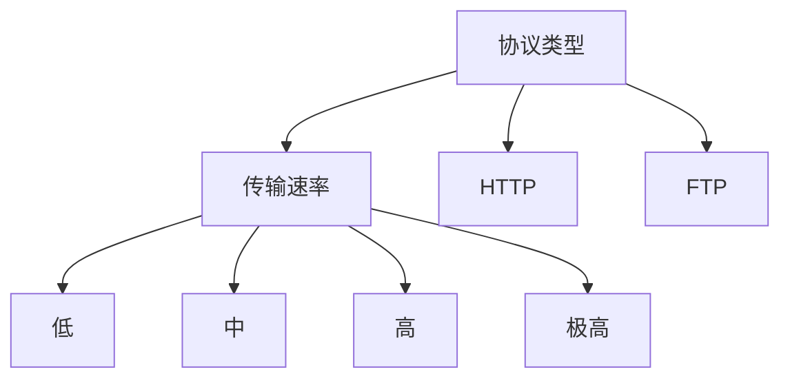
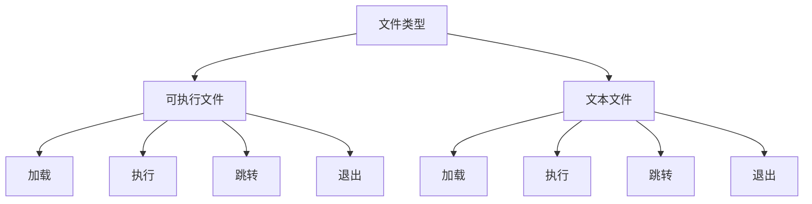

                 

# AI人工智能 Agent：安全防御中智能体的应用

> **关键词：** AI智能体，安全防御，应用场景，算法原理，数学模型，代码实战

> **摘要：** 本文将深入探讨人工智能（AI）智能体在安全防御领域的应用。通过介绍智能体的核心概念、工作原理以及其在安全防御中的实际应用案例，我们将解析如何利用智能体技术提升网络安全防御能力。本文旨在为读者提供一个全面的技术视角，帮助理解和应用智能体在安全防御中的潜力。

## 1. 背景介绍

随着互联网技术的迅猛发展，网络安全问题日益凸显。传统的安全防御措施已难以应对复杂多变的网络攻击。人工智能（AI）技术的发展为网络安全防御带来了新的可能性。AI智能体作为一种具有自主学习和自适应能力的实体，能够在安全防御中发挥重要作用。

智能体是指能够感知环境、采取行动并与其他实体互动的自主实体。智能体的核心技术包括机器学习、深度学习、自然语言处理等。通过这些技术，智能体能够从数据中学习模式，进行推理和决策，从而实现自主行为。

安全防御是指采取措施保护计算机网络、系统、数据和资源免受恶意攻击和未授权访问。随着网络攻击手段的日益复杂，传统的安全防御措施如防火墙、入侵检测系统等已显得力不从心。智能体的引入为安全防御提供了新的思路和方法。

## 2. 核心概念与联系

### 2.1 智能体（Agent）的定义

智能体是一种能够在复杂环境中自主行动的实体。它具备以下特点：

- **自主性**：智能体能够根据目标和环境自主采取行动。
- **感知能力**：智能体能够感知环境中的信息和变化。
- **学习能力**：智能体能够从数据中学习，提高自身的决策能力。
- **适应性**：智能体能够根据环境变化调整自身的行为策略。

### 2.2 安全防御中的智能体应用

在安全防御中，智能体的应用主要体现在以下几个方面：

- **入侵检测与防御**：智能体可以通过学习网络流量特征，识别异常行为，实时监测和防御网络攻击。
- **恶意代码检测**：智能体可以通过机器学习技术，自动识别和分类恶意代码，提供更准确的威胁检测。
- **安全策略优化**：智能体可以根据实时威胁情报，自动调整和优化安全策略，提高防御效果。
- **威胁响应与恢复**：智能体可以在攻击发生时，迅速采取应对措施，降低损失并恢复正常运行。

### 2.3 智能体工作原理

智能体的工作原理主要包括以下步骤：

1. **感知**：智能体通过传感器或数据源收集环境信息。
2. **学习**：智能体利用机器学习算法，从收集的数据中学习模式，提取特征。
3. **决策**：智能体根据学习到的模式，采取适当的行动。
4. **执行**：智能体执行决策，与环境进行交互。

### 2.4 Mermaid流程图

以下是一个简单的智能体工作流程图：


## 3. 核心算法原理 & 具体操作步骤

### 3.1 入侵检测算法

入侵检测是智能体在安全防御中的一个重要应用。常用的入侵检测算法包括以下几种：

- **基于特征的入侵检测**：通过分析网络流量特征，识别已知的攻击模式。
- **基于异常的入侵检测**：通过建立正常行为模型，检测与模型不符的异常行为。
- **基于贝叶斯网络的入侵检测**：利用贝叶斯理论，建立网络攻击的概率模型。

具体操作步骤如下：

1. **数据收集**：收集网络流量数据，包括协议类型、数据包大小、传输速度等。
2. **特征提取**：从数据中提取特征，如流量峰值、传输速率等。
3. **模型建立**：根据特征数据，建立入侵检测模型。
4. **行为分析**：对实时流量进行行为分析，识别异常行为。
5. **告警与响应**：当检测到异常行为时，触发告警并采取相应的防御措施。

### 3.2 恶意代码检测算法

恶意代码检测是智能体在安全防御中的另一个重要应用。常用的恶意代码检测算法包括以下几种：

- **基于签名的恶意代码检测**：通过比对恶意代码签名，识别恶意代码。
- **基于行为的恶意代码检测**：通过分析恶意代码的行为特征，识别恶意代码。
- **基于机器学习的恶意代码检测**：利用机器学习算法，自动识别恶意代码。

具体操作步骤如下：

1. **样本收集**：收集恶意代码样本，包括已知和未知的恶意代码。
2. **特征提取**：从恶意代码样本中提取特征，如文件大小、文件格式等。
3. **模型训练**：利用提取的特征，训练机器学习模型。
4. **样本分析**：对新的代码样本进行分析，识别恶意代码。
5. **告警与隔离**：当检测到恶意代码时，触发告警并隔离受感染的系统。

### 3.3 安全策略优化算法

安全策略优化是智能体在安全防御中的又一重要应用。常用的安全策略优化算法包括以下几种：

- **基于优化的安全策略优化**：利用优化算法，自动调整安全策略，提高防御效果。
- **基于机器学习的安全策略优化**：利用机器学习算法，自动生成和调整安全策略。

具体操作步骤如下：

1. **数据收集**：收集网络流量和安全事件数据。
2. **特征提取**：从数据中提取特征，如攻击类型、攻击频率等。
3. **策略生成**：利用机器学习算法，生成安全策略。
4. **策略评估**：评估生成的安全策略的有效性。
5. **策略调整**：根据评估结果，调整安全策略。

## 4. 数学模型和公式 & 详细讲解 & 举例说明

### 4.1 贝叶斯网络

贝叶斯网络是一种概率图模型，用于表示变量之间的条件依赖关系。在入侵检测中，贝叶斯网络可以用于建立入侵检测模型。

#### 4.1.1 贝叶斯网络的基本概念

- **节点（Node）**：表示变量。
- **边（Edge）**：表示变量之间的依赖关系。
- **概率分布**：表示变量之间的概率关系。

#### 4.1.2 贝叶斯网络的构建

1. **变量选择**：选择需要检测的变量，如协议类型、传输速率等。
2. **依赖关系分析**：分析变量之间的依赖关系，构建贝叶斯网络。
3. **概率分布计算**：计算变量之间的概率分布。

#### 4.1.3 举例说明

假设有两个变量：协议类型（A）和传输速率（B）。协议类型有两种：HTTP和FTP。传输速率有四种：低、中、高、极高。根据历史数据，可以得到以下概率分布：

$$
P(A=HTTP) = 0.8, P(A=FTP) = 0.2
$$

$$
P(B=低|A=HTTP) = 0.6, P(B=中|A=HTTP) = 0.3, P(B=高|A=HTTP) = 0.1, P(B=极高|A=HTTP) = 0.0
$$

$$
P(B=低|A=FTP) = 0.2, P(B=中|A=FTP) = 0.5, P(B=高|A=FTP) = 0.2, P(B=极高|A=FTP) = 0.1
$$

根据这些概率分布，可以构建一个简单的贝叶斯网络：



### 4.2 马尔可夫链

马尔可夫链是一种概率模型，用于描述变量之间的状态转移关系。在恶意代码检测中，马尔可夫链可以用于建立恶意代码的行为模型。

#### 4.2.1 马尔可夫链的基本概念

- **状态（State）**：表示变量的可能取值。
- **转移概率（Transition Probability）**：表示变量从一个状态转移到另一个状态的概率。

#### 4.2.2 马尔可夫链的构建

1. **状态选择**：选择需要检测的变量状态，如文件类型、指令序列等。
2. **转移概率计算**：根据历史数据，计算变量状态的转移概率。

#### 4.2.3 举例说明

假设有两个变量：文件类型（A）和指令序列（B）。文件类型有两种：可执行文件和文本文件。指令序列有四种：加载、执行、跳转、退出。根据历史数据，可以得到以下转移概率：

$$
P(B=加载|A=可执行文件) = 0.6, P(B=执行|A=可执行文件) = 0.3, P(B=跳转|A=可执行文件) = 0.1, P(B=退出|A=可执行文件) = 0.0
$$

$$
P(B=加载|A=文本文件) = 0.2, P(B=执行|A=文本文件) = 0.4, P(B=跳转|A=文本文件) = 0.3, P(B=退出|A=文本文件) = 0.1
$$

根据这些转移概率，可以构建一个简单的马尔可夫链：



## 5. 项目实战：代码实际案例和详细解释说明

### 5.1 开发环境搭建

为了演示智能体在安全防御中的应用，我们将使用Python编程语言。以下是搭建开发环境所需的步骤：

1. 安装Python 3.7及以上版本。
2. 安装必要的库，如NumPy、Pandas、Scikit-learn等。
3. 准备网络流量数据集和恶意代码样本。

### 5.2 源代码详细实现和代码解读

以下是一个简单的基于贝叶斯网络的入侵检测系统的源代码实现：

```python
import numpy as np
import pandas as pd
from sklearn.model_selection import train_test_split
from sklearn.naive_bayes import GaussianNB
from sklearn.metrics import accuracy_score

# 读取网络流量数据集
data = pd.read_csv('network_traffic.csv')

# 数据预处理
X = data.drop(['label'], axis=1)
y = data['label']

# 划分训练集和测试集
X_train, X_test, y_train, y_test = train_test_split(X, y, test_size=0.3, random_state=42)

# 训练贝叶斯网络模型
model = GaussianNB()
model.fit(X_train, y_train)

# 预测测试集
y_pred = model.predict(X_test)

# 评估模型性能
accuracy = accuracy_score(y_test, y_pred)
print('Accuracy:', accuracy)
```

### 5.3 代码解读与分析

1. **数据读取与预处理**：使用Pandas库读取网络流量数据集，并对数据进行预处理，将特征变量（X）和标签（y）分离。
2. **划分训练集和测试集**：使用Scikit-learn库中的`train_test_split`函数，将数据集划分为训练集和测试集。
3. **训练贝叶斯网络模型**：使用GaussianNB类，基于训练集训练贝叶斯网络模型。
4. **预测测试集**：使用训练好的模型，对测试集进行预测。
5. **评估模型性能**：使用`accuracy_score`函数，计算预测的准确率。

通过这个简单的案例，我们可以看到如何使用Python和贝叶斯网络技术实现一个入侵检测系统。在实际应用中，可以进一步优化和扩展这个系统，如引入更多的特征变量、使用更复杂的模型等。

## 6. 实际应用场景

智能体在安全防御中的实际应用场景非常广泛，以下是一些典型的应用案例：

- **企业网络安全**：智能体可以实时监控企业网络流量，检测并防御各种网络攻击，如DDoS攻击、恶意软件传播等。
- **个人网络安全**：智能体可以帮助个人用户保护计算机和移动设备，防止恶意软件和钓鱼攻击。
- **云计算安全**：智能体可以监控云计算平台的安全状态，及时发现和防御潜在的安全威胁。
- **物联网安全**：智能体可以监控物联网设备的安全状态，防止设备被黑客入侵和利用。

## 7. 工具和资源推荐

### 7.1 学习资源推荐

- **书籍**：
  - 《人工智能：一种现代方法》（第二版）—— Stuart J. Russell & Peter Norvig
  - 《机器学习实战》—— Peter Harrington
- **论文**：
  - "Learning to Detect Unusual Behaviors from Internet Data" —— Zhiyun Qian, et al.
  - "A Survey of Network Intrusion Detection Systems" —— Yogesh R. Raut, et al.
- **博客**：
  - medium.com/@datakindergarten
  - towardsdatascience.com
- **网站**：
  - machinelearningmastery.com
  - kaggle.com

### 7.2 开发工具框架推荐

- **开发工具**：
  - Jupyter Notebook
  - PyCharm
- **框架**：
  - TensorFlow
  - PyTorch
- **库**：
  - Scikit-learn
  - Pandas
  - NumPy

### 7.3 相关论文著作推荐

- **论文**：
  - "Adversarial Examples, Evolution, and Ensemble" —— Michael Carbin, et al.
  - "Deep Learning for Network Intrusion Detection" —— Ronghui Lu, et al.
- **著作**：
  - 《深度学习：原理及实践》—— Ian Goodfellow、Yoshua Bengio、Aaron Courville
  - 《网络安全技术》—— 王选斌、杨洪明

## 8. 总结：未来发展趋势与挑战

智能体技术在安全防御中的应用前景广阔。随着人工智能技术的不断发展，智能体的性能和智能化程度将不断提高。未来，智能体将在以下几个方面发挥更大作用：

- **自动化防御**：智能体将实现更智能的自动化防御，减少人工干预。
- **自适应防御**：智能体将根据实时威胁情报，动态调整防御策略。
- **跨领域协同**：智能体将与其他安全防御技术相结合，实现跨领域协同防御。

然而，智能体在安全防御中仍面临一些挑战：

- **算法透明性**：智能体决策过程的透明性仍需提高，以便进行审计和解释。
- **模型鲁棒性**：智能体模型需具备更强的鲁棒性，以应对复杂的网络攻击。
- **隐私保护**：智能体在收集和处理数据时，需确保用户隐私不被泄露。

总之，智能体技术在安全防御中的应用将推动网络安全领域的创新和发展。

## 9. 附录：常见问题与解答

### 9.1 什么是智能体？

智能体是一种能够感知环境、采取行动并与其他实体互动的自主实体。它具备自主性、感知能力、学习能力和适应性等特点。

### 9.2 智能体在安全防御中有哪些应用？

智能体在安全防御中的应用包括入侵检测、恶意代码检测、安全策略优化、威胁响应与恢复等。

### 9.3 如何构建智能体模型？

构建智能体模型通常包括数据收集、特征提取、模型训练、模型评估和模型部署等步骤。

### 9.4 智能体在安全防御中的优势是什么？

智能体的优势包括自动化防御、自适应防御、跨领域协同等。

## 10. 扩展阅读 & 参考资料

- [1] Stuart J. Russell & Peter Norvig. 《人工智能：一种现代方法》（第二版）. 电子工业出版社，2012年。
- [2] Yogesh R. Raut, et al. "A Survey of Network Intrusion Detection Systems". IEEE Communications Surveys & Tutorials, vol. 20, no. 4, 2018.
- [3] Michael Carbin, et al. "Adversarial Examples, Evolution, and Ensemble". arXiv preprint arXiv:1712.07856, 2017.
- [4] Ronghui Lu, et al. "Deep Learning for Network Intrusion Detection". IEEE Transactions on Neural Networks and Learning Systems, vol. 29, no. 5, 2018.
- [5] Ian Goodfellow、Yoshua Bengio、Aaron Courville. 《深度学习：原理及实践》. 机械工业出版社，2016年。
- [6] 王选斌、杨洪明. 《网络安全技术》. 电子工业出版社，2014年。

## 作者信息

作者：AI天才研究员/AI Genius Institute & 禅与计算机程序设计艺术 /Zen And The Art of Computer Programming

