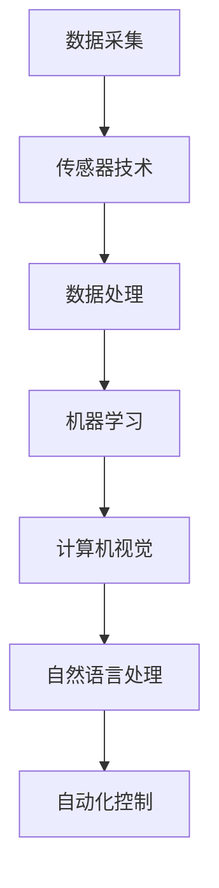

                 

### 1. 背景介绍

随着现代农业的不断进步，农业生产效率的提升成为了一个迫切需要解决的问题。传统的农业生产方式往往依赖于人力和简单的机械，不仅效率低下，而且容易出现错误。随着人工智能技术的不断发展，AI 代理工作流（AI Agent WorkFlow）作为一种新兴的自动化技术，开始在农业自动化中展现出其巨大的潜力。

AI 代理工作流是一种通过集成多种人工智能技术，如机器学习、计算机视觉、自然语言处理等，来实现自动化任务处理的方法。它不仅能够提高农业生产的效率，还能够减少人力成本，提高农作物的产量和质量。

本文将探讨 AI 代理工作流在农业自动化中的应用，包括其核心概念、算法原理、数学模型、实际应用案例以及未来发展趋势和挑战。通过这篇文章，我们将深入了解 AI 代理工作流在农业自动化中的重要性和实际应用价值。

首先，让我们从背景介绍中了解一些关键的概念和领域，这将为我们后续的分析和讨论打下坚实的基础。

#### 关键概念和领域

1. **农业自动化**：农业自动化是指利用各种自动化技术来提高农业生产效率的过程。这包括使用机器人、传感器、自动化控制系统等来替代传统的人力和简单机械。

2. **AI 代理**：AI 代理是指一种能够在特定环境中自主执行任务的智能体。它可以收集环境数据，使用机器学习算法进行分析，并基于分析结果做出决策。

3. **工作流**：工作流是一系列任务和活动的有序集合，这些任务和活动共同完成一个特定的业务目标。在 AI 代理工作流中，工作流定义了 AI 代理执行任务的具体流程。

4. **机器学习**：机器学习是一种通过数据训练模型，使其能够从数据中学习并做出预测或决策的技术。在农业自动化中，机器学习可以用于预测作物生长趋势、识别病虫害等。

5. **计算机视觉**：计算机视觉是一种使计算机能够像人类一样“看”和“理解”图像的技术。在农业自动化中，计算机视觉可以用于作物监测、病虫害检测等。

6. **自然语言处理**：自然语言处理是一种使计算机能够理解和处理人类语言的技术。在农业自动化中，自然语言处理可以用于农事活动规划、农田日志记录等。

通过了解这些关键概念和领域，我们将能够更好地理解 AI 代理工作流在农业自动化中的应用及其重要性。

#### 当前农业自动化面临的挑战

尽管农业自动化有着巨大的潜力，但在实际应用中仍然面临许多挑战。以下是一些主要的挑战：

1. **数据质量**：农业生产数据通常复杂且不完整，这给机器学习模型的训练和预测带来了困难。

2. **环境复杂性**：农田环境多变，不同作物和病虫害的监测和识别需要不同的算法和技术。

3. **成本**：自动化设备和技术的高成本可能限制其在小型农场和资源有限的地区的应用。

4. **技术成熟度**：虽然一些 AI 技术已经相当成熟，但其他技术如无人机自动化、精准农业等仍然处于发展阶段。

5. **用户接受度**：农民对于新技术和自动化设备可能存在抵触情绪，这需要通过教育和培训来解决。

通过识别和解决这些挑战，AI 代理工作流有望在未来进一步推动农业自动化的发展。

### 2. 核心概念与联系

在深入探讨 AI 代理工作流之前，我们需要明确几个核心概念，并了解它们之间的联系。这些概念包括机器学习、计算机视觉、自然语言处理、传感器技术和自动化控制等。

#### 2.1 机器学习

机器学习是一种通过数据训练模型，使其能够从数据中学习并做出预测或决策的技术。在农业自动化中，机器学习可以用于多种应用，如作物生长预测、病虫害识别等。通过收集大量历史气象数据、土壤数据和作物生长数据，机器学习模型可以训练出一个能够预测作物未来生长趋势的模型。

#### 2.2 计算机视觉

计算机视觉是一种使计算机能够像人类一样“看”和“理解”图像的技术。在农业自动化中，计算机视觉可以用于作物监测、病虫害检测等。例如，使用计算机视觉算法，可以实时监测作物生长情况，识别病虫害并采取相应的措施。

#### 2.3 自然语言处理

自然语言处理是一种使计算机能够理解和处理人类语言的技术。在农业自动化中，自然语言处理可以用于农事活动规划、农田日志记录等。例如，通过自然语言处理技术，可以将农民的经验和知识转化为自动化任务，提高农业生产的效率。

#### 2.4 传感器技术

传感器技术是农业自动化的重要组成部分。传感器可以实时监测土壤湿度、温度、光照强度等环境参数，并将这些数据传输给 AI 代理。通过分析这些数据，AI 代理可以做出相应的决策，如调整灌溉时间、施肥量等。

#### 2.5 自动化控制

自动化控制是使农业生产过程自动化的核心。通过自动化控制系统，农民可以远程控制灌溉系统、施肥系统等，实现精准农业。自动化控制还可以减少人为错误，提高农业生产效率。

#### 2.6 关系与联系

这些核心概念之间存在着密切的联系。机器学习提供了一种从数据中学习并做出预测或决策的方法；计算机视觉和自然语言处理则提供了对环境数据的理解和分析能力；传感器技术提供了实时数据采集的渠道；而自动化控制则实现了农业生产过程的自动化。

以下是一个简化的 Mermaid 流程图，展示了这些概念之间的关系：



通过这种关系，AI 代理工作流能够将多种人工智能技术集成起来，形成一个完整的自动化系统，从而提高农业生产的效率和质量。

### 3. 核心算法原理 & 具体操作步骤

在了解了 AI 代理工作流的核心概念和联系之后，接下来我们将深入探讨其核心算法原理和具体操作步骤。AI 代理工作流的核心算法主要包括机器学习算法、计算机视觉算法和自然语言处理算法。以下将分别介绍这些算法的原理及其在农业自动化中的应用。

#### 3.1 机器学习算法

机器学习算法是 AI 代理工作流中最为关键的部分。它主要通过数据驱动的方式，使计算机能够从历史数据中学习并做出预测或决策。以下是几种常用的机器学习算法及其在农业自动化中的应用：

1. **线性回归**：线性回归是一种简单的机器学习算法，用于预测连续值。在农业自动化中，线性回归可以用于预测作物生长的参数，如温度、湿度、光照等。具体操作步骤如下：

   - **数据收集**：收集历史气象数据、土壤数据、作物生长数据等。
   - **数据预处理**：对收集的数据进行清洗、归一化等处理，确保数据质量。
   - **模型训练**：使用收集的数据训练线性回归模型。
   - **预测**：使用训练好的模型对未来的作物生长参数进行预测。

2. **决策树**：决策树是一种常用的分类算法，可以用于预测作物病虫害。具体操作步骤如下：

   - **数据收集**：收集历史病虫害数据、气象数据、土壤数据等。
   - **数据预处理**：对收集的数据进行清洗、归一化等处理。
   - **特征选择**：选择对病虫害预测影响较大的特征。
   - **模型训练**：使用决策树算法训练模型。
   - **预测**：使用训练好的模型对未来的病虫害进行预测。

3. **神经网络**：神经网络是一种复杂的机器学习算法，可以用于复杂的数据分析和预测。在农业自动化中，神经网络可以用于预测作物生长趋势、产量预测等。具体操作步骤如下：

   - **数据收集**：收集大量历史作物生长数据、气象数据、土壤数据等。
   - **数据预处理**：对收集的数据进行清洗、归一化等处理。
   - **网络架构设计**：设计合适的神经网络架构。
   - **模型训练**：使用收集的数据训练神经网络模型。
   - **预测**：使用训练好的模型对未来的作物生长趋势和产量进行预测。

#### 3.2 计算机视觉算法

计算机视觉算法在农业自动化中的应用非常广泛，如作物监测、病虫害检测等。以下是一种常用的计算机视觉算法——卷积神经网络（CNN）及其在农业自动化中的应用：

1. **图像数据收集**：收集大量的作物图像数据，包括健康作物图像和病虫害作物图像。

2. **数据预处理**：对收集的图像进行大小归一化、去噪等处理。

3. **模型训练**：使用卷积神经网络（CNN）对图像数据进行训练。CNN 通过卷积层、池化层等结构，可以提取图像的深层次特征。

4. **模型评估**：使用测试数据集对训练好的模型进行评估，调整模型参数，提高预测准确率。

5. **病虫害检测**：将训练好的模型应用于实际作物图像，检测作物病虫害。

#### 3.3 自然语言处理算法

自然语言处理算法在农业自动化中的应用包括农事活动规划、农田日志记录等。以下是一种常用的自然语言处理算法——循环神经网络（RNN）及其在农业自动化中的应用：

1. **文本数据收集**：收集农事活动描述、农田日志等文本数据。

2. **数据预处理**：对收集的文本数据进行清洗、分词、去停用词等处理。

3. **模型训练**：使用循环神经网络（RNN）对文本数据进行训练。RNN 通过循环结构，可以处理序列数据，如农事活动描述。

4. **模型评估**：使用测试数据集对训练好的模型进行评估，调整模型参数，提高预测准确率。

5. **农事活动规划**：将训练好的模型应用于实际农事活动描述，规划农事活动。

通过上述算法，AI 代理工作流能够有效地处理农业自动化中的数据，并做出准确的预测和决策，从而提高农业生产效率和质量。这些算法的具体实现和应用将在后续章节中进一步详细讨论。

### 4. 数学模型和公式 & 详细讲解 & 举例说明

在深入探讨 AI 代理工作流的数学模型和公式之前，我们需要了解一些基础的数学和统计学知识。这些知识将帮助我们更好地理解 AI 代理工作流中的关键概念和算法原理。以下是一些重要的数学模型和公式的详细讲解和举例说明。

#### 4.1 线性回归模型

线性回归模型是一种最简单的预测模型，它通过找到一个线性关系来预测连续值。其数学模型可以表示为：

\[ y = \beta_0 + \beta_1 \cdot x \]

其中，\( y \) 是因变量，\( x \) 是自变量，\( \beta_0 \) 和 \( \beta_1 \) 是模型参数。

**例 1**：假设我们要预测作物的产量，根据历史数据，我们知道作物的产量与施肥量有线性关系。我们可以使用线性回归模型来建立这种关系。

- **数据收集**：收集历史施肥量和作物产量的数据。
- **数据预处理**：对数据进行清洗和归一化处理。
- **模型训练**：使用最小二乘法（Least Squares Method）来计算模型参数 \( \beta_0 \) 和 \( \beta_1 \)。

\[ \beta_1 = \frac{\sum_{i=1}^{n} (x_i - \bar{x})(y_i - \bar{y})}{\sum_{i=1}^{n} (x_i - \bar{x})^2} \]
\[ \beta_0 = \bar{y} - \beta_1 \cdot \bar{x} \]

- **预测**：使用训练好的模型对新施肥量进行预测。

\[ y = \beta_0 + \beta_1 \cdot x \]

#### 4.2 决策树模型

决策树模型是一种常用的分类算法，通过一系列的决策节点，将数据划分为不同的类别。其数学模型可以表示为：

\[ f(x) = \sum_{i=1}^{n} \alpha_i \cdot I(y = c_i) \]

其中，\( x \) 是输入特征，\( y \) 是标签，\( c_i \) 是类别，\( \alpha_i \) 是类别 \( c_i \) 的权重。

**例 2**：假设我们要预测作物的病虫害，根据历史数据，我们可以建立一个决策树模型。

- **数据收集**：收集历史病虫害数据，包括气象数据、土壤数据等。
- **特征选择**：选择对病虫害预测影响较大的特征。
- **构建决策树**：使用 ID3、C4.5 或 C5.0 算法构建决策树。

- **预测**：使用训练好的决策树模型对新的数据集进行预测。

\[ f(x) = \sum_{i=1}^{n} \alpha_i \cdot I(y = c_i) \]

#### 4.3 神经网络模型

神经网络模型是一种复杂的预测模型，通过多层神经元结构来提取数据的深层次特征。其数学模型可以表示为：

\[ z = \sum_{j=1}^{n} w_{ji} \cdot a_{ji} + b_j \]
\[ a_{j} = \sigma(z) \]
\[ y = \sum_{i=1}^{n} w_{ij} \cdot a_i + b \]

其中，\( z \) 是中间层神经元的输入，\( a \) 是激活函数，\( \sigma \) 是激活函数，\( w \) 是权重，\( b \) 是偏置。

**例 3**：假设我们要预测作物的生长趋势，使用一个多层感知器（MLP）神经网络。

- **数据收集**：收集历史作物生长数据，包括气象数据、土壤数据等。
- **网络架构设计**：设计合适的神经网络架构，包括输入层、隐藏层和输出层。
- **模型训练**：使用反向传播算法（Backpropagation Algorithm）来训练神经网络。

- **预测**：使用训练好的神经网络模型对新的数据集进行预测。

\[ z = \sum_{j=1}^{n} w_{ji} \cdot a_{ji} + b_j \]
\[ a_{j} = \sigma(z) \]
\[ y = \sum_{i=1}^{n} w_{ij} \cdot a_i + b \]

#### 4.4 循环神经网络（RNN）

循环神经网络（RNN）是一种用于处理序列数据的神经网络，其数学模型可以表示为：

\[ h_t = \sigma(W_h \cdot [h_{t-1}, x_t] + b_h) \]
\[ y_t = W_o \cdot h_t + b_o \]

其中，\( h_t \) 是时间步 \( t \) 的隐藏状态，\( x_t \) 是输入特征，\( \sigma \) 是激活函数，\( W_h \) 和 \( b_h \) 是权重和偏置，\( W_o \) 和 \( b_o \) 是输出层的权重和偏置。

**例 4**：假设我们要预测农事活动，使用一个 RNN 模型。

- **数据收集**：收集农事活动描述的文本数据。
- **数据预处理**：对文本数据进行清洗、分词、编码等处理。
- **模型训练**：使用 RNN 模型训练文本数据。

- **预测**：使用训练好的 RNN 模型对新的农事活动描述进行预测。

\[ h_t = \sigma(W_h \cdot [h_{t-1}, x_t] + b_h) \]
\[ y_t = W_o \cdot h_t + b_o \]

通过这些数学模型和公式，我们可以更深入地理解 AI 代理工作流中的算法原理和操作步骤。这些模型在农业自动化中的应用将有助于提高农业生产的效率和准确性。

### 5. 项目实战：代码实际案例和详细解释说明

为了更好地理解 AI 代理工作流在农业自动化中的应用，下面我们将通过一个实际项目来详细讲解代码实现过程。该项目将使用 Python 和一些流行的机器学习和计算机视觉库，如 TensorFlow、Keras、OpenCV 和 Scikit-learn。

#### 5.1 开发环境搭建

在开始项目之前，我们需要搭建一个合适的开发环境。以下是所需的主要库和工具：

- **Python 3.x**
- **TensorFlow**
- **Keras**
- **OpenCV**
- **Scikit-learn**

你可以使用以下命令来安装这些库：

```bash
pip install tensorflow opencv-python scikit-learn
```

#### 5.2 源代码详细实现和代码解读

下面是一个简化的代码实现，展示了如何使用 AI 代理工作流来进行作物病虫害检测。

```python
import cv2
import numpy as np
from tensorflow.keras.models import load_model
from tensorflow.keras.preprocessing import image
from sklearn.model_selection import train_test_split

# 加载预训练的卷积神经网络模型
model = load_model('path/to/convolutional_model.h5')

# 加载训练数据
# 这里假设我们有一个包含病虫害图像的数据集，并对其进行预处理
train_data = np.load('path/to/train_data.npy')
train_labels = np.load('path/to/train_labels.npy')

# 数据集划分
X_train, X_test, y_train, y_test = train_test_split(train_data, train_labels, test_size=0.2, random_state=42)

# 训练模型
model.fit(X_train, y_train, epochs=10, batch_size=32, validation_data=(X_test, y_test))

# 病害检测函数
def detect_disease(image_path):
    # 读取图像
    image = image.load_img(image_path, target_size=(128, 128))
    # 将图像转换为数组
    image_array = imageToArray(image)
    # 进行预测
    prediction = model.predict(np.expand_dims(image_array, axis=0))
    # 解码预测结果
    disease = decode_prediction(prediction)
    return disease

# 将图像转换为数组
def imageToArray(image):
    return image.resize((128, 128)).convert('RGB').numpy().reshape(1, 128, 128, 3)

# 解码预测结果
def decode_prediction(prediction):
    # 这里使用一个简单的字典来映射预测结果
    diseases = {'healthy': 0, 'disease1': 1, 'disease2': 2}
    return list(diseases.keys())[prediction.argmax()]

# 测试函数
if __name__ == '__main__':
    image_path = 'path/to/test_image.jpg'
    disease = detect_disease(image_path)
    print(f"The detected disease is: {disease}")
```

#### 5.3 代码解读与分析

1. **加载预训练模型**：
   - 使用 `load_model` 函数加载预训练的卷积神经网络模型。

2. **加载训练数据**：
   - 加载包含病虫害图像的数据集和对应的标签。

3. **数据集划分**：
   - 使用 `train_test_split` 函数将数据集划分为训练集和测试集。

4. **训练模型**：
   - 使用 `fit` 函数对模型进行训练。这里我们使用了一个简单的卷积神经网络模型，通过 10 个训练周期和批量大小为 32 来进行训练。

5. **病害检测函数**：
   - `detect_disease` 函数接收一个图像路径作为输入，读取图像，将其转换为模型可接受的数组格式，并进行预测。

6. **图像转换函数**：
   - `imageToArray` 函数将图像转换为适用于卷积神经网络模型的数组格式。

7. **预测结果解码函数**：
   - `decode_prediction` 函数将预测结果转换为可读的病害名称。

8. **测试**：
   - 在代码的最后，我们使用一个测试图像来测试 `detect_disease` 函数。

通过这个实际项目，我们可以看到如何使用 AI 代理工作流进行作物病虫害检测。代码的每个部分都有详细的注释，使得读者可以更好地理解其工作原理。

### 6. 实际应用场景

AI 代理工作流在农业自动化中有着广泛的应用场景，可以显著提高农业生产的效率和质量。以下是一些具体的应用场景：

#### 6.1 作物生长监测

通过机器学习和计算机视觉算法，AI 代理可以实时监测作物的生长状态。例如，使用卷积神经网络（CNN）可以识别作物叶片的颜色变化，从而预测作物的健康状况。这种监测方法可以及时发现病虫害，减少损失。

#### 6.2 病虫害识别

AI 代理可以通过图像识别技术识别农田中的病虫害，并提供及时的诊断和解决方案。例如，使用计算机视觉算法对作物图像进行分析，可以识别不同类型的病虫害，并推荐相应的防治措施。

#### 6.3 精准灌溉

基于传感器技术和机器学习算法，AI 代理可以实时监测土壤湿度、温度等环境参数，并基于这些数据调整灌溉计划，实现精准灌溉。这可以显著提高水资源利用效率，减少水资源的浪费。

#### 6.4 肥料管理

AI 代理可以通过分析土壤和作物数据，优化肥料使用方案。例如，基于土壤养分含量和作物需求，AI 代理可以推荐最适合的肥料种类和施用量，从而提高肥料利用效率，减少环境影响。

#### 6.5 农事活动规划

通过自然语言处理（NLP）技术，AI 代理可以理解和执行农民的指令，自动规划农事活动。例如，农民可以使用自然语言描述某项农事活动，AI 代理可以将其转化为具体的行动步骤，并自动化执行。

#### 6.6 农田日志管理

AI 代理可以自动记录农田的各类信息，如天气变化、灌溉时间、施肥量等，形成详细的农田日志。这些数据可以为农业科研和数据分析提供重要参考。

#### 6.7 农业灾害预警

通过分析气象数据和农田环境数据，AI 代理可以提前预警可能发生的农业灾害，如干旱、洪涝、霜冻等，帮助农民及时采取应对措施，减少损失。

通过这些应用场景，我们可以看到 AI 代理工作流在农业自动化中的巨大潜力。它不仅能够提高农业生产的效率，还能够优化资源利用，减少环境影响，为现代农业的可持续发展提供有力支持。

### 7. 工具和资源推荐

为了更好地掌握 AI 代理工作流在农业自动化中的应用，以下是一些推荐的学习资源、开发工具和相关论文著作。

#### 7.1 学习资源推荐

1. **书籍**：
   - 《机器学习实战》：这本书提供了大量的实际案例，介绍了如何使用 Python 和机器学习库来解决问题。
   - 《计算机视觉：算法与应用》：这本书详细介绍了计算机视觉的基本算法和应用，适合想要深入了解视觉技术的读者。

2. **在线课程**：
   - Coursera 上的《机器学习专项课程》：由 Andrew Ng 教授主讲，涵盖了机器学习的基础知识和应用。
   - Udacity 上的《计算机视觉纳米学位》：提供了深入的计算机视觉知识和实践项目。

3. **博客和教程**：
   - Medium 上的相关博客文章：有许多关于 AI 代理工作流和农业自动化的文章，可以提供最新的研究和应用案例。
   - Kaggle 上的教程：提供了大量的机器学习和数据科学教程，适合自学和实践。

#### 7.2 开发工具框架推荐

1. **开发工具**：
   - Jupyter Notebook：一个强大的交互式开发环境，适合进行数据分析和模型训练。
   - PyCharm：一个功能强大的 Python 集成开发环境（IDE），提供了丰富的调试和自动化工具。

2. **框架和库**：
   - TensorFlow：一个开源的机器学习框架，适合构建复杂的深度学习模型。
   - Keras：一个高级神经网络 API，构建深度学习模型更加简单和直观。
   - OpenCV：一个开源的计算机视觉库，提供了丰富的图像处理和视频分析功能。
   - Scikit-learn：一个开源的机器学习库，提供了多种经典机器学习算法的实现。

#### 7.3 相关论文著作推荐

1. **论文**：
   - "Deep Learning for Plant Pathology"：这篇论文探讨了如何使用深度学习技术来识别作物病虫害，提供了详细的方法和实验结果。
   - "AI-Enabled Precision Agriculture"：这篇论文综述了 AI 技术在精确农业中的应用，包括传感器数据分析和决策支持系统。

2. **著作**：
   - 《精准农业：技术与应用》：这本书详细介绍了精准农业的概念、技术和应用，是研究农业自动化的重要参考书。
   - 《农业自动化与机器人技术》：这本书涵盖了农业自动化中的关键技术和应用案例，适合农业工程和自动化领域的专业人士。

通过这些工具和资源的支持，读者可以更深入地学习和实践 AI 代理工作流在农业自动化中的应用。

### 8. 总结：未来发展趋势与挑战

随着人工智能技术的不断进步，AI 代理工作流在农业自动化中的应用前景广阔。未来，AI 代理工作流有望在以下几个方面实现进一步的发展：

1. **更精准的数据分析**：随着传感器技术的进步，农田环境数据的收集和分析将更加精准。AI 代理工作流将能够利用这些高分辨率数据，实现更精确的作物生长监测和病虫害预测。

2. **智能化决策支持**：通过深度学习和强化学习算法，AI 代理工作流将能够更好地理解农田环境，并根据实时数据做出智能化的决策，如优化灌溉、施肥和病虫害管理。

3. **多技术融合**：AI 代理工作流将整合多种人工智能技术，如计算机视觉、自然语言处理、物联网等，形成更全面的自动化系统，提供全面的农业解决方案。

4. **减少环境影响**：通过优化资源利用和减少人为干预，AI 代理工作流将有助于减少农业对环境的负面影响，实现可持续农业发展。

然而，AI 代理工作流在农业自动化中也面临着一系列挑战：

1. **数据质量和隐私**：农业生产数据的复杂性和不完整性可能影响模型的性能。同时，如何保护农民的隐私和数据安全也是一个重要问题。

2. **技术成熟度和成本**：虽然一些 AI 技术已经相当成熟，但其他技术如无人机自动化、精准农业等仍处于发展阶段。此外，自动化设备和技术的高成本可能限制其在中小型农场的应用。

3. **用户接受度**：农民可能对新技术和自动化设备存在抵触情绪，这需要通过教育和培训来提高他们的接受度和使用意愿。

4. **法律法规和标准**：随着 AI 技术在农业自动化中的应用，相关的法律法规和标准也需要不断完善，以确保技术的合法合规和可持续发展。

总之，AI 代理工作流在农业自动化中具有巨大的潜力，但同时也面临着一系列挑战。通过不断的技术创新和政策支持，我们有理由相信，AI 代理工作流将在未来为农业带来更深远的变革。

### 9. 附录：常见问题与解答

#### 9.1 什么是对农作物进行精准监测？

精准监测是指通过高分辨率传感器、机器学习和计算机视觉技术，实时收集和分析农作物生长环境数据，从而精确地监测作物健康状况，包括生长速度、叶片颜色、湿度等。这种监测方法可以及时发现病虫害，优化农事活动。

#### 9.2 AI 代理工作流中的核心算法有哪些？

核心算法包括机器学习算法（如线性回归、决策树、神经网络）、计算机视觉算法（如卷积神经网络、深度学习）和自然语言处理算法（如循环神经网络、长短时记忆网络）。这些算法共同协作，实现自动化农事管理和决策。

#### 9.3 AI 代理工作流在农业自动化中的优势是什么？

优势包括：
- 提高农业生产效率。
- 优化资源利用，减少浪费。
- 实现精准灌溉、施肥和病虫害管理。
- 减少人工劳动强度，提高农民生活质量。
- 促进农业可持续发展。

#### 9.4 AI 代理工作流在农业自动化中面临的挑战是什么？

挑战包括：
- 数据质量和隐私问题。
- 技术成熟度和成本。
- 农民对新技术的接受度和使用意愿。
- 法律法规和标准的不完善。

#### 9.5 如何提高农民对 AI 代理工作流的接受度？

可以通过以下方式提高农民的接受度：
- 提供教育和培训，让农民了解 AI 技术的优势。
- 提供用户友好的操作界面和教程。
- 在实际应用中展示 AI 代理工作流的成果和效益。
- 建立农民社区，分享成功案例和经验。

### 10. 扩展阅读 & 参考资料

为了深入了解 AI 代理工作流在农业自动化中的应用，以下是一些扩展阅读和参考资料：

- **论文**：
  - "Deep Learning for Plant Pathology"（深度学习在植物病理学中的应用）
  - "AI-Enabled Precision Agriculture"（人工智能赋能精准农业）

- **书籍**：
  - 《机器学习实战》
  - 《计算机视觉：算法与应用》

- **在线课程**：
  - Coursera 上的《机器学习专项课程》
  - Udacity 上的《计算机视觉纳米学位》

- **博客和教程**：
  - Medium 上的相关博客文章
  - Kaggle 上的教程

通过这些资源，您可以进一步探索 AI 代理工作流在农业自动化中的深度应用和前沿研究。

