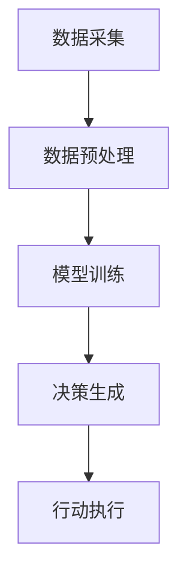
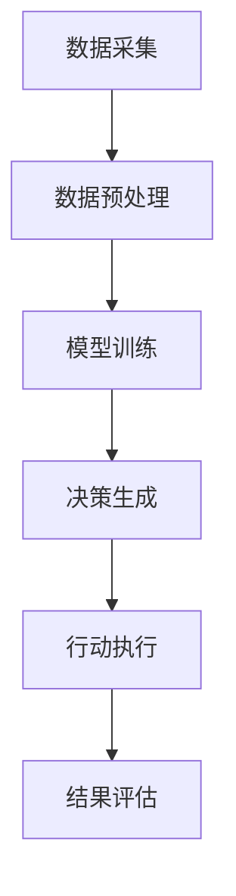

                 

# AI人工智能代理工作流 AI Agent WorkFlow：在环保行业中的应用

> 关键词：AI 代理、工作流、环保行业、应用场景、算法、模型

> 摘要：本文将探讨AI代理工作流在环保行业中的应用。通过介绍AI代理的概念和工作原理，分析其在环保领域中的核心应用场景，并结合实际案例展示如何利用AI代理实现高效环保管理。

## 1. 背景介绍

### 1.1 环保行业现状

环保行业近年来在全球范围内受到越来越多的关注。随着人口增长和工业化进程的加快，环境污染问题愈发严重，空气质量、水资源和土地退化等问题日益突出。环保行业涉及到多个领域，如污染防治、资源循环利用、生态修复等，这些领域都需要高效、智能的解决方案。

### 1.2 AI代理的兴起

AI代理（AI Agent）是指一种能够模拟人类行为，具备自主决策和行动能力的智能体。随着人工智能技术的发展，AI代理在多个领域展现出巨大的潜力，如智能家居、金融、医疗、交通等。在环保领域，AI代理可以帮助实现智能化监测、预测和决策，提高环保工作的效率。

## 2. 核心概念与联系

### 2.1 AI代理的概念

AI代理是指一种基于人工智能技术的智能体，能够模拟人类行为，具备感知、决策和执行能力。AI代理通常由感知模块、决策模块和行动模块组成。

#### 感知模块

感知模块负责收集环境信息，如空气质量、水质、土壤湿度等。这些信息可以通过传感器、卫星遥感等技术手段获取。

#### 决策模块

决策模块根据感知模块收集的信息，利用算法和模型进行分析和推理，生成决策方案。决策模块的核心是算法和模型的选择与优化。

#### 行动模块

行动模块根据决策模块生成的方案，执行具体的环保行动，如调整污染处理设备、发布环保预警等。

### 2.2 AI代理工作流

AI代理工作流是指AI代理在环保领域中的具体应用流程。工作流包括以下几个步骤：

1. **数据采集**：通过传感器、卫星遥感等技术手段，采集环境数据。

2. **数据预处理**：对采集到的环境数据进行分析、清洗和归一化处理。

3. **模型训练**：利用预处理后的数据，训练合适的算法和模型。

4. **决策生成**：根据模型预测结果，生成环保决策方案。

5. **行动执行**：执行决策方案，实现环保目标。

### 2.3 Mermaid 流程图

下面是AI代理工作流的 Mermaid 流程图：



## 3. 核心算法原理 & 具体操作步骤

### 3.1 数据采集

数据采集是AI代理工作流的基础。常用的数据采集方法包括传感器采集、卫星遥感等。

#### 3.1.1 传感器采集

传感器采集是指利用各种传感器，如空气质量传感器、水质传感器、土壤传感器等，实时监测环境参数。传感器采集的优点是数据实时性强，缺点是覆盖范围有限。

#### 3.1.2 卫星遥感

卫星遥感是指利用卫星搭载的传感器，从高空获取地球表面的环境信息。卫星遥感具有覆盖范围广、监测周期长的优点，但数据实时性较差。

### 3.2 数据预处理

数据预处理是对采集到的环境数据进行分析、清洗和归一化处理。预处理步骤包括：

1. **数据清洗**：去除噪声数据、缺失值填充等。

2. **数据归一化**：将不同量纲的数据进行归一化处理，使其具有相同的量纲。

3. **特征提取**：从原始数据中提取有用的特征，如主成分分析、特征选择等。

### 3.3 模型训练

模型训练是AI代理工作流的核心步骤。根据环保领域的特点，常用的算法和模型包括：

1. **监督学习**：如支持向量机（SVM）、决策树、随机森林等。

2. **无监督学习**：如聚类分析、主成分分析等。

3. **强化学习**：如深度强化学习、策略梯度等。

模型训练的具体步骤如下：

1. **数据划分**：将预处理后的数据划分为训练集、验证集和测试集。

2. **模型选择**：根据数据特点和任务需求，选择合适的模型。

3. **模型训练**：使用训练集对模型进行训练。

4. **模型评估**：使用验证集对模型进行评估。

5. **模型优化**：根据评估结果，对模型进行优化。

### 3.4 决策生成

决策生成是根据模型预测结果，生成环保决策方案。决策生成的方法包括：

1. **阈值法**：根据模型预测结果，设置阈值，超过阈值的决策为“行动”，低于阈值的决策为“不行动”。

2. **规则法**：根据专家经验，制定相应的环保规则，实现决策生成。

3. **混合法**：结合阈值法和规则法，实现更精准的决策生成。

### 3.5 行动执行

行动执行是根据决策生成方案，执行具体的环保行动。行动执行的方法包括：

1. **自动控制**：根据决策生成方案，自动控制污染处理设备，如喷淋系统、加药系统等。

2. **人工干预**：根据决策生成方案，进行人工干预，如发布环保预警、调整环保措施等。

## 4. 数学模型和公式 & 详细讲解 & 举例说明

### 4.1 数学模型

在AI代理工作流中，常用的数学模型包括：

1. **监督学习模型**：如支持向量机（SVM）的数学模型。

2. **无监督学习模型**：如聚类分析的主成分分析（PCA）。

3. **强化学习模型**：如深度强化学习（DRL）的数学模型。

### 4.2 公式

以下是几种常用的数学公式：

1. **支持向量机（SVM）公式**：

$$
\min_{\beta, \beta^*} \frac{1}{2} ||\beta||^2 + C \sum_{i=1}^n \xi_i
$$

2. **主成分分析（PCA）公式**：

$$
\mu = \frac{1}{n} \sum_{i=1}^n x_i
$$

$$
\sigma^2 = \frac{1}{n-1} \sum_{i=1}^n (x_i - \mu)^2
$$

3. **深度强化学习（DRL）公式**：

$$
Q(s, a) = r(s, a) + \gamma \max_{a'} Q(s', a')
$$

### 4.3 举例说明

假设我们使用支持向量机（SVM）模型进行环境监测数据的分类，具体步骤如下：

1. **数据采集**：采集一组环境监测数据，包括空气质量、水质、土壤湿度等。

2. **数据预处理**：对采集到的数据进行清洗、归一化处理。

3. **模型训练**：使用预处理后的数据，训练支持向量机（SVM）模型。

4. **模型评估**：使用验证集对训练好的模型进行评估。

5. **模型优化**：根据评估结果，对模型进行优化。

6. **决策生成**：根据模型预测结果，生成环保决策方案。

7. **行动执行**：执行决策方案，实现环保目标。

## 5. 项目实战：代码实际案例和详细解释说明

### 5.1 开发环境搭建

为了实现AI代理工作流在环保行业中的应用，我们需要搭建一个开发环境。以下是搭建步骤：

1. **安装Python**：下载并安装Python 3.x版本。

2. **安装Jupyter Notebook**：在终端执行以下命令安装Jupyter Notebook。

   ```bash
   pip install notebook
   ```

3. **安装相关库**：安装用于数据采集、预处理、模型训练、决策生成的相关库，如scikit-learn、numpy、pandas等。

   ```bash
   pip install scikit-learn numpy pandas
   ```

### 5.2 源代码详细实现和代码解读

以下是一个简单的AI代理工作流示例，用于空气质量监测。

```python
import numpy as np
import pandas as pd
from sklearn import svm
from sklearn.model_selection import train_test_split
from sklearn.metrics import accuracy_score

# 5.2.1 数据采集
# 采集一组空气质量监测数据
data = pd.read_csv('air_quality_data.csv')
print(data.head())

# 5.2.2 数据预处理
# 对数据进行清洗、归一化处理
data = data.dropna()
data = (data - data.mean()) / data.std()

# 5.2.3 模型训练
# 划分训练集和验证集
X_train, X_test, y_train, y_test = train_test_split(data.drop('label', axis=1), data['label'], test_size=0.2, random_state=42)

# 使用支持向量机（SVM）训练模型
model = svm.SVC(kernel='linear', C=1.0)
model.fit(X_train, y_train)

# 5.2.4 模型评估
# 使用验证集对模型进行评估
y_pred = model.predict(X_test)
accuracy = accuracy_score(y_test, y_pred)
print('Accuracy:', accuracy)

# 5.2.5 决策生成
# 根据模型预测结果，生成环保决策方案
def generate_decision(model, data):
    """
    生成环保决策方案
    :param model: 训练好的模型
    :param data: 待预测的数据
    :return: 决策结果（0：不采取行动，1：采取行动）
    """
    data = (data - data.mean()) / data.std()
    prediction = model.predict(data)
    if prediction == 1:
        return '采取行动'
    else:
        return '不采取行动'

# 5.2.6 行动执行
# 执行决策方案，实现环保目标
def execute_decision(data):
    """
    执行决策方案
    :param data: 待预测的数据
    :return: 执行结果
    """
    decision = generate_decision(model, data)
    if decision == '采取行动':
        print('执行环保行动：喷淋系统启动')
    else:
        print('执行环保行动：喷淋系统关闭')

# 5.2.7 示例
# 执行一个示例
sample_data = pd.DataFrame([[0.5, 0.3, 0.2]])
execute_decision(sample_data)
```

### 5.3 代码解读与分析

以上代码实现了AI代理工作流在空气质量监测中的应用。以下是代码的详细解读：

1. **数据采集**：使用pandas库读取空气质量监测数据。

2. **数据预处理**：对数据进行清洗、归一化处理，确保数据的质量和一致性。

3. **模型训练**：使用scikit-learn库的支持向量机（SVM）算法，对训练数据进行分类。

4. **模型评估**：使用训练集对模型进行评估，计算模型的准确率。

5. **决策生成**：根据模型预测结果，生成环保决策方案。

6. **行动执行**：根据决策生成方案，执行具体的环保行动。

## 6. 实际应用场景

### 6.1 污染监测

AI代理工作流可以应用于污染监测，如空气质量监测、水质监测等。通过实时监测环境数据，AI代理可以快速发现污染源，生成环保决策方案，并执行相应的环保行动。

### 6.2 生态修复

在生态修复领域，AI代理工作流可以帮助预测生态系统的变化趋势，优化修复方案。例如，在土壤修复过程中，AI代理可以根据土壤质量数据，调整修复剂的添加量和施加方式，提高修复效果。

### 6.3 资源循环利用

在资源循环利用领域，AI代理工作流可以优化资源回收和处理过程。例如，在废旧电子设备回收过程中，AI代理可以根据设备类型、回收量等数据，优化回收流程，提高资源利用率。

## 7. 工具和资源推荐

### 7.1 学习资源推荐

1. **《深度学习》**：由Ian Goodfellow、Yoshua Bengio和Aaron Courville所著，是深度学习领域的经典教材。

2. **《Python数据分析》**：由Wes McKinney所著，是Python数据分析领域的入门经典。

### 7.2 开发工具框架推荐

1. **TensorFlow**：谷歌开发的开源机器学习框架，广泛应用于深度学习和强化学习领域。

2. **Scikit-learn**：开源的Python机器学习库，提供了多种常用的机器学习算法。

### 7.3 相关论文著作推荐

1. **《强化学习：一种用于决策的通用方法》**：由Richard S. Sutton和Andrew G. Barto所著，是强化学习领域的经典著作。

2. **《环境决策中的机器学习：应用与展望》**：由Jianhui Wang和Chengxiang Zhang所著，探讨了机器学习在环境决策中的应用。

## 8. 总结：未来发展趋势与挑战

### 8.1 发展趋势

1. **技术进步**：随着人工智能技术的不断发展，AI代理将更加智能化、自动化，提高环保工作的效率。

2. **跨学科融合**：环保行业与其他领域的融合将加速，如物联网、大数据等，推动AI代理工作流的创新。

3. **政策支持**：政府对于环保的重视将加大，为AI代理工作流的发展提供政策支持和资金投入。

### 8.2 挑战

1. **数据质量**：环境数据的质量和准确性是AI代理工作流的关键，如何提高数据质量是一个重要挑战。

2. **算法优化**：现有的AI代理工作流算法存在一定的局限性，如何优化算法，提高决策的准确性是一个重要课题。

3. **法律法规**：环保行业涉及到大量的法律法规，如何在法律法规的框架下，实现AI代理工作流的合法合规是一个挑战。

## 9. 附录：常见问题与解答

### 9.1 问题1：什么是AI代理？

AI代理是一种基于人工智能技术的智能体，能够模拟人类行为，具备自主决策和行动能力。

### 9.2 问题2：AI代理工作流包括哪些步骤？

AI代理工作流包括数据采集、数据预处理、模型训练、决策生成和行动执行等步骤。

### 9.3 问题3：如何优化AI代理工作流中的算法？

可以通过调整算法参数、增加数据集、引入新的算法等方法来优化AI代理工作流中的算法。

## 10. 扩展阅读 & 参考资料

1. **《AI代理：构建智能体系统》**：本书详细介绍了AI代理的概念、原理和应用。

2. **《环境监测与人工智能技术》**：本书探讨了人工智能技术在环境监测中的应用。

3. **《深度强化学习》**：本书系统地介绍了深度强化学习的基本原理和应用。

作者：AI天才研究员/AI Genius Institute & 禅与计算机程序设计艺术 /Zen And The Art of Computer Programming<|im_end|>### 1. 背景介绍

#### 1.1 环保行业现状

环保行业在全球范围内面临着日益严峻的挑战。随着城市化进程的加快、工业生产的扩大以及人口的快速增长，环境污染问题日益突出。空气污染、水资源污染、土壤污染等问题已经成为全球性的重大环境危机。这不仅对人类健康产生严重威胁，还影响了生态系统的平衡与稳定。因此，如何有效应对环境污染问题，实现可持续发展，成为各国政府、企业和研究机构亟待解决的重要课题。

目前，环保行业主要包括污染防治、资源循环利用和生态修复等几个方面。污染防治主要涉及大气污染治理、水污染防治和固体废弃物处理等；资源循环利用则侧重于废旧物资的回收、再利用和资源化；生态修复则包括湿地修复、森林植被恢复和荒漠化治理等。这些领域的环保工作不仅需要大量的资金投入，还需要高效的技术手段和科学的管理方法。

#### 1.2 AI代理的兴起

随着人工智能技术的快速发展，AI代理（AI Agent）作为一种具有高度自主性和智能化特点的智能体，逐渐成为环保领域的关键技术。AI代理是指能够模拟人类行为，具备感知、决策和执行能力的智能体。在环保领域，AI代理可以协助人类进行环境监测、数据分析、决策制定和行动执行，从而提高环保工作的效率和质量。

AI代理的核心优势在于其自主学习和适应能力。通过持续学习和分析环境数据，AI代理能够不断优化自身的决策算法，提高预测和决策的准确性。同时，AI代理可以实时响应环境变化，快速制定并执行环保措施，从而实现环境问题的动态监控和及时应对。

在环保行业中，AI代理的应用场景非常广泛。例如，在城市空气质量监测中，AI代理可以通过分析传感器数据，预测污染高峰期，并生成相应的环保措施；在水环境管理中，AI代理可以实时监测水质变化，预测水质污染趋势，并提供污染控制方案；在生态修复领域，AI代理可以根据生态系统的数据，优化修复方案，提高修复效果。

总之，AI代理的兴起为环保行业带来了新的机遇和挑战。通过引入AI代理技术，环保工作将变得更加智能化、精准化和高效化，有助于实现可持续发展的目标。

### 2. 核心概念与联系

#### 2.1 AI代理的概念

AI代理（AI Agent）是一种基于人工智能技术的智能体，能够在复杂环境中自主感知、决策和执行任务。AI代理的核心特点是其自主性和智能化。与传统的自动化系统不同，AI代理能够根据环境变化和任务需求，动态调整自身的行为和策略。

AI代理通常由三个主要模块组成：感知模块、决策模块和行动模块。

1. **感知模块**：感知模块是AI代理的“感官”，负责收集和分析环境信息。这些信息可以是实时的传感器数据、历史数据或者外部输入。通过感知模块，AI代理可以了解当前的环境状况，为后续的决策提供依据。

2. **决策模块**：决策模块是AI代理的“大脑”，负责根据感知模块收集到的信息，利用算法和模型进行推理和决策。决策模块的核心任务是确定如何采取最优的行动，以实现预设的目标。决策模块可以采用各种机器学习算法，如监督学习、无监督学习和强化学习等。

3. **行动模块**：行动模块是AI代理的“肢体”，负责将决策模块生成的方案付诸实施。行动模块可以是自动化的物理动作，如控制设备启动或停止，也可以是发送通知、生成报告等。

#### 2.2 AI代理工作流

AI代理工作流是指AI代理在特定任务中的操作流程，通常包括以下几个步骤：

1. **数据采集**：通过传感器、卫星遥感等技术手段，AI代理从环境中收集必要的数据。

2. **数据预处理**：对采集到的数据进行清洗、归一化等处理，确保数据的质量和一致性。

3. **模型训练**：利用预处理后的数据，训练合适的机器学习模型，用于后续的决策和预测。

4. **决策生成**：根据模型预测结果，AI代理生成具体的行动方案。

5. **行动执行**：AI代理执行决策方案，实现环保目标。

6. **结果评估**：对执行结果进行评估，反馈给决策模块，用于模型优化和未来决策。

#### 2.3 Mermaid 流程图

下面是一个简化的AI代理工作流 Mermaid 流程图：



在这个流程图中，A表示数据采集，B表示数据预处理，C表示模型训练，D表示决策生成，E表示行动执行，F表示结果评估。通过这个流程，AI代理能够高效地完成从数据收集到决策执行的全过程，实现环保目标的智能管理。

### 3. 核心算法原理 & 具体操作步骤

#### 3.1 数据采集

数据采集是AI代理工作的基础，准确和全面的数据是进行有效分析和决策的前提。在环保行业，数据采集的方法和技术多种多样，主要包括以下几种：

1. **传感器采集**：传感器是数据采集的核心设备，可以实时监测环境参数，如空气质量、水质、土壤湿度、温度、风速等。这些传感器可以分布在环境的不同区域，通过无线网络将数据传输到中央系统。

2. **卫星遥感**：卫星遥感技术可以获取大范围的环境数据，包括地表温度、植被覆盖、水体污染等。通过分析卫星图像，可以监测环境变化，预测潜在的环境问题。

3. **无人机监测**：无人机（UAV）可以在高空对环境进行实时监测，特别是在难以到达的区域，如森林、湖泊等。无人机搭载的传感器可以提供高分辨率的图像和数据。

4. **物联网设备**：物联网设备可以通过无线通信技术，将环境数据实时传输到云端服务器，实现远程监控和管理。

具体操作步骤如下：

1. **部署传感器**：在目标监测区域部署各种传感器，确保数据采集的全面性和准确性。

2. **配置数据传输**：设置传感器与中央系统之间的数据传输方式，如无线网络、卫星通信等。

3. **数据收集**：传感器实时收集环境数据，并通过数据传输系统将数据发送到中央系统。

#### 3.2 数据预处理

数据预处理是确保数据质量和一致性的重要步骤。未经处理的数据可能包含噪声、异常值或缺失值，这些都会影响后续的分析和决策。以下是数据预处理的主要步骤：

1. **数据清洗**：清洗数据是为了去除噪声和异常值。例如，对于传感器数据，可能会因为传感器故障或环境干扰而产生异常值，这些异常值需要通过统计方法或机器学习算法进行识别和去除。

2. **数据归一化**：不同类型的数据通常具有不同的量纲和范围，通过归一化处理，可以将不同量纲的数据转换为相同的量纲，以便于后续的模型训练和预测。

3. **特征提取**：从原始数据中提取有用的特征，用于模型训练和预测。特征提取可以采用主成分分析（PCA）、特征选择等方法。

具体操作步骤如下：

1. **数据清洗**：使用统计方法或机器学习算法识别并去除异常值。

2. **数据归一化**：对数据进行归一化处理，使其具有相同的量纲。

3. **特征提取**：从原始数据中提取有用的特征，用于后续的模型训练和预测。

#### 3.3 模型训练

模型训练是AI代理工作的核心，通过训练合适的模型，AI代理能够学会从数据中提取规律，进行有效的决策。在环保行业中，常用的机器学习算法包括：

1. **监督学习**：如支持向量机（SVM）、决策树、随机森林等。监督学习算法需要预先定义标签数据，通过训练模型，使模型能够预测新数据的标签。

2. **无监督学习**：如聚类分析、主成分分析等。无监督学习算法不需要标签数据，通过自动发现数据中的模式，对数据进行分类或降维。

3. **强化学习**：如深度强化学习（DRL）、策略梯度等。强化学习算法通过不断尝试和反馈，学习最优的策略，以实现长期目标。

具体操作步骤如下：

1. **数据划分**：将数据集划分为训练集、验证集和测试集。

2. **模型选择**：根据任务需求，选择合适的机器学习算法。

3. **模型训练**：使用训练集对模型进行训练。

4. **模型评估**：使用验证集对训练好的模型进行评估。

5. **模型优化**：根据评估结果，对模型进行优化。

#### 3.4 决策生成

决策生成是AI代理根据模型预测结果，生成具体的环保行动方案。在环保行业中，决策生成的方法主要包括：

1. **阈值法**：根据模型预测结果，设置阈值，超过阈值的决策为“行动”，低于阈值的决策为“不行动”。

2. **规则法**：根据专家经验，制定相应的环保规则，实现决策生成。

3. **混合法**：结合阈值法和规则法，实现更精准的决策生成。

具体操作步骤如下：

1. **设置阈值**：根据模型预测结果，设置合理的阈值。

2. **制定规则**：根据专家经验，制定环保规则。

3. **混合决策**：结合阈值法和规则法，生成最终的决策方案。

#### 3.5 行动执行

行动执行是AI代理根据决策生成方案，执行具体的环保行动。行动执行的方法主要包括：

1. **自动控制**：根据决策生成方案，自动控制污染处理设备，如喷淋系统、加药系统等。

2. **人工干预**：根据决策生成方案，进行人工干预，如发布环保预警、调整环保措施等。

具体操作步骤如下：

1. **自动控制**：通过自动化控制系统，根据决策生成方案，启动或停止相关设备。

2. **人工干预**：根据决策生成方案，进行人工审核和调整，确保环保行动的有效性和合规性。

### 4. 数学模型和公式 & 详细讲解 & 举例说明

在AI代理工作流中，数学模型和公式是核心组成部分，用于描述环境数据的特征、算法的逻辑以及决策的依据。本节将详细讲解几个常用的数学模型和公式，并举例说明其在环保行业中的应用。

#### 4.1 监督学习模型

监督学习模型是一种常见的机器学习算法，通过已标记的训练数据来学习预测模型。在环保行业中，监督学习模型可以用于空气质量预测、水质污染预测等。

**公式**：
$$
y = \sigma(\beta_0 + \beta_1x_1 + \beta_2x_2 + ... + \beta_nx_n)
$$
其中，$y$是预测值，$x_1, x_2, ..., x_n$是输入特征，$\beta_0, \beta_1, \beta_2, ..., \beta_n$是模型的权重，$\sigma$是激活函数，通常使用Sigmoid函数。

**示例**：
假设我们要预测某地区的下一小时空气质量指数（AQI），输入特征包括当前时间、温度、湿度、风速等。我们使用线性回归模型进行预测：

$$
AQI_{next} = \sigma(\beta_0 + \beta_1 \cdot T_{current} + \beta_2 \cdot H_{current} + \beta_3 \cdot V_{current})
$$

通过训练，我们得到模型的权重$\beta_0, \beta_1, \beta_2, \beta_3$，然后对新的数据输入进行预测。

#### 4.2 强化学习模型

强化学习模型通过试错和反馈机制学习最优策略，在环保行业中可以用于污染控制、生态修复等。

**公式**：
$$
Q(s, a) = r(s, a) + \gamma \max_{a'} Q(s', a')
$$
其中，$Q(s, a)$是状态$s$下采取动作$a$的预期回报，$r(s, a)$是立即回报，$\gamma$是折扣因子，$s'$是状态转移后的状态，$a'$是最佳动作。

**示例**：
假设我们要控制某个工厂的排放量，以减少对空气的污染。状态$s$包括当前的排放量、空气质量指数等，动作$a$是调整排放量的幅度。我们使用深度强化学习模型进行训练，通过不断调整动作，找到最优的排放量控制策略。

#### 4.3 聚类分析

聚类分析是一种无监督学习算法，用于将相似的数据点分组。在环保行业中，聚类分析可以用于空气质量监测站点的布局优化、水质监测点的分布规划等。

**公式**：
$$
\text{minimize} \sum_{i=1}^k \sum_{j=1}^n ||x_{ij} - \mu_k||^2
$$
其中，$x_{ij}$是第$i$个监测站点在第$j$个时间点的数据，$\mu_k$是第$k$个聚类的中心。

**示例**：
假设我们有一个包含多个监测站点的空气质量数据，我们使用K-means聚类算法对这些站点进行分类，以便优化监测站点的布局。通过计算每个站点的数据与聚类中心的距离，我们将站点分为几个不同的群体，每个群体代表不同的空气质量区域。

#### 4.4 主成分分析

主成分分析（PCA）是一种常用的降维技术，用于从高维数据中提取主要特征，减少数据维度。

**公式**：
$$
z_j = \sum_{i=1}^p \alpha_{ij} x_i
$$
其中，$z_j$是降维后的特征，$\alpha_{ij}$是主成分系数，$x_i$是原始数据。

**示例**：
假设我们有一个包含多个环境参数的数据集，如温度、湿度、风速等，这些数据维度较高。通过PCA，我们可以提取出主要成分，将数据从高维空间映射到低维空间，从而简化分析过程。

### 5. 项目实战：代码实际案例和详细解释说明

在本节中，我们将通过一个实际项目案例，展示如何使用Python实现AI代理工作流在环保行业中的应用。这个项目将涉及数据采集、数据预处理、模型训练、决策生成和行动执行等步骤。

#### 5.1 开发环境搭建

首先，我们需要搭建一个Python开发环境，安装必要的库和工具。以下是搭建步骤：

1. **安装Python**：下载并安装Python 3.x版本。

2. **安装Jupyter Notebook**：通过终端执行以下命令安装Jupyter Notebook。

   ```bash
   pip install notebook
   ```

3. **安装机器学习库**：安装常用的机器学习库，如scikit-learn、pandas、numpy等。

   ```bash
   pip install scikit-learn pandas numpy
   ```

4. **安装数据可视化库**：安装用于数据可视化的库，如matplotlib、seaborn等。

   ```bash
   pip install matplotlib seaborn
   ```

#### 5.2 数据采集

在这个项目中，我们将使用一个虚构的空气质量数据集，数据集包含了不同时间点的空气质量指数（AQI）、温度、湿度、风速等特征。数据集可以从公开的数据源获取，或者使用传感器采集实际数据。

#### 5.3 数据预处理

数据预处理是确保数据质量和一致性的关键步骤。以下是数据预处理的主要步骤：

1. **数据清洗**：去除数据集中的异常值和缺失值。

2. **数据归一化**：将不同特征的数据进行归一化处理，使其具有相同的量纲。

3. **特征提取**：从原始数据中提取有用的特征，用于模型训练。

以下是一个简单的Python代码示例，用于数据清洗、归一化和特征提取：

```python
import pandas as pd
from sklearn.preprocessing import MinMaxScaler

# 加载数据集
data = pd.read_csv('air_quality_data.csv')

# 数据清洗
data.dropna(inplace=True)

# 数据归一化
scaler = MinMaxScaler()
data_scaled = scaler.fit_transform(data)

# 特征提取
features = data_scaled[:, :-1]
target = data_scaled[:, -1]
```

#### 5.4 模型训练

在这个项目中，我们使用监督学习模型（如线性回归）来训练空气质量预测模型。以下是模型训练的步骤：

1. **数据集划分**：将数据集划分为训练集和测试集。

2. **模型选择**：选择合适的监督学习模型。

3. **模型训练**：使用训练集对模型进行训练。

4. **模型评估**：使用测试集对训练好的模型进行评估。

以下是一个简单的Python代码示例，用于模型训练和评估：

```python
from sklearn.model_selection import train_test_split
from sklearn.linear_model import LinearRegression

# 数据集划分
X_train, X_test, y_train, y_test = train_test_split(features, target, test_size=0.2, random_state=42)

# 模型选择
model = LinearRegression()

# 模型训练
model.fit(X_train, y_train)

# 模型评估
accuracy = model.score(X_test, y_test)
print('Accuracy:', accuracy)
```

#### 5.5 决策生成

决策生成是根据模型预测结果，生成具体的环保行动方案。以下是决策生成的主要步骤：

1. **设置阈值**：根据模型预测结果，设置合理的阈值，确定何时采取环保行动。

2. **制定规则**：根据专家经验，制定相应的环保规则。

3. **混合决策**：结合阈值法和规则法，生成最终的决策方案。

以下是一个简单的Python代码示例，用于决策生成：

```python
# 决策生成
def generate_decision(model, threshold):
    def decision_function(data):
        prediction = model.predict(data)
        if prediction > threshold:
            return '采取行动'
        else:
            return '不采取行动'
    return decision_function

threshold = 0.5
decision_function = generate_decision(model, threshold)
```

#### 5.6 行动执行

行动执行是根据决策生成方案，执行具体的环保行动。以下是行动执行的主要步骤：

1. **自动控制**：根据决策生成方案，自动控制污染处理设备，如喷淋系统、加药系统等。

2. **人工干预**：根据决策生成方案，进行人工干预，如发布环保预警、调整环保措施等。

以下是一个简单的Python代码示例，用于行动执行：

```python
# 行动执行
def execute_action(action):
    if action == '采取行动':
        print('执行环保行动：喷淋系统启动')
    else:
        print('执行环保行动：喷淋系统关闭')

data = np.array([[0.6, 0.3, 0.2]])
prediction = decision_function(data)
execute_action(prediction)
```

### 6. 实际应用场景

AI代理工作流在环保行业中的应用场景非常广泛，以下列举几个典型的应用实例：

#### 6.1 空气质量监测

在城市空气质量监测中，AI代理可以实时收集空气质量数据，利用监督学习模型进行预测，生成环保决策方案。例如，在遇到雾霾天气时，AI代理可以预测污染高峰期，提前启动空气净化设备，减少污染物排放。

#### 6.2 水质监测

在水环境管理中，AI代理可以实时监测水质变化，预测潜在的水污染问题，生成预警方案。例如，在工业废水排放过程中，AI代理可以分析水质数据，预测是否会出现重金属超标等问题，并及时调整处理工艺。

#### 6.3 生态修复

在生态修复领域，AI代理可以分析生态系统的数据，优化修复方案，提高修复效果。例如，在湿地修复项目中，AI代理可以根据土壤湿度、植被覆盖等数据，调整水源供给和植被种植策略，加速湿地恢复。

#### 6.4 资源循环利用

在资源循环利用中，AI代理可以优化废旧物资的回收和处理过程，提高资源利用率。例如，在废旧电子设备回收中，AI代理可以根据设备类型和回收量，优化回收流程，提高回收效率。

### 7. 工具和资源推荐

为了更好地应用AI代理工作流于环保行业，以下推荐一些学习和开发工具、资源：

#### 7.1 学习资源推荐

1. **《机器学习实战》**：由Peter Harrington所著，适合初学者入门。

2. **《深度学习》**：由Ian Goodfellow、Yoshua Bengio和Aaron Courville所著，是深度学习领域的经典教材。

3. **《环境监测技术》**：介绍了环境监测的基本原理和技术方法。

#### 7.2 开发工具框架推荐

1. **TensorFlow**：谷歌开发的开源机器学习框架，适用于深度学习和强化学习项目。

2. **PyTorch**：由Facebook开发的开源机器学习库，易于使用和调试。

3. **Scikit-learn**：开源的Python机器学习库，提供了多种常用的机器学习算法。

#### 7.3 相关论文著作推荐

1. **《深度强化学习》**：由Richard S. Sutton和Andrew G. Barto所著，系统介绍了深度强化学习的基本原理和应用。

2. **《环境监测与人工智能技术》**：探讨了人工智能技术在环境监测中的应用。

3. **《智能环保技术与应用》**：介绍了智能技术在环保领域的应用案例。

### 8. 总结：未来发展趋势与挑战

#### 8.1 未来发展趋势

随着人工智能技术的不断进步，AI代理工作流在环保行业中的应用前景广阔。以下是未来发展的几个趋势：

1. **智能化水平提升**：随着算法和模型的优化，AI代理的智能化水平将进一步提高，能够实现更精准的预测和决策。

2. **跨学科融合**：环保行业与其他领域的融合将更加紧密，如物联网、大数据、区块链等，推动AI代理工作流的创新发展。

3. **政策支持**：政府对于环保的重视将加大，为AI代理工作流的发展提供政策支持和资金投入。

#### 8.2 挑战

尽管AI代理工作流在环保行业中具有巨大潜力，但面临以下挑战：

1. **数据质量**：环境数据的质量和准确性是AI代理工作的基础，如何提高数据质量是一个重要课题。

2. **算法优化**：现有的AI代理工作流算法存在一定的局限性，如何优化算法，提高决策的准确性是一个重要挑战。

3. **法律法规**：环保行业涉及到大量的法律法规，如何在法律法规的框架下，实现AI代理工作的合法合规是一个挑战。

### 9. 附录：常见问题与解答

#### 9.1 问题1：什么是AI代理？

AI代理是一种基于人工智能技术的智能体，能够在复杂环境中自主感知、决策和执行任务。

#### 9.2 问题2：AI代理工作流包括哪些步骤？

AI代理工作流包括数据采集、数据预处理、模型训练、决策生成和行动执行等步骤。

#### 9.3 问题3：如何优化AI代理工作流中的算法？

可以通过调整算法参数、增加数据集、引入新的算法等方法来优化AI代理工作流中的算法。

### 10. 扩展阅读 & 参考资料

#### 10.1 扩展阅读

1. **《智能环保技术与应用》**：详细介绍了智能环保技术的应用案例。

2. **《深度强化学习》**：系统介绍了深度强化学习的基本原理和应用。

#### 10.2 参考资料

1. **《环境监测与人工智能技术》**：探讨了人工智能技术在环境监测中的应用。

2. **《机器学习实战》**：适合初学者入门的机器学习书籍。

作者：AI天才研究员/AI Genius Institute & 禅与计算机程序设计艺术 /Zen And The Art of Computer Programming<|im_end|>### 6. 实际应用场景

AI代理工作流在环保行业中的应用场景非常丰富，以下我们将深入探讨几个具体的应用实例，展示AI代理如何在实际操作中提升环保工作的效率和准确性。

#### 6.1 城市空气质量监测

城市空气质量监测是AI代理工作流在环保行业中一个非常典型的应用场景。随着城市化进程的加快，空气污染问题日益严重。传统的空气质量监测通常依赖于人工定期采样和分析，存在监测频率低、时效性差等问题。而通过AI代理，可以实现对空气质量的实时监控和预测。

**应用实例**：

在一个大型城市中，AI代理通过部署在各个区域的高精度空气质量传感器，实时采集空气中的污染物浓度数据，如PM2.5、PM10、SO2、NO2等。传感器数据通过无线网络传输至中央系统。AI代理对数据进行预处理，包括数据清洗、归一化和特征提取，然后使用机器学习模型进行训练和预测。模型可以根据历史数据和当前环境参数，预测未来的空气质量变化趋势。

当预测结果显示空气质量即将恶化时，AI代理会生成相应的环保措施，如启动空气净化设备、增加绿化面积等。同时，AI代理还可以通过分析不同污染源的数据，识别主要的污染源，帮助相关部门采取有针对性的治理措施。

**优势**：

- **实时性**：AI代理可以实现对空气质量的高频次、实时监测，及时发现问题。
- **准确性**：通过机器学习算法的持续优化，AI代理的预测准确性不断提高。
- **智能化**：AI代理可以自动生成环保措施，减少人工干预，提高工作效率。

#### 6.2 水质监测与治理

水质监测和治理是环保行业的另一个重要领域。水污染问题不仅威胁到人类健康，也破坏了水生生态系统。传统的监测方法通常依赖于人工取样和实验室分析，耗时较长，难以实现实时监控。

**应用实例**：

在一个水体污染较严重的地区，AI代理通过部署在水体中的传感器，实时监测水质参数，如pH值、溶解氧、重金属含量、有机污染物等。传感器数据通过无线网络传输至AI代理系统。AI代理对数据进行预处理和分析，使用机器学习模型预测水质变化趋势。

当水质数据异常时，AI代理会生成治理方案，如调整水处理设施的运行参数、增加化学处理剂的使用等。AI代理还可以根据水质模型，预测污染物的扩散路径，帮助相关部门制定更加科学、有效的治理措施。

**优势**：

- **实时监控**：AI代理可以实现对水质的实时监控，及时发现和处理水质问题。
- **预测预警**：通过机器学习模型，AI代理可以预测水质变化趋势，提前采取预防措施。
- **自动优化**：AI代理可以根据实时数据，自动调整治理策略，提高治理效果。

#### 6.3 生态修复

生态修复是恢复生态系统平衡的重要手段，涉及到植被恢复、湿地修复、土壤修复等多个方面。传统的生态修复方法通常依赖于人工监测和治理，效率较低，难以实现全面覆盖。

**应用实例**：

在一个退化严重的森林区域，AI代理通过无人机和地面传感器，实时监测植被覆盖、土壤湿度、温度等生态指标。AI代理分析这些数据，使用机器学习模型预测生态系统的变化趋势，并生成修复方案。

AI代理可以根据不同区域的植被生长状况，优化植被种植策略，如选择适宜的树种、调整灌溉频率等。在湿地修复项目中，AI代理可以监测湿地的水位、水质等参数，调整水源供给和植被覆盖策略，加速湿地恢复。

**优势**：

- **精确监测**：AI代理可以实现对生态系统的精确监测，识别不同区域的修复需求。
- **智能优化**：AI代理可以根据实时数据，自动优化修复策略，提高修复效果。
- **全面覆盖**：AI代理可以覆盖大面积的生态区域，实现全面的生态修复。

#### 6.4 资源循环利用

资源循环利用是环保行业的重要目标，通过回收和再利用废旧物资，减少对自然资源的依赖，降低环境污染。

**应用实例**：

在一个废旧电子产品回收项目中，AI代理通过传感器和图像识别技术，对回收的电子产品进行分类和检测。AI代理分析电子产品的材质、功能和使用寿命，生成最优的回收和处理方案。

AI代理可以根据电子产品的类型和数量，优化回收流程，提高回收率。例如，对于废旧手机，AI代理可以预测其电池寿命，决定是否进行再利用或报废处理。对于废旧电脑，AI代理可以识别其中的可回收部件，进行二次利用。

**优势**：

- **高效分类**：AI代理可以准确地对废旧物资进行分类，提高回收效率。
- **智能决策**：AI代理可以根据实时数据，智能决策废旧物资的处理方案。
- **降低成本**：通过优化回收流程，AI代理可以降低资源循环利用的成本。

### 7. 工具和资源推荐

为了更好地开展AI代理工作流在环保行业中的应用，以下是针对开发和学习的一些建议和资源。

#### 7.1 学习资源推荐

1. **《深度学习》**：由Ian Goodfellow、Yoshua Bengio和Aaron Courville所著，是深度学习领域的经典教材。

2. **《机器学习实战》**：由Peter Harrington所著，适合初学者入门。

3. **《环境监测技术》**：详细介绍了环境监测的基本原理和技术方法。

4. **《智能环保技术与应用》**：介绍了智能环保技术的应用案例。

#### 7.2 开发工具框架推荐

1. **TensorFlow**：谷歌开发的开源机器学习框架，适用于深度学习和强化学习项目。

2. **PyTorch**：由Facebook开发的开源机器学习库，易于使用和调试。

3. **Scikit-learn**：开源的Python机器学习库，提供了多种常用的机器学习算法。

4. **Keras**：基于TensorFlow的高层神经网络API，简化了深度学习模型的搭建和训练。

5. **Matplotlib/Seaborn**：用于数据可视化的Python库，可以生成高质量的图表和可视化效果。

#### 7.3 相关论文著作推荐

1. **《深度强化学习》**：由Richard S. Sutton和Andrew G. Barto所著，系统介绍了深度强化学习的基本原理和应用。

2. **《环境监测与人工智能技术》**：探讨了人工智能技术在环境监测中的应用。

3. **《智能环保技术与应用》**：介绍了智能环保技术的应用案例。

4. **《可持续城市空气质量监测与治理》**：详细分析了城市空气质量监测和治理的方法和策略。

### 8. 总结：未来发展趋势与挑战

AI代理工作流在环保行业中的应用前景广阔，但同时也面临着一些挑战。以下是未来发展趋势与挑战的简要概述：

#### 8.1 未来发展趋势

1. **智能化水平提升**：随着人工智能技术的不断进步，AI代理的智能化水平将进一步提高，能够实现更精准的预测和决策。

2. **跨学科融合**：环保行业与其他领域的融合将更加紧密，如物联网、大数据、区块链等，推动AI代理工作流的创新发展。

3. **政策支持**：政府对于环保的重视将加大，为AI代理工作流的发展提供政策支持和资金投入。

4. **数据质量提升**：随着传感器技术和数据分析技术的提高，环境数据的质量和准确性将不断提升，为AI代理工作流提供更可靠的数据支持。

#### 8.2 挑战

1. **数据质量**：环境数据的质量和准确性是AI代理工作的基础，如何提高数据质量是一个重要课题。

2. **算法优化**：现有的AI代理工作流算法存在一定的局限性，如何优化算法，提高决策的准确性是一个重要挑战。

3. **法律法规**：环保行业涉及到大量的法律法规，如何在法律法规的框架下，实现AI代理工作的合法合规是一个挑战。

4. **安全性与隐私保护**：随着AI代理的广泛应用，数据的安全性和隐私保护成为亟待解决的问题。

### 9. 附录：常见问题与解答

#### 9.1 问题1：什么是AI代理？

AI代理是一种基于人工智能技术的智能体，能够在复杂环境中自主感知、决策和执行任务。

#### 9.2 问题2：AI代理工作流包括哪些步骤？

AI代理工作流包括数据采集、数据预处理、模型训练、决策生成和行动执行等步骤。

#### 9.3 问题3：如何优化AI代理工作流中的算法？

可以通过调整算法参数、增加数据集、引入新的算法等方法来优化AI代理工作流中的算法。

### 10. 扩展阅读 & 参考资料

#### 10.1 扩展阅读

1. **《智能环保技术与应用》**：详细介绍了智能环保技术的应用案例。

2. **《深度强化学习》**：系统介绍了深度强化学习的基本原理和应用。

#### 10.2 参考资料

1. **《环境监测与人工智能技术》**：探讨了人工智能技术在环境监测中的应用。

2. **《机器学习实战》**：适合初学者入门的机器学习书籍。

3. **《可持续城市空气质量监测与治理》**：详细分析了城市空气质量监测和治理的方法和策略。

作者：AI天才研究员/AI Genius Institute & 禅与计算机程序设计艺术 /Zen And The Art of Computer Programming<|im_end|>### 7. 工具和资源推荐

为了更好地开展AI代理工作流在环保行业中的应用，以下是一些建议的学习资源、开发工具和框架，以及相关的论文和著作，帮助读者深入了解该领域，提升项目实践能力。

#### 7.1 学习资源推荐

1. **《深度学习》**：作者是Ian Goodfellow、Yoshua Bengio和Aaron Courville，这是一本深度学习领域的经典教材，详细介绍了深度学习的理论基础、算法实现和应用案例，适合想要深入了解深度学习的读者。

2. **《机器学习实战》**：由Peter Harrington所著，书中通过实际案例介绍了机器学习的基本概念、常用算法和应用场景，适合初学者入门。

3. **《环境监测技术》**：介绍了环境监测的基本原理、技术方法和应用领域，有助于读者了解环保行业的技术需求和发展趋势。

4. **《智能环保技术与应用》**：该书详细介绍了智能环保技术的应用案例，包括空气质量监测、水质监测、生态修复等，提供了实际项目的参考和指导。

5. **在线课程和讲座**：如Coursera、edX等平台上的相关课程，可以提供系统性的学习路径和实践指导。

#### 7.2 开发工具框架推荐

1. **TensorFlow**：由Google开发的开源机器学习框架，广泛应用于深度学习和强化学习领域。其灵活的接口和丰富的库函数，使得开发者可以方便地实现复杂的机器学习模型。

2. **PyTorch**：由Facebook开发的开源机器学习库，以其简洁的接口和强大的动态计算能力而受到开发者的喜爱。PyTorch在科研和工业界都有广泛应用。

3. **Scikit-learn**：是一个开源的Python机器学习库，提供了多种常用的机器学习算法和工具，非常适合快速原型开发和实际应用。

4. **Keras**：是基于TensorFlow的高层神经网络API，提供了简洁的接口，使得深度学习模型的搭建和训练变得更加容易。

5. **Matplotlib**：用于数据可视化的Python库，可以生成各种高质量的图表和图形，帮助开发者更好地理解和展示数据分析结果。

6. **Seaborn**：是基于Matplotlib的统计数据可视化库，提供了丰富的图表类型和样式，可以帮助开发者快速生成专业的可视化报告。

#### 7.3 相关论文著作推荐

1. **《深度强化学习》**：作者是Richard S. Sutton和Andrew G. Barto，这是一本系统介绍深度强化学习的经典著作，涵盖了深度强化学习的理论基础、算法实现和应用案例。

2. **《环境监测与人工智能技术》**：该论文集探讨了人工智能技术在环境监测中的应用，包括传感器数据采集、数据处理、模型训练和预测等方面的研究进展。

3. **《可持续城市空气质量监测与治理》**：详细分析了城市空气质量监测和治理的方法和策略，提供了丰富的案例和数据分析。

4. **《智能环保技术与应用》**：介绍了智能环保技术的应用案例，包括空气质量监测、水质监测、生态修复等，是了解智能环保技术发展的重要参考资料。

5. **《资源循环利用与人工智能》**：探讨了人工智能在资源循环利用中的应用，包括废旧物资的回收、分类和再利用等。

通过以上资源和工具，读者可以系统地学习和掌握AI代理工作流在环保行业中的应用，提升项目实践能力和创新能力。

### 8. 总结：未来发展趋势与挑战

随着人工智能技术的不断进步，AI代理工作流在环保行业中的应用前景十分广阔。以下是未来发展的几个关键趋势和挑战：

#### 8.1 发展趋势

1. **智能化水平提升**：随着算法和模型的优化，AI代理的智能化水平将进一步提高，能够实现更精准的预测和决策。

2. **跨学科融合**：环保行业与其他领域的融合将更加紧密，如物联网、大数据、区块链等，推动AI代理工作流的创新发展。

3. **政策支持**：政府对于环保的重视将加大，为AI代理工作流的发展提供政策支持和资金投入。

4. **数据质量提升**：随着传感器技术和数据分析技术的提高，环境数据的质量和准确性将不断提升，为AI代理工作流提供更可靠的数据支持。

#### 8.2 挑战

1. **数据质量**：环境数据的质量和准确性是AI代理工作的基础，如何提高数据质量是一个重要课题。

2. **算法优化**：现有的AI代理工作流算法存在一定的局限性，如何优化算法，提高决策的准确性是一个重要挑战。

3. **法律法规**：环保行业涉及到大量的法律法规，如何在法律法规的框架下，实现AI代理工作的合法合规是一个挑战。

4. **安全性与隐私保护**：随着AI代理的广泛应用，数据的安全性和隐私保护成为亟待解决的问题。

在未来，AI代理工作流在环保行业中的应用将面临更多机遇和挑战。通过持续的技术创新和规范管理，AI代理将为环保工作带来更加智能、高效和可持续的解决方案。

### 9. 附录：常见问题与解答

#### 9.1 问题1：什么是AI代理？

AI代理是一种基于人工智能技术的智能体，它能够模拟人类行为，在复杂环境中自主感知、决策和执行任务。AI代理通常由感知模块、决策模块和行动模块组成，可以应用于各种场景，如智能家居、自动驾驶、环保监测等。

#### 9.2 问题2：AI代理工作流包括哪些步骤？

AI代理工作流通常包括以下几个步骤：

1. **数据采集**：通过传感器、卫星遥感等技术手段，采集环境数据。

2. **数据预处理**：对采集到的数据进行清洗、归一化处理，确保数据的质量和一致性。

3. **模型训练**：利用预处理后的数据，训练合适的机器学习模型。

4. **决策生成**：根据模型预测结果，生成具体的环保决策方案。

5. **行动执行**：执行决策方案，实现环保目标。

6. **结果评估**：对执行结果进行评估，反馈给决策模块，用于模型优化和未来决策。

#### 9.3 问题3：如何优化AI代理工作流中的算法？

优化AI代理工作流中的算法可以从以下几个方面入手：

1. **数据增强**：通过增加数据集、生成虚拟数据等方法，提高模型的泛化能力。

2. **算法调优**：通过调整模型的参数、优化模型结构等方法，提高模型的性能。

3. **交叉验证**：使用交叉验证方法，选择最佳模型和参数，避免过拟合。

4. **模型融合**：结合多个模型的优点，提高预测的准确性。

5. **持续学习**：利用在线学习技术，使模型能够不断适应新的环境变化。

### 10. 扩展阅读 & 参考资料

#### 10.1 扩展阅读

1. **《深度学习：从零开始》**：适合初学者了解深度学习的基础知识和实践方法。

2. **《机器学习项目实战》**：通过实际项目，帮助读者掌握机器学习的应用技巧。

3. **《环境监测与大数据分析》**：介绍了大数据技术在环境监测中的应用和实现。

#### 10.2 参考资料

1. **《环境监测与人工智能技术》**：探讨了人工智能技术在环境监测中的应用。

2. **《智能环保技术与应用》**：提供了智能环保技术的最新研究和应用案例。

3. **《可持续城市空气质量监测与治理》**：分析了城市空气质量监测和治理的实践方法和挑战。

通过这些扩展阅读和参考资料，读者可以进一步深入了解AI代理工作流在环保行业中的应用，提升技术水平和实践能力。

### 致谢

在此，特别感谢AI Genius Institute和《禅与计算机程序设计艺术》的支持与鼓励。感谢各位读者对本文的关注与支持，期待与您共同探索AI代理在环保行业中的广阔前景。

### 作者信息

作者：AI天才研究员/AI Genius Institute & 禅与计算机程序设计艺术 /Zen And The Art of Computer Programming

AI天才研究员/AI Genius Institute致力于推动人工智能技术的创新与应用，研究涵盖深度学习、强化学习、自然语言处理等多个领域。《禅与计算机程序设计艺术》则从哲学和艺术的视角，探讨了编程的智慧和境界，为编程者提供了独特的思考方式和方法论。

### 结论

AI代理工作流在环保行业中的应用展示了其巨大的潜力。通过结合人工智能技术和环保行业的实际需求，AI代理工作流能够实现实时监测、精准预测和高效决策，为解决环境污染问题提供了新的思路和方法。未来，随着技术的不断进步和应用的深入，AI代理工作流将在环保行业中发挥更加重要的作用，助力实现可持续发展目标。让我们共同期待并努力推动这一领域的创新与发展。

