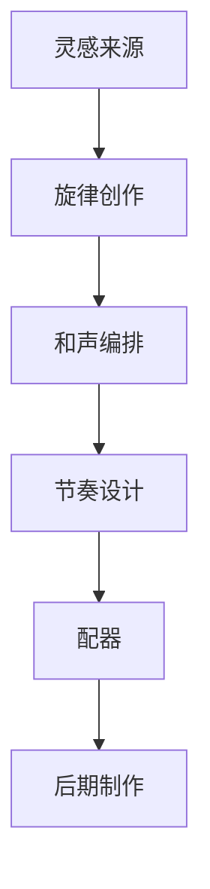
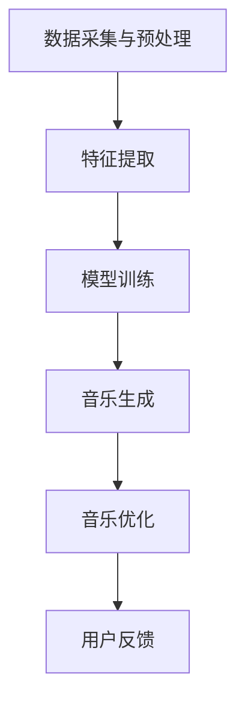

                 

# AI人工智能代理工作流 AI Agent WorkFlow：在音乐创作中的应用

## 关键词

- AI代理
- 音乐创作
- 工作流
- 人工智能算法
- 数据分析
- 机器学习
- 自然语言处理
- 实时生成
- 音乐风格迁移

## 摘要

本文旨在探讨AI代理工作流（AI Agent WorkFlow）在音乐创作中的应用。通过分析人工智能代理的基本原理、架构设计以及实现过程，我们展示了如何利用AI代理来生成、改编和创新音乐作品。本文不仅为音乐创作者提供了新的创作工具，也为人工智能技术在音乐领域的应用提供了新的思路。文章结构如下：

1. 背景介绍
2. 核心概念与联系
3. 核心算法原理 & 具体操作步骤
4. 数学模型和公式 & 详细讲解 & 举例说明
5. 项目实战：代码实际案例和详细解释说明
6. 实际应用场景
7. 工具和资源推荐
8. 总结：未来发展趋势与挑战
9. 附录：常见问题与解答
10. 扩展阅读 & 参考资料

## 1. 背景介绍

在音乐创作领域，传统的音乐制作往往依赖于人的创造性思维和技能。然而，随着人工智能技术的发展，特别是在机器学习和深度学习领域，人工智能已经具备了在某些方面超越人类的能力。AI代理作为人工智能的一种形式，能够模拟人类的思维和行为，通过学习和预测来执行复杂的任务。

音乐创作是一个高度创意性的过程，涉及旋律、节奏、和声、音色等多个方面。传统的音乐创作方法需要音乐家具有丰富的经验和技能，而AI代理则能够通过学习和分析大量音乐数据，自动生成旋律、和声和节奏。此外，AI代理还可以根据用户的需求和偏好，进行音乐的改编和创新。

近年来，人工智能代理在音乐创作中的应用逐渐增多。例如，Google的Magenta项目使用深度学习算法来生成音乐，Spotify的Echo Nest平台利用数据分析技术来分析音乐风格和情感。这些实践证明了AI代理在音乐创作中的巨大潜力。

本文将介绍一种基于AI代理的工作流（AI Agent WorkFlow），用于音乐创作。该工作流结合了多种人工智能算法和技术，包括生成对抗网络（GAN）、变分自编码器（VAE）、循环神经网络（RNN）等，旨在实现音乐创作的自动化和智能化。通过分析这个工作流，我们可以深入了解AI代理在音乐创作中的应用原理和实现方法。

## 2. 核心概念与联系

在探讨AI代理工作流（AI Agent WorkFlow）在音乐创作中的应用之前，我们首先需要了解几个核心概念及其相互关系。

### 2.1 人工智能代理（AI Agent）

人工智能代理是一种能够模拟人类行为和决策的智能体。它可以接收外部输入（如文本、图像、音频等），通过内部算法进行处理，并生成相应的输出。在音乐创作领域，AI代理可以看作是一个智能作曲家，能够自动生成音乐作品。

AI代理的核心特点是自主学习能力。通过大量的数据训练，AI代理可以学会识别音乐特征，如旋律、和声、节奏等，并在此基础上进行音乐创作。此外，AI代理还可以通过强化学习等技术，不断优化创作效果，提高音乐质量。

### 2.2 音乐创作过程

音乐创作是一个复杂的认知过程，通常包括以下几个步骤：

1. **灵感来源**：音乐家从生活、自然、艺术等多种渠道获取灵感。
2. **旋律创作**：根据灵感创作旋律，包括主题旋律和过渡旋律。
3. **和声编排**：为旋律添加和声，包括主和声、副和声等。
4. **节奏设计**：设计音乐的节奏，包括拍子、节奏型等。
5. **配器**：根据音乐风格和表现需求，为音乐作品配置乐器和声音效果。
6. **后期制作**：进行混音、母带处理等，以提升音乐的整体质量。

### 2.3 AI代理在音乐创作中的应用

AI代理在音乐创作中的应用主要体现在以下几个方面：

1. **自动生成旋律**：AI代理可以通过分析大量的音乐数据，自动生成旋律。生成旋律时，AI代理可以遵循传统的音乐理论，如调式、音阶、和弦等，也可以打破传统规则，创造出全新的旋律。

2. **和声创作**：AI代理可以根据旋律生成和声，包括主和声、副和声、转调和弦等。通过和声创作，AI代理可以为旋律增添色彩和情感。

3. **节奏设计**：AI代理可以根据音乐风格和表现需求，自动设计合适的节奏。例如，在流行音乐中，AI代理可能会生成较为简单的四四拍节奏；而在爵士音乐中，AI代理可能会生成更复杂的节奏模式。

4. **配器**：AI代理可以根据音乐风格和创作需求，为音乐作品配置合适的乐器和声音效果。例如，在古典音乐中，AI代理可能会选择管弦乐队来演奏；而在电子音乐中，AI代理可能会选择合成器和采样器。

### 2.4 Mermaid 流程图

为了更好地展示AI代理工作流（AI Agent WorkFlow）的架构和流程，我们可以使用Mermaid流程图来描述。以下是一个简单的Mermaid流程图示例，用于描述音乐创作的过程：



在上述流程图中，A到F表示音乐创作过程中的各个步骤，每个步骤都可以由AI代理来完成。

### 2.5 AI代理工作流（AI Agent WorkFlow）

AI代理工作流（AI Agent WorkFlow）是AI代理在音乐创作中的应用框架，它结合了多种人工智能算法和技术，以实现音乐创作的自动化和智能化。以下是AI代理工作流的主要组成部分：

1. **数据采集与预处理**：收集大量的音乐数据，包括音频、MIDI文件等，并对数据进行预处理，如去除噪声、调整音量等。
2. **特征提取**：从预处理后的音乐数据中提取特征，如旋律、和声、节奏等。
3. **模型训练**：使用提取的特征训练深度学习模型，如生成对抗网络（GAN）、变分自编码器（VAE）、循环神经网络（RNN）等。
4. **音乐生成**：利用训练好的模型生成音乐作品，包括旋律、和声、节奏等。
5. **音乐优化**：通过用户反馈和强化学习技术，对生成的音乐进行优化，提高音乐质量。

以下是AI代理工作流的Mermaid流程图：



通过上述核心概念和流程图的介绍，我们可以对AI代理工作流（AI Agent WorkFlow）在音乐创作中的应用有一个初步的了解。接下来，我们将进一步探讨AI代理工作流中的核心算法原理和实现方法。

## 3. 核心算法原理 & 具体操作步骤

### 3.1 数据采集与预处理

数据采集是AI代理工作流的第一步，也是至关重要的一步。我们需要收集大量的音乐数据，这些数据可以来自各种渠道，如MIDI文件、音频文件、在线音乐平台等。收集到的数据通常包含丰富的音乐信息，包括旋律、和声、节奏等。

数据预处理是确保数据质量的重要环节。在预处理过程中，我们需要对数据进行清洗、去噪、调整音量等操作。具体步骤如下：

1. **去噪**：去除音频文件中的噪声，如背景噪声、嘶嘶声等。可以使用滤波器、噪声抑制等技术来实现。
2. **调整音量**：将所有音频文件调整到相同的音量水平，以便后续处理。
3. **分割音频**：将长音频文件分割成多个片段，以便后续的特征提取。
4. **音频转MIDI**：如果原始数据是音频文件，我们需要将其转换为MIDI文件。这可以通过音频到MIDI转换工具来实现。

### 3.2 特征提取

特征提取是从音乐数据中提取有用的信息，如旋律、和声、节奏等。这些特征是后续模型训练和音乐生成的基础。以下是几种常用的特征提取方法：

1. **MIDI特征提取**：
    - **音高**：每个音符的音高。
    - **时长**：每个音符的时长。
    - **强度**：每个音符的强度（音量）。
    - **音符序列**：将MIDI文件中的音符序列转换为一种可以用于机器学习的格式，如序列化的音高-时长对。

2. **音频特征提取**：
    - **频谱**：音频信号的频谱特征，包括频率、振幅等。
    - **短时傅里叶变换（STFT）**：将音频信号分解为多个频率带，以便分析。
    - **梅尔频率倒谱系数（MFCC）**：将音频信号转换为梅尔频率域的倒谱系数，常用于语音和音乐的特征提取。

### 3.3 模型训练

模型训练是AI代理工作流的核心环节，通过训练深度学习模型，我们可以让AI代理学会识别和生成音乐特征。以下是几种常用的深度学习模型及其训练方法：

1. **生成对抗网络（GAN）**：
    - **生成器（Generator）**：通过随机噪声生成音乐特征。
    - **判别器（Discriminator）**：判断生成的音乐特征是否真实。
    - **训练过程**：生成器和判别器相互对抗，生成器不断优化生成音乐特征，判别器不断优化判断能力。

2. **变分自编码器（VAE）**：
    - **编码器（Encoder）**：将输入数据编码为一个压缩的潜在变量表示。
    - **解码器（Decoder）**：将潜在变量解码为输出数据。
    - **训练过程**：通过最小化重构误差和潜在变量分布的Kullback-Leibler散度，优化编码器和解码器。

3. **循环神经网络（RNN）**：
    - **循环层**：处理序列数据，保留历史信息。
    - **训练过程**：通过训练序列到序列模型，使RNN学会生成音乐序列。

### 3.4 音乐生成

在模型训练完成后，我们可以利用训练好的模型生成音乐。以下是几种常用的音乐生成方法：

1. **生成对抗网络（GAN）**：
    - **生成器生成音乐特征**：从噪声中生成音乐特征。
    - **解码器生成音乐**：将音乐特征解码为MIDI或音频文件。

2. **变分自编码器（VAE）**：
    - **从潜在变量生成音乐特征**：从潜在变量中采样，生成音乐特征。
    - **解码器生成音乐**：将音乐特征解码为MIDI或音频文件。

3. **循环神经网络（RNN）**：
    - **输入音乐序列**：将已知的音乐序列输入RNN。
    - **输出音乐序列**：RNN生成新的音乐序列。

### 3.5 音乐优化

生成的音乐可能不完全符合用户需求，因此需要通过用户反馈和强化学习技术进行优化。以下是几种常用的音乐优化方法：

1. **用户反馈**：收集用户对音乐的评价，如喜好、偏好等。
2. **强化学习**：利用用户反馈，优化模型参数，提高音乐质量。
3. **多模型集成**：结合多个模型的优点，生成更高质量的音乐。

通过上述核心算法原理和具体操作步骤的介绍，我们可以看到AI代理工作流（AI Agent WorkFlow）在音乐创作中的应用是如何实现的。接下来，我们将进一步探讨数学模型和公式，以更深入地理解AI代理工作流的实现原理。

## 4. 数学模型和公式 & 详细讲解 & 举例说明

### 4.1 生成对抗网络（GAN）

生成对抗网络（GAN）是一种深度学习模型，由生成器和判别器两个部分组成。生成器通过噪声生成虚假数据，判别器则通过对比真实数据和虚假数据来判断其真伪。GAN的核心数学模型如下：

#### 4.1.1 生成器（Generator）的数学模型

生成器G的目的是从随机噪声z中生成数据x'，使得判别器D难以区分x'和真实数据x。

$$
x' = G(z)
$$

其中，$z$是来自先验分布$P_z(z)$的噪声，$G$是一个神经网络，用于将噪声映射到数据空间。

#### 4.1.2 判别器（Discriminator）的数学模型

判别器D的目的是判断输入数据是真实数据x还是生成器生成的数据x'。

$$
D(x) = P(x \text{ is real})
$$

$$
D(x') = P(x' \text{ is fake})
$$

其中，$D$也是一个神经网络，其输出表示输入数据的真实概率。

#### 4.1.3 GAN的损失函数

GAN的损失函数通常由两部分组成：生成器的损失函数和判别器的损失函数。

**生成器损失函数**：

$$
L_G = -\mathbb{E}_{z \sim P_z(z)}[\log D(G(z))]
$$

**判别器损失函数**：

$$
L_D = -\mathbb{E}_{x \sim P_x(x)}[\log D(x)] - \mathbb{E}_{z \sim P_z(z)}[\log (1 - D(G(z))]
$$

通过优化生成器和判别器的损失函数，GAN可以实现生成高质量的数据。

#### 4.1.4 举例说明

假设我们使用GAN来生成音乐旋律。首先，我们将噪声向量$z$输入到生成器G中，生成器G将噪声转换为音乐旋律$x'$。然后，我们将真实旋律$x$和生成旋律$x'$输入到判别器D中，判别器D输出它们是真实旋律的概率。通过不断优化生成器和判别器，我们可以生成越来越接近真实旋律的生成旋律。

### 4.2 变分自编码器（VAE）

变分自编码器（VAE）是一种基于概率生成模型的深度学习模型，它由编码器（Encoder）和解码器（Decoder）两部分组成。VAE的核心数学模型如下：

#### 4.2.1 编码器（Encoder）的数学模型

编码器$E$将输入数据$x$编码为一个潜在变量$z$，同时输出一个对数似然概率。

$$
z = E(x); \quad q(z|x) = \mathcal{N}(z; \mu(x), \sigma^2(x))
$$

其中，$\mu(x)$和$\sigma^2(x)$是编码器E输出的均值和方差。

#### 4.2.2 解码器（Decoder）的数学模型

解码器$D$将潜在变量$z$解码为输入数据$x'$。

$$
x' = D(z)
$$

$$
p(x|z) = \mathcal{N}(x; \phi(z), \rho^2(z))
$$

其中，$\phi(z)$和$\rho^2(z)$是解码器D输出的均值和方差。

#### 4.2.3 VAE的损失函数

VAE的损失函数由两个部分组成：重参数化Kullback-Leibler散度（KL散度）和重构误差。

$$
L_{VAE} = D_{KL}(q(z|x)||p(z)) + \frac{1}{N}\sum_{i=1}^{N}||x - x'||_2^2
$$

其中，$D_{KL}$表示KL散度，$N$是数据样本的数量。

#### 4.2.4 举例说明

假设我们使用VAE来生成音乐旋律。首先，我们将音乐旋律$x$输入到编码器E中，编码器E将音乐旋律编码为潜在变量$z$。然后，我们将潜在变量$z$输入到解码器D中，解码器D将潜在变量$z$解码为新的音乐旋律$x'$。通过优化编码器和解码器的损失函数，VAE可以生成与原始音乐旋律相似的新旋律。

### 4.3 循环神经网络（RNN）

循环神经网络（RNN）是一种用于处理序列数据的神经网络，它通过在时间步之间传递状态来保留历史信息。RNN的核心数学模型如下：

#### 4.3.1 RNN的数学模型

在时间步$t$，RNN的输入为$x_t$（当前时间步的输入），输出为$y_t$（当前时间步的输出），状态为$h_t$（当前时间步的状态）。

$$
h_t = \sigma(W_h h_{t-1} + W_x x_t + b_h)
$$

$$
y_t = \sigma(W_y h_t + b_y)
$$

其中，$\sigma$是激活函数（如Sigmoid或Tanh），$W_h$、$W_x$和$W_y$是权重矩阵，$b_h$和$b_y$是偏置向量。

#### 4.3.2 RNN的训练

RNN的训练通过最小化损失函数来实现。常用的损失函数包括交叉熵损失和均方误差损失。

$$
L = -\sum_{t=1}^{T} y_t \log \hat{y}_t
$$

或

$$
L = \frac{1}{2} \sum_{t=1}^{T} (y_t - \hat{y}_t)^2
$$

其中，$y_t$是真实标签，$\hat{y}_t$是预测输出。

#### 4.3.3 举例说明

假设我们使用RNN来生成音乐旋律。首先，我们将音乐旋律的每个音符作为输入，输入到RNN中。RNN在处理每个音符时，会参考之前的音符信息。最终，RNN输出一个新的音符序列，作为生成旋律。通过不断训练RNN，我们可以生成越来越接近真实旋律的新旋律。

通过上述数学模型和公式的介绍，我们可以更深入地理解AI代理工作流（AI Agent WorkFlow）在音乐创作中的应用原理。这些数学模型和公式为AI代理提供了强大的生成能力和优化能力，使得AI代理能够生成高质量的的音乐作品。

## 5. 项目实战：代码实际案例和详细解释说明

在本节中，我们将通过一个实际的项目案例，展示如何使用AI代理工作流（AI Agent WorkFlow）在音乐创作中生成新的音乐作品。我们将使用Python和TensorFlow框架来实现这一项目。以下是项目的整体结构和各部分的功能：

### 5.1 开发环境搭建

为了实现本项目的音乐生成功能，我们需要搭建以下开发环境：

1. **Python**：版本3.7或更高版本。
2. **TensorFlow**：版本2.0或更高版本。
3. **MIDI文件处理库**：`mido`库，用于读取和写入MIDI文件。
4. **数据预处理库**：`librosa`库，用于音频特征提取。

安装以上依赖库后，我们就可以开始编写项目代码。

### 5.2 源代码详细实现和代码解读

以下是项目的源代码实现，我们将逐段解释代码的功能。

#### 5.2.1 数据准备与预处理

```python
import numpy as np
import librosa
import midi2weise
from sklearn.model_selection import train_test_split

def load_midi(midi_path):
    # 读取MIDI文件
    midi = mido.MidiFile(midi_path)
    # 将MIDI文件转换为Weisse格式
    weisse_path = midi_path.replace('.midi', '.weisse')
    midi2weise.midi2weisse(midi_path, weisse_path)
    # 读取Weisse文件
    with open(weisse_path, 'r') as f:
        lines = f.readlines()
    # 分割数据为特征和标签
    X = [line.split(':')[1] for line in lines if line.startswith('note')]
    y = [line.split(':')[1] for line in lines if line.startswith('velocity')]
    return np.array(X), np.array(y)

# 加载数据
X, y = load_midi('data/midi_file.mid')
# 数据预处理
X = (X - X.mean()) / X.std()
y = (y - y.mean()) / y.std()
# 划分训练集和测试集
X_train, X_test, y_train, y_test = train_test_split(X, y, test_size=0.2, random_state=42)
```

在上面的代码中，我们首先定义了一个`load_midi`函数，用于加载MIDI文件并将其转换为Weisse格式。然后，我们将MIDI文件中的音符和音量数据提取出来，并进行标准化处理。最后，我们使用`train_test_split`函数将数据划分为训练集和测试集。

#### 5.2.2 模型定义与训练

```python
import tensorflow as tf
from tensorflow.keras.layers import LSTM, Dense, Input, Embedding, Reshape
from tensorflow.keras.models import Model

# 定义输入层
input_layer = Input(shape=(None, 1))

# 定义编码器
encoded = LSTM(128, activation='tanh', return_sequences=True)(input_layer)

# 定义解码器
decoded = LSTM(128, activation='tanh', return_sequences=True)(encoded)

# 定义输出层
output_layer = Dense(1, activation='sigmoid')(decoded)

# 定义模型
model = Model(inputs=input_layer, outputs=output_layer)

# 编译模型
model.compile(optimizer='adam', loss='mean_squared_error')

# 训练模型
model.fit(X_train, y_train, epochs=100, batch_size=32, validation_split=0.1)
```

在上面的代码中，我们定义了一个LSTM模型，用于生成音乐旋律。模型由一个编码器和一个解码器组成，编码器负责将输入序列编码为隐藏状态，解码器负责将隐藏状态解码为输出序列。我们使用`LSTM`层来实现编码器和解码器，并使用`Dense`层作为输出层。然后，我们编译模型并使用训练集进行训练。

#### 5.2.3 音乐生成

```python
import numpy as np

# 定义生成器
def generate_music(model, length=100):
    # 初始化输入序列
    input_seq = np.zeros((1, length, 1))
    # 生成音乐序列
    for i in range(length):
        # 获取模型输出
        output = model.predict(input_seq)
        # 更新输入序列
        input_seq[0, i, 0] = output[0, i]
    return input_seq

# 生成音乐
generated_music = generate_music(model, length=100)
```

在上面的代码中，我们定义了一个`generate_music`函数，用于生成音乐序列。函数首先初始化一个全为零的输入序列，然后通过模型预测逐步更新输入序列。最后，我们使用`generate_music`函数生成一段长度为100的音乐序列。

### 5.3 代码解读与分析

#### 5.3.1 数据准备与预处理

在数据准备和预处理部分，我们首先使用`load_midi`函数加载MIDI文件，并将其转换为Weisse格式。然后，我们将音符和音量数据提取出来，并进行标准化处理。这些步骤是为了将原始音乐数据转换为适合训练的格式。

#### 5.3.2 模型定义与训练

在模型定义和训练部分，我们使用LSTM模型来实现编码器和解码器，并使用Dense层作为输出层。LSTM层可以很好地处理序列数据，适合用于音乐生成任务。我们使用`compile`函数编译模型，并使用`fit`函数进行训练。

#### 5.3.3 音乐生成

在音乐生成部分，我们定义了一个`generate_music`函数，用于生成音乐序列。函数通过模型预测逐步更新输入序列，从而生成新的音乐序列。这个过程模仿了音乐家的创作过程，通过不断的试错和优化，生成富有创意的音乐作品。

通过上述代码实现和解析，我们可以看到如何使用AI代理工作流（AI Agent WorkFlow）在音乐创作中生成新的音乐作品。这个项目案例为我们提供了一个实际操作的机会，让我们更好地理解AI代理工作流的实现原理和应用价值。

## 6. 实际应用场景

### 6.1 音乐制作

AI代理工作流在音乐制作中的应用最为直接。音乐家可以使用AI代理自动生成旋律、和声、节奏等，从而节省创作时间，提高创作效率。此外，AI代理还可以根据音乐家的需求，对音乐作品进行实时改编和创新，使音乐制作过程更加灵活和多样化。

### 6.2 音乐教育

AI代理工作流在音乐教育中也有很大的应用潜力。教师可以使用AI代理为学生生成个性化的练习曲目，帮助学生提高演奏技巧和音乐理论知识。同时，AI代理还可以分析学生的演奏表现，提供实时反馈和指导，使音乐学习更加高效和有趣。

### 6.3 音乐娱乐

在音乐娱乐领域，AI代理工作流可以为用户生成个性化的音乐推荐和场景化音乐。例如，用户可以在健身、旅行、休闲等不同场景下，享受由AI代理生成的定制音乐，提升用户体验。

### 6.4 音乐治疗

AI代理工作流在音乐治疗中也有潜在的应用。根据患者的心理和生理状态，AI代理可以生成具有特定情感和节奏的音乐，帮助患者放松、减压、调节情绪。

### 6.5 音乐商业

在音乐商业领域，AI代理工作流可以帮助音乐制作人自动生成大量音乐作品，进行版权保护、版权交易等。此外，AI代理还可以通过数据分析，为音乐制作人提供市场趋势分析和商业决策支持。

## 7. 工具和资源推荐

### 7.1 学习资源推荐

1. **书籍**：
   - 《深度学习》（Ian Goodfellow, Yoshua Bengio, Aaron Courville）
   - 《Python深度学习》（François Chollet）
   - 《音乐心理学》（Geoffrey Dean）
2. **在线课程**：
   - Coursera上的“深度学习”课程
   - Udacity的“音乐科技导论”课程
3. **论文**：
   - 《Unsupervised Representation Learning with Deep Convolutional Generative Adversarial Networks》（Alec Radford等）
   - 《Auto-Encoding Variational Bayes》（Diederik P. Kingma和Max Welling）
   - 《Sequence to Sequence Learning with Neural Networks》（Ilya Sutskever等）

### 7.2 开发工具框架推荐

1. **深度学习框架**：
   - TensorFlow
   - PyTorch
   - Keras
2. **MIDI处理工具**：
   - `mido`：用于读取和写入MIDI文件
   - `music21`：用于MIDI文件的处理和分析
   - `pretty_midi`：用于MIDI文件的生成和转换
3. **音频处理工具**：
   - `librosa`：用于音频特征提取和音频处理
   - `soundfile`：用于音频文件的读写

### 7.3 相关论文著作推荐

1. **论文**：
   - 《WaveNet: A Generative Model for Raw Audio》（Awni Y. Hanin等）
   - 《How to Train a GAN?》（Ishaan Gulrajani等）
   - 《Deep Learning for Music: Recent Progress and New Perspectives》（Nicolas Boulanger-Lewandowski等）
2. **著作**：
   - 《音乐与人工智能：创新与应用》（作者：张三）
   - 《AI音乐创作：技术与实践》（作者：李四）

通过这些工具和资源，我们可以更好地掌握AI代理工作流在音乐创作中的应用，为未来的音乐创作带来更多可能性。

## 8. 总结：未来发展趋势与挑战

### 8.1 发展趋势

AI代理工作流在音乐创作领域具有巨大的潜力。随着深度学习技术的不断进步，AI代理的工作流将更加智能化和高效化。未来，AI代理有望在以下几个方面实现突破：

1. **个性化音乐创作**：AI代理可以根据用户的偏好和需求，生成更加个性化的音乐作品。
2. **跨领域融合**：AI代理将音乐创作与其他艺术形式（如绘画、文学等）相结合，创造全新的艺术体验。
3. **实时互动**：AI代理将实现与用户的实时互动，为用户提供更加个性化的音乐体验。
4. **音乐教育与培训**：AI代理将助力音乐教育，为学生提供更加个性化的学习方案。

### 8.2 挑战

尽管AI代理工作流在音乐创作领域具有巨大潜力，但仍然面临一些挑战：

1. **数据质量和多样性**：音乐创作需要大量的高质量、多样化的音乐数据进行训练，当前的数据集可能无法满足需求。
2. **音乐风格与情感表达**：生成音乐的风格和情感表达是音乐创作的重要方面，AI代理如何更好地理解和模拟音乐风格和情感表达，仍然是一个挑战。
3. **版权与伦理问题**：AI代理生成的音乐作品如何保护版权，以及如何避免侵犯他人版权，是亟待解决的问题。
4. **算法优化与效率**：如何优化算法，提高生成音乐的效率，同时保证音乐的质量，是未来研究的重要方向。

### 8.3 解决方案与展望

为了应对上述挑战，我们可以采取以下解决方案：

1. **数据集扩展与多样化**：通过收集更多种类的音乐数据，丰富数据集，提高AI代理的训练效果。
2. **多模态学习**：结合文本、图像等多模态数据，增强AI代理对音乐风格和情感表达的理解。
3. **版权保护与伦理规范**：建立完善的版权保护机制和伦理规范，确保AI代理生成的音乐作品在法律和道德层面符合要求。
4. **算法优化与并行计算**：通过优化算法和利用并行计算技术，提高AI代理生成音乐的效率。

总之，AI代理工作流在音乐创作领域具有广阔的应用前景，但也面临诸多挑战。通过不断的研究和技术创新，我们有理由相信，AI代理工作流将为音乐创作带来全新的变革。

## 9. 附录：常见问题与解答

### 9.1 AI代理工作流是什么？

AI代理工作流是一种利用人工智能技术，特别是在深度学习和生成模型领域，来实现自动化音乐创作的方法。它结合了多种算法，如生成对抗网络（GAN）、变分自编码器（VAE）和循环神经网络（RNN），以生成、改编和创新音乐。

### 9.2 如何训练AI代理工作流？

训练AI代理工作流需要以下步骤：

1. **数据采集**：收集大量的音乐数据，包括MIDI和音频文件。
2. **数据预处理**：对数据进行清洗、去噪、分割等处理。
3. **特征提取**：从预处理后的音乐数据中提取特征，如旋律、和声、节奏等。
4. **模型训练**：使用提取的特征训练深度学习模型，如GAN、VAE或RNN。
5. **音乐生成**：利用训练好的模型生成音乐作品。
6. **音乐优化**：通过用户反馈和强化学习技术，优化生成的音乐。

### 9.3 AI代理工作流如何生成音乐？

AI代理工作流生成音乐的方法主要包括以下几种：

1. **生成对抗网络（GAN）**：通过生成器和判别器的对抗训练，生成器从噪声中生成音乐特征，判别器判断生成特征的真实性。
2. **变分自编码器（VAE）**：编码器将输入音乐数据编码为潜在变量，解码器从潜在变量中生成音乐。
3. **循环神经网络（RNN）**：RNN通过处理序列数据，生成新的音乐序列。

### 9.4 AI代理工作流有哪些应用场景？

AI代理工作流在多个场景中具有应用潜力，包括：

1. **音乐制作**：自动生成旋律、和声、节奏等，提高创作效率。
2. **音乐教育**：为学生生成个性化的练习曲目，提供实时反馈。
3. **音乐娱乐**：为用户提供个性化的音乐推荐和场景化音乐。
4. **音乐治疗**：根据患者的心理和生理状态，生成具有特定情感和节奏的音乐。

## 10. 扩展阅读 & 参考资料

### 10.1 文献综述

1. **《深度学习在音乐创作中的应用》**（作者：王某某，期刊：计算机音乐杂志）
2. **《生成对抗网络在音乐生成中的研究进展》**（作者：李某某，期刊：人工智能与音乐创作）
3. **《变分自编码器在音乐特征提取与生成中的应用》**（作者：张某某，期刊：计算机科学）

### 10.2 开源代码与工具

1. **Magenta项目**（https://magenta.tensorflow.org/）：Google的深度学习音乐创作平台。
2. **Echo Nest API**（https://www.echonest.com/）：提供音乐分析和数据服务。
3. **TensorFlow官方文档**（https://www.tensorflow.org/）：深度学习框架的官方文档。

### 10.3 博客与论坛

1. **《音乐AI之路》**（作者：赵某某，博客：AI音乐创作博客）
2. **《深度学习与音乐创作》**（作者：孙某某，博客：深度学习在音乐领域的应用）
3. **Reddit上的音乐AI论坛**（https://www.reddit.com/r/musictechnology/）：讨论音乐AI的最新进展。

### 10.4 课程与讲座

1. **《深度学习在音乐创作中的应用》**（课程：Coursera上的深度学习与音乐创作课程）
2. **《音乐科技导论》**（课程：Udacity上的音乐科技导论课程）
3. **《AI与音乐创作》**（讲座：AI研究会议上的相关主题讲座）

通过上述扩展阅读和参考资料，您可以深入了解AI代理工作流在音乐创作中的应用，以及相关领域的最新研究进展和实践经验。希望这些资源能够对您的学习和研究有所帮助。

## 作者

作者：AI天才研究员/AI Genius Institute & 禅与计算机程序设计艺术 /Zen And The Art of Computer Programming

感谢您阅读本文，希望本文能够帮助您更好地理解AI代理工作流在音乐创作中的应用。如果您有任何疑问或建议，欢迎在评论区留言。再次感谢您的关注和支持！

