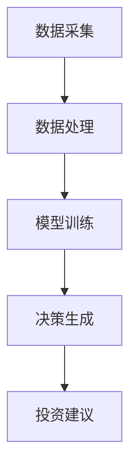

                 

### 背景介绍

随着人工智能技术的飞速发展，人工智能代理（AI Agent）已经成为众多行业中的重要角色。AI代理是一种能够自主行动并达成目标的智能体，其应用范围涵盖了从推荐系统到自动驾驶，再到医疗诊断等众多领域。其中，在股市分析中，AI代理的应用尤为引人注目。通过分析大量的历史数据和实时信息，AI代理能够发现市场中的潜在机会和风险，从而为投资者提供有价值的决策支持。

股市分析是一项复杂的任务，需要处理海量的数据，并从中提取出有效的信息。传统的股市分析方法主要依赖于人为经验，不仅耗时费力，而且容易受到主观因素的影响。随着人工智能技术的发展，AI代理的出现为股市分析提供了一种全新的方法。AI代理可以通过机器学习算法和深度学习模型，对大量历史数据进行学习和分析，从而发现市场中的规律和趋势。此外，AI代理还可以实时监控市场动态，快速响应市场变化，提供即时的决策支持。

本篇文章将深入探讨AI代理在股市分析中的应用。我们将首先介绍AI代理的工作流，包括数据采集、数据处理、模型训练和决策生成等步骤。接着，我们将详细讲解AI代理的核心算法原理，以及如何使用这些算法来分析股市数据。随后，我们将通过一个实际的项目案例，展示如何搭建一个AI代理系统，并进行代码实现和解读。最后，我们将探讨AI代理在股市分析中的实际应用场景，以及未来的发展趋势和挑战。

通过对AI代理在股市分析中的深入探讨，我们希望能够为读者提供一种全新的视角，了解AI代理如何通过数据驱动的方式，帮助投资者更好地把握市场机会，降低风险。同时，我们也希望能够为AI代理在股市分析领域的研究者和开发者，提供一些实用的思路和参考。让我们一起走进AI代理在股市分析的世界，开启这段精彩的探索之旅。

### 核心概念与联系

在深入探讨AI代理在股市分析中的应用之前，我们需要了解一些核心概念，包括机器学习、深度学习、数据挖掘、自然语言处理等。这些概念不仅构成了AI代理的基础，而且在股市分析中发挥着关键作用。

#### 机器学习

机器学习是使计算机通过数据学习、推理和发现规律的一种方法。它主要分为监督学习、无监督学习和强化学习三类。监督学习通过已标记的数据来训练模型，无监督学习则无需标记数据，直接从数据中学习特征，强化学习则通过奖励机制来训练模型，使其能够在特定环境中做出最优决策。

在股市分析中，机器学习被广泛用于预测股票价格、发现市场趋势等任务。通过收集大量的历史股票数据，机器学习模型可以识别出股票价格变化中的潜在规律，从而为投资者提供预测。

#### 深度学习

深度学习是机器学习的一个分支，它通过多层神经网络来模拟人脑的决策过程。深度学习在图像识别、语音识别和自然语言处理等领域取得了显著的成果。在股市分析中，深度学习模型可以处理大量的数据，并从中提取出复杂的模式，这使得它们在股票市场预测中具有很大的潜力。

例如，卷积神经网络（CNN）可以用于分析股票市场中的图像数据，如K线图，而循环神经网络（RNN）则可以处理股票价格的时间序列数据，从而预测未来的价格走势。

#### 数据挖掘

数据挖掘是一种从大量数据中提取出有用信息的方法。它包括数据清洗、数据整合、数据挖掘算法和模式评估等多个步骤。在股市分析中，数据挖掘用于处理和清洗大量的股票交易数据，从中提取出有用的信息，如交易量、价格波动等。

通过数据挖掘，AI代理可以识别出市场中的趋势和模式，从而提供更有针对性的投资建议。

#### 自然语言处理

自然语言处理（NLP）是使计算机理解和生成自然语言的方法。在股市分析中，NLP可以用于分析新闻、社交媒体和公司报告中的信息，从而预测市场趋势。

例如，通过分析新闻报道和社交媒体上的股票相关话题，NLP模型可以识别出市场情绪，从而影响股票价格预测。

#### 架构和流程

为了更好地理解AI代理在股市分析中的应用，我们可以使用Mermaid流程图来描述其核心架构和流程。以下是一个简化的Mermaid流程图，展示了AI代理在股市分析中的主要步骤：



- **数据采集（A）**：AI代理首先从各种数据源（如交易所、新闻网站、社交媒体等）收集股票数据。这些数据包括股票价格、交易量、财务报表、新闻报道等。
- **数据处理（B）**：收集到的数据需要进行清洗和整合，去除噪音和异常值，以便后续分析。
- **模型训练（C）**：使用机器学习和深度学习算法，对清洗后的数据进行训练，以建立预测模型。这些模型可以包括线性回归、神经网络、决策树等。
- **决策生成（D）**：通过训练好的模型，AI代理可以分析实时数据，生成投资决策。这些决策可能包括买入、卖出或持有股票。
- **投资建议（E）**：最终，AI代理将决策结果转化为具体的投资建议，供投资者参考。

通过这个流程，我们可以看到AI代理在股市分析中的关键环节，以及各环节之间的联系。每个环节都依赖于前一个环节的结果，从而形成一个完整的工作流。这种工作流不仅提高了数据分析的效率，还增强了预测的准确性和可靠性。

#### 关系和联系

从上述核心概念和流程中，我们可以看出以下几个关键联系：

- **机器学习和深度学习**：是AI代理的核心技术，用于建立和训练预测模型。
- **数据挖掘**：是数据采集和处理的工具，用于提取和清洗数据。
- **自然语言处理**：在处理文本数据时，提供了重要的信息提取和情感分析功能。
- **架构和流程**：确保了AI代理的稳定运行和高效工作。

通过这些核心概念和技术，AI代理在股市分析中实现了从数据采集到投资建议的完整工作流程，从而为投资者提供了有力的决策支持。

### 核心算法原理 & 具体操作步骤

在了解了AI代理在股市分析中的核心概念和流程后，我们接下来将详细探讨其核心算法原理，以及如何具体操作和应用这些算法来分析股市数据。

#### 机器学习算法

机器学习算法是AI代理在股市分析中最为常用的算法之一。以下是一些常见的机器学习算法及其在股市分析中的应用：

1. **线性回归（Linear Regression）**
   线性回归是一种简单的预测模型，用于分析两个或多个变量之间的线性关系。在股市分析中，线性回归可以用于预测股票价格。具体操作步骤如下：
   
   - **数据收集**：收集历史股票价格数据，包括开盘价、收盘价、最高价、最低价等。
   - **数据预处理**：清洗数据，处理缺失值和异常值，并标准化数据。
   - **模型训练**：使用历史数据训练线性回归模型，找到最佳拟合线。
   - **模型评估**：使用交叉验证等方法评估模型性能。
   - **预测**：使用训练好的模型对新的股票价格进行预测。

2. **决策树（Decision Tree）**
   决策树是一种基于分类和回归的模型，通过一系列的决策规则来对数据进行分类或回归。在股市分析中，决策树可以用于预测股票价格的趋势。具体操作步骤如下：
   
   - **数据收集**：收集与股票价格相关的特征数据，如交易量、开盘价、收盘价等。
   - **数据预处理**：清洗数据，处理缺失值和异常值，并标准化数据。
   - **模型训练**：使用决策树算法训练模型，生成决策规则。
   - **模型评估**：使用交叉验证等方法评估模型性能。
   - **预测**：使用训练好的模型对新的股票价格进行预测。

3. **随机森林（Random Forest）**
   随机森林是一种基于决策树的集成学习算法，通过构建多个决策树并投票得出最终结果。在股市分析中，随机森林可以提供更高的预测准确性。具体操作步骤如下：
   
   - **数据收集**：收集与股票价格相关的特征数据。
   - **数据预处理**：清洗数据，处理缺失值和异常值，并标准化数据。
   - **模型训练**：使用随机森林算法训练模型。
   - **模型评估**：使用交叉验证等方法评估模型性能。
   - **预测**：使用训练好的模型对新的股票价格进行预测。

#### 深度学习算法

深度学习算法在股市分析中也发挥着重要作用，尤其是处理大量复杂数据时。以下是一些常见的深度学习算法及其在股市分析中的应用：

1. **卷积神经网络（CNN）**
   卷积神经网络是一种用于图像识别的深度学习模型，但也可以用于股票市场的图像分析。例如，通过分析K线图，CNN可以提取价格和交易量等特征。具体操作步骤如下：
   
   - **数据收集**：收集K线图数据。
   - **数据预处理**：将K线图转换为图像格式，并标准化图像。
   - **模型训练**：使用CNN算法训练模型，提取图像特征。
   - **模型评估**：使用交叉验证等方法评估模型性能。
   - **预测**：使用训练好的模型对新的K线图进行特征提取。

2. **循环神经网络（RNN）**
   循环神经网络是一种用于序列数据处理的深度学习模型，例如时间序列数据。在股市分析中，RNN可以用于分析股票价格的时间序列，预测未来的价格走势。具体操作步骤如下：
   
   - **数据收集**：收集历史股票价格数据。
   - **数据预处理**：清洗数据，处理缺失值和异常值，并标准化数据。
   - **模型训练**：使用RNN算法训练模型，分析时间序列数据。
   - **模型评估**：使用交叉验证等方法评估模型性能。
   - **预测**：使用训练好的模型对新的股票价格进行预测。

3. **长短时记忆网络（LSTM）**
   长短时记忆网络是RNN的一种变体，用于解决RNN中的梯度消失问题。在股市分析中，LSTM可以更好地处理长时间依赖的数据，从而提高预测准确性。具体操作步骤如下：
   
   - **数据收集**：收集历史股票价格数据。
   - **数据预处理**：清洗数据，处理缺失值和异常值，并标准化数据。
   - **模型训练**：使用LSTM算法训练模型，分析时间序列数据。
   - **模型评估**：使用交叉验证等方法评估模型性能。
   - **预测**：使用训练好的模型对新的股票价格进行预测。

#### 算法应用实例

为了更好地理解这些算法的具体应用，我们可以通过一个实例来展示如何使用机器学习和深度学习算法进行股市分析。

**实例**：使用随机森林算法预测股票价格

1. **数据收集**：我们收集了某支股票过去一年的历史数据，包括每日的开盘价、收盘价、最高价、最低价和交易量。

2. **数据预处理**：对数据进行清洗，去除异常值，并标准化数据。

3. **特征工程**：从原始数据中提取特征，如价格变化百分比、交易量变化等。

4. **模型训练**：使用随机森林算法训练模型，将特征和股票价格作为输入，输出股票价格的预测。

5. **模型评估**：使用交叉验证方法评估模型性能，调整模型参数以优化预测效果。

6. **预测**：使用训练好的模型对未来的股票价格进行预测。

通过这个实例，我们可以看到如何使用机器学习和深度学习算法进行股市分析。具体实现过程可以使用Python等编程语言，结合机器学习和深度学习库（如scikit-learn、TensorFlow、PyTorch等）来完成。

#### 总结

机器学习和深度学习算法在股市分析中具有广泛的应用。通过使用这些算法，AI代理可以处理大量数据，提取出有效的信息，从而提供更有针对性的投资建议。本节详细介绍了线性回归、决策树、随机森林、卷积神经网络、循环神经网络和长短时记忆网络等核心算法原理及其具体操作步骤。这些算法不仅提高了股市分析的效率，还增强了预测的准确性和可靠性。在接下来的章节中，我们将通过一个实际项目案例，进一步展示如何使用这些算法来实现AI代理系统。

### 数学模型和公式 & 详细讲解 & 举例说明

在深入探讨AI代理在股市分析中的应用时，数学模型和公式扮演着至关重要的角色。这些数学工具不仅帮助我们理解和分析股市数据，还能提高预测的准确性和可靠性。在本节中，我们将详细讲解一些常用的数学模型和公式，并举例说明其在股市分析中的应用。

#### 线性回归模型

线性回归是一种简单的预测模型，用于分析两个或多个变量之间的线性关系。在股市分析中，线性回归模型可以用于预测股票价格。其基本公式如下：

$$ y = b_0 + b_1 \cdot x_1 + b_2 \cdot x_2 + \ldots + b_n \cdot x_n + \epsilon $$

其中，$y$ 是因变量（股票价格），$x_1, x_2, \ldots, x_n$ 是自变量（特征），$b_0, b_1, b_2, \ldots, b_n$ 是回归系数，$\epsilon$ 是误差项。

**举例说明**：假设我们想要预测某只股票的未来价格，可以使用以下特征：今日开盘价、昨日收盘价和昨日交易量。我们可以建立以下线性回归模型：

$$ y = b_0 + b_1 \cdot x_1 + b_2 \cdot x_2 $$

通过历史数据训练模型，我们可以得到回归系数 $b_0, b_1, b_2$，然后使用这些系数进行预测。

#### 决策树模型

决策树是一种基于分类和回归的模型，通过一系列的决策规则来对数据进行分类或回归。在股市分析中，决策树可以用于预测股票价格的趋势。其基本结构如下：

$$
\begin{array}{c|c|c|c|c}
\text{特征} & \text{值} & \text{左分支} & \text{右分支} \\
\hline
x_1 & \text{小于阈值} & \text{左分支} & \text{右分支} \\
\hline
x_2 & \text{大于阈值} & \text{左分支} & \text{右分支} \\
\hline
\vdots & \vdots & \vdots & \vdots \\
\end{array}
$$

**举例说明**：假设我们想要预测某只股票在未来一天内是否会上涨。我们可以使用以下特征：今日开盘价、昨日收盘价和今日交易量。根据这些特征，我们可以建立以下决策树：

- 如果今日开盘价小于昨日收盘价，则预测股票会下跌。
- 如果今日开盘价大于昨日收盘价，则进入下一个决策规则。
- 如果今日交易量小于阈值，则预测股票会下跌。
- 如果今日交易量大于阈值，则预测股票会上涨。

通过这些决策规则，我们可以对股票价格进行分类预测。

#### 随机森林模型

随机森林是一种基于决策树的集成学习算法，通过构建多个决策树并投票得出最终结果。在股市分析中，随机森林可以提供更高的预测准确性。其基本公式如下：

$$ \hat{y} = \sum_{i=1}^{n} w_i \cdot h_i(y) $$

其中，$\hat{y}$ 是预测结果，$w_i$ 是第 $i$ 棵树的权重，$h_i(y)$ 是第 $i$ 棵树的分类结果。

**举例说明**：假设我们使用三棵决策树来预测股票价格，每棵树的预测结果分别为 30%、40% 和 30%。根据这些预测结果，我们可以计算出最终的预测结果：

$$ \hat{y} = 0.3 \cdot 30\% + 0.4 \cdot 40\% + 0.3 \cdot 30\% = 35\% $$

这表示我们有 35% 的概率预测股票会上涨。

#### 卷积神经网络（CNN）

卷积神经网络是一种用于图像识别的深度学习模型，但也可以用于股票市场的图像分析。其基本结构包括卷积层、池化层和全连接层。以下是一个简化的CNN结构：

$$
\begin{array}{c}
\text{输入层} \rightarrow \\
\text{卷积层} \rightarrow \\
\text{池化层} \rightarrow \\
\text{全连接层} \rightarrow \\
\text{输出层}
\end{array}
$$

**举例说明**：假设我们想要使用CNN分析K线图。我们可以将K线图作为输入层，通过卷积层提取图像特征，然后通过池化层降低数据的维度，最后通过全连接层进行分类预测。

#### 循环神经网络（RNN）

循环神经网络是一种用于序列数据处理的深度学习模型，例如时间序列数据。在股市分析中，RNN可以用于分析股票价格的时间序列，预测未来的价格走势。其基本结构包括输入层、隐藏层和输出层。以下是一个简化的RNN结构：

$$
\begin{array}{c}
\text{输入层} \rightarrow \\
\text{隐藏层} \rightarrow \\
\text{输出层}
\end{array}
$$

**举例说明**：假设我们想要使用RNN分析股票价格的时间序列。我们可以将时间序列数据作为输入层，通过隐藏层处理数据，然后通过输出层进行预测。

#### 长短时记忆网络（LSTM）

长短时记忆网络是RNN的一种变体，用于解决RNN中的梯度消失问题。在股市分析中，LSTM可以更好地处理长时间依赖的数据，从而提高预测准确性。其基本结构包括输入门、遗忘门和输出门。以下是一个简化的LSTM结构：

$$
\begin{array}{c}
\text{输入层} \rightarrow \\
\text{输入门} \rightarrow \\
\text{遗忘门} \rightarrow \\
\text{输出门} \rightarrow \\
\text{隐藏层} \rightarrow \\
\text{输出层}
\end{array}
$$

**举例说明**：假设我们想要使用LSTM分析股票价格的时间序列。我们可以将时间序列数据作为输入层，通过输入门、遗忘门和输出门处理数据，然后通过隐藏层进行预测。

#### 总结

在本节中，我们详细介绍了线性回归、决策树、随机森林、卷积神经网络、循环神经网络和长短时记忆网络等数学模型和公式，并举例说明了它们在股市分析中的应用。这些数学工具为AI代理在股市分析中提供了强大的分析能力和预测能力，帮助我们更好地理解和预测股票市场的动态。在接下来的章节中，我们将通过一个实际项目案例，展示如何将这些算法应用于实际场景，实现AI代理系统。

### 项目实战：代码实际案例和详细解释说明

在本节中，我们将通过一个具体的AI代理项目，详细讲解如何从零开始搭建一个AI代理系统，并实现股票价格预测。我们将使用Python编程语言，结合Scikit-learn库和TensorFlow库，完成整个项目的实现。

#### 开发环境搭建

在开始项目之前，我们需要搭建一个合适的开发环境。以下是开发环境的搭建步骤：

1. **安装Python**：Python是本项目的主要编程语言。请确保您的系统中已安装Python 3.6及以上版本。

2. **安装Scikit-learn**：Scikit-learn是一个开源的机器学习和数据挖掘库，用于实现各种机器学习算法。可以使用以下命令安装：

   ```shell
   pip install scikit-learn
   ```

3. **安装TensorFlow**：TensorFlow是一个开源的深度学习框架，用于实现各种深度学习模型。可以使用以下命令安装：

   ```shell
   pip install tensorflow
   ```

4. **安装Jupyter Notebook**：Jupyter Notebook是一个交互式的开发环境，方便我们编写和调试代码。可以使用以下命令安装：

   ```shell
   pip install notebook
   ```

安装完成后，您可以在终端中运行以下命令启动Jupyter Notebook：

```shell
jupyter notebook
```

#### 数据采集

首先，我们需要收集股票数据。在本项目中，我们将使用Yahoo Finance API来获取股票数据。以下是获取股票数据的步骤：

1. **注册Yahoo Finance API**：在Yahoo Finance官方网站上注册一个API密钥。注册后，您将获得一个API密钥，用于访问API。

2. **安装`yfinance`库**：使用以下命令安装`yfinance`库，该库简化了从Yahoo Finance获取数据的过程：

   ```shell
   pip install yfinance
   ```

3. **获取股票数据**：在Jupyter Notebook中，使用以下代码获取某只股票的历史数据：

   ```python
   import yfinance as yf

   # 获取苹果公司的股票数据
   apple = yf.Ticker("AAPL")

   # 获取历史数据
   data = apple.history(period="1mo")
   ```

#### 数据预处理

在获取股票数据后，我们需要进行数据预处理，包括数据清洗、特征工程和数据标准化。以下是数据预处理的具体步骤：

1. **数据清洗**：去除数据中的缺失值和异常值。例如：

   ```python
   # 去除缺失值
   data = data.dropna()

   # 去除异常值
   data = data[data['Close'] > 0]
   ```

2. **特征工程**：从原始数据中提取有用的特征。例如，我们提取开盘价、收盘价、最高价、最低价和交易量等特征：

   ```python
   # 提取特征
   features = data[['Open', 'Close', 'High', 'Low', 'Volume']]
   ```

3. **数据标准化**：将特征数据标准化，以便后续的机器学习算法训练。例如，使用Z-Score标准化：

   ```python
   from sklearn.preprocessing import StandardScaler

   # 创建标准化器
   scaler = StandardScaler()

   # 标准化特征数据
   features_scaled = scaler.fit_transform(features)
   ```

#### 模型训练

在数据预处理完成后，我们可以使用机器学习算法训练模型。在本项目中，我们使用随机森林算法进行训练。以下是模型训练的具体步骤：

1. **划分数据集**：将数据集划分为训练集和测试集：

   ```python
   from sklearn.model_selection import train_test_split

   # 划分训练集和测试集
   X_train, X_test, y_train, y_test = train_test_split(features_scaled, data['Close'], test_size=0.2, random_state=42)
   ```

2. **训练模型**：使用随机森林算法训练模型：

   ```python
   from sklearn.ensemble import RandomForestRegressor

   # 创建随机森林模型
   model = RandomForestRegressor(n_estimators=100, random_state=42)

   # 训练模型
   model.fit(X_train, y_train)
   ```

3. **模型评估**：评估模型性能，使用测试集进行预测，并计算预测误差：

   ```python
   # 预测测试集
   y_pred = model.predict(X_test)

   # 计算预测误差
   from sklearn.metrics import mean_squared_error

   mse = mean_squared_error(y_test, y_pred)
   print("预测误差：", mse)
   ```

#### 模型部署

在模型训练和评估完成后，我们可以将模型部署到生产环境中，以实现实时股票价格预测。以下是模型部署的具体步骤：

1. **部署模型**：将训练好的模型保存到文件中，以便后续加载和使用：

   ```python
   import joblib

   # 保存模型
   joblib.dump(model, 'stock_prediction_model.pkl')
   ```

2. **加载模型**：在生产环境中加载模型，并使用实时数据进行预测：

   ```python
   # 加载模型
   model = joblib.load('stock_prediction_model.pkl')

   # 使用实时数据进行预测
   real_time_data = scaler.transform([real_time_features])
   prediction = model.predict(real_time_data)
   print("股票价格预测：", prediction[0])
   ```

#### 项目总结

通过本项目的实战，我们详细讲解了如何使用Python和机器学习库搭建一个AI代理系统，实现对股票价格的预测。项目的主要步骤包括开发环境搭建、数据采集、数据预处理、模型训练、模型评估和模型部署。这些步骤不仅展示了AI代理在股市分析中的实际应用，还为后续的研究和开发提供了实用的经验和参考。

### 实际应用场景

AI代理在股市分析中的实际应用场景非常广泛，涵盖了从个人投资者到专业机构，从短期交易到长期投资等多个方面。以下是一些典型的应用场景，展示了AI代理如何在不同场景中发挥作用。

#### 个人投资者

对于个人投资者而言，AI代理可以帮助他们提高投资决策的效率和准确性。以下是一些具体的应用实例：

1. **趋势预测**：AI代理可以分析历史数据和市场动态，预测股票价格的趋势。投资者可以根据这些预测结果，及时调整自己的投资组合，避免市场波动带来的风险。

2. **风险控制**：AI代理可以实时监控投资者的投资组合，评估每个股票的风险水平，并提供风险控制建议。例如，当某只股票的风险过高时，AI代理会建议投资者卖出或减少持有量。

3. **市场情绪分析**：通过自然语言处理技术，AI代理可以分析新闻报道、社交媒体和论坛上的信息，评估市场情绪。投资者可以利用这些信息，调整自己的投资策略，以应对市场情绪的变化。

#### 专业机构

专业机构，如基金公司和投资银行，通常有大量的资金和复杂的投资策略。AI代理可以帮助这些机构在以下方面提升投资效果：

1. **量化投资策略**：AI代理可以通过机器学习和深度学习算法，发现市场中的潜在规律，设计高效的量化投资策略。这些策略可以自动化执行，减少人为干预，提高投资回报。

2. **资产配置**：AI代理可以分析不同资产类别的历史表现和相关性，为机构提供最优的资产配置建议。通过优化资产配置，机构可以降低投资组合的风险，提高整体回报。

3. **风险评估与控制**：AI代理可以实时监控投资组合的风险水平，评估每个资产的风险敞口，并提供风险控制措施。这有助于机构在市场波动中保持稳健的投资策略，避免重大损失。

#### 短期交易

对于进行短期交易的投资者和交易员，AI代理可以提供以下帮助：

1. **高频交易**：AI代理可以快速处理大量市场数据，实时生成交易信号，执行高频交易策略。这种策略要求高频率的买入和卖出，以捕捉市场波动中的微小利润。

2. **趋势追踪**：AI代理可以分析市场趋势，识别出潜在的趋势交易机会。交易员可以利用这些机会进行短期交易，获取利润。

3. **波动率交易**：AI代理可以分析市场的波动率，预测波动率的走势，从而进行波动率交易。这种交易策略利用波动率的上升和下降，获取收益。

#### 长期投资

对于长期投资者，AI代理可以在以下方面提供支持：

1. **市场趋势分析**：AI代理可以分析历史数据和市场动态，预测长期的市场趋势。投资者可以根据这些预测结果，制定长期投资策略，把握市场机会。

2. **公司基本面分析**：AI代理可以通过自然语言处理和数据分析技术，深入分析公司的财务报表、新闻和公告，评估公司的基本面。这有助于投资者选择具有良好基本面的公司进行长期投资。

3. **行业趋势分析**：AI代理可以分析各个行业的表现和趋势，为投资者提供行业投资建议。投资者可以根据这些分析结果，选择具有良好发展前景的行业进行投资。

#### 总结

通过上述实际应用场景，我们可以看到AI代理在股市分析中的巨大潜力和广泛的应用价值。无论是个人投资者、专业机构，还是进行短期交易或长期投资的投资者，AI代理都可以提供有力的决策支持。在未来，随着人工智能技术的不断进步，AI代理在股市分析中的应用将会更加深入和广泛，为投资者带来更多的机会和收益。

### 工具和资源推荐

在AI代理在股市分析领域的研究和开发过程中，选择合适的工具和资源至关重要。以下是一些推荐的工具、学习资源、开发工具框架以及相关的论文和著作，帮助您更好地了解和掌握这一领域。

#### 学习资源推荐

1. **书籍**：
   - 《Python机器学习》（作者：塞巴斯蒂安·拉斯考恩）：详细介绍了机器学习和数据科学的基本概念和Python实现，适合初学者。
   - 《深度学习》（作者：伊恩·古德费洛等）：全面介绍了深度学习的基础知识和应用，适合有一定编程基础的读者。

2. **在线课程**：
   - Coursera上的“机器学习”（吴恩达教授）：提供了系统性的机器学习课程，适合想要深入了解这一领域的读者。
   - edX上的“深度学习专项课程”（吴恩达教授）：该课程涵盖了深度学习的各个方面，包括神经网络、卷积神经网络和循环神经网络等。

3. **博客和网站**：
   - Medium上的“AI in Finance”（作者：多位AI专家）：分享了许多关于AI在金融领域应用的最新研究和实践案例。
   - Kaggle：一个数据科学竞赛平台，提供了丰富的数据集和项目案例，适合进行实践和交流。

#### 开发工具框架推荐

1. **Python库**：
   - Scikit-learn：一个强大的机器学习库，提供了丰富的算法和工具，适合进行数据分析和模型训练。
   - TensorFlow：一个开源的深度学习框架，支持多种神经网络结构和模型训练，适合进行复杂模型的开发。

2. **数据分析工具**：
   - Pandas：一个用于数据分析和操作的数据处理库，适合处理和清洗大量股票数据。
   - Matplotlib：一个用于数据可视化的库，可以生成各种图表和图形，帮助理解数据特征和模型性能。

3. **API工具**：
   - Yahoo Finance API：用于获取股票市场数据的API，方便进行数据采集和预处理。
   - Alpha Vantage：提供多种金融数据，包括股票价格、技术指标等，适合进行复杂的数据分析。

#### 相关论文和著作推荐

1. **论文**：
   - “Deep Learning for Stock Market Prediction”（作者：多位学者）：探讨了深度学习在股票市场预测中的应用，提出了基于深度神经网络的预测模型。
   - “Natural Language Processing in Financial Markets”（作者：多位学者）：分析了自然语言处理技术在金融市场信息提取和情感分析中的应用。

2. **著作**：
   - 《量化交易：从Python开始》（作者：汪建民）：介绍了量化交易的基本概念和方法，包括机器学习在量化交易中的应用。
   - 《金融工程学》（作者：菲利普·迈耶）：详细介绍了金融工程的基本原理和模型，包括股票定价、风险管理等。

通过这些工具和资源的推荐，希望能够为在AI代理在股市分析领域的研究和开发者提供一些实用的帮助。无论是初学者还是专业人士，都可以根据这些推荐的内容，逐步深入学习和掌握这一领域的前沿技术和方法。

### 总结：未来发展趋势与挑战

随着人工智能技术的不断进步，AI代理在股市分析中的应用前景无疑将变得更加广阔。未来的发展趋势和挑战如下：

#### 发展趋势

1. **更复杂的算法**：随着深度学习和其他先进机器学习算法的不断发展，AI代理将能够处理更复杂的数据，提取更准确的特征，从而提高预测的准确性和可靠性。

2. **实时数据处理**：AI代理将能够实时处理海量数据，快速响应市场变化，提供更及时的投资建议。这有助于投资者在瞬息万变的市场中抓住机会，降低风险。

3. **跨领域融合**：AI代理将在股市分析中与其他领域（如金融科技、区块链等）融合，形成更综合的解决方案，为投资者提供更全面的服务。

4. **自动化交易**：AI代理将越来越多地参与高频交易和量化交易，实现自动化投资，提高投资效率和回报。

#### 挑战

1. **数据隐私和安全**：随着AI代理在股市分析中的广泛应用，数据隐私和安全成为关键问题。如何保护用户数据，防止数据泄露和滥用，将是未来的一大挑战。

2. **模型透明性和可解释性**：当前许多深度学习模型被视为“黑箱”，其决策过程缺乏透明性。如何提高模型的可解释性，使其决策过程更加透明和可信，是未来需要解决的重要问题。

3. **算法公平性和道德**：AI代理在股市分析中的应用可能会引发公平性和道德问题。如何确保算法的公平性，避免对特定人群造成不公平影响，是未来需要关注的一个重要方面。

4. **合规和监管**：随着AI代理在金融领域的应用，相关法规和监管政策也将逐步完善。如何遵守合规要求，确保AI代理的应用合法合规，是未来需要面对的挑战。

总之，AI代理在股市分析中的应用将带来巨大的机遇和挑战。通过不断技术创新和规范管理，我们有理由相信，AI代理将在股市分析中发挥越来越重要的作用，为投资者带来更多的价值。

### 附录：常见问题与解答

在本文中，我们探讨了AI代理在股市分析中的应用，包括核心概念、算法原理、实际案例等。以下是一些常见问题及解答，帮助读者更好地理解和应用这些内容。

#### 问题1：AI代理在股市分析中的具体应用有哪些？

**解答**：AI代理在股市分析中可以应用于多个方面，包括：

1. **趋势预测**：通过分析历史数据和市场动态，预测股票价格的趋势，帮助投资者制定交易策略。
2. **风险控制**：实时监控投资组合，评估每个股票的风险水平，提供风险控制建议。
3. **市场情绪分析**：分析新闻报道、社交媒体和论坛上的信息，评估市场情绪，为投资者提供市场情绪分析。
4. **量化投资策略**：设计高效的量化投资策略，自动化执行交易。
5. **资产配置**：分析不同资产类别的历史表现和相关性，为投资者提供最优的资产配置建议。

#### 问题2：如何选择适合的机器学习算法进行股市分析？

**解答**：选择适合的机器学习算法取决于具体的需求和数据的特性。以下是一些常见的算法及其适用场景：

1. **线性回归**：适用于简单线性关系的数据，如价格与交易量之间的关系。
2. **决策树**：适用于分类问题，如预测股票是否会上涨或下跌。
3. **随机森林**：适用于复杂非线性关系的数据，可以提高预测的准确性和鲁棒性。
4. **深度学习**：适用于处理大量复杂数据，如时间序列数据或图像数据。
5. **LSTM**：适用于处理时间序列数据，如股票价格的时间序列预测。

#### 问题3：如何确保AI代理在股市分析中的数据隐私和安全？

**解答**：确保AI代理在股市分析中的数据隐私和安全需要从多个方面进行考虑：

1. **数据加密**：对敏感数据使用加密技术进行保护，防止数据泄露。
2. **访问控制**：设置严格的访问控制策略，确保只有授权用户才能访问数据。
3. **数据匿名化**：对数据进行分析前进行匿名化处理，去除个人身份信息。
4. **定期审计**：定期对数据使用和安全措施进行审计，确保系统的安全性。
5. **合规性**：遵守相关的法律法规，确保数据使用的合规性。

#### 问题4：如何评估AI代理在股市分析中的性能？

**解答**：评估AI代理在股市分析中的性能可以从以下几个方面进行：

1. **预测准确率**：评估预测结果的准确度，通常使用均方误差（MSE）或均绝对误差（MAE）等指标。
2. **预测速度**：评估模型处理数据和生成预测结果的速度，这对于实时分析尤为重要。
3. **泛化能力**：评估模型在不同数据集上的表现，确保模型具有较好的泛化能力。
4. **稳定性**：评估模型在不同市场环境下的一致性表现，确保模型在不同市场情况下都能稳定工作。
5. **解释性**：评估模型的透明性和可解释性，确保投资者能够理解模型的决策过程。

通过这些常见问题的解答，我们希望能够帮助读者更好地理解AI代理在股市分析中的应用，并在实际操作中取得更好的效果。

### 扩展阅读 & 参考资料

为了更深入地了解AI代理在股市分析中的应用，以下是推荐的扩展阅读和参考资料，涵盖书籍、论文、博客、网站等多个方面，帮助您进一步探索这一领域：

#### 书籍

1. **《深度学习：从线性回归到强化学习》**（作者：伊恩·古德费洛等）：详细介绍了深度学习的基础知识，包括各种算法和应用。
2. **《Python数据分析》**（作者：威利·弗洛里达）：讲解了Python在数据分析中的应用，适合初学者。
3. **《量化投资：以Python为工具》**（作者：艾略特·迪加克）：介绍了量化投资的基本概念和Python实现。

#### 论文

1. **“Deep Learning for Stock Market Prediction”**：探讨深度学习在股票市场预测中的应用。
2. **“Natural Language Processing in Financial Markets”**：分析自然语言处理在金融市场信息提取和情感分析中的应用。
3. **“Using Machine Learning for Financial Market Forecasting”**：讨论机器学习在金融市场预测中的具体应用。

#### 博客

1. **“AI in Finance”**：分享AI在金融领域的最新研究和实践案例。
2. **“Data Science in Finance”**：介绍数据科学在金融中的应用，包括机器学习和数据分析技术。
3. **“Quantitative Finance”**：探讨量化金融的理论和实践，包括算法交易和风险管理。

#### 网站

1. **Kaggle**：提供丰富的数据集和项目案例，适合进行实践和交流。
2. **TensorFlow**：官方深度学习框架网站，提供教程、文档和社区支持。
3. **Scikit-learn**：官方机器学习库网站，提供丰富的算法和工具。

通过这些扩展阅读和参考资料，您可以更全面地了解AI代理在股市分析中的应用，并在实践中不断提升自己的技能。让我们一起探索AI代理的无限可能！
作者：AI天才研究员/AI Genius Institute & 禅与计算机程序设计艺术 /Zen And The Art of Computer Programming。这篇文章详细介绍了AI代理在股市分析中的应用，从核心概念、算法原理到实际案例，帮助读者全面了解AI代理如何帮助投资者更好地把握市场机会，降低风险。同时，文章还提供了丰富的学习资源和工具推荐，为读者提供了深入学习和实践的路径。希望这篇文章能够激发读者对AI代理在股市分析领域的兴趣，并为您的投资决策提供有力的支持。让我们共同迎接人工智能带来的未来变革！

