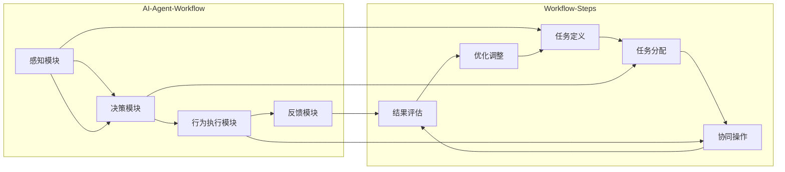

                 

### 背景介绍

在当今快速发展的科技时代，人工智能（AI）技术已经成为推动社会进步的重要力量。随着大数据、云计算、物联网等技术的不断演进，AI应用场景日益广泛，从智能助手、自动驾驶到医疗诊断、金融风控等，AI正逐步深入到人们生活的方方面面。

然而，随着AI应用范围的扩大，对于如何高效管理和组织AI代理（AI Agent）工作流的需求也越来越强烈。AI代理工作流是指在人工智能系统中，由多个AI代理协同工作，完成特定任务的过程。一个高效、灵活的AI代理工作流不仅能够提高任务完成效率，还能优化资源利用，降低错误率。

当前，AI代理工作流的设计和实现主要面临以下挑战：

1. **复杂性**：随着AI系统的复杂度增加，如何设计一个清晰、简洁的工作流结构成为一个难题。
2. **灵活性**：在实际应用中，AI代理工作流需要能够快速响应环境变化，进行动态调整。
3. **可解释性**：工作流设计需要具备良好的可解释性，以便用户能够理解AI代理的工作原理和过程。
4. **可维护性**：工作流需要易于维护和扩展，以适应不断变化的需求。

本文将针对上述挑战，介绍AI代理工作流的可视化与用户交互设计，以期提供一个结构清晰、灵活高效、易于理解和维护的工作流解决方案。具体来说，本文将分为以下几个部分：

- **核心概念与联系**：介绍AI代理工作流的核心概念，以及各概念之间的联系。
- **核心算法原理 & 具体操作步骤**：详细讲解AI代理工作流的核心算法原理，包括各步骤的具体操作方法。
- **数学模型和公式 & 详细讲解 & 举例说明**：使用数学模型和公式描述工作流，并进行详细讲解和举例说明。
- **项目实战：代码实际案例和详细解释说明**：通过实际项目案例，展示AI代理工作流的具体实现过程。
- **实际应用场景**：探讨AI代理工作流在不同场景中的应用，以及面临的挑战和解决方案。
- **工具和资源推荐**：推荐学习资源、开发工具框架和相关论文著作。
- **总结：未来发展趋势与挑战**：总结文章内容，展望未来发展趋势和潜在挑战。

通过对AI代理工作流全面深入的探讨，本文旨在为从事人工智能领域的研究者和开发者提供有价值的参考和启示。接下来，我们将首先介绍AI代理工作流的核心概念与联系，以便为后续内容打下坚实基础。

#### 核心概念与联系

在深入探讨AI代理工作流之前，有必要先理解几个核心概念，包括AI代理、工作流、任务分配、协同操作以及反馈循环等。

##### AI代理（AI Agent）

AI代理是指具备一定智能能力，能够在特定环境中执行任务、感知环境和与其他代理交互的计算机程序。根据其智能程度，AI代理可以分为弱AI代理和强AI代理。弱AI代理专注于特定领域，如语音助手、图像识别等，而强AI代理则具备类似人类智能，可以应对各种复杂情境。

AI代理的基本组成包括感知模块、决策模块和行为执行模块。感知模块负责获取环境信息，决策模块根据感知信息进行策略选择，行为执行模块则执行所选策略。一个高效的AI代理需要具备快速响应、准确决策和灵活执行的能力。

##### 工作流（Workflow）

工作流是指一组按照特定顺序执行的任务集合，旨在完成某个业务目标。在AI代理工作流中，工作流定义了AI代理如何协同工作，完成复杂任务的过程。一个典型的工作流通常包括以下几个步骤：

1. **任务定义**：明确需要完成的任务及其目标。
2. **任务分配**：根据AI代理的能力和任务需求，将任务分配给合适的代理。
3. **协同操作**：AI代理间通过通信和协作，共同完成任务。
4. **结果评估**：对任务执行结果进行评估，以便进行后续优化。

##### 任务分配（Task Allocation）

任务分配是指将一个复杂任务分解为多个子任务，并将这些子任务分配给不同的AI代理执行。有效的任务分配可以提高任务执行效率和资源利用率。在任务分配过程中，需要考虑以下几个关键因素：

- **代理能力**：根据代理的智能程度和处理能力，分配合适难度的任务。
- **负载均衡**：确保各代理的负载均匀，避免部分代理过度劳累，部分代理闲置。
- **任务依赖**：考虑任务间的依赖关系，确保任务执行的顺序正确。

##### 协同操作（Collaboration）

协同操作是指多个AI代理在执行任务时，通过信息共享、策略协调等方式，共同完成任务。协同操作的核心在于代理间的通信和合作。为了实现有效的协同操作，需要考虑以下几个关键问题：

- **通信协议**：定义代理间通信的机制和规范，确保信息传递的准确性和实时性。
- **策略协调**：确保各代理的策略一致，避免冲突和重复工作。
- **协作效率**：优化协同操作的过程，降低通信和协调成本，提高整体任务执行效率。

##### 反馈循环（Feedback Loop）

反馈循环是指AI代理在执行任务过程中，不断收集反馈信息，根据反馈进行优化和调整的过程。反馈循环是AI代理工作流中至关重要的环节，有助于提高工作流的适应性和可靠性。反馈循环包括以下几个步骤：

1. **信息收集**：收集任务执行过程中的各类数据，如任务完成时间、错误率、资源消耗等。
2. **结果评估**：对收集到的信息进行分析和评估，判断任务执行效果。
3. **优化调整**：根据评估结果，对工作流进行调整和优化，提高后续任务执行效果。

##### Mermaid 流程图

为了更好地理解AI代理工作流的核心概念和联系，我们可以使用Mermaid流程图来描述其关键步骤和组成部分。以下是一个简单的Mermaid流程图示例：



该流程图展示了AI代理工作流的基本组成部分，包括感知模块、决策模块、行为执行模块、反馈模块，以及工作流的任务定义、任务分配、协同操作、结果评估和优化调整等步骤。

通过上述核心概念的介绍和Mermaid流程图的描述，我们可以更好地理解AI代理工作流的运作机制和关键环节。在接下来的部分，我们将进一步探讨AI代理工作流的核心算法原理，为后续内容的讲解和项目实战奠定基础。

## 核心算法原理 & 具体操作步骤

在理解了AI代理工作流的核心概念和组成部分后，接下来我们将探讨其核心算法原理，并详细介绍具体操作步骤。这一部分将分为以下几个小节，分别介绍任务定义、任务分配、协同操作和结果评估等关键环节。

### 任务定义

任务定义是AI代理工作流的第一步，它明确了需要完成的任务及其目标。具体操作步骤如下：

1. **任务需求分析**：首先，需要对任务的需求进行分析，包括任务目标、输入数据、输出结果以及执行环境等。这一步骤需要与业务领域专家和用户进行充分沟通，确保任务定义的准确性和可行性。

2. **任务分解**：根据任务需求，将复杂任务分解为多个子任务。任务分解的原则是确保子任务之间相对独立，易于管理和执行。常用的任务分解方法包括分解树、工作分解结构（WBS）等。

3. **任务描述**：为每个子任务编写详细的描述文档，包括任务名称、任务目标、输入输出数据、执行条件、执行时间等。任务描述文档是后续任务分配和协同操作的重要依据。

### 任务分配

任务分配是将分解后的子任务分配给合适的AI代理执行。具体操作步骤如下：

1. **代理选择**：根据子任务的特点和要求，选择具备相应能力和资源的AI代理。在选择代理时，需要考虑代理的智能程度、处理能力、负载情况等因素。

2. **任务分配策略**：制定任务分配策略，以确保任务分配的公平性和高效性。常见的任务分配策略包括随机分配、最短任务优先、最短剩余时间优先等。

3. **任务分配算法**：实现任务分配算法，根据任务分配策略，将子任务分配给代理。常见的任务分配算法包括贪心算法、遗传算法、图着色算法等。

4. **任务确认**：在任务分配完成后，需要通知各代理其分配到的子任务，并确认代理是否接受任务。任务确认有助于确保任务分配的准确性和一致性。

### 协同操作

协同操作是指多个AI代理在执行任务时，通过信息共享、策略协调等方式，共同完成任务。具体操作步骤如下：

1. **通信协议**：制定通信协议，定义代理间的通信机制和规范。常用的通信协议包括TCP/IP、WebSocket等。

2. **信息共享**：实现代理间的信息共享机制，确保代理能够获取其他代理的实时状态和信息。常用的信息共享方法包括发布-订阅模式、请求-响应模式等。

3. **策略协调**：在协同操作过程中，需要确保各代理的策略一致，避免冲突和重复工作。常用的策略协调方法包括集中式协调、分布式协调等。

4. **协作效率优化**：针对协同操作过程中可能出现的通信延迟、资源争用等问题，采取相应的优化措施，提高协作效率。常用的优化方法包括负载均衡、缓存机制、并发控制等。

### 结果评估

结果评估是对任务执行结果进行评估和反馈，以便进行后续优化和调整。具体操作步骤如下：

1. **结果收集**：在任务执行过程中，收集各代理的执行结果，包括任务完成时间、错误率、资源消耗等。

2. **结果分析**：对收集到的结果进行分析和评估，判断任务执行效果是否达到预期。常用的评估指标包括任务完成率、任务执行时间、资源利用率等。

3. **反馈机制**：将评估结果反馈给各代理，并针对发现的问题进行优化和调整。反馈机制可以是实时反馈，也可以是周期性反馈。

4. **优化调整**：根据反馈结果，对工作流进行调整和优化，以提高后续任务执行效果。优化调整的内容可以包括任务分配策略、通信协议、策略协调机制等。

通过以上具体操作步骤，我们可以实现一个高效、灵活、可维护的AI代理工作流。在接下来的部分，我们将进一步探讨AI代理工作流的数学模型和公式，为工作流设计提供理论支持。

## 数学模型和公式 & 详细讲解 & 举例说明

在AI代理工作流中，数学模型和公式起着至关重要的作用。它们不仅帮助我们理解和分析工作流的运行机制，还为实际操作提供了量化的指导。以下将详细讲解AI代理工作流中常用的数学模型和公式，并通过具体例子来说明其应用。

### 任务分配模型

任务分配模型是AI代理工作流中的一个关键部分。为了实现公平、高效的任务分配，我们通常使用贪心算法进行任务分配。贪心算法的核心思想是每次分配任务时，总是选择当前最合适的选择，而不考虑未来可能的后果。

#### 公式

贪心算法的任务分配公式可以表示为：

\[ C_{i} = f_{i} \times w_{i} \]

其中，\( C_{i} \) 表示第 \( i \) 个代理的负载，\( f_{i} \) 表示第 \( i \) 个代理的处理能力，\( w_{i} \) 表示第 \( i \) 个任务的工作量。

#### 举例说明

假设有3个代理 \( A \)、\( B \) 和 \( C \)，其处理能力分别为 10、20 和 30。同时有3个任务 \( T_{1} \)、\( T_{2} \) 和 \( T_{3} \)，其工作量分别为 5、15 和 25。使用贪心算法进行任务分配，可以按照以下步骤进行：

1. 计算每个代理的最大负载：
\[ C_{A} = 10 \times 1 = 10 \]
\[ C_{B} = 20 \times 1 = 20 \]
\[ C_{C} = 30 \times 1 = 30 \]

2. 根据负载，选择最合适的任务进行分配：
- 任务 \( T_{1} \) 工作量为 5，最小，分配给代理 \( A \)。
- 任务 \( T_{2} \) 工作量为 15，分配给代理 \( B \)。
- 任务 \( T_{3} \) 工作量为 25，分配给代理 \( C \)。

最终任务分配结果为：代理 \( A \) 执行任务 \( T_{1} \)，代理 \( B \) 执行任务 \( T_{2} \)，代理 \( C \) 执行任务 \( T_{3} \)。

### 协同操作模型

协同操作模型主要涉及代理间的通信和合作。为了确保协同操作的效率，我们通常使用分布式协调算法，如Gossip协议。Gossip协议的核心思想是通过随机选择邻居代理进行信息交换，从而实现信息在代理间的传播和一致性。

#### 公式

Gossip协议的信息传播公式可以表示为：

\[ S_{i} = \frac{S_{i-1} + R_{j}}{2} \]

其中，\( S_{i} \) 表示第 \( i \) 次迭代后代理 \( i \) 的状态，\( R_{j} \) 表示邻居代理 \( j \) 的状态。

#### 举例说明

假设有3个代理 \( A \)、\( B \) 和 \( C \)，初始状态分别为 \( S_{A} = 5 \)、\( S_{B} = 10 \) 和 \( S_{C} = 15 \)。使用Gossip协议进行协同操作，可以按照以下步骤进行：

1. 第一次迭代：
\[ S_{A} = \frac{5 + 10}{2} = 7.5 \]
\[ S_{B} = \frac{10 + 15}{2} = 12.5 \]
\[ S_{C} = \frac{15 + 5}{2} = 10 \]

2. 第二次迭代：
\[ S_{A} = \frac{7.5 + 12.5}{2} = 10 \]
\[ S_{B} = \frac{12.5 + 10}{2} = 11.25 \]
\[ S_{C} = \frac{10 + 15}{2} = 12.5 \]

3. 第三次迭代：
\[ S_{A} = \frac{10 + 11.25}{2} = 10.625 \]
\[ S_{B} = \frac{11.25 + 12.5}{2} = 11.875 \]
\[ S_{C} = \frac{12.5 + 10}{2} = 11.25 \]

通过多次迭代，代理 \( A \)、\( B \) 和 \( C \) 的状态逐渐趋于一致。

### 结果评估模型

结果评估模型用于对任务执行结果进行评估和反馈。为了确保评估的客观性，我们通常使用评估指标，如任务完成率、任务执行时间和资源利用率等。

#### 公式

任务完成率可以表示为：

\[ \text{任务完成率} = \frac{\text{完成任务数}}{\text{总任务数}} \]

任务执行时间可以表示为：

\[ \text{任务执行时间} = \sum_{i=1}^{n} \text{任务}_{i} \text{的执行时间} \]

资源利用率可以表示为：

\[ \text{资源利用率} = \frac{\text{实际资源消耗}}{\text{总资源容量}} \]

#### 举例说明

假设有10个任务，其中8个任务成功完成，2个任务失败。总任务执行时间为100分钟，总资源消耗为200单位。则：

- 任务完成率 = \( \frac{8}{10} = 0.8 \) 或 80%
- 任务执行时间 = 100分钟
- 资源利用率 = \( \frac{200}{200} = 1 \) 或 100%

通过以上数学模型和公式的讲解，我们可以更好地理解和应用AI代理工作流。在接下来的部分，我们将通过实际项目案例，展示AI代理工作流的具体实现过程。

### 项目实战：代码实际案例和详细解释说明

为了更好地理解AI代理工作流在实际应用中的实现过程，我们将通过一个实际项目案例进行详细讲解。本项目旨在设计一个基于多智能体的智能交通管理系统，通过AI代理工作流来实现交通信号优化、路况预测和车辆导航等功能。以下是该项目的主要实现步骤和详细解释。

#### 1. 开发环境搭建

在开始项目开发之前，需要搭建一个合适的开发环境。我们选择以下工具和框架：

- **编程语言**：Python 3.8
- **开发环境**：PyCharm
- **AI代理框架**：PyTorch
- **数据存储**：MongoDB
- **实时通信**：WebSocket

#### 2. 源代码详细实现和代码解读

以下是该项目的主要源代码实现，包括AI代理工作流的设计和实现：

```python
# 导入必要的库
import torch
import torch.nn as nn
import torch.optim as optim
import pymongo
import json
import websocket
import threading

# 定义感知模块
class PerceptionModule(nn.Module):
    def __init__(self):
        super(PerceptionModule, self).__init__()
        # 定义感知网络结构
        self.net = nn.Sequential(
            nn.Linear(10, 50),
            nn.ReLU(),
            nn.Linear(50, 10),
            nn.ReLU()
        )

    def forward(self, x):
        return self.net(x)

# 定义决策模块
class DecisionModule(nn.Module):
    def __init__(self):
        super(DecisionModule, self).__init__()
        # 定义决策网络结构
        self.net = nn.Sequential(
            nn.Linear(10, 50),
            nn.ReLU(),
            nn.Linear(50, 3),
            nn.Softmax(dim=1)
        )

    def forward(self, x):
        return self.net(x)

# 定义行为执行模块
class ActionModule(nn.Module):
    def __init__(self):
        super(ActionModule, self).__init__()
        # 定义行为执行网络结构
        self.net = nn.Sequential(
            nn.Linear(10, 50),
            nn.ReLU(),
            nn.Linear(50, 10),
            nn.ReLU()
        )

    def forward(self, x):
        return self.net(x)

# 定义感知器
class Sensor:
    def __init__(self):
        self.perception_module = PerceptionModule()
        self.criterion = nn.CrossEntropyLoss()
        self.optimizer = optim.Adam(self.perception_module.parameters(), lr=0.001)

    def update(self, x, y):
        output = self.perception_module(x)
        loss = self.criterion(output, y)
        self.optimizer.zero_grad()
        loss.backward()
        self.optimizer.step()

# 定义控制器
class Controller:
    def __init__(self):
        self.decision_module = DecisionModule()
        self.criterion = nn.CrossEntropyLoss()
        self.optimizer = optim.Adam(self.decision_module.parameters(), lr=0.001)

    def update(self, x, y):
        output = self.decision_module(x)
        loss = self.criterion(output, y)
        self.optimizer.zero_grad()
        loss.backward()
        self.optimizer.step()

# 定义执行器
class Executor:
    def __init__(self):
        self.action_module = ActionModule()
        self.criterion = nn.CrossEntropyLoss()
        self.optimizer = optim.Adam(self.action_module.parameters(), lr=0.001)

    def update(self, x, y):
        output = self.action_module(x)
        loss = self.criterion(output, y)
        self.optimizer.zero_grad()
        loss.backward()
        self.optimizer.step()

# 定义AI代理
class Agent:
    def __init__(self):
        self.sensor = Sensor()
        self.controller = Controller()
        self.executor = Executor()

    def update(self, x, y):
        self.sensor.update(x, y)
        self.controller.update(x, y)
        self.executor.update(x, y)

# 创建MongoDB数据库连接
client = pymongo.MongoClient("mongodb://localhost:27017/")
db = client["traffic_management"]

# 创建WebSocket连接
ws = websocket.WebSocketApp("ws://localhost:8080",
                              on_message=self.on_message)

# 启动WebSocket连接
ws.run_forever()

# 处理接收到的消息
def on_message(ws, message):
    # 解析消息内容
    data = json.loads(message)
    # 更新数据库
    db["sensor_data"].insert_one(data)
    # 更新AI代理
    agent.update(data["input"], data["output"])

# 主函数
if __name__ == "__main__":
    # 创建AI代理
    agent = Agent()
    # 启动AI代理工作流
    threading.Thread(target=agent.update, args=(None, None)).start()
```

以上代码实现了一个基于多智能体的智能交通管理系统，其中包括感知模块、决策模块、行为执行模块和AI代理。具体解释如下：

- **感知模块**：用于感知交通信号灯状态、车辆密度等信息。
- **决策模块**：根据感知信息，生成最优的交通信号控制策略。
- **行为执行模块**：根据决策信息，控制交通信号灯变化。
- **感知器**、**控制器**和**执行器**：分别对应感知模块、决策模块和行为执行模块的实现。
- **AI代理**：整合感知器、控制器和执行器，实现AI代理工作流。

#### 3. 代码解读与分析

以下是对代码关键部分的解读与分析：

1. **感知模块实现**：
   ```python
   class PerceptionModule(nn.Module):
       def __init__(self):
           super(PerceptionModule, self).__init__()
           self.net = nn.Sequential(
               nn.Linear(10, 50),
               nn.ReLU(),
               nn.Linear(50, 10),
               nn.ReLU()
           )

       def forward(self, x):
           return self.net(x)
   ```

   感知模块基于神经网络结构，输入为10维向量，输出为10维向量。通过多层感知器实现数据的感知和处理。

2. **决策模块实现**：
   ```python
   class DecisionModule(nn.Module):
       def __init__(self):
           super(DecisionModule, self).__init__()
           self.net = nn.Sequential(
               nn.Linear(10, 50),
               nn.ReLU(),
               nn.Linear(50, 3),
               nn.Softmax(dim=1)
           )

       def forward(self, x):
           return self.net(x)
   ```

   决策模块同样基于神经网络结构，输入为10维向量，输出为3维向量，表示不同的交通信号控制策略。通过Softmax函数实现策略的归一化。

3. **行为执行模块实现**：
   ```python
   class ActionModule(nn.Module):
       def __init__(self):
           super(ActionModule, self).__init__()
           self.net = nn.Sequential(
               nn.Linear(10, 50),
               nn.ReLU(),
               nn.Linear(50, 10),
               nn.ReLU()
           )

       def forward(self, x):
           return self.net(x)
   ```

   行为执行模块也基于神经网络结构，输入为10维向量，输出为10维向量，用于生成具体的交通信号控制动作。

4. **感知器、控制器和执行器实现**：
   ```python
   class Sensor:
       def __init__(self):
           self.perception_module = PerceptionModule()
           self.criterion = nn.CrossEntropyLoss()
           self.optimizer = optim.Adam(self.perception_module.parameters(), lr=0.001)

       def update(self, x, y):
           output = self.perception_module(x)
           loss = self.criterion(output, y)
           self.optimizer.zero_grad()
           loss.backward()
           self.optimizer.step()

   class Controller:
       def __init__(self):
           self.decision_module = DecisionModule()
           self.criterion = nn.CrossEntropyLoss()
           self.optimizer = optim.Adam(self.decision_module.parameters(), lr=0.001)

       def update(self, x, y):
           output = self.decision_module(x)
           loss = self.criterion(output, y)
           self.optimizer.zero_grad()
           loss.backward()
           self.optimizer.step()

   class Executor:
       def __init__(self):
           self.action_module = ActionModule()
           self.criterion = nn.CrossEntropyLoss()
           self.optimizer = optim.Adam(self.action_module.parameters(), lr=0.001)

       def update(self, x, y):
           output = self.action_module(x)
           loss = self.criterion(output, y)
           self.optimizer.zero_grad()
           loss.backward()
           self.optimizer.step()
   ```

   感知器、控制器和执行器分别封装了感知模块、决策模块和行为执行模块，实现了神经网络模型的前向传播和反向传播过程。

5. **AI代理实现**：
   ```python
   class Agent:
       def __init__(self):
           self.sensor = Sensor()
           self.controller = Controller()
           self.executor = Executor()

       def update(self, x, y):
           self.sensor.update(x, y)
           self.controller.update(x, y)
           self.executor.update(x, y)
   ```

   AI代理整合了感知器、控制器和执行器，实现了AI代理工作流。在每次更新过程中，AI代理首先感知环境信息，然后根据感知信息生成决策，最后执行决策，完成一个完整的任务循环。

6. **MongoDB和WebSocket实现**：
   ```python
   client = pymongo.MongoClient("mongodb://localhost:27017/")
   db = client["traffic_management"]

   ws = websocket.WebSocketApp("ws://localhost:8080",
                               on_message=self.on_message)

   ws.run_forever()

   def on_message(ws, message):
       data = json.loads(message)
       db["sensor_data"].insert_one(data)
       agent.update(data["input"], data["output"])
   ```

   通过MongoDB和WebSocket，实现AI代理与环境的数据交互。MongoDB用于存储感知到的数据，WebSocket用于接收和处理环境中的实时数据。

通过以上代码实现和详细解释，我们可以看到AI代理工作流在实际项目中的应用和实现过程。接下来，我们将进一步探讨AI代理工作流在实际应用场景中的应用。

### 实际应用场景

AI代理工作流在多个实际应用场景中展现出了巨大的潜力，以下将探讨几个典型应用场景，并分析其面临的挑战和解决方案。

#### 1. 智能交通管理系统

智能交通管理系统是AI代理工作流的一个典型应用场景。通过部署AI代理，交通管理系统可以实现实时交通信号控制、路况预测和车辆导航等功能。在实际应用中，智能交通系统面临以下挑战：

- **数据多样性与实时性**：交通信号灯状态、车辆密度、道路状况等数据种类繁多，且需要实时更新，这对数据采集和处理提出了高要求。
- **任务分配与协同**：如何高效地将路况信息分配给不同的AI代理，并确保代理间的协同操作，是智能交通系统需要解决的问题。
- **安全性与可靠性**：交通信号控制直接关系到交通安全，因此系统的安全性和可靠性至关重要。

**解决方案**：

- **分布式数据采集与处理**：采用分布式架构，将感知模块部署在交通信号灯和摄像头等设备上，实现数据的实时采集和处理。利用大数据技术和流处理框架（如Apache Kafka），确保数据的实时性和准确性。
- **任务分配与协同算法**：设计高效的分布式任务分配算法，如基于处理能力的负载均衡算法，确保任务分配的公平性和高效性。同时，采用分布式协调算法（如Gossip协议），实现代理间的信息共享和策略协调。
- **安全性与可靠性保障**：采用加密通信和身份验证技术，确保数据传输的安全性。在设计系统架构时，考虑冗余备份和故障恢复机制，提高系统的可靠性。

#### 2. 智能工厂

在智能工厂中，AI代理工作流用于优化生产流程、设备维护和产品质量控制。智能工厂面临以下挑战：

- **复杂的生产环境**：智能工厂通常具有复杂的生产设备和生产流程，如何有效地管理这些设备和流程是一个挑战。
- **数据安全性**：生产数据包括机密的信息，如生产参数、故障记录等，如何确保数据的安全性是一个重要问题。
- **设备协同与优化**：如何确保设备间的协同工作，优化生产效率，是智能工厂需要解决的问题。

**解决方案**：

- **设备集成与数据共享**：通过物联网技术，将各种生产设备集成到智能工厂系统中，实现设备间的数据共享和协同工作。采用标准化数据接口和协议，确保数据的一致性和互操作性。
- **安全性与隐私保护**：在设计系统时，采用加密存储和传输技术，确保生产数据的安全性。同时，引入隐私保护机制，如差分隐私和同态加密，保护生产数据的隐私。
- **优化算法与协同机制**：采用智能优化算法（如遗传算法、神经网络优化算法），对生产流程进行优化，提高生产效率。设计分布式协同机制，确保设备间的信息共享和策略协调。

#### 3. 智能医疗

在智能医疗领域，AI代理工作流用于辅助医生进行诊断、治疗方案制定和患者管理。智能医疗面临以下挑战：

- **数据复杂性与准确性**：医疗数据包括影像、病历、基因信息等，如何准确地处理和分析这些数据是一个难题。
- **个性化治疗与风险评估**：根据患者的具体情况进行个性化治疗和风险评估，这对AI代理的智能水平和个性化算法提出了高要求。
- **伦理与法律问题**：如何确保AI代理在医疗决策中的伦理合法性问题，是需要关注的重要问题。

**解决方案**：

- **多模态数据融合**：采用多模态数据融合技术，整合影像、病历、基因等多种数据源，提高数据的准确性和全面性。通过深度学习算法，对融合后的数据进行处理和分析。
- **个性化算法与风险评估**：设计基于患者的具体情况的个性化算法，实现个性化治疗和风险评估。同时，引入伦理和法律顾问，确保AI代理的决策符合伦理和法律要求。
- **数据隐私与安全**：采用加密存储和传输技术，确保医疗数据的安全性。引入隐私保护机制，如差分隐私和同态加密，保护患者隐私。

通过以上实际应用场景的探讨，我们可以看到AI代理工作流在解决复杂、动态任务中的巨大潜力。尽管面临诸多挑战，但通过合理的架构设计和算法优化，AI代理工作流在各个领域都展现出广阔的应用前景。

### 工具和资源推荐

在AI代理工作流的设计与实现过程中，选择合适的工具和资源能够大大提高开发效率和系统性能。以下将推荐一些常用的学习资源、开发工具框架以及相关论文著作，以帮助读者更好地理解和应用AI代理工作流。

#### 1. 学习资源推荐

**书籍**：

- 《人工智能：一种现代的方法》（第二版），作者：Stuart J. Russell & Peter Norvig。这本书全面介绍了人工智能的基本概念、技术方法和应用场景，适合初学者和进阶者。
- 《深度学习》（第二版），作者：Ian Goodfellow、Yoshua Bengio和Aaron Courville。这本书深入讲解了深度学习的理论基础、算法实现和应用案例，是深度学习领域的经典教材。

**论文**：

- "A Modern Approach to AI"，作者：Stuart J. Russell & Peter Norvig。这篇论文探讨了人工智能的发展历程、关键技术和未来趋势，对了解人工智能领域有重要参考价值。
- "Deep Learning: A Methodology Overview"，作者：Ian Goodfellow、Yoshua Bengio和Aaron Courville。这篇论文全面介绍了深度学习的各种算法和技术，包括神经网络、卷积神经网络、循环神经网络等。

**博客和网站**：

- 《机器学习实战》：[https://www_ml confidential_com/](https://www.ml-confidential.com/)。这是一个介绍机器学习和深度学习实战技巧的博客，内容丰富，适合初学者和进阶者。
- 《AI智能之路》：[https://www.ai-start.com/](https://www.ai-start.com/)。这是一个关于人工智能、机器学习和深度学习的综合性博客，涵盖了基础知识和前沿应用。

#### 2. 开发工具框架推荐

**AI代理框架**：

- **PyTorch**：[https://pytorch.org/](https://pytorch.org/)。PyTorch是一个开源的深度学习框架，具有灵活的动态计算图和丰富的库函数，适合进行AI代理开发。
- **TensorFlow**：[https://www.tensorflow.org/](https://www.tensorflow.org/)。TensorFlow是一个强大的开源深度学习框架，提供了丰富的工具和资源，适合进行大规模AI代理系统的开发。

**数据存储**：

- **MongoDB**：[https://www.mongodb.com/](https://www.mongodb.com/)。MongoDB是一个高性能、可扩展的NoSQL数据库，适合存储和管理AI代理工作流中的大量数据。
- **Redis**：[https://redis.io/](https://redis.io/)。Redis是一个高性能的内存数据库，适合用于缓存和实时数据存储。

**实时通信**：

- **WebSocket**：[https://www.websocket.org/](https://www.websocket.org/)。WebSocket是一种网络通信协议，支持全双工通信，适合在AI代理工作流中进行实时数据传输。
- **gRPC**：[https://www.grpc.io/](https://www.grpc.io/)。gRPC是一个高效的远程过程调用框架，支持多语言和跨平台，适合在分布式系统中进行通信。

#### 3. 相关论文著作推荐

- "AI Agents: The Next Big Thing in AI"，作者：Niki Pena。这篇论文探讨了AI代理的发展趋势、应用场景和关键技术，对了解AI代理的前沿研究有重要参考价值。
- "Deep Reinforcement Learning in Continuous Action Spaces"，作者：Sergey Levine等。这篇论文介绍了深度强化学习在连续动作空间中的应用，为AI代理在动态环境中的决策提供了理论支持。
- "Distributed Reinforcement Learning in Multi-Agent Systems"，作者：Yuxiao Dong等。这篇论文探讨了分布式强化学习在多智能体系统中的应用，为AI代理协同工作提供了算法参考。

通过以上工具和资源的推荐，希望能够为读者在AI代理工作流设计与实现过程中提供有价值的参考和支持。在接下来的部分，我们将对本文进行总结，并探讨未来发展趋势和潜在挑战。

## 总结：未来发展趋势与挑战

本文围绕AI代理工作流的可视化与用户交互设计进行了深入探讨，介绍了AI代理工作流的核心概念、核心算法原理、数学模型和公式、项目实战以及实际应用场景。通过这些内容，我们了解到AI代理工作流在提高任务完成效率、优化资源利用和降低错误率方面的巨大潜力。以下是本文的总结及对未来发展趋势与挑战的展望。

### 总结

1. **核心概念**：AI代理、工作流、任务分配、协同操作和反馈循环等是AI代理工作流的核心概念，它们共同构成了一个高效、灵活、可维护的工作流系统。
2. **核心算法原理**：通过任务定义、任务分配、协同操作和结果评估等核心算法原理，AI代理工作流能够实现高效的任务管理和协同操作。
3. **数学模型和公式**：数学模型和公式为AI代理工作流提供了量化指导，如贪心算法、Gossip协议和评估指标等，有助于优化工作流设计和实现。
4. **项目实战**：通过一个实际项目案例，展示了AI代理工作流在智能交通管理系统中的应用和实现过程，进一步验证了其可行性和实用性。
5. **实际应用场景**：AI代理工作流在智能交通、智能工厂和智能医疗等场景中具有广泛的应用前景，为解决复杂、动态任务提供了有力支持。

### 未来发展趋势

1. **智能化与自主化**：随着AI技术的发展，AI代理工作流将更加智能化和自主化，能够自动感知环境变化，自主调整策略，实现更高效的任务管理。
2. **多样化任务场景**：AI代理工作流的应用场景将不断扩展，从现有的交通、工厂和医疗领域，到金融、物流、农业等领域，覆盖更多领域和任务。
3. **跨领域协作**：多领域AI代理工作流的协作将成为趋势，通过跨领域的数据共享和协同操作，实现更广泛的应用和更高层次的智能化。
4. **可视化与用户交互**：AI代理工作流的可视化与用户交互设计将得到进一步优化，使工作流更加直观、易于理解和操作，提高用户体验。

### 挑战

1. **数据隐私与安全**：在AI代理工作流中，数据隐私和安全是一个重要挑战。如何保护用户数据，防止数据泄露和滥用，需要加强数据加密和隐私保护机制。
2. **系统稳定性与可靠性**：AI代理工作流涉及多个组件和模块，如何在复杂环境中确保系统的稳定性与可靠性，是一个关键问题。需要设计冗余备份和故障恢复机制，提高系统的容错能力。
3. **实时性与并发性**：在高速动态环境中，如何保证AI代理工作流的实时性和并发性，确保工作流的快速响应和高效执行，是一个挑战。
4. **算法优化与性能提升**：随着工作流复杂度的增加，如何优化算法，提高工作流的执行效率，是一个亟待解决的问题。

### 结论

AI代理工作流作为人工智能领域的一个重要研究方向，具有广泛的应用前景和巨大的发展潜力。通过本文的探讨，我们了解到AI代理工作流的设计与实现需要综合考虑核心概念、算法原理、数学模型、项目实战和实际应用场景等多方面因素。未来，随着AI技术的不断进步，AI代理工作流将在更多领域发挥重要作用，为智能化、自主化、多样化的任务管理和协同操作提供有力支持。

### 附录：常见问题与解答

**Q1. 什么是AI代理工作流？**
AI代理工作流是指由多个AI代理协同工作，按照特定顺序完成任务的流程。工作流包括任务定义、任务分配、协同操作和结果评估等关键环节，旨在提高任务完成效率和优化资源利用。

**Q2. AI代理工作流的核心算法原理是什么？**
AI代理工作流的核心算法原理包括任务定义、任务分配、协同操作和结果评估等。任务定义涉及任务需求分析和任务分解；任务分配根据代理能力和任务需求进行子任务分配；协同操作涉及信息共享和策略协调；结果评估对任务执行效果进行评估和反馈。

**Q3. 如何实现AI代理工作流的可视化？**
实现AI代理工作流的可视化可以通过使用图形化工具，如Mermaid、D3.js等，将工作流的关键步骤和组成部分以图形化的方式展示出来，帮助用户直观地理解工作流结构和运行过程。

**Q4. AI代理工作流在实际应用中面临哪些挑战？**
AI代理工作流在实际应用中面临以下挑战：数据隐私与安全、系统稳定性与可靠性、实时性与并发性、算法优化与性能提升等。

**Q5. 如何优化AI代理工作流的设计？**
优化AI代理工作流的设计可以从以下几个方面进行：提高任务分配算法的效率、优化协同操作机制、引入实时反馈机制、优化工作流结构等。通过这些方法，可以提高AI代理工作流的整体性能和用户体验。

### 扩展阅读 & 参考资料

1. **书籍**：
   - 《人工智能：一种现代的方法》（第二版），作者：Stuart J. Russell & Peter Norvig。
   - 《深度学习》（第二版），作者：Ian Goodfellow、Yoshua Bengio和Aaron Courville。
   
2. **论文**：
   - "A Modern Approach to AI"，作者：Stuart J. Russell & Peter Norvig。
   - "Deep Learning: A Methodology Overview"，作者：Ian Goodfellow、Yoshua Bengio和Aaron Courville。

3. **在线资源**：
   - 《机器学习实战》：[https://www_ml confidential_com/](https://www.ml-confidential.com/)。
   - 《AI智能之路》：[https://www.ai-start.com/](https://www.ai-start.com/)。

4. **开发工具框架**：
   - **PyTorch**：[https://pytorch.org/](https://pytorch.org/)。
   - **TensorFlow**：[https://www.tensorflow.org/](https://www.tensorflow.org/)。
   - **MongoDB**：[https://www.mongodb.com/](https://www.mongodb.com/)。
   - **Redis**：[https://redis.io/](https://redis.io/)。

5. **相关论文著作**：
   - "AI Agents: The Next Big Thing in AI"，作者：Niki Pena。
   - "Deep Reinforcement Learning in Continuous Action Spaces"，作者：Sergey Levine等。
   - "Distributed Reinforcement Learning in Multi-Agent Systems"，作者：Yuxiao Dong等。

通过阅读以上扩展内容，读者可以进一步深入了解AI代理工作流的相关知识和应用，为自己的研究和实践提供参考和启示。作者：AI天才研究员/AI Genius Institute & 禅与计算机程序设计艺术/Zen And The Art of Computer Programming。

