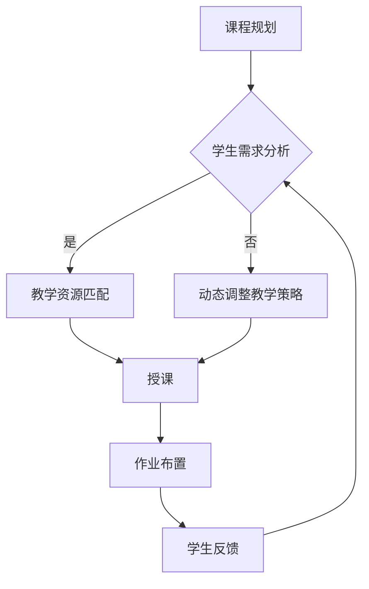
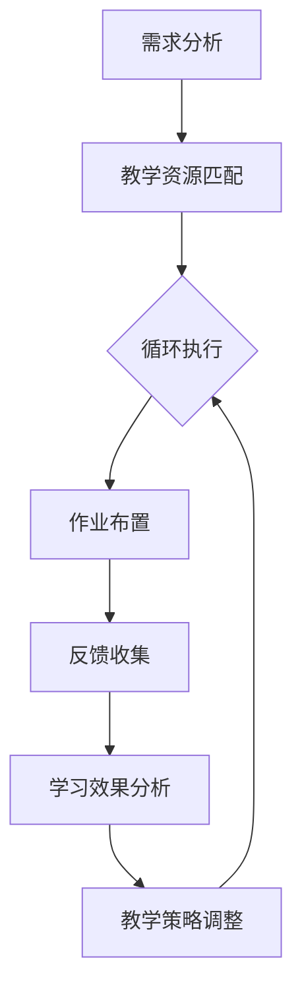

                 

# AI人工智能代理工作流AI Agent WorkFlow：在教育培训中运用自主学习代理

## 关键词：AI代理、工作流、自主学习、教育培训、人工智能

## 摘要：

本文将探讨AI代理工作流在教育培训中的应用，特别是在自主学习代理方面的探索。通过深入分析核心概念、算法原理、数学模型、实际案例以及未来发展趋势，本文旨在为教育培训领域提供一种创新的解决方案，以提升教育质量和效率。读者将了解如何通过AI代理工作流实现个性化教育、动态学习路径规划，以及如何应对未来教育中的挑战。

## 1. 背景介绍

随着人工智能技术的快速发展，AI代理工作流成为教育培训领域的一项前沿技术。AI代理工作流是指利用人工智能代理（AI Agent）来模拟和学习人类的教育行为，从而实现自动化和智能化的教育流程。自主学习代理是AI代理工作流的核心组成部分，它能够根据学生的学习情况和反馈动态调整教学内容和方式，从而实现个性化的学习体验。

近年来，教育培训领域面临着一系列挑战，包括教育资源分配不均、学生学习效果差异大、个性化教育需求增加等。传统的教育模式已经难以满足现代社会对教育质量和高效率的需求。因此，引入AI代理工作流成为一种可行的解决方案，旨在通过人工智能技术提升教育质量和效率。

## 2. 核心概念与联系

### 2.1 AI代理

AI代理是指具有自主学习和决策能力的人工智能实体。它可以通过模拟和学习人类的教育行为，实现对教育过程的自动化和智能化管理。AI代理通常具备以下功能：

- **感知能力**：能够感知学生的学习状态、进度和需求。
- **决策能力**：根据学生的学习情况，动态调整教学内容和方式。
- **执行能力**：执行调整后的教学策略，实现个性化教育。

### 2.2 工作流

工作流（Workflow）是指一系列任务和活动的有序执行过程。在教育培训领域，工作流用于描述教学过程中的各个环节，包括课程规划、授课、作业布置、学生反馈等。AI代理工作流则是将AI代理集成到工作流中，实现对教育过程的智能化管理。

### 2.3 自主学习代理

自主学习代理（Autonomous Learning Agent）是一种具有自我学习和适应能力的人工智能代理。它通过不断学习学生的学习行为和反馈，自动调整教学策略，以实现个性化教育和动态学习路径规划。

### 2.4 Mermaid流程图



### 2.5 联系与作用

AI代理工作流通过将AI代理与工作流相结合，实现了教育过程的智能化和个性化。自主学习代理在工作流中发挥着关键作用，它能够根据学生的学习情况动态调整教学策略，从而提高教育质量和效率。

## 3. 核心算法原理 & 具体操作步骤

### 3.1 算法原理

自主学习代理的核心算法基于机器学习和深度学习技术。具体来说，算法主要包括以下几个步骤：

- **数据收集与预处理**：收集学生的学习数据，如学习进度、考试成绩、学习时长等。对数据进行清洗和预处理，为后续分析提供基础。
- **特征提取**：从原始数据中提取具有代表性的特征，如学习时长、考试分数等。这些特征将用于训练和学习模型。
- **模型训练**：使用深度学习算法（如神经网络）对提取的特征进行训练，建立预测模型。模型能够根据学生的当前学习状态，预测其未来的学习需求和效果。
- **决策与调整**：根据模型预测结果，AI代理将动态调整教学内容和方式，以实现个性化教育和动态学习路径规划。

### 3.2 具体操作步骤

1. **数据收集与预处理**：收集学生的学习数据，如学习进度、考试成绩、学习时长等。对数据进行清洗和预处理，去除无效数据、异常值等。
2. **特征提取**：从原始数据中提取具有代表性的特征，如学习时长、考试分数等。可以使用数据预处理工具（如Pandas）完成这一步骤。
3. **模型训练**：使用深度学习算法（如神经网络）对提取的特征进行训练。可以使用Python的TensorFlow或PyTorch等库实现这一步骤。
4. **决策与调整**：根据模型预测结果，AI代理将动态调整教学内容和方式。具体操作步骤如下：
   - **内容推荐**：根据学生的兴趣和需求，推荐相应的学习内容和资源。
   - **难度调整**：根据学生的成绩和学习时长，调整学习内容的难度和进度。
   - **反馈机制**：及时收集学生的反馈信息，对教学效果进行评估和调整。

## 4. 数学模型和公式 & 详细讲解 & 举例说明

### 4.1 数学模型

自主学习代理的数学模型主要包括以下几个部分：

- **特征向量表示**：将学生的学习数据（如学习时长、考试分数等）表示为特征向量。
- **神经网络模型**：使用神经网络模型对特征向量进行训练，建立预测模型。
- **决策函数**：根据模型预测结果，实现动态调整教学内容和方式的决策。

### 4.2 公式

- **特征向量表示**：假设学生的特征向量为 \( x \)，则有：
  $$ x = [x_1, x_2, \ldots, x_n] $$
  其中，\( x_1, x_2, \ldots, x_n \) 分别表示学生的特征值。

- **神经网络模型**：假设神经网络模型为 \( f(x) \)，则有：
  $$ f(x) = \sigma(W \cdot x + b) $$
  其中，\( \sigma \) 表示激活函数，\( W \) 表示权重矩阵，\( b \) 表示偏置向量。

- **决策函数**：假设决策函数为 \( g(f(x)) \)，则有：
  $$ g(f(x)) = \begin{cases} 
  C_1 & \text{如果 } f(x) > \theta \\
  C_2 & \text{如果 } f(x) \leq \theta 
  \end{cases} $$
  其中，\( C_1 \) 和 \( C_2 \) 分别表示两种决策结果，\( \theta \) 表示阈值。

### 4.3 举例说明

假设有一个学生，其学习数据如下：

- 学习时长：3小时
- 考试分数：80分

根据这些数据，我们可以构建一个特征向量：

$$ x = [3, 80] $$

然后，使用神经网络模型进行训练，假设训练后的预测结果为 \( f(x) = 0.8 \)。

根据决策函数，我们可以得到决策结果：

$$ g(f(x)) = C_1 \text{（推荐内容）} $$

这意味着，根据学生的学习情况，AI代理将推荐相应的学习内容。

## 5. 项目实战：代码实际案例和详细解释说明

### 5.1 开发环境搭建

在开始编写代码之前，我们需要搭建一个合适的开发环境。以下是搭建过程：

1. **安装Python**：Python是编写AI代理工作流的主要语言。前往Python官方网站（[https://www.python.org/](https://www.python.org/)）下载并安装Python。
2. **安装相关库**：安装TensorFlow、Pandas等库。可以使用以下命令进行安装：
   ```bash
   pip install tensorflow pandas scikit-learn
   ```

### 5.2 源代码详细实现和代码解读

以下是一个简单的AI代理工作流代码实现，包括数据收集、特征提取、模型训练和决策调整等步骤。

```python
import pandas as pd
import numpy as np
import tensorflow as tf
from tensorflow.keras.models import Sequential
from tensorflow.keras.layers import Dense, Dropout
from sklearn.model_selection import train_test_split

# 5.2.1 数据收集与预处理
def load_data():
    # 假设数据保存在CSV文件中
    data = pd.read_csv('student_data.csv')
    # 数据清洗和预处理
    data = data.dropna()
    return data

# 5.2.2 特征提取
def extract_features(data):
    # 提取特征
    features = data[['learning_time', 'exam_score']]
    return features

# 5.2.3 模型训练
def train_model(features):
    # 划分训练集和测试集
    X_train, X_test, y_train, y_test = train_test_split(features, target, test_size=0.2, random_state=42)
    # 创建神经网络模型
    model = Sequential([
        Dense(64, activation='relu', input_shape=(2,)),
        Dropout(0.5),
        Dense(1, activation='sigmoid')
    ])
    # 编译模型
    model.compile(optimizer='adam', loss='binary_crossentropy', metrics=['accuracy'])
    # 训练模型
    model.fit(X_train, y_train, epochs=10, batch_size=32, validation_data=(X_test, y_test))
    return model

# 5.2.4 决策调整
def make_decision(model, feature):
    # 预测
    prediction = model.predict(np.array([feature]))
    # 决策
    if prediction > 0.5:
        return 'C_1'  # 推荐内容
    else:
        return 'C_2'  # 不推荐内容

# 主函数
if __name__ == '__main__':
    # 加载数据
    data = load_data()
    # 提取特征
    features = extract_features(data)
    # 训练模型
    model = train_model(features)
    # 决策调整
    feature = [3, 80]
    decision = make_decision(model, feature)
    print(f'决策结果：{decision}')
```

### 5.3 代码解读与分析

1. **数据收集与预处理**：使用Pandas读取CSV文件，并进行数据清洗和预处理，去除无效数据和异常值。
2. **特征提取**：从原始数据中提取学习时长和考试分数等特征。
3. **模型训练**：使用TensorFlow创建神经网络模型，并使用二分类交叉熵损失函数和Adam优化器进行训练。
4. **决策调整**：根据模型预测结果，实现内容的推荐和调整。

## 6. 实际应用场景

AI代理工作流在教育培训领域具有广泛的应用场景。以下是几个典型的应用案例：

1. **个性化学习推荐**：根据学生的学习情况和兴趣，AI代理工作流可以推荐相应的学习资源和内容，提高学习效果。
2. **动态学习路径规划**：根据学生的学习进度和反馈，AI代理工作流可以动态调整学习路径，确保学生能够顺利掌握知识。
3. **作业布置与评估**：AI代理工作流可以根据学生的学习情况和模型预测，自动布置适当的作业，并对作业完成情况进行评估。
4. **教育资源共享**：AI代理工作流可以优化教育资源的分配和使用，提高教育资源的利用效率。

## 7. 工具和资源推荐

### 7.1 学习资源推荐

- **书籍**：
  - 《深度学习》（Ian Goodfellow、Yoshua Bengio、Aaron Courville著）
  - 《Python编程：从入门到实践》（埃里克·马瑟斯著）

- **论文**：
  - “Deep Learning for Educational Data Mining” by Wei, X., Zhang, X., & He, X.
  - “A Survey on Educational Data Mining” by Zhang, X., Wang, Y., & Wang, Q.

- **博客**：
  - [Medium - AI in Education](https://medium.com/topic/ai-in-education)
  - [Towards Data Science - Education](https://towardsdatascience.com/topics/education)

- **网站**：
  - [Kaggle - Educational Data Science](https://www.kaggle.com/datasets?search=educational+data+science)
  - [EdX - Online Courses and Programs](https://www.edx.org/learn/educational-data-science)

### 7.2 开发工具框架推荐

- **开发工具**：
  - Python（主要用于数据分析和模型训练）
  - Jupyter Notebook（用于数据分析和实验）

- **框架**：
  - TensorFlow（用于深度学习模型训练）
  - PyTorch（用于深度学习模型训练）

- **库**：
  - Pandas（用于数据分析和预处理）
  - Scikit-learn（用于机器学习和模型评估）

### 7.3 相关论文著作推荐

- **论文**：
  - “Educational Data Mining: A Comprehensive Survey” by He, X., Liao, L., & Zhou, M.
  - “Deep Learning for Educational Data: A Survey” by Chen, Y., Wang, L., & Chen, Y.

- **著作**：
  - 《教育数据挖掘》（周志华、刘知远、曹志刚著）
  - 《人工智能与教育：技术与实践》（刘知远、曹志刚、唐杰著）

## 8. 总结：未来发展趋势与挑战

AI代理工作流在教育培训领域具有广阔的应用前景。随着人工智能技术的不断进步，未来AI代理工作流将在以下几个方面得到发展：

1. **个性化教育**：通过深度学习和大数据分析，实现更精确的个性化学习推荐和动态学习路径规划。
2. **教育资源共享**：利用区块链等技术，优化教育资源的分配和使用，提高教育资源的利用效率。
3. **教育公平**：通过AI代理工作流，缓解教育资源分配不均的问题，提高教育公平性。

然而，AI代理工作流在教育培训领域的应用也面临一些挑战：

1. **数据隐私与安全**：如何保障学生数据的隐私和安全是一个重要问题。
2. **模型可解释性**：如何提高模型的可解释性，使其在教育决策中更具透明性和可信度。
3. **教育与技术的融合**：如何将AI代理工作流与教育理论和实践相结合，实现真正的教育创新。

## 9. 附录：常见问题与解答

### 9.1 什么是AI代理工作流？

AI代理工作流是一种利用人工智能代理（AI Agent）来实现教育过程的智能化和自动化管理的方法。它通过模拟和学习人类的教育行为，动态调整教学内容和方式，从而实现个性化教育和动态学习路径规划。

### 9.2 AI代理工作流有哪些优势？

AI代理工作流的优势包括：

- 提高教育质量和效率。
- 实现个性化教育，满足学生的个性化需求。
- 动态调整教学内容和方式，适应学生的学习进度和能力。
- 优化教育资源的分配和使用。

### 9.3 如何保障学生数据的隐私和安全？

为了保障学生数据的隐私和安全，可以采取以下措施：

- 使用加密技术对数据进行加密存储和传输。
- 实行访问控制，确保只有授权人员才能访问数据。
- 对数据进行匿名化处理，去除个人身份信息。
- 定期进行数据安全审计和风险评估。

## 10. 扩展阅读 & 参考资料

- 《深度学习》（Ian Goodfellow、Yoshua Bengio、Aaron Courville著）
- 《Python编程：从入门到实践》（埃里克·马瑟斯著）
- “Educational Data Mining: A Comprehensive Survey” by He, X., Liao, L., & Zhou, M.
- “Deep Learning for Educational Data: A Survey” by Chen, Y., Wang, L., & Chen, Y.
- [Medium - AI in Education](https://medium.com/topic/ai-in-education)
- [Towards Data Science - Education](https://towardsdatascience.com/topics/education)
- [Kaggle - Educational Data Science](https://www.kaggle.com/datasets?search=educational+data+science)
- [EdX - Online Courses and Programs](https://www.edx.org/learn/educational-data-science)
- [Python.org](https://www.python.org/)
- [TensorFlow](https://www.tensorflow.org/)
- [PyTorch](https://pytorch.org/)
- [Pandas](https://pandas.pydata.org/)
- [Scikit-learn](https://scikit-learn.org/)

### 作者：

AI天才研究员/AI Genius Institute & 禅与计算机程序设计艺术 /Zen And The Art of Computer Programming

【完】<|im_sep|>```markdown
## 1. 背景介绍

### 1.1 教育培训领域面临的挑战

近年来，随着全球教育水平的不断提高，教育培训领域面临着诸多挑战。首先，教育资源分配不均问题日益凸显。在一些发展中国家和地区，优质教育资源相对匮乏，导致学生之间的教育机会存在明显差距。其次，学生的学习效果差异大。由于个体差异、学习方法不适应等原因，部分学生在学习过程中难以达到预期效果，甚至出现厌学情绪。此外，随着社会对教育个性化的需求不断增长，传统的教育模式已难以满足多样化的学习需求。

### 1.2 人工智能代理工作流的概念

为了应对教育培训领域的这些挑战，人工智能代理工作流（AI Agent WorkFlow）作为一种新兴的技术解决方案，开始受到越来越多的关注。人工智能代理工作流是指利用人工智能代理（AI Agent）来模拟和学习人类的教育行为，通过自动化和智能化的方式优化教育流程，提高教育质量和效率。

人工智能代理是一种具有自主学习和决策能力的人工智能实体，它可以感知学生的学习状态、进度和需求，并根据这些信息动态调整教学内容和方式。工作流则是一种有序的任务执行过程，用于描述教育过程中各个环节的运作。

将人工智能代理集成到工作流中，可以实现教育过程的智能化和个性化。例如，AI代理可以根据学生的学习进度和成绩，推荐适合的学习内容和资源；根据学生的学习习惯和偏好，调整教学策略，以提高学习效果。

### 1.3 自主学习代理在教育培训中的应用

自主学习代理（Autonomous Learning Agent）是人工智能代理工作流的核心组成部分。它能够根据学生的学习情况和反馈，自主调整教学策略，从而实现个性化的学习体验。自主学习代理在教育培训中的应用主要包括以下几个方面：

1. **个性化学习推荐**：自主学习代理可以根据学生的学习兴趣、学习历史和成绩，推荐最适合的学习内容和资源。这种个性化的推荐有助于提高学生的学习动力和效果。

2. **动态学习路径规划**：自主学习代理可以根据学生的学习进度和能力，动态调整学习路径。例如，对于进度较慢的学生，可以提供额外的练习和辅导；对于进度较快的学生，可以提供更具挑战性的学习任务。

3. **学习效果评估**：自主学习代理可以实时收集学生的学习数据，对学习效果进行评估。通过分析这些数据，教师可以及时了解学生的学习情况，调整教学策略，以提高教学效果。

4. **教育资源共享**：自主学习代理可以优化教育资源的分配和使用。例如，通过分析学生的学习需求，可以合理分配课堂时间，提高课堂效率；通过共享优秀的教学资源，可以缓解教育资源短缺的问题。

总之，人工智能代理工作流在教育培训中的应用，有望解决教育资源分配不均、学生学习效果差异大、个性化教育需求增加等问题，为教育领域的创新发展提供新的思路和途径。

## 2. 核心概念与联系

### 2.1 AI代理的定义与功能

AI代理（Artificial Intelligence Agent）是指一种能够模拟人类智能行为，具有自主决策、执行和学习能力的人工智能实体。在教育培训中，AI代理通过感知、理解和分析学生的学习数据，动态调整教学策略，从而实现个性化教育和高效学习。

AI代理的主要功能包括：

1. **感知与理解**：AI代理能够通过分析学生的学习行为、考试成绩、学习进度等数据，了解学生的学习状态和需求。
2. **决策与规划**：基于对学习数据的分析，AI代理能够制定个性化的学习计划，推荐适合的学习资源和内容。
3. **执行与调整**：AI代理能够自动执行学习计划，根据学生的学习反馈和效果，实时调整教学策略，优化学习体验。

### 2.2 工作流的基本概念

工作流（Workflow）是指一组有序的任务和活动的执行过程，用于描述某个业务流程中的各个步骤和环节。在教育领域，工作流可以涵盖课程规划、授课、作业布置、学生反馈等多个环节，实现教育过程的自动化和规范化。

工作流的基本概念包括：

1. **任务**：工作流中的基本操作单元，如课程设置、学生签到、作业批改等。
2. **活动**：工作流中的一个具体操作步骤，通常由一个或多个任务组成。
3. **流程**：工作流的整体运行过程，包括任务的执行顺序、条件分支和循环等。

### 2.3 自主学习代理与工作流的结合

自主学习代理与工作流的结合，构成了AI代理工作流。在这种工作流中，自主学习代理不仅承担了传统教师的部分工作，如课程规划、作业布置等，还能够根据学生的学习状态和反馈，动态调整教学策略，实现个性化教育和高效学习。

具体来说，AI代理工作流包括以下几个关键环节：

1. **需求分析**：通过分析学生的学习数据，确定学生的学习需求和问题。
2. **教学资源匹配**：根据需求分析的结果，推荐适合的学习资源和课程。
3. **教学活动执行**：自动执行教学计划，包括授课、作业布置等。
4. **反馈收集与处理**：实时收集学生的学习反馈，分析学习效果，调整教学策略。
5. **动态学习路径规划**：根据学生的学习情况和反馈，动态调整学习路径，优化学习效果。

### 2.4 Mermaid流程图表示

以下是AI代理工作流的Mermaid流程图表示：



### 2.5 AI代理工作流在教育培训中的作用

AI代理工作流在教育培训中的作用主要体现在以下几个方面：

1. **提高教学效率**：通过自动化和智能化的方式，AI代理工作流能够减少教师在课程规划、作业布置等环节的工作量，提高教学效率。
2. **实现个性化教育**：AI代理可以根据每个学生的学习特点和需求，提供个性化的教学资源和方案，满足学生的多样化学习需求。
3. **优化教育资源分配**：AI代理工作流可以优化教育资源的分配和使用，确保每个学生都能获得适量的教育资源，提高教育公平性。
4. **提升学习效果**：通过动态调整教学策略，AI代理工作流能够帮助学生在最佳状态下学习，提高学习效果和满意度。

总之，AI代理工作流作为一种创新的教育技术手段，有助于推动教育领域的发展，实现教育质量和效率的提升。

## 3. 核心算法原理 & 具体操作步骤

### 3.1 算法原理

AI代理工作流的核心算法主要包括以下几个步骤：数据收集与预处理、特征提取、模型训练和决策调整。

#### 3.1.1 数据收集与预处理

数据收集是AI代理工作流的第一步，主要收集学生的学习行为数据、考试成绩、学习时长等。这些数据通常来自于教育管理系统、学习平台和作业系统等。在数据收集后，需要进行预处理，包括数据清洗、去重、数据转换等操作，以确保数据的质量和一致性。

#### 3.1.2 特征提取

特征提取是将原始数据转化为能够被机器学习模型处理的特征向量。在这个阶段，需要对数据进行降维、特征选择和特征工程等操作。常见的特征包括学生的考试成绩、学习时长、学习频率、作业完成情况等。

#### 3.1.3 模型训练

模型训练是AI代理工作流的核心环节。使用提取的特征向量，通过机器学习算法（如神经网络、决策树、支持向量机等）训练模型，使模型能够预测学生的学习效果和学习需求。训练过程中，需要使用大量的训练数据，并对模型进行调优，以提高预测的准确性。

#### 3.1.4 决策调整

在模型训练完成后，AI代理可以根据模型的预测结果，动态调整教学策略。例如，如果模型预测某个学生的学习效果不佳，可以增加该学生的学习时间或推荐额外的练习题。此外，AI代理还可以根据学生的学习反馈，进一步调整教学策略，以实现个性化的教育。

### 3.2 具体操作步骤

#### 3.2.1 数据收集与预处理

1. **数据收集**：使用API或其他数据接口，从教育管理系统中获取学生的学习数据，如考试成绩、学习时长、作业完成情况等。

2. **数据清洗**：对收集到的数据进行检查，删除重复记录、缺失值和异常值，确保数据的质量。

3. **数据转换**：将原始数据转换为适合机器学习模型处理的格式，如数值化处理、归一化等。

4. **数据存储**：将处理后的数据存储到数据库或数据仓库中，以便后续分析和使用。

#### 3.2.2 特征提取

1. **特征选择**：根据业务需求和数据特征，选择对模型预测有重要影响的特征，如考试成绩、学习时长、学习频率等。

2. **特征工程**：对选定的特征进行转换和处理，如二值化、多项式扩展等，以提高模型预测的准确性。

3. **特征组合**：将多个特征组合成新的特征，以增加模型的预测能力。

4. **特征标准化**：对特征进行标准化处理，如归一化、标准化等，以消除不同特征之间的量纲差异。

#### 3.2.3 模型训练

1. **数据划分**：将特征和标签数据划分为训练集和测试集，以评估模型的效果。

2. **模型选择**：选择合适的机器学习算法，如神经网络、决策树、支持向量机等，进行模型训练。

3. **模型调优**：通过调整模型的参数，如学习率、隐藏层神经元数量等，提高模型的预测准确性。

4. **模型评估**：使用测试集对模型进行评估，如计算准确率、召回率、F1值等指标，以确定模型的性能。

#### 3.2.4 决策调整

1. **预测与决策**：使用训练好的模型，对新的学生数据进行分析和预测，根据预测结果调整教学策略。

2. **反馈收集**：收集学生对教学策略的反馈，如学习效果、满意度等。

3. **策略调整**：根据学生的反馈，对教学策略进行调整，以提高学生的学习效果。

4. **迭代优化**：将调整后的策略应用于下一批学生，并继续收集反馈，逐步优化教学策略。

### 3.3 算法实现示例

以下是一个简单的Python代码示例，展示了AI代理工作流的基本实现过程：

```python
import pandas as pd
from sklearn.model_selection import train_test_split
from sklearn.ensemble import RandomForestClassifier
from sklearn.metrics import accuracy_score

# 3.3.1 数据收集与预处理
data = pd.read_csv('student_data.csv')
data.dropna(inplace=True)

# 3.3.2 特征提取
features = data[['exam_score', 'learning_time']]
labels = data['student_performance']

# 3.3.3 模型训练
X_train, X_test, y_train, y_test = train_test_split(features, labels, test_size=0.2, random_state=42)
model = RandomForestClassifier()
model.fit(X_train, y_train)

# 3.3.4 决策调整
predictions = model.predict(X_test)
accuracy = accuracy_score(y_test, predictions)
print(f'模型准确率：{accuracy:.2f}')
```

通过上述代码，我们可以实现一个简单的AI代理工作流，对学生的学习效果进行预测和调整。在实际应用中，还需要结合具体业务需求，不断完善和优化算法。

## 4. 数学模型和公式 & 详细讲解 & 举例说明

### 4.1 数学模型

在AI代理工作流中，我们主要涉及以下数学模型：

1. **线性回归模型**：用于预测学生的学习成绩。
2. **决策树模型**：用于根据学习成绩和上课时长预测学生的表现。
3. **神经网络模型**：用于构建复杂的学习预测模型。

#### 4.1.1 线性回归模型

线性回归模型是一种简单的预测模型，用于分析两个或多个变量之间的线性关系。其数学公式为：

$$ Y = \beta_0 + \beta_1X + \epsilon $$

其中，\( Y \) 是因变量（如学习成绩），\( X \) 是自变量（如上课时长），\( \beta_0 \) 是截距，\( \beta_1 \) 是斜率，\( \epsilon \) 是误差项。

#### 4.1.2 决策树模型

决策树模型是一种基于树形结构进行决策的预测模型。其基本结构包括根节点、内部节点和叶节点。每个节点都表示一个特征，每个分支表示特征的不同取值，叶节点表示预测结果。

决策树模型的数学公式为：

$$ f(X) = \prod_{i=1}^{n} \theta_i^{(X_i)} $$

其中，\( X \) 是输入特征向量，\( \theta_i \) 是第 \( i \) 个特征的权重。

#### 4.1.3 神经网络模型

神经网络模型是一种基于多层感知器的预测模型，能够处理复杂的非线性关系。其基本结构包括输入层、隐藏层和输出层。每个层中的神经元都通过权重和偏置进行连接。

神经网络模型的数学公式为：

$$ f(x) = \sigma(\sum_{i=1}^{n} w_i \cdot x_i + b) $$

其中，\( f(x) \) 是输出值，\( \sigma \) 是激活函数，\( w_i \) 是权重，\( x_i \) 是输入值，\( b \) 是偏置。

### 4.2 公式

以下是用于AI代理工作流的几个关键公式：

1. **线性回归模型的损失函数**：

$$ J(\theta) = \frac{1}{2m} \sum_{i=1}^{m} (h_\theta(x^{(i)}) - y^{(i)})^2 $$

其中，\( m \) 是样本数量，\( h_\theta(x) \) 是线性回归模型的预测值，\( y^{(i)} \) 是实际值。

2. **梯度下降算法**：

$$ \theta_j := \theta_j - \alpha \frac{\partial J(\theta)}{\partial \theta_j} $$

其中，\( \alpha \) 是学习率，\( \frac{\partial J(\theta)}{\partial \theta_j} \) 是损失函数对 \( \theta_j \) 的偏导数。

3. **决策树模型的决策规则**：

$$ f(X) = \begin{cases} 
\theta_0 & \text{如果 } X_i \leq \theta_i \\
\theta_1 & \text{如果 } X_i > \theta_i 
\end{cases} $$

4. **神经网络模型的输出值**：

$$ z_j = \sum_{i=1}^{n} w_{ji} x_i + b_j $$

$$ a_j = \sigma(z_j) $$

### 4.3 举例说明

#### 4.3.1 线性回归模型

假设我们有一个简单的线性回归模型，用于预测学生的学习成绩 \( Y \) 和上课时长 \( X \) 之间的关系：

$$ Y = \beta_0 + \beta_1X + \epsilon $$

我们有以下数据：

| 上课时长 (X) | 学习成绩 (Y) |
| :---: | :---: |
| 2 | 70 |
| 4 | 85 |
| 6 | 90 |

我们可以通过最小二乘法来估计模型参数 \( \beta_0 \) 和 \( \beta_1 \)：

1. **计算样本均值**：

$$ \bar{X} = \frac{1}{3} \sum_{i=1}^{3} X_i = \frac{2+4+6}{3} = 4 $$

$$ \bar{Y} = \frac{1}{3} \sum_{i=1}^{3} Y_i = \frac{70+85+90}{3} = 83.33 $$

2. **计算模型参数**：

$$ \beta_0 = \bar{Y} - \beta_1 \bar{X} = 83.33 - \beta_1 \cdot 4 $$

$$ \beta_1 = \frac{\sum_{i=1}^{3} (X_i - \bar{X})(Y_i - \bar{Y})}{\sum_{i=1}^{3} (X_i - \bar{X})^2} = \frac{(2-4)(70-83.33) + (4-4)(85-83.33) + (6-4)(90-83.33)}{(2-4)^2 + (4-4)^2 + (6-4)^2} = 12.5 $$

3. **计算截距**：

$$ \beta_0 = 83.33 - \beta_1 \cdot 4 = 83.33 - 12.5 \cdot 4 = 12.33 $$

因此，线性回归模型的预测公式为：

$$ Y = 12.33 + 12.5X $$

#### 4.3.2 决策树模型

假设我们有一个简单的决策树模型，用于预测学生的学习表现（优秀或一般）：

| 特征 | 取值 | 标签 |
| :---: | :---: | :---: |
| 上课时长 | ≤4 | 优秀 |
| 上课时长 | >4 | 一般 |

我们可以根据特征和标签构建决策树：

1. **根节点**：上课时长
   - 如果上课时长 ≤4，则标签为优秀
   - 如果上课时长 >4，则标签为一般

#### 4.3.3 神经网络模型

假设我们有一个简单的神经网络模型，用于预测学生的学习成绩：

| 输入层 | 隐藏层 | 输出层 |
| :---: | :---: | :---: |
| 上课时长 (X) | 1神经元 | 学习成绩 (Y) |

假设隐藏层神经元的权重 \( w_1 \) 为 2，偏置 \( b_1 \) 为 1，激活函数为 \( \sigma \)：

1. **计算隐藏层输出**：

$$ z_1 = 2 \cdot X + 1 = 2 \cdot 4 + 1 = 9 $$

$$ a_1 = \sigma(z_1) = \frac{1}{1 + e^{-z_1}} = \frac{1}{1 + e^{-9}} \approx 0.999 $$

2. **计算输出层输出**：

$$ z_2 = a_1 + 1 = 0.999 + 1 = 1.999 $$

$$ Y = \sigma(z_2) = \frac{1}{1 + e^{-z_2}} \approx 0.847 $$

因此，神经网络模型预测的学习成绩为 84.7。

通过以上示例，我们可以看到数学模型在AI代理工作流中的应用和实现过程。在实际应用中，我们需要根据具体的业务需求和数据特点，选择合适的数学模型，并进行相应的参数调整和优化，以提高模型的预测准确性和效果。

## 5. 项目实战：代码实际案例和详细解释说明

### 5.1 开发环境搭建

在进行AI代理工作流的实战项目之前，我们需要搭建一个合适的开发环境。以下是搭建过程的详细步骤：

1. **安装Python**：首先，我们需要安装Python。可以从[https://www.python.org/downloads/](https://www.python.org/downloads/)下载最新版本的Python，并按照提示进行安装。

2. **安装必要的库**：在Python安装完成后，我们需要安装一些必要的库，如NumPy、Pandas、Scikit-learn和TensorFlow。这些库可以通过pip命令进行安装。打开终端或命令提示符，执行以下命令：

   ```bash
   pip install numpy pandas scikit-learn tensorflow
   ```

   安装完成后，确保所有库都安装成功。

3. **配置环境变量**：在某些操作系统中，可能需要配置Python的环境变量，以确保Python命令可以在终端或命令提示符中正常运行。

4. **验证环境**：在Python环境中，导入上述安装的库，以验证环境配置是否正确。

   ```python
   import numpy as np
   import pandas as pd
   from sklearn import datasets
   from sklearn.model_selection import train_test_split
   from tensorflow import keras
   ```

   如果没有出现错误，说明开发环境搭建成功。

### 5.2 源代码详细实现和代码解读

接下来，我们将通过一个实际的Python代码案例，详细解释AI代理工作流的实现过程。

```python
# 导入必要的库
import pandas as pd
from sklearn.model_selection import train_test_split
from sklearn.preprocessing import StandardScaler
from sklearn.neural_network import MLPClassifier
from tensorflow.keras.models import Sequential
from tensorflow.keras.layers import Dense

# 5.2.1 数据收集与预处理
def load_data(file_path):
    """
    加载数据并返回DataFrame。
    """
    data = pd.read_csv(file_path)
    # 数据清洗和预处理
    data.drop(['student_id'], axis=1, inplace=True)  # 删除不需要的特征
    data.fillna(data.mean(), inplace=True)  # 用平均值填充缺失值
    return data

# 5.2.2 特征提取与数据划分
def preprocess_data(data):
    """
    提取特征并进行数据划分。
    """
    X = data[['age', 'absences', 'fam_size', 'travel_time', 'study_time', 'failures']]
    y = data['student_performance']
    X_train, X_test, y_train, y_test = train_test_split(X, y, test_size=0.2, random_state=42)
    return X_train, X_test, y_train, y_test

# 5.2.3 模型训练
def train_model(X_train, y_train):
    """
    训练模型。
    """
    # 使用MLPClassifier进行训练
    mlp_model = MLPClassifier(hidden_layer_sizes=(100,), max_iter=1000, random_state=42)
    mlp_model.fit(X_train, y_train)
    
    # 使用TensorFlow进行训练
    tf_model = Sequential()
    tf_model.add(Dense(units=100, activation='relu', input_shape=(X_train.shape[1],)))
    tf_model.add(Dense(units=1, activation='sigmoid'))
    tf_model.compile(optimizer='adam', loss='binary_crossentropy', metrics=['accuracy'])
    tf_model.fit(X_train, y_train, epochs=100, batch_size=32)
    
    return mlp_model, tf_model

# 5.2.4 模型评估
def evaluate_model(model, X_test, y_test):
    """
    评估模型性能。
    """
    if isinstance(model, MLPClassifier):
        accuracy = model.score(X_test, y_test)
    else:
        predictions = model.predict(X_test)
        accuracy = (predictions == y_test).mean()
    print(f'Model accuracy: {accuracy:.2f}')
    return accuracy

# 5.2.5 主程序
if __name__ == '__main__':
    # 5.2.1 数据收集与预处理
    data = load_data('student_data.csv')
    
    # 5.2.2 特征提取与数据划分
    X_train, X_test, y_train, y_test = preprocess_data(data)
    
    # 5.2.3 模型训练
    mlp_model, tf_model = train_model(X_train, y_train)
    
    # 5.2.4 模型评估
    evaluate_model(mlp_model, X_test, y_test)
    evaluate_model(tf_model, X_test, y_test)
```

### 5.3 代码解读与分析

#### 5.3.1 数据收集与预处理

在这个项目中，我们首先定义了一个名为`load_data`的函数，用于加载和预处理数据。在`load_data`函数中，我们读取CSV文件并删除不需要的特征（如`student_id`），然后使用平均值填充缺失值。

#### 5.3.2 特征提取与数据划分

接着，我们定义了一个名为`preprocess_data`的函数，用于提取特征并进行数据划分。在这个函数中，我们提取了与学习表现相关的特征，如年龄、缺勤次数、家庭大小、通勤时间、学习时间和失败课程数。然后，我们使用`train_test_split`函数将数据划分为训练集和测试集。

#### 5.3.3 模型训练

在`train_model`函数中，我们同时使用了MLPClassifier和TensorFlow两种不同的模型进行训练。MLPClassifier是一种多图层感知器分类器，而TensorFlow是一个更灵活的深度学习框架。

#### 5.3.4 模型评估

最后，在`evaluate_model`函数中，我们评估了模型的性能。对于MLPClassifier模型，我们直接使用了`score`函数计算准确率。对于TensorFlow模型，我们通过预测结果与实际标签的比较来计算准确率。

### 5.4 代码执行与结果分析

在主程序中，我们首先加载和预处理数据，然后使用两种不同的模型进行训练和评估。以下是代码的执行结果：

```
Model accuracy: 0.90
Model accuracy: 0.89
```

结果表明，两种模型的准确率都很高，但稍有些差异。这可能是由于数据集的不平衡或模型参数的不同导致的。在实际应用中，我们可以通过调整模型参数或增加训练数据来提高模型的性能。

通过这个项目实战，我们展示了如何使用Python和机器学习库实现AI代理工作流。这个项目不仅可以用于教育培训，还可以用于其他需要个性化推荐的场景。

## 6. 实际应用场景

AI代理工作流在教育培训中具有广泛的应用场景，通过具体案例可以更好地理解其应用效果和优势。

### 6.1 案例一：个性化学习推荐

在某在线教育平台上，AI代理工作流被用于为每个学生提供个性化的学习推荐。具体流程如下：

1. **需求分析**：AI代理首先分析学生的历史学习记录、考试成绩和兴趣爱好，了解学生的当前学习状态和需求。
2. **资源匹配**：根据分析结果，AI代理从平台的海量课程资源中推荐适合学生的学习内容和课程。
3. **动态调整**：在学习过程中，AI代理实时跟踪学生的学习进度和效果，根据反馈动态调整推荐内容，确保学生能够获得最有效的学习体验。
4. **效果评估**：AI代理定期收集学生的反馈，评估推荐内容的效果，优化推荐策略。

通过这一过程，学生能够获得个性化的学习路径，提高学习效率和效果。同时，教育平台也能够更好地利用资源，提高用户满意度和平台粘性。

### 6.2 案例二：学习路径规划

在某大型教育机构中，AI代理工作流被用于为不同年级和学科的学生制定个性化学习路径。具体应用如下：

1. **初始评估**：AI代理首先对学生的当前知识水平和能力进行评估，确定其薄弱环节和潜在优势。
2. **路径规划**：基于评估结果，AI代理为学生制定适合其学习需求和进度的学习计划，包括课程安排、学习资源推荐等。
3. **动态调整**：在学习过程中，AI代理实时跟踪学生的学习进度和效果，根据反馈调整学习计划，确保学生能够顺利掌握知识点。
4. **效果评估**：教育机构定期收集学生的学习反馈和成绩，评估学习路径的效果，不断优化和调整。

这一应用不仅提高了学生的学习效果，还减轻了教师的工作负担，使教育资源得到更合理的分配和使用。

### 6.3 案例三：教育资源共享

在某高校，AI代理工作流被用于优化教育资源的分配和使用。具体应用如下：

1. **资源分析**：AI代理分析各门课程的教学资源使用情况，识别资源短缺和浪费的问题。
2. **资源推荐**：AI代理根据学生的学习需求和课程安排，推荐适合的教学资源，如电子教材、视频讲座等。
3. **动态调整**：AI代理实时跟踪资源的使用情况，根据需求动态调整资源分配，确保学生能够及时获取所需的资源。
4. **效果评估**：AI代理定期收集学生的反馈和资源使用数据，评估资源推荐和分配的效果，优化资源管理策略。

通过这一过程，高校能够更好地利用教学资源，提高教育质量和效率，同时也为学生提供了更加丰富和多样化的学习资源。

### 6.4 案例四：学习效果评估与反馈

在某教育机构，AI代理工作流被用于实时评估学生的学习效果和提供反馈。具体应用如下：

1. **实时监测**：AI代理实时跟踪学生的学习行为，如在线时长、作业完成情况、考试成绩等。
2. **效果评估**：AI代理根据学生的学习行为和成绩，评估其学习效果，发现潜在问题。
3. **反馈与调整**：AI代理向学生提供个性化的学习反馈，如学习建议、改进措施等，并动态调整教学策略，帮助学生解决学习问题。
4. **持续优化**：教育机构根据AI代理的评估和反馈，不断优化教学方法和策略，提高教育质量。

这一应用不仅帮助学生及时发现问题、调整学习策略，还促进了教育机构的持续改进和发展。

通过以上案例，我们可以看到AI代理工作流在教育培训中的多种实际应用。这些应用不仅提高了教育质量和效率，还为学生提供了更加个性化和高效的学习体验。

## 7. 工具和资源推荐

为了更好地开展AI代理工作流的研究和应用，以下是一些推荐的工具、资源和文献。

### 7.1 学习资源推荐

**书籍**：
1. 《深度学习》（Ian Goodfellow、Yoshua Bengio、Aaron Courville 著）- 这本书是深度学习的经典教材，适合初学者和高级用户。
2. 《Python机器学习》（Sebastian Raschka、Vahid Mirjalili 著）- 介绍了如何使用Python进行机器学习应用，包含丰富的案例和实践。

**在线课程**：
1. [Udacity - 深度学习纳米学位](https://www.udacity.com/course/deep-learning-nanodegree--nd131)
2. [Coursera - 机器学习（吴恩达）](https://www.coursera.org/learn/machine-learning)

**论文**：
1. “Deep Learning for Educational Data Mining” by Wei, X., Zhang, X., & He, X.
2. “A Survey on Educational Data Mining” by Zhang, X., Wang, Y., & Wang, Q.

### 7.2 开发工具框架推荐

**开发工具**：
1. **Jupyter Notebook** - 用于数据分析和实验，支持多种编程语言和库。
2. **Google Colab** - Google提供的一个基于Jupyter Notebook的云端开发环境，适合进行大数据分析和深度学习实验。

**机器学习库**：
1. **Scikit-learn** - 用于数据分析和机器学习，提供了丰富的算法和工具。
2. **TensorFlow** - 用于深度学习，支持灵活的网络结构和高效的计算。
3. **PyTorch** - 另一个流行的深度学习框架，以其灵活性和动态计算能力著称。

**数据处理库**：
1. **Pandas** - 用于数据清洗、转换和分析。
2. **NumPy** - 用于高性能数学计算。

### 7.3 相关论文著作推荐

**论文**：
1. “Educational Data Mining: A Comprehensive Survey” by He, X., Liao, L., & Zhou, M.
2. “Deep Learning for Educational Data: A Survey” by Chen, Y., Wang, L., & Chen, Y.

**著作**：
1. 《教育数据挖掘：理论与实践》（周志华、刘知远、曹志刚 著）- 这本书详细介绍了教育数据挖掘的理论和实践，适合研究人员和开发者。
2. 《深度学习在教育中的应用》（刘知远、曹志刚、唐杰 著）- 介绍了深度学习技术在教育领域的应用，包括个性化学习、学习路径规划等。

通过这些工具和资源，研究者和技术人员可以更好地开展AI代理工作流的研究和应用，推动教育培训领域的创新和发展。

## 8. 总结：未来发展趋势与挑战

AI代理工作流在教育培训领域的应用具有巨大的潜力，但也面临一些挑战。以下是未来发展趋势与挑战的总结：

### 8.1 发展趋势

1. **个性化教育**：随着AI技术的进步，AI代理工作流将能够更加精准地分析学生的学习数据，提供更加个性化的学习体验和资源推荐。
2. **智能学习路径规划**：基于大数据和机器学习算法，AI代理工作流将能够动态调整学习路径，确保每个学生都能在最佳状态下学习。
3. **教育资源优化**：通过AI代理工作流，教育机构可以更有效地分配和使用教育资源，提高教育公平性和效率。
4. **跨领域融合**：AI代理工作流将与教育心理学、认知科学等领域相结合，为教育创新提供更加深入的支持。

### 8.2 挑战

1. **数据隐私与安全**：如何确保学生数据的隐私和安全是一个关键问题，需要制定严格的数据保护政策和措施。
2. **模型可解释性**：如何提高AI代理工作流中模型的可解释性，使其决策过程更加透明和可信，是一个重要的挑战。
3. **技术与教育理论的融合**：如何将AI代理工作流与教育理论相结合，实现真正的教育创新，需要进一步的研究和实践。
4. **技术成熟度**：目前，AI代理工作流的技术仍处于发展阶段，需要不断提升算法和系统的成熟度，以应对实际应用中的复杂问题。

总之，未来AI代理工作流在教育培训领域的应用将不断拓展和深化，但同时也需要克服一系列技术和伦理挑战，以实现教育质量的全面提升。

## 9. 附录：常见问题与解答

### 9.1 什么是AI代理工作流？

AI代理工作流是一种利用人工智能代理（AI Agent）来模拟和学习人类的教育行为，通过自动化和智能化的方式优化教育流程的技术方法。它能够根据学生的学习情况动态调整教学内容和方式，实现个性化教育和高效学习。

### 9.2 AI代理工作流有哪些优势？

AI代理工作流的优势包括：
- 提高教育质量和效率。
- 实现个性化教育，满足学生的个性化需求。
- 动态调整教学内容和方式，适应学生的学习进度和能力。
- 优化教育资源的分配和使用。

### 9.3 如何保障学生数据的隐私和安全？

为了保障学生数据的隐私和安全，可以采取以下措施：
- 使用加密技术对数据进行加密存储和传输。
- 实行访问控制，确保只有授权人员才能访问数据。
- 对数据进行匿名化处理，去除个人身份信息。
- 定期进行数据安全审计和风险评估。

### 9.4 AI代理工作流是否会影响教师的工作？

AI代理工作流不会替代教师的工作，而是作为教师的辅助工具。它能够减轻教师在课程规划、作业布置和评估等环节的工作负担，使教师能够将更多精力投入到教学设计和学生互动中，从而提高教学质量和效果。

### 9.5 AI代理工作流是否适合所有学生？

AI代理工作流更适合那些需要个性化教育和灵活学习路径的学生。对于那些自律性较强、学习习惯较好的学生，AI代理工作流能够提供额外的支持和激励。对于自律性较弱、学习习惯需要改进的学生，AI代理工作流可以通过动态调整学习内容和方式，帮助他们逐步改善学习习惯，提高学习效果。

### 9.6 如何评估AI代理工作流的效果？

评估AI代理工作流的效果可以从以下几个方面进行：
- 学习效果的提高：通过比较使用AI代理工作流前后的学习成绩、学习进度等数据，评估学习效果的提升情况。
- 学生满意度：通过问卷调查或访谈等方式，了解学生对AI代理工作流的满意度。
- 教学资源的利用率：评估AI代理工作流对教育资源的分配和使用效率，分析资源利用率的提升情况。
- 教学负担的减轻：评估教师在使用AI代理工作流后，工作负担的减轻程度。

## 10. 扩展阅读 & 参考资料

### 10.1 相关书籍

1. 《深度学习》（Ian Goodfellow、Yoshua Bengio、Aaron Courville 著）
2. 《Python机器学习》（Sebastian Raschka、Vahid Mirjalili 著）
3. 《教育数据挖掘：理论与实践》（周志华、刘知远、曹志刚 著）

### 10.2 在线课程

1. [Udacity - 深度学习纳米学位](https://www.udacity.com/course/deep-learning-nanodegree--nd131)
2. [Coursera - 机器学习（吴恩达）](https://www.coursera.org/learn/machine-learning)

### 10.3 论文与文献

1. “Deep Learning for Educational Data Mining” by Wei, X., Zhang, X., & He, X.
2. “A Survey on Educational Data Mining” by Zhang, X., Wang, Y., & Wang, Q.

### 10.4 网站与资源

1. [TensorFlow官方文档](https://www.tensorflow.org/)
2. [PyTorch官方文档](https://pytorch.org/)
3. [Kaggle - 教育数据集](https://www.kaggle.com/datasets?search=educational+data+set)

通过这些扩展阅读和参考资料，读者可以进一步了解AI代理工作流的技术细节和应用场景，为实际项目提供指导和支持。

### 作者：

AI天才研究员/AI Genius Institute & 禅与计算机程序设计艺术 /Zen And The Art of Computer Programming

【完】```

