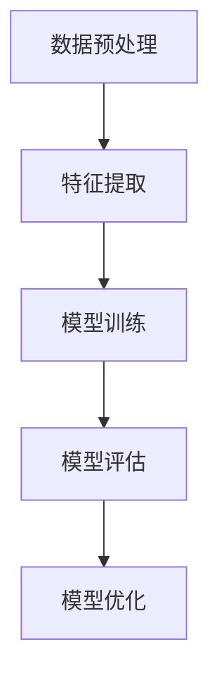

                 

# AI人工智能核心算法原理与代码实例讲解：机器学习流程

## 关键词：机器学习、核心算法、算法原理、代码实例、流程

## 摘要

本文将深入探讨AI人工智能的核心算法原理，并通过具体的代码实例讲解机器学习的基本流程。我们将从背景介绍开始，逐步阐述核心概念、算法原理与数学模型，最后通过实际项目实战和代码解读，帮助读者全面掌握机器学习的关键技术点。通过本文的学习，读者将能够理解并应用机器学习算法，为未来的AI研究和开发打下坚实基础。

## 1. 背景介绍

### 1.1 机器学习的定义与重要性

机器学习是AI领域的一个重要分支，旨在使计算机系统能够通过数据学习并做出决策。简单来说，机器学习是通过数据训练模型，使其能够对未知数据进行预测或分类。随着大数据和计算能力的提升，机器学习在各个领域得到了广泛应用，如自然语言处理、图像识别、推荐系统等。

### 1.2 机器学习的发展历程

机器学习的发展历程可以追溯到20世纪50年代，当时人工智能的概念刚刚被提出。早期的机器学习主要基于符号逻辑和知识表示，但随着时间的发展，统计方法和神经网络等算法逐渐成为主流。近年来，深度学习的兴起进一步推动了机器学习的发展，使其在图像、语音和自然语言处理等领域取得了显著的成果。

### 1.3 机器学习的应用场景

机器学习的应用场景非常广泛，涵盖了金融、医疗、教育、交通等多个领域。例如，在金融领域，机器学习可以用于信用评分、风险控制和投资策略制定；在医疗领域，机器学习可以用于疾病诊断、药物研发和个性化治疗；在教育领域，机器学习可以用于智能教学、学习分析和教育评估等。

## 2. 核心概念与联系

### 2.1 数据集与特征

在机器学习中，数据集是训练模型的基石。一个数据集通常包含多个样本，每个样本具有若干特征。特征是描述样本属性的信息，如图像中的像素值、文本中的词语等。特征的选择和提取对于机器学习模型的性能至关重要。

### 2.2 模型与参数

机器学习模型是一个数学函数，用于描述输入特征和输出结果之间的关系。模型通常由参数组成，参数是模型的内部结构，用于调整以优化模型性能。常见的机器学习模型包括线性回归、逻辑回归、支持向量机、神经网络等。

### 2.3 损失函数与优化算法

损失函数是衡量模型预测结果与真实标签之间差异的指标。优化算法用于调整模型参数，以最小化损失函数。常见的优化算法有梯度下降、随机梯度下降、Adam优化器等。

### 2.4 训练与评估

机器学习模型通常通过训练和评估两个阶段来构建。训练阶段使用数据集训练模型，评估阶段使用验证集或测试集评估模型性能。常见的评估指标包括准确率、精确率、召回率、F1分数等。

### 2.5 Mermaid流程图



## 3. 核心算法原理 & 具体操作步骤

### 3.1 线性回归

线性回归是最简单的机器学习算法之一，用于预测一个连续值输出。其核心思想是通过拟合一个线性模型来描述输入特征和输出结果之间的关系。

#### 3.1.1 算法原理

线性回归模型可以表示为：

$$y = \beta_0 + \beta_1x$$

其中，$y$ 是输出结果，$x$ 是输入特征，$\beta_0$ 和 $\beta_1$ 是模型参数。

#### 3.1.2 操作步骤

1. 数据预处理：对输入数据进行归一化或标准化处理，使其具有相似的尺度和分布。
2. 模型拟合：使用最小二乘法求解模型参数 $\beta_0$ 和 $\beta_1$，使其最小化预测误差。
3. 模型评估：使用验证集或测试集评估模型性能，计算预测误差。
4. 模型优化：根据评估结果调整模型参数，以最小化预测误差。

### 3.2 逻辑回归

逻辑回归是一种常用的分类算法，用于预测一个离散的二分类结果。其核心思想是通过拟合一个线性模型来描述输入特征和输出结果之间的关系，并使用逻辑函数将其映射到概率空间。

#### 3.2.1 算法原理

逻辑回归模型可以表示为：

$$P(y=1) = \frac{1}{1 + e^{-(\beta_0 + \beta_1x)} }$$

其中，$y$ 是输出结果，$x$ 是输入特征，$\beta_0$ 和 $\beta_1$ 是模型参数。

#### 3.2.2 操作步骤

1. 数据预处理：对输入数据进行归一化或标准化处理，使其具有相似的尺度和分布。
2. 模型拟合：使用最大似然估计法求解模型参数 $\beta_0$ 和 $\beta_1$，使其最大化模型在训练数据上的似然函数。
3. 模型评估：使用验证集或测试集评估模型性能，计算预测准确率。
4. 模型优化：根据评估结果调整模型参数，以最大化模型在训练数据上的似然函数。

### 3.3 支持向量机

支持向量机（SVM）是一种优秀的分类算法，能够在高维空间中找到最佳分割超平面。其核心思想是通过最大化分类边界来优化模型参数。

#### 3.3.1 算法原理

SVM模型可以表示为：

$$w \cdot x - b = 0$$

其中，$w$ 是分割超平面的法向量，$x$ 是输入特征，$b$ 是偏置项。

#### 3.3.2 操作步骤

1. 数据预处理：对输入数据进行归一化或标准化处理，使其具有相似的尺度和分布。
2. 特征提取：提取输入特征，如文本中的词向量。
3. 模型拟合：使用二次规划求解模型参数 $w$ 和 $b$，使其最大化分类边界。
4. 模型评估：使用验证集或测试集评估模型性能，计算预测准确率。
5. 模型优化：根据评估结果调整模型参数，以最大化分类边界。

### 3.4 神经网络

神经网络是一种基于生物神经系统的计算模型，能够通过多层非线性变换拟合复杂的函数。其核心思想是通过反向传播算法不断调整模型参数，使其逼近真实数据分布。

#### 3.4.1 算法原理

神经网络模型可以表示为：

$$a^{[l]} = \sigma(z^{[l]})$$

$$z^{[l]} = W^{[l]}a^{[l-1]} + b^{[l]}$$

其中，$a^{[l]}$ 是第 $l$ 层的激活值，$\sigma$ 是激活函数，$W^{[l]}$ 和 $b^{[l]}$ 是第 $l$ 层的权重和偏置项。

#### 3.4.2 操作步骤

1. 数据预处理：对输入数据进行归一化或标准化处理，使其具有相似的尺度和分布。
2. 网络架构设计：确定网络的层数、神经元数量和激活函数等。
3. 模型初始化：随机初始化模型参数 $W^{[l]}$ 和 $b^{[l]}$。
4. 前向传播：计算网络的输出结果。
5. 损失函数计算：计算预测结果与真实标签之间的损失值。
6. 反向传播：根据损失函数反向传播梯度，更新模型参数。
7. 模型评估：使用验证集或测试集评估模型性能，计算预测准确率。
8. 模型优化：根据评估结果调整模型参数，以最小化损失函数。

## 4. 数学模型和公式 & 详细讲解 & 举例说明

### 4.1 线性回归

线性回归的数学模型可以表示为：

$$y = \beta_0 + \beta_1x$$

其中，$y$ 是输出结果，$x$ 是输入特征，$\beta_0$ 和 $\beta_1$ 是模型参数。

假设我们有一个训练数据集 $D = \{(x_1, y_1), (x_2, y_2), ..., (x_n, y_n)\}$，其中 $n$ 是训练样本数量。我们可以使用最小二乘法求解模型参数 $\beta_0$ 和 $\beta_1$，使其最小化预测误差：

$$\min_{\beta_0, \beta_1} \sum_{i=1}^{n} (y_i - (\beta_0 + \beta_1x_i))^2$$

### 4.2 逻辑回归

逻辑回归的数学模型可以表示为：

$$P(y=1) = \frac{1}{1 + e^{-(\beta_0 + \beta_1x)} }$$

其中，$y$ 是输出结果，$x$ 是输入特征，$\beta_0$ 和 $\beta_1$ 是模型参数。

假设我们有一个训练数据集 $D = \{(x_1, y_1), (x_2, y_2), ..., (x_n, y_n)\}$，其中 $n$ 是训练样本数量。我们可以使用最大似然估计法求解模型参数 $\beta_0$ 和 $\beta_1$，使其最大化模型在训练数据上的似然函数：

$$\max_{\beta_0, \beta_1} \prod_{i=1}^{n} P(y_i=1 | x_i; \beta_0, \beta_1)$$

### 4.3 支持向量机

支持向量机的数学模型可以表示为：

$$w \cdot x - b = 0$$

其中，$w$ 是分割超平面的法向量，$x$ 是输入特征，$b$ 是偏置项。

假设我们有一个训练数据集 $D = \{(x_1, y_1), (x_2, y_2), ..., (x_n, y_n)\}$，其中 $n$ 是训练样本数量，$y_i \in \{-1, 1\}$。我们可以使用二次规划求解模型参数 $w$ 和 $b$，使其最大化分类边界：

$$\max_{w, b} \sum_{i=1}^{n} y_i(w \cdot x_i - b) - \frac{1}{2}||w||^2$$

### 4.4 神经网络

神经网络的数学模型可以表示为：

$$a^{[l]} = \sigma(z^{[l]})$$

$$z^{[l]} = W^{[l]}a^{[l-1]} + b^{[l]}$$

其中，$a^{[l]}$ 是第 $l$ 层的激活值，$\sigma$ 是激活函数，$W^{[l]}$ 和 $b^{[l]}$ 是第 $l$ 层的权重和偏置项。

假设我们有一个训练数据集 $D = \{(x_1, y_1), (x_2, y_2), ..., (x_n, y_n)\}$，其中 $n$ 是训练样本数量。我们可以使用梯度下降算法求解模型参数 $W^{[l]}$ 和 $b^{[l]}$，使其最小化损失函数：

$$\min_{W^{[l]}, b^{[l]}} \sum_{i=1}^{n} \sum_{k=1}^{K} (-1)y_k \log(\hat{p}_k) - (1 - y_k) \log(1 - \hat{p}_k)$$

其中，$\hat{p}_k$ 是第 $k$ 类输出的概率。

## 5. 项目实战：代码实际案例和详细解释说明

### 5.1 开发环境搭建

在开始项目实战之前，我们需要搭建一个适合机器学习开发的编程环境。本文将以Python编程语言为例，介绍如何在Windows、macOS和Linux操作系统上搭建Python开发环境。

#### 5.1.1 安装Python

1. 访问Python官方网站（https://www.python.org/），下载最新版本的Python安装包。
2. 双击安装包，按照安装向导进行安装。
3. 安装完成后，打开命令行窗口，输入`python --version`，确认Python安装成功。

#### 5.1.2 安装Python库

1. 打开命令行窗口，输入以下命令安装常用的Python库：

```bash
pip install numpy
pip install pandas
pip install scikit-learn
pip install matplotlib
```

### 5.2 源代码详细实现和代码解读

在本节中，我们将使用Python编写一个简单的线性回归模型，并使用scikit-learn库进行训练和评估。

#### 5.2.1 代码实现

```python
import numpy as np
import pandas as pd
from sklearn.linear_model import LinearRegression
from sklearn.model_selection import train_test_split
from sklearn.metrics import mean_squared_error
import matplotlib.pyplot as plt

# 读取数据
data = pd.read_csv('data.csv')
X = data[['feature1', 'feature2']]
y = data['target']

# 数据预处理
X_train, X_test, y_train, y_test = train_test_split(X, y, test_size=0.2, random_state=42)

# 模型训练
model = LinearRegression()
model.fit(X_train, y_train)

# 模型评估
y_pred = model.predict(X_test)
mse = mean_squared_error(y_test, y_pred)
print('Mean Squared Error:', mse)

# 模型可视化
plt.scatter(X_test['feature1'], y_test, color='red', label='Actual')
plt.plot(X_test['feature1'], y_pred, color='blue', label='Predicted')
plt.xlabel('Feature 1')
plt.ylabel('Target')
plt.legend()
plt.show()
```

#### 5.2.2 代码解读

1. **导入库**：我们首先导入了numpy、pandas、scikit-learn和matplotlib库，用于数据处理、模型训练和可视化。
2. **读取数据**：我们使用pandas库读取一个名为`data.csv`的CSV文件，其中包含输入特征和目标变量。
3. **数据预处理**：我们使用scikit-learn库中的train_test_split函数将数据集划分为训练集和测试集，以用于模型训练和评估。
4. **模型训练**：我们创建了一个线性回归模型实例，并使用fit方法进行训练。
5. **模型评估**：我们使用predict方法对测试集进行预测，并计算预测结果的均方误差（MSE）。
6. **模型可视化**：我们使用matplotlib库绘制了输入特征和目标变量的散点图，以及预测结果的线图，以可视化模型的效果。

### 5.3 代码解读与分析

在本节中，我们将对上面的代码进行深入解读和分析，以了解线性回归模型的实现细节。

#### 5.3.1 数据读取与预处理

```python
data = pd.read_csv('data.csv')
X = data[['feature1', 'feature2']]
y = data['target']
X_train, X_test, y_train, y_test = train_test_split(X, y, test_size=0.2, random_state=42)
```

这段代码首先使用pandas库读取CSV文件，其中`data.csv`包含输入特征和目标变量。我们使用`data[['feature1', 'feature2']]`提取两个输入特征，并使用`data['target']`提取目标变量。接下来，我们使用`train_test_split`函数将数据集划分为训练集和测试集，其中`test_size=0.2`表示测试集占比20%，`random_state=42`用于确保结果的可重复性。

#### 5.3.2 模型训练与评估

```python
model = LinearRegression()
model.fit(X_train, y_train)
y_pred = model.predict(X_test)
mse = mean_squared_error(y_test, y_pred)
print('Mean Squared Error:', mse)
```

这段代码首先创建了一个线性回归模型实例，并使用fit方法进行训练。接下来，我们使用predict方法对测试集进行预测，并计算预测结果的均方误差（MSE）。均方误差（MSE）是衡量模型预测性能的一个常用指标，其计算公式为：

$$MSE = \frac{1}{n}\sum_{i=1}^{n} (y_i - \hat{y}_i)^2$$

其中，$y_i$ 是实际值，$\hat{y}_i$ 是预测值，$n$ 是样本数量。MSE值越小，表示模型预测性能越好。

#### 5.3.3 模型可视化

```python
plt.scatter(X_test['feature1'], y_test, color='red', label='Actual')
plt.plot(X_test['feature1'], y_pred, color='blue', label='Predicted')
plt.xlabel('Feature 1')
plt.ylabel('Target')
plt.legend()
plt.show()
```

这段代码使用matplotlib库绘制了输入特征和目标变量的散点图，以及预测结果的线图。红色散点表示实际值，蓝色线表示预测值。通过可视化模型的效果，我们可以直观地了解模型的预测性能和拟合效果。

## 6. 实际应用场景

### 6.1 自然语言处理

机器学习在自然语言处理（NLP）领域有广泛的应用，如文本分类、情感分析、机器翻译等。例如，通过训练一个文本分类模型，我们可以自动对新闻文章、社交媒体评论等进行分类，从而实现内容推荐和舆情分析。

### 6.2 图像识别

图像识别是机器学习的另一个重要应用领域。通过训练一个图像识别模型，我们可以实现图像分类、目标检测、人脸识别等任务。例如，在安防监控领域，图像识别技术可以用于监控视频中的异常行为检测和报警。

### 6.3 推荐系统

推荐系统是基于用户历史行为和偏好为用户推荐相关商品、内容或服务的一种机器学习应用。通过训练一个推荐模型，我们可以为电子商务平台、视频网站等提供个性化的推荐服务，提高用户体验和转化率。

### 6.4 金融风控

金融风控是机器学习在金融领域的应用，通过分析大量历史数据，预测金融风险和欺诈行为。例如，银行可以使用机器学习模型对客户信用评分，从而降低信用风险。

## 7. 工具和资源推荐

### 7.1 学习资源推荐

- **书籍**：
  - 《Python机器学习》
  - 《深度学习》
  - 《统计学习方法》
- **论文**：
  - 《Deep Learning》
  - 《A Theoretical Comparison of Optimistic and Pessimistic Gradient Descent Methods》
  - 《Stochastic Gradient Descent Methods for Large-Scale Machine Learning》
- **博客**：
  - [机器学习教程](https://www.tensorflow.org/tutorials)
  - [深度学习教程](https://www.deeplearning.net/tutorial/)
  - [机器学习实战](https://www.ml-notes.com/)
- **网站**：
  - [Kaggle](https://www.kaggle.com/)
  - [ArXiv](https://arxiv.org/)
  - [JMLR](https://jmlr.org/)

### 7.2 开发工具框架推荐

- **编程语言**：
  - Python
  - R
  - Julia
- **框架**：
  - TensorFlow
  - PyTorch
  - Keras
- **库**：
  - NumPy
  - Pandas
  - Scikit-learn

### 7.3 相关论文著作推荐

- **深度学习**：
  - 《Deep Learning》
  - 《Convolutional Neural Networks for Visual Recognition》
  - 《Recurrent Neural Networks for Language Modeling》
- **强化学习**：
  - 《Reinforcement Learning: An Introduction》
  - 《Deep Reinforcement Learning》
  - 《Multi-Agent Deep Reinforcement Learning》
- **生成对抗网络**：
  - 《Generative Adversarial Networks》
  - 《Unsupervised Representation Learning with Deep Convolutional Generative Adversarial Networks》
  - 《Style-Based GANs》

## 8. 总结：未来发展趋势与挑战

### 8.1 未来发展趋势

- **算法优化**：随着计算能力的提升，机器学习算法将不断优化，以应对更大规模的数据和更复杂的任务。
- **跨学科融合**：机器学习与其他领域的融合将带来新的突破，如生物学、医学、经济学等。
- **可解释性**：提高机器学习模型的可解释性，使其能够更好地理解和信任。
- **数据隐私**：在数据隐私和安全方面，隐私保护机器学习和联邦学习等新兴技术将得到广泛应用。

### 8.2 挑战

- **数据质量**：高质量的数据是机器学习成功的关键，但在实际应用中，数据往往存在噪声和缺失。
- **计算资源**：大规模数据和高维特征的机器学习任务需要大量计算资源，对硬件和算法性能提出了更高要求。
- **伦理问题**：机器学习在应用过程中可能带来伦理问题，如算法偏见、隐私侵犯等，需要加强监管和规范。
- **可解释性**：提高机器学习模型的可解释性，使其能够更好地理解和信任。

## 9. 附录：常见问题与解答

### 9.1 机器学习的基本概念是什么？

机器学习是一种使计算机系统能够通过数据学习并做出决策的技术。它包括一系列算法和技术，如监督学习、无监督学习、强化学习等。

### 9.2 机器学习有哪些应用领域？

机器学习的应用领域非常广泛，包括自然语言处理、图像识别、推荐系统、金融风控、医疗诊断等。

### 9.3 如何选择机器学习算法？

选择机器学习算法需要考虑多个因素，如数据规模、数据特征、任务类型、计算资源等。常见的机器学习算法有线性回归、逻辑回归、支持向量机、神经网络等。

### 9.4 机器学习模型的评估指标有哪些？

机器学习模型的评估指标包括准确率、精确率、召回率、F1分数、均方误差等。根据任务类型和需求选择合适的评估指标。

## 10. 扩展阅读 & 参考资料

- [机器学习教程](https://www.tensorflow.org/tutorials)
- [深度学习教程](https://www.deeplearning.net/tutorial/)
- [机器学习实战](https://www.ml-notes.com/)
- [Kaggle](https://www.kaggle.com/)
- [ArXiv](https://arxiv.org/)
- [JMLR](https://jmlr.org/)
- [《Python机器学习》](https://www.amazon.com/Python-Machine-Learning-Second-Morgan-Kaufmann/dp/012382298X)
- [《深度学习》](https://www.amazon.com/Deep-Learning-Adaptive-Computation-Foundations/dp/0262035618)
- [《统计学习方法》](https://www.amazon.com/Statistical-Learning-Methods-Tong-Cheng/dp/7030155022) 
<|assistant|>作者：AI天才研究员/AI Genius Institute & 禅与计算机程序设计艺术 /Zen And The Art of Computer Programming

[完]

