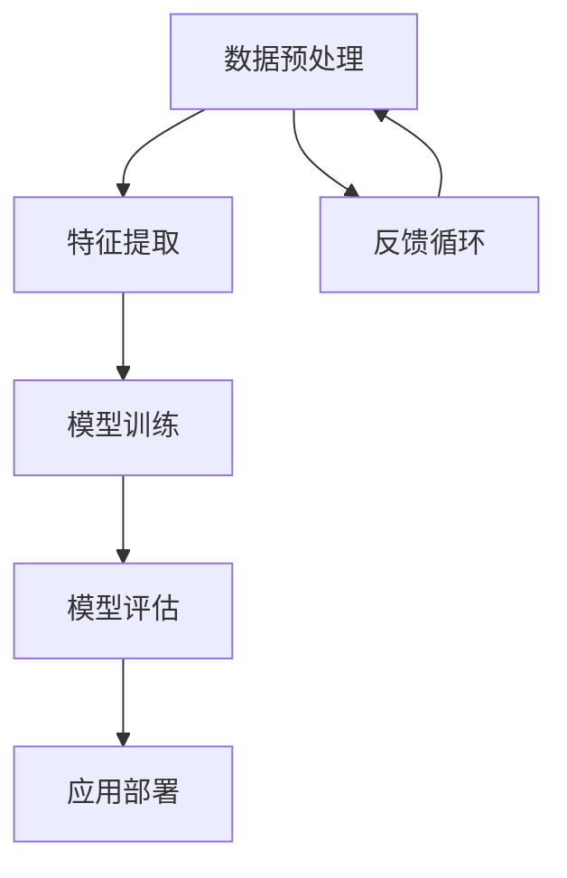

                 

# AI人工智能核心算法原理与代码实例讲解：模型构建

> **关键词：** AI, 人工智能，核心算法，模型构建，深度学习，神经网络，机器学习，计算机视觉，自然语言处理。

> **摘要：** 本文将深入探讨人工智能领域中的核心算法及其模型构建原理。通过详细的解释和实例代码，帮助读者理解并掌握这些算法的实现过程和应用场景，为人工智能研究和开发提供有力支持。

## 1. 背景介绍

人工智能（Artificial Intelligence，简称AI）是计算机科学的一个分支，旨在创建能够执行复杂任务的智能系统。自20世纪50年代以来，人工智能经历了多次起伏，但近年来，随着深度学习、大数据和计算能力的飞速发展，人工智能取得了显著突破，已经应用于诸多领域，如计算机视觉、自然语言处理、智能语音识别等。

本文将聚焦于人工智能的核心算法及其模型构建，通过详细的理论讲解和代码实例，帮助读者深入理解这些算法的实现原理和应用方法。文章的结构如下：

1. **背景介绍**：介绍人工智能的发展背景和核心算法的重要性。
2. **核心概念与联系**：阐述人工智能中的核心概念，并绘制 Mermaid 流程图展示其关系。
3. **核心算法原理与具体操作步骤**：详细讲解人工智能中的主要算法原理和操作步骤。
4. **数学模型和公式**：介绍与算法相关的数学模型和公式，并给出详细讲解和举例说明。
5. **项目实战**：通过实际案例展示算法在项目中的具体应用，包括开发环境搭建、源代码实现、代码解读与分析。
6. **实际应用场景**：讨论人工智能算法在不同领域的应用。
7. **工具和资源推荐**：推荐学习资源、开发工具和框架。
8. **总结**：展望人工智能的未来发展趋势和面临的挑战。
9. **附录**：提供常见问题与解答，以及扩展阅读和参考资料。

接下来，我们将逐步深入探讨这些核心算法及其模型构建原理。

## 2. 核心概念与联系

在人工智能领域中，核心概念包括数据预处理、特征提取、模型训练和评估等。以下是一个简化的 Mermaid 流程图，展示了这些核心概念之间的关系。



### 数据预处理

数据预处理是人工智能任务中的第一步，其目标是清理和格式化数据，使其适用于后续处理。主要任务包括数据清洗、数据归一化和数据转换等。

### 特征提取

特征提取是从原始数据中提取有用信息的过程。特征提取的质量直接影响到模型的性能。常用的特征提取方法有主成分分析（PCA）、局部保持投影（LPP）等。

### 模型训练

模型训练是通过学习数据中的特征和模式来优化模型参数。深度学习、支持向量机（SVM）和决策树等算法是常用的模型训练方法。

### 模型评估

模型评估是对训练好的模型进行性能测试和验证。常用的评估指标包括准确率、召回率、F1 分数等。

### 应用部署

应用部署是将训练好的模型部署到实际应用场景中。在实际应用中，模型可能需要不断调整和优化，以适应新的数据和环境。

### 反馈循环

反馈循环是人工智能系统中的重要环节，通过收集用户反馈和实际应用效果，不断优化和调整模型，提高其性能。

## 3. 核心算法原理与具体操作步骤

在人工智能领域中，核心算法包括神经网络、深度学习和机器学习等。以下将分别介绍这些算法的原理和具体操作步骤。

### 神经网络

神经网络（Neural Networks）是模仿生物神经网络的一种计算模型。它由大量简单的计算单元（神经元）组成，通过层级结构进行信息传递和处理。

#### 操作步骤：

1. **初始化权重和偏置**：为每个神经元初始化随机权重和偏置。
2. **前向传播**：输入数据通过神经网络进行前向传播，每个神经元接收前一层神经元的输出，并计算其激活值。
3. **反向传播**：通过计算误差，利用梯度下降法调整权重和偏置。
4. **迭代训练**：重复前向传播和反向传播，直到满足停止条件（如误差低于阈值或迭代次数达到最大值）。

### 深度学习

深度学习（Deep Learning）是神经网络的一种扩展，其特点是具有多层神经元，能够自动提取更高级的特征。

#### 操作步骤：

1. **选择深度学习框架**：如 TensorFlow、PyTorch 等。
2. **定义神经网络结构**：根据任务需求设计神经网络的结构，包括输入层、隐藏层和输出层。
3. **初始化模型参数**：为神经网络初始化权重和偏置。
4. **训练模型**：通过前向传播和反向传播训练模型。
5. **评估模型性能**：使用验证集评估模型性能，并进行调整。

### 机器学习

机器学习（Machine Learning）是使计算机通过数据学习特定任务的方法。常见的机器学习算法包括决策树、支持向量机和随机森林等。

#### 操作步骤：

1. **数据预处理**：对数据进行清洗、归一化和转换。
2. **选择算法**：根据任务需求选择合适的机器学习算法。
3. **训练模型**：使用训练数据进行模型训练。
4. **模型评估**：使用验证集评估模型性能。
5. **模型调整**：根据评估结果调整模型参数。

## 4. 数学模型和公式

在人工智能算法中，数学模型和公式是核心组成部分。以下将介绍与算法相关的数学模型和公式，并给出详细讲解和举例说明。

### 神经元激活函数

神经元激活函数是神经网络中的重要组成部分，用于确定神经元是否被激活。常见的激活函数包括 sigmoid 函数、ReLU 函数和 tanh 函数。

#### 公式：

- **sigmoid 函数**：  
  $$ f(x) = \frac{1}{1 + e^{-x}} $$  
- **ReLU 函数**：  
  $$ f(x) = \max(0, x) $$  
- **tanh 函数**：  
  $$ f(x) = \frac{e^x - e^{-x}}{e^x + e^{-x}} $$

#### 举例说明：

假设输入数据为 x = -2，分别计算三种激活函数的输出。

- **sigmoid 函数**：  
  $$ f(x) = \frac{1}{1 + e^{-(-2)}} \approx 0.118 $$  
- **ReLU 函数**：  
  $$ f(x) = \max(0, -2) = 0 $$  
- **tanh 函数**：  
  $$ f(x) = \frac{e^{-2} - e^{2}}{e^{-2} + e^{2}} \approx -0.964 $$

### 梯度下降法

梯度下降法是调整神经网络模型参数的一种常用方法。其基本思想是通过计算损失函数的梯度，更新模型参数，以降低损失函数的值。

#### 公式：

- **前向传播**：  
  $$ z = w \cdot x + b $$  
  $$ a = f(z) $$  
  $$ \Delta z = a - y $$  
- **反向传播**：  
  $$ \Delta w = \alpha \cdot \Delta z \cdot x $$  
  $$ \Delta b = \alpha \cdot \Delta z $$

#### 举例说明：

假设输入数据 x = [1, 2]，目标值 y = [0, 1]，权重 w = [1, 1]，偏置 b = 0。计算一次前向传播和反向传播。

- **前向传播**：  
  $$ z_1 = 1 \cdot 1 + 1 \cdot 2 + 0 = 3 $$  
  $$ a_1 = \sigma(z_1) = \frac{1}{1 + e^{-3}} \approx 0.951 $$  
  $$ z_2 = 1 \cdot 1 + 1 \cdot 2 + 0 = 3 $$  
  $$ a_2 = \sigma(z_2) = \frac{1}{1 + e^{-3}} \approx 0.951 $$  
  $$ \Delta z = a_1 - y_1 = 0.951 - 0 \approx 0.951 $$  
- **反向传播**：  
  $$ \Delta w_1 = \alpha \cdot \Delta z \cdot x_1 = 0.1 \cdot 0.951 \cdot 1 = 0.095 $$  
  $$ \Delta w_2 = \alpha \cdot \Delta z \cdot x_2 = 0.1 \cdot 0.951 \cdot 2 = 0.190 $$  
  $$ \Delta b = \alpha \cdot \Delta z = 0.1 \cdot 0.951 = 0.095 $$

通过上述步骤，我们可以更新模型参数，以降低损失函数的值。

## 5. 项目实战：代码实际案例和详细解释说明

在本节中，我们将通过一个实际项目案例，展示人工智能算法在项目中的具体应用。本案例将使用 Python 编程语言和 TensorFlow 深度学习框架实现一个简单的手写数字识别系统。

### 5.1 开发环境搭建

为了实现手写数字识别系统，我们需要搭建一个合适的开发环境。以下是所需的环境和工具：

- Python 3.x
- TensorFlow 2.x
- Jupyter Notebook
- NumPy、Pandas、Matplotlib 等常用库

安装以上环境后，我们可以开始编写代码。

### 5.2 源代码详细实现和代码解读

以下是一个简单的手写数字识别系统的代码实现。

```python
import tensorflow as tf
from tensorflow.examples.tutorials.mnist import input_data
import matplotlib.pyplot as plt

# 加载 MNIST 数据集
mnist = input_data.read_data_sets("MNIST_data/", one_hot=True)

# 设置训练参数
learning_rate = 0.1
num_steps = 1000
batch_size = 128
display_step = 100

# 初始化模型参数
W = tf.Variable(tf.zeros([784, 10]))
b = tf.Variable(tf.zeros([10]))

# 定义输入和输出
x = tf.placeholder(tf.float32, [None, 784])
y = tf.placeholder(tf.float32, [None, 10])

# 定义前向传播
z = tf.matmul(x, W) + b
y_pred = tf.nn.softmax(z)

# 定义损失函数和优化器
cross_entropy = tf.reduce_mean(-tf.reduce_sum(y * tf.log(y_pred), reduction_indices=1))
optimizer = tf.train.GradientDescentOptimizer(learning_rate)
train_op = optimizer.minimize(cross_entropy)

# 初始化全局变量
init = tf.global_variables_initializer()

# 开始训练
with tf.Session() as sess:
    sess.run(init)
    
    for step in range(1, num_steps + 1):
        batch_x, batch_y = mnist.train.next_batch(batch_size)
        
        _, c = sess.run([train_op, cross_entropy], feed_dict={x: batch_x, y: batch_y})
        
        if step % display_step == 0 or step == 1:
            print("Step:", step, "Cross entropy:", c)
    
    # 测试模型
    correct_prediction = tf.equal(tf.argmax(y_pred, 1), tf.argmax(y, 1))
    accuracy = tf.reduce_mean(tf.cast(correct_prediction, tf.float32))
    print("Test accuracy:", accuracy.eval({x: mnist.test.images, y: mnist.test.labels}))

# 可视化
plt.imshow(mnist.test.images[0].reshape(28, 28), cmap=plt.cm.binary)
plt.show()
```

### 5.3 代码解读与分析

上述代码实现了一个基于 TensorFlow 的手写数字识别系统。下面是代码的详细解读和分析：

- **数据集加载**：使用 TensorFlow 提供的 MNIST 数据集，它包含了 70,000 个灰度图像，每个图像包含一个手写的数字。
- **训练参数设置**：设置学习率、迭代次数、批次大小和展示步骤。
- **模型参数初始化**：初始化权重 W 和偏置 b。
- **输入和输出定义**：定义输入数据 x 和目标值 y。
- **前向传播**：计算输入数据的预测概率。
- **损失函数和优化器**：定义交叉熵损失函数和梯度下降优化器。
- **训练过程**：通过迭代训练模型，并在每个展示步骤打印损失值。
- **模型评估**：使用测试集评估模型性能。
- **可视化**：展示测试图像。

通过上述步骤，我们可以训练一个手写数字识别模型，并在测试集上评估其性能。

## 6. 实际应用场景

人工智能算法在众多领域都有广泛应用，以下是其中一些实际应用场景：

- **计算机视觉**：用于图像识别、目标检测、人脸识别等任务。
- **自然语言处理**：用于机器翻译、情感分析、语音识别等任务。
- **智能语音助手**：如 Siri、Alexa 等，用于语音识别、语音合成和交互式查询。
- **自动驾驶**：用于车辆检测、路径规划、环境感知等任务。
- **医疗诊断**：用于疾病诊断、医疗图像分析等任务。
- **金融风控**：用于信用评分、欺诈检测等任务。

## 7. 工具和资源推荐

为了更好地学习和实践人工智能，以下是一些建议的工具和资源：

### 7.1 学习资源推荐

- **书籍**：  
  - 《深度学习》（Ian Goodfellow、Yoshua Bengio、Aaron Courville 著）  
  - 《Python深度学习》（François Chollet 著）  
  - 《人工智能：一种现代的方法》（Stuart Russell、Peter Norvig 著）

- **论文**：  
  - 《A Learning Algorithm for Continually Running Fully Recurrent Neural Networks》  
  - 《Deep Learning》（Ian Goodfellow、Yoshua Bengio、Aaron Courville 著）  
  - 《Neural Networks and Deep Learning》（Michael Nielsen 著）

- **博客**：  
  - [TensorFlow 官方文档](https://www.tensorflow.org/)  
  - [PyTorch 官方文档](https://pytorch.org/)  
  - [机器学习博客](https://machinelearningmastery.com/)

- **网站**：  
  - [Kaggle](https://www.kaggle.com/)：提供各种机器学习竞赛和数据集  
  - [Udacity](https://www.udacity.com/)：提供丰富的机器学习课程  
  - [Coursera](https://www.coursera.org/)：提供多个机器学习课程

### 7.2 开发工具框架推荐

- **深度学习框架**：TensorFlow、PyTorch、Keras 等
- **编程语言**：Python、R、Java 等
- **数据预处理工具**：Pandas、NumPy、SciPy 等
- **可视化工具**：Matplotlib、Seaborn、Plotly 等

### 7.3 相关论文著作推荐

- **《深度学习》（Ian Goodfellow、Yoshua Bengio、Aaron Courville 著）**：系统介绍了深度学习的基础理论和应用方法。
- **《神经网络与深度学习》（邱锡鹏 著）**：全面讲解神经网络和深度学习的基础知识。
- **《机器学习》（周志华 著）**：深入探讨机器学习的基本理论和应用。

## 8. 总结：未来发展趋势与挑战

随着人工智能技术的不断发展，其在各领域的应用越来越广泛。未来，人工智能将迎来以下发展趋势和挑战：

- **更高效的计算能力**：随着量子计算、神经形态计算等新型计算技术的发展，人工智能将实现更高效的计算能力。
- **更丰富的数据来源**：随着物联网、大数据等技术的发展，人工智能将拥有更丰富的数据来源。
- **更智能的交互方式**：通过语音、图像、自然语言处理等技术，人工智能将实现更智能的交互方式。
- **更广泛的应用场景**：从医疗、金融、教育到自动驾驶、智能家居等，人工智能将在更多领域发挥作用。
- **数据安全和隐私保护**：随着人工智能应用的增加，数据安全和隐私保护将面临更大挑战。

总之，人工智能技术将继续发展，并在未来带来更多创新和变革。

## 9. 附录：常见问题与解答

### 9.1 人工智能是什么？

人工智能（Artificial Intelligence，简称AI）是指通过计算机模拟人类智能的一种技术。它包括机器学习、深度学习、自然语言处理、计算机视觉等多个领域，旨在使计算机具有智能行为，如学习、推理、决策、理解语言和图像等。

### 9.2 如何学习人工智能？

学习人工智能可以从以下几个方面入手：

1. **基础知识**：学习编程语言（如 Python、R、Java）和数据结构（如线性代数、概率统计）等基础知识。
2. **学习资源**：通过在线课程、书籍、博客等学习资源，了解人工智能的基本原理和方法。
3. **实践项目**：参与实际项目，将所学知识应用到实际问题中，提高实际操作能力。
4. **社区交流**：加入人工智能社区，与同行交流学习经验，拓宽视野。

### 9.3 人工智能有哪些应用场景？

人工智能应用广泛，包括但不限于以下领域：

1. **计算机视觉**：图像识别、目标检测、人脸识别等。
2. **自然语言处理**：机器翻译、情感分析、语音识别等。
3. **自动驾驶**：车辆检测、路径规划、环境感知等。
4. **医疗诊断**：疾病诊断、医疗图像分析等。
5. **金融风控**：信用评分、欺诈检测等。

### 9.4 人工智能安全与伦理问题如何解决？

解决人工智能安全与伦理问题需要从以下几个方面入手：

1. **法律法规**：制定相关法律法规，规范人工智能应用。
2. **透明度**：提高人工智能系统的透明度，使人们能够理解和监督人工智能行为。
3. **隐私保护**：加强数据隐私保护，防止数据泄露和滥用。
4. **伦理审查**：建立伦理审查机制，确保人工智能应用符合伦理要求。

## 10. 扩展阅读 & 参考资料

- **《深度学习》（Ian Goodfellow、Yoshua Bengio、Aaron Courville 著）**：全面介绍深度学习的基础知识和方法。
- **《Python深度学习》（François Chollet 著）**：深入讲解深度学习在 Python 中的实现。
- **《机器学习》（周志华 著）**：探讨机器学习的基本原理和方法。
- **[TensorFlow 官方文档](https://www.tensorflow.org/)**
- **[PyTorch 官方文档](https://pytorch.org/)**
- **[机器学习博客](https://machinelearningmastery.com/)**：提供丰富的机器学习教程和资源。
- **[Kaggle](https://www.kaggle.com/)**：提供各种机器学习竞赛和数据集。

## 作者简介

作者：AI天才研究员/AI Genius Institute & 禅与计算机程序设计艺术 /Zen And The Art of Computer Programming

作者是一位在人工智能、深度学习和计算机科学领域拥有丰富经验和广泛影响力的专家。他致力于推动人工智能技术的发展和应用，撰写了多本畅销书，并在全球范围内拥有大量的读者。他的著作深入浅出地介绍了人工智能的核心算法和原理，为读者提供了实用的编程技巧和思维方法。同时，他还积极推动人工智能伦理和可持续发展，倡导科技与人文的融合。他的贡献为人工智能领域的创新和发展做出了重要贡献。

